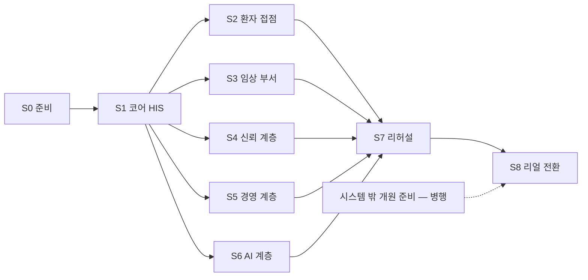

# B AI 기반 HIS 구축 가이드
**B — Build guide for an AI-assisted HIS**

> **EN** — A stage-by-stage playbook, S0 (preparation) through S8 (cutover to real operation). It does not invent a new process: it walks the management screens the HIS already has — opening stages, go-live control, the decision registry, safety gates, outbound-channel control, the continuous monitor and system settings — in build order. ⚠️ **This is a pre-rehearsal draft**: nothing here has been walked through on a fresh install yet, and anything we could not confirm from public material is marked `확인 필요(따라가기)` rather than filled in with invented steps (61 such marks as of 2026-09-15, after a first follow-along install on 2026-09-13~15 and after checking the pinned base commits' code). A generated appendix, [replace-list.md](replace-list.md), lists the code files that still carry another installation's address or institution-identifying strings — paths only, never the strings.

> ⚠️ **초안 — 새 설치본으로 S0~S8 을 한 번 따라가 본 결과를 반영했습니다**(2026-09-13~15 · 개발 PC 한 대 · arm64 · 8GB 가상 머신 · GPU 없음 · 격리 네트워크). **남은 `확인 필요(따라가기)` 61곳**은 x86 · GPU 기준 장비 · 실데이터 규모 · 리얼 전환 · 사람 결정이 필요한 곳입니다.
>
> 기준: [통합 릴리즈 초안](../RELEASES/draft/manifest.md)의 버전 조합 · HIS v4.18.0(기준 커밋 `e9d303984f80`) · 작성 2026-09-11
> 사실 확인: 생태계 자료 측 조사 기준입니다. 시스템 담당 확인 전입니다.

---

## 이 가이드는 무엇인가

이 생태계로 **AI 기반 HIS 를 세우려는 의료기관**이 **어떤 순서로 세우고, 무엇을 설정하고, 사람이 무엇을 정하고, AI 를 어디까지 켜는지** 따라가는 안내서입니다.

새 절차를 만들지 않습니다. HIS 에는 이미 구축 관리 화면이 있습니다. 개원 단계 관리(`/admin/opening`) · 운영 전환 관제(`/admin/go-live`) · 결정 등록부(`/admin/decisions`) · 안전 게이트(`/admin/safety-gates`) · 대외 발신 관제(`/admin/outbound-channels`) · 상시 감시자(`/admin/sentinel`) · 시스템 설정(`/admin/config`)입니다. 이 가이드는 그 화면들을 **단계 순서로 엮은 것**입니다. 각 화면의 항목은 [구축 체크리스트](../checklist/)에 코드에서 뽑아 두었습니다.

## 읽는 법

모든 단계 장은 같은 틀로 씁니다.

| 절 | 담는 것 |
|---|---|
| ① 목적과 완료 조건 | 이 단계가 끝났다고 말할 수 있는 조건 |
| ② 설치 | 구성 요소 · 요구사항 · 명령. 명령은 각 시스템 저장소의 설치 절을 가리키고, 값은 `<자리표시>`로 씁니다 |
| ③ 설정 | 설정 **키 이름** · 기본값의 성격 · 출처 표시(DB / 기본값 / 미설정)를 확인하는 곳 |
| ④ 사람이 정할 것 | [결정 등록부](../checklist/decisions.md)의 결정 키 · 층 · 무엇을 정하나 |
| ⑤ 확인 | 확인 화면과, 이 단계를 닫는 [개원 단계](../checklist/opening.md) · [Go-Live](../checklist/go-live.md) 항목 키 |
| ⑥ 아직 안 되는 것과 대체 수단 | 지금 구현 상태에서 기관이 대체 수단을 준비해야 하는 것([연결 상태](../RELEASES/draft/compatibility.md)의 `미구현` · `중단` · `판정 불가` 포함) |
| ⑦ 흔한 함정 | 저장소 기록과 릴리즈 요약에서 모은 주의점 |

표기 약속:

- `확인 필요(따라가기)` — 공개 자료로 확인하지 못한 명령 · 절차 · 수치입니다. 새 설치본으로 따라가 보면서 확정합니다. 이 표시가 붙은 곳을 **지어낸 절차로 채우지 않았습니다.**
- **값은 싣지 않습니다.** 주소 · 비밀값 · 계정은 `<your-hospital>` · `example.org` · `<비밀값>` 같은 자리표시로 씁니다.
- 연결 상태는 `검증됨`(확인일 필수) · `구현·미검증` · `설계만` · `미구현` · `중단` 으로 적습니다. 이 초안의 연결에는 `검증됨` 이 16개 있습니다(HIS ⇄ sign 직원 서명 · 완료 통지 · 오더 로그 봉인 · HIS ⇄ LIS 검사 오더 · 환자 조회 · 검사 결과 · 오더 취소 · HIS → ERP 직원 SSO · HIS ⇄ edu 직원 SSO · 공개키 조회 · 직원 명부 · 이수 기록 · edu ⇄ sign 이수증 서명 · 완료 통지 · ERP ⇄ sign 외주 계약 서명 · 완료 통지 · 새 설치본끼리 2026-09-14~15) — 나머지는 코드 대조(2026-09-11)입니다.
- AI 는 "보조한다 · 초안을 만든다"로 씁니다. 규제는 `대응 설계` · `자체 점검 완료` · `외부 인증·승인`(증빙이 있을 때만)으로 씁니다.
- **결정 층**은 셋입니다 — **허가권자**(법적 운영 요건) · **원내 위원회**(운영 정책) · **직원**(건별 현장 판단). 하위 층이 상위 층을 대신하지 못합니다.
- 🔴 는 개시 전에 반드시 끝내야 하는 것(결정 등록부의 `개시 전 필수` · Go-Live 의 `개시 차단`)입니다.

## 단계

S2~S6 은 필요한 것만, 필요한 순서로 붙입니다. 13개를 다 세울 필요는 없습니다. 다만 S4(신뢰 계층)의 sign 은 동의서 서명(HIS) · 판독 서명(PACS) · 이수증(edu) · 계약 서명(ERP)이 모두 부르는 곳입니다([연결 상태](../RELEASES/draft/compatibility.md)). 서명을 쓰는 단계보다 먼저 세우는 편이 순서가 꼬이지 않습니다.

| 단계 | 장 | 내용 | 결정 | 개원 단계 | Go-Live |
|---|---|---|---:|---:|---:|
| S0 | [준비](S0-prepare.md) | 제공 조건 확인 · 인프라 확보 · 네트워크 격리 · 기관 프로파일 · 결정 권한자 지정 | 9 | 10 | 0 |
| S1 | [코어 HIS](S1-core-his.md) | 설치 · 기관명·주소 · 코드 마스터 반입 · 부서·병상·직원·역할 · 병원 규정 | 20 | 8 | 8 |
| S2 | [환자 접점](S2-patient-access.md) | 공개 홈페이지 · 환자 포털 · 환자 앱 · 본인확인 · 알림 채널 | 7 | 0 | 1 |
| S3 | [임상 부서](S3-clinical-departments.md) | LIS · PACS 연결 · 장비 인터페이스 · 부서별 대외 보고 | 2 | 8 | 11 |
| S4 | [신뢰 계층](S4-trust.md) | 전자서명 · 인증서 · 타임스탬프 · 동의서 서명 | 0 | 0 | 4 |
| S5 | [경영 계층](S5-management.md) | ERP · 그룹웨어(Clinic) · 교육(edu) · 청구 자격 | 4 | 6 | 8 |
| S6 | [AI 계층](S6-ai.md) | AI Server(GPU 한 장) · **설치 직후 AI 기능을 끄고 결정으로 하나씩 켬** · 환자 AI 활용 동의 · 감독 | 10 | 0 | 15 |
| S7 | [리허설](S7-rehearsal.md) | 가상 데이터로 전 흐름 시연 · 안전 게이트 경고 운영 · 감시자 판정 · 연결 확인 | 3 | 2 | 8 |
| S8 | [리얼 전환](S8-go-real.md) | 가상 데이터 격리 · 실데이터 이관 · 리얼 빌드 · 개시 확인 | 1 | 5 | 5 |
| — | 시스템 밖 병행 준비(아래) | 시설 · 인허가 · 법정 인력 · 정기 운영 · 인증 | 0 | 21 | 0 |
| | | **합계** | **56** | **60** | **60** |

항목을 단계에 나눈 것은 이 가이드의 배정입니다. HIS 화면에는 단계 구분이 없습니다. 결정 등록부의 `개시 전 필수` 11개는 S0 · S1 · S2 · S5 · S6 · S8 에 흩어져 있고, [S8](S8-go-real.md)에서 한 번에 다시 확인합니다.

**부록** — [바꿔야 할 코드 기본값](replace-list.md)(자동 생성): 11개 저장소의 기준 커밋에서 **특정 설치본의 주소**(245파일)와 **기관 식별 문자열**(244파일)이 코드에 박힌 파일의 경로. S0 · S1 · S3 에서 씁니다. 문구는 싣지 않습니다.

### 시스템 밖에서 병행하는 개원 준비

다음 21개 개원 단계 항목은 정보시스템 구축과 별도로 기관이 진행합니다. 시스템은 기록만 받습니다. 🔴 **시스템이 신고 · 허가를 대신 내지 않습니다.** 모두 `사람 기록` 항목이며, [개원 단계 체크리스트](../checklist/opening.md)에 제출처와 선행 관계가 있습니다.

| 묶음 | 항목 키 |
|---|---|
| 설립 · 시설 | `open.facility.standards` · `open.facility.fire` · `open.facility.medwaste` · `open.facility.laundry` · `open.ae.tradeLicense` · `open.ae.drawings` |
| 인허가 | `open.license.establish` · `open.license.bizreg` · `open.ae.facilityLicense` · `open.ae.inspections` |
| 법정 인력 | `open.workforce.safetyOfficer` · `open.workforce.patientSafety` |
| 정기 운영(개원 후) | `open.recurring.committeeMeetings` · `open.recurring.qiReport` · `open.recurring.infectionReport` · `open.recurring.radiationCheck` · `open.recurring.staffEducation` · `open.ae.narcoticReport` · `open.ae.narcoticReportQ` |
| 인증 준비(개원 후) | `open.accred.plan` · `open.accred.selfCheck` |

`open.license.establish`(개설 신고 · 허가)는 요양기관 기호 · 마약류 · 방사선 항목의 선행이고, `open.license.bizreg`(사업자등록)는 기관 기본정보 확정(S1 · S8)의 선행입니다. 선행 표시는 순서를 보여 줄 뿐 화면에서 막지는 않습니다.

## 시작 전에 알아야 할 것 — 요구사항 요약

| 항목 | 지금 말할 수 있는 것 | 근거 |
|---|---|---|
| 컨테이너 실행 환경 | 각 시스템이 데이터베이스 · 캐시 · 서버를 **컨테이너 구성(compose)** 으로 올립니다. 저장소 11곳 가운데 **9곳이 compose 파일을 갖고 있습니다**(AI Server 는 compose 로 올리지 않고, Jitsi 는 Jitsi 자체 구성요소만 올립니다) | 각 저장소의 compose 파일(기준 커밋 · 2026-09-12 확인) |
| 데이터베이스 · 캐시 | **PostgreSQL 16**: HIS · sign · LIS · PACS · twin · edu · Clinic(주 DB) — **PostgreSQL 15**: ERP · Clinic 의 벡터 DB(`pgvector`). **Redis 7**: HIS · LIS · ERP · PACS · twin · cerno · edu · Clinic(sign 은 compose 에 캐시를 두지 않습니다). ⚠️ **한 서버에 다 올리면 PostgreSQL 판본이 두 가지 필요합니다.** **Redis 는 7.4 부터 약관이 달라집니다**(`7-alpine` 태그가 기준일에 7.4.11 을 받음) | 각 저장소 compose 의 이미지 태그를 기준 커밋에서 읽음(2026-09-12) · [THIRD_PARTY.md §1](../THIRD_PARTY.md#1-별도-서비스로-쓰는-제3자-서버) |
| 서버 규모 | 8개 시스템(HIS · PACS · sign · LIS · twin · cerno · edu · Jitsi)이 **8코어 · 16GB 가상 서버 한 대**에 함께 올라가 있었습니다(2026-08-25 운영 기록 · 메모리 약 10GB 사용 · 스왑 여유 없음). **권장 사양이 아니라 하한에 가까운 기록**입니다. 시스템별 권장 사양은 `확인 필요(따라가기)` — 따라가기에서 측정해 싣습니다 | [README](../README.md#최소한의-사양과-구현으로-쓸-수-있게) |
| GPU(선택) | AI 를 쓸 때만 필요합니다. 기준 GPU 는 **소비자용 한 장(NVIDIA RTX 5080 · VRAM 16GB)** 입니다. AI Server 없이도 HIS 는 동작하도록 설계했습니다. GPU 없는 환경의 속도 · 동시 사용자 처리량 · 모델별 응답 시간은 아직 계측이 없습니다 | [S6](S6-ai.md) |
| 네트워크 | 🔴 **첫 기동은 외부로 나가는 연결을 막은 상태에서 합니다.** 각 시스템의 코드와 설정 예시에 특정 설치본의 주소가 기본값으로 들어 있는 파일이 있습니다(11개 저장소 합계 245개 — [파일 목록](replace-list.md) · 문서 제외 · 2026-09-11 기준 커밋). 자기 기관 주소로 바꾸지 않고 띄우면 **다른 설치본으로 요청이 갈 수 있습니다** | [S0](S0-prepare.md) · [S1](S1-core-his.md) |
| 기관명 | HIS 코드에 병원명이 고정 문자열로 남은 파일이 118개 있습니다(2026-09-11 기준 커밋에서 다시 셈 · 09-10 값과 같음). 설정값으로 옮기는 작업이 끝나기 전까지는 **코드를 고쳐야** 자기 병원명이 나옵니다 | [S1](S1-core-his.md) |
| 코드 마스터 · 모델 가중치 | 이 저장소에도 생태계 소스에도 들어 있지 않습니다. **기관이 배포 기관 · 모델 제공처에서 직접 받아 반입**합니다 | [THIRD_PARTY.md §3 · §4](../THIRD_PARTY.md) |
| 대외 기관 전송 | 청구 · 자격조회 · 법정 보고 전송 모듈은 **구현돼 있지 않습니다**. 기관이 모듈을 붙이거나 기존 청구 소프트웨어와 함께 씁니다 | [README](../README.md#지금-알고-시작해야-할-것) |

## 이 가이드가 아직 말하지 않는 것

- **따라가 본 기록.** 이 초안은 저장소와 릴리즈 기록을 읽고 쓴 것입니다. 새 설치본에서 S0~S8 을 실제로 따라가 본 기록이 붙기 전에는 발행본이 아닙니다([ROADMAP](../ROADMAP.md) P1).
- **권장 사양과 성능 수치.** 계측하지 않은 것을 "충분하다"고 쓰지 않습니다.
- **법령 근거와 처리 기한.** 개원 · 인허가 항목의 법령 근거는 기관이 확인해 채웁니다.
- **보안 설계의 상세.** 인증 방식의 계열과 키 관리 책임까지만 적습니다. 운영 보안 점검은 기관이 설치 형태에 맞춰 따로 합니다.

[의료 면책 고지](../DISCLAIMER.md) — 이 소프트웨어는 인허가받은 의료기기가 아닙니다. 임상에 쓸지, 어느 범위에서 쓸지는 구축 기관이 판단합니다.
