# AI 기반 HIS 생태계 — 발표 덱

> 🟡 **초안** — 시스템 담당 확인 전 · 새 설치본 따라가기 전 · 화면 캡처 11장(가상 병원 데이터 · 리허설 설치본)
> 기준: [통합 릴리즈 초안 매니페스트](../RELEASES/draft/manifest.md)(계측일 2026-09-11) · 근거는 [A 개요서](../overview/) · [E 데모 시나리오](../scenarios/)
> 읽는 법 · 변환 방법은 [덱 안내](README.md)

**병원 하나를 돌리는 13개 시스템을, AI 는 보조하고 판단은 사람이 하는 구조로 엮어, 적은 자원으로도 세울 수 있게 오픈 형태로 내놓는 생태계입니다.**

| | |
|---|---|
| 누구에게 | 이 생태계로 AI 기반 HIS 를 세울지 정하는 **병원장 · CIO** |
| 무엇을 | 취지(왜) · 구조(무엇으로) · 구축(어떤 순서로) · **지금 상태** |
| 언제 기준 | 2026-09-11 계측 · 판정 |
| 조건 | 이 자료는 [MIT](../LICENSE) · [의료 면책 고지](../DISCLAIMER.md)가 함께 붙습니다 |
| 화면 | **돌아가는 리허설 설치본에서 찍은 293장**(2026-09-12~13 · 가상 병원 데이터) → [화면으로 보는 생태계](../screens/) |

---

## 이 덱을 읽는 법

**이 덱의 모든 수치는 값 · 센 방법 · 계측일을 함께 적습니다.** 계측하지 않은 것은 "충분하다"고 쓰지 않고 "아직 계측이 없다"고 적습니다.

| 표시 | 뜻 |
|---|---|
| `검증됨` | 실제로 호출해 동작을 확인함(확인일 필수) — **이 초안에는 27개**(HIS ⇄ sign 직원 서명 · 완료 통지 · 오더 로그 봉인 · HIS ⇄ LIS 검사 오더 · 환자 조회 · 검사 결과 · 오더 취소 · HIS → ERP 직원 SSO · HIS ⇄ edu 직원 SSO · 공개키 조회 · 직원 명부 · 이수 기록 · edu ⇄ sign 이수증 서명 · 완료 통지 · ERP ⇄ sign 외주 계약 서명 · 완료 통지 · PACS → sign 판독 서명 · LIS → PACS 병리 워크리스트 · LIS → ERP 검사 청구 · LIS → PACS 병리 뷰어 링크 · LIS → HIS 검사코드 카탈로그 반입 · HIS → ERP 약품 보험코드 매핑 반입 · ERP → HIS 청구 라인 · 재원 조회 · HIS → ERP 진료비 계산서 조회 · ERP → HIS 검진권 정산 지급 회신 · ERP → HIS 의료진 계약 서명 발의 · PACS → sign 조영제 동의서 환자 서명 · 2026-09-14~15) |
| `구현·미검증` | 양쪽 코드가 서로 맞물려 있음. 실제 호출로는 확인 전 |
| `설계만` · `미구현` · `중단` · `판정 불가` | 문서만 있음 · 한쪽 코드 없음 · 지금 동작 안 함 · 배포 구성에 따라 달라 코드만으로 판정 불가 |
| `대응 설계` / `자체 점검 완료` / `외부 인증·승인` | 규제 표기 3단계. **지금은 모두 `대응 설계`** 이고 인증 · 승인 기록은 없습니다 |

- 연결 상태는 [연결 상태 표](../RELEASES/draft/compatibility.md)에서만 옮겼습니다(판정 2026-09-11 · 양쪽 코드를 기준 커밋에서 대조).
- 데모는 **가상 병원 데이터**입니다. 실존 기관 · 환자 · 직원이 아닙니다.
- **AI 는 보조하고 초안을 만듭니다.** 진단 · 처방을 확정하지 않습니다.

---

# Ⅰ. 왜 — 취지

---

## 한 문장

> **병원 하나를 돌리는 데 필요한 13개 시스템을,
> AI 는 보조하고 판단은 사람이 하는 구조로 엮어,
> 적은 자원으로도 세울 수 있게 오픈 형태로 내놓는 생태계입니다.**

| 말 | 뜻 |
|---|---|
| 병원 하나를 돌리는 데 필요한 | 접수 · 처방 · 검사 · 영상 · 약제 · 수납 · 청구 · 회계 · 인사 · 교육까지 |
| 13개 시스템 | 코어 HIS 를 가운데 두고 **7계층** |
| AI 는 보조, 판단은 사람 | AI 연산은 기관 안 **AI Server 한 곳** · 사람이 승인해야 정본 |
| 적은 자원으로도 | 공개 구성요소 · **소비자용 GPU 한 장(16GB)** 기준 · 필요한 것부터 |
| 오픈 형태로 | 이 자료는 MIT. 소스 저장소 라이선스 표기는 아직 정리 중 |

근거: [A 1장](../overview/01-one-sentence.md)

---

## 왜 만들었나 — 문턱을 낮춘다

병원 정보시스템을 갖추는 일은 여전히 크고 비쌉니다. 라이선스 비용 · 전용 하드웨어 · 특정 업체에 묶이는 구조 때문에, **종이와 엑셀로 버티는 의료기관이 세계 곳곳에** 있습니다.

큰 병원만이 아니라 중소 병원 · 의원급 · 공공 보건기관 · 의료 인프라가 부족한 지역의 기관도 **자기 손으로 세우고 운영하는 것**이 목표입니다.

| 설계 선택 | 줄이는 것 |
|---|---|
| 공개 구성요소(PostgreSQL · Redis · Node.js · Python · Orthanc · Ollama)로 짠다 | 상용 DB · 미들웨어 구매 — 단, 구성요소마다 라이선스 조건이 다름 |
| 필요한 시스템부터 붙인다 | 처음부터 13개를 다 세우는 부담 |
| AI 는 기관 안의 GPU 한 장에서 돌린다 | 클라우드 AI 사용료 · 외부 서비스 의존 |
| 병원 규정 값은 코드가 아니라 설정 화면에서 | 규정이 바뀔 때마다 개발자를 부르는 일 |

근거: [A 1장](../overview/01-one-sentence.md)

---

## 취지 8가지

| # | 취지 | 한 줄 |
|---|---|---|
| 1 | AI 는 보조, 판단은 사람 | AI 를 켜도 **책임 구조가 바뀌지 않습니다** |
| 2 | 출처를 말한다 | 값이 사람 · AI · 폴백 · 산출 불가 중 어디서 왔는지 보입니다 |
| 3 | 모르는 것을 아는 척하지 않는다 | 표본이 없으면 0 이 아니라 "산출 불가" |
| 4 | 정본은 하나 | 같은 사실은 한 곳에서만 나옵니다 |
| 5 | 사람이 정할 것은 화면에서 | 결정을 층으로 나누고 등록부 한 곳에 남깁니다 |
| 6 | 도메인마다 독립 시스템, 표준으로 연결 | 필요한 것부터, 바꿔 끼울 수 있게 |
| 7 | 대외 발신은 세 조건 | **구현 + 설정(기본 꺼짐) + 승인** |
| 8 | 개시 전과 후를 모드로 가른다 | 개발 / 리허설 / 리얼 |

근거: [A 2장](../overview/02-principles.md) — 취지마다 "제품에서 보이는 곳"을 함께 적었습니다

---

## 원칙은 말이 아니라 화면에 있습니다

돌아가는 설치본에서 화면 293장을 찍어 보니, **같은 "0" 이라도 왜 0 인지에 따라 화면이 다르게 말합니다**(아홉 가지).

| 왜 값이 없나 | 화면이 적은 말 |
|---|---|
| 표본이 없다 | "표본 0 기준이라 **안전을 의미하지 않습니다**" · 손위생 준수율 **산출 불가**(관찰 기록 없음) |
| 재지 않았다 | "**재지 않았다(0 이 아니다)**" |
| 권한이 없어 못 본다 | "조회하지 않습니다(**비어 있다는 뜻이 아닙니다**)" |
| 계측 자체가 없다 | "0건은 **'없었다'는 뜻이 아닙니다**" |
| 관측 범위 밖이다 | "**여기 없는 통로는 보이지 않습니다**(관측이 아닙니다)" |
| 조회에 한계가 있다 | "서버가 **최근 200건까지만** 반환" |
| 아직 연결되지 않았다 | "**비어 있는 것은 할 일이 없다는 뜻이 아닙니다**" |
| 값을 알 수 없다 | "**추정 시각을 원장에 박지 않습니다**" · 감염상태는 "**미상 그대로 두십시오**" |
| 보냈는데 받았는지 모른다 | 청구 상태가 「제출」인데 **`전송 여부 확인 불가`** |

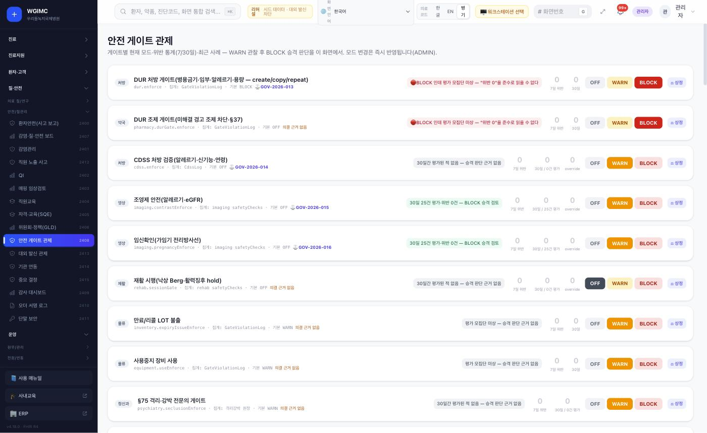

> 안전 게이트는 **차단 모드로 켜 두었어도** 이렇게 적습니다 — 🔴 **"BLOCK 인데 평가 모집단 미상 — '위반 0'을 준수로 읽을 수 없다."**

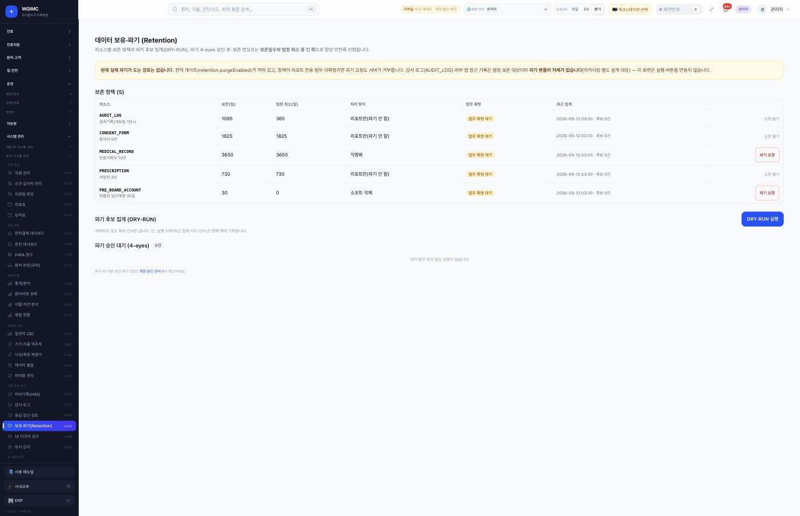

> 되돌릴 수 없는 일에는 **끄는 스위치가 아니라, 버튼 자체를 만들지 않았습니다** — 🔴 **"현재 실제 파기가 되는 경로는 없습니다 … 이 화면은 실행 버튼을 만들지 않습니다."** 돌려 보는 것은 `DRY-RUN`, 실제 파기는 2인 승인.

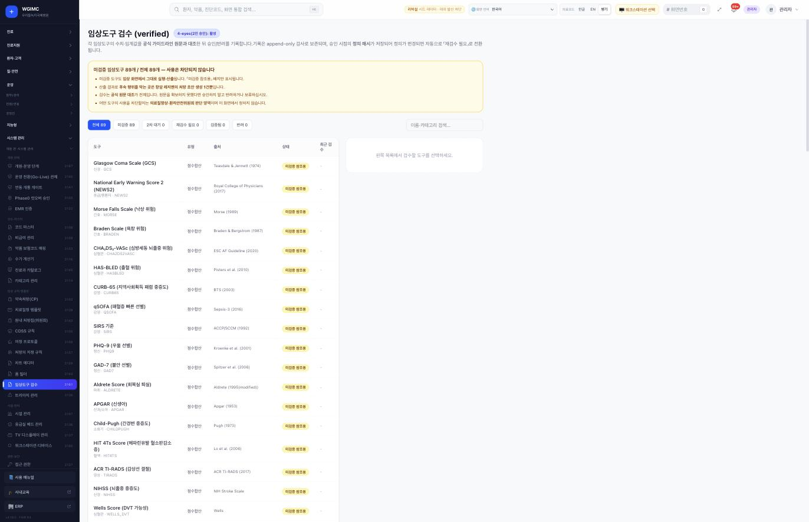

> 검수하지 않은 임상도구 **89개 전부**를 막지 않는 까닭도 화면이 적습니다 — **"어떤 도구의 사용을 차단할지는 의료질향상 · 환자안전위원회 판단 영역이며 이 화면에서 정하지 않습니다."** 코드가 대신 정하지 않고 위원회로 넘깁니다.

근거: [A 2장 취지 3](../overview/02-principles.md#화면이-모른다고-말하는-아홉-가지-방식) · [화면으로 보는 생태계](../screens/)

---

## 원칙에는 비용이 따릅니다 — 얻는 것과 감수하는 것

| 취지 | 기관이 얻는 것 | 기관이 감수하는 것 |
|---|---|---|
| **1. AI 는 보조** | AI 를 들여도 책임 구조가 그대로. "누가 승인했나"를 되짚을 수 있음 | **승인이라는 사람의 단계**가 업무에 들어감. 검토 시간 · 권한 체계를 기관이 마련 |
| **2. 출처를 말한다** | 화면을 믿을 수 있음. AI 칸과 사람 칸을 섞어 읽지 않음 | "폴백" · "산출 불가" · "기본값" 표시가 그대로 보임 → **읽는 법을 직원 교육에** |
| **4. 정본은 하나** | 규정 · 라벨을 한 곳에서 고침 | **HIS 의 중요도가 커짐** — 가용성 · 백업 · 키 관리를 가장 먼저 |
| **5. 결정은 화면에서** | 누가 언제 무엇을 정했는지 남음 | **결정을 미룰 수 없음** — 개시 전 필수 결정 11건 |
| **6. 독립 시스템 + 표준** | 한꺼번에 들이지 않아도 됨. 기존 PACS 를 그대로 연결하는 선택 | **연결이 많음**(113개) — 연결마다 리허설 확인이 기관 몫 |
| **8. 모드로 가른다** | 개시 뒤 시험용 통로가 남지 않음 | 리얼 전환은 토글이 아니라 **별도 절차** — 일정 · 인력 필요 |

근거: [A 2장](../overview/02-principles.md)

---

# Ⅱ. 무엇으로 — 구조

---

## 계층 생태계 지도 — 13개 시스템 · 7계층

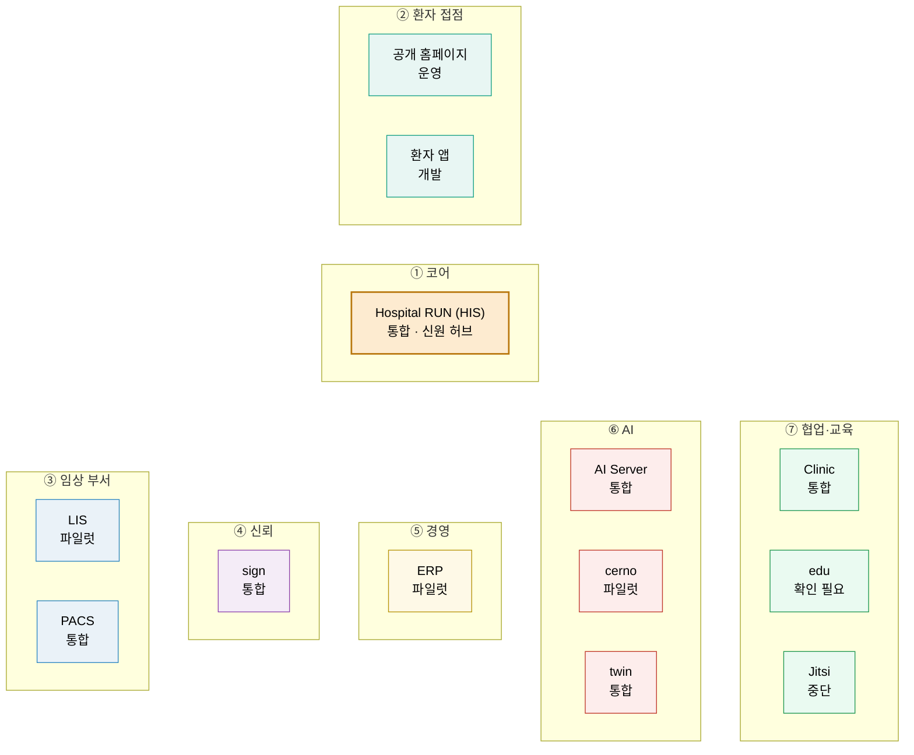

가운데 **코어 HIS** 가 환자 · 진료 · 오더 · 원무의 정본을 갖고 직원 로그인 토큰을 발급하는 **신원 허브**입니다. 나머지 계층은 필요한 것부터 붙입니다. 노드 아래 글자는 매니페스트의 **구현 상태**입니다.

근거: [① 계층 생태계 지도](../diagrams/layers.md) · [A 3장](../overview/03-layers-and-systems.md)

---

## 시스템 13 — 버전과 구현 상태

| 계층 | 시스템 | 한 줄 | 버전 | 상태 |
|---|---|---|---|---|
| ① 코어 | **HIS** | 외래 · 입원 · 수술 · 응급 · 검사 · 약제 · 검진 · 경영지원 통합 · 신원 허브 | `v4.18.0` | `통합` |
| ② 환자 | 공개 홈페이지 / 환자 앱 | 병원 웹사이트 · AI 예약 도우미 / 예약 · 결과 · 동의 · 문진 | `v4.18.0` | `운영` / `개발` |
| ③ 임상 | **LIS** / **PACS** | 진단검사 · 병리 · 수혈 · 유전체 / 웹 PACS · 뷰어 · 판독 | `1.56.18` / `v13.48` | `파일럿` / `통합` |
| ④ 신뢰 | **sign** | 자체 PKI · RFC 3161 타임스탬프 · PAdES-LTA 전자서명 | `1.30.1` | `통합` |
| ⑤ 경영 | **ERP** | 재무회계 · 원가 · 인사급여 · 자재 · 보험청구 · 세무 | `1.287.3` | `파일럿` |
| ⑥ AI | **AI Server** / **twin** / **cerno** | 온프레미스 GPU 통합 AI / 위험 점수 카드 · SBAR / 의료진별 근거 RAG | `2.125.41` / `1.20.88` / `0.1.0` | `통합` / `통합` / `파일럿` |
| ⑦ 협업 | **Clinic** / **edu** / **Jitsi** | 그룹웨어 · 결재 / 이러닝 · 법정교육 / 원격진료 화상 | `1.4.0` / `2.7.0` / `1.0.0` | `통합` / `확인 필요` / **`중단`** |

**소스를 받을 때는 태그 이름이 아니라 매니페스트의 정본 버전 · 기준 커밋을 기준으로 삼습니다** — 13행 중 8행이 태그 · 릴리즈 기록과 어긋납니다.

근거: [통합 릴리즈 초안 매니페스트](../RELEASES/draft/manifest.md)(계측일 2026-09-11) · [A 3장](../overview/03-layers-and-systems.md)

---

## 규모와 서버 — 계측 스냅샷

**계측일 2026-09-11 · 각 저장소의 기준 커밋 내용을 읽어 셈**(저장소 README 의 수치는 쓰지 않았습니다)

| 시스템 | 값 | | 시스템 | 값 |
|---|---|---|---|---|
| HIS | 데이터 모델 562 · API 핸들러 3,251 · 화면 450 | | ERP | 모델 219 · 핸들러 717 · 화면 113 |
| LIS | 모델 84 · 핸들러 356 · 화면 41 | | AI Server | 핸들러 654 |
| PACS | 핸들러 475 · 관리 화면 47 | | twin / cerno | 핸들러 107 · 15화면 / 11 · 3화면 |
| sign | 모델 14 · 핸들러 162 · 화면 38 | | edu / Clinic | 모델 40 · 핸들러 167 / 병원 서비스 화면 16 |

> **API 핸들러 수는 고유 경로 수가 아닙니다.** 언어 · 프레임워크마다 세는 규칙이 달라 **시스템끼리 크기를 견주는 데 쓰지 않습니다.** 이 수치는 "무엇이 있는가"의 크기이지 "얼마나 검증됐는가"가 아닙니다.

**서버는 얼마나 필요한가 — 지금 말할 수 있는 것**

- **실제로 돌아간 기록** — 8개 시스템(HIS · PACS · sign · LIS · twin · cerno · edu · Jitsi)이 **8코어 · 16GB 가상 서버 한 대**에 함께 올라가 있었습니다(2026-08-25 · 메모리 약 10GB 사용 · 스왑 여유 없음). **권장 사양이 아니라 실제로 돌아간 하한에 가까운 기록**입니다.
- **가장 작은 출발점** — 앱 서버 한 대 + GPU 서버 한 대. 영상이 많아지면 PACS 영상 저장소를 따로.
- 📏 **아직 계측이 없는 것** — 시스템별 권장 사양 · 동시 사용자 처리량 · 모델별 응답 시간.

근거: [계측 스냅샷](../data/scale-snapshot.json) · [A 3장](../overview/03-layers-and-systems.md) · [⑧ 배포 구성](../diagrams/deployment.md)

---

## 환자 한 명의 여정 — 경계마다의 연결 상태

**예약 → 접수 → 진료(AI 보조) → 검사 → 병리 영상 → 영상 → 판독 서명 → 동의서 → 수납 · 청구 → 회계 → 결과 열람 → 원격 상담**

| 구간 | 경계 | 상태 |
|---|---|---|
| ① 예약 | 공개 홈페이지 · 환자 앱 → HIS | `구현·미검증` |
| ③ 진료(AI 보조) | HIS → AI Server — **의료진이 승인해야 기록이 됩니다** | `구현·미검증` |
| ④ 검사 | HIS ⇄ LIS (FHIR R4 ServiceRequest · DiagnosticReport) | `구현·미검증` |
| ⑤⑥ 영상 | LIS → PACS(HL7 v2) · HIS → PACS · PACS → 촬영 장비(DICOM) | `구현·미검증` |
| ⑦⑧ 서명 | PACS → sign · HIS ⇄ sign | `구현·미검증` |
| ⑨ 수납 · 청구 | HIS ⇄ ERP | `구현·미검증` |
| ⑫ 원격 상담 | HIS 포털 · 환자 앱 → Jitsi | **`중단`** |

**대체 수단을 준비할 곳** — 대외 기관 청구 · 자격조회 전송 모듈 `미구현` · 문자 발송 제공자 없음(모의 발송) · Jitsi 새로 구성 · HL7 v2 대체 경로 일부 `미구현`.

근거: [③ 환자 여정 스윔레인](../diagrams/patient-journey.md) · [A 4장](../overview/04-patient-journey.md)

---

## 신원 — 직원 한 명의 신원은 HIS 한 곳에서

직원은 HIS 에 로그인합니다. **HIS 가 직원 로그인 토큰을 발급하고**, 형제 시스템이 그 토큰을 검증해 같은 사람으로 받아들입니다.

| 검증 방식 | 시스템 | 기관이 알아 둘 것 |
|---|---|---|
| **공개키로 검증** | sign · PACS · edu · twin · cerno (**5곳**) | 비밀값을 나눠 가질 필요가 없습니다 |
| **공유 비밀키로 검증** | ERP · Jitsi (**2곳**) | **키 관리가 따로 필요** — 양쪽에 같은 값으로 두고 함께 교체 |
| **API 키로 연결** | Clinic (**1곳**) | Clinic 이 범위를 지정한 키를 발급 |

- 입사 · 변경 · 퇴직이 HIS 에서 형제 시스템으로 전해집니다(예: edu 직원 이벤트 웹훅 · Clinic 직원 일괄 등록 — 모두 `구현·미검증`).
- 직원 계정 · 역할을 **HIS 한 곳에서** 관리합니다. 반대로 **HIS 가 멈추면** HIS 신원에 기대는 형제 시스템의 로그인도 영향을 받습니다(edu 는 로그인이 HIS SSO 뿐).
- → **HIS 의 가용성 · 백업 · 키 관리가 생태계 전체의 기반입니다.**

근거: [④ 신원 허브](../diagrams/identity-hub.md) · [A 5장](../overview/05-identity-trust-standards.md)

---

## 신뢰 — 서명 · 인증서 · 타임스탬프는 sign 한 곳에서

"**누가 · 언제 · 무엇에** 서명했고, 그 뒤로 **바뀌지 않았다**"를 제3자가 검증할 수 있게 하는 구조입니다.

| 질문 | 장치 |
|---|---|
| 누가 | 자체 PKI — 서명자별 X.509 인증서를 sign 한 곳에서 발급 |
| 무엇에 | 전자서명 — PDF 는 **PAdES-LTA**(인증서 만료 뒤에도 검증 가능) |
| 언제 | **RFC 3161 타임스탬프** — 공인 TSA 를 계약하면 주소 설정으로 교체 |
| 바뀌지 않았다 | 추가만 되는 **감사 해시체인** — 체인 머리를 타임스탬프로 봉인 |

sign 을 부르는 곳: HIS(동의서 · 발급 문서 · 인증서 발급 · 감사 이벤트) · PACS(판독 서명) · edu(이수증 봉인) · ERP(계약 · 감사) · Clinic(전자결재 감사) — 모두 `구현·미검증`.

> ⚠️ **기관이 준비하는 것** — 기준 버전은 인증 기관 키를 **소프트웨어로 보관**합니다(HSM 미적용). 하드웨어 보안 모듈 · 공인 타임스탬프 기관 · 본인확인 사업자는 구축 기관이 준비합니다. **전자서명의 법적 효력 판단은 구축 기관과 법무가 합니다.**
> **순서 조언** — 동의서 · 판독 · 이수증 · 계약이 모두 sign 을 부르므로, **서명을 쓰는 단계보다 sign 을 먼저** 세웁니다.

근거: [⑤ 신뢰의 사슬](../diagrams/trust-chain.md) · [A 5장](../overview/05-identity-trust-standards.md)

---

## 표준 — 가능한 한 국제 표준으로

| 층 | 표준 | 대표 쓰임 | 상태 |
|---|---|---|---|
| 임상 앱 | **SMART on FHIR** · CDS Hooks | 차트에서 twin · cerno 열기 · 위험 카드 | `구현·미검증` |
| 임상 자원 | **FHIR R4** | HIS ⇄ LIS 오더 · 결과 · Reflex · write-back | `구현·미검증` |
| 영상 | **DICOM**(DIMSE · MWL · MPPS) · DICOMweb · IHE XDS-I.b | PACS ⇄ 촬영 장비 · 외부 PACS | `구현·미검증` |
| 영상 | IHE PIX(HL7 v2 ADT) | HIS → PACS 환자 인구정보 · 병합 | **`미구현`** |
| 메시지 · 장비 | **HL7 v2**(MLLP) | LIS → PACS 병리 스캔 워크리스트 | `구현·미검증` |
| 메시지 · 장비 | HL7 v2 대체 경로 | 결과 ORU · 처방 OML · 판독 결과 송신 | **`미구현`** |
| 장비 | ASTM E1394 | 검사 분석기 → LIS 결과 자동 수집 | **`미구현`** |
| 코드 체계 | LOINC · SNOMED CT · KCD | 시스템 안 코드 · 매핑 | 기관이 받아 옴 |

- **FHIR R4 · DICOM 주 경로는 양쪽 코드가 맞물려 있습니다.** 기존 PACS · 촬영 장비 연결은 이 경로로 봅니다.
- **HL7 v2 로만 말하는 기존 장비 · 시스템이 있다면** S3 에서 연결 방식을 먼저 확인합니다.
- 연결 표의 상당수는 표준 프로파일이 아니라 **전용 HTTPS REST(JSON) · 웹훅**입니다.

근거: [⑥ 표준 층](../diagrams/standards.md) · [A 5장](../overview/05-identity-trust-standards.md)

---

## AI — 한 곳에서, GPU 한 장으로

**AI 연산은 AI Server 한 곳이 맡습니다.** 각 시스템은 AI Server 를 불러 초안 · 분류 보조 · 근거 검색 · 음성 인식을 받습니다.

| 보조 | 무엇을 만드나 | **누가 확정하나** |
|---|---|---|
| 분류(triage) 보조 · DUR 점검 보조 | 제안 | 의료진 · 약사 |
| 진료 기록 초안 · 음성 기록 | 기록 초안 | **의료진이 승인해야 기록이 됨** |
| 약물 · 검진 결과 설명 | 환자용 설명 초안 | 사람이 감수 · 승인하는 화면을 거침 |
| 위험 점수 카드 · SBAR(twin) | 예측 보조 · 초안 | 의료진이 '차트 저장'을 눌러야 HIS 에 저장 |
| 영상 판독 초안(PACS) | 예비 판독문 초안 | 판독의 |

**16GB 를 나눠 쓰는 방식** — 기준은 소비자용 GPU 한 장(NVIDIA RTX 5080 · VRAM 16GB)

| 항목 | 내용 |
|---|---|
| 기본 모델 | 범용 14B 급 하나(실제 적재 약 10.5GB) · 임베딩 약 1GB |
| 운용 방식(설정 한 줄) | **상주**(첫 응답 빠름) 또는 **요청할 때 적재**(쉬는 동안 VRAM 비움 · 5분 미사용 시 내림) |
| 시간대 프로파일 | 진료 시간 범용 14B 상주 + 의료 특화 4B~8B 필요 시 · 진료 외 범용 7B(약 5.0GB) |
| 가속기 | NVIDIA CUDA · Apple Silicon(Metal) · CPU 자동 선택 |

**`local_only`** — 의료 · 개인건강정보 · 규제 관련 작업은 외부 AI 제공자로 보내려 하면 **코드가 거부합니다**. 외부 제공자 자리는 있지만 기본값은 모두 꺼짐.

근거: [⑦ AI 호출 지도](../diagrams/ai-map.md) · [A 6장](../overview/06-ai.md)

---

## AI — 끄고 시작해 결정으로 하나씩 켠다

**AI 서버 없이도 HIS 는 동작합니다.** AI 가 없거나 멈추면 화면이 그 칸을 "폴백" · "산출 불가"로 표시합니다. 그런데 **코드 기본값은 기능마다 다릅니다**(2026-09-11 코드 확인).

| 기본 **켜짐** — 설치 직후 끔 | 기본 **꺼짐** — 꺼져 있는지 확인 |
|---|---|
| HIS 의 AI 기능 전체 스위치 · AI 인사 | 환자 AI 브리핑 야간 배치 · 데이터 품질 AI |
| PACS 영상 자동 선별 | 음성 EMR · 앰비언트 기록 · PACS 판독문 자동 초안 |

**켜는 순서**

1. 설치 직후 "기본 켜짐" 기능을 **끕니다**. 자기 기관 AI Server 주소를 넣기 전에는 AI 를 켜지 않습니다.
2. **선행 결정을 기록합니다** — 의료기기(SaMD) 해당성 · 임상데이터 처리 경계 · 진료 음성 녹음 근거 · 전송 목적지의 법적 한정.
3. **켤 범위를 원내 위원회가 정합니다** — AI 임상 기능 범위는 선행 결정 셋이 먼저 정해져야 하는 **개시 전 필수** 결정입니다.
4. HIS 를 AI Server 에 연결하고 전체 스위치를 켭니다(개별 기능은 아직 꺼짐).
5. **기능을 하나씩** — 결정 기록 → 스위치 → Go-Live 표시 → 감독 화면 확인 → 다음. 켠 순서와 날짜를 남기고, 되돌릴 때도 같은 순서로 끕니다.

AI 계층의 사람 결정 **10개** · 이 단계를 닫는 Go-Live 항목 **15개**(모두 개시를 막지 않는 추적 항목 · HIS v4.18.0 레지스트리 2026-09-11 추출).

근거: [A 6장](../overview/06-ai.md) · [S6 AI 계층](../build-guide/S6-ai.md)

---

## AI — 무엇이 남나 · 모델은 기관이 받는다

**감독 — 무엇이 기록에 남나**

| 어디 | 남는 것 |
|---|---|
| HIS | **AI 제안 원장**(생성 → 승인 · 수정 · 거부) · 모델 릴리즈 기록 · AI 호출 기록 · 환자를 지목한 AI 조회의 감사 기록 |
| HIS 품질 임계 | 임계값 기본 **미설정** — 원내 위원회가 과거 실측에서 정함. 표본이 최소 호출 수보다 적으면 **판정 보류** |
| AI Server / twin | 충실도 · 검색 품질 자기 계측 / 모델이 바뀌면 알림(digest 대조) |

**모델 가중치는 이 저장소에도 소스에도 없습니다. 약관은 MIT 가 아니고 모델마다 다릅니다.**

| 모델 | 쓰는 곳 | 약관에서 눈여겨볼 것 |
|---|---|---|
| Qwen2.5 / Qwen3 계열 | 질의 · 요약 · 분류 · RAG · 도구 호출 | Apache-2.0 |
| **MedGemma 계열** | 영상 판독 **초안** · 구조화 판독 초안 | HAI-DEF — 임상 사용(연구 포함)이면 **관할 규제 기관 승인을 받으라고** 적음 |
| **Med42 · Meditron** | 임상 질의 · 위험 추론 후보 | Llama Community License. **개발사가 추가 검증 없이 임상에 쓰지 말라고 경고** |
| BGE-M3 · Whisper 등 | 임베딩 · 음성 인식 · OCR | MIT · Apache-2.0 계열 |

> 이 소프트웨어는 **어느 국가에서도 의료기기(SaMD 포함)로 인허가를 받지 않았습니다.** 규제 표기는 모두 `대응 설계`이고 `자체 점검 완료` · `외부 인증·승인` 기록은 없습니다.

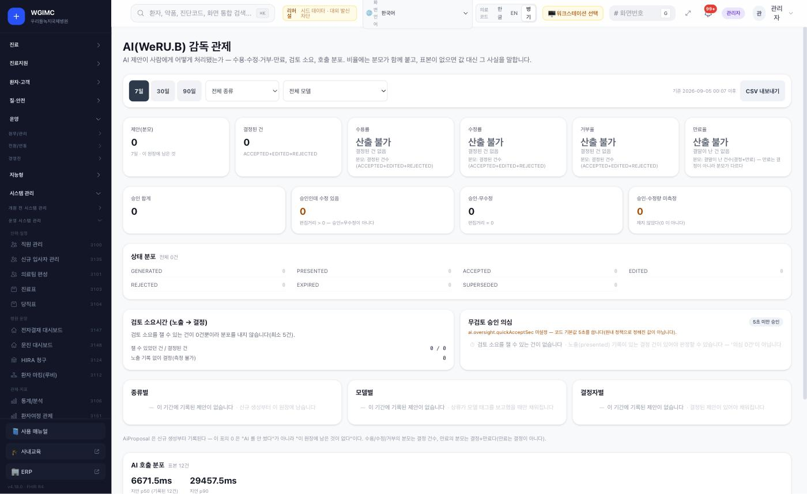

> AI 감독 화면의 부제가 규칙을 먼저 밝힙니다 — **"비율에는 분모가 함께 붙고, 표본이 없으면 값 대신 그 사실을 말합니다."** 이 설치본은 제안 원장이 비어 있어 수용률 · 수정률 · 거부율이 모두 **`산출 불가`** 입니다.

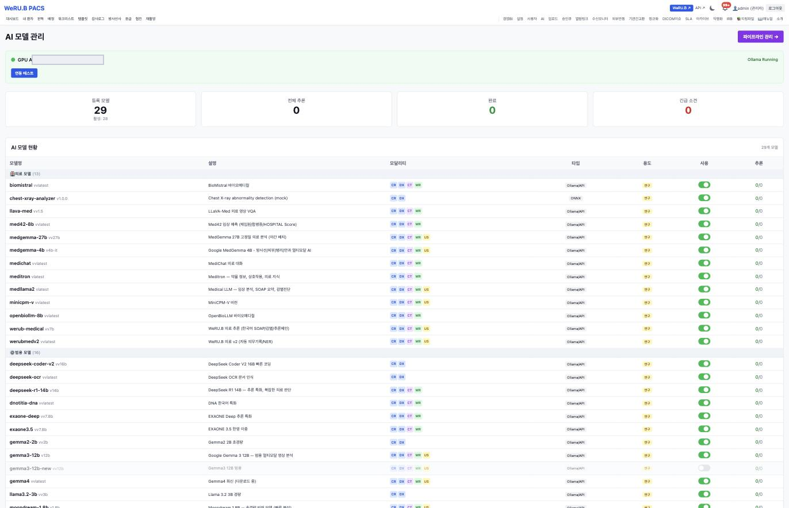

> 기관이 받아 둔 모델은 **의료 · 범용으로 나뉘어 목록**으로 관리되고, **용도 칸이 전부 `보조`** 입니다. 아직 받는 중인 모델은 비활성으로 흐리게 표시됩니다.

근거: [A 6장](../overview/06-ai.md) · [THIRD_PARTY §3](../THIRD_PARTY.md#3-ai-모델-가중치) · [의료 면책 고지](../DISCLAIMER.md) · [화면](../screens/pacs.md)

---

# Ⅲ. 어떻게 세우나 — 구축

---

## 구축은 9단계 — S0 준비 ~ S8 리얼 전환

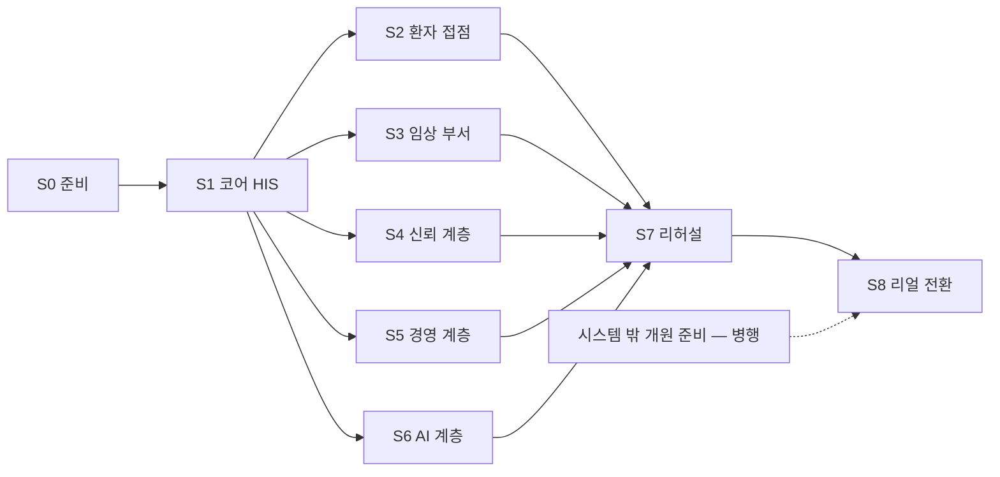

**새 절차를 만들지 않습니다.** HIS 에 이미 있는 구축 관리 화면 — 개원 단계 관리 · Go-Live 관제 · 결정 등록부 · 안전 게이트 · 대외 발신 관제 · 상시 감시자 · 시스템 설정 — 을 **단계 순서로 따라가는 것**입니다.

- **S0 · S1 은 반드시 먼저** — 모든 구축은 코어 HIS 에서 시작합니다.
- **S2~S6 은 필요한 것만, 필요한 순서로** — 13개를 다 세울 필요는 없습니다. 다만 **S4 의 sign 은 먼저**.
- **S7 · S8 은 모두가 모이는 곳** — 가상 병원 데이터로 전 흐름을 돌려 본 뒤 리얼로 전환합니다.

근거: [② 구축 단계 로드맵](../diagrams/build-roadmap.md) · [A 7장](../overview/07-build-path.md) · [B 구축 가이드](../build-guide/)

---

## 단계마다 무엇을 정하고 무엇으로 닫나

| 단계 | 하는 일 | 이 단계에서 사람이 정할 것(대표) | 결정 | 개원 | Go-Live |
|---|---|---|---:|---:|---:|
| S0 준비 | 제공 조건 확인 · 서버 · GPU · DB · **격리 네트워크** · 기관 프로파일 | 결정 권한자 지정 · 어느 나라 기관인가 | 9 | 10 | 0 |
| S1 코어 HIS | 설치 · 기관명 · 코드 마스터 반입 · 부서 · 병상 · 직원 · 규정 | 요양기관 종별 · **코드 마스터를 배포 기관에서 받기** | 20 | 8 | 8 |
| S2 환자 접점 | 공개 홈페이지 · 포털 · 앱 · 본인확인 · 알림 | 환자 알림의 적법 근거 · 문자 처리위탁 · 앱 배포 여부 | 7 | 0 | 1 |
| S3 임상 부서 | LIS · PACS 연결 · 장비 인터페이스 | **기존 PACS 를 연결할지, 새로 세울지** | 2 | 8 | 11 |
| S4 신뢰 계층 | 전자서명 · 인증서 · 타임스탬프 · 동의서 | 공인 TSA · HSM · 본인확인 사업자 · **서명 효력 판단** | 0 | 0 | 4 |
| S5 경영 계층 | ERP · Clinic · edu · 청구 자격 | ERP 로 나가는 환자번호 가명화 여부 | 4 | 6 | 8 |
| S6 AI 계층 | AI Server · **끄고 시작해 결정으로 켬** · 동의 · 감독 | 의료기기 해당성 · 처리 경계 · 녹음 근거 → 임상 기능 범위 | 10 | 0 | 15 |
| S7 리허설 | 가상 데이터 전 흐름 시연 · 안전 게이트 · 연결 확인 | 개시 전 필수 결정 · 개시 차단 항목 점검 | 3 | 2 | 8 |
| S8 리얼 전환 | 가상 데이터 격리 · 실데이터 이관 · 리얼 빌드 · 개시 확인 | 리얼 전환 시점 · 암호화 키 교체 시점 | 1 | 5 | 5 |
| — | **시스템 밖 병행**(시설 · 인허가 · 법정 인력 · 정기 운영 · 인증) | — | 0 | 21 | 0 |
| | **합계** | | **56** | **60** | **60** |

수치: [구축 가이드](../build-guide/README.md#단계)가 HIS 레지스트리 항목을 단계에 배정(HIS v4.18.0 · 2026-09-11 추출). **HIS 화면에는 단계 구분이 없습니다.**

---

## 진행은 사람의 기억이 아니라 화면의 항목으로

| 체크리스트 | HIS 화면 | 항목 | 구성 |
|---|---|---:|---|
| [개원 · 운영 단계](../checklist/opening.md) | `/admin/opening` | **60** | 나라별 KR 45 · AE 48 · 확인 방식 파생 18 · 사람 기록 42 |
| [Go-Live(운영 전환)](../checklist/go-live.md) | `/admin/go-live` | **60** | 판정 실검증 27 · 자가신고 33 · **개시 차단 31** |
| [사람 결정(결정 등록부)](../checklist/decisions.md) | `/admin/decisions` | **56** | 허가권자 17 · 원내 위원회 38 · 직원 1 · **개시 전 필수 11** |

- **실검증** 항목은 시스템이 설정 값 · DB · 결재 기록 · 코드를 직접 읽어 판정합니다. **사람이 "됐다"고 적어도 바뀌지 않습니다.**
- **자가신고** 항목은 담당자가 표시하고, 근거는 화면 밖에 있습니다.
- 기록이 없는 항목은 "미완료"가 아니라 **"기록 없음"** 입니다(취지 3).
- 이 목록은 **전수가 아닙니다.** 종별 · 지역 · 특례에 따라 늘거나 빠지고, 법령 근거와 처리 기한은 기관이 확인해 채웁니다.
- **개원 단계 항목 21개는 시스템 밖에서 병행합니다** — 설립 · 시설 · 인허가 · 법정 인력 · 정기 운영 · 인증 준비. **시스템은 기록만 받고 신고 · 허가를 대신 내지 않습니다.**

세 목록은 HIS 코드에서 그대로 뽑았습니다(HIS v4.18.0 · 기준 커밋 2026-09-11 · 추출일 2026-09-11).

---

## 구축은 이 세 화면에서 진행됩니다

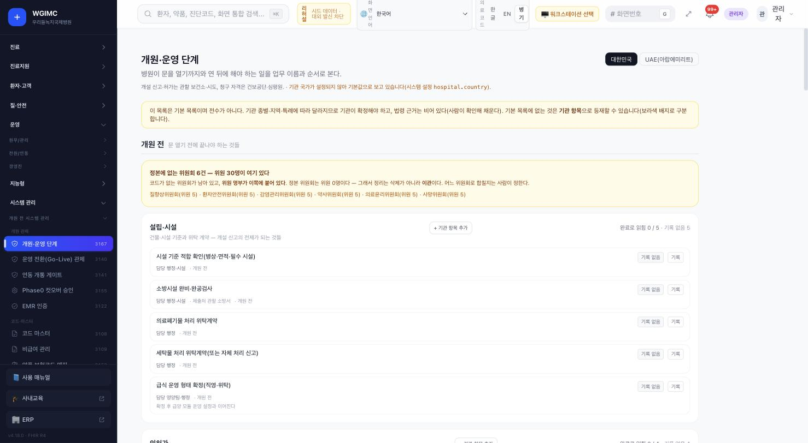

**개원·운영 단계** — 국가 축(대한민국 · UAE)을 고르고, 항목마다 상태가 **`기록 없음`** 으로 섭니다. 화면이 먼저 밝힙니다 — "이 목록은 기본 목록이며 **전수가 아니다**" · "기관 국가가 설정되지 않아 **기본값으로 보고 있습니다**".

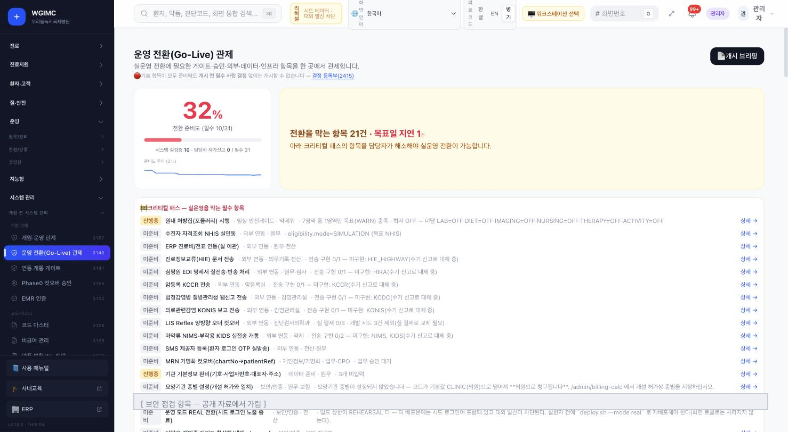

**Go-Live 관제** — 전환 준비도와 **"전환을 막는 항목"** 수를 크게 띄우고, 🔴 **"기술 항목이 모두 준비돼도 개시 전 필수 사람 결정 없이는 개시할 수 없습니다"** 라고 못 박습니다.

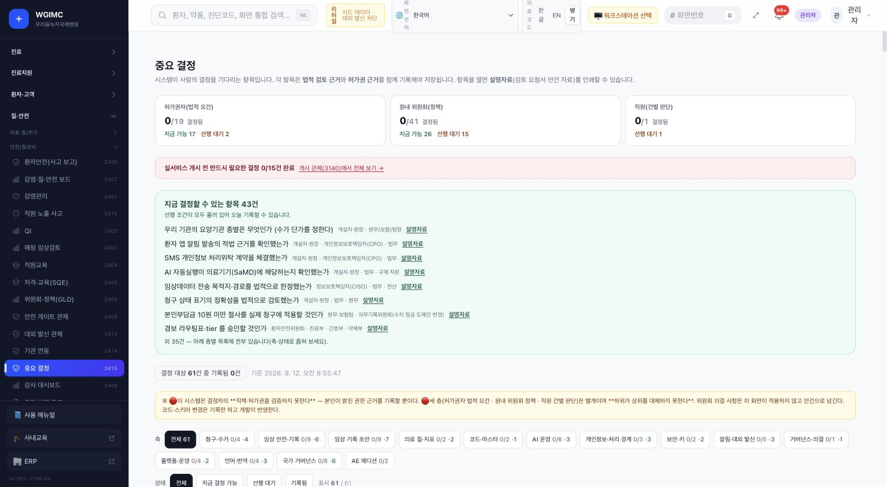

**결정 등록부** — 허가권자 · 원내 위원회 · 직원 세 층이 각각 칸을 가지고, 층마다 `지금 가능` 과 `선행 대기` 를 나눠 셉니다. 🔴 **"이 시스템은 결정자의 정책 · 허가권을 검증하지 못한다. 본인이 밝힌 권한 근거를 기록할 뿐이다."**

---

## 시작 전에 꼭 알아야 할 세 가지

| | |
|---|---|
| **1** | **첫 기동은 외부로 나가는 연결을 막은 상태에서 합니다.** 각 시스템의 코드 · 설정 예시에 특정 설치본의 주소가 기본값으로 든 파일이 **11개 저장소 합계 245개 — [파일 목록](../build-guide/replace-list.md)**(문서 제외 · 2026-09-11 기준 커밋) 있습니다. 바꾸지 않고 띄우면 **다른 설치본으로 요청이 갈 수 있습니다.** |
| **2** | **AI 는 끄고 시작합니다.** 코드 기본값이 켜진 AI 기능이 있습니다. 자기 기관 AI Server 주소를 넣기 전에는 켜지 않습니다. |
| **3** | **리얼 전환은 설정 토글이 아니라 리얼 빌드 배포입니다.** 가상 데이터 격리 → 키 · 인증서 새로 만들기 → 실데이터 이관 → **리얼 빌드 배포** → 개시 확인 순서입니다. 관리 화면의 설정만 바꿔서는 끝나지 않습니다. |

**덧붙여** — HIS 코드에 병원명이 고정 문자열로 남은 파일이 **118개** 있습니다(2026-09-11 기준 커밋에서 다시 셈). 설정값으로 옮기는 작업이 진행 중이며, 끝나기 전까지 자기 병원명을 넣으려면 코드를 고칩니다(S1).

근거: [A 7장](../overview/07-build-path.md) · [S0](../build-guide/S0-prepare.md) · [S8](../build-guide/S8-go-real.md)

---

# Ⅳ. 지금 상태 — 있는 그대로

---

## 실제로 호출해 확인한 연결은 아직 없습니다

| 실은 연결 | `검증됨` | `구현·미검증` | `설계만` | `미구현` | `중단` | `판정 불가` |
|---:|---:|---:|---:|---:|---:|---:|
| **113** | **0** | **88** | 1 | **15** | **7** | 2 |

- 센 방법: [연결 상태 표](../RELEASES/draft/compatibility.md)의 합계(판정 2026-09-11 · 양쪽 코드를 기준 커밋에서 대조 · **실제 호출 확인 없음**). 연결은 방향과 목적별로 나눴습니다.
- 이 밖에 **싣지 않은 연결이 7개** 있습니다 — 시스템 담당의 확인을 기다리는 연결입니다.
- **`중단` 7 은 모두 Jitsi 가 걸린 연결**입니다(HIS ⇄ Jitsi 3 · AI Server ⇄ Jitsi 2 · 환자 앱 ⇄ Jitsi 1 · Clinic ⇄ Jitsi 1).

> ### `구현·미검증`은 "동작한다"는 뜻이 아닙니다.
> "양쪽 코드가 맞물려 있다"까지입니다. 기관은 **리허설(S7)에서 가상 병원 데이터로 흐름을 끝까지 돌려**, 쓰려는 연결마다 확인합니다. `검증됨`(확인일 필수)을 붙이는 일은 새 설치본으로 구축 절차를 따라가며 합니다.

**구축 가이드는 새 설치본으로 한 번 따라가 봤습니다**(2026-09-13~16 · 개발 PC · GPU 없음) — 막힌 곳과 우회를 반영했지만 기준 장비 · 실데이터 규모 · 리얼 전환은 아직입니다. 확인하지 못한 명령 · 절차 · 수치는 `확인 필요(따라가기)`로 표시했고, **지어낸 절차로 채우지 않았습니다.**

근거: [A 8장](../overview/08-status-and-preparation.md)

---

## 시스템별 구현 상태

| 구현 상태 | 시스템 | 수 |
|---|---|---:|
| `운영` | 공개 홈페이지(공개 사이트로 쓰이는 중) | 1 |
| `통합` | HIS(리허설 모드) · sign · PACS · AI Server(의료 기능 기준) · twin · Clinic(병원 서비스만) | **6** |
| `파일럿` | LIS · ERP(문서마다 표기가 엇갈려 재확인 대상) · cerno(섀도우 · 비임상) | 3 |
| `개발` | 환자 앱(스토어 미배포) | 1 |
| `확인 필요` | edu(운영 여부 재확인 전) | 1 |
| `중단` | Jitsi(현재 설치본이 동작하지 않음 · 구축 기관은 새로 구성) | 1 |

센 방법: [매니페스트](../RELEASES/draft/manifest.md) 13행의 구현 상태 칸을 상태별로 셈(근거: **2026-09-11 생태계 자료 측 조사 · 시스템 담당 확인 전**). 기능군마다 상태가 다를 수 있습니다.

**버전 표기에 관해** — 매니페스트 13행 가운데 **8행**이 태그 · 릴리즈 기록과 정본이 다릅니다(같은 저장소에서 릴리즈되는 HIS · 공개 홈페이지 · 환자 앱 세 행 포함). 소스를 받을 때는 **정본 버전과 기준 커밋**을 기준으로 삼습니다.

---

## 지금 알고 시작해야 할 것

| 항목 | 지금 상태 | 구축 기관이 할 일 |
|---|---|---|
| **대외 기관 전송**(청구 · 자격조회 · 감염병 신고) | 전송 모듈이 **구현돼 있지 않습니다.** HIS 는 청구서 작성까지 | 전송 모듈을 붙이거나 기존 청구 소프트웨어와 함께 씁니다 |
| **문자 발송 제공자** | 등록돼 있지 않습니다 — 환자 본인확인 문자는 **모의 발송** | 문자 발송 제공자와 처리위탁 계약(S2) |
| **전자서명 키 보관** | 인증 기관 키를 **소프트웨어로 보관**(HSM 미적용) | HSM · 공인 TSA · 본인확인 업체 연동 준비(S4) |
| **원격 화상(Jitsi)** | 현재 설치본은 **동작하지 않습니다** | 새로 구성합니다 |
| **로그인 방식** | 공개키 5곳 · 공유 비밀키 2곳 · API 키 1곳 | 공유 비밀키 쪽은 **키 관리를 따로** |
| **기관명 설정** | HIS 코드에 병원명 고정 문자열 **118개 파일** | 끝나기 전까지 자기 병원명을 넣으려면 코드를 고칩니다(S1) |
| **기관 주소 설정** | 특정 설치본 주소가 기본값으로 든 파일 **245개**(11개 저장소) — [파일 목록](../build-guide/replace-list.md) | 설치 전에 바꾸고, **첫 기동은 외부 연결을 막은 상태에서**(S0 · S1) |

- 화면 번역은 한국어가 기본이고 영어 · 일본어 카탈로그가 있으며 아랍어는 준비 중 — **지금 번역은 모두 AI 초안이고 사람 검수를 마친 것이 없습니다**(검수 흐름은 있음).
- 국가 축은 현재 **한국 · UAE 두 곳**입니다. 그 밖의 나라는 코드 마스터 · 청구 규칙 · 언어 팩을 새로 붙입니다.

근거: [A 8장](../overview/08-status-and-preparation.md) · [README 「지금 알고 시작해야 할 것」](../README.md#지금-알고-시작해야-할-것)

---

## 구축 기관이 준비할 것 — 시스템이 대신해 주지 않는 것

**사람과 결정**

- 결정 권한자 지정 — 허가권자 · 원내 위원회 · 직원의 세 층(S0)
- **개시 전 필수 결정 11건** 기록
- AI 를 켤 범위와 선행 결정 — 의료기기 해당성 · 임상데이터 처리 경계 · 진료 음성 녹음 근거 · 전송 목적지 한정
- **의료기기 · 소프트웨어 인허가와 개인정보 규제 판단** — 각 나라 규정에 따라 **구축 기관이 합니다**

**인프라 · 데이터 · 모델**

- 앱 서버 · GPU 서버 · 데이터베이스 · 백업 저장소 — **권장 사양은 계측이 없으므로 리허설에서 기관 규모로 측정**
- 첫 기동용 **격리 네트워크**(S0)
- **코드 마스터**(약품 · 진단 · 수가 · 검사 코드) — 나라마다 다르고, 기관이 배포 기관에서 직접 받아 반입(S1)
- **AI 모델 가중치** — 모델마다 약관을 읽고 직접 받음(S6) · 실데이터 이관 계획(S8)

**외부 계약과 대체 수단**

- 대외 기관 전송 모듈 또는 기존 청구 소프트웨어 · 문자 발송 제공자 · 처리위탁 계약
- 공인 타임스탬프 기관 · 하드웨어 보안 모듈 · 본인확인 사업자 · 원격 화상을 쓰려면 Jitsi 새로 구성
- `미구현`인 연결 가운데 기관에 필요한 것의 대체 수단(예: 검사 분석기 자동 수집 · HL7 v2 경로)

근거: [A 8장](../overview/08-status-and-preparation.md)

---

# Ⅴ. 데모로 보기

---

## 데모 시나리오 4 — 가상 병원에서

진료 한 건이 어느 시스템을 거치고, **어디서 사람이 정하며**, AI 가 어디서 돕는지를 한 번에 봅니다. 병원은 **"데모 병원"** 이라고만 부르고, 등장 인물은 **역할로만** 적습니다(의사A · 간호사A · 환자A …).

| # | 시나리오 | 한 줄 | 단계 |
|---|---|---|---:|
| 01 | [외래 환자 한 명의 여정](../scenarios/01-outpatient-journey.md) | 예약 → 접수 → 진료(AI 보조) → 검사 → 영상 → 판독 서명 → 동의서 → 수납 · 청구 → 결과 열람 → 원격 상담 | 34 |
| 02 | [응급](../scenarios/02-emergency.md) | 미확인 환자 등록 → 분류 보조 → 긴급 검사 · 영상 → 위급값 · 위급 소견 → Code Blue → 수혈 → 전원 또는 입원 | 25 |
| 03 | [건강검진](../scenarios/03-health-checkup.md) | 예약 → 문진 → 접수 → 동선 QR → 스테이션 → 판정 → AI 설명 초안 → 결과서 → 추적 관리 | 24 |
| 04 | [입원에서 퇴원까지](../scenarios/04-inpatient-to-discharge.md) | 입원 → 동의서 → 수술 · 병리 → 간호 · 투약(MAR · 바코드) → 위험 점수 카드 → 퇴원 → 수납 · 청구 | 36 |

**시나리오별 연결 상태 합계**(각 단계 표의 첫 표시를 행마다 하나씩 셈 · 2026-09-11)

| 시나리오 | `구현·미검증` | `미구현` | `중단` | `시스템 안` | `확인 중` |
|---|---:|---:|---:|---:|---:|
| 01 외래 | 23 | 3 | 2 | 6 | 0 |
| 02 응급 | 13 | 0 | 0 | 9 | 3 |
| 03 검진 | 12 | 1 | 0 | 9 | 2 |
| 04 입원→퇴원 | 23 | 1 | 0 | 11 | 1 |

**`확인 중`** = 시스템 경계를 넘는 일인데 연결 상태 표에 그 연결이 없는 것. **지어내지 않고 확인을 기다립니다.**
데모 병원 이름은 **위루비병원**입니다. 화면 캡처는 52 자리 중 44 에 들어왔습니다(가상 병원 데이터) — [시나리오 안내](../scenarios/README.md#화면-캡처).

---

## 권한은 화면으로 드러납니다

같은 설치본에 **역할만 바꿔** 들어가 같은 자리를 찍었습니다. **지표 숫자는 똑같고, 다른 것은 볼 수 있는 메뉴와 첫 화면입니다.**

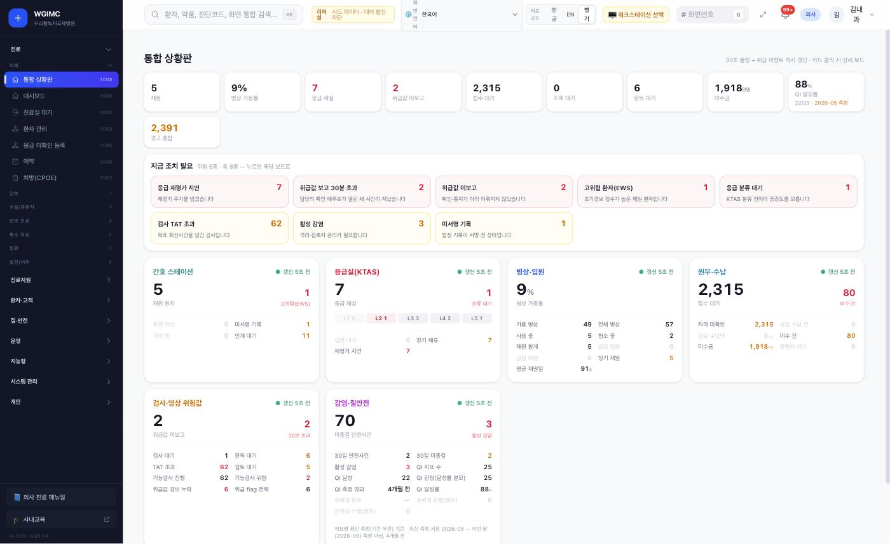

**의사** — 외래 메뉴에 `접수` 와 `외국인 환자 등록` 이 **없습니다**. 도움말이 「의사 진료 매뉴얼」로 바뀝니다.

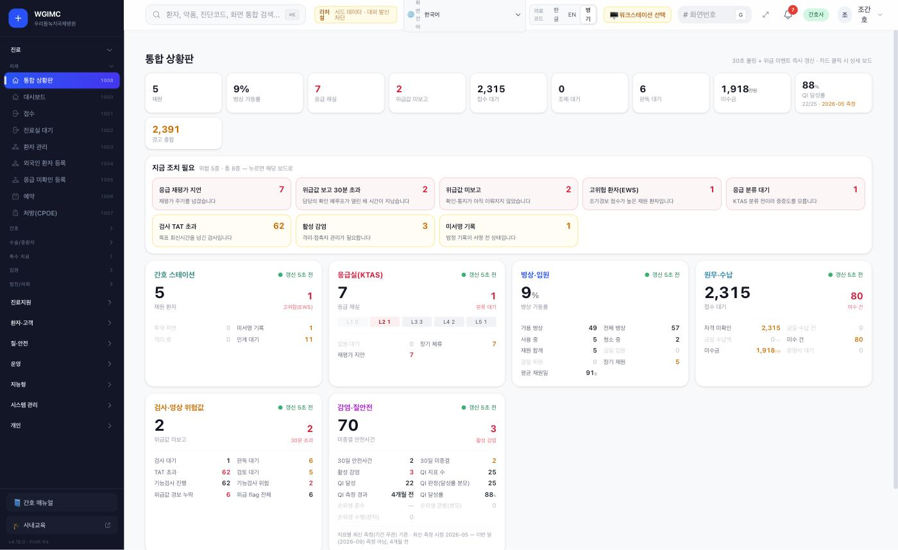

**간호사** — 같은 화면인데 `접수` 와 `외국인 환자 등록` 이 **있습니다**. 도움말은 「간호 매뉴얼」.

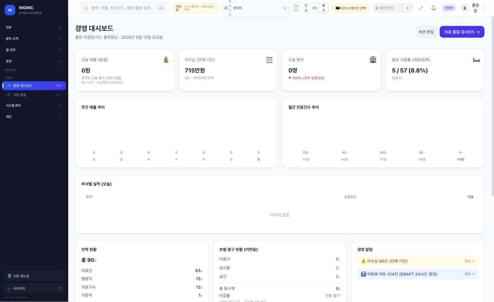

**경영진** — **첫 화면 자체가 달라집니다.** 경영 대시보드로 들어가고 메뉴가 크게 줄어듭니다. 여기서도 "전주비 **산출 불가**(표본 없음)" · 삭감률 "**산출 불가**".

근거: [화면으로 보는 생태계 — 사람을 넣고 빼는 일](../screens/by-onboarding.md#역할이-바뀌면-화면이-바뀐다)

---

## 외래 환자 한 명 — 34단계를 한 장으로

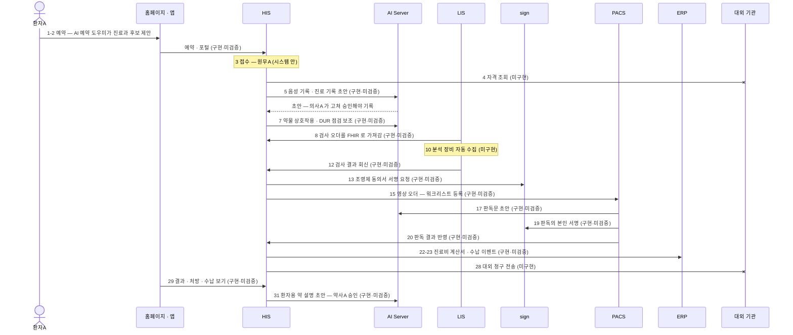

**사람이 정하는 곳** — 의사A 가 AI 기록 초안을 고쳐 승인 · 판독의A 가 판독 확정과 본인 서명 · 약사A 가 환자용 약 설명 초안 감수 · 원무A 가 청구서 작성.
**대체 수단이 필요한 곳** — 자격 조회 · 대외 청구 전송(`미구현`) · 분석 장비 자동 수집(`미구현`) · 원격 상담(`중단`).

근거: [시나리오 01](../scenarios/01-outpatient-journey.md)(전체 34단계 · 화면 이름 · 결정 지점 포함)

---

# Ⅵ. 조건과 다음

---

## 제공 조건 — 세 겹으로 보면

| 겹 | 무엇 | 조건 |
|---|---|---|
| ① 이 저장소 | 소개 · 구축 자료 | **[MIT](../LICENSE)** · Copyright (c) 2026 Sean Shin (신현묵) |
| ② 생태계 소프트웨어 | 13개 시스템의 자체 코드 | MIT 로 제공하는 것이 **목표**입니다. **각 소스 저장소의 표기는 아직 MIT 로 정리되지 않았습니다**(독점 7 · UNLICENSED 1 · 혼재 1 · 표기 없음 4) |
| ③ MIT 가 덮지 않는 것 | 제3자 서버 · 고쳐 쓰는 제3자 코드 · **AI 모델 가중치** · **코드 마스터** | 각자의 조건 — [THIRD_PARTY.md](../THIRD_PARTY.md) |

**특히 법무와 함께 볼 것**

| 구성요소 | 원문이 적는 사실 |
|---|---|
| Grafana · Metabase · Orthanc 플러그인 | **AGPL-3.0 계열** — 제13조는 수정본을 네트워크로 제공하는 경우를 다룹니다 |
| Orthanc 코어 / browserless(v1) | GPL-3.0-or-later / GPL 또는 **상용 라이선스**(폐쇄 소스 상업 용도) |
| **Redis 7** | 7.4.x 부터 **RSALv2 또는 SSPLv1 중 선택** · 7.2 이하는 BSD-3-Clause |
| SNOMED CT · KCD · LOINC | 한국은 SNOMED International 회원국(2020-08) — **국가 배포 센터(NRC)에 사용 등록**. KCD 제9차가 2026-01-01 시행 중인데 기준 버전 표기는 제8차 |

**의료 면책 다섯 가지** — ① 의료기기가 아닙니다 ② **적합성 판단과 인허가는 구축 기관의 책임** ③ AI 산출물은 보조 정보 ④ 데모 데이터는 가상 ⑤ 구현 상태는 기준 버전에서의 사실.

> 이 장은 **법률 검토가 아닙니다.** 라이선스 이름 · 원문이 적는 사실 · 원문 위치만 옮깁니다.

근거: [A 9장](../overview/09-terms.md) · [DISCLAIMER.md](../DISCLAIMER.md) · [THIRD_PARTY.md](../THIRD_PARTY.md)

---

## 다음 — 무엇이 남았고, 어디를 읽나

**이 자료에 남은 일**

| 남은 일 | 그러면 무엇이 바뀌나 |
|---|---|
| 새 설치본으로 **S0~S8 을 따라가 봄** | 연결에 `검증됨`과 확인일이 붙고, `확인 필요(따라가기)` 표시가 사라지고, 권장 사양 · 처리량 수치가 붙습니다 |
| **시스템 담당의 사실 확인** | "시스템 담당 확인 전" 표시가 빠지고, 싣지 않은 연결 7개가 표에 들어옵니다 |
| **통합 릴리즈 번호 확정** | 기준이 `RELEASES/draft` 에서 번호 붙은 릴리즈로 옮겨 갑니다 |
| 위루비병원 설정 설치본 · **남은 화면 캡처** | 시나리오 캡처 8 자리가 채워집니다 |

**역할별로 이어 읽을 것**

| 역할 | 다음 문서 |
|---|---|
| 병원장 · CIO | [A 개요서 2 · 3 · 8 · 9장](../overview/) · [사람 결정 체크리스트](../checklist/decisions.md) · [통합 릴리즈 매니페스트](../RELEASES/draft/manifest.md) |
| 전산 · 인프라팀 | [B 구축 가이드 S0 · S1](../build-guide/) · [C 시스템 구성서](../systems/) · [⑧ 배포 구성](../diagrams/deployment.md) · [THIRD_PARTY.md](../THIRD_PARTY.md) |
| 의료정보 · 임상 리더 | [E 데모 시나리오](../scenarios/) · [③ 환자 여정](../diagrams/patient-journey.md) · [HIS 구성서](../systems/his.md) · [개원 체크리스트](../checklist/opening.md) |
| AI · 거버넌스 · 법무 | [S6 AI 계층](../build-guide/S6-ai.md) · [⑦ AI 호출 지도](../diagrams/ai-map.md) · [THIRD_PARTY §3](../THIRD_PARTY.md#3-ai-모델-가중치) · [의료 면책](../DISCLAIMER.md) |
| 연동 개발자 · 파트너 | [연결 상태 표](../RELEASES/draft/compatibility.md) · [연결 지도](../diagrams/connections.md) · [⑥ 표준 층](../diagrams/standards.md) · [④ 신원 허브](../diagrams/identity-hub.md) |

모르는 말이 나오면 [용어집](../glossary.md). 제작 계획과 진행은 [ROADMAP](../ROADMAP.md).

---

## 한 장으로 남길 말

> **13개 시스템 · 7계층. 코어 HIS 가 정본이자 신원 허브.**
> **AI 는 기관 안 GPU 한 장에서 돌고, 초안만 만듭니다. 승인은 사람이 합니다.**
> **구축은 S0~S8 아홉 단계 — 결정 56 · 개원 60 · Go-Live 60 을 화면의 항목으로 닫습니다.**
>
> **그리고 지금, 실제로 호출해 확인한 연결은 0 개입니다.**
> 코드가 맞물린 연결이 88개 있을 뿐입니다. 리허설에서 하나씩 확인하는 일이 남아 있습니다.
>
> 이 자료는 모르는 것을 아는 척하지 않습니다. 그래서 아는 것을 믿을 수 있습니다.

[README](../README.md) · [ROADMAP](../ROADMAP.md) · [MIT](../LICENSE) · [의료 면책 고지](../DISCLAIMER.md)
