# AI 기반 HIS 생태계 — 발표 덱

> 🟡 **초안** — 시스템 담당 확인 전 · **새 설치본 따라가기 1차 완료**(2026-09-13~16 · 연결 `검증됨` 27) · 화면 캡처 11장(가상 병원 데이터 · 리허설 설치본)
> 기준: [통합 릴리즈 `2026.09` 매니페스트](../RELEASES/2026.09/manifest.md)(계측일 2026-09-13) · 근거는 [A 개요서](../overview/) · [E 데모 시나리오](../scenarios/)
> 읽는 법 · 변환 방법은 [덱 안내](README.md)

> **EN** — Presentation deck: intent, structure, build path, current status, demo scenarios and the conditions an institution should know before starting. Status slides carry the same numbers as the connection status table — verified connections are counted against the full denominator, and screenshots come from a rehearsal install with synthetic hospital data.

**병원 하나를 돌리는 13개 시스템을, AI 는 보조하고 판단은 사람이 하는 구조로 엮어, 적은 자원으로도 세울 수 있게 오픈 형태로 내놓는 생태계입니다.**

| | |
|---|---|
| 누구에게 | 이 생태계로 AI 기반 HIS 를 세울지 정하는 **병원장 · CIO** |
| 무엇을 | 취지(왜) · 구조(무엇으로) · 구축(어떤 순서로) · **지금 상태** |
| 언제 기준 | 2026-09-11 계측 · 판정 · **2026-09-13~16 새 설치본 따라가기**(연결 `검증됨` 27) |
| 조건 | 이 자료는 [MIT](../LICENSE) · [의료 면책 고지](../DISCLAIMER.md)가 함께 붙습니다 |
| 화면 | **돌아가는 리허설 설치본에서 찍은 293장**(2026-09-12~13 · 가상 병원 데이터) → [화면으로 보는 생태계](../screens/) |

---

## 이 덱을 읽는 법

**이 덱의 모든 수치는 값 · 센 방법 · 계측일을 함께 적습니다.** 계측하지 않은 것은 "충분하다"고 쓰지 않고 "아직 계측이 없다"고 적습니다.

| 표시 | 뜻 |
|---|---|
| `검증됨` | 실제로 호출해 동작을 확인함(확인일 필수) — **이 초안에는 27개** — 목록은 [따라가 본 결과](../build-guide/follow-along-2026-09.md#실제로-호출해-검증됨-을-붙인-연결) 한 곳에 있습니다 |
| `구현·미검증` | 양쪽 코드가 서로 맞물려 있음. 실제 호출로는 확인 전 |
| `설계만` · `미구현` · `중단` · `판정 불가` | 문서만 있음 · 한쪽 코드 없음 · 지금 동작 안 함 · 배포 구성에 따라 달라 코드만으로 판정 불가 |
| `대응 설계` / `자체 점검 완료` / `외부 인증·승인` | 규제 표기 3단계. **지금은 모두 `대응 설계`** 이고 인증 · 승인 기록은 없습니다 |

- 연결 상태는 [연결 상태 표](../RELEASES/2026.09/compatibility.md)에서만 옮겼습니다(코드 대조 2026-09-11 · 그 가운데 **27개는 새 설치본끼리 실제로 호출해 확인** 2026-09-14~15 · 확인일 칸).
- 데모는 **가상 병원 데이터**입니다. 실존 기관 · 환자 · 직원이 아닙니다.
- **AI 는 보조하고 초안을 만듭니다.** 진단 · 처방을 확정하지 않습니다.

---

# Ⅰ. 왜 — 취지

---

## 한 문장

> **병원 하나를 돌리는 데 필요한 13개 시스템을,
> AI 는 보조하고 판단은 사람이 하는 구조로 엮어,
> 적은 자원으로도 세울 수 있게 오픈 형태로 내놓는 생태계입니다.**

| 말 | 뜻 |
|---|---|
| 병원 하나를 돌리는 데 필요한 | 접수 · 처방 · 검사 · 영상 · 약제 · 수납 · 청구 · 회계 · 인사 · 교육까지 |
| 13개 시스템 | 코어 HIS 를 가운데 두고 **7계층** |
| AI 는 보조, 판단은 사람 | AI 연산은 기관 안 **AI Server 한 곳** · 사람이 승인해야 정본 |
| 적은 자원으로도 | 공개 구성요소 · **소비자용 GPU 한 장(16GB)** 기준 · 필요한 것부터 |
| 오픈 형태로 | 이 자료는 MIT. 소스 저장소 라이선스 표기는 아직 정리 중 |

근거: [A 1장](../overview/01-one-sentence.md)

---

## 왜 만들었나 — 문턱을 낮춘다

병원 정보시스템을 갖추는 일은 여전히 크고 비쌉니다. 라이선스 비용 · 전용 하드웨어 · 특정 업체에 묶이는 구조 때문에, **종이와 엑셀로 버티는 의료기관이 세계 곳곳에** 있습니다.

큰 병원만이 아니라 중소 병원 · 의원급 · 공공 보건기관 · 의료 인프라가 부족한 지역의 기관도 **자기 손으로 세우고 운영하는 것**이 목표입니다.

| 설계 선택 | 줄이는 것 |
|---|---|
| 공개 구성요소(PostgreSQL · Redis · Node.js · Python · Orthanc · Ollama)로 짠다 | 상용 DB · 미들웨어 구매 — 단, 구성요소마다 라이선스 조건이 다름 |
| 필요한 시스템부터 붙인다 | 처음부터 13개를 다 세우는 부담 |
| AI 는 기관 안의 GPU 한 장에서 돌린다 | 클라우드 AI 사용료 · 외부 서비스 의존 |
| 병원 규정 값은 코드가 아니라 설정 화면에서 | 규정이 바뀔 때마다 개발자를 부르는 일 |

근거: [A 1장](../overview/01-one-sentence.md)

---

## 취지 8가지

| # | 취지 | 한 줄 |
|---|---|---|
| 1 | AI 는 보조, 판단은 사람 | AI 를 켜도 **책임 구조가 바뀌지 않습니다** |
| 2 | 출처를 말한다 | 값이 사람 · AI · 폴백 · 산출 불가 중 어디서 왔는지 보입니다 |
| 3 | 모르는 것을 아는 척하지 않는다 | 표본이 없으면 0 이 아니라 "산출 불가" |
| 4 | 정본은 하나 | 같은 사실은 한 곳에서만 나옵니다 |
| 5 | 사람이 정할 것은 화면에서 | 결정을 층으로 나누고 등록부 한 곳에 남깁니다 |
| 6 | 도메인마다 독립 시스템, 표준으로 연결 | 필요한 것부터, 바꿔 끼울 수 있게 |
| 7 | 대외 발신은 세 조건 | **구현 + 설정(기본 꺼짐) + 승인** |
| 8 | 개시 전과 후를 모드로 가른다 | 개발 / 리허설 / 리얼 |

근거: [A 2장](../overview/02-principles.md) — 취지마다 "제품에서 보이는 곳"을 함께 적었습니다

---

## 원칙은 말이 아니라 화면에 있습니다

돌아가는 설치본에서 화면 293장을 찍어 보니, **같은 "0" 이라도 왜 0 인지에 따라 화면이 다르게 말합니다**(아홉 가지).

| 왜 값이 없나 | 화면이 적은 말 |
|---|---|
| 표본이 없다 | "표본 0 기준이라 **안전을 의미하지 않습니다**" · 손위생 준수율 **산출 불가**(관찰 기록 없음) |
| 재지 않았다 | "**재지 않았다(0 이 아니다)**" |
| 권한이 없어 못 본다 | "조회하지 않습니다(**비어 있다는 뜻이 아닙니다**)" |
| 계측 자체가 없다 | "0건은 **'없었다'는 뜻이 아닙니다**" |
| 관측 범위 밖이다 | "**여기 없는 통로는 보이지 않습니다**(관측이 아닙니다)" |
| 조회에 한계가 있다 | "서버가 **최근 200건까지만** 반환" |
| 아직 연결되지 않았다 | "**비어 있는 것은 할 일이 없다는 뜻이 아닙니다**" |
| 값을 알 수 없다 | "**추정 시각을 원장에 박지 않습니다**" · 감염상태는 "**미상 그대로 두십시오**" |
| 보냈는데 받았는지 모른다 | 청구 상태가 「제출」인데 **`전송 여부 확인 불가`** |

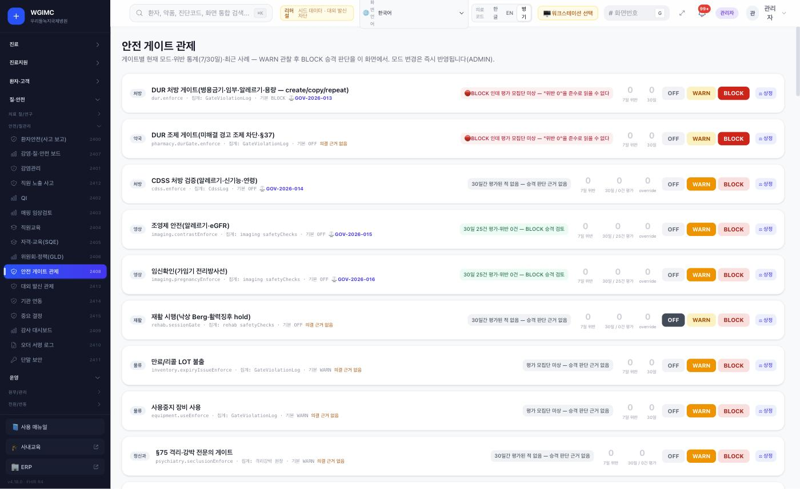

> 안전 게이트는 **차단 모드로 켜 두었어도** 이렇게 적습니다 — 🔴 **"BLOCK 인데 평가 모집단 미상 — '위반 0'을 준수로 읽을 수 없다."**

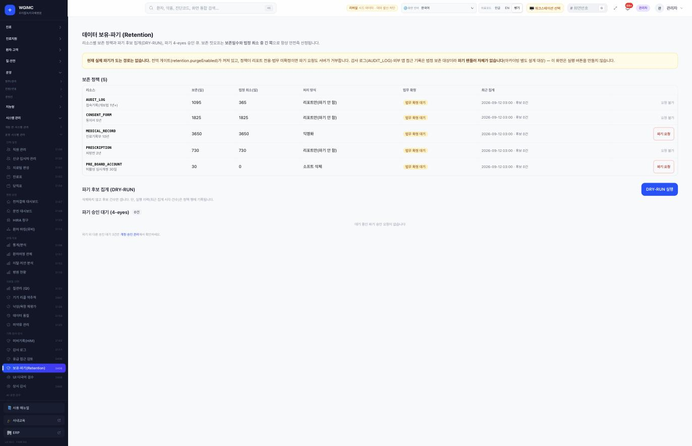

> 되돌릴 수 없는 일에는 **끄는 스위치가 아니라, 버튼 자체를 만들지 않았습니다** — 🔴 **"현재 실제 파기가 되는 경로는 없습니다 … 이 화면은 실행 버튼을 만들지 않습니다."** 돌려 보는 것은 `DRY-RUN`, 실제 파기는 2인 승인.

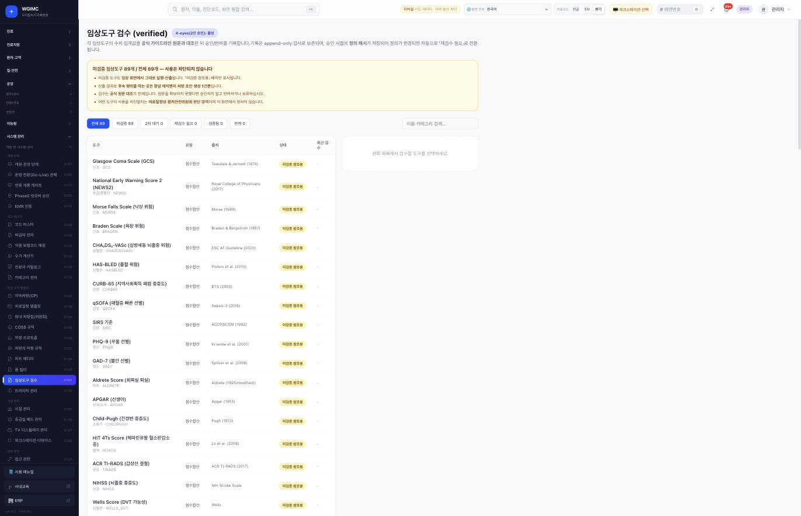

> 검수하지 않은 임상도구 **89개 전부**를 막지 않는 까닭도 화면이 적습니다 — **"어떤 도구의 사용을 차단할지는 의료질향상 · 환자안전위원회 판단 영역이며 이 화면에서 정하지 않습니다."** 코드가 대신 정하지 않고 위원회로 넘깁니다.

근거: [A 2장 취지 3](../overview/02-principles.md#화면이-모른다고-말하는-아홉-가지-방식) · [화면으로 보는 생태계](../screens/)

---

## 원칙에는 비용이 따릅니다 — 얻는 것과 감수하는 것

| 취지 | 기관이 얻는 것 | 기관이 감수하는 것 |
|---|---|---|
| **1. AI 는 보조** | AI 를 들여도 책임 구조가 그대로. "누가 승인했나"를 되짚을 수 있음 | **승인이라는 사람의 단계**가 업무에 들어감. 검토 시간 · 권한 체계를 기관이 마련 |
| **2. 출처를 말한다** | 화면을 믿을 수 있음. AI 칸과 사람 칸을 섞어 읽지 않음 | "폴백" · "산출 불가" · "기본값" 표시가 그대로 보임 → **읽는 법을 직원 교육에** |
| **4. 정본은 하나** | 규정 · 라벨을 한 곳에서 고침 | **HIS 의 중요도가 커짐** — 가용성 · 백업 · 키 관리를 가장 먼저 |
| **5. 결정은 화면에서** | 누가 언제 무엇을 정했는지 남음 | **결정을 미룰 수 없음** — 개시 전 필수 결정 11건 |
| **6. 독립 시스템 + 표준** | 한꺼번에 들이지 않아도 됨. 기존 PACS 를 그대로 연결하는 선택 | **연결이 많음**(113개) — 연결마다 리허설 확인이 기관 몫 |
| **8. 모드로 가른다** | 개시 뒤 시험용 통로가 남지 않음 | 리얼 전환은 토글이 아니라 **별도 절차** — 일정 · 인력 필요 |

근거: [A 2장](../overview/02-principles.md)

---

# Ⅱ. 무엇으로 — 구조

---

## 계층 생태계 지도 — 13개 시스템 · 7계층

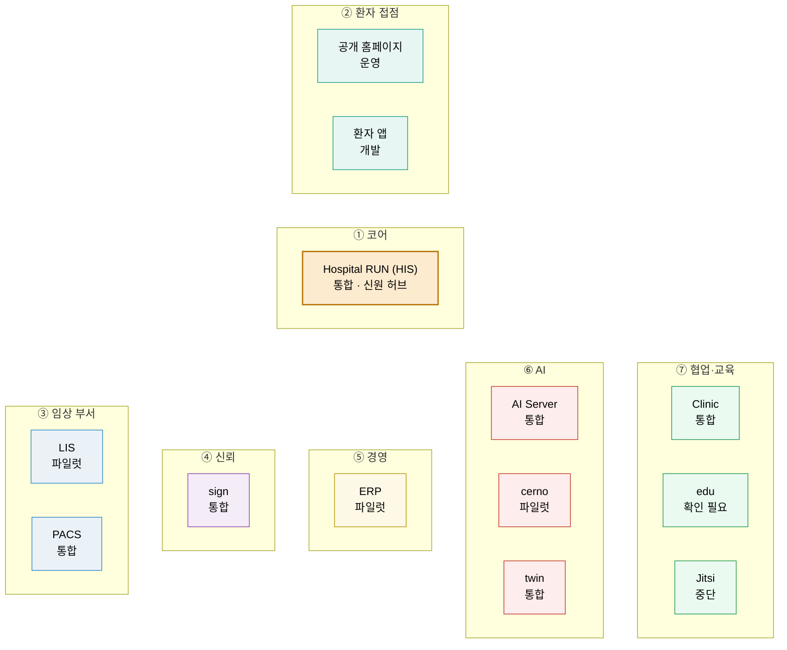
```mermaid
flowchart TB
  subgraph L2["② 환자 접점"]
    HOME["공개 홈페이지<br/>운영"]
    APP["환자 앱<br/>개발"]
  end
  subgraph L1["① 코어"]
    HIS["Hospital RUN (HIS)<br/>통합 · 신원 허브"]
  end
  subgraph L3["③ 임상 부서"]
    LIS["LIS<br/>파일럿"]
    PACS["PACS<br/>통합"]
  end
  subgraph L4["④ 신뢰"]
    SIGN["sign<br/>통합"]
  end
  subgraph L5["⑤ 경영"]
    ERP["ERP<br/>파일럿"]
  end
  subgraph L6["⑥ AI"]
    AIS["AI Server<br/>통합"]
    CERNO["cerno<br/>파일럿"]
    TWIN["twin<br/>통합"]
  end
  subgraph L7["⑦ 협업·교육"]
    CLINIC["Clinic<br/>통합"]
    EDU["edu<br/>확인 필요"]
    JITSI["Jitsi<br/>중단"]
  end
  L2 ~~~ L1
  L1 ~~~ L3
  L1 ~~~ L4
  L1 ~~~ L5
  L1 ~~~ L6
  L1 ~~~ L7
  classDef core fill:#fdebd0,stroke:#b9770e,stroke-width:2px,color:#000
  classDef patient fill:#e8f6f3,stroke:#16a085,color:#000
  classDef clinical fill:#eaf2f8,stroke:#2e86c1,color:#000
  classDef trust fill:#f4ecf7,stroke:#8e44ad,color:#000
  classDef mgmt fill:#fef9e7,stroke:#b7950b,color:#000
  classDef ai fill:#fdedec,stroke:#c0392b,color:#000
  classDef collab fill:#eafaf1,stroke:#229954,color:#000
  class HIS core
  class HOME,APP patient
  class LIS,PACS clinical
  class SIGN trust
  class ERP mgmt
  class AIS,CERNO,TWIN ai
  class CLINIC,EDU,JITSI collab
```

가운데 **코어 HIS** 가 환자 · 진료 · 오더 · 원무의 정본을 갖고 직원 로그인 토큰을 발급하는 **신원 허브**입니다. 나머지 계층은 필요한 것부터 붙입니다. 노드 아래 글자는 매니페스트의 **구현 상태**입니다.

근거: [① 계층 생태계 지도](../diagrams/layers.md) · [A 3장](../overview/03-layers-and-systems.md)

---

## 시스템 13 — 버전과 구현 상태

| 계층 | 시스템 | 한 줄 | 버전 | 상태 |
|---|---|---|---|---|
| ① 코어 | **HIS** | 외래 · 입원 · 수술 · 응급 · 검사 · 약제 · 검진 · 경영지원 통합 · 신원 허브 | `v4.18.0` | `통합` |
| ② 환자 | 공개 홈페이지 / 환자 앱 | 병원 웹사이트 · AI 예약 도우미 / 예약 · 결과 · 동의 · 문진 | `v4.18.0` | `운영` / `개발` |
| ③ 임상 | **LIS** / **PACS** | 진단검사 · 병리 · 수혈 · 유전체 / 웹 PACS · 뷰어 · 판독 | `1.56.18` / `v13.48` | `파일럿` / `통합` |
| ④ 신뢰 | **sign** | 자체 PKI · RFC 3161 타임스탬프 · PAdES-LTA 전자서명 | `1.30.1` | `통합` |
| ⑤ 경영 | **ERP** | 재무회계 · 원가 · 인사급여 · 자재 · 보험청구 · 세무 | `1.287.3` | `파일럿` |
| ⑥ AI | **AI Server** / **twin** / **cerno** | 온프레미스 GPU 통합 AI / 위험 점수 카드 · SBAR / 의료진별 근거 RAG | `2.125.41` / `1.20.88` / `0.1.0` | `통합` / `통합` / `파일럿` |
| ⑦ 협업 | **Clinic** / **edu** / **Jitsi** | 그룹웨어 · 결재 / 이러닝 · 법정교육 / 원격진료 화상 | `1.4.0` / `2.7.0` / `1.0.0` | `통합` / `확인 필요` / **`중단`** |

**소스를 받을 때는 태그 이름이 아니라 매니페스트의 정본 버전 · 기준 커밋을 기준으로 삼습니다** — 13행 중 8행이 태그 · 릴리즈 기록과 어긋납니다.

근거: [통합 릴리즈 `2026.09` 매니페스트](../RELEASES/2026.09/manifest.md)(계측일 2026-09-13) · [A 3장](../overview/03-layers-and-systems.md)

---

## 규모와 서버 — 계측 스냅샷

**계측일 2026-09-13 · 각 저장소의 기준 커밋 내용을 읽어 셈**(저장소 README 의 수치는 쓰지 않았습니다)

| 시스템 | 값 | | 시스템 | 값 |
|---|---|---|---|---|
| HIS | 데이터 모델 562 · API 핸들러 3,251 · 화면 450 | | ERP | 모델 219 · 핸들러 717 · 화면 113 |
| LIS | 모델 84 · 핸들러 356 · 화면 41 | | AI Server | 핸들러 654 |
| PACS | 핸들러 475 · 관리 화면 47 | | twin / cerno | 핸들러 107 · 15화면 / 11 · 3화면 |
| sign | 모델 14 · 핸들러 162 · 화면 38 | | edu / Clinic | 모델 40 · 핸들러 167 / 병원 서비스 화면 16 |

> **API 핸들러 수는 고유 경로 수가 아닙니다.** 언어 · 프레임워크마다 세는 규칙이 달라 **시스템끼리 크기를 견주는 데 쓰지 않습니다.** 이 수치는 "무엇이 있는가"의 크기이지 "얼마나 검증됐는가"가 아닙니다.

**서버는 얼마나 필요한가 — 지금 말할 수 있는 것**

- **실제로 돌아간 기록** — 8개 시스템(HIS · PACS · sign · LIS · twin · cerno · edu · Jitsi)이 **8코어 · 16GB 가상 서버 한 대**에 함께 올라가 있었습니다(2026-08-25 · 메모리 약 10GB 사용 · 스왑 여유 없음). **권장 사양이 아니라 실제로 돌아간 하한에 가까운 기록**입니다.
- **가장 작은 출발점** — 앱 서버 한 대 + GPU 서버 한 대. 영상이 많아지면 PACS 영상 저장소를 따로.
- 📏 **아직 계측이 없는 것** — 시스템별 권장 사양 · 동시 사용자 처리량 · 모델별 응답 시간.

근거: [계측 스냅샷](../data/scale-snapshot.json) · [A 3장](../overview/03-layers-and-systems.md) · [⑧ 배포 구성](../diagrams/deployment.md)

---

## 무엇을 할 수 있나 — 업무로 본 기능

**HIS 메뉴만 266개**(도메인 8 · 메뉴 묶음 26 · 기준 커밋에서 기계적으로 뽑음). 여기에 검사 · 영상 · 서명 · 경영 · AI · 교육 · 협업 시스템의 기능이 더해집니다.

| 업무 | 맡는 시스템 | 대표 기능 |
|---|---|---|
| 외래 · 병동 | HIS · Clinic · AI Server | 예약 · 오더 · 처방 · 기록 **초안** · 조기경고 점수 · 투약 바코드 대조 · 퇴원 게이트 · 인수인계 |
| 수술 · 응급 · 특수 치료 | HIS | 수술 체크리스트 · 좌우 판정 · 중증도 분류 · 골든타임 · 방사선 · 항암 · 투석 · 재활 · 장기이식 · 격리·강박 기한 |
| 검사 · 영상 | LIS · PACS · HIS | 검체 품질 · 자동 검증 · 위험치 폐루프 · 병리 사인아웃 · 수혈 독립 판정 · 판독 워크플로 · 판독 **초안** |
| 약 · 물류 | HIS · ERP | 원내 처방집 · 조제 · 마약류 해시 원장 · 재고 · 장비 · 멸균 |
| 원무 · 경영 · 사람 | HIS · ERP · edu · Clinic | 수납 · 계산서 · 청구 · 재무 · 인사 · 급여 · 법정교육 · 전자 이수증 · 결재 |
| 질 · 안전 · 세우기 | HIS · sign · LIS | 안전 게이트 · 환자 확인 · 감염관리 · 비상 열람 · 위원회 의결 · 서명 봉인 · 개원 · Go-Live · 개시 전환 |

> 🔴 **여기 적혔다는 것은 기준 커밋의 코드에 있다는 뜻입니다.** 동작 확인은 Ⅳ 장의 연결 상태가 정본입니다.

근거: [A 4장](../overview/04-functions.md) · [업무별 기능 지도](../functions/) · [HIS 메뉴 266](../systems/his-domains.md)

---

## 기능들이 함께 지키는 여섯 가지

주요 기능 41편을 한 편씩 쓰고 나니, 서로 다른 업무의 기능이 **같은 버릇**을 갖고 있었습니다. 현장에서 「왜 여기서 막히지?」가 나오는 자리가 대개 여기입니다.

| 버릇 | 예 |
|---|---|
| **① 만든 사람이 스스로 확정하지 않는다** | 결과 입력자 ≠ 검증자 · 조제자 ≠ 검수자 · 방사선 처방자 ≠ 승인자 |
| **② 모르는 것을 0 으로 말하지 않는다** | 입력이 모자란 점수 · 분모 없는 비율 · 잴 수 없는 대기 시간은 「산출 불가」 |
| **③ 막을 때도, 비켜 갈 때도 기록이 남는다** | 투약 우회 사유 · 퇴원 면제 · 비상 열람은 막지 않되 모르게 열리지 않음 |
| **④ 나가지 않은 것을 나갔다고 적지 않는다** | 대외 보고 채널이 없는 마약류 · 감염 신고를 「제출 완료」로 적지 않음 |
| **⑤ 안전 게이트는 대부분 꺼진 채로 온다** | 배선된 28개 중 코드 기본값 **차단 6 · 경고 4 · 끔 18** — 꺼진 게이트가 가장 깨끗해 보입니다 |
| **⑥ 켜는 것은 스위치가 아니라 결정이다** | 연동 개통 · 개시 전환 · AI 기능 · 위원회 정책은 기록된 결정을 거쳐 반영 |

**기관에게** — 도입 첫날은 「설정 전」 상태입니다. 반발이 예상되는 곳은 ① · ③(두 번째 사람 · 사유 입력), 대시보드의 「산출 불가」는 결함이 아니라 입력이 아직 없다는 뜻입니다.

근거: [A 4장 「함께 지키는 여섯 가지」](../overview/04-functions.md#기능들이-함께-지키는-여섯-가지) · [주요 기능 — 자세히](../functions/detail/) · [진료하는 사람을 위한 안내](../clinicians/)

---

## 환자 한 명의 여정 — 경계마다의 연결 상태

**예약 → 접수 → 진료(AI 보조) → 검사 → 병리 영상 → 영상 → 판독 서명 → 동의서 → 수납 · 청구 → 회계 → 결과 열람 → 원격 상담**

| 구간 | 경계 | 상태 |
|---|---|---|
| ① 예약 | 공개 홈페이지 · 환자 앱 → HIS | `구현·미검증` |
| ③ 진료(AI 보조) | HIS → AI Server — **의료진이 승인해야 기록이 됩니다** | `구현·미검증`(요약 경로 하나만 불러 봄) |
| ④ 검사 | HIS ⇄ LIS (FHIR R4 ServiceRequest · DiagnosticReport) | **`검증됨` 5**(오더 · 환자 조회 · 결과 · 취소 · 검사코드 카탈로그 · 2026-09-14~15) |
| ⑤⑥ 영상 | LIS → PACS(HL7 v2 · 병리) | **`검증됨` 2**(워크리스트 · 뷰어 링크 · 2026-09-15) |
| ⑤⑥ 영상 | HIS → PACS · PACS → 촬영 장비(DICOM) | `구현·미검증` — HIS 화면에서 PACS 를 부르는 경로는 **끝까지 가지 못했습니다** |
| ⑦⑧ 서명 | PACS → sign · HIS ⇄ sign | **`검증됨` 5**(판독 서명 · 조영제 동의서 · 직원 서명 · 완료 통지 · 오더 로그 봉인) |
| ⑨ 수납 · 청구 | HIS ⇄ ERP | **`검증됨` 6**(직원 SSO · 진료비 계산서 · 약품 보험코드 · 청구 라인 · 정산 회신 · 계약 서명 발의) |
| ⑨ 수납 · 청구 | HIS → ERP 운영 이벤트(수납 · 청구 · 재고 · 인사) | `구현·미검증` — **리얼 전환 뒤에** 실제로 나갑니다 |
| ⑫ 원격 상담 | HIS 포털 · 환자 앱 → Jitsi | **`중단`** |

**대체 수단을 준비할 곳** — 대외 기관 청구 · 자격조회 전송 모듈 `미구현` · 문자 발송 제공자 없음(모의 발송) · Jitsi 새로 구성 · HL7 v2 대체 경로 일부 `미구현`.

근거: [③ 환자 여정 스윔레인](../diagrams/patient-journey.md) · [A 5장](../overview/05-patient-journey.md)

---

## 신원 — 직원 한 명의 신원은 HIS 한 곳에서

직원은 HIS 에 로그인합니다. **HIS 가 직원 로그인 토큰을 발급하고**, 형제 시스템이 그 토큰을 검증해 같은 사람으로 받아들입니다.

| 검증 방식 | 시스템 | 기관이 알아 둘 것 |
|---|---|---|
| **공개키로 검증** | sign · PACS · edu · twin · cerno (**5곳**) | 비밀값을 나눠 가질 필요가 없습니다 |
| **공유 비밀키로 검증** | ERP · Jitsi (**2곳**) | **키 관리가 따로 필요** — 양쪽에 같은 값으로 두고 함께 교체 |
| **API 키로 연결** | Clinic (**1곳**) | Clinic 이 범위를 지정한 키를 발급 |

- 입사 · 변경 · 퇴직이 HIS 에서 형제 시스템으로 전해집니다(예: edu 직원 이벤트 웹훅 · Clinic 직원 일괄 등록 — 모두 `구현·미검증`).
- 직원 계정 · 역할을 **HIS 한 곳에서** 관리합니다. 반대로 **HIS 가 멈추면** HIS 신원에 기대는 형제 시스템의 로그인도 영향을 받습니다(edu 는 로그인이 HIS SSO 뿐).
- → **HIS 의 가용성 · 백업 · 키 관리가 생태계 전체의 기반입니다.**

근거: [④ 신원 허브](../diagrams/identity-hub.md) · [A 6장](../overview/06-identity-trust-standards.md)

---

## 신뢰 — 서명 · 인증서 · 타임스탬프는 sign 한 곳에서

"**누가 · 언제 · 무엇에** 서명했고, 그 뒤로 **바뀌지 않았다**"를 제3자가 검증할 수 있게 하는 구조입니다.

| 질문 | 장치 |
|---|---|
| 누가 | 자체 PKI — 서명자별 X.509 인증서를 sign 한 곳에서 발급 |
| 무엇에 | 전자서명 — PDF 는 **PAdES-LTA**(인증서 만료 뒤에도 검증 가능) |
| 언제 | **RFC 3161 타임스탬프** — 공인 TSA 를 계약하면 주소 설정으로 교체 |
| 바뀌지 않았다 | 추가만 되는 **감사 해시체인** — 체인 머리를 타임스탬프로 봉인 |

sign 을 부르는 곳: HIS(동의서 · 발급 문서 · 인증서 발급 · 감사 이벤트) · PACS(판독 서명) · edu(이수증 봉인) · ERP(계약 · 감사) · Clinic(전자결재 감사) — 모두 `구현·미검증`.

> ⚠️ **기관이 준비하는 것** — 기준 버전은 인증 기관 키를 **소프트웨어로 보관**합니다(HSM 미적용). 하드웨어 보안 모듈 · 공인 타임스탬프 기관 · 본인확인 사업자는 구축 기관이 준비합니다. **전자서명의 법적 효력 판단은 구축 기관과 법무가 합니다.**
> **순서 조언** — 동의서 · 판독 · 이수증 · 계약이 모두 sign 을 부르므로, **서명을 쓰는 단계보다 sign 을 먼저** 세웁니다.

근거: [⑤ 신뢰의 사슬](../diagrams/trust-chain.md) · [A 6장](../overview/06-identity-trust-standards.md)

---

## 표준 — 가능한 한 국제 표준으로

| 층 | 표준 | 대표 쓰임 | 상태 |
|---|---|---|---|
| 임상 앱 | **SMART on FHIR** · CDS Hooks | 차트에서 twin · cerno 열기 · 위험 카드 | `구현·미검증` |
| 임상 자원 | **FHIR R4** | HIS ⇄ LIS 오더 · 결과 · Reflex · write-back | `구현·미검증` |
| 영상 | **DICOM**(DIMSE · MWL · MPPS) · DICOMweb · IHE XDS-I.b | PACS ⇄ 촬영 장비 · 외부 PACS | `구현·미검증` |
| 영상 | IHE PIX(HL7 v2 ADT) | HIS → PACS 환자 인구정보 · 병합 | **`미구현`** |
| 메시지 · 장비 | **HL7 v2**(MLLP) | LIS → PACS 병리 스캔 워크리스트 | `구현·미검증` |
| 메시지 · 장비 | HL7 v2 대체 경로 | 결과 ORU · 처방 OML · 판독 결과 송신 | **`미구현`** |
| 장비 | ASTM E1394 | 검사 분석기 → LIS 결과 자동 수집 | **`미구현`** |
| 코드 체계 | LOINC · SNOMED CT · KCD | 시스템 안 코드 · 매핑 | 기관이 받아 옴 |

- **FHIR R4 · DICOM 주 경로는 양쪽 코드가 맞물려 있습니다.** 기존 PACS · 촬영 장비 연결은 이 경로로 봅니다.
- **HL7 v2 로만 말하는 기존 장비 · 시스템이 있다면** S3 에서 연결 방식을 먼저 확인합니다.
- 연결 표의 상당수는 표준 프로파일이 아니라 **전용 HTTPS REST(JSON) · 웹훅**입니다.

근거: [⑥ 표준 층](../diagrams/standards.md) · [A 6장](../overview/06-identity-trust-standards.md)

---

## AI — 한 곳에서, GPU 한 장으로

**AI 연산은 AI Server 한 곳이 맡습니다.** 각 시스템은 AI Server 를 불러 초안 · 분류 보조 · 근거 검색 · 음성 인식을 받습니다.

| 보조 | 무엇을 만드나 | **누가 확정하나** |
|---|---|---|
| 분류(triage) 보조 · DUR 점검 보조 | 제안 | 의료진 · 약사 |
| 진료 기록 초안 · 음성 기록 | 기록 초안 | **의료진이 승인해야 기록이 됨** |
| 약물 · 검진 결과 설명 | 환자용 설명 초안 | 사람이 감수 · 승인하는 화면을 거침 |
| 위험 점수 카드 · SBAR(twin) | 예측 보조 · 초안 | 의료진이 '차트 저장'을 눌러야 HIS 에 저장 |
| 영상 판독 초안(PACS) | 예비 판독문 초안 | 판독의 |

**16GB 를 나눠 쓰는 방식** — 기준은 소비자용 GPU 한 장(NVIDIA RTX 5080 · VRAM 16GB)

| 항목 | 내용 |
|---|---|
| 기본 모델 | 범용 14B 급 하나(실제 적재 약 10.5GB) · 임베딩 약 1GB |
| 운용 방식(설정 한 줄) | **상주**(첫 응답 빠름) 또는 **요청할 때 적재**(쉬는 동안 VRAM 비움 · 5분 미사용 시 내림) |
| 시간대 프로파일 | 진료 시간 범용 14B 상주 + 의료 특화 4B~8B 필요 시 · 진료 외 범용 7B(약 5.0GB) |
| 가속기 | NVIDIA CUDA · Apple Silicon(Metal) · CPU 자동 선택 |

**`local_only`** — 의료 · 개인건강정보 · 규제 관련 작업은 외부 AI 제공자로 보내려 하면 **코드가 거부합니다**. 외부 제공자 자리는 있지만 기본값은 모두 꺼짐.

근거: [⑦ AI 호출 지도](../diagrams/ai-map.md) · [A 7장](../overview/07-ai.md)

---

## AI — 끄고 시작해 결정으로 하나씩 켠다

**AI 서버 없이도 HIS 는 동작합니다.** AI 가 없거나 멈추면 화면이 그 칸을 "폴백" · "산출 불가"로 표시합니다. 그런데 **코드 기본값은 기능마다 다릅니다**(2026-09-11 코드 확인).

| 기본 **켜짐** — 설치 직후 끔 | 기본 **꺼짐** — 꺼져 있는지 확인 |
|---|---|
| HIS 의 AI 기능 전체 스위치 · AI 인사 | 환자 AI 브리핑 야간 배치 · 데이터 품질 AI |
| PACS 영상 자동 선별 | 음성 EMR · 앰비언트 기록 · PACS 판독문 자동 초안 |

**켜는 순서**

1. 설치 직후 "기본 켜짐" 기능을 **끕니다**. 자기 기관 AI Server 주소를 넣기 전에는 AI 를 켜지 않습니다.
2. **선행 결정을 기록합니다** — 의료기기(SaMD) 해당성 · 임상데이터 처리 경계 · 진료 음성 녹음 근거 · 전송 목적지의 법적 한정.
3. **켤 범위를 원내 위원회가 정합니다** — AI 임상 기능 범위는 선행 결정 셋이 먼저 정해져야 하는 **개시 전 필수** 결정입니다.
4. HIS 를 AI Server 에 연결하고 전체 스위치를 켭니다(개별 기능은 아직 꺼짐).
5. **기능을 하나씩** — 결정 기록 → 스위치 → Go-Live 표시 → 감독 화면 확인 → 다음. 켠 순서와 날짜를 남기고, 되돌릴 때도 같은 순서로 끕니다.

AI 계층의 사람 결정 **10개** · 이 단계를 닫는 Go-Live 항목 **15개**(모두 개시를 막지 않는 추적 항목 · HIS v4.18.0 레지스트리 기준 커밋에서 추출).

근거: [A 7장](../overview/07-ai.md) · [S6 AI 계층](../build-guide/S6-ai.md)

---

## AI — 무엇이 남나 · 모델은 기관이 받는다

**감독 — 무엇이 기록에 남나**

| 어디 | 남는 것 |
|---|---|
| HIS | **AI 제안 원장**(생성 → 승인 · 수정 · 거부) · 모델 릴리즈 기록 · AI 호출 기록 · 환자를 지목한 AI 조회의 감사 기록 |
| HIS 품질 임계 | 임계값 기본 **미설정** — 원내 위원회가 과거 실측에서 정함. 표본이 최소 호출 수보다 적으면 **판정 보류** |
| AI Server / twin | 충실도 · 검색 품질 자기 계측 / 모델이 바뀌면 알림(digest 대조) |

**모델 가중치는 이 저장소에도 소스에도 없습니다. 약관은 MIT 가 아니고 모델마다 다릅니다.**

| 모델 | 쓰는 곳 | 약관에서 눈여겨볼 것 |
|---|---|---|
| Qwen2.5 / Qwen3 계열 | 질의 · 요약 · 분류 · RAG · 도구 호출 | Apache-2.0 |
| **MedGemma 계열** | 영상 판독 **초안** · 구조화 판독 초안 | HAI-DEF — 임상 사용(연구 포함)이면 **관할 규제 기관 승인을 받으라고** 적음 |
| **Med42 · Meditron** | 임상 질의 · 위험 추론 후보 | Llama Community License. **개발사가 추가 검증 없이 임상에 쓰지 말라고 경고** |
| BGE-M3 · Whisper 등 | 임베딩 · 음성 인식 · OCR | MIT · Apache-2.0 계열 |

> 이 소프트웨어는 **어느 국가에서도 의료기기(SaMD 포함)로 인허가를 받지 않았습니다.** 규제 표기는 모두 `대응 설계`이고 `자체 점검 완료` · `외부 인증·승인` 기록은 없습니다.

> AI 감독 화면의 부제가 규칙을 먼저 밝힙니다 — **"비율에는 분모가 함께 붙고, 표본이 없으면 값 대신 그 사실을 말합니다."** 이 설치본은 제안 원장이 비어 있어 수용률 · 수정률 · 거부율이 모두 **`산출 불가`** 입니다.

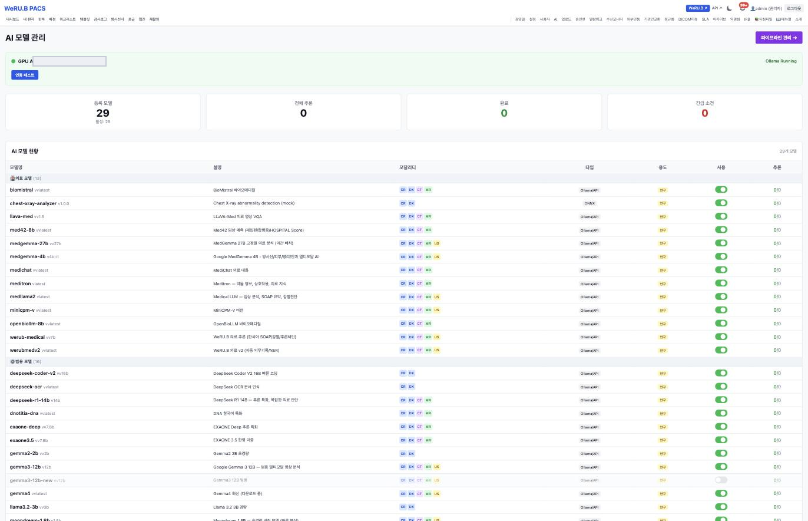

> 기관이 받아 둔 모델은 **의료 · 범용으로 나뉘어 목록**으로 관리되고, **용도 칸이 전부 `보조`** 입니다. 아직 받는 중인 모델은 비활성으로 흐리게 표시됩니다.

근거: [A 7장](../overview/07-ai.md) · [THIRD_PARTY §3](../THIRD_PARTY.md#3-ai-모델-가중치) · [의료 면책 고지](../DISCLAIMER.md) · [화면](../screens/pacs.md)

---

# Ⅲ. 어떻게 세우나 — 구축

---

## 구축은 9단계 — S0 준비 ~ S8 리얼 전환

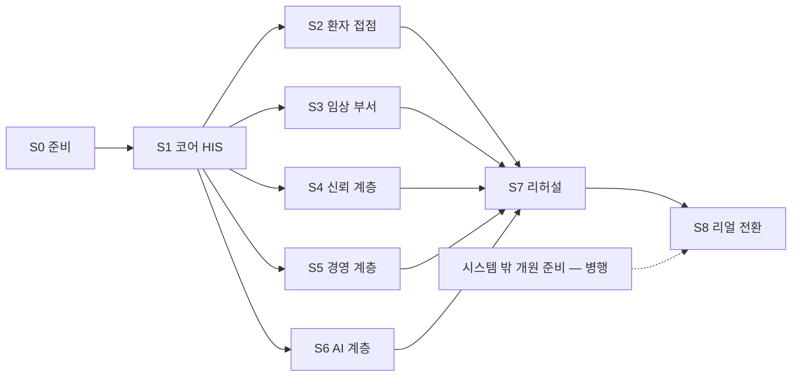
```mermaid
flowchart LR
  S0[S0 준비] --> S1[S1 코어 HIS]
  S1 --> S2[S2 환자 접점]
  S1 --> S3[S3 임상 부서]
  S1 --> S4[S4 신뢰 계층]
  S1 --> S5[S5 경영 계층]
  S1 --> S6[S6 AI 계층]
  S2 --> S7[S7 리허설]
  S3 --> S7
  S4 --> S7
  S5 --> S7
  S6 --> S7
  S7 --> S8[S8 리얼 전환]
  P[시스템 밖 개원 준비 — 병행] -.-> S8
```

**새 절차를 만들지 않습니다.** HIS 에 이미 있는 구축 관리 화면 — 개원 단계 관리 · Go-Live 관제 · 결정 등록부 · 안전 게이트 · 대외 발신 관제 · 상시 감시자 · 시스템 설정 — 을 **단계 순서로 따라가는 것**입니다.

- **S0 · S1 은 반드시 먼저** — 모든 구축은 코어 HIS 에서 시작합니다.
- **S2~S6 은 필요한 것만, 필요한 순서로** — 13개를 다 세울 필요는 없습니다. 다만 **S4 의 sign 은 먼저**.
- **S7 · S8 은 모두가 모이는 곳** — 가상 병원 데이터로 전 흐름을 돌려 본 뒤 리얼로 전환합니다.

근거: [② 구축 단계 로드맵](../diagrams/build-roadmap.md) · [A 8장](../overview/08-build-path.md) · [B 구축 가이드](../build-guide/)

---

## 단계마다 무엇을 정하고 무엇으로 닫나

| 단계 | 하는 일 | 이 단계에서 사람이 정할 것(대표) | 결정 | 개원 | Go-Live |
|---|---|---|---:|---:|---:|
| S0 준비 | 제공 조건 확인 · 서버 · GPU · DB · **격리 네트워크** · 기관 프로파일 | 결정 권한자 지정 · 어느 나라 기관인가 | 9 | 10 | 0 |
| S1 코어 HIS | 설치 · 기관명 · 코드 마스터 반입 · 부서 · 병상 · 직원 · 규정 | 요양기관 종별 · **코드 마스터를 배포 기관에서 받기** | 20 | 8 | 8 |
| S2 환자 접점 | 공개 홈페이지 · 포털 · 앱 · 본인확인 · 알림 | 환자 알림의 적법 근거 · 문자 처리위탁 · 앱 배포 여부 | 7 | 0 | 1 |
| S3 임상 부서 | LIS · PACS 연결 · 장비 인터페이스 | **기존 PACS 를 연결할지, 새로 세울지** | 2 | 8 | 11 |
| S4 신뢰 계층 | 전자서명 · 인증서 · 타임스탬프 · 동의서 | 공인 TSA · HSM · 본인확인 사업자 · **서명 효력 판단** | 0 | 0 | 4 |
| S5 경영 계층 | ERP · Clinic · edu · 청구 자격 | ERP 로 나가는 환자번호 가명화 여부 | 4 | 6 | 8 |
| S6 AI 계층 | AI Server · **끄고 시작해 결정으로 켬** · 동의 · 감독 | 의료기기 해당성 · 처리 경계 · 녹음 근거 → 임상 기능 범위 | 10 | 0 | 15 |
| S7 리허설 | 가상 데이터 전 흐름 시연 · 안전 게이트 · 연결 확인 | 개시 전 필수 결정 · 개시 차단 항목 점검 | 3 | 2 | 8 |
| S8 리얼 전환 | 가상 데이터 격리 · 실데이터 이관 · 리얼 빌드 · 개시 확인 | 리얼 전환 시점 · 암호화 키 교체 시점 | 1 | 5 | 5 |
| — | **시스템 밖 병행**(시설 · 인허가 · 법정 인력 · 정기 운영 · 인증) | — | 0 | 21 | 0 |
| | **합계** | | **56** | **60** | **60** |

수치: [구축 가이드](../build-guide/README.md#단계)가 HIS 레지스트리 항목을 단계에 배정(HIS v4.18.0 · 기준 커밋에서 추출). **HIS 화면에는 단계 구분이 없습니다.**

---

## 진행은 사람의 기억이 아니라 화면의 항목으로

| 체크리스트 | HIS 화면 | 항목 | 구성 |
|---|---|---:|---|
| [개원 · 운영 단계](../checklist/opening.md) | `/admin/opening` | **60** | 나라별 KR 45 · AE 48 · 확인 방식 파생 18 · 사람 기록 42 |
| [Go-Live(운영 전환)](../checklist/go-live.md) | `/admin/go-live` | **60** | 판정 실검증 27 · 자가신고 33 · **개시 차단 31** |
| [사람 결정(결정 등록부)](../checklist/decisions.md) | `/admin/decisions` | **56** | 허가권자 17 · 원내 위원회 38 · 직원 1 · **개시 전 필수 11** |

- **실검증** 항목은 시스템이 설정 값 · DB · 결재 기록 · 코드를 직접 읽어 판정합니다. **사람이 "됐다"고 적어도 바뀌지 않습니다.**
- **자가신고** 항목은 담당자가 표시하고, 근거는 화면 밖에 있습니다.
- 기록이 없는 항목은 "미완료"가 아니라 **"기록 없음"** 입니다(취지 3).
- 이 목록은 **전수가 아닙니다.** 종별 · 지역 · 특례에 따라 늘거나 빠지고, 법령 근거와 처리 기한은 기관이 확인해 채웁니다.
- **개원 단계 항목 21개는 시스템 밖에서 병행합니다** — 설립 · 시설 · 인허가 · 법정 인력 · 정기 운영 · 인증 준비. **시스템은 기록만 받고 신고 · 허가를 대신 내지 않습니다.**

세 목록은 HIS 코드에서 그대로 뽑았습니다(HIS v4.18.0 · 기준 커밋 2026-09-11 · 기준 커밋에서 추출(추출일은 생성물에 있음)).

---

## 구축은 이 세 화면에서 진행됩니다

**개원·운영 단계** — 국가 축(대한민국 · UAE)을 고르고, 항목마다 상태가 **`기록 없음`** 으로 섭니다. 화면이 먼저 밝힙니다 — "이 목록은 기본 목록이며 **전수가 아니다**" · "기관 국가가 설정되지 않아 **기본값으로 보고 있습니다**".

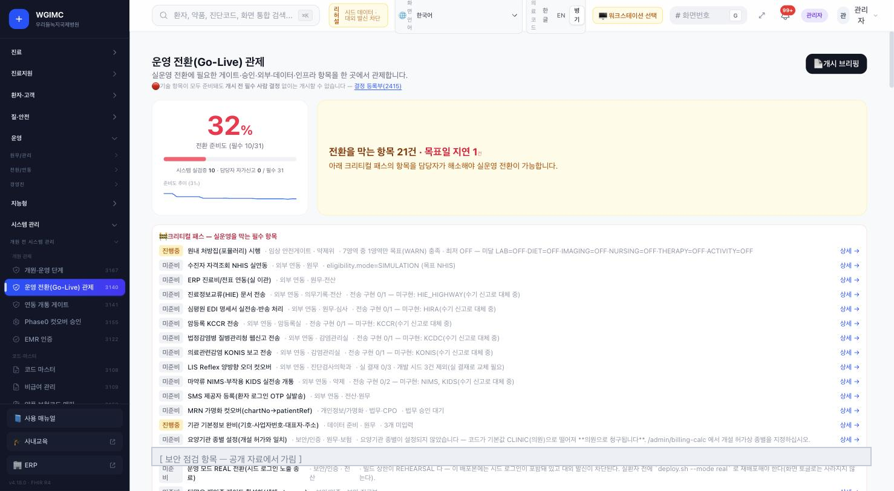

**Go-Live 관제** — 전환 준비도와 **"전환을 막는 항목"** 수를 크게 띄우고, 🔴 **"기술 항목이 모두 준비돼도 개시 전 필수 사람 결정 없이는 개시할 수 없습니다"** 라고 못 박습니다.

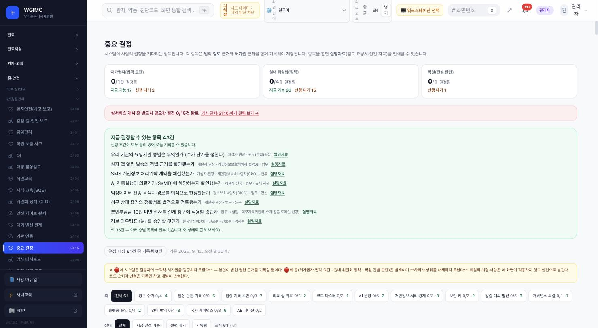

**결정 등록부** — 허가권자 · 원내 위원회 · 직원 세 층이 각각 칸을 가지고, 층마다 `지금 가능` 과 `선행 대기` 를 나눠 셉니다. 🔴 **"이 시스템은 결정자의 정책 · 허가권을 검증하지 못한다. 본인이 밝힌 권한 근거를 기록할 뿐이다."**

---

## 시작 전에 꼭 알아야 할 세 가지

| | |
|---|---|
| **1** | **첫 기동은 외부로 나가는 연결을 막은 상태에서 합니다.** 각 시스템의 코드 · 설정 예시에 특정 설치본의 주소가 기본값으로 든 파일이 **11개 저장소 합계 299개 — [파일 목록](../build-guide/replace-list.md)**(문서 제외 · 2026-09-17 기준 커밋에서 다시 셈) 있습니다. 바꾸지 않고 띄우면 **다른 설치본으로 요청이 갈 수 있습니다.** |
| **2** | **AI 는 끄고 시작합니다.** 코드 기본값이 켜진 AI 기능이 있습니다. 자기 기관 AI Server 주소를 넣기 전에는 켜지 않습니다. |
| **3** | **리얼 전환은 설정 토글이 아니라 리얼 빌드 배포입니다.** 가상 데이터 격리 → 키 · 인증서 새로 만들기 → 실데이터 이관 → **리얼 빌드 배포** → 개시 확인 순서입니다. 관리 화면의 설정만 바꿔서는 끝나지 않습니다. |

**덧붙여** — HIS 코드에 병원명이 고정 문자열로 남은 파일이 **118개** 있습니다(기준 커밋에서 2026-09-17 에 다시 셈). 설정값으로 옮기는 작업이 진행 중이며, 끝나기 전까지 자기 병원명을 넣으려면 코드를 고칩니다(S1).

근거: [A 8장](../overview/08-build-path.md) · [S0](../build-guide/S0-prepare.md) · [S8](../build-guide/S8-go-real.md)

---

# Ⅳ. 지금 상태 — 있는 그대로

---

## 연결 113개 중 27개를 실제로 호출해 확인했습니다

| 실은 연결 | `검증됨` | `구현·미검증` | `설계만` | `미구현` | `중단` | `판정 불가` |
|---:|---:|---:|---:|---:|---:|---:|
| **113** | **27** | **61** | 1 | **15** | **7** | 2 |

- 센 방법: [연결 상태 표](../RELEASES/2026.09/compatibility.md)의 합계. 코드 대조는 2026-09-11, **`검증됨` 27 은 기준 커밋으로 새로 세운 설치본끼리 실제로 호출해 확인**(확인일 2026-09-14~15 · 확인일 칸). 연결은 방향과 목적별로 나눴습니다.
- **일부만 확인한 연결이 8개** 더 있습니다 — 불러 봤지만 연결 전체를 끝내지 못해 `검증됨` 을 붙이지 않았습니다(상태는 `구현·미검증`).
- 이 밖에 **싣지 않은 연결이 7개** 있습니다 — 시스템 담당의 확인을 기다리는 연결입니다.
- **`중단` 7 은 모두 Jitsi 가 걸린 연결**입니다(HIS ⇄ Jitsi 3 · AI Server ⇄ Jitsi 2 · 환자 앱 ⇄ Jitsi 1 · Clinic ⇄ Jitsi 1).

> ### `구현·미검증`은 "동작한다"는 뜻이 아닙니다.
> "양쪽 코드가 맞물려 있다"까지입니다. 기관은 **리허설(S7)에서 가상 병원 데이터로 흐름을 끝까지 돌려**, 쓰려는 연결마다 확인합니다. 남은 61개가 그렇습니다.

근거: [A 9장](../overview/09-status-and-preparation.md) · [따라가 본 결과](../build-guide/follow-along-2026-09.md)

---

## 따라가 보고 확인된 것 — 설치본 7개를 세워서

**기준 커밋으로 새로 세운 설치본**(HIS · sign · LIS · PACS · ERP · edu · AI Server)을 **외부로 나가지 못하는 네트워크**에 올리고, 새 설치본끼리만 실제로 불렀습니다.

| 무엇 | 확인된 것 |
|---|---|
| **연결 27개가 끝까지** | 검사 오더 → 결과 → 취소, 직원 · 환자 전자서명, 판독 서명, 진료비 계산서, 청구 · 정산, 사내교육 이수까지 **한 줄로 이어졌습니다** |
| **가드가 실제로 막았다** | 27개 중 **23개**에 틀린 키 · 변조 토큰 · 위조 서명 · 재전송 · 다른 대상을 넣어 다시 시험 → 전부 거부(401 · 403 · 409) · 나머지 4개는 거부를 시험할 자리가 없어 정상 동작만 |
| **리허설 모드가 잡아 둔다** | 문자 · 메일 · 연동 발송이 나가지 않고 대기열에 보류됐고, 보류 중이라는 사실을 로그로 계속 알렸습니다 |
| **백업이 복원됐다** | 암호화 백업을 다른 DB 에 복원해 **562개 테이블의 행 수 일치**까지 확인 |
| **원본 그대로 되는 설치** | sign · ERP · edu 는 저장소의 운영용 이미지가 **그대로 빌드되고 떴습니다** |
| **가이드가 실측으로** | `확인 필요(따라가기)` 표시 **92곳 → **19곳**** · 막힌 곳과 우회를 각 단계 장에 그대로 적었습니다 |

> ⚠️ **기준 장비가 아닙니다.** 개발 PC 한 대(arm64 · GPU 없음)였습니다. **처리량 · 응답 시간 · AI 품질은 이 결과로 판단하지 않습니다.**
> 끝까지 가지 못한 연결 · 코드에 고정돼 설정으로 못 바꾸는 경로 · 아직 하지 않은 것(기준 장비 · 리얼 전환 · 미설치 시스템)도 **빠짐없이 적어 두었습니다.**

근거: [따라가 본 결과](../build-guide/follow-along-2026-09.md)

---

## 시스템별 구현 상태

| 구현 상태 | 시스템 | 수 |
|---|---|---:|
| `운영` | 공개 홈페이지(공개 사이트로 쓰이는 중) | 1 |
| `통합` | HIS(리허설 모드) · sign · PACS · AI Server(의료 기능 기준) · twin · Clinic(병원 서비스만) | **6** |
| `파일럿` | LIS · ERP(문서마다 표기가 엇갈려 재확인 대상) · cerno(섀도우 · 비임상) | 3 |
| `개발` | 환자 앱(스토어 미배포) | 1 |
| `확인 필요` | edu(운영 여부 재확인 전) | 1 |
| `중단` | Jitsi(현재 설치본이 동작하지 않음 · 구축 기관은 새로 구성) | 1 |

센 방법: [매니페스트](../RELEASES/2026.09/manifest.md) 13행의 구현 상태 칸을 상태별로 셈(근거: **2026-09-11 생태계 자료 측 조사 · 시스템 담당 확인 전**). 기능군마다 상태가 다를 수 있습니다.

**버전 표기에 관해** — 매니페스트 13행 가운데 **8행**이 태그 · 릴리즈 기록과 정본이 다릅니다(같은 저장소에서 릴리즈되는 HIS · 공개 홈페이지 · 환자 앱 세 행 포함). 소스를 받을 때는 **정본 버전과 기준 커밋**을 기준으로 삼습니다.

---

## 지금 알고 시작해야 할 것

| 항목 | 지금 상태 | 구축 기관이 할 일 |
|---|---|---|
| **대외 기관 전송**(청구 · 자격조회 · 감염병 신고) | 전송 모듈이 **구현돼 있지 않습니다.** HIS 는 청구서 작성까지 | 전송 모듈을 붙이거나 기존 청구 소프트웨어와 함께 씁니다 |
| **문자 발송 제공자** | 등록돼 있지 않습니다 — 환자 본인확인 문자는 **모의 발송** | 문자 발송 제공자와 처리위탁 계약(S2) |
| **전자서명 키 보관** | 인증 기관 키를 **소프트웨어로 보관**(HSM 미적용) | HSM · 공인 TSA · 본인확인 업체 연동 준비(S4) |
| **원격 화상(Jitsi)** | 현재 설치본은 **동작하지 않습니다** | 새로 구성합니다 |
| **로그인 방식** | 공개키 5곳 · 공유 비밀키 2곳 · API 키 1곳 | 공유 비밀키 쪽은 **키 관리를 따로** |
| **기관명 설정** | HIS 코드에 병원명 고정 문자열 **118개 파일** | 끝나기 전까지 자기 병원명을 넣으려면 코드를 고칩니다(S1) |
| **기관 주소 설정** | 특정 설치본 주소가 기본값으로 든 파일 **245개**(11개 저장소) — [파일 목록](../build-guide/replace-list.md) | 설치 전에 바꾸고, **첫 기동은 외부 연결을 막은 상태에서**(S0 · S1) |

- 화면 번역은 한국어가 기본이고 영어 · 일본어 카탈로그가 있으며 아랍어는 준비 중 — **지금 번역은 모두 AI 초안이고 사람 검수를 마친 것이 없습니다**(검수 흐름은 있음).
- 국가 축은 현재 **한국 · UAE 두 곳**입니다. 그 밖의 나라는 코드 마스터 · 청구 규칙 · 언어 팩을 새로 붙입니다.

근거: [A 9장](../overview/09-status-and-preparation.md) · [README 「지금 알고 시작해야 할 것」](../README.md#지금-알고-시작해야-할-것)

---

## 구축 기관이 준비할 것 — 시스템이 대신해 주지 않는 것

**사람과 결정**

- 결정 권한자 지정 — 허가권자 · 원내 위원회 · 직원의 세 층(S0)
- **개시 전 필수 결정 11건** 기록
- AI 를 켤 범위와 선행 결정 — 의료기기 해당성 · 임상데이터 처리 경계 · 진료 음성 녹음 근거 · 전송 목적지 한정
- **의료기기 · 소프트웨어 인허가와 개인정보 규제 판단** — 각 나라 규정에 따라 **구축 기관이 합니다**

**인프라 · 데이터 · 모델**

- 앱 서버 · GPU 서버 · 데이터베이스 · 백업 저장소 — **권장 사양은 계측이 없으므로 리허설에서 기관 규모로 측정**
- 첫 기동용 **격리 네트워크**(S0)
- **코드 마스터**(약품 · 진단 · 수가 · 검사 코드) — 나라마다 다르고, 기관이 배포 기관에서 직접 받아 반입(S1)
- **AI 모델 가중치** — 모델마다 약관을 읽고 직접 받음(S6) · 실데이터 이관 계획(S8)

**외부 계약과 대체 수단**

- 대외 기관 전송 모듈 또는 기존 청구 소프트웨어 · 문자 발송 제공자 · 처리위탁 계약
- 공인 타임스탬프 기관 · 하드웨어 보안 모듈 · 본인확인 사업자 · 원격 화상을 쓰려면 Jitsi 새로 구성
- `미구현`인 연결 가운데 기관에 필요한 것의 대체 수단(예: 검사 분석기 자동 수집 · HL7 v2 경로)

근거: [A 9장](../overview/09-status-and-preparation.md)

---

# Ⅴ. 데모로 보기

---

## 데모 시나리오 4 — 가상 병원에서

진료 한 건이 어느 시스템을 거치고, **어디서 사람이 정하며**, AI 가 어디서 돕는지를 한 번에 봅니다. 병원은 **"데모 병원"** 이라고만 부르고, 등장 인물은 **역할로만** 적습니다(의사A · 간호사A · 환자A …).

| # | 시나리오 | 한 줄 | 단계 |
|---|---|---|---:|
| 01 | [외래 환자 한 명의 여정](../scenarios/01-outpatient-journey.md) | 예약 → 접수 → 진료(AI 보조) → 검사 → 영상 → 판독 서명 → 동의서 → 수납 · 청구 → 결과 열람 → 원격 상담 | 34 |
| 02 | [응급](../scenarios/02-emergency.md) | 미확인 환자 등록 → 분류 보조 → 긴급 검사 · 영상 → 위급값 · 위급 소견 → Code Blue → 수혈 → 전원 또는 입원 | 25 |
| 03 | [건강검진](../scenarios/03-health-checkup.md) | 예약 → 문진 → 접수 → 동선 QR → 스테이션 → 판정 → AI 설명 초안 → 결과서 → 추적 관리 | 24 |
| 04 | [입원에서 퇴원까지](../scenarios/04-inpatient-to-discharge.md) | 입원 → 동의서 → 수술 · 병리 → 간호 · 투약(MAR · 바코드) → 위험 점수 카드 → 퇴원 → 수납 · 청구 | 36 |

**시나리오별 연결 상태 합계**(각 단계 표의 첫 표시를 행마다 하나씩 셈 · 2026-09-11)

| 시나리오 | `구현·미검증` | `미구현` | `중단` | `시스템 안` | `확인 중` |
|---|---:|---:|---:|---:|---:|
| 01 외래 | 23 | 3 | 2 | 6 | 0 |
| 02 응급 | 13 | 0 | 0 | 9 | 3 |
| 03 검진 | 12 | 1 | 0 | 9 | 2 |
| 04 입원→퇴원 | 23 | 1 | 0 | 11 | 1 |

**`확인 중`** = 시스템 경계를 넘는 일인데 연결 상태 표에 그 연결이 없는 것. **지어내지 않고 확인을 기다립니다.**
데모 병원 이름은 **위루비병원**입니다. 화면 캡처는 52 자리 중 44 에 들어왔습니다(가상 병원 데이터) — [시나리오 안내](../scenarios/README.md#화면-캡처).

---

## 권한은 화면으로 드러납니다

같은 설치본에 **역할만 바꿔** 들어가 같은 자리를 찍었습니다. **지표 숫자는 똑같고, 다른 것은 볼 수 있는 메뉴와 첫 화면입니다.**

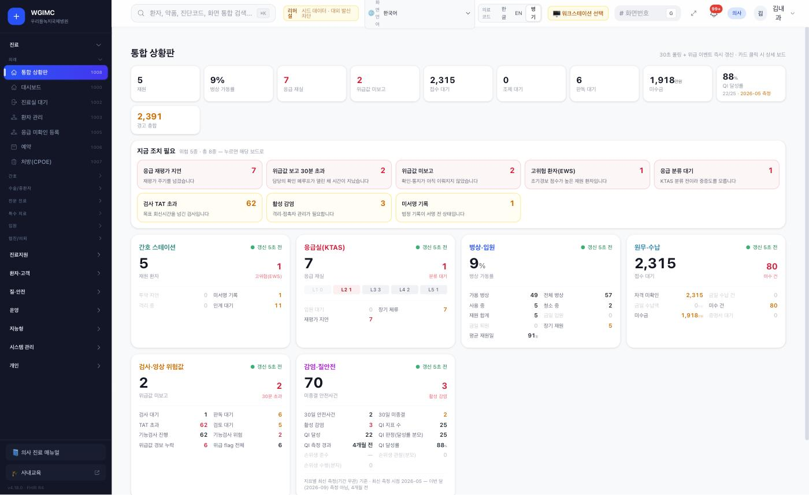

**의사** — 외래 메뉴에 `접수` 와 `외국인 환자 등록` 이 **없습니다**. 도움말이 「의사 진료 매뉴얼」로 바뀝니다.

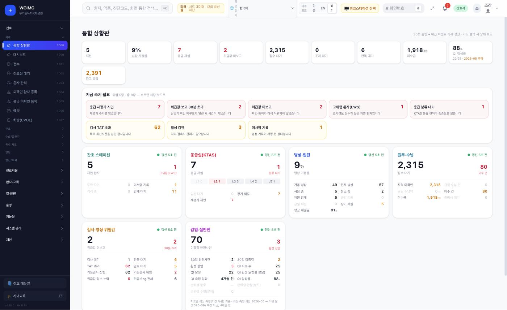

**간호사** — 같은 화면인데 `접수` 와 `외국인 환자 등록` 이 **있습니다**. 도움말은 「간호 매뉴얼」.

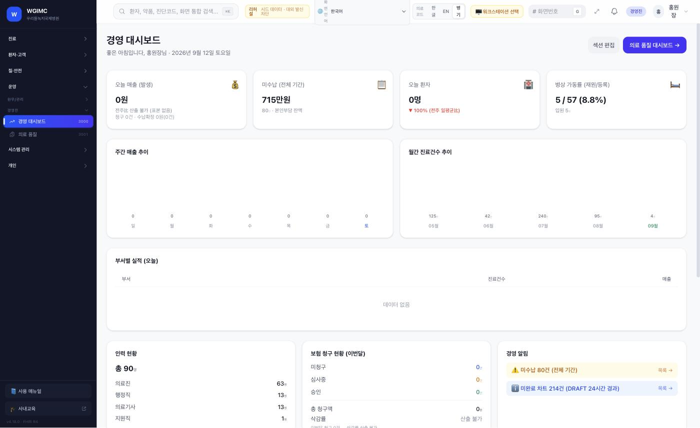

**경영진** — **첫 화면 자체가 달라집니다.** 경영 대시보드로 들어가고 메뉴가 크게 줄어듭니다. 여기서도 "전주비 **산출 불가**(표본 없음)" · 삭감률 "**산출 불가**".

근거: [화면으로 보는 생태계 — 사람을 넣고 빼는 일](../screens/by-onboarding.md#역할이-바뀌면-화면이-바뀐다)

---

## 외래 환자 한 명 — 34단계를 한 장으로

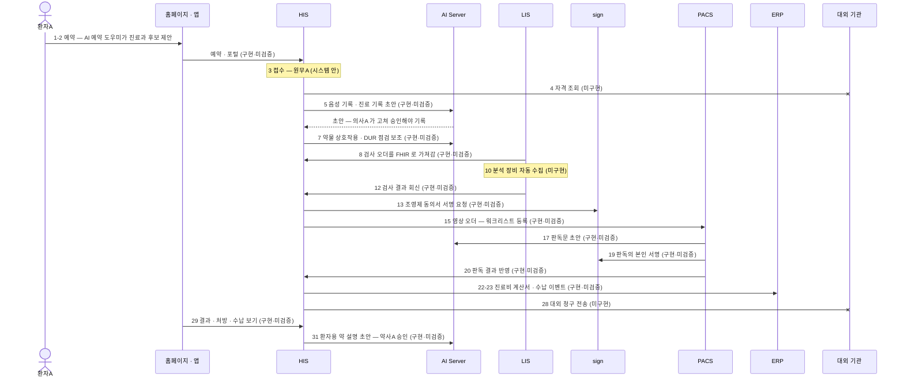
```mermaid
sequenceDiagram
  actor PT as 환자A
  participant FRONT as 홈페이지 · 앱
  participant HIS as HIS
  participant AIS as AI Server
  participant LIS as LIS
  participant SIGN as sign
  participant PACS as PACS
  participant ERP as ERP
  participant EXT as 대외 기관

  PT->>FRONT: 1-2 예약 — AI 예약 도우미가 진료과 후보 제안
  FRONT->>HIS: 예약 · 포털 (구현·미검증)
  Note over HIS: 3 접수 — 원무A (시스템 안)
  HIS-xEXT: 4 자격 조회 (미구현)
  HIS->>AIS: 5 음성 기록 · 진료 기록 초안 (구현·미검증)
  AIS-->>HIS: 초안 — 의사A 가 고쳐 승인해야 기록
  HIS->>AIS: 7 약물 상호작용 · DUR 점검 보조 (구현·미검증)
  LIS->>HIS: 8 검사 오더를 FHIR 로 가져감 (구현·미검증)
  Note over LIS: 10 분석 장비 자동 수집 (미구현)
  LIS->>HIS: 12 검사 결과 회신 (구현·미검증)
  HIS->>SIGN: 13 조영제 동의서 서명 요청 (구현·미검증)
  HIS->>PACS: 15 영상 오더 — 워크리스트 등록 (구현·미검증)
  PACS->>AIS: 17 판독문 초안 (구현·미검증)
  PACS->>SIGN: 19 판독의 본인 서명 (구현·미검증)
  PACS->>HIS: 20 판독 결과 반영 (구현·미검증)
  HIS->>ERP: 22-23 진료비 계산서 · 수납 이벤트 (구현·미검증)
  HIS-xEXT: 28 대외 청구 전송 (미구현)
  FRONT->>HIS: 29 결과 · 처방 · 수납 보기 (구현·미검증)
  HIS->>AIS: 31 환자용 약 설명 초안 — 약사A 승인 (구현·미검증)
```

**사람이 정하는 곳** — 의사A 가 AI 기록 초안을 고쳐 승인 · 판독의A 가 판독 확정과 본인 서명 · 약사A 가 환자용 약 설명 초안 감수 · 원무A 가 청구서 작성.
**대체 수단이 필요한 곳** — 자격 조회 · 대외 청구 전송(`미구현`) · 분석 장비 자동 수집(`미구현`) · 원격 상담(`중단`).

근거: [시나리오 01](../scenarios/01-outpatient-journey.md)(전체 34단계 · 화면 이름 · 결정 지점 포함)

---

# Ⅵ. 조건과 다음

---

## 제공 조건 — 세 겹으로 보면

| 겹 | 무엇 | 조건 |
|---|---|---|
| ① 이 저장소 | 소개 · 구축 자료 | **[MIT](../LICENSE)** · Copyright (c) 2026 Sean Shin (신현묵) |
| ② 생태계 소프트웨어 | 13개 시스템의 자체 코드 | MIT 로 제공하는 것이 **목표**입니다. **각 소스 저장소의 표기는 아직 MIT 로 정리되지 않았습니다**(독점 7 · UNLICENSED 1 · 혼재 1 · 표기 없음 4) |
| ③ MIT 가 덮지 않는 것 | 제3자 서버 · 고쳐 쓰는 제3자 코드 · **AI 모델 가중치** · **코드 마스터** | 각자의 조건 — [THIRD_PARTY.md](../THIRD_PARTY.md) |

**특히 법무와 함께 볼 것**

| 구성요소 | 원문이 적는 사실 |
|---|---|
| Grafana · Metabase · Orthanc 플러그인 | **AGPL-3.0 계열** — 제13조는 수정본을 네트워크로 제공하는 경우를 다룹니다 |
| Orthanc 코어 / browserless(v1) | GPL-3.0-or-later / GPL 또는 **상용 라이선스**(폐쇄 소스 상업 용도) |
| **Redis 7** | 7.4.x 부터 **RSALv2 또는 SSPLv1 중 선택** · 7.2 이하는 BSD-3-Clause |
| SNOMED CT · KCD · LOINC | 한국은 SNOMED International 회원국(2020-08) — **국가 배포 센터(NRC)에 사용 등록**. KCD 제9차가 2026-01-01 시행 중인데 기준 버전 표기는 제8차 |

**의료 면책 다섯 가지** — ① 의료기기가 아닙니다 ② **적합성 판단과 인허가는 구축 기관의 책임** ③ AI 산출물은 보조 정보 ④ 데모 데이터는 가상 ⑤ 구현 상태는 기준 버전에서의 사실.

> 이 장은 **법률 검토가 아닙니다.** 라이선스 이름 · 원문이 적는 사실 · 원문 위치만 옮깁니다.

근거: [A 10장](../overview/10-terms.md) · [DISCLAIMER.md](../DISCLAIMER.md) · [THIRD_PARTY.md](../THIRD_PARTY.md)

---

## 다음 — 무엇이 남았고, 어디를 읽나

**이 자료에 남은 일**

| 남은 일 | 그러면 무엇이 바뀌나 |
|---|---|
| ✅ 새 설치본으로 **S0~S8 을 따라가 봄** — 1차 완료(2026-09-13~16) | 연결 27개에 `검증됨`과 확인일이 붙었고, `확인 필요(따라가기)` 표시가 92 → 19곳으로 줄었습니다 |
| **기준 장비(x86 · GPU)에서 다시** | 권장 사양 · 처리량 · 응답 시간 · AI 품질 수치가 붙습니다 |
| **리얼 전환까지 따라가 봄** · 남은 시스템 설치(Clinic · twin · cerno · Jitsi · 환자 앱 · 홈페이지) | 리얼 모드에서만 나가는 연결과, 이번에 세우지 않은 시스템의 연결이 확인됩니다 |
| **시스템 담당의 사실 확인** | "시스템 담당 확인 전" 표시가 빠지고, 싣지 않은 연결 7개가 표에 들어옵니다 |
| **통합 릴리즈 번호 확정** | 기준이 `RELEASES/2026.09` 에서 번호 붙은 릴리즈로 옮겨 갑니다 |
| 위루비병원 설정 설치본 · **남은 화면 캡처** | 시나리오 캡처 8 자리가 채워집니다 |

**역할별로 이어 읽을 것**

| 역할 | 다음 문서 |
|---|---|
| 병원장 · CIO | [A 개요서 2 · 3 · 4 · 9 · 10장](../overview/) · [사람 결정 체크리스트](../checklist/decisions.md) · [통합 릴리즈 매니페스트](../RELEASES/2026.09/manifest.md) |
| 전산 · 인프라팀 | [B 구축 가이드 S0 · S1](../build-guide/) · [C 시스템 구성서](../systems/) · [⑧ 배포 구성](../diagrams/deployment.md) · [THIRD_PARTY.md](../THIRD_PARTY.md) |
| 의료정보 · 임상 리더 | [E 데모 시나리오](../scenarios/) · [③ 환자 여정](../diagrams/patient-journey.md) · [HIS 구성서](../systems/his.md) · [개원 체크리스트](../checklist/opening.md) |
| AI · 거버넌스 · 법무 | [S6 AI 계층](../build-guide/S6-ai.md) · [⑦ AI 호출 지도](../diagrams/ai-map.md) · [THIRD_PARTY §3](../THIRD_PARTY.md#3-ai-모델-가중치) · [의료 면책](../DISCLAIMER.md) |
| 연동 개발자 · 파트너 | [연결 상태 표](../RELEASES/2026.09/compatibility.md) · [연결 지도](../diagrams/connections.md) · [⑥ 표준 층](../diagrams/standards.md) · [④ 신원 허브](../diagrams/identity-hub.md) |

모르는 말이 나오면 [용어집](../glossary.md). 제작 계획과 진행은 [ROADMAP](../ROADMAP.md).

---

## 한 장으로 남길 말

> **13개 시스템 · 7계층. 코어 HIS 가 정본이자 신원 허브.**
> **AI 는 기관 안 GPU 한 장에서 돌고, 초안만 만듭니다. 승인은 사람이 합니다.**
> **구축은 S0~S8 아홉 단계 — 결정 56 · 개원 60 · Go-Live 60 을 화면의 항목으로 닫습니다.**
>
> **그리고 지금, 실제로 호출해 확인한 연결은 27개입니다** — 새 설치본끼리, 그중 23개는 **가드가 막는 것까지** 확인했습니다.
> 코드만 맞물린 연결이 61개 남아 있고, 기준 장비 · 리얼 전환 · 아직 세우지 않은 시스템은 다음 차례입니다.
>
> 이 자료는 모르는 것을 아는 척하지 않습니다. 그래서 아는 것을 믿을 수 있습니다.

[README](../README.md) · [ROADMAP](../ROADMAP.md) · [MIT](../LICENSE) · [의료 면책 고지](../DISCLAIMER.md)

---

# 부록. 프로젝트 13 — 한 장씩

> **EN** — Appendix: one slide per project, taken from the project introductions (current development line, written for hospital IT staff).

README 와 [프로젝트 소개서](../projects/)의 요약을 한 장씩 옮겼습니다. 자세한 내용과 근거는 각 소개서에 있습니다.

---

<!-- 덱 부록: 생성물 시작 — tools/build-project-digest.mjs 가 소개서 1절에서 만든다. 손으로 고치지 않는다 -->

## HIS — 병원 업무의 중심 시스템

**HIS 는 병원의 하루 업무(접수부터 진료 · 검사 · 약 · 수납 · 경영지원까지)를 한 시스템에서 처리하고, 생태계의 다른 시스템이 모두 붙는 중심입니다.**

| | |
|---|---|
| **지금 쓸 수 있나** | **조건부.** 시험 설치와 기능 검토는 지금 됩니다. 실운영에는 코드 마스터 반입 · 병원 이름을 코드에서 고치기 · 보험 청구 전송을 따로 마련하기가 필요합니다(소개서 §8) |
| **세워야 하는 것** | 서버 한 대(GPU 없음)에 API 서버 · 직원 웹 · 상시 감시자(별도 프로세스) · PostgreSQL 16 · Redis 7 · PDF 렌더러(별도 컨테이너) |
| **먼저 있어야 할 것** | 다른 시스템은 없어도 됩니다. 기관이 준비할 것은 코드 마스터(약가 · 진단 · 수가 · 검사) · 기관 정보 · 부서 · 병상 · 직원 · 필수 설정 · 운영 모드 결정입니다 |
| **받을 코드** | 이 소개서는 **현재 개발본**(버전 번호 없음 · v4.19.0 이후)을 설명하고, 새 설치 스크립트는 여기에만 있습니다. 통합 릴리즈 코드(v4.18.0)는 [구축 가이드 S1](../build-guide/S1-core-his.md)의 우회 순서로 세웁니다 · [소스 받기](../SOURCES.md). 세운 서버를 다음 판으로 올리는 절차는 저장소가 아직 정하지 않았습니다(소개서 §6) |
| **실제로 확인된 것** | 2026년 9월 시험 설치(통합 릴리즈 코드 · 가상 데이터)에서 LIS · sign · ERP · edu 연결 일부를 실제로 불러 확인했습니다. 다만 LIS 는 HIS 기본 검사 코드 15개 중 3개만 매핑돼 있었고, 현재 개발본으로는 다시 부르지 않았습니다(소개서 §5) |
| **아직 모르는 것** | 사용자 수에 맞춘 서버 사양 · 빈 서버에서의 설치 · 운영용 컨테이너 구성(compose)으로 끝까지 띄우기 · 서버 이중화와 복구 목표 시간 · 이관에 걸리는 시간 · HIS 가 멈췄을 때 다른 시스템의 동작 |

근거: [HIS 소개서](../projects/his.md)

---

## 공개 홈페이지 — 병원의 바깥 창구

**공개 홈페이지는 병원을 바깥에 소개하고 환자의 예약을 돕는 웹사이트이며, 보여 주는 내용은 병원 이름 · 연락처 · 주소를 빼고 모두 HIS 에서 가져옵니다.**

| | |
|---|---|
| **지금 쓸 수 있나** | **조건부.** HIS 가 먼저 돌고 있어야 하고, 병원 이름 · 연락처 · 주소를 코드에서 고친 뒤 기관마다 따로 빌드해야 합니다(소개서 §8) |
| **세워야 하는 것** | Node 22 로 도는 웹 서버 하나 — 컨테이너 · 프로세스 관리자 · 관리형 호스팅 중 하나로 띄웁니다. 데이터베이스 · 캐시 · GPU 는 없습니다 |
| **먼저 있어야 할 것** | HIS(공개 API · 환자 포털 인증 · 홈페이지 관리 화면) · HIS 에 넣은 콘텐츠 · 기관의 개인정보처리방침 · 이용약관 · 비급여 고지 문안 · 빌드 결과를 올릴 발행 대상 |
| **받을 코드** | **통합 릴리즈 코드로는 빌드가 멈춥니다**(첫 화면 4장의 구문 오류). HIS 저장소 **현재 개발본**의 `apps/homepage` 를 받습니다 · [소스 받기](../SOURCES.md). [구축 가이드 S2](../build-guide/S2-patient-access.md)는 설정 순서로 참고합니다 |
| **실제로 확인된 것** | 없음. 2026년 9월 시험 설치에서 이 앱은 설치하지 않았고, HIS 와의 두 연결은 코드를 읽어 판정한 것입니다 |
| **아직 모르는 것** | 방문자 규모에 맞춘 사양 · 콘텐츠 전송망이 필요한지 · 예약 대화를 얼마나 보관하는지 · 즉시 반영이 실패했을 때 관리 화면이 어떻게 보여 주는지 |

근거: [공개 홈페이지 소개서](../projects/homepage.md)

---

## 환자 앱 — 환자 손안의 병원 기록

**환자 앱은 환자가 휴대전화로 자기 진료 기록을 보고 예약 · 동의서 · 문진 같은 일을 처리하는 앱이며, 모든 데이터를 HIS 에서 받습니다.**

| | |
|---|---|
| **지금 쓸 수 있나** | **아니오.** 스토어에 배포된 앱이 없고, 기본 설정에서 환자 가입이 닫혀 있으며, 직원이 환자 계정을 만들어 주는 기능도 없습니다. HIS 의 웹 환자 포털도 같은 계정을 쓰므로 같은 제약을 받습니다(소개서 §8) |
| **세워야 하는 것** | 서버는 HIS 외에 없습니다. 앱을 빌드(Node · Expo SDK 56)해 스토어나 기관 배포 경로로 내보내는 일이 따로 있습니다 |
| **먼저 있어야 할 것** | HIS(환자 인증 · 환자 포털 켜짐) · 스토어 계정 · 앱 식별자 · 서명 키 · 스토어 빌드 설정(모두 저장소에 없음) · 배포 여부 · 알림의 적법 근거 · 본인인증 방식의 결정 |
| **받을 코드** | HIS 저장소 **현재 개발본**의 `apps/mobile` · [소스 받기](../SOURCES.md). 통합 릴리즈 코드에서는 담당의 메시지 답장이 보내지지 않습니다(소개서 §9). 빌드 때 HIS 주소를 꼭 지정합니다(소개서 §6) |
| **실제로 확인된 것** | 없음. 2026년 9월 시험 설치에서 앱은 설치하지 않았고, 실기기 화면 시험도 없습니다 |
| **아직 모르는 것** | 스토어 심사와 의료 앱 규제 요건 · 웹 포털과의 화면별 차이 |

근거: [환자 앱 소개서](../projects/patient-app.md)

---

## LIS — 검사실의 업무 시스템

**LIS 는 진단검사 · 미생물 · 병리 · 수혈 · 유전체 검사의 전 과정을 처리하는 검사실 시스템이며, HIS 에서 검사 처방을 받아 검증된 결과를 돌려줍니다.**

| | |
|---|---|
| **지금 쓸 수 있나** | **조건부.** HIS 가 먼저 있어야 하고, 개시 전에 검사 코드 매핑과 참고치 · 위험치 서명을 끝내야 합니다. 장비 결과를 자동으로 받으려면 중계 장치나 파일 반입이 필요합니다(소개서 §8) |
| **세워야 하는 것** | Docker 호스트 하나에 컨테이너 셋(PostgreSQL 16 · API · 웹)과, 서버의 예약 작업으로 도는 매일 백업. 캐시 · 메시지 브로커 · GPU 는 없습니다 |
| **먼저 있어야 할 것** | HIS(검사 처방 · 서버 간 자격 · 코드 카탈로그 키) · 검사 코드 매핑 · 검사실과 법무가 서명한 참고치 · 위험치 · 수가 코드 · TLS · DNS · 방화벽 · 백업 저장소 · LIS 직원 계정. PACS · ERP 는 필요할 때 |
| **받을 코드** | LIS 저장소의 현재 개발본은 **통합 릴리즈 코드와 같습니다** · [소스 받기](../SOURCES.md). 설치 스크립트는 그대로는 끝나지 않으므로 [구축 가이드 S3](../build-guide/S3-clinical-departments.md)의 순서를 함께 봅니다(소개서 §6) |
| **실제로 확인된 것** | 2026년 9월 시험 설치(가상 데이터)에서 HIS 와의 오더 · 취소 · 결과 · 환자 조회 · 코드 반입, PACS 병리 슬라이드 두 경로, ERP 청구를 실제로 불러 확인했습니다. **범위는 검사 하나입니다** — 갑상선기능(TSH) 오더가 LIS 에 접수되고, 결과가 HIS 에서 확정되고, 취소가 전해졌습니다. 매핑이 없는 혈액검사(CBC) 오더는 LIS 가 보류하고 경보를 냈습니다. HIS 기본 검사 코드 15개 중 매핑된 것은 3개였습니다 |
| **아직 모르는 것** | HIS 와의 세 기능(반사 검사 · 수혈 동의 · 조직 결재)의 실제 동작 · 하루 검체 수와 동시 사용자에 맞춘 사양 · 기존 검사실 시스템의 데이터를 옮기는 방법 · 어떤 장비 중계 장치를 쓸지 |

근거: [LIS 소개서](../projects/lis.md)

---

## PACS — 영상을 저장하고 판독하는 시스템

**PACS 는 병원의 의료 영상을 받아 저장하고, 필요한 사람에게 보여 주고, 판독의가 판독문을 쓰고 서명하기까지를 맡습니다.**

| | |
|---|---|
| **지금 쓸 수 있나** | 조건부 — 영상을 받아 저장하고 판독 · 서명하는 기능은 다른 시스템 없이 돌도록 만들어져 있습니다. 시험 설치에서는 그 일부만 확인했고, 촬영 장비에서 영상을 받는 것은 확인하지 않았습니다(소개서 §6). HIS 와 오더 · 결과를 자동으로 주고받는 길도 아직이고, 인허가받은 의료기기가 아닙니다 |
| **세워야 하는 것** | 컨테이너 약 12개 — 웹 입구(nginx) · 백엔드 API · 비동기 작업자 · 영상 서버(Orthanc) · 워크리스트 서버 · HL7 수신기 · 관리 화면 · 웹 뷰어 · PostgreSQL 16 · Redis 7. 영상 파일을 담을 디스크. 모니터링은 선택. GPU 는 필요 없음 |
| **먼저 있어야 할 것** | 다른 프로젝트는 없어도 됩니다. HIS 신원으로 들어오려면 HIS, 판독 서명에는 sign, AI 보조에는 AI Server. 기관은 촬영 장비 목록 · 공개 주소와 TLS 인증서 · 영상 저장 용량을 준비합니다 |
| **받을 코드** | 이 소개서가 설명하는 개발본은 통합 릴리즈 코드와 같습니다 — [소스 받기](../SOURCES.md). 설치 파일이 그대로는 끝나지 않아 [우회 순서](../build-guide/S3-clinical-departments.md)를 함께 봅니다 |
| **실제로 확인된 것** | 2026년 9월 시험 설치에서 sign(판독 서명 · 조영제 동의서 환자 서명 — 본인확인은 모의)과 LIS(병리 워크리스트 등록 · 취소 · 뷰어 링크 · 도착 확인 — 합성 슬라이드)를 불러 확인했습니다. PACS 혼자 해 본 범위는 소개서 §6 「시험 설치에서 PACS 혼자 해 본 것」. HIS · 촬영 장비 · AI Server 와는 아직 |
| **아직 모르는 것** | 서버 사양 · 영상 한 건의 평균 용량 · 백업 크기와 복구 시간 · 기존 PACS 에서 옮기는 시간 · 실제 촬영 장비와의 호환 |

근거: [PACS 소개서](../projects/pacs.md)

---

## sign — 서명의 증거를 만드는 시스템

**sign 은 병원 문서에 대해 「누가 · 언제 · 무엇에 서명했고, 그 뒤로 바뀌지 않았다」를 나중에 누구나 확인할 수 있게 만드는 전자서명 서비스입니다.**

| | |
|---|---|
| **지금 쓸 수 있나** | 조건부 — 다른 시스템의 요청으로 서명을 만들고 검증하는 데까지는 동작을 확인했습니다. 실제 환자가 서명하기 전에 본인확인 · 문자 사업자 계약이 있어야 하고, 법적 효력 판단은 기관이 합니다 |
| **세워야 하는 것** | 컨테이너 3개 — 서명 서비스 · 웹(관리 콘솔 · 서명 포털) · PostgreSQL 16. 키 보관소 볼륨. 선택으로 키 연산 프록시 · 본인확인 프록시. GPU · 캐시는 필요 없음 |
| **먼저 있어야 할 것** | 의료진 서명을 쓰려면 HIS. 기관은 마스터키 · 백업 암호의 보관 방법, 본인확인 · 문자 사업자 계약, 공인 타임스탬프 · 키 보관 장치(HSM)를 쓸지를 정합니다 |
| **받을 코드** | 이 소개서는 통합 릴리즈 코드(1.30.1) 뒤 2커밋을 더한 개발본을 설명합니다. 더해진 것은 콘솔 로그인 화면의 시험용 계정 패널뿐이고 서명 서비스는 같습니다 — [소스 받기](../SOURCES.md) |
| **실제로 확인된 것** | 2026년 9월 시험 설치에서 9개 연결(HIS 3 · PACS 2 · ERP 2 · edu 2)을 가상 데이터로 불러 확인했습니다. 환자 본인확인은 모의 공급자였고, HIS 화면에서 보내는 동의서 서명 요청은 아직입니다 |
| **아직 모르는 것** | 서명 처리량 · 지연 · 권장 서버 사양 · 이미 다른 방식으로 서명한 문서를 옮기는 방법 · 인증서 만료 때의 갱신 운영 |

근거: [sign 소개서](../projects/sign.md)

---

## ERP — 병원 경영지원 시스템

**ERP 는 병원의 돈 · 사람 · 물자를 하나의 전표 원장(모든 거래가 모이는 회계 장부) 위에서 관리하는 경영지원 시스템입니다.**

| | |
|---|---|
| **지금 쓸 수 있나** | 조건부 — HIS 가 먼저 서 있어야 하고, HIS 와 같은 호스트에 둘 때 동작을 확인했습니다. 국내 의료 · 세무 · 노동 제도를 전제로 만들어졌습니다 |
| **세워야 하는 것** | 앱 컨테이너 4개(core API · 웹 · 연동 작업자 · 배치 작업자) · PostgreSQL — 권장 배치는 HIS 의 DB 서버 안에 ERP 전용 데이터베이스(6절) · Redis 7 · 첨부와 백업을 둘 디스크. 경영분석(BI)은 선택. GPU 는 필요 없음 |
| **먼저 있어야 할 것** | HIS — 로그인 · 첫 관리자 · 회계로 옮길 사건이 모두 HIS 에서 옵니다. 기관은 수가 · 약제 마스터 · 고시 원문 · 기관 정보 · 급여 규칙 · 담당 역할 배정을 준비합니다 |
| **받을 코드** | 이 소개서가 설명하는 개발본은 통합 릴리즈 코드와 같습니다 — [소스 받기](../SOURCES.md). HIS · AI Server 를 부르는 주소 일부가 코드에 고정돼 있어, 다른 호스트에 두려면 코드를 고쳐야 합니다(8절) |
| **실제로 확인된 것** | 2026년 9월 시험 설치에서 9개 연결(HIS 6 · sign 2 · LIS 1)을 가상 데이터로 불러 확인했습니다. HIS 와 같은 호스트에 둔 구성이었습니다 |
| **아직 모르는 것** | 사용자 수 · 거래량에 따른 사양 · 기존 회계 · 급여 시스템에서 옮기는 품 · 세법 · 4대보험 개정 때 고치는 주체 · 전자세금계산서의 실제 전송 · DB 를 HIS 와 나눴을 때의 차이 |

근거: [ERP 소개서](../projects/erp.md)

---

## AI Server — 기관 안의 AI 연산 서버

**AI Server 는 생태계의 AI 연산을 기관 안 GPU 서버 한 대에 모아 맡고, 다른 시스템이 부르면 초안과 보조 결과를 돌려주는 서버입니다.**

| | |
|---|---|
| **지금 쓸 수 있나** | 조건부 — 새 서버에 올리는 설치 정의가 없어 손으로 설치하고, 모델은 기관이 직접 받습니다. 부르는 시스템과의 연결은 아직 하나도 끝까지 확인되지 않았고, 처리량과 답의 품질은 재지 않았습니다 |
| **세워야 하는 것** | GPU 서버 한 대 — API 서버(Flask · Gunicorn 프로세스 하나) · 같은 호스트의 모델 서빙(Ollama) · 음성 인식(Whisper). 검색 색인(ChromaDB)과 SQLite 파일은 앱 안에 있어 별도 DB 서버가 없습니다. 다른 시스템이 부르려면 앞단 프록시를 둡니다 |
| **먼저 있어야 할 것** | 다른 프로젝트 없이도 뜨지만, 부르는 시스템(주로 HIS)이 있어야 쓸모가 있습니다. 기관은 모델 가중치(약관 확인) · 공공 데이터 이용 키 · 공공 데이터를 받을 인터넷 연결이나 반입 절차를 준비합니다 |
| **받을 코드** | 이 소개서가 설명하는 현재 개발본을 받습니다. 통합 릴리즈 코드로 새로 설치하면 API 키 발급이 실패할 수 있어서입니다. 판 번호 · 커밋 · 달라진 점은 9절 · [소스 받기](../SOURCES.md) |
| **실제로 확인된 것** | 없음 |
| **아직 모르는 것** | 처리량 · 응답 시간 · 답의 품질 · 동시 사용자에 따른 GPU · 메모리 · 디스크 · 모델을 모두 받았을 때의 디스크 합계 · 장애 뒤 복구 절차 · 요청과 응답 본문을 얼마나 남기는지 |

근거: [AI Server 소개서](../projects/ai-server.md)

---

## twin — 환자와 병원 운영을 읽어 위험을 미리 보여 주는 디지털 트윈

**twin 은 HIS 의 자료를 읽어서, 의료진에게는 환자의 위험 점수와 인계 요약을, 병원 운영 쪽에는 병상 · 병동 · 장비 지표와 「이렇게 바꾸면 어떻게 되나」 시뮬레이션을 보여 주는 별도 서비스입니다.**

| | |
|---|---|
| **지금 쓸 수 있나** | 조건부 — **HIS 가 있어야** 씁니다. 다른 시스템과 실제로 이어 본 적이 없고, 의료기기 해당 여부도 정해지지 않았습니다(8절) |
| **세워야 하는 것** | 컨테이너 5개 — API · 워커(같은 이미지) · PostgreSQL 16 · Redis 7 · 웹. 웹은 설치 파일에 선택 프로파일로 적혀 있지만 켜서 올립니다 — 빼면 HIS 차트에서 twin 을 열 수 없습니다. 생리 엔진 컨테이너는 선택입니다. GPU 는 필요 없습니다 |
| **먼저 있어야 할 것** | HIS — 앱 등록 · twin 전용 읽기 계정 · 환자의 AI 활용 동의 기록. AI Server — 설명 초안 · 아바타 · 영상 계산을 쓸 때만, 호출 키와 함께 |
| **받을 코드** | 통합 릴리즈 코드와 같은 현재 개발본입니다. 저장소 태그가 아니라 [소스 받기](../SOURCES.md)가 가리키는 커밋을 받습니다 |
| **실제로 확인된 것** | 없음 — 2026년 9월 시험 설치에서 twin 은 세우지 않았습니다. 화면 캡처는 가상 병원 데이터로 찍은 것이고, 연결 확인은 아닙니다 |
| **아직 모르는 것** | 동시 사용자 수 · HIS 에 주는 읽기 부하 · HIS 쪽 준비에 걸리는 시간 · 감사 기록 보존 기간 설정 · 의료기기 해당 여부 |

근거: [twin 소개서](../projects/twin.md)

---

## cerno — 근거가 있을 때만 답하는 의료진별 임상 질의 도우미

**cerno 는 의료진이 차트에서 던진 질문에, 기관 지침과 본인이 올린 자료에서 찾은 근거로만 답변 초안을 만들고, 근거가 없으면 답하지 않는 도우미입니다. 지금은 임상 결정에 쓰지 않는 섀도우(참고 운영) 파일럿입니다.**

| | |
|---|---|
| **지금 쓸 수 있나** | 조건부 — **HIS 와 AI Server 가 둘 다 있을 때, 임상 결정에 쓰지 않는 시험 운영으로만** 씁니다. 이 한정은 프로그램이 아니라 운영 규칙으로 지킵니다(8절) |
| **세워야 하는 것** | 컨테이너 3개 — 웹(밖으로 여는 유일한 곳) · API · Redis 7. 기록은 데이터 볼륨의 SQLite 파일에 둡니다. GPU 는 필요 없습니다 |
| **먼저 있어야 할 것** | HIS 에 앱 등록 · AI Server 의 호출 키와 답변 · 임베딩 모델 · 참여 의료진 명단 · 공용 서고에 넣을 기관 지침 원문 |
| **받을 코드** | 통합 릴리즈 코드와 같은 현재 개발본입니다. [소스 받기](../SOURCES.md)가 가리키는 커밋을 받습니다 |
| **실제로 확인된 것** | 없음 — 2026년 9월 시험 설치에서 cerno 는 세우지 않았습니다. 파일럿 결과도 저장소에 없습니다 |
| **아직 모르는 것** | 답이 나오기까지 걸리는 시간 · 동시에 몇 명이 쓸 수 있나 · 기관 서고에서의 근거 기준값 · 질의 기록 보존 기간 |

근거: [cerno 소개서](../projects/cerno.md)

---

## edu — 직원 교육 · 법정교육 · 전자 이수증

**edu 는 직원에게 교육을 전하고, 이수 하나를 HIS 의 교육 기록과 전자서명된 이수증으로 남기는 시스템입니다.**

| | |
|---|---|
| **지금 쓸 수 있나** | 조건부 — **HIS 가 먼저 돌고 있어야** 씁니다. 이수증까지 내려면 sign 도 있어야 합니다 |
| **세워야 하는 것** | 컨테이너 4개 — API · 웹 · PostgreSQL 16 · Redis 7. 동영상 · 이수증을 담는 콘텐츠 볼륨과 그 백업. GPU 는 필요 없습니다 |
| **먼저 있어야 할 것** | HIS — edu 주소 설정 · 서명 비밀값 공유. sign — 이수증에 서명할 자격(등록자 인증서) · https 로 edu 에 닿는 길. 기관이 정할 교육 담당과 콘텐츠 검수 책임자 |
| **받을 코드** | 통합 릴리즈 코드와 같은 현재 개발본입니다([소스 받기](../SOURCES.md)). 병원 하나에 세우는 **단독 배포**이며, 저장소 설치 안내에 빠진 단계가 있어 6절 순서를 따릅니다 |
| **실제로 확인된 것** | 2026년 9월 시험 설치에서 가상 데이터로 — HIS 사내교육 단추 로그인 · 공개키 · 직원 명부 · 이수 기록, sign 이수증 서명과 완료 통지. 운영 병원이 아니고, edu 로그인 화면 경로 · 직원 이벤트 · Clinic 은 확인 전이며 AI 는 문항 생성만 불러 봤습니다 |
| **아직 모르는 것** | 동시에 몇 명이 배울 수 있나 · 동영상 저장 용량 · 복구 절차와 걸리는 시간 · sign 없이 쓰는 구성 · 실제 기관의 운영 여부 |

근거: [edu 소개서](../projects/edu.md)

---

## Clinic — 병원 그룹웨어

**Clinic 은 직원이 인수인계 · 근무표 · 병동 현황 · 알림 · 결재를 한곳에서 보는 병원 그룹웨어이고, HIS 의 자료를 받아 보여 줍니다.**

| | |
|---|---|
| **지금 쓸 수 있나** | 조건부 — 운영사 서버에 가입해 쓰거나(가입형), 병원 서버에 세웁니다(설치형). 설치형은 병원 화면만 떼어 세울 수 없습니다. HIS 자료를 보려면 HIS 가 있어야 하고, 실제로 이어 본 연결은 없습니다 |
| **세워야 하는 것** | **설치형에서 띄우는 것 전부:** ① 메인앱 프로세스 — 같은 저장소의 다른 서비스와 함께 쓰는 공용 앱. HIS 연동 API · 웹훅 수신이 여기 있습니다 ② 병원 화면 프로세스 ③ 인증 서비스 프로세스 ④ PostgreSQL 15 컨테이너(벡터 검색 확장이 든 이미지) ⑤ Redis 컨테이너 ⑥ 병원 서비스 상태 테이블을 더하는 SQL 스크립트 실행 HIS 연동만 쓰면 ①④⑤ 로 됩니다. 근무 캘린더 일정 알림을 쓰려면 예약 작업 프로세스를 더합니다. 저장소의 나머지 프로세스 8개는 병원 서비스가 부르지 않습니다(4절). GPU 는 필요 없습니다 |
| **먼저 있어야 할 것** | HIS — Clinic 주소 · Clinic 이 발급한 API 키(6절) · 병원 코드 · 웹훅 서명 비밀값. 메인앱에 넣을 HIS 주소와 HIS 쪽 키. 빌드할 때 봇 방지 사이트 키 |
| **받을 코드** | 통합 릴리즈 코드와 같은 현재 개발본입니다([소스 받기](../SOURCES.md)). 병원 밖 서비스까지 든 **저장소 전체**를 받고, 병원 서비스 전용 태그가 없어 커밋으로 고정합니다 |
| **실제로 확인된 것** | 없음 — 2026년 9월 시험 설치에서 Clinic 은 세우지 않았습니다. 공급 형태 · 로그인 흐름만 운영사의 공개 소개 페이지로 읽었습니다 |
| **아직 모르는 것** | 메인앱이 HIS 에 병동 자료를 물을 때 쓰는 키를 HIS 에서 어떻게 받나 · 그 요청이 HIS 쪽과 맞물리나 · 서버 사양 · 백업과 복구 · 가입형의 저장 위치와 계약 조건 |

근거: [Clinic 소개서](../projects/clinic.md)

---

## Jitsi — 원격진료 화상 서버

**Jitsi 는 원격진료 · 원격협진 화상을 병원이 직접 운영하는 화상 서버이며, 지금 설치본은 동작하지 않아 새로 구성해야 합니다.**

| | |
|---|---|
| **지금 쓸 수 있나** | 아니오 — 이 생태계를 개발하며 쓰던 설치본이 동작하지 않습니다. 원격진료가 필요한 기관은 새로 구성합니다 |
| **세워야 하는 것** | 컨테이너 9개 — 화상 웹 · 시그널링 · 회의 조정 · 미디어 중계 · TURN · 녹화 · 회의 관리 API · 지표 수집 · 대시보드. 실시간 자막을 쓰면 2개 더, 그리고 기관이 두는 앞단 프록시. GPU 는 필요 없습니다 |
| **먼저 있어야 할 것** | HIS(입장 토큰을 만듦) · 공개 도메인 · 공인 주소 · TLS 인증서 · 방화벽 모든 계층의 미디어 포트 · 녹화용 호스트 사운드 장치 · HIS 와 나눌 공유 비밀키. AI Server 는 선택 |
| **받을 코드** | 통합 릴리즈 코드와 같은 현재 개발본입니다. 저장소 태그가 아니라 [소스 받기](../SOURCES.md)가 가리키는 커밋을 받습니다 |
| **실제로 확인된 것** | 없음 — 지금 설치본이 동작하지 않고, 2026년 9월 시험 설치에서도 세우지 않았습니다 |
| **아직 모르는 것** | 새로 구성하면 끝까지 동작하는지 · 동시 통화 수와 화질별 사양 · 구성에 드는 기간 · 휴대전화 환자의 입장 방법 · 원격진료 규제 대응 |

근거: [Jitsi 소개서](../projects/jitsi.md)

---

<!-- 덱 부록: 생성물 끝 -->
