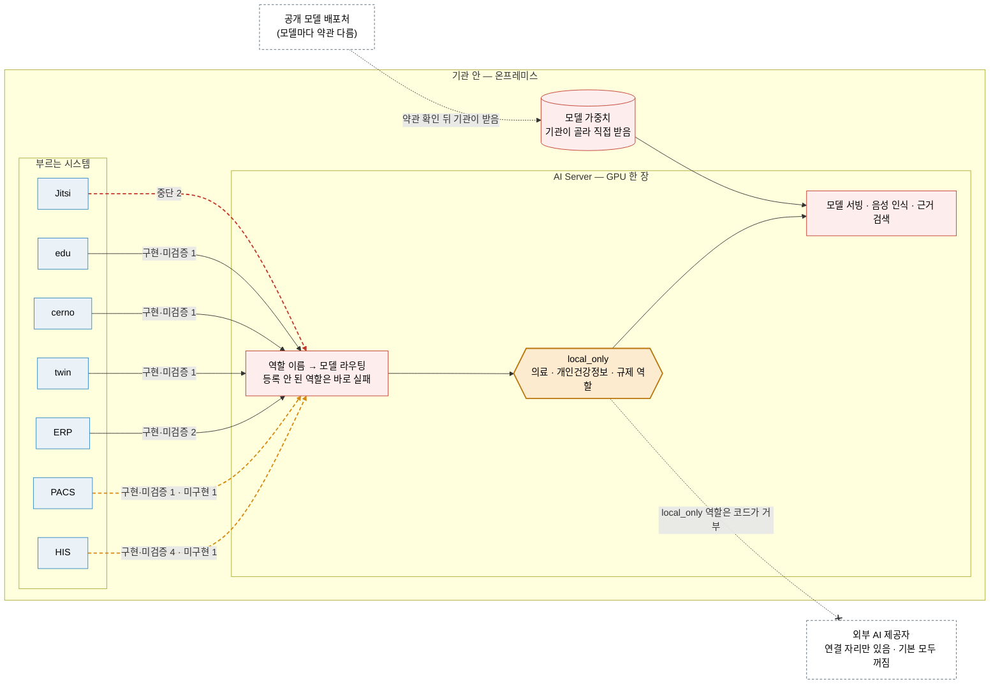

# ⑦ AI 호출 지도 (초안)

> 이 생태계의 AI 연산은 **AI Server 한 곳**이 맡습니다. 각 시스템은 AI Server 를 불러 초안 · 분류 보조 · 근거 검색 · 음성 인식을 받고, AI 산출물은 사람이 승인해야 정본이 됩니다. 의료 · 개인건강정보 · 규제 관련 작업은 `local_only` 정책으로 묶여 **기관 밖 AI 제공자로 나가지 않습니다.**

근거: 호출 연결과 상태는 [`RELEASES/draft/compatibility.md`](../RELEASES/draft/compatibility.md)(AI Server 가 들어간 쌍 · 판정 2026-09-11 · 코드 대조 · 실제 호출 확인 없음) · `local_only` · 모델 · GPU 는 [README 「AI 는 소비자용 GPU 한 장으로」](../README.md#ai-는-소비자용-gpu-한-장으로--rtx-508016gb)와 [AI Server 요약](../RELEASES/draft/systems/ai-server.md) · 모델 약관은 [THIRD_PARTY §3](../THIRD_PARTY.md#3-ai-모델-가중치)

- 선 위 글자는 그 시스템 → AI Server 연결의 상태별 개수입니다. 한 시스템이 여러 목적으로 부르면 목적마다 한 연결로 셉니다.
- 파선: 주황 = `미구현` 이 섞인 쌍 · 빨강 = `중단`. Jitsi 는 현재 설치본이 동작하지 않아 `중단`입니다.
- `local_only` 에서 외부 AI 제공자로 가는 선은 **막힌 길**(× 표시)입니다. 외부 제공자 연결 자리는 있지만 기본값은 모두 꺼져 있고, 의료 · 개인건강정보 · 규제 역할은 켜더라도 코드가 거부합니다(실패하면 막는 쪽 · README 2026-09-11 확인).

> 📷 **화면으로 보기** — AI 가 무엇을 하고 무엇이 남는지는 [AI 감독 관제](../screens/his.md#ai-감독-관제--분모가-없으면-비율을-내지-않는다)에서 봅니다(비율에 분모를 병기 · 표본이 없으면 `산출 불가`). 기관이 받아 둔 모델 목록은 [PACS AI 모델 관리](../screens/pacs.md#화면)에 있고 **용도 칸이 전부 `보조`** 입니다. AI 가 증상에서 진료과를 고를 때 쓰는 근거표는 [트리아지 관리](../screens/his.md#트리아지-관리--ai-가-쓰는-표는-기관이-고친다)이며 **기관이 화면에서 고칩니다.**

## 부르는 시스템과 목적

| 부르는 쪽 | 목적(연결 표 요약) | 상태 |
|---|---|---|
| HIS | 임상 보조 스킬 전반(요약 · 초안 · 분류 보조 · DUR · 근거 검색 등) | `구현·미검증` |
| HIS | 진료 음성 기록 — 실시간 음성 인식 | `구현·미검증` |
| HIS | 앰비언트 진료 기록 — 녹음 전사 · 화자 분리 | `구현·미검증` |
| HIS | 생성형 소형 기능 — 환자 안내 · 데이터 품질 · 약 설명 · 화면 번역 초안 등 | `구현·미검증` |
| HIS | 관리 화면 모델 레지스트리 — 설치 모델 목록 대조 | `미구현` |
| PACS | 영상 AI 보조(판독문 초안 · 비교 판독 · 구조화 판독문) · 텍스트 보조 | `구현·미검증` |
| PACS | AI 서버 가용성 감시 | `미구현` |
| ERP | 보험 · 수가 공시 색인 발신 | `구현·미검증` |
| ERP | 청구 사전심사 — 공시 근거 검색 · 코드 점검 보조 | `구현·미검증` |
| twin | 위험 예측 보조 · DUR · 요약 · 근거 검색 · 영상 연산 | `구현·미검증` |
| cerno | 의료진별 근거 검색 · 근거 기반 답변 초안 · DUR | `구현·미검증` |
| edu | 학습 튜터(자료 근거 검색) · 문항 초안 · 집합교육 녹취 전사 · 요약 | `구현·미검증` |
| Jitsi | 원격 상담 녹화 회의록 분석 | `중단` |
| Jitsi | 원격 상담 실시간 자막 · 번역 | `중단` |

## 경계 — 무엇이 기관 안에 있고 무엇을 기관이 준비하나

| 항목 | 이 생태계가 하는 것 | 기관이 하는 것 |
|---|---|---|
| AI 연산 | AI Server 가 기관 안의 GPU 한 장(개발 기준 RTX 5080 · 16GB)에서 돌립니다. 가속기는 CUDA · Apple Silicon · CPU 중 자동 선택 | GPU 서버 확보 |
| 환자 데이터 | `local_only` 역할은 외부 AI 제공자로 보내지 않습니다(코드가 거부) | 외부 제공자 연결을 켤지 결정 · 임상데이터 전송 목적지의 법적 한정(결정 등록부 `legal.aiEgress.transferScope`) · 임상데이터 처리 경계(`legal.phiBoundary.gpuTier`) |
| 모델 가중치 | 저장소 · 소스에 넣지 않습니다. 설정은 역할 → 모델 라우팅 표로 바꿉니다 | 모델마다 약관을 읽고 직접 받아 설치(Ollama 또는 모델 배포처) |
| AI 기능 켜기 | 기능마다 스위치가 있습니다. 코드 기본값은 기능마다 다릅니다 | 설치 직후 끄고, 결정 등록부의 의결에 따라 하나씩 켬([구축 단계 로드맵](build-roadmap.md) S6) |
| AI 산출물 | 초안 · 제안으로 표시하고, 사람이 승인하면 정본이 되며 승인 이력이 남습니다 | 승인 권한과 감독 지표 운영 |

AI 는 **판단을 돕는 보조**입니다. 진단 · 판단은 의료진이 하고, 임상 사용의 적합성 · 의료기기 해당성은 구축 기관이 판단합니다([의료 면책 고지](../DISCLAIMER.md)).
