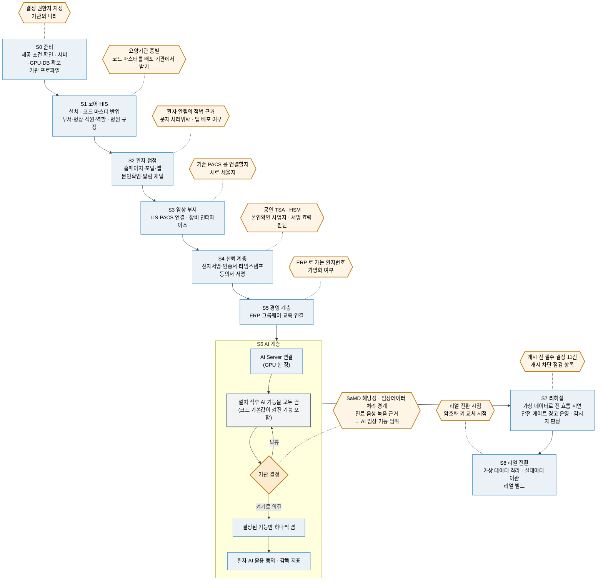

# ② 구축 단계 로드맵 S0~S8 (초안)

> 이 생태계는 9단계(S0 준비 ~ S8 리얼 전환)로 세웁니다. 단계마다 **사람이 정할 것**(육각형)이 있고, 시스템은 그 결정을 대신하지 않습니다. S6 에서는 **설치 직후 AI 기능을 끄고, 기관 결정에 따라 하나씩 켭니다** — 코드 기본값이 켜진 기능이 있기 때문입니다.

> **EN** — The build path S0 → S8 as one picture, with the human decisions that gate each stage marked as hexagons. It shows what can be stood up independently and what has to wait for a decision rather than for code.

근거: [README 「구축은 이렇게 진행됩니다」](../README.md#구축은-이렇게-진행됩니다) · [ROADMAP §4](../ROADMAP.md#4-구축-가이드의-단계-b) · 사람이 정할 것은 [결정 등록부 체크리스트](../checklist/decisions.md)(HIS v4.18.0 · 기준 커밋에서 추출)와 [sign 릴리즈 요약 §5](../RELEASES/2026.09/systems/sign.md)

> 📷 **화면으로 보기** — 이 로드맵은 HIS 의 세 화면에서 진행됩니다 → [개원·운영 단계 · Go-Live 관제 · 중요 결정](../screens/his.md#구축을-진행하는-세-화면). 연동을 여는 절차는 [연동 개통 게이트](../screens/his.md#연동-개통-게이트--개발-시드를-실결재로-바꾸는-절차)입니다.

## S6 — 왜 먼저 끄는가

- AI 없이도 HIS 는 동작하도록 설계했습니다. AI 가 없거나 멈추면 화면이 그 칸을 "폴백" 또는 "산출 불가"로 표시합니다.
- 그런데 **코드 기본값은 기능마다 다릅니다**(README · 2026-09-11 코드 확인). 환자 브리핑 야간 배치 · 데이터 품질 AI 는 기본 꺼짐이지만, AI 기능 전체 스위치와 PACS 영상 자동 선별은 기본 켜짐입니다.
- 그래서 설치 직후 모두 끄고, 결정 등록부에서 의결된 기능만 켭니다. AI 임상 기능 범위(`policy.ai.clinicalFeatureScope`)는 **선행 결정 세 개**(SaMD 해당성 · 임상데이터 처리 경계 · 진료 음성 녹음 근거)가 먼저 정해져야 하는 개시 전 필수 결정입니다.

## 사람이 정할 것 — 도식의 육각형

단계 배치는 이 도식의 안내입니다. 단계별 목록은 새 설치본으로 S0~S8 을 따라가 본 뒤 [구축 가이드](../build-guide/)에서 확정합니다.

| 단계 | 사람이 정할 것 | 근거 |
|---|---|---|
| S0 | 결정 권한자 지정 · 이 설치본이 어느 나라 기관인가 | README S0 · `country.institutionProfile`(개시 전 필수) |
| S1 | 요양기관 종별(수가 단가를 정함) · 코드 마스터를 배포 기관에서 직접 받아 반입 | `billing.institutionType`(개시 전 필수) · [THIRD_PARTY §4](../THIRD_PARTY.md#4-코드-마스터기준-데이터) |
| S2 | 환자 앱 알림의 적법 근거 · 문자 처리위탁 계약 · 환자 앱 스토어 배포 여부 | `legal.patientPush.consentScope` · `legal.sms.entrustment`(둘 다 개시 전 필수) · `mobile.appStoreRelease` |
| S3 | 이미 쓰는 PACS 를 표준 프로토콜로 연결할지, 새로 세울지 | README 「최소한의 사양과 구현으로」 |
| S4 | 공인 타임스탬프 기관 · HSM · 본인확인 사업자 계약, 전자서명 법적 효력 판단 | [sign 요약 §2 · §5](../RELEASES/2026.09/systems/sign.md) · README 「지금 알고 시작해야 할 것」 |
| S5 | ERP 로 나가는 환자번호(MRN) 가명화 여부 | `legal.erpMrn.pseudonymization` |
| S6 | SaMD 해당성 · 임상데이터 처리 경계 · 진료 음성 녹음 근거 → AI 임상 기능 범위 | `legal.ai.deviceClassification` · `legal.phiBoundary.gpuTier` · `legal.voiceRecording.basis` → `policy.ai.clinicalFeatureScope` |
| S7 | 개시 전 필수 결정 11건 · Go-Live 개시 차단 항목 | [checklist/README](../checklist/README.md)(결정 등록부 개시 전 필수 11 · Go-Live 개시 차단 31) |
| S8 | 리얼 전환 시점 · 키 파생 통일과 키 교체 시점 · sign 의 실운영 전환 준비(CA 새로 만들기 · 연동 키 교체) | README S8 · [HIS 요약 §6](../RELEASES/2026.09/systems/his.md)(개발 → 리허설 → 리얼) · [sign 요약 §6](../RELEASES/2026.09/systems/sign.md) · `security.keyDerivationUnify`(개시 전 필수) |

키(`country.institutionProfile` 등)는 HIS 결정 등록부의 항목 이름입니다. 선택지와 결정권자는 [checklist/decisions.md](../checklist/decisions.md)에 있습니다.
