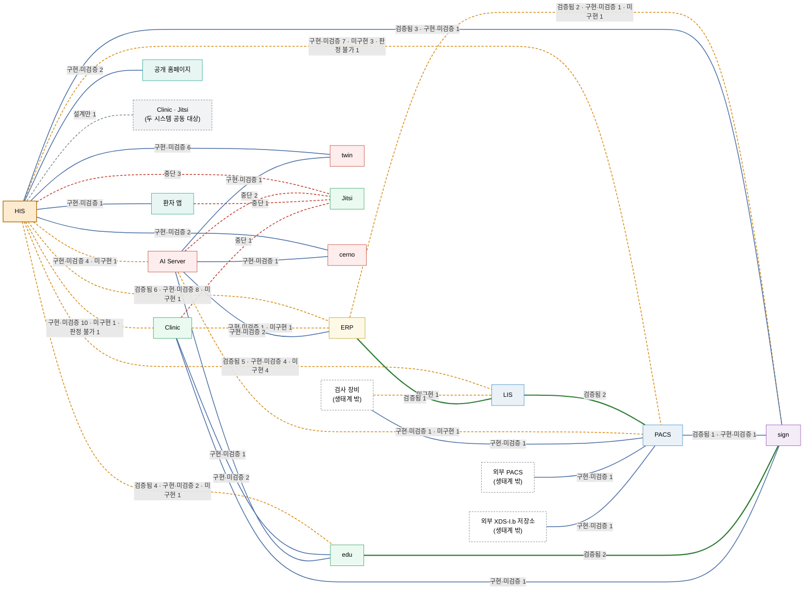

<!-- 생성물 — 직접 수정 금지. `node tools/build-diagrams.mjs` 로 RELEASES/draft/compatibility.md 에서 다시 만듭니다. -->

# 연결 지도 (초안 · 생성물)

> 시스템 사이 연결이 **코드상 어디까지 준비돼 있는지**를 한 장으로 봅니다. 쌍 하나를 선 하나로 그리고, 선 위에 상태별 연결 수를 적습니다.
> 근거: [`RELEASES/draft/compatibility.md`](../RELEASES/draft/compatibility.md) — 판정일 2026-09-11 · 양쪽 코드를 대조한 판정이며, 실제 호출로 확인한 연결은 아직 없습니다.

| 기준 | 값 |
|---|---|
| 선(시스템 쌍) | 33개 |
| 노드 | 17개 — 생태계 시스템 13 · 그 밖 4(검사 장비 · 외부 시스템 · 공동 대상) |
| 연결 | 113개 — 검증됨 26 · 구현·미검증 62 · 설계만 1 · 미구현 15 · 중단 7 · 판정 불가 2 |
| 싣지 않은 연결 | 7개 — 연결 표에 아직 없어 이 도식에도 없습니다 |
| 만든 방법 | 연결 표의 절(`### A ⇄ B`)마다 선 하나. 절 머리의 요약 줄 · 합계 표와 개수가 다르면 생성기가 멈춥니다 |

## 선 읽는 법

선의 모양은 그 쌍에 있는 연결 가운데 **가장 나쁜 상태**를 따릅니다. 한 쌍에 `구현·미검증` 12개와 `미구현` 1개가 있으면 주황 파선입니다. 개수는 선 위의 글자로 봅니다.

| 가장 나쁜 상태 | 선 | 이 도식의 쌍 수 |
|---|---|---:|
| `중단` | 파선(빨강) | 4 |
| `미구현` | 파선(주황) | 10 |
| `설계만` | 파선(회색) | 1 |
| `판정 불가` | 점선(보라) | 0 |
| `구현·미검증` | 실선 | 15 |
| `검증됨` | 실선(굵게) | 3 |

상태의 뜻은 [`compatibility.md` 의 "상태를 읽는 법"](../RELEASES/draft/compatibility.md#상태를-읽는-법)과 같습니다. 노드 색은 [계층 생태계 지도](layers.md)의 7계층을 따르고, 테두리가 파선인 노드는 생태계 시스템이 아닌 상대(검사 장비 · 외부 시스템)이거나 두 시스템을 함께 대상으로 하는 연결입니다.

## 도식

## 쌍별 표

연결 표와 같은 순서입니다. 연결 하나하나의 목적 · 프로토콜은 [`compatibility.md`](../RELEASES/draft/compatibility.md)에서 봅니다.

| # | 쌍 | 연결 수 | 방향별 | 상태별 | 가장 나쁜 상태 |
|---:|---|---:|---|---|---|
| 1 | HIS ⇄ ERP | 15 | HIS → ERP 6 · ERP → HIS 9 | 검증됨 6 · 구현·미검증 8 · 미구현 1 | `미구현` |
| 2 | HIS ⇄ LIS | 13 | HIS → LIS 4 · LIS → HIS 9 | 검증됨 5 · 구현·미검증 4 · 미구현 4 | `미구현` |
| 3 | HIS ⇄ Clinic | 12 | HIS → Clinic 7 · Clinic → HIS 5 | 구현·미검증 10 · 미구현 1 · 판정 불가 1 | `미구현` |
| 4 | HIS ⇄ PACS | 11 | HIS → PACS 8 · PACS → HIS 3 | 구현·미검증 7 · 미구현 3 · 판정 불가 1 | `미구현` |
| 5 | HIS ⇄ edu | 7 | HIS → edu 2 · edu → HIS 5 | 검증됨 4 · 구현·미검증 2 · 미구현 1 | `미구현` |
| 6 | HIS ⇄ twin | 6 | HIS → twin 3 · twin → HIS 3 | 구현·미검증 6 | `구현·미검증` |
| 7 | HIS ⇄ AI Server | 5 | HIS → AI Server 5 | 구현·미검증 4 · 미구현 1 | `미구현` |
| 8 | ERP ⇄ sign | 4 | ERP → sign 3 · sign → ERP 1 | 검증됨 2 · 구현·미검증 1 · 미구현 1 | `미구현` |
| 9 | HIS ⇄ sign | 4 | HIS → sign 3 · sign → HIS 1 | 검증됨 3 · 구현·미검증 1 | `구현·미검증` |
| 10 | HIS ⇄ Jitsi | 3 | HIS → Jitsi 3 | 중단 3 | `중단` |
| 11 | LIS ⇄ PACS | 2 | LIS → PACS 2 | 검증됨 2 | `검증됨` |
| 12 | PACS ⇄ sign | 2 | PACS → sign 2 | 검증됨 1 · 구현·미검증 1 | `구현·미검증` |
| 13 | edu ⇄ sign | 2 | edu → sign 1 · sign → edu 1 | 검증됨 2 | `검증됨` |
| 14 | Clinic ⇄ ERP | 2 | ERP → Clinic 2 | 구현·미검증 1 · 미구현 1 | `미구현` |
| 15 | AI Server ⇄ PACS | 2 | PACS → AI Server 2 | 구현·미검증 1 · 미구현 1 | `미구현` |
| 16 | AI Server ⇄ ERP | 2 | ERP → AI Server 2 | 구현·미검증 2 | `구현·미검증` |
| 17 | AI Server ⇄ Jitsi | 2 | Jitsi → AI Server 2 | 중단 2 | `중단` |
| 18 | HIS ⇄ cerno | 2 | HIS → cerno 1 · cerno → HIS 1 | 구현·미검증 2 | `구현·미검증` |
| 19 | Clinic ⇄ edu | 2 | Clinic → edu 1 · edu → Clinic 1 | 구현·미검증 2 | `구현·미검증` |
| 20 | HIS ⇄ 공개 홈페이지 | 2 | 공개 홈페이지 → HIS 2 | 구현·미검증 2 | `구현·미검증` |
| 21 | 검사 장비 ⇄ PACS | 1 | PACS → 검사 장비 1 | 구현·미검증 1 | `구현·미검증` |
| 22 | 외부 PACS ⇄ PACS | 1 | PACS → 외부 PACS 1 | 구현·미검증 1 | `구현·미검증` |
| 23 | 외부 XDS-I.b 저장소 ⇄ PACS | 1 | PACS → 외부 XDS-I.b 저장소 1 | 구현·미검증 1 | `구현·미검증` |
| 24 | 검사 장비 ⇄ LIS | 1 | 검사 장비 → LIS 1 | 미구현 1 | `미구현` |
| 25 | Clinic ⇄ sign | 1 | Clinic → sign 1 | 구현·미검증 1 | `구현·미검증` |
| 26 | ERP ⇄ LIS | 1 | LIS → ERP 1 | 검증됨 1 | `검증됨` |
| 27 | AI Server ⇄ twin | 1 | twin → AI Server 1 | 구현·미검증 1 | `구현·미검증` |
| 28 | AI Server ⇄ cerno | 1 | cerno → AI Server 1 | 구현·미검증 1 | `구현·미검증` |
| 29 | AI Server ⇄ edu | 1 | edu → AI Server 1 | 구현·미검증 1 | `구현·미검증` |
| 30 | HIS ⇄ Clinic · Jitsi | 1 | HIS → Clinic · Jitsi 1 | 설계만 1 | `설계만` |
| 31 | 환자 앱 ⇄ Jitsi | 1 | 환자 앱 → Jitsi 1 | 중단 1 | `중단` |
| 32 | Clinic ⇄ Jitsi | 1 | Clinic → Jitsi 1 | 중단 1 | `중단` |
| 33 | HIS ⇄ 환자 앱 | 1 | 환자 앱 → HIS 1 | 구현·미검증 1 | `구현·미검증` |
