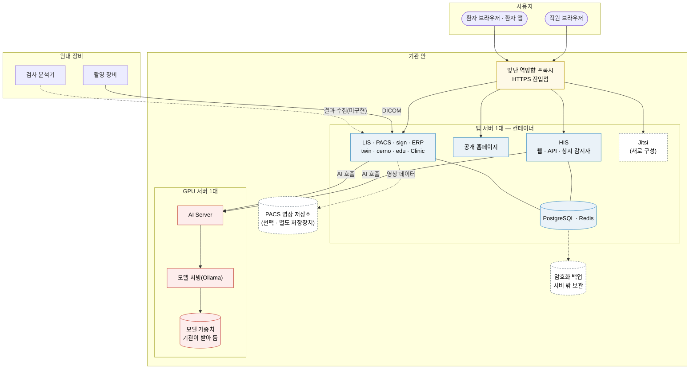

# ⑧ 배포 구성 — 일반형 (초안)

> 가장 작은 출발점은 **앱 서버 한 대 + GPU 서버 한 대**입니다. HIS 와 형제 시스템은 앱 서버에 컨테이너로 올리고, AI Server 는 GPU 가 있는 서버에 둡니다. 영상이 많아지면 PACS 영상 저장소를 따로 둘 수 있습니다.
> 이 그림은 **일반형**입니다. 특정 설치본의 주소 · 포트 · 호스팅 업체는 적지 않습니다.

근거: [README 「최소한의 사양과 구현으로」](../README.md#최소한의-사양과-구현으로-쓸-수-있게)(서버 한 대 실측 기록 · 소비자용 GPU 한 장) · [README 「지금 알고 시작해야 할 것」](../README.md#지금-알고-시작해야-할-것)(설치 전 주소 교체 · 외부 연결 차단) · [THIRD_PARTY §1 · §5](../THIRD_PARTY.md#5-구조--링크하지-않고-별도-컨테이너로-씁니다)(제3자 서버를 별도 컨테이너로 씀) · 시스템 구성은 각 [시스템 요약](../RELEASES/draft/systems/) §6

> 📷 **화면으로 보기** — 이 구성이 실제로 어떻게 보이는지는 [HIS 「시스템 관리」](../screens/his.md#시스템-관리--system)(앱 서버가 GPU 서버를 어떻게 보고 있는지)과 [twin 「운영」](../screens/twin.md)에 있습니다.

- **앱 서버** — 각 시스템은 자기 저장소의 컨테이너 구성으로 올립니다. 데이터베이스 · 캐시 · 영상 서버(Orthanc) · 관측 도구 같은 제3자 서버도 생태계 코드에 섞지 않고 **별도 컨테이너**로 띄웁니다([THIRD_PARTY §5](../THIRD_PARTY.md#5-구조--링크하지-않고-별도-컨테이너로-씁니다)). 그림의 PostgreSQL · Redis 상자는 여러 시스템이 쓰는 데이터베이스 · 캐시를 한데 그린 것입니다(시스템마다 고정한 버전이 다를 수 있습니다 — [THIRD_PARTY §1](../THIRD_PARTY.md#1-별도-서비스로-쓰는-제3자-서버)).
- **GPU 서버** — AI Server 는 소비자용 GPU 한 장(개발 기준 RTX 5080 · 16GB)에서 돌려 왔습니다. 모델 가중치는 기관이 약관을 확인하고 직접 받습니다([AI 호출 지도](ai-map.md)). 다른 서비스와 한 서버에 함께 올릴지는 AI Server 운영 문서의 배치 기준을 따릅니다(따라가기에서 확정).
- **PACS 영상 저장소** — 선택입니다. 영상 양이 늘면 영상 서버의 저장 공간을 별도 저장장치로 둡니다. 이미 쓰는 PACS 가 있으면 새로 세우지 않고 표준 프로토콜로 연결하는 선택도 있습니다.
- **Jitsi** — 현재 설치본이 동작하지 않아, 구축 기관이 새로 구성합니다. 미디어 중계용 방화벽 설정이 따로 필요합니다([Jitsi 요약 §6](../RELEASES/draft/systems/jitsi.md)).
- **검사 분석기 → LIS** 자동 수집 연결은 연결 표에서 `미구현`입니다([연결 지도](connections.md)).

## 설치 전에

- 각 시스템의 코드와 설정 예시에 **특정 설치본의 주소가 기본값**으로 들어 있는 파일이 있습니다(README 기준 11개 저장소 합계 299개 — [파일 목록](../build-guide/replace-list.md) · 문서 제외 · 2026-09-17 기준 커밋에서 다시 셈). 자기 기관 주소로 바꾸지 않고 띄우면 다른 설치본으로 요청이 갈 수 있으므로, **설치 전에 바꾸고, 첫 기동은 외부로 나가는 연결을 막은 상태에서** 합니다.
- 암호화 백업의 비밀값은 서버 밖에도 보관합니다. 서버에만 있으면 서버를 잃었을 때 백업을 풀 수 없습니다([sign](../RELEASES/draft/systems/sign.md) · [PACS](../RELEASES/draft/systems/pacs.md) 요약 §6).

## 실제로 돌아간 기록 — 권장 사양이 아닙니다

| 항목 | 값 |
|---|---|
| 무엇이 | HIS · PACS · sign · LIS · twin · cerno · edu · Jitsi 8개 시스템(그 밖의 시스템은 이 기록에 없음) |
| 어디에 | 8코어 · 16GB 메모리 가상 서버 한 대 |
| 언제 · 어떻게 | 2026-08-25 운영 기록 · 메모리 약 10GB 사용 |
| 읽는 법 | 여유가 넉넉하지 않았습니다(스왑 여유 없음). **"실제로 돌아간 하한에 가까운 기록"** 이지 권장 사양이 아닙니다 |

시스템별 권장 사양 중 **개발 PC 한 대에서 잰 것**(여러 시스템을 함께 올렸을 때 메모리 약 2.9GB · 이미지 용량 · 디스크는 200GB 이상 권장)은 [따라가 본 결과](../build-guide/follow-along-2026-09.md)에 있습니다. **기준 장비(x86 · GPU)에서의 권장 사양과, 동시 사용자 수에 따른 처리량 · 모델별 응답 시간은 아직 공개할 계측이 없습니다.**
