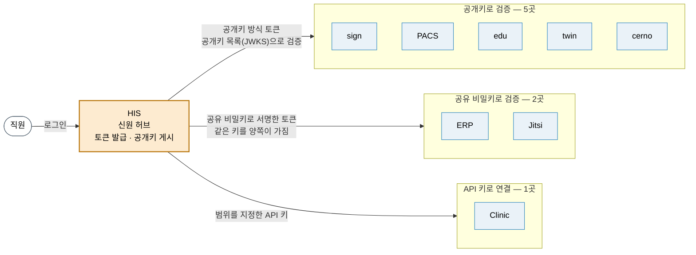

# ④ 신원 허브 (초안)

> 직원 한 명의 신원은 **HIS 한 곳**에서 나옵니다. HIS 가 직원 로그인 토큰을 발급하고, 형제 시스템은 그 토큰을 검증해 같은 사람으로 받아들입니다. 검증 방식은 시스템마다 세 가지로 나뉩니다.

> **EN** — Staff sign-in is issued in one place (the HIS) and verified by the sibling systems against its published keys. This diagram shows which system trusts which, by what token format, and where the shared-secret path is used instead.

근거: [README 「지금 알고 시작해야 할 것」 — 로그인 방식](../README.md#지금-알고-시작해야-할-것) · [HIS 릴리즈 요약 §1](../RELEASES/2026.09/systems/his.md) · 방식 이름(RS256 · JWKS · HS256)은 각 시스템 요약([sign](../RELEASES/2026.09/systems/sign.md) · [PACS](../RELEASES/2026.09/systems/pacs.md) · [edu](../RELEASES/2026.09/systems/edu.md) · [twin](../RELEASES/2026.09/systems/twin.md) · [cerno](../RELEASES/2026.09/systems/cerno.md) · [ERP](../RELEASES/2026.09/systems/erp.md) · [Jitsi](../RELEASES/2026.09/systems/jitsi.md) · [Clinic](../RELEASES/2026.09/systems/clinic.md))

> 📷 **화면으로 보기** — 직원이 시스템에 들어가고 나가는 전 과정이 [사람을 넣고 빼는 일](../screens/by-onboarding.md)에 있습니다. 특히 [역할 권한 매트릭스](../screens/by-onboarding.md#4-역할-권한--이-화면이-실제로-판정하는-것만-말한다)가 **"이 화면이 실제로 판정하는 권한 43/63"** 이라고 스스로 밝히는 자리입니다. 인증 방식 세 가지의 준비 사항은 [연동 계약 지도](../integration/README.md#1-인증--시스템이-서로를-믿는-세-가지-방식)에 있습니다.

## 세 가지 방식

| 방식 | 시스템 | 어떻게 검증하나 |
|---|---|---|
| 공개키 | sign · PACS · edu · twin · cerno | HIS 가 개인키로 서명한 토큰을, 각 시스템이 HIS 가 게시한 공개키 목록(JWKS)으로 검증합니다. 서명 알고리즘은 PACS · edu · twin · cerno 요약에 RS256 으로 적혀 있습니다. 비밀값을 나눠 가질 필요가 없습니다. twin · cerno 는 이 토큰을 SMART on FHIR 앱 실행(EHR launch) 흐름 안에서 받습니다 |
| 공유 비밀키 | ERP · Jitsi | HIS 와 상대 시스템이 같은 비밀키를 갖고, 그 키로 서명 · 검증합니다(Jitsi 요약에는 HS256 으로 고정했다고 적혀 있습니다). 키를 양쪽에 같은 값으로 두고 함께 교체합니다 |
| API 키 | Clinic | Clinic 이 범위를 지정한 API 키를 발급하고, HIS 가 그 키로 Clinic API 를 부릅니다 |

- **입사부터 퇴사까지** — HIS 가 직원 정보의 정본이라, 입사 · 변경 · 퇴직이 HIS 에서 형제 시스템으로 전해집니다. 예를 들어 edu 는 HIS 의 직원 이벤트 웹훅을, Clinic 은 HIS 의 직원 일괄 등록을 받습니다. 각 연결의 상태는 [연결 지도](connections.md)와 [`compatibility.md`](../RELEASES/2026.09/compatibility.md)에서 봅니다.
- 이 도식은 README 수준의 구조만 그립니다. 연결별 세부(토큰 대상 · 교환 경로)는 연동 계약 지도([`integration/`](../integration/))에서 다룹니다.
