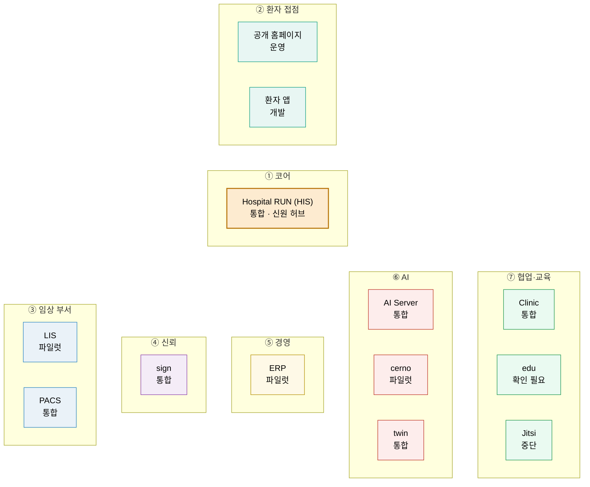

# ① 계층 생태계 지도 (초안)

> 병원 하나를 돌리는 시스템 13개를 **7개 계층**으로 나눠 봅니다. 가운데의 코어 HIS 가 환자 · 진료 · 오더 · 원무의 정본을 갖고, 직원 로그인 토큰을 발급하는 **신원 허브**입니다. 나머지 계층은 필요한 것부터 차례로 붙입니다.

근거: [README 「시스템 13」](../README.md#시스템-13)(계층 · 한 줄 정의) · [통합 릴리즈 매니페스트](../RELEASES/draft/manifest.md)(구현 상태 · 2026-09-11 · 시스템 담당 확인 전)

- 계층 사이에 선을 긋지 않았습니다. 시스템끼리 실제로 어떻게 이어지는지는 [연결 지도](connections.md)에서 봅니다(연결 표에서 자동 생성).
- 노드 아래 글자는 매니페스트의 **구현 상태**입니다(`개발` · `통합` · `파일럿` · `운영`, 단계 밖의 `중단` · `확인 필요`). 기능군마다 다를 수 있으며, 자세한 것은 [시스템별 릴리즈 요약](../RELEASES/draft/systems/)을 봅니다.
- 공개 홈페이지와 환자 앱은 HIS 저장소 안에서 HIS 와 함께 릴리즈됩니다. 계층으로는 환자 접점에 둡니다.
- 색은 [연결 지도](connections.md)의 노드 색과 같습니다.

| 계층 | 시스템 | 한 줄 정의(README) |
|---|---|---|
| ① 코어 | Hospital RUN (HIS) | 외래·입원·수술·응급·검사·약제·검진·경영지원 통합 HIS · 생태계의 신원 허브 |
| ② 환자 접점 | 공개 홈페이지 · 환자 앱 | 예약·결과 열람·동의·문진 |
| ③ 임상 부서 | LIS | 진단검사·미생물·병리·수혈·유전체 검사정보시스템 |
| ③ 임상 부서 | PACS | 웹 PACS — 영상 서버·뷰어·판독 워크플로·AI 연동 |
| ④ 신뢰 | sign | 자체 PKI·RFC 3161 타임스탬프·PAdES-LTA 전자서명 |
| ⑤ 경영 | ERP | 재무회계·원가·인사급여·자재·보험청구·세무 |
| ⑥ AI | AI Server | 온프레미스 GPU 통합 AI — 의료 분류·요약·DUR·RAG·음성 인식 보조 |
| ⑥ AI | cerno | 의료진별 개인화 임상 AI(근거가 없으면 생성하지 않는 RAG) |
| ⑥ AI | twin | 디지털 트윈 — 위험 점수 카드·SBAR·시뮬레이션 |
| ⑦ 협업·교육 | Clinic | 병원 그룹웨어 — 인수인계·근무표·알림·결재 |
| ⑦ 협업·교육 | edu | 직원 이러닝·법정교육·전자 이수증 |
| ⑦ 협업·교육 | Jitsi | 원격진료 화상(자체 호스팅) |
