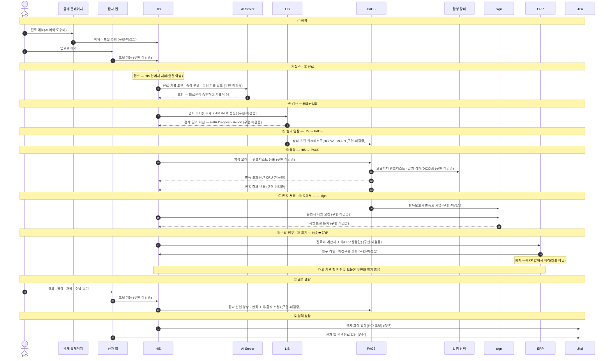

# ③ 환자 여정 스윔레인 (초안)

> 환자 한 명이 예약부터 원격 상담까지 시스템 경계를 어떻게 건너는지 봅니다. 가로 칸(참여자) 하나가 시스템 하나이고, 화살표마다 [연결 상태](../RELEASES/draft/compatibility.md)를 괄호 안에 적었습니다.
> 연결 표에 **없는** 구간은 지어내지 않고 `확인 중`으로 적었습니다. 시스템 안에서 끝나는 일(접수 · 회계)은 연결이 아니므로 메모로만 둡니다.

근거: [ROADMAP §3 관통 흐름 1](../ROADMAP.md#3-관통-흐름--시스템-경계를-넘어-한-줄로-읽히는-것) · 상태는 [`RELEASES/draft/compatibility.md`](../RELEASES/draft/compatibility.md)(판정 2026-09-11 · 코드 대조 · 실제 호출 확인 없음) · 대외 청구 전송은 [README 「지금 알고 시작해야 할 것」](../README.md#지금-알고-시작해야-할-것)

## 구간별 상태

| # | 구간 | 화살표 | 상태 | 연결 표의 행(쌍 · 목적) |
|---|---|---|---|---|
| ① | 예약 | 공개 홈페이지 → HIS | `구현·미검증` | HIS ⇄ 공개 홈페이지 · 예약 — AI 예약 상담 · 포털 로그인과 본인 정보 조회 |
| ① | 예약 | 환자 앱 → HIS | `구현·미검증` | HIS ⇄ 환자 앱 · 환자 인증 및 포털 기능 |
| ② | 접수 | — | 연결 아님 | HIS 안에서 처리 |
| ③ | 진료(AI 보조) | HIS → AI Server | `구현·미검증` | HIS ⇄ AI Server · 임상 보조 스킬 전반 · VoiceEMR 실시간 STT · 앰비언트 진료 스크라이브 |
| ④ | 검사 오더 | HIS → LIS | `구현·미검증` | HIS ⇄ LIS · 검사 오더 전달(FHIR R4 폴링) |
| ④ | 검사 결과 회신 | LIS → HIS | `구현·미검증` | FHIR DiagnosticReport 로 보내고, HIS 에서 직원이 확인한 뒤 반영합니다. 같은 쌍의 HL7 ORU^R01 결과 전송(대체 경로)은 `미구현` |
| ⑤ | 병리 영상 | LIS → PACS | `구현·미검증` | LIS ⇄ PACS · 병리 슬라이드 스캔 워크리스트 등록·취소 |
| ⑥ | 영상 오더 | HIS → PACS | `구현·미검증` | HIS ⇄ PACS · 영상 오더 생성 시 PACS 워크리스트 자동 등록 |
| ⑥ | 촬영 | PACS → 촬영 장비 | `구현·미검증` | 검사 장비 ⇄ PACS · Modality Worklist · MPPS · C-STORE |
| ⑥ | 판독 결과 회신 | PACS → HIS | `미구현` | HIS ⇄ PACS · 판독 결과 HL7 ORU^R01 송신 |
| ⑥ | 판독 결과 반영 | PACS → HIS | `구현·미검증` | 연결 표의 "판독 결과 반영" 행. HL7 ORU^R01 판독 결과 송신은 `미구현` |
| ⑦ | 판독 서명 | PACS → sign | `구현·미검증` | PACS ⇄ sign · 판독보고서 STAFF 전자서명 |
| ⑧ | 동의서 | HIS → sign · sign → HIS | `구현·미검증` | HIS ⇄ sign · 서명요청 제출 · 서명 이벤트 통지 |
| ⑨ | 수납·청구 | HIS → ERP · ERP → HIS | `구현·미검증` | HIS ⇄ ERP · 진료비 계산서 조회 · 청구 라인·미청구 진행분 조회 |
| ⑩ | 회계 | — | 연결 아님 | ERP 안에서 처리 |
| ⑪ | 결과 열람 | 환자 앱 → HIS · HIS → PACS | `구현·미검증` | HIS ⇄ 환자 앱 · 포털 기능 / HIS ⇄ PACS · 환자 본인 영상·판독 조회 |
| ⑫ | 원격 상담 | HIS → Jitsi · 환자 앱 → Jitsi | `중단` | HIS ⇄ Jitsi · 환자 화상 입장 / 환자 앱 ⇄ Jitsi · 원격진료 입장 |

- 2026-09-11 연결 표 갱신(싣지 않은 연결 16 → 7)으로 결과 회신 · 판독 반영 두 구간이 실렸습니다. 연결 표가 바뀌면 이 도식도 함께 고칩니다.
- 원격 상담은 Jitsi 현재 설치본이 동작하지 않아 `중단`입니다. 구축 기관은 Jitsi 를 새로 구성합니다([Jitsi 요약](../RELEASES/draft/systems/jitsi.md)).
- 이 도식은 손으로 그린 것입니다. 연결 표가 바뀌면 [연결 지도](connections.md)(자동 생성)와 대조해 함께 고칩니다.
