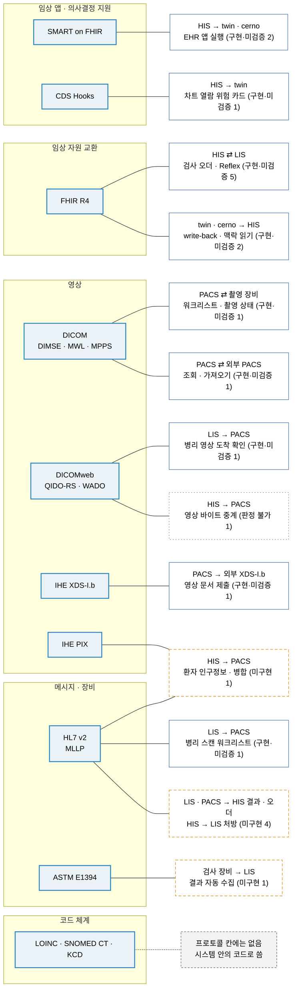

# ⑥ 표준 층 (초안)

> 시스템끼리 붙는 말은 가능한 한 **국제 표준**으로 맞췄습니다. 그래서 이미 쓰는 시스템(예: 기존 PACS · 검사 장비)을 바꿔 끼울 수 있습니다. 이 도식은 표준마다 **어느 연결이 그 표준을 쓰는지**와 그 연결의 상태를 보여줍니다.

근거: [`RELEASES/draft/compatibility.md`](../RELEASES/draft/compatibility.md)의 **프로토콜 칸**(판정 2026-09-11 · 코드 대조 · 실제 호출 확인 없음) · 코드 체계는 [THIRD_PARTY §4](../THIRD_PARTY.md#4-코드-마스터기준-데이터)와 [LIS 요약](../RELEASES/draft/systems/lis.md) · 표준 목록은 [ROADMAP §3 관통 흐름 4](../ROADMAP.md#3-관통-흐름--시스템-경계를-넘어-한-줄로-읽히는-것)

- 연결 상자의 테두리: 실선 = `구현·미검증` · 주황 파선 = `미구현` · 보라 점선 = `판정 불가`. `검증됨`(실제 호출 확인 · 굵은 실선)은 4개입니다 — HIS ⇄ sign 직원 서명 · 완료 통지 · HIS ⇄ LIS 검사 오더 · 환자 조회(2026-09-14).
- 한 연결이 두 표준을 함께 쓰면 두 표준에 모두 이었습니다(예: 환자 인구정보 · 병합은 HL7 v2 ADT 로 IHE PIX 를 구현).
- 연결 표 113개 가운데 위 표준을 쓰는 연결은 24개입니다(아래 표에서 코드 체계 행을 빼고 셈 · IHE PIX 와 HL7 v2 ADT 는 같은 연결이라 한 번만 셈 · 2026-09-11 연결 표 기준). 나머지는 표준 프로파일이 아닌 HTTPS REST(JSON) · 웹훅 등입니다. 전체는 [연결 지도](connections.md)에서 봅니다.

> 📷 **화면으로 보기** — 제품 안에 [상호운용성 화면](../screens/his.md#표준으로-말하는-자리--상호운용성과-연동-테스트)이 있어 **FHIR R4 리소스 17종**과 지원 동작, 전원 4단계(FHIR Bundle → SMART 인증 전송)를 보여 줍니다. 그 옆 **연동 테스트 콘솔**에서 표준 엔드포인트 8종을 실제로 눌러 볼 수 있습니다.

## 표준별 연결

| 표준 | 연결(방향 · 목적) | 상태 |
|---|---|---|
| SMART on FHIR | HIS → twin · EHR launch(PKCE · id_token 검증) | `구현·미검증` |
| | HIS → cerno · EHR launch 런처 | `구현·미검증` |
| CDS Hooks | HIS → twin · patient-view 위험 카드 | `구현·미검증` |
| FHIR R4 | HIS → LIS · 검사 오더 전달(폴링) | `구현·미검증` |
| | HIS → LIS · 검사 오더 취소 전파(폴링) | `구현·미검증` |
| | LIS → HIS · 환자 성명 조회 | `구현·미검증` |
| | LIS → HIS · Reflex 추가검사 오더(transaction Bundle) | `구현·미검증` |
| | LIS → HIS · Reflex 승인·반려 상태 폴링 | `구현·미검증` |
| | twin → HIS · RiskAssessment · DocumentReference write-back | `구현·미검증` |
| | cerno → HIS · 근거 질의용 환자 맥락 읽기 | `구현·미검증` |
| | LIS → HIS · 검사 결과 전달(DiagnosticReport) | `구현·미검증` |
| | twin → HIS · 환자 트윈 FHIR 읽기 | `구현·미검증` |
| DICOM DIMSE · MWL · MPPS | PACS ⇄ 검사 장비 · Modality Worklist · MPPS · Storage Commitment · C-STORE | `구현·미검증` |
| | PACS → 외부 PACS · C-ECHO · C-FIND · C-MOVE · C-STORE | `구현·미검증` |
| DICOMweb | LIS → PACS · QIDO-RS 로 병리 영상 도착 확인 · 뷰어 링크 | `구현·미검증` |
| | HIS → PACS · WADO-URI 영상 바이트 중계 | `판정 불가` |
| IHE XDS-I.b | PACS → 외부 XDS-I.b 저장소 · 영상 문서 세트 제출 · XDM 내보내기 | `구현·미검증` |
| IHE PIX | HIS → PACS · 환자 인구정보 · 병합(HL7 v2 ADT · PIX Feed · Query) | `미구현` |
| HL7 v2 (MLLP) | LIS → PACS · 병리 슬라이드 스캔 워크리스트(ORM^O01) | `구현·미검증` |
| | LIS → HIS · 검사 결과 ORU^R01(대체 경로) | `미구현` |
| | LIS → HIS · Reflex 추가검사 ORM^O01 | `미구현` |
| | PACS → HIS · 판독 결과 ORU^R01 | `미구현` |
| | HIS → PACS · 환자 인구정보 · 병합 ADT(위 IHE PIX 와 같은 연결) | `미구현` |
| HL7 v2 (HTTP 본문) | HIS → LIS · 검사 처방 OML^O21(대체 경로) | `미구현` |
| ASTM E1394 | 검사 장비(분석기) → LIS · 결과 자동 수집(저수준 전송 없이 HTTP 본문으로) | `미구현` |
| LOINC · SNOMED CT · KCD | 연결 표의 프로토콜 칸에는 나오지 않습니다. 시스템 안의 코드 · 매핑으로 씁니다 — LOINC(LIS · HIS · twin) · SNOMED CT(HIS · LIS) · KCD(HIS · AI Server) | — |

- 수혈 동의 상태 참조(LIS → HIS)는 FHIR Consent 모양이지만 표준 경로가 아닌 전용 주소로 부르므로 FHIR 칸에 넣지 않았습니다(연결 표의 프로토콜 칸 표기를 따름).
- 코드 체계는 구축 기관이 배포 기관에서 직접 받아 반입합니다. 이용 조건은 [THIRD_PARTY §4](../THIRD_PARTY.md#4-코드-마스터기준-데이터)를 봅니다.
