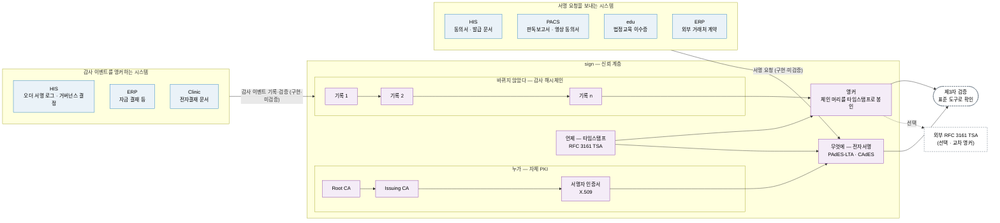

# ⑤ 신뢰의 사슬 (초안)

> "**누가 · 언제 · 무엇에** 서명했고, 그 뒤로 **바뀌지 않았다**"를 제3자가 검증할 수 있게 하는 구조입니다. 전자서명 · 인증서 · 타임스탬프 · 감사 해시체인은 모두 **sign 한 곳**에서 만듭니다. 다른 시스템은 개인키를 갖지 않고, 서명 요청과 감사 이벤트를 sign 에 보냅니다.

> **EN** — How a signature becomes evidence: certificate issuance, signing, time-stamping, and the append-only hash chain that is anchored so later tampering shows up. It also shows which systems write audit events into that chain.

근거: [sign 릴리즈 요약 §1 · §2](../RELEASES/2026.09/systems/sign.md) · 연결과 상태는 [`RELEASES/2026.09/compatibility.md`](../RELEASES/2026.09/compatibility.md)(판정 2026-09-11 · 코드 대조 + 새 설치본 실호출 27개(2026-09-14~15 · 확인일 칸)) — 감사 이벤트 연결은 목적 칸에 "신뢰의 사슬"이 적힌 세 행입니다

> 📷 **화면으로 보기** — 서명이 원장에 봉인되는 자리가 [오더 서명 로그](../screens/his.md#오더-서명-로그--봉인률-100인데도-세는-것)입니다. 봉인률 100% 옆에 **"추정 시각을 원장에 박지 않습니다"** 가 함께 적혀 있습니다. 인증서는 [sign 이 정본이고 HIS 는 읽기 전용 미러](../screens/by-onboarding.md#인증서는-sign-이-발급하고-his-는-비춰-본다)입니다.

## 네 가지 질문과 답하는 장치

| 질문 | 장치 | sign 요약이 적은 것 |
|---|---|---|
| 누가 | 자체 PKI(2단 CA: Root · Issuing) | 서명자별 X.509 인증서를 발급합니다. 인증서 발급은 sign 한 곳에서만 합니다 |
| 무엇에 | 전자서명(CMS 기반 CAdES-BES · PDF 용 PAdES-LTA) | PAdES-LTA 는 검증 자료를 PDF 안에 넣어 인증서 만료 뒤에도 검증할 수 있게 합니다. 폐기 여부(CRL · OCSP)는 서명 시점 기준으로 봅니다 |
| 언제 | RFC 3161 타임스탬프(자체 TSA) | 서명과 감사 앵커에 타임스탬프를 붙입니다. 공인 타임스탬프 기관을 계약하면 주소 설정으로 바꿀 수 있게 짜여 있습니다 |
| 바뀌지 않았다 | append-only 감사 해시체인 + 앵커 | 생성 · 발송 · 열람 · 서명 · 폐기를 체인에 쌓고, 체인 머리를 타임스탬프로 봉인합니다. 외부 TSA 토큰을 함께 받아 두면 제3자가 sign 없이 표준 도구로 "그 시각에 그 체인이 있었다"를 검증할 수 있습니다(선택) |

## sign 에 닿는 연결

| 방향 | 목적 | 상태 |
|---|---|---|
| HIS → sign | 동의서 · 발급 문서 · ERP 계약의 서명 요청 제출, 직원 · 환자 인증서 발급 | `구현·미검증` |
| PACS → sign | 판독보고서 판독의 본인 서명 · 영상 · 조영제 동의서 환자 서명 | `구현·미검증` |
| edu → sign | 법정교육 이수증 봉인 · 폐기 · 철회 | `구현·미검증` |
| ERP → sign | 외부 거래처 계약 전자서명 | `구현·미검증` |
| **HIS → sign** | **감사 이벤트** — 오더 서명 로그 · 거버넌스 결정을 sign 스트림에 봉인 · 체인 검증 | `구현·미검증` |
| **ERP → sign** | **감사 이벤트** — 자금 결재 등 ERP 감사 이벤트를 기록 · 체인 검증 | `구현·미검증` |
| **Clinic → sign** | **감사 이벤트** — 그룹웨어 전자결재 문서의 결재 이벤트를 앵커 · 검증 | `구현·미검증` |

- 이 밖에 sign 이 서명 완료를 알리는 웹훅(sign → HIS · ERP · edu)이 있습니다. 전체 목록은 [연결 지도](connections.md)에서 봅니다.
- 키 보관은 기본이 소프트웨어 수탁이고, HSM 어댑터(CA 두 키)가 있습니다. 인증서 발급 · 검증 응답에는 키가 어디에 있었는지(`assuranceLevel`)가 함께 실려, 검증하는 쪽이 신뢰 수준을 스스로 판단합니다. HSM · 공인 TSA · 본인확인 사업자 연결은 구축 기관이 준비합니다([구축 단계 로드맵](build-roadmap.md) S4).
- 전자서명의 법적 효력 판단은 구축 기관과 법무가 합니다. 이 도식은 구조를 설명할 뿐 법적 효력이나 인증을 말하지 않습니다.
