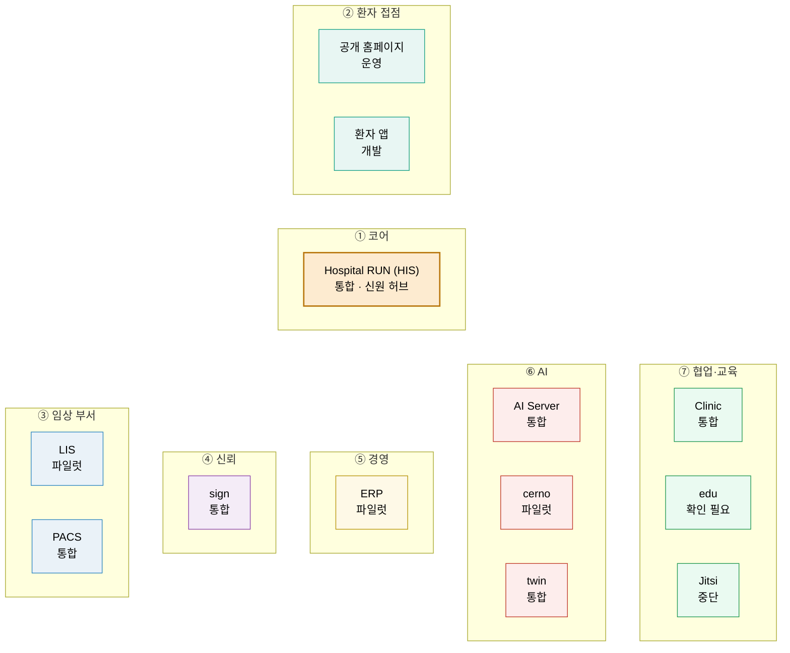

# 3. 계층 구조와 시스템 13

> 🟡 초안 — 시스템 담당 확인 전 · **새 설치본 따라가기 1차 완료**(2026-09-13~16) · 기준: [RELEASES/draft 매니페스트](../RELEASES/draft/manifest.md)
> [개요서 목차](README.md) · ← [2. 취지 8가지](02-principles.md) · 다음 → [4. 환자 한 명의 여정](04-patient-journey.md)

---

## 7계층 한 장

병원 하나를 돌리는 시스템 13개를 **7개 계층**으로 나눕니다. 가운데의 코어 HIS 가 환자 · 진료 · 오더 · 원무의 정본을 갖고, 직원 로그인 토큰을 발급하는 **신원 허브**입니다. 나머지 계층은 필요한 것부터 차례로 붙입니다.

- 이 그림은 [계층 생태계 지도](../diagrams/layers.md)를 그대로 옮긴 것입니다. 두 그림이 다르면 도식 쪽이 정본입니다.
- 노드 아래 글자는 매니페스트의 **구현 상태**입니다 — `개발` · `통합` · `파일럿` · `운영` 4단계와 단계 밖의 `중단` · `확인 필요`(근거: 2026-09-11 생태계 자료 측 조사 · 시스템 담당 확인 전). 기능군마다 다를 수 있습니다.
- 계층 사이에 선을 긋지 않았습니다. 시스템끼리 실제로 어떻게 이어지는지는 [연결 지도](../diagrams/connections.md)(연결 표에서 자동 생성)에서 봅니다.

## 시스템 13

| 계층 | 시스템 | 한 줄 정의 | 버전(정본) | 구현 상태 | 구성서 |
|---|---|---|---|---|---|
| ① 코어 | **Hospital RUN (HIS)** | 외래 · 입원 · 수술 · 응급 · 검사 · 약제 · 검진 · 경영지원 통합 HIS · 생태계의 신원 허브 | `v4.18.0` | `통합` — 리허설 모드(가상 병원 데이터) | [his.md](../systems/his.md) |
| ② 환자 접점 | 공개 홈페이지 | 병원의 공개 웹사이트 — 병원 · 진료 · 검진 안내, AI 예약 도우미 | `v4.18.0` | `운영` — 공개 사이트로 쓰이는 중 | [homepage.md](../systems/homepage.md) |
| ② 환자 접점 | 환자 앱 | 예약 · 결과 열람 · 동의 · 문진 · 보호자 위임 | `v4.18.0` | `개발` — 스토어 미배포 | [patient-app.md](../systems/patient-app.md) |
| ③ 임상 부서 | **LIS** | 진단검사 · 미생물 · 병리 · 수혈 · 유전체 검사정보시스템 | `1.56.18` | `파일럿` | [lis.md](../systems/lis.md) |
| ③ 임상 부서 | **PACS** | 웹 PACS — 영상 서버 · 뷰어 · 판독 워크플로 · AI 연동 | `v13.48` | `통합` | [pacs.md](../systems/pacs.md) |
| ④ 신뢰 | **sign** | 자체 PKI · RFC 3161 타임스탬프 · PAdES-LTA 전자서명 | `1.30.1` | `통합` | [sign.md](../systems/sign.md) |
| ⑤ 경영 | **ERP** | 재무회계 · 원가 · 인사급여 · 자재 · 보험청구 · 세무 | `1.287.3` | `파일럿` — 문서마다 운영 · 개발 표기가 엇갈려 재확인 대상 | [erp.md](../systems/erp.md) |
| ⑥ AI | **AI Server** | 온프레미스 GPU 통합 AI — 의료 분류 · 요약 · DUR · RAG · 음성 인식 보조 | `2.125.41` | `통합` — 의료 기능 기준(비의료 기능은 생태계 범위 밖) | [ai-server.md](../systems/ai-server.md) |
| ⑥ AI | **cerno** | 의료진별 개인화 임상 AI(근거가 없으면 생성하지 않는 RAG) | `0.1.0` | `파일럿` — 섀도우 · 비임상 | [cerno.md](../systems/cerno.md) |
| ⑥ AI | **twin** | 디지털 트윈 — 위험 점수 카드 · SBAR · 시뮬레이션 | `1.20.88` | `통합` | [twin.md](../systems/twin.md) |
| ⑦ 협업·교육 | **Clinic** | 병원 그룹웨어 — 인수인계 · 근무표 · 알림 · 결재 | `1.4.0` | `통합` — 모노레포 안의 병원 서비스만 | [clinic.md](../systems/clinic.md) |
| ⑦ 협업·교육 | **edu** | 직원 이러닝 · 법정교육 · 전자 이수증 | `2.7.0` | `확인 필요` — 운영 여부 재확인 전 | [edu.md](../systems/edu.md) |
| ⑦ 협업·교육 | **Jitsi** | 원격진료 화상(자체 호스팅) | `1.0.0` | `중단` — 현재 설치본이 동작하지 않음 · 구축 기관은 새로 구성 | [jitsi.md](../systems/jitsi.md) |

버전 · 구현 상태: [통합 릴리즈 초안 매니페스트](../RELEASES/draft/manifest.md)(계측일 2026-09-11). 공개 홈페이지와 환자 앱은 HIS 저장소 안에서 HIS 와 함께 릴리즈되므로 버전이 같습니다. 태그 · 문서의 버전 표기가 정본과 다른 저장소가 여럿 있으니, 소스를 받을 때는 매니페스트의 **정본 버전과 기준 커밋**을 기준으로 삼습니다 → [8장](08-status-and-preparation.md).

## 계층마다 맡는 일

| 계층 | 맡는 일 | 없으면 |
|---|---|---|
| ① 코어 | 환자 · 진료 · 오더 · 간호 · 원무 · 청구의 정본, 직원 신원 발급, 개원 · Go-Live · 결정 등록부 같은 구축 관리 화면 | 생태계가 성립하지 않습니다. 모든 구축은 HIS 에서 시작합니다 |
| ② 환자 접점 | 예약 · 환자 포털 · 앱 — 환자가 기관과 만나는 곳 | HIS 의 원내 업무는 그대로 돌아갑니다. 환자 쪽 창구가 없을 뿐입니다 |
| ③ 임상 부서 | 검사(LIS) · 영상(PACS) — 부서 업무와 장비 인터페이스 | 이미 쓰는 PACS 가 있으면 새로 세우지 않고 표준 프로토콜로 연결하는 선택이 있습니다 |
| ④ 신뢰 | 전자서명 · 인증서 · 타임스탬프 · 감사 해시체인 → [5장](05-identity-trust-standards.md) | 동의서 · 판독 · 이수증 · 계약 서명이 모두 여기를 부르므로, 서명을 쓰는 단계보다 먼저 세우는 편이 순서가 꼬이지 않습니다 |
| ⑤ 경영 | 재무회계 · 원가 · 인사급여 · 자재 · 보험청구 · 세무 | HIS 안에도 원무 · 청구서 작성 · 경영지원 화면이 있습니다. 재무회계 · 세무처럼 ERP 의 영역이 필요할 때 붙입니다 |
| ⑥ AI | AI 연산(AI Server) · 의료진별 근거 질의(cerno) · 위험 점수 카드(twin) → [6장](06-ai.md) | HIS 는 AI 없이도 동작하도록 설계했습니다. AI 칸은 "폴백" · "산출 불가"로 표시됩니다 |
| ⑦ 협업·교육 | 그룹웨어 · 결재(Clinic) · 직원 교육(edu) · 원격 화상(Jitsi) | HIS 는 이 계층 없이도 동작합니다. 없는 동안은 기관이 쓰던 그룹웨어 · 교육 수단을 그대로 씁니다. 원격 화상을 쓰려면 Jitsi 를 새로 구성해야 합니다 |

## 규모 — 계측 스냅샷

기관이 "얼마나 큰 시스템인가"를 가늠할 수 있게, [계측 스냅샷](../data/scale-snapshot.json)의 값을 옮깁니다. **계측일 2026-09-11 · 각 저장소의 기준 커밋 내용을 읽어 셈.** 저장소 README 에 적힌 수치는 쓰지 않았습니다.

| 시스템 | 값 | 스냅샷 키(`systems.<시스템>.counts.…`) |
|---|---|---|
| HIS | 데이터 모델 562 · API 핸들러 3,251(+ 실시간 스트림 15) · 웹 화면 450 | `his` · `dataModels` · `apiEndpoints` · `apiEndpointsSse` · `pages` |
| 공개 홈페이지 | 화면 50 | `homepage.pages` |
| 환자 앱 | 화면 32 | `patient-app.screens` |
| LIS | 데이터 모델 84 · API 핸들러 356 · 화면 41 | `lis` · `dataModels` · `apiEndpoints` · `pages` |
| PACS | API 핸들러 475 · 관리 화면 47(웹 뷰어 제외) | `pacs` · `apiEndpoints` · `pages` |
| sign | 데이터 모델 14 · API 핸들러 162 · 화면 38 | `sign` · `dataModels` · `apiEndpoints` · `pages` |
| ERP | 데이터 모델 219 · API 핸들러 717 · 화면 113 | `erp` · `dataModels` · `apiEndpoints` · `pages` |
| AI Server | API 핸들러 654(의료 · 비의료 기능을 나누지 않고 셈) | `ai-server.apiEndpoints` |
| cerno | API 핸들러 11 · 화면 3 | `cerno` · `apiEndpoints` · `pages` |
| twin | API 핸들러 107 · 화면 15 | `twin` · `apiEndpoints` · `pages` |
| Clinic | 병원 서비스 화면 16 · HIS 연동 API 경로 44 | `clinic` · `pages` · `hisApiRoutes` |
| edu | 데이터 모델 40 · API 핸들러 167 · 화면 41 | `edu` · `dataModels` · `apiEndpoints` · `pages` |
| Jitsi | 기본 구성 컨테이너 9 | `jitsi.containers` |

읽을 때 주의할 것:

- **API 핸들러 수는 고유 경로 수가 아닙니다.** 핸들러(데코레이터 · 함수) 수입니다. 언어와 프레임워크마다 세는 규칙이 달라(각 항목의 `rule`), **시스템끼리 크기를 견주는 데 쓰지 않습니다.**
- HIS 의 웹 화면 수에는 공개 홈페이지 앱이 들어가지 않습니다. HIS · 공개 홈페이지 · 환자 앱의 값은 HIS 저장소의 정본 계측기가 낸 값을 그대로 옮긴 것입니다.
- 이 수치는 "무엇이 있는가"의 크기이지 "얼마나 검증됐는가"가 아닙니다. 연결이 실제로 동작하는지는 [4장](04-patient-journey.md) · [8장](08-status-and-preparation.md)에서 따로 봅니다.

## 서버는 얼마나 필요한가 — 지금 말할 수 있는 것

- **실제로 돌아간 기록** — HIS · PACS · sign · LIS · twin · cerno · edu · Jitsi 8개 시스템이 **8코어 · 16GB 메모리 가상 서버 한 대**에 함께 올라가 있었습니다(2026-08-25 운영 기록 · 메모리 약 10GB 사용). 여유가 넉넉하지 않았습니다(스왑 여유 없음). 그래서 이 수치는 **권장 사양이 아니라 실제로 돌아간 하한에 가까운 기록**입니다([README](../README.md#최소한의-사양과-구현으로-쓸-수-있게)).
- **가장 작은 출발점** — 앱 서버 한 대(HIS 와 형제 시스템을 컨테이너로) + GPU 서버 한 대(AI Server)입니다. 영상이 많아지면 PACS 영상 저장소를 따로 둡니다([배포 구성 도식](../diagrams/deployment.md)).
- **따라가기에서 잰 참고값** — 새 설치본으로 따라가 볼 때(2026-09-13~16 · 개발 PC 한 대 · arm64 · GPU 없음 · 가상 데이터 · 사용자 없음) HIS · ERP · PACS 코어 · AI Server 를 함께 올린 상태의 가상 머신 메모리 사용이 **약 2.9GB** 였습니다. 부하를 준 값이 아니고 **기준 장비도 아니므로** 권장 사양으로 읽지 않습니다. 오히려 **디스크가 먼저 모자랐습니다** — 60GB 가상 머신이 빌드 이미지와 모델로 두 번 가득 찼습니다([따라가 본 결과](../build-guide/follow-along-2026-09.md)).
- **아직 싣지 않은 것** — 시스템별 권장 사양 · 동시 사용자 수에 따른 처리량 · 모델별 응답 시간은 공개할 계측이 없습니다. **x86 · GPU 기준 장비**에서 재야 하는 값이라 다음 차수로 남겼습니다.

---

← [2. 취지 8가지](02-principles.md) · 다음 → [4. 환자 한 명의 여정](04-patient-journey.md)
