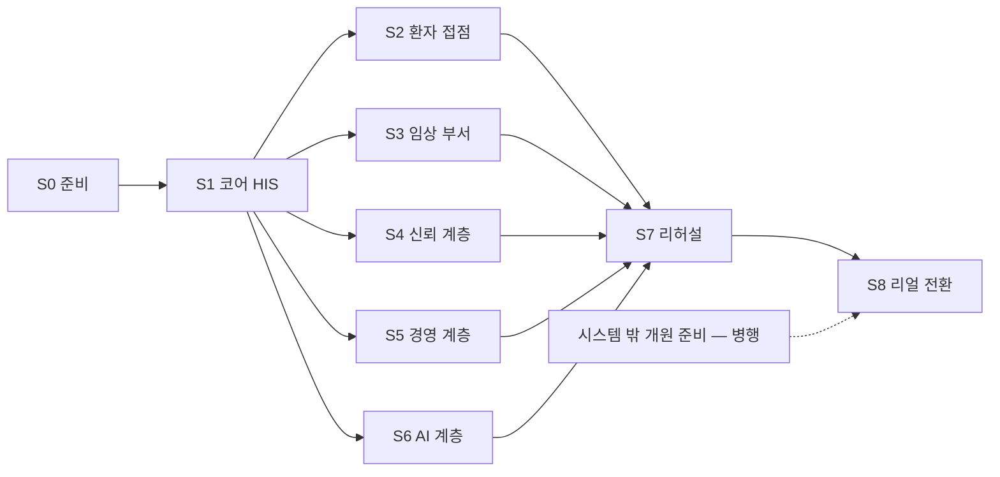

# 7. 구축은 이렇게 진행된다

> 🟡 초안 — 시스템 담당 확인 전 · 새 설치본 따라가기 전 · 기준: [RELEASES/draft 매니페스트](../RELEASES/draft/manifest.md)
> [개요서 목차](README.md) · ← [6. AI 는 한 곳에서, 판단은 사람이](06-ai.md) · 다음 → [8. 지금 구현 상태와 구축 기관이 준비할 것](08-status-and-preparation.md)

---

## 한 장으로

구축은 **9단계(S0 준비 ~ S8 리얼 전환)** 입니다. 새 절차를 만들지 않습니다. HIS 에 이미 있는 구축 관리 화면 — 개원 단계 관리 · 운영 전환(Go-Live) 관제 · 결정 등록부 · 안전 게이트 · 대외 발신 관제 · 상시 감시자 · 시스템 설정 — 을 **단계 순서로 따라가는 것**입니다.

- **S0 · S1 은 반드시 먼저**입니다. 모든 구축은 코어 HIS 에서 시작합니다.
- **S2~S6 은 필요한 것만, 필요한 순서로** 붙입니다. 13개를 다 세울 필요는 없습니다. 다만 S4 의 sign 은 동의서 · 판독 · 이수증 · 계약 서명이 모두 부르는 곳이라, 서명을 쓰는 단계보다 먼저 세우는 편이 순서가 꼬이지 않습니다.
- **S7 · S8 은 모두가 모이는 곳**입니다. 가상 병원 데이터로 전 흐름을 돌려 본 뒤 리얼로 전환합니다.
- 그림 원본: [구축 가이드 「단계」](../build-guide/README.md#단계) · 단계별 "사람이 정할 것"까지 넣은 그림은 [② 구축 단계 로드맵](../diagrams/build-roadmap.md)에 있습니다.

## 단계별 한 줄

| 단계 | 하는 일 | 이 단계에서 사람이 정할 것(대표) | 결정 | 개원 단계 | Go-Live |
|---|---|---|---:|---:|---:|
| [S0 준비](../build-guide/S0-prepare.md) | 제공 조건(MIT · 면책 · 제3자 구성요소) 확인 · 서버 · GPU · DB 확보 · 첫 기동용 격리 네트워크 · 기관 프로파일 | 결정 권한자 지정 · 이 설치본이 어느 나라 기관인가 | 9 | 10 | 0 |
| [S1 코어 HIS](../build-guide/S1-core-his.md) | 설치 · 기관명 · 주소 · 코드 마스터 반입 · 부서 · 병상 · 직원 · 역할 · 병원 규정 | 요양기관 종별 · 코드 마스터를 배포 기관에서 받기 | 20 | 8 | 8 |
| [S2 환자 접점](../build-guide/S2-patient-access.md) | 공개 홈페이지 · 환자 포털 · 환자 앱 · 본인확인 · 알림 채널 | 환자 알림의 적법 근거 · 문자 처리위탁 · 앱 스토어 배포 여부 | 7 | 0 | 1 |
| [S3 임상 부서](../build-guide/S3-clinical-departments.md) | LIS · PACS 연결 · 장비 인터페이스 | 기존 PACS 를 연결할지, 새로 세울지 | 2 | 8 | 11 |
| [S4 신뢰 계층](../build-guide/S4-trust.md) | 전자서명 · 인증서 · 타임스탬프 · 동의서 서명 | 공인 타임스탬프 기관 · 하드웨어 보안 모듈 · 본인확인 사업자 · 서명 효력 판단 | 0 | 0 | 4 |
| [S5 경영 계층](../build-guide/S5-management.md) | ERP · 그룹웨어(Clinic) · 교육(edu) · 청구 자격 | ERP 로 나가는 환자번호 가명화 여부 | 4 | 6 | 8 |
| [S6 AI 계층](../build-guide/S6-ai.md) | AI Server(GPU 한 장) · **설치 직후 AI 기능을 끄고 결정으로 하나씩 켬** · 환자 AI 활용 동의 · 감독 | 의료기기 해당성 · 임상데이터 처리 경계 · 진료 음성 녹음 근거 → AI 임상 기능 범위 | 10 | 0 | 15 |
| [S7 리허설](../build-guide/S7-rehearsal.md) | 가상 데이터로 전 흐름 시연 · 안전 게이트 경고 운영 · 감시자 판정 · 연결 확인 | 개시 전 필수 결정 · 개시 차단 항목 점검 | 3 | 2 | 8 |
| [S8 리얼 전환](../build-guide/S8-go-real.md) | 가상 데이터 격리 · 실데이터 이관 · 리얼 빌드 · 개시 확인 | 리얼 전환 시점 · 암호화 키 교체 시점 | 1 | 5 | 5 |
| — | 시스템 밖 병행 준비(시설 · 인허가 · 법정 인력 · 정기 운영 · 인증) | — | 0 | 21 | 0 |
| | **합계** | | **56** | **60** | **60** |

- 결정 · 개원 단계 · Go-Live 칸의 수는 [구축 가이드](../build-guide/README.md#단계)가 HIS 레지스트리 항목을 단계에 나눠 배정한 것입니다(HIS v4.18.0 · 2026-09-11 추출). HIS 화면에는 단계 구분이 없습니다.
- "사람이 정할 것" 칸은 [구축 단계 로드맵](../diagrams/build-roadmap.md#사람이-정할-것--도식의-육각형)의 안내입니다. 단계별 목록은 새 설치본으로 따라가 본 뒤 확정합니다.

## 무엇으로 진행을 확인하나 — 체크리스트 셋

진행은 사람의 기억이 아니라 HIS 화면의 항목으로 확인합니다. 세 화면의 항목은 [구축 체크리스트](../checklist/)에 코드에서 그대로 뽑아 두었습니다(HIS v4.18.0 · 기준 커밋 2026-09-11 · 추출일 2026-09-11).

| 체크리스트 | HIS 화면 | 항목 수 | 구성 |
|---|---|---:|---|
| [개원 · 운영 단계](../checklist/opening.md) | `/admin/opening` | 60 | 나라별 KR 45 · AE 48(공통 항목은 양쪽에 셈) · 확인 방식 파생 18 · 사람 기록 42 |
| [Go-Live(운영 전환)](../checklist/go-live.md) | `/admin/go-live` | 60 | 판정 실검증 27 · 자가신고 33 · **개시 차단 31** |
| [사람 결정(결정 등록부)](../checklist/decisions.md) | `/admin/decisions` | 56 | 허가권자 17 · 원내 위원회 38 · 직원 1 · **개시 전 필수 11** |

- **실검증** 항목은 시스템이 설정 값 · DB · 결재 기록 · 코드를 직접 읽어 판정합니다. 사람이 "됐다"고 적어도 바뀌지 않습니다. **자가신고** 항목은 담당자가 표시하고, 근거는 화면 밖에 있습니다.
- 이 목록은 **전수가 아닙니다.** 기관의 종별 · 지역 · 특례에 따라 늘거나 빠지고, 법령 근거와 처리 기한은 기관이 확인해 채웁니다.

## 시스템 밖에서 병행하는 일

개원 단계 항목 가운데 21개는 정보시스템 구축과 별도로 기관이 진행합니다 — 설립 · 시설, 인허가, 법정 인력, 개원 후 정기 운영, 인증 준비. **시스템은 기록만 받고, 신고 · 허가를 대신 내지 않습니다**([구축 가이드 「시스템 밖에서 병행하는 개원 준비」](../build-guide/README.md#시스템-밖에서-병행하는-개원-준비)).

## 단계 장은 같은 틀로 씁니다

구축 가이드의 단계 장마다 ① 목적과 완료 조건 ② 설치 ③ 설정 ④ 사람이 정할 것 ⑤ 확인 ⑥ **아직 안 되는 것과 대체 수단** ⑦ 흔한 함정을 적습니다. 🔴 표시는 개시 전에 반드시 끝내야 하는 것(결정 등록부의 `개시 전 필수` · Go-Live 의 `개시 차단`)입니다.

## 시작 전에 꼭 알아야 할 세 가지

1. **첫 기동은 외부로 나가는 연결을 막은 상태에서 합니다.** 각 시스템의 코드와 설정 예시에 특정 설치본의 주소가 기본값으로 들어 있는 파일이 있습니다(11개 저장소 합계 245개 — [파일 목록](../build-guide/replace-list.md) · 문서 제외 · 2026-09-11 기준 커밋). 바꾸지 않고 띄우면 다른 설치본으로 요청이 갈 수 있습니다([S0](../build-guide/S0-prepare.md)).
2. **AI 는 끄고 시작합니다.** 코드 기본값이 켜진 AI 기능이 있습니다 → [6장](06-ai.md).
3. **리얼 전환은 설정 토글이 아니라 리얼 빌드 배포입니다.** 가상 데이터 격리 → 키 · 인증서 새로 만들기 → 실데이터 이관 → 리얼 빌드 배포 → 개시 확인 순서입니다([S8](../build-guide/S8-go-real.md)).

## 이 경로가 아직 말하지 않는 것

- **따라가 본 기록이 없습니다.** 구축 가이드는 저장소와 릴리즈 기록을 읽고 쓴 **리허설 전 초안**입니다. 공개 자료로 확인하지 못한 명령 · 절차 · 수치는 `확인 필요(따라가기)`로 표시했고, 지어낸 절차로 채우지 않았습니다. 새 설치본에서 S0~S8 을 실제로 따라가 본 기록이 붙기 전에는 발행본이 아닙니다([ROADMAP](../ROADMAP.md) P1).
- **권장 사양 · 기간 · 인력 규모**는 계측이 없어 적지 않습니다. 따라가기에서 측정해 싣습니다.

---

← [6. AI 는 한 곳에서, 판단은 사람이](06-ai.md) · 다음 → [8. 지금 구현 상태와 구축 기관이 준비할 것](08-status-and-preparation.md)
