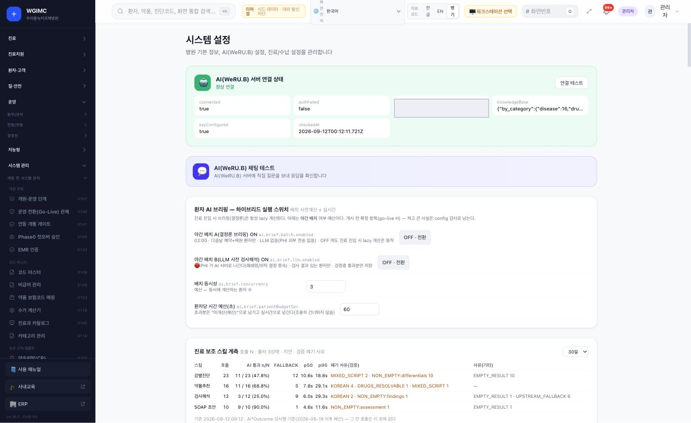
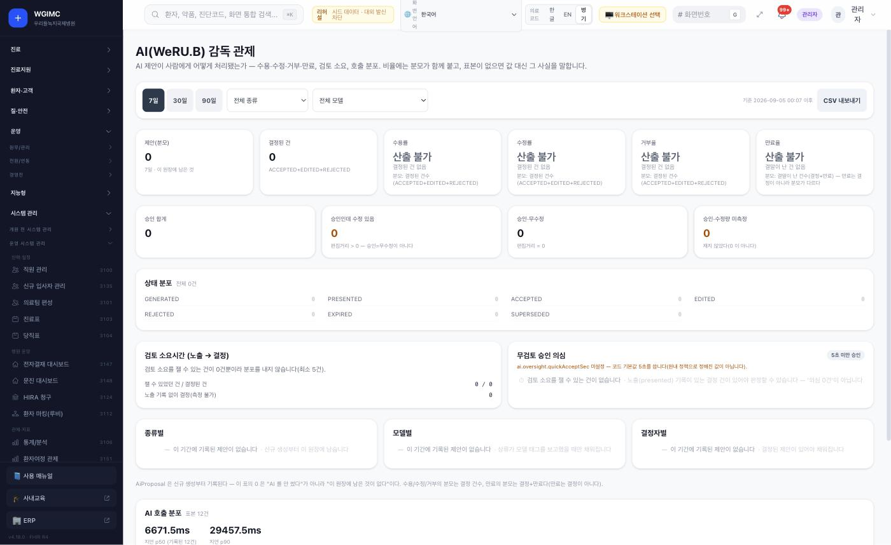
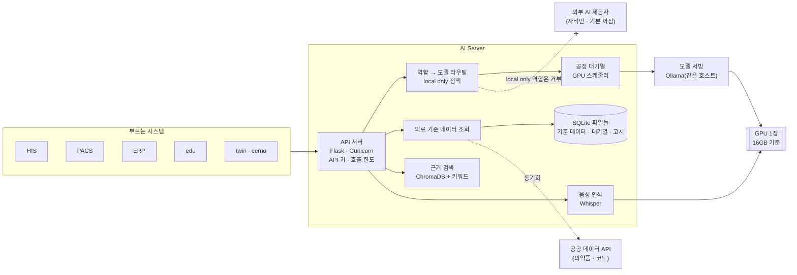
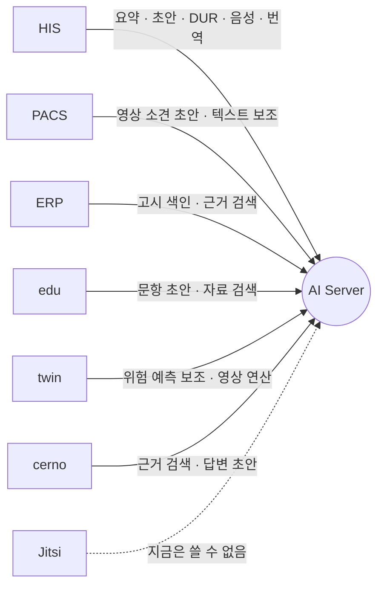

# AI Server — 기관 안의 AI 연산 서버

**AI Server — the on-premise server that does the ecosystem's AI work**

> 프로젝트 소개서 · 읽는 사람: **의료 전산담당자** · 기준: AI Server 저장소의 **현재 개발본**(2026-09-29 에 읽음 · 끝의 [이 문서의 근거](#이-문서의-근거)) · [소개서 목록](README.md)

---

## Introduction (English)

AI Server is where the ecosystem's AI computation happens. It runs inside the hospital on one GPU server and answers the other systems over an API: HIS, PACS, ERP, edu, twin and cerno call it. It **assists and drafts** — it drafts clinical notes and patient explanations, supports symptom triage and drug-interaction (DUR) checks, searches source documents such as regulations and notices, and transcribes speech. A person reviews every draft before it becomes part of a record.

Callers do not name a model. They name a **role** (for example "summarise" or "DUR check"), and a routing table on the server decides which model serves it. Medical, personal-health and regulatory roles are marked "local only", and the code refuses to send them to an outside AI provider; all outside providers are switched off by default. For safety-critical questions such as drug interactions, the server looks up public reference data first and uses the model only to phrase the answer.

Technically it is a Python Flask application (one process with many threads under Gunicorn), with Ollama serving the models on the same host, Whisper for speech, an embedded ChromaDB vector store for document search, and several SQLite files for data and job queues. It needs no separate database server. It was developed on a single consumer GPU with 16GB of memory.

The same repository also contains features that have nothing to do with hospitals; the repository does not say why they share one codebase. This introduction covers only the medical and ecosystem side.

What an IT team should know first: there is no ready-made install definition for a new server; model weights are not included and the hospital downloads them itself; and throughput and answer quality have not been measured on the reference hardware yet. In the September 2026 follow-along, several call paths were exercised with a small substitute model on a CPU, but no connection was marked as verified. Details are in [What to know](#8-알아-둘-것).

---

## 1. 한 문장

> **EN** — AI Server gathers the ecosystem's AI work on one GPU server inside the hospital and returns drafts and assisting results to the systems that call it. HIS keeps running without it, but its AI switch is on by default, so switch it off until AI Server is ready. The repository also holds non-medical features; this introduction covers only the medical side. At a glance: installed by hand (no install definition), models downloaded by the hospital, take the current development line because the integrated-release code can fail to issue API keys on a fresh install, no connection verified yet, and throughput and answer quality not measured.

**AI Server 는 생태계의 AI 연산을 기관 안 GPU 서버 한 대에 모아 맡고, 다른 시스템이 부르면 초안과 보조 결과를 돌려주는 서버입니다.**

### 한눈에 — 도입 판단

| | |
|---|---|
| **지금 쓸 수 있나** | 조건부 — 새 서버에 올리는 설치 정의가 없어 손으로 설치하고, 모델은 기관이 직접 받습니다. 부르는 시스템과의 연결은 아직 하나도 끝까지 확인되지 않았고, 처리량과 답의 품질은 재지 않았습니다 |
| **세워야 하는 것** | GPU 서버 한 대 — API 서버(Flask · Gunicorn 프로세스 하나) · 같은 호스트의 모델 서빙(Ollama) · 음성 인식(Whisper). 검색 색인(ChromaDB)과 SQLite 파일은 앱 안에 있어 별도 DB 서버가 없습니다. 다른 시스템이 부르려면 앞단 프록시를 둡니다 |
| **먼저 있어야 할 것** | 다른 프로젝트 없이도 뜨지만, 부르는 시스템(주로 HIS)이 있어야 쓸모가 있습니다. 기관은 모델 가중치(약관 확인) · 공공 데이터 이용 키 · 공공 데이터를 받을 인터넷 연결이나 반입 절차를 준비합니다 |
| **받을 코드** | 이 소개서가 설명하는 현재 개발본을 받습니다. 통합 릴리즈 코드로 새로 설치하면 API 키 발급이 실패할 수 있어서입니다. 판 번호 · 커밋 · 달라진 점은 9절 · [소스 받기](../SOURCES.md) |
| **실제로 확인된 것** | 없음 |
| **아직 모르는 것** | 처리량 · 응답 시간 · 답의 품질 · 동시 사용자에 따른 GPU · 메모리 · 디스크 · 모델을 모두 받았을 때의 디스크 합계 · 장애 뒤 복구 절차 · 요청과 응답 본문을 얼마나 남기는지 |

twin 과 cerno 는 자기 GPU 를 두지 않고 이 서버를 부릅니다. 그래서 모델을 올리고 GPU 를 나눠 쓰는 일은 이 서버 한 곳에서만 합니다.

**AI Server 가 없거나 멈춰도 HIS 는 멈추지 않습니다.** 다만 HIS 의 AI 스위치는 코드 기본값이 켜짐입니다. 켜 둔 채 AI Server 가 없으면, AI 칸마다 「폴백」(AI 대신 미리 정한 기본 동작) · 「산출 불가」 · 오류 중 하나가 보입니다. 기능마다 다릅니다 — 번역은 원문에 실패 표시를 붙여 보이고, 약품집 초안은 오류로 끝납니다. 그래서 설치 직후에는 HIS 의 AI 스위치를 끄는 순서를 권합니다(6절).

이 저장소에는 의료와 무관한 기능도 함께 들어 있습니다. 왜 한 저장소에 있는지는 저장소에서 설명을 찾지 못했습니다. 이 소개서는 **의료 · 생태계 쪽만** 다룹니다.

## 2. 병원 업무의 어디에 쓰이나

> **EN** — Clinicians never open AI Server directly; they meet it inside HIS, PACS, ERP and edu screens. The people who work with it directly are the IT staff who load models, issue API keys and watch the queue.

의료진이 AI Server 화면을 직접 여는 일은 없습니다. **HIS · PACS · ERP · edu 화면 안에서** 초안이나 보조 결과로 만납니다.

| 누가 | 어디서 만나나 | 무엇을 받나(예) |
|---|---|---|
| 의사 | HIS 진료 화면 | 진료 기록 요약 · 기록 초안 · 환자 설명문 초안 · 음성 기록 전사 |
| 약사 | HIS 처방 검토 | 약물 상호작용 · DUR 점검 보조 · 환자용 약 설명 초안 |
| 영상의학 | PACS 판독 화면 | 영상 소견 초안 · 이전 영상과의 비교 초안 |
| 보험심사 | ERP 사전심사 | 고시 근거 검색 |
| 교육 담당 | edu | 시험 문항 초안 · 학습 자료 요약 |
| **전산담당자** | AI Server 관리 기능 | 모델 받기 · 역할별 모델 지정 · 부르는 시스템마다 API 키 발급 · 대기열과 GPU 사용 감시 |

**장면으로 보면**

- **외래 진료 기록** — 의사가 HIS 에서 진료 대화를 음성으로 기록합니다. AI Server 가 이를 글로 옮기고 요약 초안을 만듭니다. 의사가 고쳐서 승인해야 진료기록이 됩니다.
- **처방 검토** — 약사가 HIS 에서 처방을 검토할 때 DUR 점검 보조를 부릅니다. AI Server 는 공공 DUR 기준 데이터를 먼저 조회하고, 모델은 그 결과를 읽기 쉬운 문장으로 다듬기만 합니다. 판단은 약사가 합니다.
- **모델 교체** — 전산담당자가 새 모델을 받아 라우팅 표에서 역할에 연결합니다. 부르는 시스템은 역할 이름으로 부르므로 코드를 고칠 필요가 없습니다.

## 3. 할 수 있는 일

> **EN** — Medical reference lookups (DUR, drug prices and codes, disease and fee codes), drafting (notes, summaries, patient explanations, imaging findings), document search with an evidence flag, speech-to-text, compute for twin, and the machinery for sharing one 16GB GPU and governing models and keys.

| 묶음 | 무엇이 들어 있나 |
|---|---|
| **의료 기준 데이터 조회** | 공공 DUR 기준 점검 **보조**(금기 · 주의 등 일곱 가지) · 약가와 제품 코드 · 대체조제 · 환자용 의약품 정보 · 질병분류와 수가 코드 조회. **데이터 카탈로그**(어떤 데이터가 있고 언제 받은 것인지 보여 주는 목록)가 있습니다 |
| **진료 보조(초안)** | 진료 기록 요약(SOAP) · 의무기록 초안 · 환자 설명문 초안 · 증상 분류 보조 · 의료진용 임상 질의 · 영→한 의학 번역 · 영상 소견 초안 · 이전 영상 비교 초안 |
| **근거 문서 검색(RAG)** | 문서에서 근거를 찾아 답합니다. 문서마다 법령 > 고시 > 상대가치 > 발간물 순의 권위 등급을 매깁니다. 검색 순위에서 아래 등급에 감점을 주고, 관련 법령 · 고시 상위 2건은 늘 넣습니다. 양이 많은 발간물이 법령을 밀어내지 않게 한 것입니다. **근거를 못 찾으면 「근거 없음」이라고 알립니다.** 기관마다 지식 저장소를 나눕니다 |
| **음성 인식** | 진료실 실시간 인식 · 녹음 파일 일괄 인식. 모두 서버 안에서 합니다 |
| **twin 연산 지원** | 비식별 연산(생리 반응 시뮬레이션 · 영상에서 장기 3D 모양 만들기 등) |
| **GPU 나눠 쓰기** | 4절의 **라우팅**(역할 이름 → 모델)과 **대기열 · GPU 스케줄러**(무엇을 올려 두고 누가 먼저인가)가 하는 일입니다 — 늘 올려 두는 모델과 요청할 때 올리는 모델 · 동시에 올리는 모델 수 한도 · 우선순위 · 같은 요청 합치기 · 응답이 늦을 때 끊는 장치 · 시간대별 운영 프로파일(시간대마다 올려 둘 모델을 정한 묶음 · 자동 적용은 기본 꺼짐) |
| **관리 · 통제** | 부르는 시스템마다 API 키(만료일 · 새 키와 옛 키 병행 교체) · 약물 데이터 정제는 **사람이 승인해야 반영** · 출처 이력(기록마다 어디서 온 데이터인지 남김) · 자기 품질 계측(답이 근거와 맞는지 · 검색이 맞는 문서를 찾는지) · 응답마다 버전 헤더 |

전체 기능 표: [AI Server 구성서 §4](../systems/ai-server.md#4-핵심-기능) · AI 가 하는 일과 하지 않는 일: [개요서 7장](../overview/07-ai.md).

### 화면으로 보기

> **EN** — No screenshots of AI Server's own admin screens yet. Hospitals mostly see AI through HIS; two HIS screens are shown instead.

**AI Server 자체 관리 화면은 캡처 없음**입니다(관리 화면에는 주소 · 파일 경로 · 토큰이 보일 수 있어 가린 뒤 싣기로 했고, 아직 찍지 않았습니다). 병원이 AI 를 켜고 끄고 지켜보는 곳은 HIS 화면이라, HIS 쪽 화면 두 장을 대신 싣습니다.

| | |
|---|---|
|  **HIS 시스템 설정 — AI** — AI 서버 연결 상태 · 스위치 · 진료 보조 기능 실측 |  **HIS AI 감독 관제** — AI 제안과 승인 이력 · 표본이 없으면 「산출 불가」 |

화면은 가상 병원 데이터가 든 리허설 설치본에서 찍었습니다(2026-09-12 · AI 서버 주소는 가림). 캡처할 AI Server 화면 목록은 [AI Server 화면](../screens/ai-server.md)에 있습니다.

## 4. 어떻게 만들어졌나

> **EN** — A Python Flask API under Gunicorn (one process, many threads), a routing layer that maps roles to models, a fair queue and GPU scheduler in front of Ollama on the same host, Whisper for speech, an embedded ChromaDB vector store, and several SQLite files. An optional Apple Silicon helper can take over some work. No separate database server.

| 구성 요소 | 무엇 | 기술 |
|---|---|---|
| **API 서버** | 모든 요청을 받습니다 · API 키 확인 · 비용이 큰 경로의 호출 한도 · 버전 헤더 · 지표(Prometheus) | Python · Flask · Gunicorn(프로세스 하나 · 스레드 여럿) |
| **라우팅** | 역할 이름을 모델로 바꿉니다. 역할마다 데이터 정책(local only 등)이 붙습니다 | 설정 파일 한 곳 |
| **대기열 · GPU 스케줄러** | 16GB GPU 에 무엇을 올려 둘지 · 누가 먼저인지 정합니다 | 자체 코드 |
| **모델 서빙** | 모델을 GPU 에 올려 돌립니다 | Ollama — 호스트에 직접 설치 |
| **음성 인식** | 전사 | Whisper 계열 |
| **근거 검색** | 벡터 검색과 키워드 검색을 합칩니다 | ChromaDB(프로세스 안에 내장) |
| **관리 화면** | 모델 · 키 · 대기열 · GPU 상태 | 웹 관리 화면 |
| **보조 작업자**(선택) | Apple Silicon(맥 컴퓨터의 칩) 기기에서 도는 별도 작업자로, 음성 인식을 넘겨받는 경로가 코드에 있습니다. 없어도 서버는 동작합니다. 나눠 맡기는 범위는 시험하지 않았습니다 | 별도 경량 프로세스 |

코드 크기는 **저장소 전체**를 센 값만 있습니다(이 문서의 근거 절). 의료 밖 기능이 함께 들어 있고, 의료 쪽만 따로 세지는 않았습니다. 왜 한 저장소에 함께 있는지는 저장소에서 설명을 찾지 못했습니다.

**데이터가 사는 곳**

| 저장소 | 무엇이 들어 있나 |
|---|---|
| **SQLite 파일 여러 개** | 의료 기준 데이터(DUR · 의약품 정보 · 질병 · 수가 코드 · 의료 법령) · 고시 · 작업 대기열 · 품질 평가 기록 |
| **ChromaDB 폴더** | 근거 검색용 벡터 색인 |
| **설정 파일** | 서버 설정 · 역할 → 모델 라우팅 표 · 외부 제공자 목록 |
| **모델 저장소**(Ollama) | 기관이 받은 모델 가중치 |

- **별도 DB 서버가 필요 없습니다.**
- **저장소에 데이터 파일이 몇 개 들어 있습니다** — 코드 데이터 파일 하나는 질병 · 수가 · 약품 코드와 그 출처 기록 같은 표로 짜여 있습니다. 표 이름만 확인했고, 값의 출처 · 이용 조건 · 개인정보가 섞였는지는 확인하지 않았습니다. 받아 쓰기 전에 기관이 확인할 대상입니다.
- **기록의 정본은 부른 쪽(HIS 등)에 남습니다.** AI Server 는 받은 내용으로 초안을 만들어 돌려줍니다.

## 5. 다른 시스템과의 연결

> **EN** — AI Server is the called side; apart from a callback to the video-consultation system that is not usable now, the connection table lists no call from it to another ecosystem system, though it does need internet access for public reference data. Each caller gets its own API key, and chat requests run one at a time per key. HIS, PACS, ERP, edu, twin and cerno are wired to call it; the video-consultation link is not usable now. In the September 2026 follow-along, some HIS, ERP and edu paths were called with a small substitute model, but "tried" is not "verified": no connection was marked verified because each covers many functions or needs an embedding model that was not loaded. The statuses come from the integrated-release install, not the current development line.

**AI Server 는 불리는 쪽입니다.** 부르도록 만들어진 곳은 HIS · PACS · ERP · edu · twin · cerno 여섯입니다. 원격 상담(Jitsi)에서 부르는 길은 지금 쓸 수 없어 그림에 점선으로만 둡니다. 부르는 시스템마다 API 키를 따로 발급합니다.

AI Server 가 생태계의 다른 시스템을 부르는 연결은 없습니다. 예외는 원격 상담(Jitsi)에 회의록 결과를 돌려주는 콜백 하나인데, 지금은 쓸 수 없습니다. 그렇다고 폐쇄망에서 그대로 도는 것은 아닙니다 — 공공 데이터를 받으려고 **인터넷으로 나가는 연결**이 필요합니다(8절).

아래 표의 「불러 봄」과 「확인함」은 다릅니다. 「불러 봄」은 경로 하나가 응답하는 것을 본 것이고, 연결 하나에 묶인 기능 전체를 확인하지는 않았습니다. 그래서 AI Server 의 연결 중 「확인함」은 **하나도 없습니다**. 표의 상태는 통합 릴리즈 기준 설치본에서 본 것이고, 현재 개발본으로 다시 부르지는 않았습니다(9절).

| 부르는 쪽 | 무엇을 부르나 | 인증 | 상태 | 2026년 9월에 불러 본 것 |
|---|---|---|---|---|
| **HIS** | 진료 보조 전반(요약 · 초안 · 증상 분류 · DUR · 코드 · 근거 검색 등) · 음성 기록 · 번역 · 약품집 등 작은 초안 기능 | 발급된 API 키 | 만들어져 있음 · 확인은 아직 | 요약 한 경로 · 번역 · 약품집 초안 |
| **HIS** | 관리 화면의 설치 모델 목록 대조 | — | 아직 없음 | — |
| **PACS** | 영상 판독 보조 · 텍스트 보조 · 코드 매핑 | 발급된 API 키 | 만들어져 있음 · 확인은 아직 | — |
| **PACS** | AI 서버 가용성 감시 | — | 아직 없음(통합 릴리즈 기준 — 9절) | — |
| **ERP** | 보험 · 수가 고시 색인 · 청구 사전심사의 근거 검색 | 발급된 API 키 | 만들어져 있음 · 확인은 아직 | 고시 등록 · 폐지(색인 완료는 임베딩 모델이 있어야 함) |
| **edu** | 학습 도우미 · 문항 생성 · 요약 · 번역 | 발급된 API 키 | 만들어져 있음 · 확인은 아직 | 문항 생성 |
| **twin · cerno** | 위험 예측 보조 · 근거 검색 · 답변 초안 · DUR | 발급된 API 키 | 만들어져 있음 · 확인은 아직 | 설치하지 않음 |
| **Jitsi** | 원격 상담 회의록 · 자막 | — | 지금은 쓸 수 없음 | — |

- 「불러 봄」은 2026년 9월에 새로 세운 설치본에서 **작은 대체 모델 · CPU** 로 불러 본 것입니다(가상 데이터 · [따라가 본 결과](../build-guide/follow-along-2026-09.md)). 품질은 판정하지 않았습니다.
- **부르는 쪽이 알아 둘 것** — 비용이 큰 경로는 호출 한도를 넘으면 429(요청이 너무 많음)를 돌려줍니다. 부르는 쪽은 기다렸다 다시 시도하게 만듭니다. 응답마다 붙는 계약 버전 표시(`X-API-Contract`)는 예전 호출 방식이 더는 통하지 않게 바뀔 때만 오릅니다. 쓸 수 있는 데이터와 API 는 데이터 카탈로그에서 먼저 확인합니다.
- **대화 요청은 키마다 한 번에 한 건** — 대화 경로(`/api/chat`)는 API 키 하나당 동시에 한 건, 서버 전체로는 세 건까지 처리합니다. 나머지는 대기열에서 차례를 기다립니다(최대 20건 · 60초). 여러 사람이 키 하나를 나눠 쓰면 요청이 하나씩 차례로 처리됩니다.

연결마다의 자세한 내용: [HIS → AI Server](../integration/cards/his-to-ai-server.md) · [PACS → AI Server](../integration/cards/pacs-to-ai-server.md) · [ERP → AI Server](../integration/cards/erp-to-ai-server.md) · [edu → AI Server](../integration/cards/edu-to-ai-server.md) · [연결 상태 표](../RELEASES/2026.09/compatibility.md).

## 6. 설치 · 운영

> **EN** — One server with a GPU (developed on a 16GB consumer card; CPU works but its speed is not measured). There is no install definition for a new server: install the Python dependencies, put Ollama on the same host, download the models yourself — all of them are listed in one table in this section, with BGE-M3 for embeddings fixed by name in code — then issue a key for each caller. How many models stay loaded at once is an operating value the hospital sets; the repository's own documents disagree on it. The backup script covers the job queue, settings and recent logs, not the reference data or the search index.

### 필요한 것

| 항목 | 내용 |
|---|---|
| 서버 | **GPU 한 장**(VRAM 16GB 소비자용 카드로 개발 · 운영해 왔습니다). GPU 가 없어도 돌지만 그 속도는 계측하지 않았습니다. CPU 서버용 배치 전용 모드가 있습니다. 권장 메모리 · 디스크와 동시 사용자별 응답 시간은 계측하지 않았습니다 |
| 소프트웨어 | Python 3 · 저장소의 의존성 목록 · Ollama(호스트에 직접 설치) |
| 먼저 있어야 할 것 | 없습니다. 다만 부르는 시스템(주로 HIS)이 있어야 쓸모가 있습니다 |
| 기관이 준비할 것 | **모델 가중치**(저장소에 없음 — 모델마다 약관을 읽고 직접 받음) · 공공 데이터 API 이용 키(기관이 직접 신청) · 부르는 시스템마다 API 키 |

### 설치 경로

- **새 서버에 올리는 설치 정의(컨테이너 정의 · 설치 스크립트)가 없습니다.** 저장소의 안내는 이미 설치된 서버를 갱신하는 용도입니다. 따라가기에서는 의존성을 직접 설치했습니다. GPU 가 없는 시험 장비라 엔비디아 GPU 가 있어야 설치되는 학습용 패키지 3개를 빼야 했습니다. GPU 서버에서 목록 그대로 설치되는지는 시험하지 않았습니다.
- **Ollama 를 같은 호스트에 둡니다.** 앱이 모델 서버를 자기 호스트에서 찾습니다. 다른 시스템이 부르려면 앞단 프록시를 둡니다.
- **앞단 프록시는 원래 요청자를 알리는 전달 헤더(`X-Forwarded-For`)를 반드시 붙이게** 설정합니다. 설정 방법은 [구축 가이드 S6](../build-guide/S6-ai.md)와 저장소의 운영 안내를 따릅니다.
- **모델을 먼저 넣고 서버를 띄웁니다.** 기동하면 쌓여 있던 작업이 바로 시작되므로, 모델 없이 띄우면 그 작업들이 실패로 끝납니다.
- **API 키를 새로 발급합니다** — 부르는 시스템마다 하나씩, 만료일과 함께.

### 받을 모델

모델은 한 곳에 모아 이 표로 봅니다. 이름은 구축 가이드 S6 와 라우팅 표를 따랐고, 크기는 코드에 적힌 적재 추정값이 있는 것만 적었습니다.

| 무엇에 쓰나 | 모델 | 적재 크기 | 약관 요점 |
|---|---|---|---|
| 문장 생성 — 요약 · 초안 · 증상 분류 · 근거 답변 · 도구 호출 | Qwen2.5 14B(**기본 모델** · 라우팅이 가장 많이 부름) · Qwen2.5 7B · Qwen3 8B | 14B 약 10.5GB · 7B 약 5.0GB · 8B 는 재지 않음 | Apache-2.0 |
| 이미지 · 문서 읽기 | Qwen3-VL 8B · DeepSeek-OCR | 재지 않음 | THIRD_PARTY 참고 |
| 의료 영상 판독 **초안**(PACS · twin) | MedGemma 1.5 4B · MedGemma 4B | 재지 않음 | HAI-DEF 약관 — 임상 사용이면 관할 규제 기관 승인을 요구 |
| 임상 질의 · 약물 분석 후보 | Llama3-Med42-8B · Meditron 7B | 재지 않음 | Llama 3 · Llama 2 Community License · 개발사가 추가 검증 없는 임상 사용을 경고 |
| **임베딩**(문서를 검색할 수 있게 숫자로 바꾸는 모델) | **BGE-M3** — 이름이 코드에 고정 | 약 1GB | MIT |
| 음성 인식 · 화자 구분 | Whisper large-v3(일괄) · medium(실시간) · SpeechBrain ECAPA | 재지 않음 | MIT 등 — THIRD_PARTY 참고 |
| 일부 의료 요약 · 초안 | 자체 파인튜닝 모델 2종 — **공개 배포하지 않음** | — | 설정에서 공개 모델로 바꿔 씁니다 |

- **생성 모델만 받으면 문서 색인이 실패합니다.** 임베딩 모델을 함께 받습니다.
- **임베딩 모델은 BGE-M3 라는 이름 그대로** 받아야 합니다. 다른 임베딩 모델을 받아 두어도 부르지 않습니다.
- 임베딩 요청의 문맥 길이는 따로 작게 줍니다(`RAG_EMBED_NUM_CTX` · 기본 2048). 색인만 실패하고 생성은 되면 이 값과 모델 서버의 전역 문맥 길이를 먼저 봅니다.
- 라우팅 표에는 이 밖의 이름도 있습니다(선택 기능 · 의료 밖 기능). 쓰려는 기능의 역할이 부르는 이름을 라우팅 표에서 확인해 받습니다.
- **모델 이름을 바꿔 복사하지 않습니다.** 라우팅 표를 받은 모델에 맞게 고칩니다.
- 모두 받았을 때의 디스크 합계는 재지 않았습니다. 약관 원문은 [THIRD_PARTY §3](../THIRD_PARTY.md#3-ai-모델-가중치)에 있습니다.
- **한 번에 GPU 에 올려 둘 모델 수는 제품이 정해 주지 않습니다.** 기관이 VRAM 과 위 적재 크기를 보고 정하는 운용 값입니다(모델 서빙 설정 `OLLAMA_MAX_LOADED_MODELS`). 저장소 문서끼리 이 값이 다릅니다 — 8절.

### 꼭 정해야 하는 설정

- **서버 설정 파일** — 기본 모델 · 기본 모델을 늘 올려 둘지 · 의료 경로를 공개 모델로만 고정하는 스위치 · 앞단 구성 방식(`ingress_mode`).
- **`ingress_mode`** 는 바깥 요청이 이 서버에 들어오는 길을 적는 값입니다. 기본값은 `ssh_tunnel`(다른 서버에서 만든 암호화 통로 — 터널 — 로 들어옴)입니다. 다른 시스템이 앞단 프록시를 거쳐 부르면 `proxy`, 앞단 없이 바로 부르면 `none` 으로 바꿉니다. 실제 구성과 다르면 상태 점검이 거짓 경보(기동 직후 `tunnel: down` 등)를 냅니다.
- **라우팅 표** — 역할마다 쓸 모델. 의료 · 개인건강정보 · 규제 역할은 local only 로 묶여 있습니다.
- **외부 제공자 목록** — 모두 꺼져 있습니다. 켜지 않는 것이 기본입니다.
- **환경 변수** — 모델 서버 주소 · 공공 데이터 API 키 · 음성 인식 모델과 장치.
- **HIS 쪽 AI 스위치** — HIS 의 AI 기능 전체 스위치는 코드 기본값이 켜짐입니다. 구축 가이드는 **설치 직후 끄고, 기관 결정에 따라 하나씩 켜는** 순서로 안내합니다. 켜 둔 채 AI Server 가 없으면 각 칸은 1절처럼 폴백이나 실패 표시로 보입니다.

설정 키 전체: [AI Server 구성서 §6](../systems/ai-server.md#6-주요-설정).

### 백업 · 감시

- **백업** — 저장소의 백업 스크립트는 **작업 대기열 DB · 서버 설정 · 최근 로그**를 묶어 30일 동안 남깁니다. **의료 기준 데이터 · 고시 · 근거 검색 색인 · 라우팅 표는 이 스크립트에 들어 있지 않습니다.** 무엇을 더 백업할지는 기관이 정합니다.
- **상태 확인** — 상태 점검 주소가 항목별로 답합니다 · Prometheus 지표 · 응답마다 버전 · 계약 버전 · 커밋 헤더 · 디스크 · 메모리 · 스왑(메모리가 모자라 디스크를 대신 쓰기 시작함) 경보 스크립트.
- **품질 계측** — 답이 근거와 맞는지 · 검색 품질 · 채점기 일관성(답을 채점하는 모델이 같은 답에 같은 점수를 주는지)을 서버가 스스로 잽니다.
- **기록** — AI 제안과 승인 · 수정 · 거부, AI 호출 기록은 부른 쪽인 HIS 가 남깁니다(구축 가이드 S6). AI Server 자신이 요청과 응답 본문을 얼마나 남기는지는 이 자료에서 확인하지 않았습니다.
- **장애 뒤 복구 절차**는 이 자료에서 따로 정리하지 않았습니다.

자세한 설치 · 설정 순서: [구축 가이드 S6](../build-guide/S6-ai.md).

## 7. 이렇게 만든 이유

> **EN** — Five choices: callers name roles, not models; medical roles are local-only and the code refuses to send them out; safety-critical answers come from public reference data first; one GPU server serves everyone; and when there is no evidence the answer says so.

| 설계 | 왜 |
|---|---|
| **역할 이름으로 부른다** — 모델 이름이 아니라 「요약」 · 「DUR 점검」 같은 역할 | 모델을 바꿔도 부르는 시스템의 코드를 고치지 않게. 역할과 모델의 대응이 한 곳에 있게 |
| **의료 역할은 local only** — 외부 AI 제공자로 보내려 하면 코드가 거부 | 설정 하나를 잘못 켜도 환자 정보가 기관 밖 AI 로 나가지 않게(실패하면 막는 쪽) |
| **공공 기준 데이터를 먼저** — DUR · 의약품 · 법령은 데이터를 조회하고, 모델은 문장만 다듬음 | 안전과 직결되는 답을 모델의 기억에 맡기지 않게 |
| **GPU 서버 한 대에 모은다** — twin · cerno 는 GPU 를 두지 않음 | 모델 적재와 GPU 나눠 쓰기를 한 곳에서만 관리하게. 기관이 GPU 를 여러 대 살 필요가 없게 |
| **근거가 없으면 알린다** — 인용은 실제 검색 결과에서만, 없으면 「근거 없음」 | 그럴듯한 답이 근거 있는 답처럼 보이지 않게 |

이 원칙들이 어디서 나왔는지: [형제 시스템은 어떻게 자랐나](../DESIGN-HISTORY-SYSTEMS.md) · [개요서 7장 AI](../overview/07-ai.md).

## 8. 알아 둘 것

> **EN** — No install definition for a new server; model weights are not included and the embedding model must match the name in the code; throughput, response time and answer quality have not been measured on the reference hardware; how many models stay loaded at once is an operating value the hospital sets, not a product value (the repository's documents record 1, 2 and 3 at different times), and few fit on a 16GB GPU; the reference data and regulatory sources are Korean; both sync paths call out to the internet and there is no file-import path; and regulatory status is "designed to address" only.

- 🔴 **새 서버용 설치 정의가 없습니다** — 의존성을 직접 설치하고, Ollama 를 같은 호스트에 두고, 앞단 프록시를 직접 구성합니다([S6](../build-guide/S6-ai.md)).
- 🔴 **모델은 기관이 직접 받습니다** — 저장소에 없습니다. 모델마다 약관이 다르고, 일부는 임상 사용 전 검증을 요구합니다([THIRD_PARTY §3](../THIRD_PARTY.md#3-ai-모델-가중치)). 임베딩 모델은 코드가 정한 이름으로 받아야 합니다.
- 🔴 **처리량 · 응답 시간 · 답의 품질은 기준 장비에서 계측하지 않았습니다** — 2026년 9월 따라가기는 CPU 와 작은 대체 모델로 경로만 불러 본 것입니다. 동시 사용자가 많을 때의 모습은 아직 모릅니다.
- **한 번에 GPU 에 올려 둘 모델 수는 기관이 정하는 운용 값입니다.** 제품이 정해 주는 값이 아닙니다. 기관이 VRAM 과 모델 크기(6절 표)를 보고 모델 서빙 설정(`OLLAMA_MAX_LOADED_MODELS`)에 넣습니다([S6](../build-guide/S6-ai.md)).
  - 저장소 문서끼리 어긋납니다: 이 값을 시기마다 1 · 2 · 3 으로 다르게 적고, 어느 것이 맞는지 정한 곳이 없습니다.
  - 16GB GPU 에는 많이 올리지 못합니다. 음성 인식 여러 건 동시 처리 · 영상과 대화 모델 동시 적재는 더 큰 GPU 가 있어야 풀린다고 저장소가 적습니다.
- **의료 기준 데이터와 법령 · 고시 근거는 한국 공공기관 자료**입니다. 다른 나라에서는 그 나라의 기준 데이터를 새로 붙입니다. 이 데이터를 받는 두 경로(목록 파일 내려받기 · 공공 데이터 API)는 모두 바깥을 직접 부릅니다. 파일을 받아 넣는 반입 경로는 없어서, 인터넷이 막힌 망이라면 그 주소만 예외로 열거나 반입 절차를 기관이 따로 만듭니다([S6](../build-guide/S6-ai.md)).
- **규제 표기는 「대응 설계」**입니다. 자체 점검 완료 · 외부 인증 · 승인 기록은 없습니다. 의료기기 해당성 판단과 인허가는 구축 기관이 합니다([의료 면책 고지](../DISCLAIMER.md)).

전체 한계와 대체 수단: [AI Server 구성서 §10](../systems/ai-server.md#10-한계와-대체-수단) · [구축 가이드 S6](../build-guide/S6-ai.md).

## 9. 통합 릴리즈 `2026.09` 이후 달라진 점

> **EN** — The integrated release pinned AI Server at code version 2.125.41 (2026-09-09). The current development line is 2.125.61, 46 commits later, none of them tagged. For the medical side the main changes are in GPU model loading (fewer reloads; time-of-day profiles no longer apply automatically), a fix for fresh installs, guards in the drug-data batch, new quality measurements, a regrouped admin console whose settings screen shows the values actually applied, a fix for empty answers from the vision model, and fixes in several integration paths that will be re-checked before the connection table changes.

이 자료의 다른 문서(구성서 · 구축 가이드 · 연결 표)는 **통합 릴리즈 `2026.09`**(코드 버전 2.125.41 · 2026-09-09)에 맞춰 쓰여 있습니다. 그 뒤로 **46커밋**이 더해져 현재 개발본은 코드 버전 **2.125.61** 입니다. 저장소의 마지막 태그는 여전히 v2.8.0 이라, 이 커밋들에는 태그가 없습니다.

**그래서 받을 코드는 현재 개발본**(커밋은 끝의 근거 절)입니다. [소스 받기](../SOURCES.md)가 가리키는 커밋은 통합 릴리즈 코드이고, 그 코드로 새로 설치하면 API 키 발급 · 검증이 실패할 수 있습니다(아래 「새 설치」 행). 다만 연결 상태는 통합 릴리즈 코드로 본 것이라, 현재 개발본으로는 다시 확인하지 않았습니다(5절).

| 영역 | 달라진 것 |
|---|---|
| **모델 적재** | 다른 모델이 쓰이는 동안 기본 모델을 되올리지 않고 기다리게 해, 모델을 내렸다 올리는 일이 되풀이되던 것을 줄였습니다 |
| **시간대 프로파일** | 시간대별 운영 프로파일의 **자동 적용이 기본 꺼짐**이 됐습니다. 상주 모델 정책과 부딪혀 실제로 적용되지 않았기 때문입니다. 수동 적용은 그대로입니다 |
| **새 설치** | 새 데이터베이스에서 표가 만들어지는 순서를 고쳤습니다. 전에는 새로 설치하면 API 키 발급 · 검증이 실패할 수 있었습니다 |
| **약물 데이터 정제** | 배치가 끝나지 않고 되풀이되던 경우를 멈추고, 영향을 받은 기록을 따로 격리하는 도구가 생겼습니다 |
| **품질 계측** | 판정마다 확신 정도를 함께 남기는 축 · 교차검증 모델 비교(기존 모델 유지로 결론) · 한국어 출력에 다른 문자가 섞이는지 재는 측정이 생겼습니다 |
| **관리 화면** | 설정 화면이 **실제로 적용된 값**과 그 출처를 보여 주게 고쳤습니다. 메뉴를 다섯 묶음으로 정리하고, 역할마다 보이는 메뉴와 할 수 있는 관리 동작을 역할 정의에 맞췄습니다. 설정 화면을 여섯 절로 다시 묶고 고급 설정 표를 더했으며, 탭마다의 권한을 서버에서도 확인합니다(2.125.58~61). 학습 탭의 설정값 · 학습 이력이 채워지지 않던 것을 고쳤습니다 |
| **영상 · 문서 읽기 모델** | 비전 모델이 생각하는 데 할당량을 다 써서 빈 답을 돌려주던 경우를, 할당량을 늘려 고쳤습니다. 그래도 빈 답이면 같은 모델로 한 번 더 시도한 뒤 대체 경로로 넘어갑니다(2.125.60) |
| **연동** | 형제 시스템과 맞물리는 경로 몇 곳의 코드가 바뀌었습니다 — 각 연결의 상태는 다시 확인한 뒤 [연결 표](../RELEASES/2026.09/compatibility.md)에 반영합니다 |

의료와 무관한 기능의 변경은 이 표에 싣지 않았습니다.

## 10. 더 깊이

> **EN** — Where to go next.

| 알고 싶은 것 | 문서 |
|---|---|
| 구성 · 설정 키 · 연동 · 한계 전체(통합 릴리즈 기준) | [AI Server 구성서](../systems/ai-server.md) |
| 설치 · 설정 순서 · AI 를 켜는 순서 | [구축 가이드 S6](../build-guide/S6-ai.md) |
| AI 가 하는 일과 하지 않는 일 | [개요서 7장](../overview/07-ai.md) · [AI 초안과 승인](../functions/detail/ai-draft-approval.md) |
| 모델 약관 · 기준 데이터 이용 조건 | [THIRD_PARTY §3 · §4](../THIRD_PARTY.md#3-ai-모델-가중치) |
| 연결 하나를 자세히 | [연결 카드](../integration/cards/) · [공통 규약](../integration/contracts.md) |
| 실제로 불러 본 결과 | [따라가 본 결과](../build-guide/follow-along-2026-09.md) |
| 소스 | [소스 받기](../SOURCES.md) — 저장소 `seanshin/WeRUBLLMManager` |

---

## 이 문서의 근거

> **EN** — What this introduction was written from.

| 항목 | 값 |
|---|---|
| 읽은 커밋 | `025b5cb4260a` — 이 소개서가 읽은 저장소 커밋입니다. 그 뒤로 저장소가 움직였으면 소개서가 낡았을 수 있습니다 |
| 읽은 것 | AI Server 저장소의 **현재 개발본** — 커밋 `a4d2f3ca6740`(2026-09-29)에서 처음 쓰고, `025b5cb4260a`(2026-09-29 · 코드 버전 `2.125.61` · 그 뒤 9커밋 — 관리 화면 · 비전 모델)까지 다시 읽음 · 작업 트리의 미커밋 변경은 읽지 않음 · 의료 · 생태계 쪽 코드와 문서만 |
| 비교 기준 | 통합 릴리즈 `2026.09` — 커밋 `55acaee90068`(코드 버전 2.125.41 · 2026-09-09) · 그 뒤 46커밋 |
| 센 방법 | 커밋 수 = 기준 커밋부터 현재 개발본까지의 커밋 · API 핸들러 654개 = [구성서 §3](../systems/ai-server.md#3-규모)의 기준 커밋 값(저장소 전체 · 현재 개발본으로 다시 세지 않음) · 데이터 파일 = 코드가 여는 SQLite 파일 이름 중 의료 쪽 — 2026-09-29 에 센 값 |
| 실제 연결 확인 | 2026-09-15~16 · 통합 릴리즈 기준 설치본 · CPU · 작은 대체 모델 · 가상 데이터([따라가 본 결과](../build-guide/follow-along-2026-09.md)) — `검증됨` 을 붙인 연결 없음 · 현재 개발본으로 다시 부른 것은 아님 |
| 사실 확인 | AI Server 담당의 확인 전 · 생태계 자료 측이 저장소를 읽고 쓴 것 |
