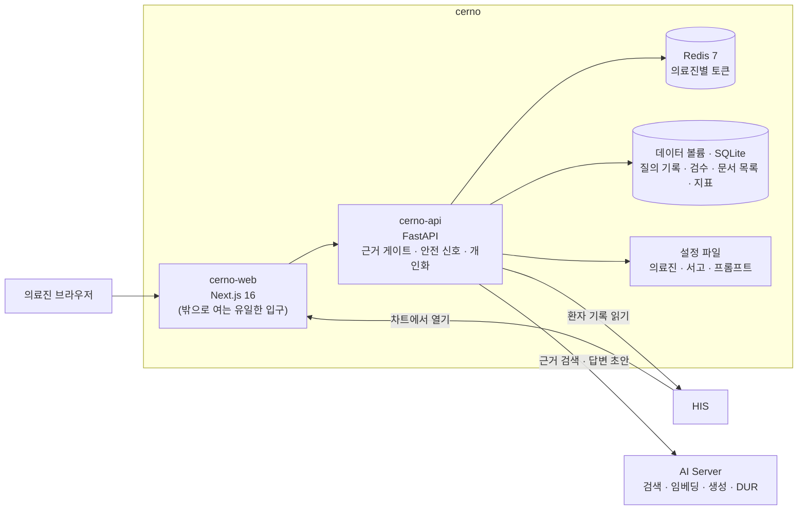
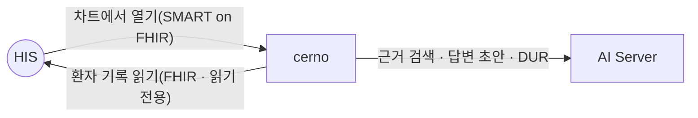

# cerno — 근거가 있을 때만 답하는 의료진별 임상 질의 도우미

**cerno — a per-clinician clinical question assistant that answers only when it finds evidence**

> 프로젝트 소개서 · 읽는 사람: **의료 전산담당자** · 기준: cerno 저장소의 **현재 개발본**(2026-09-29 · 끝의 [이 문서의 근거](#이-문서의-근거)) · [소개서 목록](README.md)

---

## Introduction (English)

cerno lets a clinician ask a clinical question from inside a patient's chart and get a **draft answer built only from documents** — the hospital's shared guidelines, the clinician's group documents and the clinician's own notes. Every sentence of the draft points back to the document it came from. When the search finds no sufficient evidence, cerno does not write an answer at all; it says "not confirmed by evidence" and suggests adding a document. Safety signals — drug interaction checks and high-risk markers such as dose, pregnancy, paediatrics or chemotherapy — are shown separately, whether or not an answer was produced.

cerno is a **pilot in shadow, non-clinical mode**. The repository states that it is not a medical device and does not confirm diagnoses or prescriptions; every screen carries that notice. The pilot's operating plan says answers are not to be used directly for clinical decisions — clinicians read them alongside their normal process and record whether they were useful. This limit is an operating rule, not a software switch. The repository's record stops on 2026-08-04, the day the pilot began, so pilot results are not available.

For an IT team: cerno is small. A Next.js web app is the only thing exposed; a FastAPI service and Redis stay on the internal network. It keeps query logs, review records and metrics in SQLite files on a data volume, and stores no document bodies of its own — all AI work (search, embedding, generation, drug checks) runs on the hospital's AI Server, and no model is trained. Clinicians always enter through HIS sign-in via SMART on FHIR — either from the patient chart or from the cerno portal — and cerno reads that patient's record from HIS read-only.

cerno was **not installed** in the September 2026 follow-along, so its three connections (HIS launch, HIS read, AI Server) are built but not yet verified by a real call. Details are in [What to know](#8-알아-둘-것).

---

## 1. 한 문장

> **EN** — cerno drafts answers to clinicians' questions only from documents it can cite, and stays silent when it finds no evidence; it runs as a non-clinical shadow pilot.

**cerno 는 의료진이 차트에서 던진 질문에, 기관 지침과 본인이 올린 자료에서 찾은 근거로만 답변 초안을 만들고, 근거가 없으면 답하지 않는 도우미입니다. 지금은 임상 결정에 쓰지 않는 섀도우(참고 운영) 파일럿입니다.**

「섀도우 운영」은 도구를 실제 업무 옆에 켜 두되 결정에는 쓰지 않고, 결과가 쓸 만했는지만 기록하는 시험 운영을 말합니다.

## 2. 병원 업무의 어디에 쓰이나

> **EN** — Clinicians taking part in the pilot use it from the chart to ask questions and record whether the answer helped; they also upload their own reference documents. Administrators set group membership and personalisation per clinician in a configuration file and watch the review metrics.

| 누가 | 무엇을 하나(예) |
|---|---|
| 파일럿 참여 의사 | 진료 중 차트에서 cerno 를 열어 질문하고, 답변 초안과 출처를 읽고, 도움이 됐는지 세 문항으로 검수합니다 |
| 같은 진료과 의료진 | 그룹 서고에 진료과 프로토콜을 올려 함께 씁니다 |
| 시스템 관리자 | 의료진별 그룹 · 개인화 설정을 설정 파일에 적고, 근거 통과율 · 오도율 · 대기 시간 · AI 키 만료를 봅니다. 오도율은 의사가 검수에서 「잘못 이끎」을 고른 답변의 비율입니다 |

**장면으로 보면**

- **진료 중 질문** — 의사가 HIS 차트에서 cerno 를 엽니다. 그 환자의 진단 · 검사 결과가 질문에 자동으로 붙고, 환자에 맞춘 추천 질문이 뜹니다. 답변 초안의 `[1]` `[2]` 를 누르면 출처 문서로 갑니다.
- **근거가 없을 때** — 서고에 해당 내용이 없으면 답변 대신 「근거로 확인되지 않습니다」가 뜨고 문서를 올리는 곳으로 안내합니다. 그래도 질문에 고위험 표지(용량 · 임신 · 소아 등)나 약물 상호작용이 걸리면 그 신호는 따로 보입니다.
- **개인 노트** — 의사가 자기 진료 노트를 개인 서고에 올립니다. 다른 의료진의 검색에는 나오지 않습니다.

## 3. 할 수 있는 일

> **EN** — Question in the chart with patient context, an evidence gate, safety signals shown independently, a three-layer document library with personalisation by prompt and weighting (no model training), per-clinician isolation, and review and monitoring. Three web screens.

웹 화면은 **3개**입니다.

1. **포털** — 질의 탭과 서고 탭. HIS 로그인을 거쳐 차트 밖에서 들어오는 곳입니다.
2. **진료 중 질의** — 차트에서 열었을 때 환자 맥락이 붙는 화면.
3. **실행 오류 안내** — 들어오다 실패했을 때 이유를 보여 주는 화면.

| 묶음 | 무엇이 들어 있나 |
|---|---|
| **진료 중 질의** | HIS 차트에서 열면 그 환자의 맥락이 질의에 붙습니다. 화면에서 다른 환자로 바꾸는 기능은 일부러 두지 않았습니다. 이어서 질문할 수 있고, 환자 맥락으로 추천 질문을 만듭니다 |
| **근거 게이트** | 서고 세 층(개인 · 그룹 · 공용)을 함께 찾고, 근거가 기준을 넘을 때만 답변 초안을 만듭니다. 기준은 찾아낸 문서 조각이 질문과 얼마나 가까운가(신뢰도)와 그런 조각이 몇 개인가입니다. 답변의 `[n]` 에서 출처로 바로 갑니다 |
| **안전 신호** | 고위험 표지(용량 · 응급 · 금기 · 소아 · 임신 · 항암)와 약물 상호작용 점검(DUR) 결과를 **근거 유무와 따로** 표시 — 막는 것이 아니라 알리는 표시입니다. 약물 점검 문구에는 「최종 판단은 처방의 · 약사」가 붙습니다 |
| **서고와 개인화** | 문서를 올릴 때 규칙 검사를 거칩니다. 본문은 검사하는 동안 메모리에만 있고, 통과하면 조각으로 나뉘어 AI Server 로 갑니다. 형식이 뚜렷한 개인 식별자가 들어 있으면 거부하고, 공용 문서는 출처와 저작권 검토 표시가 있어야 합니다. 개인화는 모델을 새로 학습하지 않고, 버전이 매겨진 프롬프트 · 개인 서고 가중 · 예시 선별로 합니다 |
| **격리** | 다른 의료진의 개인 서고와 질의 기록은 보이지 않습니다. 어느 서고를 찾을지는 화면이 아니라 서버가 검증된 신원으로 정합니다 |
| **검수와 관측** | 답변 카드의 세 문항 검수 · 오도율 · 근거 통과율 · 대기 시간 · AI 키 만료 경보 · 검색용 색인이 제대로 도는지 점검 · 일일 지표. 평가 문항을 다시 돌려 전보다 나빠졌는지 보는 주간 점검(실패하면 종료 코드 1) |

업무별로 다시 묶은 것: [업무별 기능 지도](../functions/) · 설정 키까지 전부: [cerno 구성서](../systems/cerno.md).

### 화면으로 보기

> **EN** — No screenshots yet.

캡처 없음 — 근거가 붙은 답변 초안과 의료진별 서고 화면을 담을 자리만 있습니다([cerno 화면](../screens/cerno.md)). 모든 화면 아래에는 「cerno 는 의료기기가 아니며 진단 · 처방을 자동 확정하지 않습니다. 최종 판단은 의료진에게 있습니다」가 상시 표시됩니다(웹 코드 기준).

## 4. 어떻게 만들어졌나

> **EN** — A Next.js 16 web app (the only exposed part, holding the session and a signed-identity proxy), a Python 3.13 FastAPI service on the internal network, Redis 7 for per-user SMART tokens, SQLite files on a data volume for query logs, review records, the document register and metrics, and YAML configuration for clinicians, libraries and prompts. Document bodies go to the AI Server's vector store; cerno keeps only their metadata.

| 구성 요소 | 무엇 | 기술 |
|---|---|---|
| **cerno-web** | 질의 화면 · 서고 관리 · 차트에서 여는 입구(SMART) · 세션 · API 로 가는 신원 서명 중계 | Next.js 16 · React 19 |
| **cerno-api** | 근거 게이트 · 안전 신호 · 서고 적재 규칙 · HIS 환자 기록 조회 · 검수 · 지표 — **내부망에만** | Python 3.13 · FastAPI |
| **Redis 7** | 의료진별 HIS 접근 토큰 | 비밀번호 필수 |
| **설정 파일** | 참여 의료진 · 서고 세 층 구성 · 버전이 매겨진 프롬프트 목록 | YAML |

**데이터가 사는 곳**

| 저장소 | 무엇이 들어 있나 |
|---|---|
| **데이터 볼륨의 SQLite 파일** | 환자별 질의 기록(질문 · 답변 — 작성한 의료진 본인만 조회 · 저장소가 밝힌 「환자 정보를 저장하지 않는다」 원칙의 예외, 8절) · 검수 기록 · 올린 문서의 목록과 메타정보 · 일일 지표 |
| **Redis 7** | 의료진별 HIS 접근 토큰 |
| **AI Server** | 올린 문서의 본문 조각(검색용 색인) — cerno 는 본문을 따로 저장하지 않습니다 |
| **HIS** | 환자 기록의 원본 — 질의할 때 읽고, 응답은 메모리에서만 씁니다 |

- **규모** — API 핸들러 **11** · 웹 화면 **3** · 테스트 함수 **255**(근거 절의 센 방법).
- **새로 짓지 않는다** — 검색 · 임베딩 · 벡터 저장 · 약물 점검은 AI Server 의 기능을 부릅니다. cerno 는 신원 · 서고 규칙 · 환자 맥락 · 질의 화면을 맡습니다.

## 5. 다른 시스템과의 연결

> **EN** — Three connections: HIS launches cerno from the chart or the portal (SMART on FHIR, identity checked with the HIS public key), cerno reads the patient's record from HIS read-only with the clinician's own token, and cerno calls the AI Server for retrieval, answer drafts and drug checks. cerno writes nothing back to HIS. None of the three has been verified by a real call.

cerno 는 **HIS 와 AI Server 가 둘 다 있어야** 동작합니다. 들어오는 길은 늘 HIS 로그인을 거칩니다 — 차트에서 열거나, 포털 주소로 들어와 HIS 로그인을 하거나. HIS 에 쓰는 것은 없습니다.

| 상대 | cerno 가 주는 것 | cerno 가 받는 것 | 로그인 · 인증 방식 | 실제로 연결해 확인했나 |
|---|---|---|---|---|
| **HIS**(들어옴) | 차트 안 질의 화면 · 포털 | 의료진 · 환자 맥락(포털에서는 의료진만) | SMART on FHIR 앱 실행 · HIS 공개키로 신원 확인 | 만들어져 있음 · 실제 연결 확인은 아직 |
| **HIS**(나감) | — | 진단 · 검사 결과 · 판독 보고 · 시술(필수) · 처방 · 알레르기 등(선택) | 의료진 본인 토큰 · 읽기 전용 범위 | 만들어져 있음 · 실제 연결 확인은 아직 |
| **AI Server** | 검색 · 색인 · 답변 생성 · DUR 요청. 질문 직전에 모델을 미리 올려 두라는 요청(예열). 하루치 답변 표본을 보내 근거에 충실했는지 채점받음 | 근거 조각 · 답변 초안 · 점검 결과 · 채점 결과 | 발급된 API 키(의료진별로 나눌 수 있음) | 만들어져 있음 · 실제 연결 확인은 아직 |
| **twin** | — | — | — | 연결 없음 — 저장소가 「나중에 링크로만」이라고 적음 · 연결 표에 싣지 않음 |

cerno 는 2026년 9월 따라가기에서 **설치하지 않았습니다**([따라가 본 결과](../build-guide/follow-along-2026-09.md)). 연결마다의 자세한 내용은 [연결 카드 — HIS → cerno](../integration/cards/his-to-cerno.md) · [cerno → HIS](../integration/cards/cerno-to-his.md) · [cerno → AI Server](../integration/cards/cerno-to-ai-server.md)와 [연결 상태 표](../RELEASES/2026.09/compatibility.md)에 있습니다.

## 6. 설치 · 운영

> **EN** — Docker Compose with three containers; only the web app is published, and only behind the hospital's reverse proxy. Required settings left empty stop the containers from starting. HIS must register cerno as a SMART app; the AI Server must issue keys; participating clinicians are listed in a configuration file. A backup script copies the data volume daily and keeps seven days.

### 필요한 것

| 항목 | 내용 |
|---|---|
| 서버 | 컨테이너(Docker Compose)가 도는 서버. **GPU 는 필요 없습니다**(AI 연산은 전부 AI Server) |
| 먼저 있어야 할 것 | **HIS · AI Server**(둘 다 필수) |
| HIS 쪽 준비 | SMART 앱 등록(차트에서 열기) — HIS 관리 화면의 SMART 앱 등록 메뉴 |
| AI Server 쪽 준비 | 호출 키 · 답변 모델 · 임베딩 모델 — 설정 예시가 가리키는 것은 답변 `qwen2.5:14b` · 임베딩 `bge-m3`. AI Server 에 필요한 사양은 이 문서에서 다루지 않습니다([AI Server 소개서](ai-server.md)) |
| 기관이 준비할 것 | 참여 의료진 명단(HIS 의 의료진 식별자) · 공용 서고에 넣을 기관 지침 원문 — 원문의 형식 · 분량 · 저작권 처리 방법은 저장소에 정해져 있지 않습니다 |

### 설치 순서(저장소 기준)

1. 설정 파일(`.env`)을 예시에서 복사해 채웁니다 — 공개 주소 · SMART 클라이언트 · 신뢰할 HIS 발급자 목록 · 세션 비밀 · 내부 키 · AI Server 주소와 키 · Redis 비밀번호. **필수 값이 비어 있으면 컨테이너가 뜨지 않습니다.**
2. 의료진별 AI Server 키를 적습니다. AI Server 는 키마다 한 번에 한 건씩 처리하므로, 키가 하나면 의료진이 몇 명이든 동시에 한 건만 처리됩니다. 이 매핑은 형식이 틀리면 시작하지 않습니다.
3. 참여 의료진의 그룹 · 개인화 설정을 설정 파일에 적습니다. 파일에 없는 의료진도 거부되지 않고 기본 설정으로 씁니다. 설정 파일은 시작할 때 한 번 읽으므로, 고친 뒤에는 API 를 다시 띄웁니다.
4. `docker compose up` 으로 웹 · API · Redis 를 올립니다. **밖으로 여는 것은 웹 하나**이고, 원내 역방향 프록시 뒤에 둡니다. API 와 Redis 는 포트를 열지 않습니다 — API 를 직접 열면 웹의 신원 서명 단계를 건너뛸 길이 생기기 때문입니다.
5. 공용 서고에 기관 지침을 넣습니다. 저장소의 기본 공용 문서는 AI 가 만든 요약본이라 **원문으로 바꾸기를 권합니다.**
6. 근거 기준값을 기관 서고로 다시 재서 정합니다. 설정 예시의 값은 최소 신뢰도 0.45 · 최소 근거 1개입니다. 이 값은 AI Server 의 다른 문서 묶음으로 잰 기준선이라 그대로 쓰지 않기를 저장소가 권합니다.

### 운영

- **백업** — 데이터 볼륨을 매일 복사하는 스크립트가 있고 7일치를 보관합니다(서버의 예약 작업으로 걸어 둠). 질의 기록 자체의 보존 기간 · 삭제 절차는 정해 두지 않았습니다.
- **동시 사용** — 몇 명까지 동시에 쓸 수 있는지는 계측하지 않았습니다. 위의 키 구성이 상한을 정합니다.
- **관측** — 내부 지표 주소에 근거 통과율 · 검수 비율 · 대기 시간 · 오도율 · AI 키 남은 날(만료 7일 전 경보) · 임베딩 이상.
- **정기 점검** — 평가 도구와 주간 회귀 점검 스크립트. 실패하거나 개인 자료가 섞여 나오면 실패로 끝납니다.
- **착수 관리** — HIS 의 운영 전환 관제에 cerno 파일럿 착수 항목(`integ.cernoPilot` — 실행 경로 · 대상 환자 AI 동의 · 실제 의료진 왕복)이 있습니다([Go-Live 체크리스트](../checklist/go-live.md)).

설정 키 전체: [cerno 구성서 §6](../systems/cerno.md#6-주요-설정) · 구축 순서: [구축 가이드 S6](../build-guide/S6-ai.md).

## 7. 이렇게 만든 이유

> **EN** — Four choices: no evidence, no answer; safety signals independent of the answer; isolation decided by the server from verified identity; and reuse the AI Server instead of building another AI stack.

| 설계 | 왜 |
|---|---|
| **근거가 없으면 답하지 않는다** — 「근거로 확인되지 않습니다」는 오류가 아니라 약속 | 그럴듯한 틀린 답이 가장 위험합니다. 답하지 않는 편이 의료진에게 더 정직합니다 |
| **안전 신호는 답변과 따로** | 답변을 만들지 못했다고 약물 상호작용 경고까지 사라지면 안 되기 때문입니다 |
| **누구의 자료를 찾을지는 서버가 정한다** — 검증된 신원으로 검색 범위를 계산 | 질문에 「다른 의사의 노트를 보여 줘」라고 써도, 그 노트는 애초에 AI 에 건네지지 않습니다. 가장 큰 위험(다른 의료진 · 다른 환자 자료 노출)을 AI 의 행동이 아니라 구조로 막습니다 |
| **서고는 세 층, 개인 서고는 물리적으로 분리** | 필터에 문제가 생겨도 피해가 개인 자료 노출이 아니라 공용 · 그룹 사이의 섞임에 그치게 |
| **새로 짓지 않는다** — 검색 · 생성 · DUR 은 AI Server 를 부르고 모델을 학습하지 않음 | 병원 안에 AI 연산을 한 곳에 모아, AI Server 의 「병원 밖 AI 로 보내지 않는다」 정책(`local_only`)이 그대로 적용되게. GPU 증설을 전제하지 않습니다 |

## 8. 알아 둘 것

> **EN** — A non-clinical shadow pilot with no recorded results, enforced by operating rule rather than software; not installed in the follow-along; prompt injection in natural language cannot be fully blocked; patient-level query logs are a deliberate exception to the no-PHI principle; two version labels.

- 🔴 **임상 결정에 쓰지 않는 섀도우 파일럿입니다** — 저장소는 「의료기기가 아니며 진단 · 처방을 자동 확정하지 않는다」고 적고, 임상 사용 범위가 정해지기 전에는 **비임상 한정**이 기본입니다. 이 한정은 소프트웨어 스위치가 아니라 **운영 규칙**입니다 — 프로그램이 임상 사용을 막지는 않으므로, 참여 범위와 검수 기록으로 사람이 관리합니다. 파일럿은 2026-08-04 에 소수의 참여 의료진으로 2주 예정으로 시작했고(저장소 기록), 저장소 기록이 그날에서 멈춰 **파일럿 결과는 없습니다.**
- 🔴 **실제 연결 확인이 없습니다** — 2026년 9월 따라가기에서 설치하지 않았습니다. 연결 3개 모두 「만들어져 있음 · 실제 연결 확인은 아직」입니다.
- **말로 된 속임 지시는 완전히 막을 수 없다**고 저장소가 스스로 밝힙니다. 질문이나 올린 문서 안에 AI 를 다른 방향으로 이끄는 문장을 넣는 경우를 말합니다(7절의 예). 다른 의료진 · 다른 환자 자료는 검색 단계에서 막고, 답변 내용 오염은 여러 겹의 방어로 관리합니다. 답변은 초안으로만 씁니다.
- **환자별 질의 기록은 「환자 정보를 저장하지 않는다」 원칙의 의도적 예외**입니다(본인만 조회). 임상 범위로 넓히려면 보존 기간 · 암호화 · 감사를 다시 정합니다.
- **버전 표기가 둘입니다** — 코드 선언 0.1.0 · 릴리즈 기록과 태그 v0.1.8.

전체 한계와 대체 수단: [cerno 구성서 §10](../systems/cerno.md#10-한계와-대체-수단).

## 9. 통합 릴리즈 `2026.09` 이후 달라진 점

> **EN** — The current head equals the base commit of the integrated release — nothing has changed.

기준 커밋과 같습니다 — 달라진 점 없음.

## 10. 더 깊이

> **EN** — Where to go next.

| 알고 싶은 것 | 문서 |
|---|---|
| 설정 키 · 연동 · 표준 · 한계 전체 | [cerno 구성서](../systems/cerno.md) |
| 이 버전에서 바뀐 것 | [릴리즈 요약](../RELEASES/2026.09/systems/cerno.md) |
| 화면(캡처 준비 중) | [cerno 화면](../screens/cerno.md) |
| AI 를 켜는 순서 | [구축 가이드 S6](../build-guide/S6-ai.md) · [AI 개요](../overview/07-ai.md) |
| 연결 하나를 자세히 | [연결 카드](../integration/cards/) · [연결 상태 표](../RELEASES/2026.09/compatibility.md) |
| 의사가 읽을 안내 | [의사 안내](../clinicians/physician.md) |
| 규제 판단 | [의료 면책 고지](../DISCLAIMER.md) |
| 소스 | [소스 받기](../SOURCES.md) — 저장소 `seanshin/cerno` |

---

## 이 문서의 근거

> **EN** — What this introduction was written from.

| 항목 | 값 |
|---|---|
| 읽은 것 | cerno 저장소의 **현재 개발본** — 커밋 `4f5c22b331fc`(2026-08-04) · 코드 선언 0.1.0 · 릴리즈 기록 v0.1.8 · 작업 트리는 읽지 않음 |
| 비교 기준 | 통합 릴리즈 `2026.09` — 같은 커밋 `4f5c22b331fc` |
| 센 방법 | API 핸들러 = API 코드의 FastAPI 라우터 HTTP 데코레이터 수 · 웹 화면 = 웹 앱의 `page.*` 파일 수 · 테스트 = `test_*.py` 의 테스트 함수 선언 수 — [규모 스냅샷](../data/scale-snapshot.json)(2026-09-11 계측 · 현재 개발본이 같은 커밋이라 그대로) · 파일럿 인원 · 기간 = 저장소의 파일럿 운영 계획 · 모델 이름 · 근거 기준값 = 저장소의 설정 예시 |
| 실제 연결 확인 | 없음 — 2026-09 따라가기에서 설치하지 않음 |
| 사실 확인 | cerno 담당의 확인 전 · 생태계 자료 측이 저장소를 읽고 쓴 것 |
