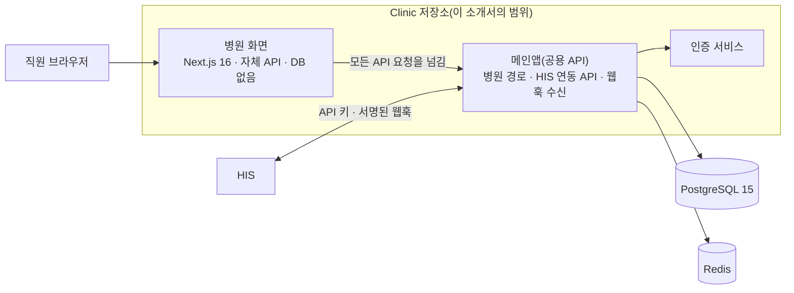
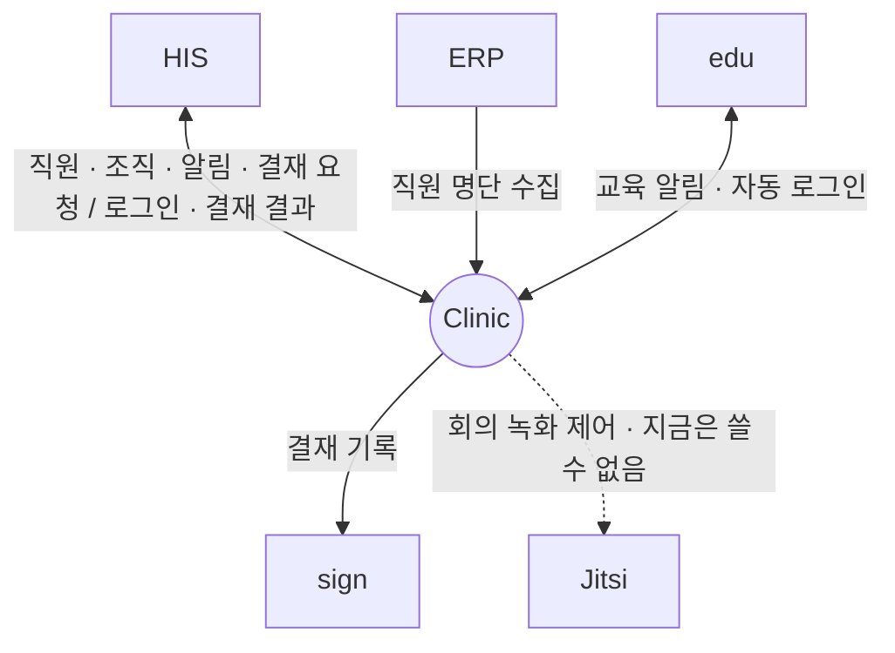

# Clinic — 병원 그룹웨어

**Clinic — the hospital groupware**

> 프로젝트 소개서 · 읽는 사람: **의료 전산담당자** · 기준: Clinic 저장소의 **현재 개발본**(2026-09-29 · 끝의 [이 문서의 근거](#이-문서의-근거)) · [소개서 목록](README.md)

> 이 소개서는 저장소 안의 **병원 서비스**와, 그 서비스가 HIS 와 주고받는 데 필요한 **HIS 연동 API** 만 다룹니다. 같은 저장소에 든 병원과 무관한 서비스(커뮤니티 · 기업용 협업 · 블로그 등)는 이 생태계의 범위가 아닙니다. 다만 **설명하는 범위와 설치하는 범위는 다릅니다** — 설치할 때는 공용 메인앱 · 인증 서비스 · DB · 캐시가 함께 필요합니다(4절).

---

## Introduction (English)

Clinic is the groupware of the ecosystem — the place where hospital staff hand over shifts, see duty rosters, watch ward status, follow medication schedules and the surgery board, and receive urgent alerts. It shows data that HIS sends, and it also receives approval requests that HIS forwards (for example, approvals that start in ERP), returning the result to HIS.

Clinic lives in a repository that holds several other, non-hospital services. This introduction covers only the hospital service and the HIS integration API it relies on. That scope matters for installation: the hospital screens have no API or database of their own — every request is passed to the repository's shared main application, which also holds the HIS integration routes and the webhook receivers. So the hospital service cannot be installed on its own; the main application, its authentication service and its database and cache come with it.

HIS connects to Clinic with an API key that a Clinic hospital administrator issues, limited to named scopes. This differs from most systems in the ecosystem, which verify an HIS token by public key; here the key has to be issued, stored and rotated as its own task. Clinic signs the webhooks it sends back to HIS. In the other direction, the hospital screens fetch ward and floor data from HIS through the main application, which needs its own HIS address and key.

Clinic comes in two forms: a hosted sign-up service run by its operator, and an installed form on the hospital's own server. It does not use AI in this version.

Clinic was **not installed** during the September 2026 follow-along, so none of its links has been called for real. Every connection below is built in code and not yet verified end to end, or not built yet. Details are in [What to know](#8-알아-둘-것).

---

## 1. 한 문장

> **EN** — Clinic is the hospital groupware where staff hand over shifts, see rosters and ward status, and receive alerts and approval requests, drawing on data from HIS.

**Clinic 은 직원이 인수인계 · 근무표 · 병동 현황 · 알림 · 결재를 한곳에서 보는 병원 그룹웨어이고, HIS 의 자료를 받아 보여 줍니다.**

병원 정보 체계에서 Clinic 은 **협업의 창**입니다. 환자 · 오더 · 병상 같은 진료 정보의 원본은 HIS 에 있고, Clinic 은 그것을 직원이 함께 보는 화면으로 묶습니다. 직원 · 조직 정보도 HIS 에서 받아 옵니다 — 직원 명부의 원본은 HIS 이고, Clinic 의 직원 목록은 그것을 옮겨 온 사본입니다.

## 2. 병원 업무의 어디에 쓰이나

> **EN** — Nurses use it for handover and medication schedules, doctors for schedules and the surgery board, ward managers for ward status, rosters and shift swaps, and the hospital administrator for registering the hospital and issuing the HIS API key. Dashboards differ for doctors, nurses and administrators.

대시보드는 **의사 · 간호 · 관리자**마다 다릅니다.

| 누가 | 무엇을 하나(예) |
|---|---|
| 간호사 | 병동을 골라 인수인계 기록 · 인수자 지정 · 「수신 확인」 · 투약 일정과 완료 표시 |
| 의사 | 근무 캘린더 · 당직표 · 수술판 상태 |
| 병동 관리자 | 층별 병동 현황(혼잡도 · 대기 · 정원 · 의료진 부재) · 근무표 · 교대 요청 |
| 병원 관리자 | 병원 등록 · 병원 코드(Clinic 이 병원마다 매기는 코드) 가입 관리 · HIS 연동 API 키 발급 · 설정 |

**장면으로 보면**

- **교대 인수인계** — 저녁 근무 간호사가 병동을 고르고 특이사항을 적은 뒤 인수자를 지정합니다. 밤 근무 간호사가 들어와 기록을 읽고 「수신 확인」을 누릅니다. 이력이 병동별로 남습니다.
- **병동이 붐빌 때** — 병동 현황 화면이 주기적으로 갱신되며, 대기 초과 · 정원 초과 · 의료진 부재가 생기면 브라우저 알림을 띄웁니다. 혼잡도 등급은 HIS 가 판정한 값을 그대로 씁니다.
- **결재 한 건** — ERP 에서 올라온 결재 요청을 HIS 가 Clinic 으로 넘깁니다. 결재권자가 Clinic 에서 승인하면 결과가 HIS 로 돌아가고, HIS 가 ERP 에 전합니다.

## 3. 할 수 있는 일

> **EN** — Nine groups: role dashboards, ward status and floor layouts, duty rosters and shift swaps, handover, medication and surgery board, alerts, hospital sign-up and accounts, the HIS integration API, and a "demo data" badge shown whenever a screen had to fall back to sample data.

| 묶음 | 무엇이 들어 있나 |
|---|---|
| **대시보드** | 의사 · 간호 · 관리자 역할별 |
| **병동 · 동선** | 층별 병동 현황 · 대기 초과 · 정원 초과 · 의료진 부재 알림 · 층 배치 편집기(서버에 저장해 기기 사이에 공유) |
| **근무** | 근무 캘린더(월 · 주 · 일 · 시간 지정 일정 · 부서별 참석자) · 당직표 · 교대 요청 |
| **인수인계** | 병동 선택 · 특이사항 기록 · 이력 · 인수자 지정 · 수신 확인 |
| **투약 · 수술** | 투약 일정과 완료 표시 · 수술판 상태 — 직원이 바꾼 상태는 Clinic 쪽에도 저장돼 다시 들어와도 유지됩니다 |
| **알림** | 긴급 알림 · 알림함 · 브라우저 알림(종류별 끄기 · 같은 알림 반복 억제) |
| **병원 가입 · 계정** | 단계별 병원 등록 화면(사용할 기능 선택) · 병원 코드로 합류(승인제는 선택) · 로그인한 병원 기억 |
| **HIS 연동 API** | HIS 가 부르는 API — 조직 · 직원 동기화 · 알림 · 긴급 알림 · 웹훅 등록 · 로그인 연계 · 근무 · 당직 · 근태 · 휴가 · 수술 일정 · 체크리스트 · 결재 요청 · HIS 역할과 Clinic 역할의 짝 맞추기 |
| **출처 표시** | HIS 에서 자료를 받지 못한 화면은 예시 데이터로 채우고 **「데모」 배지**를 붙입니다 |

**로그인은 두 길입니다.**

- **Clinic 에 바로** — 병원 코드를 먼저 확인한 뒤, 같은 저장소의 다른 서비스와 함께 쓰는 통합 계정(이메일 · 아이디 또는 외부 계정)으로 들어갑니다.
- **HIS 에서 넘어오기** — HIS 가 Clinic 에 1회용 로그인 표를 받아, 직원이 다시 로그인하지 않고 Clinic 으로 넘어옵니다. 다만 HIS 에서 특정 결재 문서를 바로 여는 길은 아직 없습니다.

### 화면으로 보기

> **EN** — No captures yet: Clinic was not installed during the follow-along.

캡처 없음 — 2026년 9월 따라가기에서 Clinic 을 설치하지 않았습니다. 캡처 자리(인수인계 · 근무표 · 결재 · 알림)는 [Clinic 화면](../screens/clinic.md)에 있습니다.

## 4. 어떻게 만들어졌나

> **EN** — The hospital service is a Next.js 16 / React 19 front end with no API or database of its own; it forwards every API and upload request to the repository's main application (Next.js 16 with Prisma 7), which holds the hospital routes, the HIS integration API and the webhook receivers. Authentication is a separate service. Data lives in PostgreSQL 15 (a pgvector image) and Redis. Of the repository's 12 processes and 3 containers, the hospital service uses the main application, the hospital screens and the authentication service plus the database and cache.

| 구성 요소 | 무엇 | 기술 |
|---|---|---|
| **병원 화면** | 대시보드 · 병동 · 근무 · 인수인계 · 투약 · 수술판 · 알림 · 가입 화면. API 와 업로드 요청을 메인앱으로 넘깁니다 | Next.js 16 · React 19 |
| **메인앱(공용 API)** | 병원 경로 · **HIS 연동 API**(HIS 가 부를 수 있는 주소 44개) · 웹훅 수신 창구 · 병동 자료를 HIS 에 물어 오는 중계 — 저장소의 다른 서비스와 함께 씁니다 | Next.js 16 · Prisma 7 |
| **인증 서비스** | 통합 계정 로그인 | 별도 프로세스 |

**데이터가 사는 곳**

| 저장소 | 무엇이 들어 있나 |
|---|---|
| **PostgreSQL 15**(저장소 전체가 쓰는, 벡터 검색 확장이 든 이미지) | 병원 · 직원 · 알림 · 결재 · HIS 연동 키 등 메인앱 데이터 전부. 병원 서비스가 따로 저장하는 상태(투약 완료 · 수술판 · 알림 확인 · 교대 요청 · 인수인계)는 저장소의 SQL 스크립트로 테이블을 추가합니다 |
| **Redis** | 캐시 |

**무엇을 몇 개 띄우나** — 저장소 구성 파일에는 컨테이너 3개와 프로세스 12개가 있습니다. 병원 서비스에 쓰는 것은 아래와 같습니다.

| 쓰는 곳 | 띄우는 것 |
|---|---|
| HIS 연동만 | 메인앱 프로세스 1 · DB · 캐시 컨테이너 2 |
| 병원 화면까지 | 위에 더해 병원 화면 · 인증 서비스 프로세스 2 |
| 나머지 | 프로세스 9개(블로그 · 기업 · 오피스 · 바이브 · 로그 대시보드 · 채널 · 공동 편집 · 예약 작업 · 실시간 소켓)와 모바일 웹 컨테이너 |

나머지는 병원 화면 코드와 HIS 연동 경로 · 예약 작업에서 부르는 곳을 찾지 못했습니다. 메인앱 안의 다른 기능이 이들을 쓰는지는 끝까지 보지 않아, 빼도 된다고 단정하지는 않습니다. 서버 사양은 계측하지 않았습니다.

## 5. 다른 시스템과의 연결

> **EN** — HIS sends staff, organisation, alerts and approval requests to Clinic with a scoped API key; Clinic sends staff sign-in tickets, approval results and events back to HIS as signed webhooks; and the hospital screens fetch ward data from HIS through the main application. ERP reads the Clinic staff list, edu sends training alerts through Clinic, and Clinic records approval events with sign. None of these links has been called for real — Clinic was not installed.

**Clinic 과 HIS 는 양방향으로 이어집니다.** HIS 는 Clinic 이 발급한 API 키로 부르고, Clinic 은 서명한 통지로 HIS 에 결과를 알립니다. 병원 화면의 병동 · 동선 자료는 반대로 메인앱이 HIS 에 그때그때 물어 가져옵니다.

| 상대 | Clinic 이 주는 것 | Clinic 이 받는 것 | 로그인 · 인증 방식 | 실제로 연결해 확인했나 |
|---|---|---|---|---|
| **HIS** | 직원 로그인(1회용 토큰) · 결재 결과 · 일반 이벤트(연차 승인 등) · 병원 등록 통지 | 직원 일괄 등록 · 조직도 · 알림 · 채널 메시지 · 캘린더 · 근태 · 휴가 · 결재 요청 | Clinic 이 발급한 **범위 지정 API 키** · 서명된 웹훅 | 만들어져 있음 · 실제 연결 확인은 아직 · HIS 에서 재로그인 없이 결재 문서를 여는 경로는 아직 없음 |
| **ERP** | 직원 명단(HIS 에서 옮겨 온 사본) | — | API 키 | 명단 수집은 만들어져 있음 · 확인은 아직 · 근태 수집은 아직 없음 |
| **edu** | 자동 로그인 연결 | 교육 알림 | 키 · 토큰 | 만들어져 있음 · 확인은 아직 |
| **sign** | 결재 이벤트 기록 · 검증 요청 | — | sign 이 발급한 키 | 만들어져 있음 · 확인은 아직 |
| **Jitsi** | 회의 녹화 제어 | — | — | 지금은 쓸 수 없음(화상 서버를 새로 구성해야 함) |

- 병원 화면이 HIS 에서 병동 · 동선 · 근무 자료를 받아 오는 경로는 메인앱이 HIS 로 요청을 넘기는 방식입니다. 이 구간이 HIS 쪽에서 어떻게 받아지는지는 **배포 구성(주소 · 앞단 프록시)에 따라 달라져** 코드만으로 판정하지 못했습니다.
- ERP 결재는 HIS 를 거쳐 Clinic 에서 승인됩니다. Clinic 이 멈췄을 때 다른 결재 길이 있는지는 확인하지 못했습니다.
- 연결마다의 자세한 내용은 [HIS → Clinic](../integration/cards/his-to-clinic.md) · [Clinic → HIS](../integration/cards/clinic-to-his.md) 카드와 [연결 상태 표](../RELEASES/2026.09/compatibility.md)에 있습니다.

## 6. 설치 · 운영

> **EN** — Two supply forms: a hosted sign-up service, or an installed form on the hospital's server. The installed form brings up the main application, its authentication service, PostgreSQL 15 and Redis alongside the hospital screens; no GPU is needed. HIS is prepared with the Clinic address and API key as environment variables and a webhook secret; the main application in turn needs the HIS address and an HIS key, without which screens fall back to sample data. No backup or health-check tooling specific to the hospital service was found.

### 공급 형태

| 형태 | 무엇 |
|---|---|
| **가입형 호스팅** | 운영사 서버에 병원을 등록해 바로 씁니다. 병원 등록은 3단계이고 운영사 검토 뒤 승인됩니다. HIS 가 없으면 예시 데이터로 화면을 먼저 볼 수 있습니다. 자료가 저장되는 위치와 계약 조건은 이 자료에서 다루지 않으니 운영사와 확인합니다 |
| **설치형** | 병원 서버에 세웁니다(온프레미스는 별도 협의). 병원 화면만이 아니라 메인앱 · 인증 서비스 · DB · 캐시까지 함께 세웁니다 |

### 필요한 것(설치형)

| 항목 | 내용 |
|---|---|
| 서버 | Node.js · PostgreSQL 15 · Redis. **GPU 는 필요 없습니다** |
| 먼저 있어야 할 것 | 화면만 볼 때는 없습니다. HIS 자료를 보려면 **HIS** 가 있어야 합니다 |
| 빌드할 때 | 봇 방지(Turnstile) 사이트 키 |
| 꼭 넣어야 하는 설정 | 병원 화면이 요청을 넘길 **메인앱 주소**와 공개 주소 · 메인앱이 병동 자료를 물을 **HIS 주소와 HIS 쪽 키**. 키가 비어 있으면 화면이 예시 데이터로 채워집니다. HIS 쪽 키를 어디서 발급하는지는 확인하지 못했습니다 |
| 주소 기본값 | 코드와 설정 예시에 특정 설치본의 주소가 기본값으로 들어 있는 곳이 있습니다. 병원 화면의 메인앱 주소 · 공개 주소, 메인앱의 HIS 주소, 인증 서비스의 허용 주소를 모두 자기 기관 값으로 바꿉니다([바꿀 곳 목록](../build-guide/replace-list.md)) |
| DB 변경 | 병원 서비스의 상태 저장 테이블은 저장소의 SQL 스크립트로 추가합니다. 업그레이드할 때 적용 순서를 확인합니다 |

### HIS 쪽 준비

1. Clinic 병원 관리자가 **범위를 지정한 API 키**를 발급합니다(필요한 범위만 고름 · 활성 키는 5개까지 · 허용 IP 목록을 둘 수 있음).
2. HIS API 의 환경 변수에 Clinic 주소 · API 키 · Clinic 의 병원 코드를 넣습니다. 주소를 비워 두면 HIS 쪽 Clinic 연동 전체가 꺼집니다.
3. Clinic 이 HIS 로 보내는 웹훅을 검증할 **서명 비밀값**을 HIS 에 반드시 설정합니다.
4. HIS **직원 관리** 화면의 Clinic 동기화로 조직 · 직원을 보냅니다.

### 운영

- **버전 고정** — 병원 서비스 전용 태그가 없습니다. 설치본은 커밋 해시로 고정하고, 업그레이드 때 메인앱 쪽(HIS 연동 API · 인증 · 알림) 변경을 따로 확인합니다. 메인앱은 병원 밖 서비스와 함께 바뀌므로, 그 부담을 줄이는 방법은 저장소에 없습니다.
- **설정 탭** — 화면 갱신 주기(3초 미만이면 기본값으로 바뀜) · 알림 종류별 사용.
- **백업 · 감시** — 병원 서비스에 해당하는 백업 · 상태 확인 도구는 저장소에서 찾지 못했습니다. 메인앱 DB 를 기관이 백업합니다. HIS 연동 API 에는 상태 확인 경로가 있습니다.

자세한 순서: [구축 가이드 S5](../build-guide/S5-management.md#clinic) · 설정 키 전체: [Clinic 구성서 §6](../systems/clinic.md#6-주요-설정).

## 7. 이렇게 만든 이유

> **EN** — Four choices: the hospital screens reuse the shared main application instead of carrying their own API; screens that fall back to sample data say so with a badge; ward congestion grades come from HIS rather than being recalculated in the browser; and HIS access is by a key limited to named scopes.

| 설계 | 왜 |
|---|---|
| **병원 화면은 자체 API 없이 메인앱을 씀** — 기업용 화면과 같은 방식 | 결재 · 채널 · 캘린더 · 위키 · 근태처럼 이미 있는 그룹웨어 기능을 병원에서 그대로 쓰고, 화면만 따로 빌드 · 배포하려고 |
| **예시 데이터에는 「데모」 배지** | HIS 연결이 끊겨 화면이 예시로 채워졌을 때, 직원이 그것을 실제 병동 상황으로 믿지 않게 |
| **혼잡도 등급은 HIS 판정값 그대로** | 브라우저에서 다시 판정하면 HIS 의 판정을 무력화할 수 있어서입니다(저장소 릴리즈 기록) |
| **HIS 용 키는 범위를 지정해 발급** — 범위를 하나도 고르지 않으면 발급하지 않음 | HIS 가 필요한 기능만 부르게 하고, 키마다 무엇을 할 수 있는지 관리자가 알 수 있게 |

같은 알림을 반복해 띄우지 않고 해소되면 다시 알림 대상으로 돌립니다(저장소 기록은 이유를 적지 않았습니다).

## 8. 알아 둘 것

> **EN** — Clinic was not installed in the follow-along, so no link has been verified; the hospital service cannot be installed apart from the shared main application; screens silently fill with sample data (badged) when HIS data does not arrive; congestion thresholds are stored but not yet used; joining by hospital code needs no approval by default; and there is no service-specific version tag.

- 🔴 **실제로 불러 본 연결이 하나도 없습니다** — 2026년 9월 따라가기에서 설치하지 않았습니다. 연결은 모두 코드를 읽어 판정한 것입니다. 쓰는 연결마다 리허설에서 직접 불러 확인합니다.
- 🔴 **병원 서비스만 떼어 세울 수 없습니다** — 메인앱 · 인증 서비스 · DB · 캐시가 함께 필요하고, 메인앱은 병원 밖 서비스와 함께 바뀝니다. 그 변경 이력은 이 자료 범위 밖입니다.
- **HIS 자료가 없으면 예시 데이터로 채웁니다** — 화면을 미리 보는 데는 쓸모가 있지만, 운영에서는 착각의 원인이 됩니다. 이 동작을 끄는 설정은 찾지 못했습니다. 「데모」 배지가 보이면 HIS 연결부터 점검합니다.
- **혼잡도 임계값은 설정에 저장되지만 아직 판정에 쓰이지 않습니다** — 등급은 HIS 판정값을 씁니다(7절). 설정 자리만 먼저 둔 이유는 저장소에 적혀 있지 않습니다.
- **병원 코드로 합류할 때 기본은 승인 없이 들어옵니다** — 승인제는 병원을 등록할 때 켜 둡니다.
- **이 버전은 AI 를 쓰지 않습니다** — 첫 화면의 AI 지식 기능은 「준비 중」입니다.

전체 한계와 대체 수단: [Clinic 구성서 §10](../systems/clinic.md#10-한계와-대체-수단).

## 9. 통합 릴리즈 `2026.09` 이후 달라진 점

> **EN** — The current development line is the same commit as the integrated release `2026.09` — nothing has changed.

기준 커밋과 같습니다 — 달라진 점 없음.

## 10. 더 깊이

> **EN** — Where to go next.

| 알고 싶은 것 | 문서 |
|---|---|
| 구성 · 설정 키 · 연동 · 한계 전체 | [Clinic 구성서](../systems/clinic.md) |
| 설치 · 설정 순서 | [구축 가이드 S5](../build-guide/S5-management.md) |
| 이 버전의 변경 내용 | [릴리즈 요약](../RELEASES/2026.09/systems/clinic.md) |
| 화면 | [Clinic 화면](../screens/clinic.md) |
| 연결 하나를 자세히 | [연결 카드](../integration/cards/) · [공통 규약](../integration/contracts.md) |
| 소스 | [소스 받기](../SOURCES.md) — 저장소 `weruby-co-kr/WeRUB` |

---

## 이 문서의 근거

> **EN** — What this introduction was written from.

| 항목 | 값 |
|---|---|
| 읽은 것 | Clinic 저장소의 **현재 개발본** — 커밋 `2b20a89b7c3a`(저장소 전체의 마지막 커밋 2026-09-09) · 병원 서비스 버전 `1.4.0`(마지막 변경 2026-08-19) · HIS 연동 API 마지막 변경 2026-08-20 · 2026-09-29 에 읽음 · 작업 트리의 미커밋 변경은 읽지 않음 |
| 범위 | 병원 서비스 패키지 · HIS 연동 API 경로 · 구성 파일 · 병원 서비스 릴리즈 기록 7건 — 병원 밖 서비스는 읽지 않음 |
| 비교 기준 | 통합 릴리즈 `2026.09` — 커밋 `2b20a89b7c3a`(같은 커밋) |
| 센 방법 | HIS 연동 API 경로 = 연동 경로 폴더의 경로 파일 수(1파일 = 1경로) · 프로세스 · 컨테이너 = 구성 파일의 항목 수 · 필요한 프로세스 = 병원 화면 코드 · HIS 연동 경로 · 예약 작업 코드를 읽어 판정 |
| 실제 연결 확인 | 없음 — 2026-09 따라가기에서 설치하지 않음. 공급 형태와 로그인 흐름은 운영사의 공개 소개 페이지(로그인 전 화면)를 읽어 확인(2026-09-15) — 연결을 불러 본 것은 아님 |
| 사실 확인 | Clinic 담당의 확인 전 · 생태계 자료 측이 저장소를 읽고 쓴 것 |
