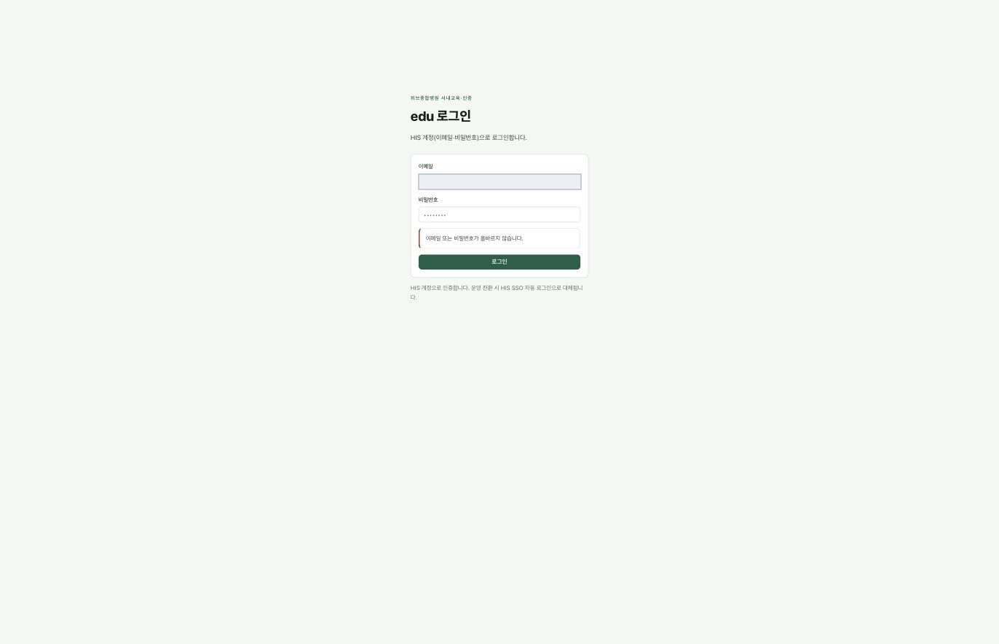
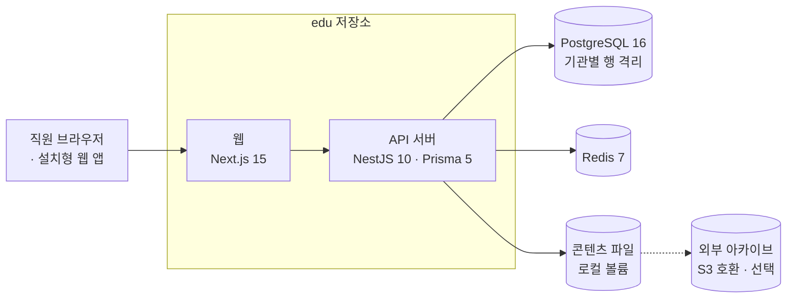
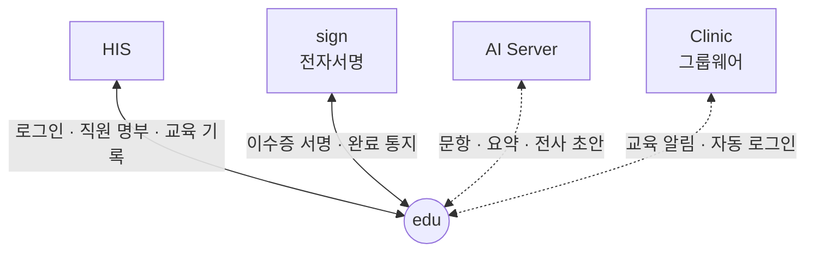

# edu — 직원 교육 · 법정교육 · 전자 이수증

**edu — staff e-learning, statutory training and electronic completion certificates**

> 프로젝트 소개서 · 읽는 사람: **의료 전산담당자** · 기준: edu 저장소의 **현재 개발본**(2026-09-29 에 읽음 · 마지막 변경 2026-07-30 · 끝의 [이 문서의 근거](#이-문서의-근거)) · [소개서 목록](README.md)

---

## Introduction (English)

edu is the staff training system of the ecosystem. It delivers online courses and classroom sessions to hospital staff, keeps track of who must complete which statutory training by when, and turns a completion into two lasting records: an education entry in the HIS staff record, and an electronically signed completion certificate issued through sign.

edu deliberately does not duplicate what HIS already holds. Staff sign in with their HIS identity, the staff roster comes from HIS, and completions are written back to HIS. edu adds only what HIS does not have: the learning layer (courses, videos, SCORM packages, exams, surveys, classroom attendance by QR code) and the orchestration from "completed" to "recorded" to "certificate issued". A training matrix assigns required courses every night by job, role and staff attribute, and reminders and escalations follow automatically.

Technically it is a TypeScript monorepo: an API server (NestJS with Prisma on PostgreSQL 16, Redis 7) and a staff web application (Next.js 15, installable as a PWA). The code supports one institution alone or several institutions in one deployment; a hospital would normally install it for itself alone. With several institutions every table is isolated twice — in the query layer and by PostgreSQL row-level security — and a nightly job checks that no record points across institutions.

AI only assists: it drafts exam questions, content summaries and transcripts of recorded classroom sessions, and a person must approve every draft before learners see it. edu needs HIS to be running first — every sign-in uses an HIS account. In September 2026 its sign-in from the HIS screen, public-key lookup, roster and completion-record links with HIS, and its certificate links with sign, were tested with real calls between freshly built test installs holding made-up data.

What to know up front is collected in [What to know](#8-알아-둘-것): edu cannot run without HIS, uploaded course files and certificates are kept only on local disk by default and the repository has no backup script, and whether any institution is using it in production has not been re-checked.

---

## 1. 한 문장

> **EN** — edu delivers staff training and statutory courses, and turns each completion into an HIS education record and a signed completion certificate. At a glance: usable once HIS is running, with sign needed for certificates; four containers plus a content volume; the code to take is the same as the integrated release, installed as a single-hospital deployment in the order of section 6; sign-in from HIS, the roster, completion records and certificates were verified between test installs with made-up data in September 2026.

**edu 는 직원에게 교육을 전하고, 이수 하나를 HIS 의 교육 기록과 전자서명된 이수증으로 남기는 시스템입니다.**

### 한눈에 — 도입 판단

| | |
|---|---|
| **지금 쓸 수 있나** | 조건부 — **HIS 가 먼저 돌고 있어야** 씁니다. 이수증까지 내려면 sign 도 있어야 합니다 |
| **세워야 하는 것** | 컨테이너 4개 — API · 웹 · PostgreSQL 16 · Redis 7. 동영상 · 이수증을 담는 콘텐츠 볼륨과 그 백업. GPU 는 필요 없습니다 |
| **먼저 있어야 할 것** | HIS — edu 주소 설정 · 서명 비밀값 공유. sign — 이수증에 서명할 자격(등록자 인증서) · https 로 edu 에 닿는 길. 기관이 정할 교육 담당과 콘텐츠 검수 책임자 |
| **받을 코드** | 통합 릴리즈 코드와 같은 현재 개발본입니다([소스 받기](../SOURCES.md)). 병원 하나에 세우는 **단독 배포**이며, 저장소 설치 안내에 빠진 단계가 있어 6절 순서를 따릅니다 |
| **실제로 확인된 것** | 2026년 9월 시험 설치에서 가상 데이터로 — HIS 사내교육 단추 로그인 · 공개키 · 직원 명부 · 이수 기록, sign 이수증 서명과 완료 통지. 운영 병원이 아니고, edu 로그인 화면 경로 · 직원 이벤트 · Clinic 은 확인 전이며 AI 는 문항 생성만 불러 봤습니다 |
| **아직 모르는 것** | 동시에 몇 명이 배울 수 있나 · 동영상 저장 용량 · 복구 절차와 걸리는 시간 · sign 없이 쓰는 구성 · 실제 기관의 운영 여부 |

병원 정보 체계에서 edu 는 **학습을 전하는 자리**입니다. 직원이 누구인지(명부)와 무엇을 이수했는지(교육 기록)의 원본은 HIS 에 있습니다. edu 는 HIS 에 없는 것 — 과정 · 시험 · 집체교육 · 배정 규칙 — 을 맡고, 결과를 HIS 와 sign 에 넘깁니다.

## 2. 병원 업무의 어디에 쓰이나

> **EN** — Every staff member uses edu as a learner. Training coordinators build curricula and courses, content reviewers approve material before it is shown, department managers see their own staff's gaps, classroom facilitators run sessions, and auditors read the audit trail. An HIS administrator has full rights in edu.

직원 모두가 학습자로 씁니다. 학습자는 따로 역할을 주지 않아도 됩니다. 운영 쪽 역할 5개(교육 담당 · 검수자 · 부서장 · 진행자 · 감사)는 edu 가 HIS 역할 위에 따로 줍니다. HIS 관리자는 처음부터 모든 권한을 가지므로, 설치 뒤 첫 관리자가 됩니다.

| 누가 | 무엇을 하나(예) |
|---|---|
| 직원(학습자) | 내 필수교육 확인 · 온라인 학습 · 시험 · 집체교육 출석 · 이수증 보기 |
| 교육 담당 | 법정교육 · 커리큘럼 · 필수교육 매트릭스 · 과정 관리 · 이수 명부 · 대시보드 |
| 콘텐츠 검수자 | 교육 자료와 AI 초안을 검수해 승인 — 승인 전에는 학습자에게 보이지 않음 |
| 부서장 | 자기 부서 직원의 이수 현황과 미이수자 확인 |
| 집체교육 진행자 | 강의 시작 · 종료 기록 · 출석 확인 · 종료 보고 |
| 감사 담당 | 감사 기록 열람과 무결성 검증 |
| HIS 관리자 | edu 의 모든 기능(상위 권한) |

**장면으로 보면**

- **신규 간호사 입사** — 원무 · 인사 쪽이 HIS 에 직원을 등록합니다. edu 는 HIS 직원 명부를 밤마다 다시 읽고(직원 이벤트도 받습니다), 직종 · 역할에 맞는 온보딩 과정과 법정교육을 필수교육 매트릭스로 자동 배정합니다. 간호사는 HIS 화면의 **사내교육** 단추로 edu 에 들어가 배정된 과정을 봅니다.
- **이수 한 건** — 간호사가 동영상을 끝까지 보고 시험을 통과하면, edu 가 HIS 의 직원 교육 기록에 이수를 남기고 sign 에 이수증 서명을 요청합니다. 서명이 끝나면 이수증에 QR 이 붙어 누구나 진위를 확인할 수 있습니다.
- **집체교육** — 교육 담당이 일정을 만들고 진행자를 지정합니다. 강의실에서 직원이 QR 을 찍으면 출석이 곧 이수가 됩니다. 녹화본은 AI 가 전사 · 요약 **초안**을 만들고, 검수자가 확인한 뒤 자막이 붙은 온라인 과정으로 올립니다.

## 3. 할 수 있는 일

> **EN** — Eight groups of features: training structure (statutory masters, curricula, a nightly assignment matrix), courses and content (video, files, SCORM 1.2, exams, surveys, a review gate), external content providers (including xAPI), learning and completion (HIS sign-in, classroom sessions with QR attendance, a PWA), electronic certificates via sign, reminders and escalation, administration and audit, and single- or multi-institution deployment.

| 묶음 | 무엇이 들어 있나 |
|---|---|
| **교육 체계** | 법정의무교육 마스터(근거 법령 · 주기 · 시수 · 제재) 직종 · 역할 · 속성별 커리큘럼 · 필수교육 매트릭스의 매일 자동 배정 개인 예외(추가 · 면제 · 유예) · 유효기간 만료 시 재이수 배정 의료기관 인증평가 대비 이수 추적과 부족분 분석 · 온보딩 과정 |
| **과정 · 콘텐츠** | 차시 · 동영상(진도 추적) · 파일 · SCORM 1.2(국제 이러닝 패키지 표준) · 시험 자동 채점 · 재응시 제한 · 만족도 설문. 콘텐츠는 **검수 게이트**(초안 → 승인)를 거쳐야 학습자에게 보입니다 |
| **외부 콘텐츠** | 외부 제공업체와 링크 · 수료증 · SCORM · 로그인 연계로 이어 붙이고 정산 리포트를 냅니다. 외부 업체가 학습 기록을 표준 형식(xAPI 1.0.3)으로 보내면 받습니다 |
| **학습 · 이수** | HIS 계정으로 로그인(아래) · 과정 신청 · 집체교육(일정 · QR 출석 · 진행 화면) · 실제 학습 시간만 쌓는 최소 학습시간 검증 · 설치형 웹 앱(PWA — 휴대전화에 앱처럼 설치 · 오프라인 · QR 스캐너) |
| **전자 이수증** | sign 이 전자서명 · 타임스탬프로 발급 · QR 진위 확인 · 폐기 · 재발급. edu 는 기관마다 sign 에서 받은 **등록자 인증서**(이수증에 서명할 자격)로 요청합니다 |
| **알림 · 자동화** | 마감 리마인드 · 기한 초과 시 윗선에 알림 · 미이수자의 부서장에게 하루 한 번 요약 · 이메일 · 문자 · 그룹웨어(Clinic) 채널 — 채널을 설정했을 때만 실제로 보내고, 아니면 모의 발송입니다. **운영 중에도 채널 값이 비어 있으면 알림이 나가지 않으므로**, 개시 전에 연결 점검 단추로 확인합니다 |
| **관리 · 감사** | 대시보드(준수율 · 인증 커버리지 · 부족분) · 이수 명부 · 연간 이수 체크리스트(CSV) · 역할 세분화 · 해시체인 감사 로그와 검증 · 퇴직자 연락처 익명화 |
| **배포 형태** | 기관 하나만 쓰는 **단독 배포**, 또는 한 배포에서 여러 기관을 나눠 쓰는 **멀티테넌트** — 코드는 둘 다 지원합니다. **병원이 자기 서버에 세울 때는 단독 배포**이고, 설치는 6절 「병원 하나에 세울 때」만 보면 됩니다 |

**로그인은 두 길이고, 둘 다 HIS 계정입니다.** HIS 화면의 **사내교육** 단추로 바로 들어가거나, edu 로그인 화면에 HIS 이메일 · 비밀번호를 넣습니다. edu 만의 계정은 없습니다. 2026년 9월 시험 설치에서 실제로 확인한 것은 **사내교육 단추 길**이고, edu 로그인 화면 길은 아직 확인 전입니다(5절).

기관 정보와 연동 설정(HIS · sign · AI · 메일 · 그룹웨어)은 **관리 화면의 시스템 설정**에서 바꿉니다. 저장한 값은 최대 1분 안에 반영됩니다. 화면은 각 값이 어디서 왔는지(관리 설정 · 환경 변수 · 기본값)를 보여 주고, 연동마다 **연결 점검** 단추가 있습니다.

### 화면으로 보기

> **EN** — Only the sign-in screen has been captured so far; it states plainly that edu signs staff in with their HIS account.

**로그인** — edu 로그인 화면입니다. 여기에도 HIS 계정(이메일 · 비밀번호)을 넣는다고 적혀 있습니다.

과정 · 법정교육 현황 · 이수증 화면은 아직 찍지 않았습니다. 캡처 자리는 [edu 화면](../screens/edu.md)에 있습니다.

## 4. 어떻게 만들어졌나

> **EN** — A TypeScript monorepo (Turborepo): a NestJS 10 API with Prisma 5 on PostgreSQL 16 and Redis 7, and a Next.js 15 web app that holds sessions on the server. Every outgoing write (to HIS, sign, notification channels) goes through an outbox table with idempotency keys and retries. Course files live on a local volume; an S3-compatible archive can be switched on, with the local disk kept as a cache.

| 구성 요소 | 무엇 | 기술 |
|---|---|---|
| **API 서버** | 교육 체계 · 배정 · 이수 · 이수증 요청 · 알림 · 설정 · 연동 · 예약 작업 | Node 20(컨테이너) · NestJS 10 · Prisma 5 |
| **웹** | 학습자 화면 · 집체교육 · 관리 화면 · 플랫폼 콘솔(멀티테넌트) | Next.js 15 · 서버 세션 |
| **연동 대기열(outbox)** | HIS · sign · 알림 채널로 나가는 쓰기를 모두 이곳에 쌓고, 같은 요청이 두 번 반영되지 않게 **멱등키**(같은 요청이 여러 번 와도 한 번만 처리되게 하는 식별값)를 붙여 다시 시도합니다 | API 서버 안 |
| **예약 작업** | 매일 새벽 배정 · 리마인드 · 에스컬레이션 · 재이수 · 개인정보 파기 · 기관 간 정합 점검, 10분마다 알림 발송 | API 서버 안 |

**데이터가 사는 곳**

| 저장소 | 무엇이 들어 있나 |
|---|---|
| **PostgreSQL 16** | 과정 · 배정 · 이수 · 시험 · 이수증 · 설정 · 감사 로그 · 연동 대기열 — 데이터 모델 40개(기준 커밋 계측) |
| **Redis 7** | 캐시 |
| **콘텐츠 파일(로컬 볼륨)** | 동영상 · 파일 · SCORM 패키지 · 이수증 · 자막. 외부 아카이브를 켜면 원본은 아카이브에 두고 로컬은 캐시로 씁니다(작은 파일과 이수증은 로컬에도 상주) |

- **기관 격리 두 겹** — 멀티테넌트에서는 모든 쿼리에 기관 식별값이 자동으로 붙습니다(1선). 그다음 데이터베이스의 행 수준 보안(RLS)이 한 번 더 거릅니다(2선). 매일 한 번 기관 사이에 잘못 이어진 행이 없는지 점검하고, 있으면 오류 로그를 남깁니다.
- **로컬 캐시 삭제는 기본 꺼짐** — 아카이브에 사본이 없는 파일은 지우지 않고, 지우기 직전에 아카이브에 있는지 한 번 더 확인합니다.

## 5. 다른 시스템과의 연결

> **EN** — edu depends on HIS for sign-in, staff roster and education records, and on sign for certificates. AI Server and Clinic are optional. Sign-in from the HIS screen, the HIS public-key lookup, the roster and the completion record, plus certificate sealing and the completion notice with sign, were verified by real calls between test installs in September 2026; the staff-event webhook, sign-in through the edu login form with an HIS password, AI and Clinic links are built but not yet verified end to end.

**edu 는 HIS 가 먼저 있어야 하고, sign 이 있어야 이수증이 나옵니다.** 이수 기록 자체는 HIS 로 가고, sign 은 이수증에만 쓰입니다. sign 없이 이수 기록만 쓰는 구성은 확인하지 못했습니다. AI Server 와 Clinic 은 선택입니다.

| 상대 | edu 가 주는 것 | edu 가 받는 것 | 로그인 · 인증 방식 | 실제로 연결해 확인했나 |
|---|---|---|---|---|
| **HIS** — 사내교육 단추로 로그인 | — | 직원 로그인 | HIS 가 발급한 직원 토큰을 **HIS 공개키로 검증** | 확인함(2026-09-14 · 가상 데이터) |
| **HIS** — 공개키 · 직원 명부 | — | 공개키 · 직원 명부 | 명부는 HIS 와 공유한 비밀키로 만든 서비스 토큰 | 확인함(2026-09-14 · 명부 56명 = HIS 재직 직원 56명) |
| **HIS** — 이수 기록 | 교육 이수 기록 | — | 서비스 토큰 | 확인함(2026-09-14) |
| **HIS** — 직원 이벤트 | — | 입사 · 변경 · 퇴직 알림 | 서명된 통지 | 만들어져 있음 · 실제 연결 확인은 아직 |
| **HIS** — edu 로그인 화면 | — | 직원 로그인 | HIS 이메일 · 비밀번호로 HIS 에 로그인 | 만들어져 있음 · 실제 연결 확인은 아직 |
| **sign** | 이수증 서명 요청 · 폐기 · 철회 | 서명 완료 통지 | sign 이 연결하는 시스템마다 발급한 키(소비자 키) · 서명된 통지 | 확인함(2026-09-15 · 가상 데이터) |
| **AI Server** | 문항 생성 · 요약 · 번역 · 녹취 분석 요청 | 초안 | 발급된 API 키 | 일부만 — 문항 생성은 불러 봄. 요약 · 번역 · 녹취 분석은 실제 연결 확인은 아직 |
| **Clinic** | 교육 알림(미이수 독촉 등) | 자동 로그인 연결 | Clinic 이 발급한 키 · 토큰 | 만들어져 있음 · 실제 연결 확인은 아직(Clinic 을 설치하지 않음) |
| HIS 인앱 알림 | — | — | — | 아직 없음 — 알림은 메일 · 그룹웨어로 보냅니다 |

「확인함」은 2026년 9월에 새로 세운 시험용 설치본끼리 가상 데이터로 실제로 불러 본 결과입니다([따라가 본 결과](../build-guide/follow-along-2026-09.md)). 운영 병원에서 확인한 것은 아닙니다. 연결마다의 자세한 내용은 [edu → HIS](../integration/cards/edu-to-his.md) · [HIS → edu](../integration/cards/his-to-edu.md) · [edu → sign](../integration/cards/edu-to-sign.md) 카드와 [연결 상태 표](../RELEASES/2026.09/compatibility.md)에 있습니다. HIS 쪽에서 이수 기록이 어떻게 쓰이는지는 [직원 자격 · 교육](../functions/detail/staff-credentials.md)에 있습니다.

## 6. 설치 · 운영

> **EN** — edu runs as four containers (API, web, PostgreSQL 16, Redis 7) and needs no GPU. HIS must be reachable before anyone can sign in, so database passwords, the HIS address and the shared value go into the environment file before first start; the first administrator is an HIS administrator, and everything else is set on the settings screen. A hospital installing it for itself uses the single-institution deployment and follows one table, "installing for one hospital". That order, which worked in the September 2026 test installs, adds two steps the repository's guide leaves out — creating the institution row and applying the app database role with row-level security. There is no backup script in the repository.

### 필요한 것

| 항목 | 내용 |
|---|---|
| 서버 | 컨테이너 4개(API · 웹 · PostgreSQL 16 · Redis 7). **GPU 는 필요 없습니다**(AI 연산은 AI Server 가 합니다). 저장소 안내는 메모리 2GB 이상을 적고 있습니다 |
| 먼저 있어야 할 것 | **HIS**(필수 — 로그인이 HIS 를 거칩니다) · **sign**(이수증) — sign 없이 이수 기록만 쓰는 구성은 확인하지 못했습니다(5절) |
| HIS 쪽 준비 | HIS 설정 `edu.url` 에 edu 주소를 넣어 사내교육 단추를 잇고, HIS 의 서명 비밀값을 edu 와 나눕니다([구축 가이드 S5](../build-guide/S5-management.md)) |
| 네트워크 | 직원 브라우저와 **sign 서버가 같은 https 주소로 edu 에 닿아야** 합니다 — sign 은 https 로만 완료 통지를 보냅니다 |
| 기관이 준비할 데이터 | 기관명 · 공개 주소 · 부서별 교육 담당과 **콘텐츠 검수 책임자** · 기관 고유 정보(온보딩 자료의 자리표시를 채움) |

### 병원 하나에 세울 때 — 이 순서만 따릅니다

병원이 자기 서버에 세우는 경우는 모두 **단독 배포**입니다. 멀티테넌트 · 플랫폼 콘솔에 관한 설명은 건너뛰어도 됩니다. 아래는 2026년 9월 시험 설치에서 실제로 된 순서이고, 저장소의 기관 설치 안내에 빠진 3단계가 들어 있습니다.

| 단계 | 하는 일 |
|---|---|
| 1 | 환경 파일 작성 — DB 비밀번호 두 개(관리용 · 앱 전용)를 새로 만들고, HIS 주소 · HIS 와 공유하는 값을 넣습니다. 앱 전용 비밀번호는 3단계에서 만드는 앱 전용 DB 역할이 씁니다. 로그인이 HIS 를 거치므로 **관리 화면에 들어가기 전에** 넣어야 합니다. 그 밖의 연동 값은 5단계에서 화면으로 넣습니다 |
| 2 | 기동 → 스키마 반영 |
| 3 | **기관 행 만들기 → 앱 전용 DB 역할 · 행 수준 보안 적용** → API 재기동 — 단독 배포여도 필요합니다. 운영용 구성은 API 가 앱 전용 역할로 DB 에 붙고, 시작할 때 기관 목록을 읽기 때문입니다. 저장소의 기관 설치 안내에는 이 단계가 빠져 있습니다 |
| 4 | 기본 콘텐츠 반입(커리큘럼 · 법정교육 · 요약 · 시험 문항 · 온보딩) |
| 5 | HIS 관리자 계정으로 들어가 관리 화면에서 sign · AI · 메일 · 그룹웨어 설정 → **연결 점검** |

- 운영용 컨테이너 설정은 **HIS · sign · AI 와 같은 서버의 호스트 네트워크**를 전제로 합니다. 즉 네 컨테이너가 그 서버의 네트워크를 그대로 씁니다. 서버를 나누려면 컨테이너 설정의 네트워크와 주소 값을 고쳐야 하며, 그 방법은 저장소에 없습니다.
- 스키마를 바꾸는 명령은 행 수준 보안을 붙이지 않습니다. 새 테이블이 생기면 보안 적용 절차를 다시 돌립니다.
- 새로 설치하면 **AI 주소 · 키가 비어 있습니다.**
- 규모 — 몇 명까지 쓸 수 있는지 · 동영상 저장 용량은 계측하지 않았습니다. 저장소 안내는 메모리 2GB 이상만 적습니다. 동영상을 많이 쓰는 기관에서 이 값으로 충분한지는 확인하지 못했습니다.

### 백업 · 감시

- **백업** — 저장소에 백업 스크립트는 없습니다. 데이터베이스 덤프와 **콘텐츠 볼륨**(이수증 · 이수 자료가 들어 있음)을 기관이 따로 백업하거나, 외부 아카이브(S3 호환)를 켭니다. 복구 절차와 허용할 손실 시간은 저장소에 없으니 기관이 정합니다.
- **예약 작업이 남기는 신호** — 기관 간 정합 점검이 위반을 찾으면 오류 로그를 남깁니다. 알림 발송은 재시도 끝에 실패하면 실패 상태로 쌓입니다.
- **들어온 통지를 반영했는지는 edu 로그에서만 보입니다** — 보낸 쪽(HIS · sign)에는 늘 「받음」으로 답하기 때문입니다(7절). 운영자가 edu 로그의 미반영 사유를 정기적으로 봅니다.
- **상태 확인 주소** — 전용 헬스 체크 주소는 저장소에서 찾지 못했습니다. 무엇으로 살아 있는지 볼지는 기관이 정합니다.

자세한 설치 · 설정 순서: [구축 가이드 S5](../build-guide/S5-management.md) · 설정 키 전체: [edu 구성서 §6](../systems/edu.md#6-주요-설정).

## 7. 이렇게 만든 이유

> **EN** — Five choices: HIS stays unchanged and keeps the originals; every outgoing write goes through an idempotent outbox; AI drafts pass a human review gate; a single certificate is withdrawn rather than revoking the shared registrar; and webhooks are always acknowledged, with the reason stated when nothing was applied.

| 설계 | 왜 |
|---|---|
| **HIS 를 고치지 않는 연동** — 로그인 · 명부 · 교육 기록은 HIS 의 것을 그대로 씀 | 직원과 이수의 원본이 두 곳으로 갈라지지 않게. edu 는 HIS 에 없는 학습 계층만 더합니다 |
| **밖으로 쓰는 것은 모두 연동 대기열로** — 멱등키 · 재시도 | 네트워크가 끊겨도 이수 기록이 사라지거나 두 번 들어가지 않게 |
| **AI 산출물은 사람 검수 뒤에만** — 승인 전에는 학습자에게 보이지 않음 | 틀린 문항이나 요약이 법정교육 자료로 나가지 않게 |
| **이수증 한 장은 「철회」로만 무효화** | 기관 전체가 함께 쓰는 등록자 인증서(3절)를 폐기하면 **그동안 발급한 이수증이 모두 무효**가 되기 때문입니다(저장소가 실제 사고 이력으로 적어 둠) |
| **들어오는 통지는 항상 받았다고 답하고, 반영하지 못했으면 사유를 적음** | 거절로 답하면 보낸 쪽이 재시도를 다 쓰고 그 통지를 실패로 쌓아 두기 때문입니다(저장소 규칙). 그래서 반영 여부는 edu 로그에서 봅니다 |

기관 격리 두 겹과 매일 점검(4절)도 같은 생각입니다 — 한 겹이 빠져도 다른 기관 자료가 보이지 않게.

## 8. 알아 둘 것

> **EN** — edu cannot be used without HIS; course files and certificates are on a local volume with no backup script in the repository; the install guide misses steps, assumes host networking and still carries an outdated line about multi-institution use; bundled content is draft and based on Korean statutes; the audit hash chain assumes a single API process; HIS licence events are not applied; and production use has not been re-checked.

- 🔴 **HIS 없이는 쓸 수 없습니다** — 두 로그인 길(3절) 모두 HIS 계정을 씁니다. edu 만의 계정이나 다른 외부 로그인은 설계만 있고 만들어지지 않았습니다. HIS 가 멈추면 edu 에도 들어갈 수 없습니다.
- 🔴 **이수증과 이수 자료가 기본으로는 로컬 볼륨 한 곳에만 있습니다** — 저장소에 백업 스크립트가 없습니다. 법정 증빙이므로 개시 전에 백업이나 외부 아카이브를 정합니다.
- **설치 안내만으로는 서지 않습니다** — 기관 행 · 앱 전용 DB 역할 단계가 빠져 있고, 운영용 구성은 호스트 네트워크를 전제로 합니다(6절 순서를 따릅니다). 또 기관 설치 안내는 「멀티테넌트 보류 · 한 배포 = 한 기관」이라고 적습니다. 이 문장은 멀티테넌트가 들어오기 전(v1.5.0)에 쓰였고, 그 뒤 v2.0.0 에서 들어왔습니다. 병원 하나에 세울 때는 이 문장과 상관없이 6절 순서를 따르면 됩니다.
- **기본 콘텐츠는 초안 · 검수 상태**입니다. 법정교육 마스터는 한국 법령 기준이라, 기관이 자기 나라 · 자기 시점의 기준으로 검토하고 병원 고유 정보를 채운 뒤 노출합니다. 한국 병원이어도 최신인지는 기관의 검수 책임자가 확인합니다.
- **API 서버는 하나로 운영합니다** — 감사 로그의 해시체인이 한 프로세스 안의 순서에 기대고 있습니다.
- **HIS 의 자격(면허) 변경은 반영하지 않습니다** — 자격에 따라 달라지는 교육은 개인 예외로 관리합니다.
- **실제 기관 운영 여부는 다시 확인하기 전**입니다. 저장소의 마지막 릴리즈와 마지막 변경은 2026-07-30 이고, 이 문서의 「현재 개발본」은 그 상태를 2026-09-29 에 읽은 것입니다.

전체 한계와 대체 수단: [edu 구성서 §10](../systems/edu.md#10-한계와-대체-수단).

## 9. 통합 릴리즈 `2026.09` 이후 달라진 점

> **EN** — The current development line is the same commit as the integrated release `2026.09` — nothing has changed.

기준 커밋과 같습니다 — 달라진 점 없음.

## 10. 더 깊이

> **EN** — Where to go next.

| 알고 싶은 것 | 문서 |
|---|---|
| 구성 · 설정 키 · 연동 · 한계 전체 | [edu 구성서](../systems/edu.md) |
| 설치 · 설정 순서 | [구축 가이드 S5](../build-guide/S5-management.md) |
| 이 버전의 변경 내용 | [릴리즈 요약](../RELEASES/2026.09/systems/edu.md) |
| 화면 | [edu 화면](../screens/edu.md) |
| HIS 쪽에서 교육 기록을 쓰는 곳 | [직원 자격 · 교육](../functions/detail/staff-credentials.md) |
| 연결 하나를 자세히 | [연결 카드](../integration/cards/) · [공통 규약](../integration/contracts.md) |
| 소스 | [소스 받기](../SOURCES.md) — 저장소 `seanshin/edu` |

---

## 이 문서의 근거

> **EN** — What this introduction was written from.

| 항목 | 값 |
|---|---|
| 읽은 것 | edu 저장소의 **현재 개발본** — 커밋 `f8127e6ee278`(마지막 커밋 2026-07-30 · 버전 `2.7.0`) · 2026-09-29 에 읽음 · 작업 트리의 미커밋 변경은 읽지 않음 |
| 비교 기준 | 통합 릴리즈 `2026.09` — 커밋 `f8127e6ee278`(같은 커밋) |
| 센 방법 | 데이터 모델 = 스키마 파일의 `model` 선언(기준 커밋 계측 · 2026-09-11) · 역할 = API 의 역할 정의 목록 · 예약 작업 = 예약 데코레이터 |
| 실제 연결 확인 | 2026-09-14~15 · 통합 릴리즈 기준 설치본끼리 · 가상 데이터([따라가 본 결과](../build-guide/follow-along-2026-09.md)) |
| 사실 확인 | edu 담당의 확인 전 · 생태계 자료 측이 저장소를 읽고 쓴 것 |
