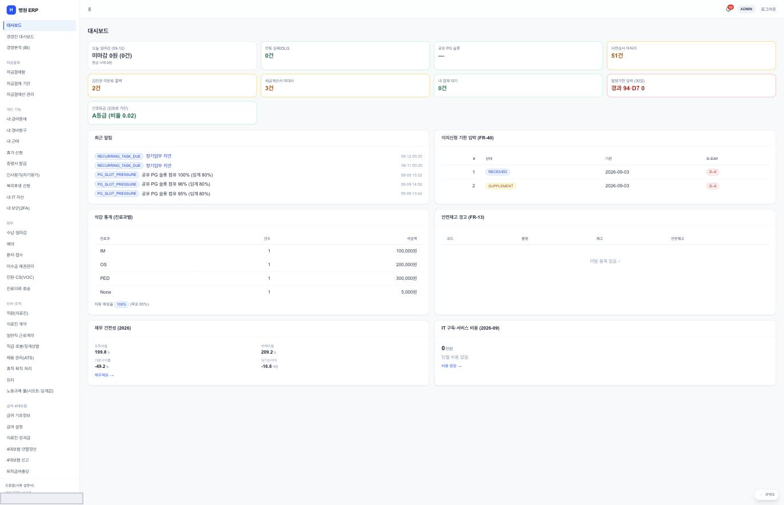
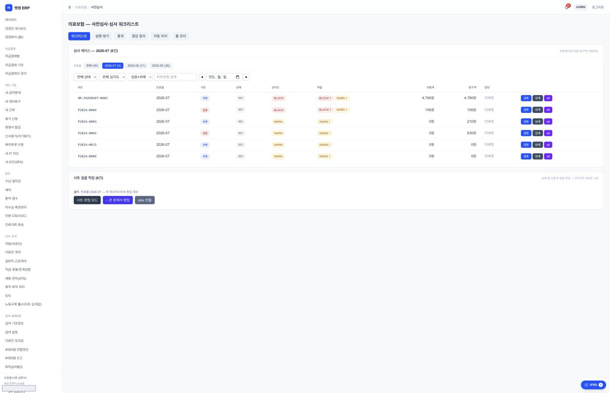
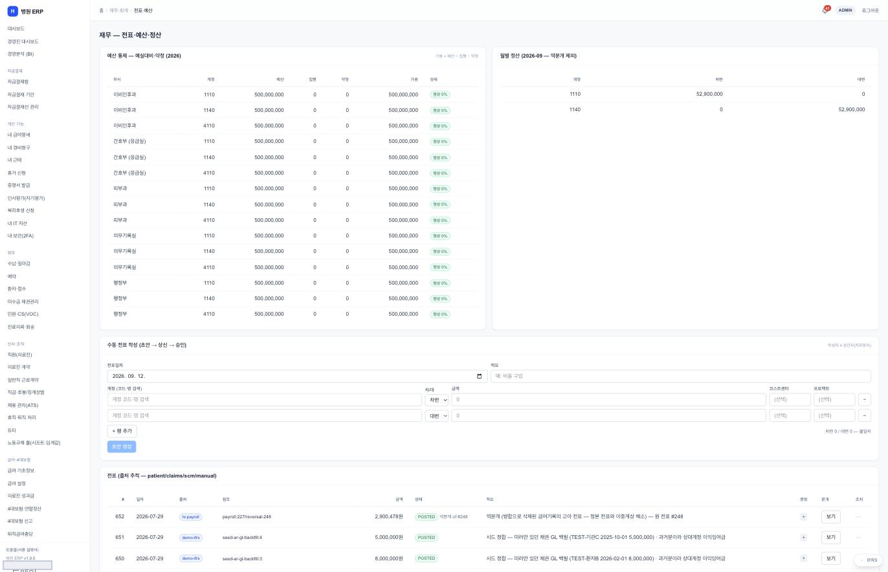
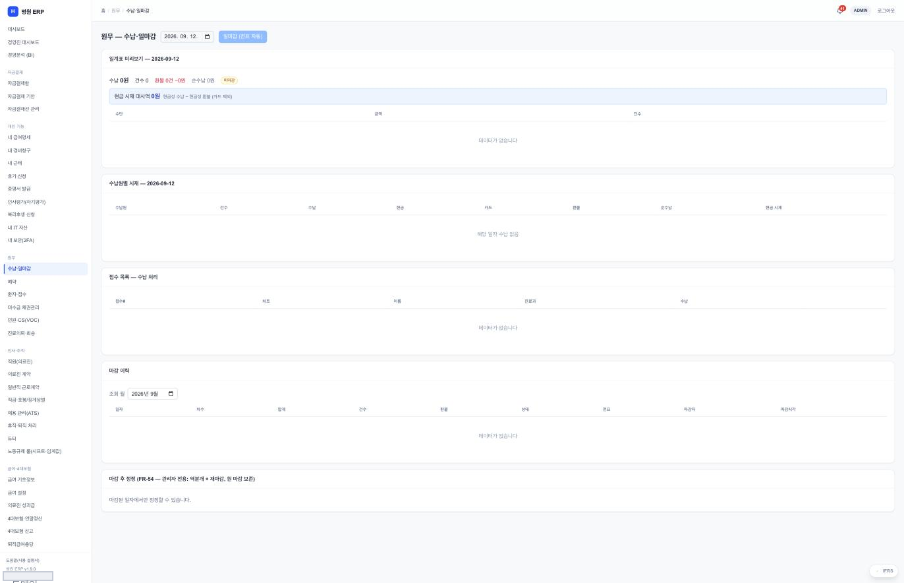
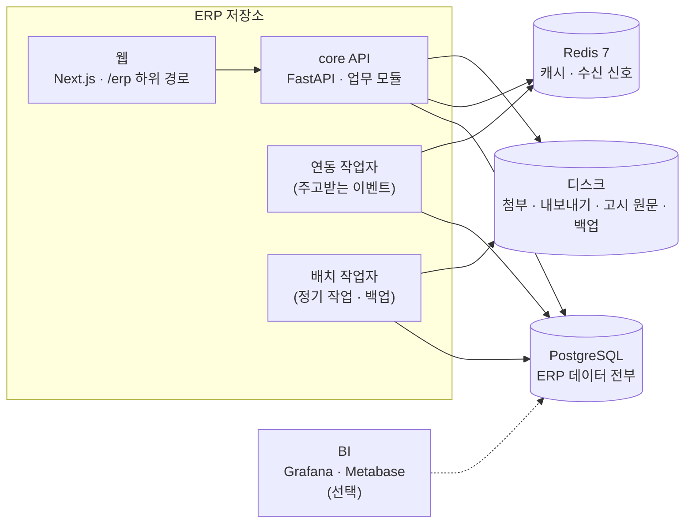
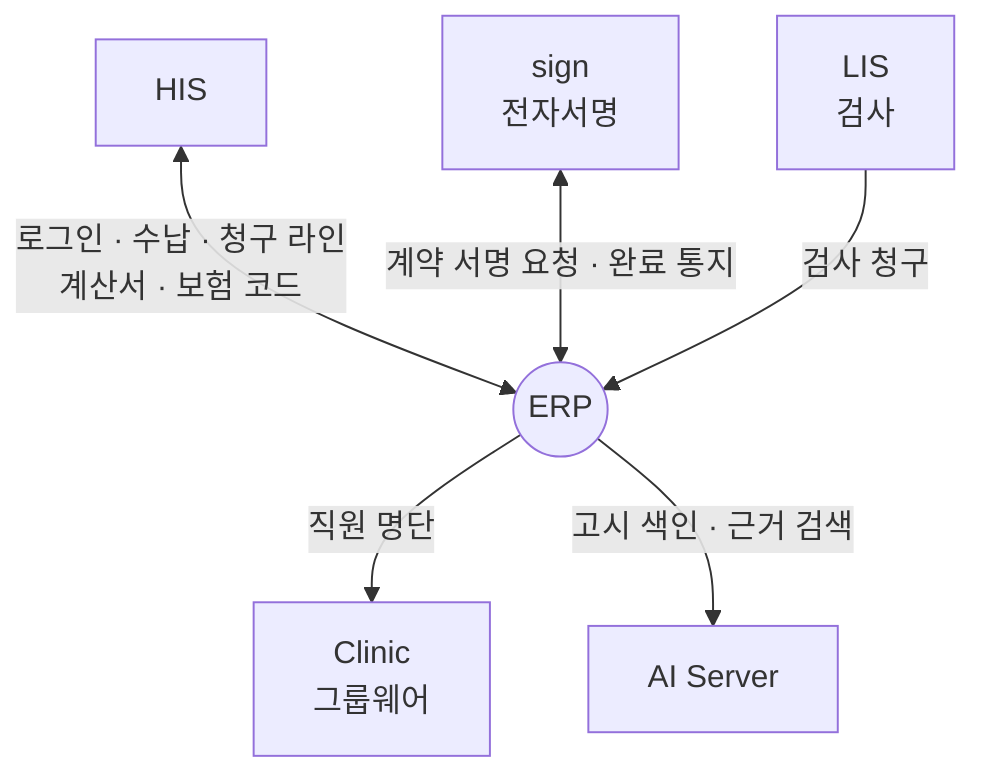

# ERP — 병원 경영지원 시스템

**ERP — the hospital's back-office system (finance, HR and payroll, materials, claims, tax)**

> 프로젝트 소개서 · 읽는 사람: **의료 전산담당자** · 기준: ERP 저장소의 **현재 개발본**(2026-09-29 에 읽음 · 끝의 [이 문서의 근거](#이-문서의-근거)) · [소개서 목록](README.md)

---

## Introduction (English)

ERP is the hospital's back-office system. It covers financial accounting, costing and management reporting, HR and payroll, purchasing and materials, front-desk settlement, insurance claims and tax — all posting to **one voucher ledger**. Finance, HR, purchasing and claims staff work in it every day, and every employee uses it for a few personal tasks such as payslips, expense claims and leave requests.

ERP does not own patients or encounters. That record stays in HIS. ERP receives what HIS sends — settlement, billing lines, materials and HR events — and turns it into accounting. It also calculates the patient bill (splitting it into the insurer's share, the patient's share and non-covered items) and HIS shows those amounts on its front-desk screens; it also sends confirmed insurance codes for drugs back to HIS. Staff sign in through HIS: pressing the ERP button in HIS opens ERP already signed in, and the ERP account is created on that first visit.

Technically it is a Python modular monolith (FastAPI on PostgreSQL, Redis as a cache) with a Next.js web front end and two background workers — one for integrations, one for scheduled batch work. The repository says it deliberately chose consistency over a distributed design. It needs no GPU; AI help for claim review comes from the AI Server when that is connected.

For an IT team, the practical points are: HIS must be in place first (sign-in and the first administrator both come through it); ERP is designed around Korean accounting, tax, labour and insurance-claim rules; and some addresses ERP uses to call HIS and the AI Server are fixed in code, so it is easiest to run ERP on the same host as HIS. Nine of its connections were called for real between fresh installs in September 2026. Details are in [What to know](#8-알아-둘-것).

---

## 1. 한 문장

> **EN** — ERP keeps the hospital's money, people and materials on one ledger. Patient and encounter records stay in HIS; ERP turns what HIS sends into accounting, and it also calculates the patient bill that HIS displays. At a glance: usable only with HIS in place and on the same host as HIS (some addresses are fixed in code); nine connections were confirmed in a September 2026 test install; sizing and migration effort are not measured.

**ERP 는 병원의 돈 · 사람 · 물자를 하나의 전표 원장(모든 거래가 모이는 회계 장부) 위에서 관리하는 경영지원 시스템입니다.**

### 한눈에 — 도입 판단

| | |
|---|---|
| **지금 쓸 수 있나** | 조건부 — HIS 가 먼저 서 있어야 하고, HIS 와 같은 호스트에 둘 때 동작을 확인했습니다. 국내 의료 · 세무 · 노동 제도를 전제로 만들어졌습니다 |
| **세워야 하는 것** | 앱 컨테이너 4개(core API · 웹 · 연동 작업자 · 배치 작업자) · PostgreSQL — 권장 배치는 HIS 의 DB 서버 안에 ERP 전용 데이터베이스(6절) · Redis 7 · 첨부와 백업을 둘 디스크. 경영분석(BI)은 선택. GPU 는 필요 없음 |
| **먼저 있어야 할 것** | HIS — 로그인 · 첫 관리자 · 회계로 옮길 사건이 모두 HIS 에서 옵니다. 기관은 수가 · 약제 마스터 · 고시 원문 · 기관 정보 · 급여 규칙 · 담당 역할 배정을 준비합니다 |
| **받을 코드** | 이 소개서가 설명하는 개발본은 통합 릴리즈 코드와 같습니다 — [소스 받기](../SOURCES.md). HIS · AI Server 를 부르는 주소 일부가 코드에 고정돼 있어, 다른 호스트에 두려면 코드를 고쳐야 합니다(8절) |
| **실제로 확인된 것** | 2026년 9월 시험 설치에서 9개 연결(HIS 6 · sign 2 · LIS 1)을 가상 데이터로 불러 확인했습니다. HIS 와 같은 호스트에 둔 구성이었습니다 |
| **아직 모르는 것** | 사용자 수 · 거래량에 따른 사양 · 기존 회계 · 급여 시스템에서 옮기는 품 · 세법 · 4대보험 개정 때 고치는 주체 · 전자세금계산서의 실제 전송 · DB 를 HIS 와 나눴을 때의 차이 |

환자와 진료의 **정본**(여러 곳에 같은 정보가 있을 때 기준이 되는 원본)은 HIS 에 있습니다. 진료 사실을 ERP 가 스스로 알지는 못합니다.

ERP 가 맡는 일은 둘입니다. 하나는 HIS 가 보내는 수납 · 청구 · 자재 · 인사 이벤트를 받아 회계로 옮기는 것입니다. 다른 하나는 **진료비 산정**입니다 — 진료비를 공단 부담 · 본인 부담 · 비급여로 나눠 계산하고, HIS 수납 화면과 환자 포털은 그 계산서를 불러와 보여 줍니다.

**전표**는 거래 한 건을 장부에 적는 단위입니다. 이미 마감한 전표를 고칠 때는 지우지 않고 **정정 전표**(원래 전표를 그대로 두고 고친 내용을 새로 적는 전표)를 덧붙입니다.

## 2. 병원 업무의 어디에 쓰이나

> **EN** — Finance, HR, purchasing, insurance-claims and IT staff use ERP daily; executives read its dashboards; every employee uses it for payslips, expense claims, leave and certificates. There are eight roles, and each menu item lists the roles that see it.

경영지원 부서가 주로 씁니다. 모든 직원도 자기 일 몇 가지(급여명세 · 경비청구 · 휴가 신청 · 증명서)에 씁니다.

| 누가 | 무엇을 하나(예) |
|---|---|
| 재무 · 회계 | 전표 · 예산 · 월 결산 · 재무제표 · 자금일보 · 채권채무 |
| 인사 · 급여 | 직원 · 의료진 계약 · 근무표 · 급여 · 4대보험 · 연말정산 · 퇴직금 |
| 구매 · 물류 | 구매요청 · 발주 · 입고 검수 · 재고 · 마약류 수불 · 재고 실사 |
| 보험심사 | 청구 전 사전심사 · 삭감 · 이의신청 · 수가 · 약제 마스터 |
| 원무(경영 쪽) | 수납 · 일마감 · 환자 미수금 회수 |
| IT | IT 자산 · 소프트웨어 구독 · 퇴사자 자산 회수 |
| 경영진 | 경영 대시보드 · 진료과별 손익 · 경영분석(BI) |
| 모든 직원 | 내 급여명세 · 내 경비청구 · 휴가 신청 · 증명서 발급 · 자금결재 기안 |

역할은 8개입니다 — 원장 · 관리자 · 부서장 · 직원 · 재고 워크스테이션(재고 화면만) · IT 관리자 · 회계 관리자 · 물류 관리자. 역할마다 볼 수 있는 범위가 전체 · 부서 · 본인 · 없음으로 나뉩니다.

**장면으로 보면**

- **외래 수납이 전표가 되기까지** — 원무과는 HIS 화면에서 일합니다. ERP 가 HIS 의 청구 라인(진료 항목)을 받아 진료비를 공단 · 본인 · 비급여로 나눠 산정합니다. 수납 창구는 HIS 화면에서 그 계산서를 불러와 보고 수납합니다. 수납과 일마감이 ERP 에서 전표로 이어집니다.
- **청구 전 점검** — 보험심사 담당이 사전심사 목록을 엽니다. 건마다 「막음」 · 「경고」가 붙고 위험 금액과 청구 금액이 나란히 보입니다. 필요하면 AI 보조 단추로 관련 고시 근거를 찾아봅니다. 막힌 건을 풀지는 담당자가 정합니다.
- **월말 결산** — 회계 담당이 월 결산을 잠급니다. 잠근 뒤에 고칠 것이 생기면 원래 기록을 지우지 않고 정정 전표를 덧붙입니다.

## 3. 할 수 있는 일

> **EN** — The web menu has 105 items in 16 groups: dashboards, fund approvals, personal self-service, front-desk settlement, HR, payroll and social insurance, tax, insurance claims, regulatory and compliance, inventory and procurement, IT assets, finance and accounting, treasury, fixed assets and leases, costing and profitability, and system administration. ERP keeps only a four-field copy of each patient (chart number, name, birth date, phone) for billing and receivables; clinical records stay in HIS.

웹 메뉴는 **묶음 16 · 항목 105** 입니다(메뉴 정의 파일을 센 값).

| 묶음(항목 수) | 무엇이 들어 있나 |
|---|---|
| **대시보드**(3) | 대시보드 · 경영진 대시보드 · 경영분석(BI) |
| **자금결재**(3) | 지출 · 구매 · 계약 같은 자금 집행 결재 — 결재함 · 기안 · 결재선 |
| **개인 기능**(9) | 내 급여명세 · 경비청구 · 근태 · 휴가 신청 · 증명서 · 자기평가 · 복리후생 · 내 IT 자산 · 2단계 인증 |
| **원무**(6) | 수납과 일마감 / 예약 / 환자와 접수 / 미수금 채권 / 민원 / 진료의뢰와 회송. 여기의 「환자」는 수납 · 미수금 회계에 필요한 최소 사본입니다(아래) |
| **인사 · 조직**(8) · **급여 · 4대보험**(8) | 직원 · 의료진 계약 · 근로계약 · 채용 · 휴직 · 퇴직 · 근무표 · 급여 · 성과급 · 4대보험 · 연말정산 · 퇴직급여충당 · 법정교육 이수 |
| **세무**(3) | 원천징수 · 전자세금계산서 |
| **의료보험**(5) | 사전심사 · 삭감 · 이의신청 · 공단 지급 대사 · 심사 규칙 관리 |
| **규제 · 컴플라이언스**(10) | 코드 마스터(약가 · 수가 · 재료) · 약품 코드 매핑 · 고시와 AI 색인 · 인증평가 준비 · 만기 · 한도 관리 |
| **재고 · 조달**(13) | 구매요청 → 발주 → 입고 · 불출 · 마약류 수불(들고 난 수량 기록) · 재고 실사 · 위탁재고(쓴 만큼만 값을 치르는 거래처 재고) · 반품 · 거래처 · 견적 · 안전재고 자동 발주 · 의약품 회수 |
| **IT 자산**(4) | IT 자산 · 소프트웨어 구독 · 비용 점검 · 퇴사자 회수 |
| **재무 · 회계**(8) | 전표 · 예산 · 계정과목 · 결산 · 재무제표 · 월 마감 · 채권채무 |
| **자금관리**(7) | 지급 · 자금일보 · 자금수지 예측 · 차입금 |
| **고정자산 · 리스**(3) | 고정자산 · 리스 |
| **원가 · 수익성**(6) | 활동기준 원가 배부 · 진료과별 손익 · 재무 시뮬레이션 · 검진권 |
| **시스템**(9) | 사용자 · 메뉴 권한 · 기관 설정 · 연동 관리 · 감사 · 접속기록 · 운영 정합성 점검 · 결정 대기함 · 정기업무 |

**마약류 수불** — HIS 에도 마약류 장부가 있습니다(환자별 투약 사슬과 금고 재고 · [마약류 수불 원장](../functions/detail/narcotics-ledger.md)). ERP 재고의 마약류 수불과 이 장부가 어떻게 맞춰지는지, 법정 보고에 어느 쪽을 쓰는지는 이 자료에서 확인하지 않았습니다.

**ERP 의 「환자」** — ERP 에도 환자 표가 있습니다. 차트번호 · 이름 · 생년월일 · 전화 네 항목뿐이고, 진료 기록은 없습니다. 대부분 HIS 가 보내는 이벤트로 채워집니다. 원무 메뉴에서는 관리자가 직접 등록 · 접수할 수도 있는데, 이렇게 넣은 환자가 HIS 와 어떻게 맞춰지는지는 확인하지 못했습니다.

메뉴 밖에서 서버가 하는 일:

- **정기업무 목록** — 월 결산 · 신고 · 점검 같은 반복 업무를 하나씩 등록합니다. 업무마다 수동 · 자동 · AI 보조 중 한 방식을 고릅니다. AI 보조 방식은 초안만 만들고, 사람이 결정 대기함(시스템 메뉴의 승인 대기 목록)에서 승인해야 끝납니다.
- **스스로 점검** — 재무제표를 독립 계산과 대조하고, 도메인 사이 정합성을 정기적으로 확인합니다.
- **감사** — 변경 전 · 후를 남기고(민감한 값은 가림), 법정 접속기록을 남깁니다.

전체 기능 표: [ERP 구성서 §4](../systems/erp.md#4-핵심-기능) · 업무별로 다시 묶은 것: [업무별 기능 지도](../functions/).

### 화면으로 보기

> **EN** — A few screens from a rehearsal install with synthetic hospital data.

| | |
|---|---|
|  **대시보드** — 오늘 마감 · 사전심사 미처리 · 법정 기한 · 재무 건전성 |  **청구 사전심사** — 「막음」 · 「경고」 · 위험 금액과 청구 금액 |
|  **전표 · 예산** — 전표마다 어디서 왔는지 표시 |  **수납 · 일마감** — 수납이 없는 날은 「해당 일자 수납 없음」 |

화면은 가상 병원 데이터가 든 리허설 설치본에서 찍었습니다(2026-09-12). 화면마다의 설명은 [ERP 화면](../screens/erp.md)에 있습니다.

## 4. 어떻게 만들어졌나

> **EN** — A Python modular monolith: a FastAPI core API with SQLAlchemy and Alembic on PostgreSQL, Redis 7, a Next.js web front end served under the `/erp` path, and two background workers built from the same code (integration and batch). Business modules are separated inside one codebase rather than split into services. The 113 web screens count page files, including detail pages, so they exceed the 105 menu items. Where the database lives is settled once, in section 6.

| 구성 요소 | 무엇 | 기술 |
|---|---|---|
| **core API** | 업무 로직 전부 · 전표 원장 · 연동 수신 · 권한 | Python 3.12 · FastAPI · SQLAlchemy · Alembic |
| **웹** | 직원 화면 전부. HIS 와 같은 주소 아래 `/erp` 경로로 엽니다 | Node 22 · Next.js |
| **연동 작업자** | 다른 시스템과 주고받는 이벤트를 보내고 받습니다 | core 와 같은 코드 |
| **배치 작업자** | 정기 작업(수가 동기화 · 백업 · 정합성 점검 · 정기업무 실행)을 돌립니다. 여러 개를 띄워도 DB 잠금으로 하나만 일합니다 | core 와 같은 코드 |
| **BI**(선택) | 경영 지표 대시보드 — 별도 compose 로 붙입니다 | Grafana · Metabase |

업무 모듈은 재무 · 원가 · 인사 · 구매자재 · 원무 · 보험청구 · 규제 · 세무 · IT 자산 · 분석 · 감사로 나뉩니다. 한 코드베이스 안에서 모듈 경계를 나눈 구조입니다(분산 서비스가 아님). 규모는 데이터 모델 219 · 웹 화면 113 입니다(현재 개발본과 같은 커밋에서 센 값 · [구성서 §3](../systems/erp.md#3-규모)). 웹 화면 113 은 화면 파일 수라, 메뉴에 없는 상세 · 하위 화면까지 셉니다. 그래서 3절의 메뉴 항목 105 보다 많습니다.

**데이터가 사는 곳**

| 저장소 | 무엇이 들어 있나 |
|---|---|
| **PostgreSQL** | ERP 데이터 전부 — ERP 전용 데이터베이스 안의 스키마 9개(공통 · 인사 · 재무 · 원무 · 청구 · 규제 · 연동 · 감사 · 구매자재) |
| **Redis 7** | 캐시 · 들어온 이벤트를 바로 처리하라는 신호 |
| **디스크** | 첨부 파일 · 내보내기 파일 · 고시 원문 투입 폴더 · 백업 |

- DB 서버를 어디에 두나(HIS 와 함께 쓰나 · 나누나)는 6절 「어디에 세우나」에 한 번에 적었습니다.
- **메시지 브로커가 없습니다.** 주고받는 이벤트는 DB 의 대기열 테이블에 쌓였다가 작업자가 처리합니다. 같은 출처의 전표를 두 번 만들지 않게 **멱등키**(같은 요청이 여러 번 와도 한 번만 처리되게 하는 식별값)를 씁니다.
- **민감한 인사 정보는 암호화해 저장**합니다(전화번호는 검색용 색인을 따로 둠).

## 5. 다른 시스템과의 연결

> **EN** — ERP depends on HIS for sign-in and for the events it turns into accounting. It also talks to sign (contract signatures), LIS (lab billing), Clinic (staff roster) and the AI Server (notice search for claim review). Nine connections were called for real in September 2026 (HIS 6, sign 2, LIS 1); a connection means one caller, one purpose, so a contract signing and its completion notice count as two. For staff sign-in, ERP shares a secret with HIS, whereas sign and edu check the HIS public key; the repository does not say why. (edu does share a separate value with HIS for its roster and training-record service tokens.)

**ERP 는 HIS 없이는 쓸 수 없습니다.** 직원 로그인이 HIS 를 거치고, 회계로 옮길 사건도 HIS 에서 옵니다. 다른 시스템은 필요할 때 붙입니다.

| 상대 | ERP 가 주는 것 | ERP 가 받는 것 | 로그인 · 인증 방식 | 실제로 연결해 확인했나 |
|---|---|---|---|---|
| **HIS** — 확인한 6개(아래 따로) | 진료비 계산서 · 확정된 약품 보험 코드 · 검진권 정산 지급 회신 · 의료진 계약 서명 요청 | 직원 로그인 · 청구 라인과 재원 환자 수 | 공유 비밀키로 서명한 로그인 토큰 · 연동 키 · 서명된 통지 | **확인함**(2026-09-14~15) |
| **HIS** — 아직인 것 | 수가 마스터 · 직원 번호 연결 · 전자결재 상신 · 휴가 결과 · 서명 완료본 회수 | 운영 이벤트(수납 · 재고 · 인사 등) · 직원 셀프서비스 조회 · 결재 결과 | 연동 키 · 서명된 통지 | 만들어져 있음 · 실제 연결 확인은 아직(일부는 불러 보았지만 끝까지 확인하지 못함) |
| **sign** | 외부 거래처 계약 서명 요청 · 감사 이벤트 기록 | 서명 완료 통지 | sign 이 발급한 API 키 · 서명된 통지 | 외부 계약 서명 · 완료 통지 **확인함**(2026-09-15 · 2개) · 감사 이벤트 기록은 확인 아직 |
| **LIS** | 청구 처리 상태 | 검사 청구(수량) | 서명된 요청(시각 포함) | **확인함**(2026-09-15 · 1개) |
| **Clinic** | — | 직원 명단 | Clinic 이 발급한 API 키 | 만들어져 있음 · 확인은 아직(설치하지 않음) · 근태 수집은 아직 없음 |
| **AI Server** | 고시 등록 · 폐지 · 검색 요청 | 검색 결과 · 근거 | 발급된 API 키 | 만들어져 있음 · 실제 연결 확인은 아직(일부를 불러 봄) |

- **아직 없는 것** — HIS 가 받을 준비를 해 둔 재고 입고 · 자산 코드 · 심사 결과 통지는 ERP 쪽에서 보내는 코드가 아직 없습니다. sign 의 일반 전자계약을 쓰는 경로와 Clinic 근태 수집도 아직 없습니다.
- 「확인함」은 2026년 9월에 새로 세운 설치본끼리 실제로 불러 본 결과입니다(가상 데이터 · [따라가 본 결과](../build-guide/follow-along-2026-09.md)).
- 여기서 **연결 하나**는 「누가 누구를 무엇 때문에 부르나」 하나입니다(연결 상태 표의 한 행). 그래서 sign 과의 계약 서명과 그 완료 통지는 2개로 셉니다. 모두 HIS 6 · sign 2 · LIS 1, 9개입니다.

HIS 와 확인한 6개를 부르는 방향으로 나누면 이렇습니다.

| 부르는 쪽 | 무엇 |
|---|---|
| HIS → ERP | 직원 로그인(HIS 에서 ERP 단추) · 진료비 계산서 조회 · 확정된 약품 보험 코드 가져오기 |
| ERP → HIS | 청구 라인과 재원 환자 수 조회 · 검진권 정산 지급 회신 · 의료진 계약 서명 요청 |
- **HIS 로그인이 공유 비밀키 방식인 까닭** — 직원 로그인에서 sign · edu 는 HIS 공개키로 직원 신원을 확인하는데, ERP 는 HIS 와 같은 비밀키를 나눠 가집니다. edu 도 명부 · 이수 기록용 서비스 토큰에는 HIS 와 나눈 비밀값을 따로 씁니다. 왜 다르게 만들었는지는 저장소에서 설명을 찾지 못했습니다.
- HIS 가 보내는 운영 이벤트는 **리얼 모드(실제 운영 단계)에서만 실제로 나갑니다.** 리허설 모드에서는 대기열에 쌓이고 보류되는 것까지 확인했습니다.

연결마다의 자세한 내용: [ERP → HIS](../integration/cards/erp-to-his.md) · [HIS → ERP](../integration/cards/his-to-erp.md) · [ERP → sign](../integration/cards/erp-to-sign.md) · [LIS → ERP](../integration/cards/lis-to-erp.md) · [ERP → AI Server](../integration/cards/erp-to-ai-server.md) · [연결 상태 표](../RELEASES/2026.09/compatibility.md).

## 6. 설치 · 운영

> **EN** — ERP needs no GPU. It runs as four application containers (core, web, two workers). Recommended placement: on the HIS host, with ERP's own database inside HIS's PostgreSQL server — both installation compose files assume this and differ mainly in whether Redis is shared; the September 2026 test used the co-located one. Moving the database elsewhere means pointing the database setting at another server, which no compose file does and nobody measured. Migrations run at start-up and need two database extensions. The first administrator is created through HIS sign-in. Daily encrypted backups cover ERP's own schemas only and are switched off until a backup folder is set.

### 필요한 것

| 항목 | 내용 |
|---|---|
| 서버 | **GPU 는 필요 없습니다.** 사용자 수 · 거래량에 따른 사양은 계측하지 않았습니다. 어디에 세우나는 바로 아래 절에 있습니다 |
| 소프트웨어 | 컨테이너(Docker) — core · 웹 · 연동 작업자 · 배치 작업자. PostgreSQL · Redis 7 |
| DB 확장 | `btree_gist`(수가 기간이 겹치지 않게) · `pg_trgm`(약품명 검색). DB 계정에 확장을 만들 권한을 주거나 미리 만들어 둡니다 |
| 먼저 있어야 할 것 | **HIS**(로그인 · 첫 관리자 · 회계로 옮길 사건) |
| 기관이 준비할 데이터 | 수가 · 약제 마스터(반입 경로는 [구성서](../systems/erp.md) 참고) · 고시 원문 · 기관 정보(이름 · 법인명 · 기관 코드) · 급여 규칙 · 담당 역할 배정 |

### 어디에 세우나 — 결론

**권장 배치: HIS 와 같은 호스트에 두고, HIS 의 PostgreSQL 서버 안에 ERP 전용 데이터베이스를 만들어 씁니다.**

- 저장소의 설치용 compose 둘이 모두 이 배치를 전제로 합니다. 앱 컨테이너 4개(core · 웹 · 작업자 둘)는 같습니다.
  - **HIS 와 함께 올리는 배치용** — Redis 도 HIS 것을 함께 씁니다. 2026년 9월 시험이 이 파일로 확인했습니다. 여기서 시작합니다.
  - **운영용** — Redis 만 자기 것을 띄웁니다. DB 는 같은 호스트의 HIS DB 서버를 씁니다.
  - 개발용 compose 는 PostgreSQL · Redis 까지 함께 띄우는 개발 PC 용입니다.
- **같은 DB 서버를 쓰는 대가** — 연결 수 한도를 HIS 와 나눠 씁니다. 한쪽이 연결을 많이 쓰면 다른 쪽이 모자랄 수 있어, 연결 수 경보를 봅니다. 백업은 따로입니다(아래).
- **다른 배치의 조건**
  - DB 만 다른 서버로 옮기기 — DB 주소는 설정 파일 값이라 다른 서버를 가리킬 수 있습니다. 그렇게 짠 compose 는 없고, 나눴을 때의 차이는 재 보지 않았습니다. 규모가 커지면 DB 를 나누는 것이 저장소 문서의 예정 방향입니다.
  - ERP 자체를 다른 호스트로 옮기기 — ERP 가 HIS · AI Server 를 부르는 주소 일부가 코드에 고정돼 있어, 코드를 고쳐야 합니다(8절).
- BI 는 별도 compose 로 선택해 붙입니다.

### 설치 경로

- **스키마는 기동할 때 적용됩니다**(마이그레이션 247개).
- **첫 관리자는 HIS 로그인으로 만들어집니다.** ERP 안에서 첫 관리자를 만드는 경로는 없습니다. HIS 에서 ERP 단추를 눌러 처음 들어올 때 ERP 계정이 생깁니다.
- 웹은 **HIS 와 같은 주소 아래 `/erp` 경로**에 둡니다. 따라가기에서는 이렇게 묶어야 로그인이 이어졌습니다.
- **시드 데이터**(설치 때 미리 넣는 예시 데이터)는 합성 데이터(`TEST-` 접두)이고 개발용 로그인 계정이 들어 있습니다. 실운영 전에 지웁니다.

### 꼭 넣어야 하는 설정

- **비밀값** — 세션 토큰 · 민감정보 암호화 · 결재 원장 · 백업 암호화 키, HIS 와 나눠 가지는 로그인 비밀키, 연동 상대마다의 키. 대부분 환경 변수 대신 파일에서 읽게 할 수 있습니다(설정 이름 끝에 `_FILE` 을 붙인 키).
- **주소** — 공개 주소 · 허용 호스트 · 연동 상대 주소 · 로그인 관련 도메인. 기본값이 특정 설치본을 가리키는 것이 있어 **설정으로 바꿀 수 있는 것은 모두 자기 기관 값으로** 바꿉니다. 어느 파일에 있는지는 [바꿔야 할 코드 기본값 — ERP](../build-guide/replace-list.md#erp)에 있습니다. 설정으로 못 바꾸는 주소는 8절에 따로 모았습니다.
- **운영 표시값(`ENV`)은 정확히 `prod`** 로 넣습니다. 비슷한 값을 넣으면 운영용 안전장치가 켜지지 않습니다.
- **첨부 저장소(`ATTACHMENT_DIR`)** — 계약 서명에 필요한데 운영 compose · 환경 예시에 빠져 있습니다. 넣지 않으면 서명 요청이 거절됩니다.
- **정기업무 담당 역할** — 알림은 담당 역할을 가진 사람에게 갑니다. 보유자가 없으면 관리자에게 갑니다. 설치 뒤 재무 · 물류 담당 역할을 배정합니다.

설정 키 전체: [ERP 구성서 §6](../systems/erp.md#6-주요-설정).

### 아직 다루지 않은 것

- 기존 회계 · 급여 시스템에서의 이관과 초기 계정과목 · 급여 규칙 설정에 드는 품은 재지 않았습니다.
- 세법 · 4대보험 규칙이 바뀔 때 누가 어디를 고치는지는 이 자료에서 확인하지 않았습니다.
- 전자세금계산서는 받은 것을 대사하는 기능이 있습니다. 공공기관과의 실제 전송 연결은 이 자료에서 확인하지 않았습니다.

### 백업 · 감시

- **백업** — 배치 작업자가 매일 밤 ERP 스키마 9개를 덤프해 암호화(AES-256-GCM)하고, 최근 7세대를 남깁니다. 원격지 복사는 선택입니다. 실패하면 관리자에게 알립니다.
  - **백업 폴더(`BACKUP_DIR`)를 넣지 않으면 백업하지 않습니다.**
  - **HIS 스키마는 담지 않습니다.** 같은 DB 서버를 쓰더라도 HIS 백업은 HIS 쪽에서 따로 합니다.
  - 복호 키는 백업 매체와 떨어진 곳에 보관합니다.
- **상태 확인** — 컨테이너 헬스 체크 · 1분 간격 생존 신호 · DB 연결 수 감시(같은 DB 서버를 쓰는 이웃과 한도를 나누므로) · 호스트 상태 점검 스크립트.
- **정합성 점검** — 원장 무결성 · 결재 원장 검증 · 잔액 점검을 정기업무로 돌립니다.

자세한 설치 · 설정 순서: [구축 가이드 S5](../build-guide/S5-management.md).

## 7. 이렇게 만든 이유

> **EN** — Five choices: one voucher ledger with idempotent posting; a modular monolith that buys consistency instead of distribution; patient records left in HIS; corrections added rather than records rewritten; and AI that only drafts, with people approving and executing.

| 설계 | 왜 |
|---|---|
| **전표 원장 하나** — 모든 모듈의 거래가 한 창구로 들어오고, 같은 출처의 전표는 두 번 만들지 않음 | 돈의 흐름을 한 장부에서 대조할 수 있게. 연동이 재시도해도 금액이 두 번 잡히지 않게 |
| **모듈러 모놀리스** — 한 코드베이스 안에서 모듈 경계를 나눔 | 병원 하나를 위한 시스템이라, 분산 구조의 복잡함 대신 정합성에 투자한다고 저장소가 밝힙니다 |
| **환자 · 진료 정본은 HIS 에** | 같은 환자 정보가 두 곳에서 따로 바뀌지 않게. ERP 는 받은 사건을 회계로만 옮깁니다 |
| **지우지 않고 덧붙인다** — 마감 뒤 정정은 정정 전표로, 마약류 수불은 추가만 되는 기록과 해시 체인으로 | 누가 언제 무엇을 바꿨는지 이력이 남게. 감사에서 원래 기록을 되짚을 수 있게 |
| **AI 는 초안까지** — 정기업무의 AI 보조 방식은 초안을 결정 대기함에 올리고, 사람이 승인 | 신고 · 납부 · 전기 같은 실행과 금액 확정을 사람이 하게. 승인도 「초안 검토 완료」일 뿐 실행하지 않습니다 |

시스템마다 무엇을 정하고 무엇을 포기했는지: [형제 시스템은 어떻게 자랐나 §5](../DESIGN-HISTORY-SYSTEMS.md#5-시스템마다-무엇을-정하고-무엇을-포기했나).

## 8. 알아 둘 것

> **EN** — ERP is built around Korean rules; it cannot be used without HIS; some addresses for calling HIS and the AI Server are fixed in code (the allow-list for calling HIS and the AI Server address), while the public address, allowed hosts and partner keys are settings; HIS sign-in uses a shared secret that both sides must keep; several features wait for real institutional data; and the repository's own status labels disagree, so read maturity only as far as this material checked it (fresh install and nine links).

- 🔴 **국내 제도를 전제로 설계했습니다** — 심사 · 고시 · 수가 · 세법 · 노동 규정이 모두 국내 의료기관 기준입니다. 다른 나라에 세우려면 청구 · 세무 · 급여 규칙을 새로 붙여야 합니다.
- 🔴 **HIS 없이는 쓸 수 없습니다** — 로그인 · 첫 관리자 · 회계로 옮길 사건이 모두 HIS 에서 옵니다. HIS 를 먼저 세웁니다. 다른 회사의 HIS 에 붙이는 대체 경로는 없습니다.
- 🔴 **ERP 가 HIS · AI Server 를 부르는 주소 일부가 코드에 고정돼 있습니다.** 다른 도메인에 두면 코드를 고치거나 HIS 와 같은 호스트에 둡니다(6절 「어디에 세우나」). 두 가지를 나눠 보면 이렇습니다([구축 가이드 S5](../build-guide/S5-management.md)).
  - **설정으로 바꾸는 주소** — 공개 주소 · 웹이 부르는 API 주소 · 허용 호스트 · 연동 상대마다의 주소와 키(6절).
  - **코드에 고정된 주소 ①** — ERP 가 HIS 를 부를 수 있는 허용 목록입니다. 직원 번호 연결 · 검진권 정산 회신 · 수가 마스터 올리기가 이것을 씁니다.
  - **코드에 고정된 주소 ②** — ERP 가 AI Server 를 부르는 주소입니다. 사전심사 근거 검색 · 고시 색인이 이것을 씁니다.
  - 그래서 원내 AI Server 주소를 넣어도 ERP 자체 검색으로 넘어가고, 화면의 출처 표시가 「local」로 보입니다.
- **HIS 로그인은 공유 비밀키 방식**입니다 — HIS 와 ERP 에 같은 키를 두고, 키 보관 · 교체 절차를 따로 관리합니다.
- **실제 자료가 있어야 진행되는 기능**이 있습니다 — 심사 결과 통보서 읽기 · 삭감 위험 평가의 기준 보정 · 고시 원문 추가 적재 · 공공 수가 데이터 연계. 기관이 실제 통보서 샘플 · 고시 원문 · 서비스 키를 확보해 진행합니다.
- **저장소 문서끼리 어긋납니다**: 저장소 README 는 「운영 가동 중」, 이 생태계의 버전 목록은 「파일럿」이라 적습니다. 화면 아래 버전 표기(1.9.0)도 저장소 버전(1.287.3)과 다릅니다. 시스템 담당 확인을 기다립니다. 도입 판단에는 이 자료가 직접 확인한 범위만 쓰십시오 — 새 설치본의 기동과 연결 9개입니다.

전체 한계와 대체 수단: [ERP 구성서 §10](../systems/erp.md#10-한계와-대체-수단).

## 9. 통합 릴리즈 `2026.09` 이후 달라진 점

> **EN** — None. ERP's current development line is the same commit as the integrated release's base commit.

기준 커밋과 같습니다 — 달라진 점 없음.

## 10. 더 깊이

> **EN** — Where to go next.

| 알고 싶은 것 | 문서 |
|---|---|
| 구성 · 설정 키 · 연동 · 한계 전체 | [ERP 구성서](../systems/erp.md) |
| 설치 · 설정 순서 | [구축 가이드 S5](../build-guide/S5-management.md) |
| 화면 | [ERP 화면](../screens/erp.md) |
| 연결 하나를 자세히 | [연결 카드](../integration/cards/) · [공통 규약](../integration/contracts.md) |
| 실제로 불러 본 결과 | [따라가 본 결과](../build-guide/follow-along-2026-09.md) |
| 버전이 바뀐 기록 | [릴리즈 요약](../RELEASES/2026.09/systems/erp.md) |
| 소스 | [소스 받기](../SOURCES.md) — 저장소 `seanshin/hospital-erp` |

---

## 이 문서의 근거

> **EN** — What this introduction was written from.

| 항목 | 값 |
|---|---|
| 읽은 커밋 | `0e1f54c5b902` — 이 소개서가 읽은 저장소 커밋입니다. 그 뒤로 저장소가 움직였으면 소개서가 낡았을 수 있습니다 |
| 읽은 것 | ERP 저장소의 **현재 개발본** — 커밋 `0e1f54c5b902`(2026-09-10) · 버전 표기 `1.287.3`(태그 뒤 커밋 3개 포함) · 작업 트리의 미커밋 변경은 읽지 않음 |
| 비교 기준 | 통합 릴리즈 `2026.09` — 커밋 `0e1f54c5b902` · **현재 개발본과 같음** |
| 센 방법 | 메뉴 = 메뉴 카탈로그의 항목(묶음 없는 대시보드 3 포함 16묶음) · 역할 = 역할 정의의 값 · 스키마 = 백업 대상 스키마 목록 · 데이터 모델 · 웹 화면 · 마이그레이션 = [구성서 §3](../systems/erp.md#3-규모)와 [따라가 본 결과](../build-guide/follow-along-2026-09.md)의 값 — 메뉴 · 역할 · 스키마는 2026-09-29 에 센 값 |
| 실제 연결 확인 | 2026-09-14~15 · 통합 릴리즈 기준 설치본끼리 · 가상 데이터([따라가 본 결과](../build-guide/follow-along-2026-09.md)) |
| 사실 확인 | ERP 담당의 확인 전 · 생태계 자료 측이 저장소를 읽고 쓴 것 |
