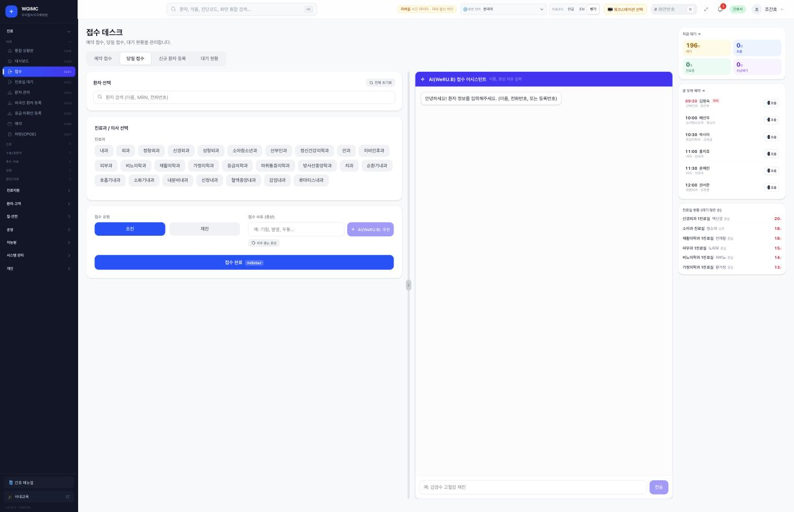
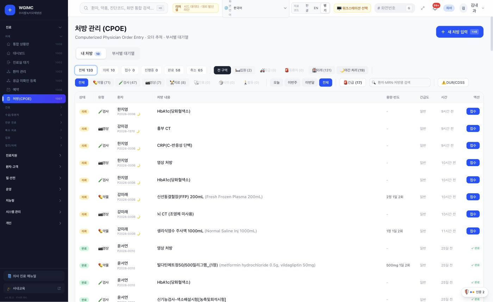
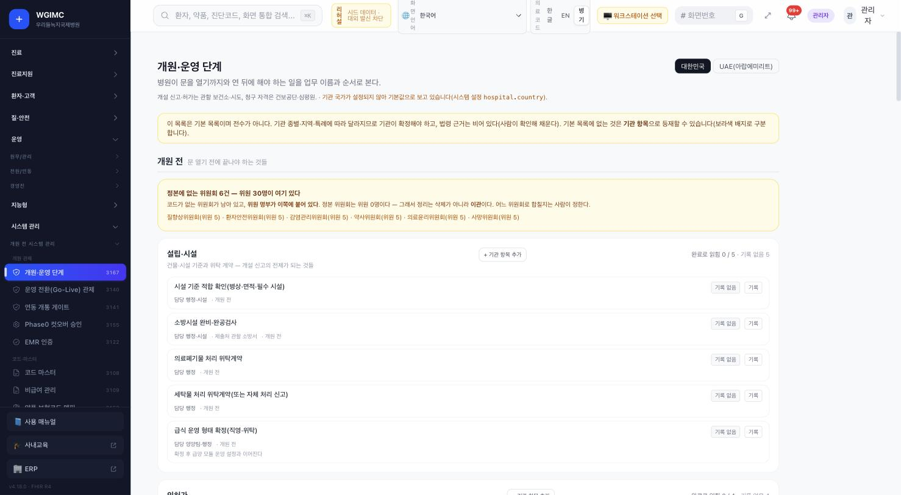
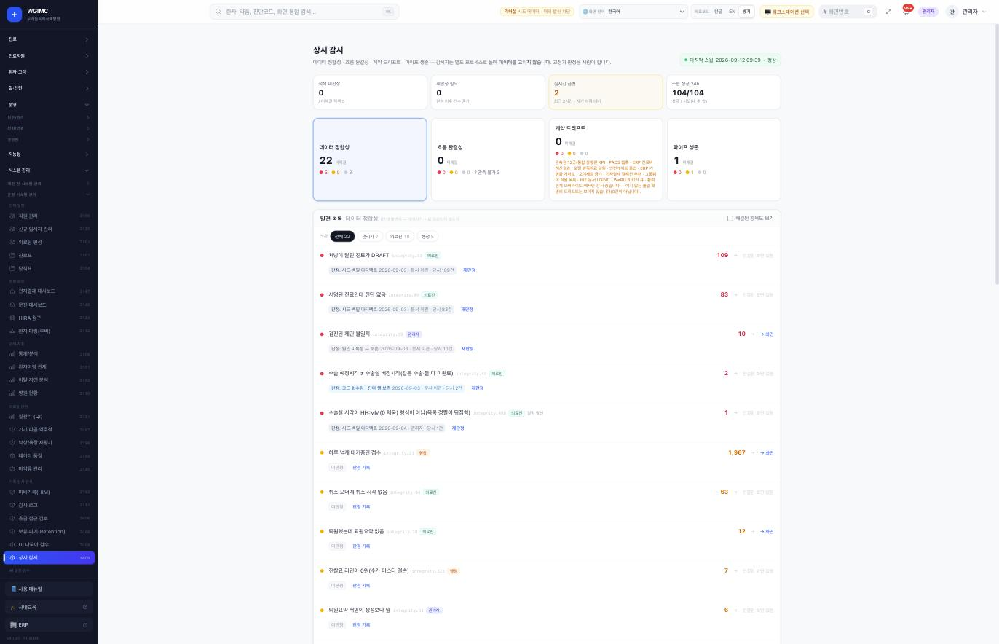
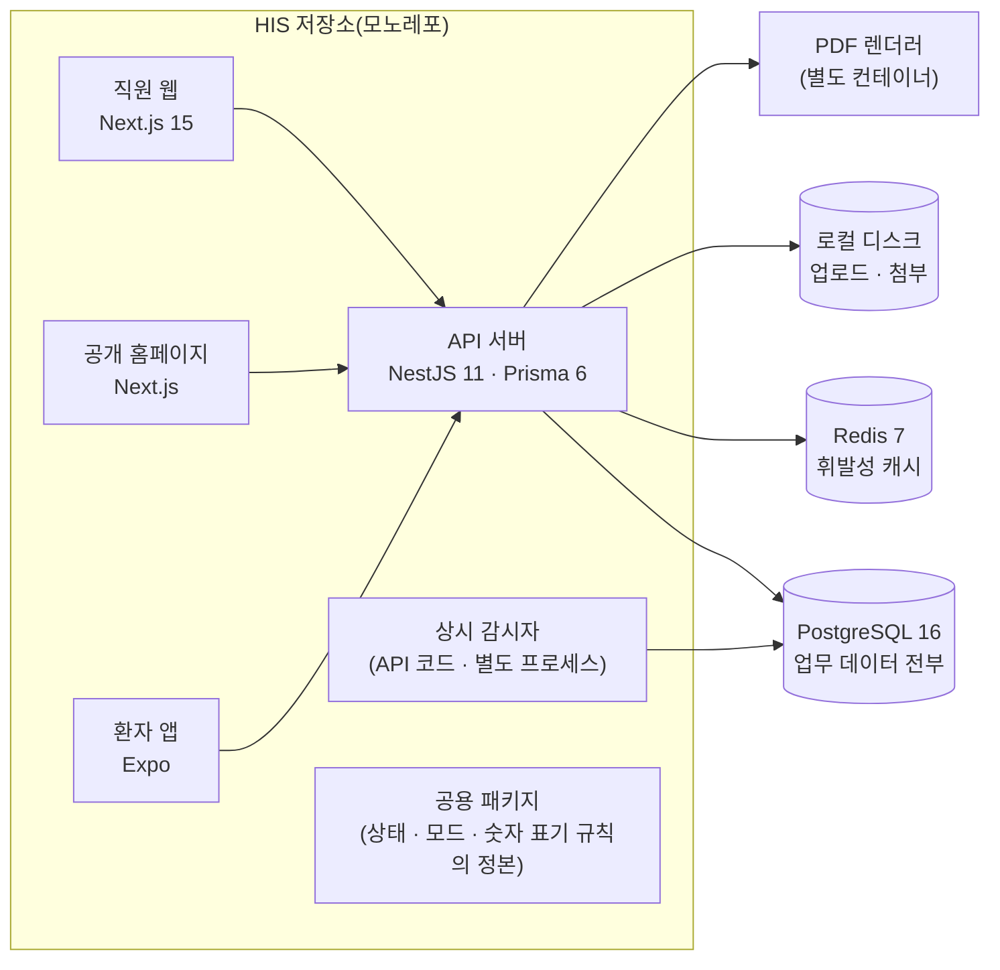
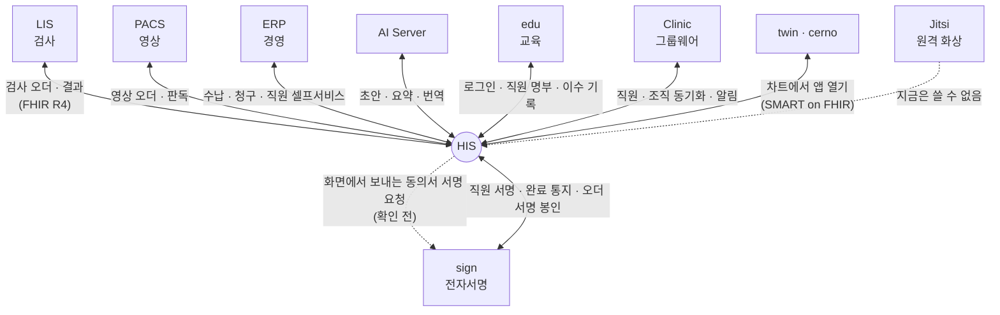

# HIS — 병원 업무의 중심 시스템

**HIS (Hospital RUN) — the system at the center of hospital work**

> 프로젝트 소개서 · 읽는 사람: **의료 전산담당자** · 기준: HIS 저장소의 **현재 개발본**(2026-09-29 · 끝의 [이 문서의 근거](#이-문서의-근거)) · [소개서 목록](README.md)

---

## Introduction (English)

HIS is the hospital information system at the center of this ecosystem. In one codebase it covers the work a hospital does every day: registration and appointments, outpatient and inpatient care, orders and prescriptions, nursing, surgery and intensive care, emergency, the clinical support departments (pharmacy, laboratory, imaging, pathology, blood bank), health checkups, the front desk, billing, and the administrative side (staff, supplies, quality and safety). It keeps the authoritative record for patients, encounters, orders, nursing notes and billing, and every other system in the ecosystem connects to it.

For an IT team, the most important thing to know is that HIS is also the ecosystem's **identity hub**. Staff sign in to HIS, and HIS issues the tokens the other systems accept. Laboratory (LIS), imaging (PACS), e-signature (sign), back-office (ERP), AI, e-learning, groupware and telemedicine all attach to HIS, one at a time, when the hospital is ready for them. HIS itself runs without any of them.

Technically it is a TypeScript monorepo: an API server (NestJS with Prisma on PostgreSQL 16, Redis 7 as a cache), a staff web application (Next.js), a public hospital website and a patient mobile app that ship with it, and a separate always-on **sentinel** process that checks data integrity, pipelines and integration contracts every hour. It exposes REST APIs, a FHIR R4 surface and SMART on FHIR app launch. There is no message broker: outgoing events wait in a database outbox table and are retried.

HIS also carries the machinery for **building a hospital on it**: an opening checklist, a go-live control board, a registry of decisions that people — not the software — must make, safety gates that each run in off / warn / block mode, and three operating modes (development, rehearsal, real). The real mode refuses to start if security settings are missing. AI features only ever assist — they draft, and a person approves — and each one has its own switch.

What is not there yet, stated plainly: transmission to external agencies (insurance claims, disease reporting and similar) is not implemented; there is no SMS provider; the hospital name still appears as fixed text in many files; the new install script has been rehearsed only in a local container, not yet on a real empty server; and no licence has been chosen for the code. Details are in [What is not there yet](#8-알아-둘-것).

---

## 1. 한 문장

> **EN** — HIS runs the day-to-day work of a hospital in one system and is the hub every other system in the ecosystem connects to. At a glance: usable now for trial installs and review, but real operation still needs the hospital's own code masters, code edits for the hospital name and a separate path for claims to insurers; it runs on one server with no other system required.

**HIS 는 병원의 하루 업무(접수부터 진료 · 검사 · 약 · 수납 · 경영지원까지)를 한 시스템에서 처리하고, 생태계의 다른 시스템이 모두 붙는 중심입니다.**

### 한눈에 — 도입 판단

| | |
|---|---|
| **지금 쓸 수 있나** | **조건부.** 시험 설치와 기능 검토는 지금 됩니다. 실운영에는 코드 마스터 반입 · 병원 이름을 코드에서 고치기 · 보험 청구 전송을 따로 마련하기가 필요합니다(§8) |
| **세워야 하는 것** | 서버 한 대(GPU 없음)에 API 서버 · 직원 웹 · 상시 감시자(별도 프로세스) · PostgreSQL 16 · Redis 7 · PDF 렌더러(별도 컨테이너) |
| **먼저 있어야 할 것** | 다른 시스템은 없어도 됩니다. 기관이 준비할 것은 코드 마스터(약가 · 진단 · 수가 · 검사) · 기관 정보 · 부서 · 병상 · 직원 · 필수 설정 · 운영 모드 결정입니다 |
| **받을 코드** | 이 소개서는 **현재 개발본**(버전 번호 없음 · v4.19.0 이후)을 설명하고, 새 설치 스크립트는 여기에만 있습니다. 통합 릴리즈 코드(v4.18.0)는 [구축 가이드 S1](../build-guide/S1-core-his.md)의 우회 순서로 세웁니다 · [소스 받기](../SOURCES.md). 세운 서버를 다음 판으로 올리는 절차는 저장소가 아직 정하지 않았습니다(§6) |
| **실제로 확인된 것** | 2026년 9월 시험 설치(통합 릴리즈 코드 · 가상 데이터)에서 LIS · sign · ERP · edu 연결 일부를 실제로 불러 확인했습니다. 다만 LIS 는 HIS 기본 검사 코드 15개 중 3개만 매핑돼 있었고, 현재 개발본으로는 다시 부르지 않았습니다(§5) |
| **아직 모르는 것** | 사용자 수에 맞춘 서버 사양 · 빈 서버에서의 설치 · 운영용 컨테이너 구성(compose)으로 끝까지 띄우기 · 서버 이중화와 복구 목표 시간 · 이관에 걸리는 시간 · HIS 가 멈췄을 때 다른 시스템의 동작 |

병원 정보 체계에서 HIS 는 **정본**(正本 — 여러 곳에 같은 정보가 있을 때 기준이 되는 원본)을 가진 자리입니다. 환자 · 진료 · 오더 · 간호기록 · 수납 정보의 원본이 HIS 에 있고, 검사 · 영상 · 서명 · 경영 시스템은 HIS 와 주고받습니다.

## 2. 병원 업무의 어디에 쓰이나

> **EN** — Almost every department uses HIS: front desk, doctors, nurses, pharmacists, lab and imaging staff, medical records, checkup center, administration and executives. The menu shows each role only what it needs — an administrator sees 272 menu items, a doctor 122, a nurse 95.

거의 모든 부서가 씁니다. 역할마다 보이는 메뉴가 다릅니다(웹 메뉴 **272개** 가운데 역할별로 보이는 수 — 현재 개발본의 메뉴 정의를 센 값).

아래 수는 규모가 아니라 **권한 설계**를 보여 줍니다. 한 메뉴가 여러 역할에 보이므로, 역할별 수를 더하면 272 를 넘습니다.

| 누가 | 무엇을 하나(예) | 보이는 메뉴 |
|---|---|---:|
| 원무 · 접수 | 환자 등록 · 예약 · 접수 · 수납 · 진료비 계산서 | 19 |
| 의사 | 진료 · 오더 · 처방 · 진료기록 · 협진 · 퇴원요약 | 122 |
| 간호사 | 간호 워크스테이션 · 활력징후 · 투약 · 간호기록 · 인수인계 | 95 |
| 약사 | 처방 검토 · 조제 · 마약류 관리 · 복약 설명 | 27 |
| 임상병리 | 검사 접수 · 결과 · 위험치 통보 | 31 |
| 검진센터 | 검진 접수 · 동선 · 결과서 | 26 |
| 의무기록 | 기록 검색 · 사본 · 제증명 · 미비기록 | 20 |
| 경영진 | 경영 대시보드 · 경영성과 비교 | 24 |
| 시스템 관리자 | 전부 — 설정 · 권한 · 개원 관제 · 감사 · 연동 | 272 |

**장면으로 보면**

- **외래 한 명** — 원무과가 접수하면 진료실 대기열에 뜨고, 의사가 진료하며 혈액검사와 약을 냅니다. 검사 오더는 검사실(LIS)로, 처방은 약국으로 갑니다. 결과가 돌아오면 차트에 붙고, 원무과에서 수납하면 진료비 계산서가 나옵니다.
- **병동의 밤** — 간호사가 투약할 때 환자 손목밴드와 약을 바코드로 대조하고, 활력징후를 넣으면 조기경고 점수가 계산됩니다. 입력이 모자라면 점수를 0 이 아니라 「산출 불가」로 보여 줍니다.
- **개원 준비** — 시스템 관리자가 **개원 관제**(개원 전 · 개원 · 개원 후에 할 일을 단계별로 닫는 화면)에서 항목을 하나씩 닫습니다. 사람이 정해야 할 것은 **결정 등록부**(누가 무엇을 언제 정했는지 남기는 목록)에 기록합니다. 끝으로 **운영 전환(Go-Live) 관제**에서 실운영으로 넘어가도 되는지 준비 상태를 확인합니다.

## 3. 할 수 있는 일

> **EN** — The staff web menu has 8 domains, 26 groups and 272 items: clinical care (46), clinical support (62), patients and customers (17), quality and safety (22), operations (20), intelligent features (7), system administration (90) and personal (8). Beyond the menu, the server runs the build-management tools, safety mechanisms, the sentinel, audit and the standards surface.

웹 메뉴는 **대분류 8 · 묶음 26 · 항목 272** 입니다(현재 개발본의 메뉴 정의 파일을 센 값).

| 대분류(항목 수) | 무엇이 들어 있나 |
|---|---|
| **진료**(46) | 외래 · 간호 · 수술 · 회복실 · 응급 · 중환자 · 진료과별 전문 화면 · 투석 · 항암 · 방사선종양 · 재활 · 입원 · 병상 · 회진 · 퇴원 · 협진 |
| **진료지원**(62) | 약국 · 검사실 · 영상실 · 병리 · 혈액은행 · 부서별 워크스테이션 · 건강검진센터 · 의무기록 · 제증명 |
| **환자 · 고객**(17) | 고객관계관리(검진 · 해외환자 · 캠페인) · 병원 안내 · 동선 |
| **질 · 안전**(22) | 환자안전 사고 보고 · 감염관리 · 직원 노출 사고 · 질 지표 · 임상 연구(IRB) |
| **운영**(20) | 수납 · 청구서 작성(기관 밖으로 보내는 청구 전송은 없음 — §8) · 인사 · 재고 · 경영 대시보드 · 전원 · 연동 |
| **지능형**(7) | AI 컨시어지 · AI 예약 도우미 · 시뮬레이터 · 환자 여정 |
| **시스템 관리**(90) | 개원 전 기준(개원 관제 · 코드 마스터 — 약 · 진단 · 수가 · 검사 코드표 · 임상 규칙 · 시설 · 권한 · 설정) · 운영 중 관리(인력 · 관제 · 기록 · 감사 · AI 운영) · 외부 연동 · 홈페이지 관리 |
| **개인**(8) | 내 설정 · 인증서 · 기기 · 비밀번호 |

메뉴 밖에서 서버가 하는 일:

- **구축 관리** — 개원 단계(60항목) · 운영 전환 관제(60항목) · 사람이 정할 것을 모은 결정 등록부(156건).
- **안전 장치** — 안전 게이트 28개(끔 · 경고 · 차단) · 운영 모드 세 단계 · 밖으로 나가는 통로를 모은 대외 발신 관제 · 값의 출처(DB / 기본값 / 미설정)를 보여 주는 설정 화면.
- **상시 감시자** — 1시간마다 **네 축**을 훑습니다. 네 축은 데이터 정합성 · 업무 흐름 · 연동 계약 · 파이프(백업 등)입니다. 판정하지 못한 것은 0 이 아니라 「관측 불가」로 남깁니다.
- **감사** — 모든 쓰기 요청과 환자 정보 열람을 감사 로그에 남깁니다(값이 아니라 필드 이름만).

전체 메뉴 표: [HIS 메뉴 구성](../systems/his-domains.md)(통합 릴리즈 `2026.09` 기준 목록 — 지금 메뉴와의 차이는 §9) · 업무별로 다시 묶은 것: [업무별 기능 지도](../functions/) · 기능 하나를 자세히: [주요 기능 41편](../functions/detail/).

### 화면으로 보기

> **EN** — A few screens from a rehearsal install with synthetic hospital data.

| | |
|---|---|
|  **외래 접수** — 오늘 온 환자와 대기 상태 |  **오더** — 검사 · 처방 · 처치 오더 |
|  **개원 관제** — 개원 전 · 개원 · 개원 후 단계의 항목 |  **상시 감시자** — 네 축의 최근 판정 |

화면은 가상 병원 데이터가 든 리허설 설치본에서 찍었습니다(2026-09-12~13). 293장 전체는 [화면으로 보는 생태계](../screens/his.md)에 있습니다.

## 4. 어떻게 만들어졌나

> **EN** — A TypeScript monorepo (Node 22, npm workspaces, Turborepo): NestJS 11 API with Prisma 6 on PostgreSQL 16; Redis 7 used only as a volatile cache; a Next.js 15 staff web app; a Next.js public website and an Expo patient app in the same repository; a shared package holding the single source of truth for status labels, operating modes and number-display rules (digits and rounding); and a sentinel process built from the API code. Files live on local disk. There is no message broker — an outbox table plus scheduled jobs carry outgoing events.

| 구성 요소 | 무엇 | 기술 |
|---|---|---|
| **API 서버** | 업무 로직 · REST API · FHIR R4 · SMART on FHIR · 연동 수신 · 토큰 발급 | Node 22 · NestJS 11 · Prisma 6 |
| **직원 웹** | 직원 화면 전부 + 환자 포털 · 태블릿 · 키오스크 · 서명 기기 화면 | Next.js 15 · React 19 |
| **공개 홈페이지** | 병원 공개 사이트 → [소개서](homepage.md) | Next.js |
| **환자 앱** | 환자용 모바일 앱 → [소개서](patient-app.md) | Expo · React Native |
| **공용 패키지** | 상태 라벨 · 운영 모드 · 숫자 표기 규칙(자릿수 · 반올림) · 권한 목록 · 화면 번역의 **정본** — 한 곳을 고치면 API 와 웹이 같이 바뀝니다 | TypeScript |
| **상시 감시자** | API 와 같은 코드로 만든 **별도 프로세스**(웹 요청을 받지 않음) · 1시간 주기 | API 이미지 그대로 |
| **PDF 렌더러** | 서식 · 증명서 PDF 를 만드는, 화면 없이 도는 브라우저(헤드리스 브라우저) — 별도 컨테이너 | 제3자 이미지 |

**데이터가 사는 곳**

| 저장소 | 무엇이 들어 있나 |
|---|---|
| **PostgreSQL 16** — 데이터베이스 하나 | 업무 데이터 전부 · 런타임 설정 · 감사 로그 · 감시자 판정 · 나가는 이벤트 대기열(outbox) — 데이터 모델 **573개** |
| **Redis 7** | 로그인 부가 정보 · 요청 제한 같은 **휘발성** 데이터만(최대 512MB · 오래된 것부터 버림) — 영구 저장소로 쓰지 않습니다 |
| **로컬 디스크** | 업로드 파일 · 진료 첨부 · 녹음 원본 · 홈페이지 미디어 |

- **메시지 브로커가 없습니다.** 다른 시스템으로 보낼 이벤트는 DB 의 outbox 테이블에 쌓입니다. 정해진 시각마다 도는 예약 작업(크론 · 59개)이 이것을 보내고, 실패하면 다시 시도합니다(최대 6회).
- 같은 이벤트가 두 번 나가지 않게 대기열의 이벤트마다 **멱등키**(같은 요청이 여러 번 와도 한 번만 처리되게 하는 식별값)를 붙입니다. 키는 업무 종류와 대상 번호를 이어 붙인 값이라, 같은 업무 · 같은 대상이면 같은 키가 됩니다.
- **API 모양** — REST 는 모듈 220개 · 핸들러 약 3,300개입니다. 형제 시스템 연결은 대부분 이 REST 로 오갑니다.
- **표준 표면** — FHIR R4(의료 데이터 국제 표준 · 리소스 17종)는 LIS 와 차트에서 여는 앱들이 씁니다. 검사 오더는 LIS 가 FHIR 로 읽어 가고, 결과는 FHIR 로 넣습니다. FHIR 표면으로 받는 쓰기는 이 검사 결과뿐입니다.
- **SMART on FHIR** — 의사가 환자 차트를 연 채로 외부 앱 단추를 누르면, 그 환자와 로그인 정보가 앱으로 넘어가 다시 로그인하지 않고 열립니다. 사람이 아니라 서버가 HIS 에 접속할 때(예: LIS)도 이 표준의 토큰 발급 방식을 씁니다.
- **권한** — 역할 14개(의사 · 간호 · 약사 · 임상병리 · 원무 · 의무기록 · 검진 · 경영 · 관리자 등)와 세부 권한 63개. 화면 메뉴와 API 양쪽에서 역할을 확인합니다.

## 5. 다른 시스템과의 연결

> **EN** — HIS works alone, and the other systems attach to it one at a time. It issues the staff identity that the others accept (verified by public key in sign, PACS, edu, twin and cerno; by a shared secret in ERP and Jitsi; by an API key in Clinic). Not every system uses the HIS login — LIS staff sign in to LIS itself. Lab orders and results move over FHIR R4, AI requests go to the AI Server, signatures go to sign, and billing lines go to ERP. Parts of the lab, signature, billing and e-learning links were called for real between fresh installs of the September 2026 release; AI Server paths were partly called but none end to end; nothing has been re-called on the current development line.

**HIS 는 혼자 동작하고, 다른 시스템은 필요할 때 하나씩 붙습니다.** AI Server 가 없어도 HIS 는 돌고, AI 기능만 쓰지 못합니다.

직원 로그인은 두 갈래입니다.

- **HIS 로그인을 받아들이는 시스템** — sign · PACS · edu · twin · cerno · ERP · Jitsi · Clinic. 직원은 HIS 에 로그인하고, 이 시스템들은 HIS 가 발급한 신원을 받아들입니다. 받아들이는 방식은 아래 표의 인증 칸처럼 시스템마다 다릅니다.
- **따로 로그인하는 시스템** — LIS. 직원은 LIS 에 따로 로그인하고, LIS 와 HIS 사이는 서버끼리 쓰는 토큰으로 오갑니다.

HIS 가 멈췄을 때 다른 시스템의 로그인 · 서명이 어떻게 되는지는 확인하지 못했습니다.

| 상대 | HIS 가 주는 것 | HIS 가 받는 것 | 로그인 · 인증 방식 | 실제로 연결해 확인했나 |
|---|---|---|---|---|
| **LIS** | 검사 오더 · 환자 정보 · 검사 코드 목록 | 검사 결과 · 취소 | 서버 간 표준 토큰(SMART) · 연동 키 | **확인함 5**(2026-09-14~15): 오더 · 결과 · 취소 · 환자 조회 · 검사 코드 반입 — 다만 HIS 기본 검사 코드 15개 중 LIS 기본 매핑에 있던 것은 3개 **아직 3**: 반사 검사 · 수혈 동의 · 조직 결재 조회는 만들어져 있음 · 실제 연결 확인은 아직 |
| **sign** | 서명 요청 · 직원 신원(공개키) | 서명 완료 통지 | HIS 공개키로 검증 · 서명된 통지 | 직원 서명 · 완료 통지 · 오더 서명 봉인 **확인함**(2026-09-14) · HIS 화면에서 보내는 동의서 서명 요청은 만들어져 있음 · 실제 연결 확인은 아직 |
| **ERP** | 직원 로그인 · 수납 · 운영 이벤트 | 진료비 계산서 · 청구 라인 · 보험 코드 · 정산 회신 | 공유 비밀키 · 연동 키 | 로그인 · 계산서 · 청구 라인 · 보험 코드 매핑 등 **확인함**(2026-09-14~15) · 일부 경로는 아직 |
| **edu** | 직원 로그인 · 공개키 · 직원 명부 | 교육 이수 기록 | HIS 공개키로 검증 · 연동 키 | 네 경로 모두 **확인함**(2026-09-14) |
| **PACS** | 영상 오더 · 직원 로그인 | 판독 결과 | HIS 공개키 · 서비스 계정 | 만들어져 있음 · HIS 화면에서 부르는 경로의 실제 연결 확인은 아직 |
| **AI Server** | 요약 · 번역 · 초안 요청 | 초안 · 결과 | 발급된 API 키 · 보내도 되는 목적지 목록 | 요약 · 번역 등 일부 경로를 불러 봄(2026-09) · 끝까지 확인한 경로는 아직 없음 |
| **Clinic** | 직원 · 조직 · 알림 | 결재 결과 등 | Clinic 이 발급한 API 키 · 서명된 통지 | 만들어져 있음 · 확인은 아직(설치하지 않음) |
| **twin · cerno** | 환자 맥락(차트에서 앱을 열 때) | 위험 점수 · 기록 초안(의료진 승인 뒤) | SMART on FHIR | 만들어져 있음 · 확인은 아직 |
| **Jitsi** | 화상 진료 입장 토큰 | — | 공유 비밀키 | 지금은 쓸 수 없음(화상 서버를 새로 구성해야 함) |

「확인함」은 2026년 9월, 통합 릴리즈 `2026.09` 로 새로 세운 설치본끼리 실제로 불러 본 결과입니다(가상 데이터 · [따라가 본 결과](../build-guide/follow-along-2026-09.md)). 현재 개발본으로 다시 부르지는 않았습니다. 연결마다의 자세한 내용은 [연결 카드](../integration/cards/)와 [연결 상태 표](../RELEASES/2026.09/compatibility.md)에 있습니다.

## 6. 설치 · 운영

> **EN** — HIS needs one server with PostgreSQL 16 and Redis 7 and no GPU; sizing for a given number of users was not measured. A new install uses the install script (seven steps, rehearsed so far only in a local container); updating an existing server uses the deploy script, which applies the schema differently, and the repository says not to mix the two. Upgrading a newly installed server to the next version is not defined yet: the repository lists it as an open limitation handled with the vendor, and its planned order (backup, apply migrations, one-off fixes, smoke test, restore on failure) has no script. The repository points new sites to the install script rather than the production compose file, though neither has been proven on a real empty server. Four settings are required in every mode; an unset mode counts as real, which also requires the security settings. Most runtime values are changed in the admin screen; the AI server address is set by environment variable. Backups cover the HIS database and uploaded files, with a script for a second copy and a restore test.

### 필요한 것

| 항목 | 내용 |
|---|---|
| 서버 | 한 대에서 시작할 수 있습니다. **GPU 는 필요 없습니다**(AI 연산은 AI Server 가 합니다). 웹을 빌드할 때 **가용 메모리 6GB 이상**이 필요했습니다(저장소 실측). 사용자 수 · 환자 수에 맞춘 CPU · 메모리 · 디스크 권장 사양은 계측하지 않았습니다 |
| 소프트웨어 | Node 22 · PostgreSQL 16 · Redis 7 — 또는 컨테이너(Docker) |
| 먼저 있어야 할 것 | 없습니다. HIS 는 다른 시스템 없이 동작합니다 |
| 기관이 준비할 데이터 | **코드 마스터**(약가 · 진단 · 수가 · 검사 코드) — 저장소에 들어 있지 않고, 기관이 배포처에서 받아 반입합니다 · 기관 정보(이름 · 주소 · 코드) · 부서 · 병상 · 직원 |

**어느 코드를 받나** — 이 소개서는 **현재 개발본**(아직 버전 번호가 붙지 않은 v4.19.0 이후)을 설명합니다. 설치 스크립트도 현재 개발본에만 있습니다. 통합 릴리즈 `2026.09` 의 기준 커밋(v4.18.0)은 [소스 받기](../SOURCES.md)에 있고, 그 커밋으로 세우는 순서는 [구축 가이드 S1](../build-guide/S1-core-his.md)이 적습니다.

### 설치 경로 — 새 설치와 기존 서버 갱신은 길이 다릅니다

| 내 경우 | 쓰는 것 | 스키마(테이블 구조)를 맞추는 방식 |
|---|---|---|
| **빈 서버에 새로 설치** | 설치 스크립트(아래 7단계 · 현재 개발본에서 새로 생김) | 마이그레이션 — 변경 이력 파일을 차례로 적용 |
| **이미 돌고 있는 서버를 갱신** | 배포 스크립트(빌드 → 프로세스 관리자 pm2 로 재시작) | Prisma 의 `db push` — 변경 이력 없이 지금의 스키마 정의에 DB 를 바로 맞춤 |

두 길이 갈린 이유는 기존 운영 서버가 마이그레이션 이력 없이 세워졌기 때문입니다. 저장소의 설치 안내는 **두 길을 섞지 말라**고 적습니다. **새로 세우는 기관은 첫 번째 길만 봅니다.**

**새로 세운 서버를 다음 판으로 올리기** — 저장소는 이것을 **아직 정하지 않은 일**로 적습니다.

- 알려진 한계 목록이 「버전 간 업그레이드 절차 미정 — 현재 설치본의 업그레이드는 공급자 지원 작업」이라고 적습니다. 지금은 HIS 프로젝트와 함께 하는 작업입니다.
- 운영 매뉴얼에 **예정 절차**가 한 줄 있습니다: 백업 → 마이그레이션 적용 → 판마다 한 번 도는 데이터 보정 → 점검 → 실패하면 백업 복원. 이 순서를 실행하는 스크립트는 찾지 못했습니다.
- 지금 있는 두 스크립트는 이 일에 맞지 않습니다. 설치 스크립트는 DB 가 비어 있지 않으면 멈추고, 배포 스크립트는 기존 운영 서버용이라 `db push` 로 맞춥니다.
- 운영용 compose 는 올릴 때마다 마이그레이션 적용 서비스가 먼저 돌도록 짜여 있습니다. 다만 끝까지 올려 본 기록이 없습니다(아래).
- 기존 운영 서버를 마이그레이션 이력 방식으로 옮기는 순서는 저장소 문서에 있고, 실행은 사람 결정을 기다립니다. 새로 세우는 기관과는 상관없습니다.

설치 스크립트의 7단계는 이렇습니다.

| 단계 | 하는 일 |
|---|---|
| 0 | 전제 확인 |
| 1 | 데이터베이스가 비어 있는지 확인 |
| 2 | 스키마 적용 — 마이그레이션(`prisma migrate deploy` · 마이그레이션 18개) |
| 3 | 부속 객체 확인 — 부분 유니크 인덱스 · 트리거처럼 DB 안에 따로 두는 규칙 |
| 4 | 필수 코드 마스터 반입 — 출처 · 기준일이 확인되지 않은 마스터가 있으면 멈춥니다 |
| 5 | 기관 초기화 — 값은 비워 두고, 부팅 뒤 관리 화면에서 기관 정보를 넣습니다 |
| 6 | 첫 관리자 1명 생성(사용자가 한 명이라도 있으면 거부 · 비밀번호는 12자 이상) |
| 7 | 리얼 모드로 부팅되는지 확인 |

이 스크립트는 저장소 측이 로컬 컨테이너에서 한 번 돌려 본 것이고, 실제 빈 서버 설치는 아직입니다(§8).

**컨테이너로 가려면** — 운영용 compose 에도 스키마 적용 · 첫 관리자 · 상시 감시자 서비스가 들어갔습니다. 그러나 저장소는 compose 로 끝까지 올려 본 기록이 없다고 적고, 새 기관에는 설치 스크립트를 **먼저 안내**합니다. 둘 다 실제 빈 서버에서는 아직입니다. compose 로 세우려면 기관이 처음부터 끝까지 올려 확인해야 합니다.

### 꼭 넣어야 하는 설정

- **어느 모드에서든 없으면 시작하지 않는 것(4)** — 데이터베이스 주소 · 로그인 토큰 서명 비밀 두 개 · 개인정보 암호화 키.
- **리얼 모드에서 추가로** — PDF 렌더러 토큰 · 문서 서명 비밀 등이 비어 있거나 개발용 스위치가 켜져 있으면 **부팅을 거부하고 무엇이 빠졌는지 말합니다.**
- **운영 모드를 정하지 않으면 리얼 모드로 봅니다**(가장 엄격한 쪽). 그래서 넷만 넣고 모드를 비워 두면 위의 추가 설정 때문에 부팅이 거부됩니다. 시험 설치라면 리허설 모드를 명시합니다.
- 운영 중 바꾸는 값(약 395개 — 기관 정보 · 청구 규칙 · AI 스위치 · 연동 주소 등)은 환경 변수가 아니라 **관리 화면의 시스템 설정**에서 바꿉니다. 화면은 그 값이 어디서 왔는지(DB · 기본값 · 미설정)를 보여 줍니다.
- 예외로 **배포로만 바꾸는 값**이 있습니다. 현재 개발본에서는 AI 서버 주소 하나이고, 관리 화면에서는 고칠 수 없으며 환경 변수(`AI_SERVER_URL`)로 정합니다.

### 운영 모드 세 단계

| 모드 | 무엇 |
|---|---|
| 개발 | 개발용 |
| **리허설** | 가상 데이터로 전 과정을 시연합니다. 문자 · 메일 · 연동 발송은 **나가지 않고 대기열에 보류**됩니다 |
| **리얼** | 실제 운영. 시험용 통로가 원천적으로 없습니다 |

빌드(설치)할 때 정한 모드가 **상한**이고, 운영 중에는 더 좁히기만 할 수 있습니다.

### 백업 · 감시

- **백업** — 매일 DB 를 암호화해 덤프하고, 같은 시각에 **업로드 파일도 암호화 아카이브**로 남깁니다. **2차 사본**(다른 매체 · 서버로 복사하고 해시 확인)과 **복원 시험**(빈 임시 DB 에 복원해 행 수 대조) 스크립트가 있습니다. 기본은 **HIS 데이터베이스만** 백업합니다 — 같은 서버에 다른 시스템의 DB 가 있으면 따로 지정합니다.
- **상태 확인** — 헬스 체크 주소(살아 있나 · 준비됐나 · 버전) · 관리자용 지표.
- **상시 감시자** — 1시간마다 네 축을 판정하고 관리 화면에 보여 줍니다. 백업 상태도 감시자와 운영 전환 관제가 읽습니다.
- **배포 스크립트** — 이미 돌고 있는 단일 서버를 갱신하는 도구입니다. 새 설치와의 관계는 위 「설치 경로」에 있습니다.

자세한 설치 · 설정 순서: [구축 가이드 S1](../build-guide/S1-core-his.md)(통합 릴리즈 `2026.09` 기준 · 설치 스크립트가 생기기 전의 우회 순서가 적혀 있습니다).

## 7. 이렇게 만든 이유

> **EN** — Five design choices an IT team will notice: one source of truth per fact; "cannot compute" instead of zero; build-time operating mode as a hard ceiling; outbound transmission needs implementation, configuration and approval; and the tools for building a hospital are part of the product.

| 설계 | 왜 |
|---|---|
| **정본은 하나** — 상태 라벨 · 수치 정책 · 역할 목록을 공용 패키지 한 곳에 | 같은 말이 화면마다 다르게 나오는 것을 막고, 병원 규정을 바꿀 때 한 곳만 고치게 |
| **모르는 것은 「산출 불가」** — 표본이 없거나 입력이 모자라면 0 을 쓰지 않음 | 초록불이 「측정 안 함」을 가리지 않게 — 대시보드를 믿을 수 있게 |
| **운영 모드는 빌드가 상한** — 운영 중에는 좁히기만 | 설정 하나를 잘못 바꿔 시험용 통로가 실운영에서 열리는 일이 없게 |
| **밖으로 나가려면 세 조건** — 구현 + 설정(기본 꺼짐) + 승인 | 설정 하나 잘못 켜서 환자 정보가 몰래 밖으로 나가지 않게. 나가는 통로 13개를 관제 화면에 모았습니다 |
| **구축 도구가 제품 안에** — 개원 관제 · 운영 전환 관제 · 결정 등록부 | 구축 과정의 결정이 문서와 메일에 흩어지지 않고, 누가 무엇을 정했는지가 시스템에 남게 |

이 원칙들이 어디서 나왔는지는 [설계 기준은 어떻게 생겼나](../DESIGN-HISTORY.md)(HIS 릴리즈 108개의 기록)에 있습니다.

## 8. 알아 둘 것

> **EN** — Not there yet: transmission to external agencies (7 of the 13 outbound channels, none built); an SMS provider (only 2 of the 13 channels are built, both messaging); the hospital name is still fixed text in 124 files; the install script is rehearsed only in a local container, the production compose file never brought up end to end, and upgrading an installed server is not defined yet; staff cannot create patient-portal accounts and self sign-up stays closed until identity verification is connected; the default backup covers only the HIS database and uploads; no licence has been chosen; UI translations are all AI drafts; and the national rules cover Korea and the UAE only.

- 🔴 **대외 기관 전송이 없습니다** — 밖으로 나가는 통로 13개 가운데 7개가 대외 기관 전송입니다. 보험 청구 전송 · 감염병 신고 · 진료정보교류 · 마약류 보고 등 7개 모두 구현돼 있지 않습니다. 청구서는 작성까지이고, 전송은 기존 청구 소프트웨어를 함께 쓰거나 모듈을 붙입니다. 두 소프트웨어를 함께 쓰는 구체 절차는 이 자료에 정리하지 않았습니다.
- **문자 발송 제공자가 없습니다** — 13개 가운데 나머지 6개는 환자 · 직원에게 가는 메시지 통로입니다. 그 6개 중 구현된 것은 2개입니다.
  - 구현됨: 검진권 인증코드 이메일(제공자 Resend) · 환자 포털 안 알림.
  - 구현 안 됨: 범용 이메일(발송 라이브러리가 없음) · 문자 · WhatsApp · WeChat.
  - 13개를 합쳐 보면 구현된 것은 2개입니다(대외 기관 7개는 모두 0).
- 🔴 **병원 이름이 코드에 고정 문자열로 남아 있습니다** — HIS 저장소가 스스로 잡아 둔 기준선으로 124개 파일 · 217곳입니다(그중 공개 홈페이지 앱이 40개 파일). 늘지 않게 막아 두었을 뿐 줄지는 않았습니다. 법정 서식 일부도 데모 기관 값을 찍습니다. 자기 기관 이름을 넣으려면 아직 코드를 고쳐야 합니다. 다른 문서의 「118개」는 통합 릴리즈 코드를 다른 규칙으로 센 값입니다(근거 절).
- 🔴 **지금 시작해도 되나 — 설치는 아직 실제 서버에서 검증되지 않았습니다** — 새 설치 스크립트는 저장소 측이 로컬 컨테이너에서 한 번 돌려 본 것이고, 빈 서버 설치는 아직입니다. 운영용 compose 는 끝까지 올려 본 기록이 없습니다. 세운 뒤 다음 판으로 올리는 절차도 저장소가 「미정 · 공급자 지원 작업」으로 적습니다(§6). 연결을 실제로 불러 본 것도 통합 릴리즈 기준 설치본이었습니다(§5).
- **환자 포털 계정을 직원이 만들어 주는 기능이 없습니다** — 자가 가입은 본인인증 연동 전까지 닫혀 있습니다. 자세한 것은 [환자 앱 소개서 §8](patient-app.md#8-알아-둘-것).
- **코드 마스터는 기관이 채웁니다** — 필수 코드 마스터 가운데 출처가 확인된 것은 약가 한 가지입니다. 진단 · 수가 · 검사 코드는 기관이 받아 넣습니다. 기존 시스템에서 옮겨 오는 도구는 환자 일괄 등록 API 하나입니다(통합 릴리즈 기준 · [구축 가이드 S8](../build-guide/S8-go-real.md)). 진료 · 처방 이력의 이관 범위와 순서는 기관이 설계하고, 이관에 걸리는 시간은 계측하지 않았습니다.
- **백업 기본값은 HIS DB 와 업로드 파일**입니다. 다른 시스템의 DB · 원격지 백업 · 재해 복구는 기관이 준비합니다. 운영용 compose 는 API · 웹을 두 벌씩 띄우지만 한 서버 안의 일입니다. 서버 이중화와 복구 목표 시간은 확인하지 못했습니다.
- **안전 게이트 28개 중 18개는 꺼진 채로 옵니다** — 기관이 정해서 켭니다. 게이트가 꺼져 있으면 그 보호가 없다는 뜻입니다. 밖으로 나가는 통로가 기본 꺼짐인 것(나가지 않는 쪽이 안전)과 방향이 반대입니다. 첫 로그인 뒤 비밀번호 변경은 안내만 하고 강제하지 않습니다.
- **라이선스와 지원 주체가 정해지지 않았습니다** — 저장소의 고지 파일이 제품 라이선스를 「미정 — 사람 결정 필요」로 적고 있습니다. 전자의무기록 인증 같은 외부 인증 · 승인의 증빙은 이 자료에 없습니다.
- **화면 번역은 모두 AI 초안**이고 사람이 검수한 것은 아직 없습니다(기본 한국어 · 영어 · 일본어 카탈로그 + 추가 언어 팩 6개). **국가 규칙은 한국 · UAE 두 곳**입니다 — 나라별 규칙을 담는 자리(국가 축)에 지금 들어 있는 나라가 이 둘입니다. 청구 · 코드 마스터는 한국 제도 기준입니다.

전체 한계와 대체 수단: [HIS 구성서 §10](../systems/his.md#10-한계와-대체-수단) · [지금 알고 시작해야 할 것](../README.md#지금-알고-시작해야-할-것).

## 9. 통합 릴리즈 `2026.09` 이후 달라진 점

> **EN** — The ecosystem's first integrated release pinned HIS at v4.18.0 (2026-09-11). Since then HIS has gained 485 commits: only 7 of them form v4.19.0; the other 478 sit on the development line without a version number yet. The biggest changes for IT: a new install script and a first-administrator tool, the real mode refusing to boot with missing security settings, backups now including uploaded files with a second-copy and restore-test script, and the AI server address now settable by environment variable.

이 자료의 다른 문서(구성서 · 구축 가이드 · 연결 표)는 **통합 릴리즈 `2026.09`**(HIS v4.18.0 · 2026-09-11)에 맞춰 쓰여 있습니다. 그 뒤로 HIS 에 **485커밋**이 더해졌고, 그중 **7커밋만 v4.19.0**(2026-09-12)으로 발행됐습니다. 나머지 **478커밋은 아직 번호가 없는 개발본**입니다. 이 소개서가 설명하고 설치 스크립트가 들어 있는 것은 이 개발본입니다(받을 코드는 §1 「한눈에」).

| 영역 | 달라진 것 |
|---|---|
| **설치** | 빈 서버 설치 스크립트(7단계) · 첫 관리자 생성 도구 · 마이그레이션 기준선 — 전에는 첫 관리자를 데모 데이터로만 만들 수 있었습니다 |
| **리얼 모드** | 보안 설정이 비어 있으면 **부팅 거부** · 운영 모드 미지정 = 리얼 |
| **컨테이너** | 운영용 compose 에 스키마 적용 · 첫 관리자 · 상시 감시자 서비스 추가(끝까지 기동해 본 기록은 없음) |
| **백업 · 보존** | 업로드 파일 백업 · 2차 사본 · 복원 시험 · **법적 보존명령**(보존 중인 기록은 파기되지 않게) |
| **AI** | AI 서버 주소를 **환경 변수로 바꿀 수 있게**(전에는 DB 를 직접 고쳐야 했음) |
| **새 기능** | 공간 · 동선(도면 · 3D 뷰어 · 길안내) · 경영성과 비교 · 환자 메시지 직원 수신함 · 응급 도착 기록 · 비밀번호 변경 화면 |
| **규모** | 데이터 모델 562 → **573** · API 핸들러 3,251 → **3,323** · 웹 화면 450 → **456** · 메뉴 266 → **272** · 결정 등록부 56 → **156** |
| **권한 · 정합성 · 연동** | 권한 점검을 전수로 다시 했고, 형제 시스템과의 연동 코드가 여러 곳 고쳐졌습니다 — 각 연결의 상태는 다시 확인한 뒤 [연결 표](../RELEASES/2026.09/compatibility.md)에 반영합니다 |

## 10. 더 깊이

> **EN** — Where to go next.

| 알고 싶은 것 | 문서 |
|---|---|
| 구성 · 설정 키 · 연동 · 한계 전체(통합 릴리즈 기준) | [HIS 구성서](../systems/his.md) |
| 메뉴 전체와 기본 사용 역할(통합 릴리즈 기준 목록) | [HIS 메뉴 구성](../systems/his-domains.md) |
| 설치 · 설정 순서 | [구축 가이드 S1](../build-guide/S1-core-his.md) |
| 화면 | [HIS 화면](../screens/his.md) |
| 기능 하나를 자세히 | [주요 기능 41편](../functions/detail/) |
| 연결 하나를 자세히 | [연결 카드](../integration/cards/) · [공통 규약](../integration/contracts.md) |
| 설계 원칙의 뿌리 | [설계 기준은 어떻게 생겼나](../DESIGN-HISTORY.md) |
| 소스 | [소스 받기](../SOURCES.md) — 저장소 `seanshin/werubyHIS` |

---

## 이 문서의 근거

> **EN** — What this introduction was written from.

| 항목 | 값 |
|---|---|
| 읽은 것 | HIS 저장소의 **현재 개발본** — 커밋 `a39f60fc9d7c`(2026-09-29) · 버전 표기 `v4.19.0`(태그 뒤 미발행 커밋 478개 포함) · 작업 트리의 미커밋 변경은 읽지 않음 |
| 비교 기준 | 통합 릴리즈 `2026.09` — 커밋 `e9d303984f80`(v4.18.0 · 2026-09-11) |
| 센 방법 | 데이터 모델 = 스키마 파일의 `model` 선언 · 핸들러 = 컨트롤러 파일의 줄 머리 HTTP 메서드 데코레이터 · 웹 화면 = `page.tsx` 파일 · 메뉴 = 사이드바 메뉴 정의의 항목 · 역할별 메뉴 = 메뉴 정의의 역할 목록 · 결정 등록부 = 등록부 본체와 배치 파일의 항목(66 + 90) — 모두 2026-09-29 에 센 값 |
| 병원 이름 고정 | HIS 저장소의 병원명 기준선 시험 파일에 동결된 목록 — 124개 파일 · 217곳(그중 `apps/homepage` 40개 파일 · `apps/mobile` 0개). 이 자료의 다른 문서가 적은 118개는 통합 릴리즈 기준 커밋을 이 자료의 거부 목록 규칙으로 센 값이라 범위가 다릅니다 |
| 이 소개서가 더 확인한 것 | 배포로만 바꾸는 설정 키(환경 변수 덮어쓰기 정본 파일) · 제품 라이선스 미정(저장소 고지 파일) · 운영용 compose 의 두 벌 기동 · 업그레이드 절차(알려진 한계 목록 · 운영 매뉴얼의 배포 · 업그레이드 절 · 설치 · 배포 스크립트 · 운영용 compose) · 환자 계정을 만드는 코드와 관리자용 환자 계정 API — 같은 커밋에서 읽음 |
| 실제 연결 확인 | 2026-09-14~15 · 통합 릴리즈 기준 설치본끼리 · 가상 데이터([따라가 본 결과](../build-guide/follow-along-2026-09.md)) — 현재 개발본으로 다시 부른 것은 아님 |
| 사실 확인 | HIS 담당의 확인 전 · 생태계 자료 측이 저장소를 읽고 쓴 것 |
