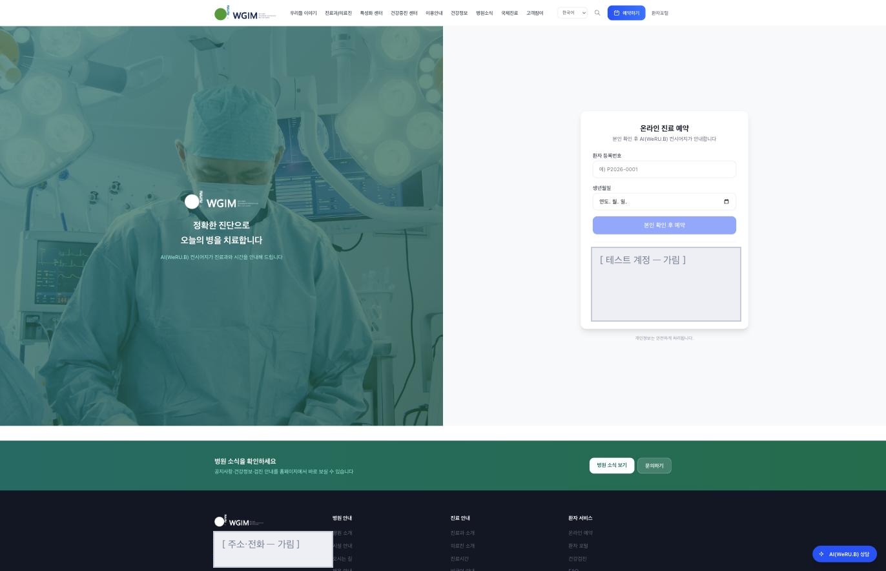
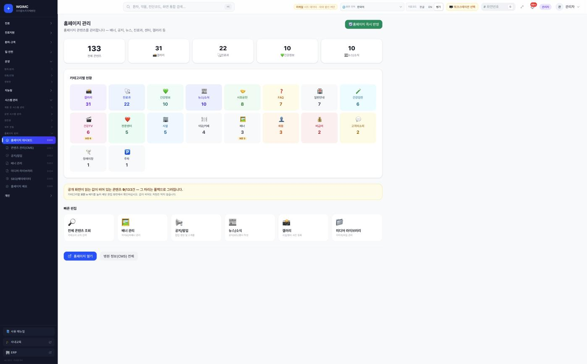
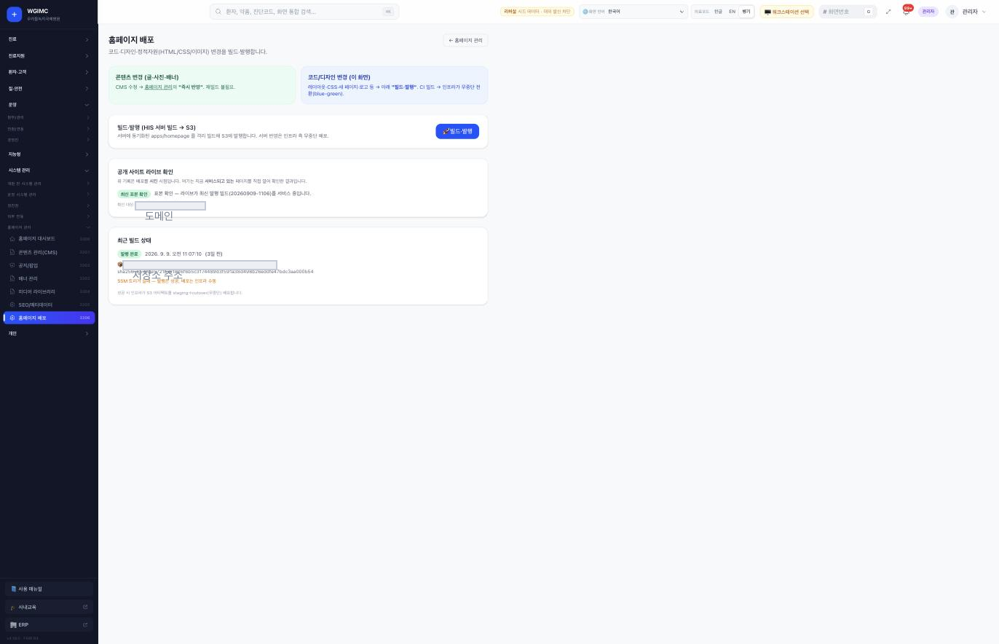
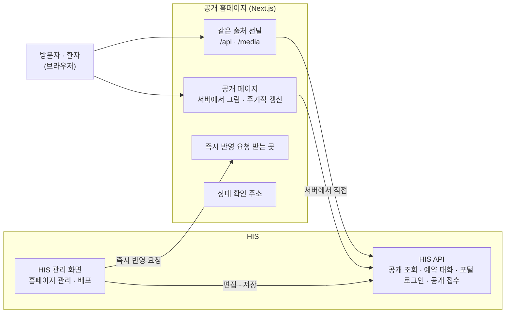
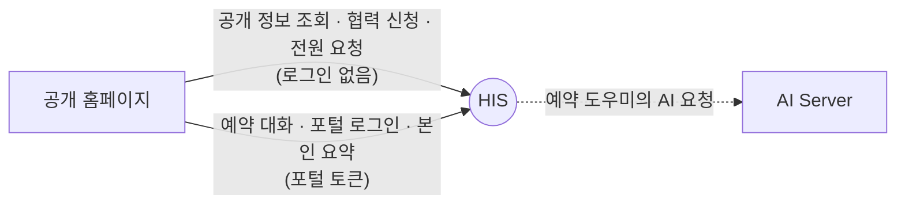

# 공개 홈페이지 — 병원의 바깥 창구

**Public website — the hospital's front window on the web**

> 프로젝트 소개서 · 읽는 사람: **의료 전산담당자** · 기준: HIS 저장소의 **현재 개발본**(2026-09-29 · 끝의 [이 문서의 근거](#이-문서의-근거)) · [소개서 목록](README.md)

---

## Introduction (English)

The public website is what a patient sees before they ever meet the hospital: who the hospital is, which departments and doctors it has, the clinic schedule, health checkup programmes, how to find the building, and how to book. It also offers an AI booking helper: after the patient confirms who they are, the helper talks with them about their symptoms and suggests candidate departments. It suggests; the patient chooses the date and time, and the booking goes into HIS.

For an IT team, the key fact is that the website **has no database of its own**. It is a separate Next.js application that lives in the HIS repository and ships with HIS. Everything it shows comes from HIS: public information through HIS public APIs, and editorial content (notices, banners, pop-ups, clinic hours) from the content screens inside HIS administration. The browser only ever talks to the website's own address; the website forwards `/api` and `/media` to HIS behind the scenes, so no cross-origin setup is needed.

The site is built in isolation from the rest of the repository, so a few shared pieces (input sanitising, the public fetch helper, clinic-hours reading, style presets, time formatting) are kept as exact copies, and a repository check fails if a copy drifts from the original. When a lookup to HIS fails, pages say "could not load" rather than "there are none"; clinic hours are shown only as registered in the content screens, never from a fixed value in code.

What is not there yet, stated plainly: institution details (name, contact, address) still live in code files — the one exception to "everything comes from HIS"; the HIS address used for browser requests is fixed when the site is built, so each institution builds its own image; only short introduction pages exist in English, Japanese and Chinese; and the site was not installed during the September 2026 follow-along, so its connection to HIS has not yet been called for real. Details are in [What to know](#8-알아-둘-것).

---

## 1. 한 문장

> **EN** — The public website shows the hospital to the outside world and helps patients book, drawing everything except the hospital's name, contact and address from HIS. At a glance: usable only with HIS already running, after editing the hospital's details in code and building one image per institution — and it must be built from the current development line, because the release's code does not build.

**공개 홈페이지는 병원을 바깥에 소개하고 환자의 예약을 돕는 웹사이트이며, 보여 주는 내용은 병원 이름 · 연락처 · 주소를 빼고 모두 HIS 에서 가져옵니다.**

### 한눈에 — 도입 판단

| | |
|---|---|
| **지금 쓸 수 있나** | **조건부.** HIS 가 먼저 돌고 있어야 하고, 병원 이름 · 연락처 · 주소를 코드에서 고친 뒤 기관마다 따로 빌드해야 합니다(§8) |
| **세워야 하는 것** | Node 22 로 도는 웹 서버 하나 — 컨테이너 · 프로세스 관리자 · 관리형 호스팅 중 하나로 띄웁니다. 데이터베이스 · 캐시 · GPU 는 없습니다 |
| **먼저 있어야 할 것** | HIS(공개 API · 환자 포털 인증 · 홈페이지 관리 화면) · HIS 에 넣은 콘텐츠 · 기관의 개인정보처리방침 · 이용약관 · 비급여 고지 문안 · 빌드 결과를 올릴 발행 대상 |
| **받을 코드** | **통합 릴리즈 코드로는 빌드가 멈춥니다**(첫 화면 4장의 구문 오류). HIS 저장소 **현재 개발본**의 `apps/homepage` 를 받습니다 · [소스 받기](../SOURCES.md). [구축 가이드 S2](../build-guide/S2-patient-access.md)는 설정 순서로 참고합니다 |
| **실제로 확인된 것** | 없음. 2026년 9월 시험 설치에서 이 앱은 설치하지 않았고, HIS 와의 두 연결은 코드를 읽어 판정한 것입니다 |
| **아직 모르는 것** | 방문자 규모에 맞춘 사양 · 콘텐츠 전송망이 필요한지 · 예약 대화를 얼마나 보관하는지 · 즉시 반영이 실패했을 때 관리 화면이 어떻게 보여 주는지 |

병원 정보 체계에서 홈페이지는 **환자 접점**(환자가 병원과 처음 만나는 자리)에 있습니다. 자기 데이터베이스가 없고, 진료과 · 의료진 · 공지 같은 사실의 원본은 HIS 에 있습니다. 홈페이지는 그것을 보여 주는 창입니다.

예외는 **병원 이름 · 연락처 · 주소**입니다. 이것들은 아직 홈페이지의 코드 파일에 있습니다(§8).

## 2. 병원 업무의 어디에 쓰이나

> **EN** — Visitors and patients read it and book through it. Communications or front-office staff edit its content inside HIS administration. The IT team builds and publishes it.

| 누가 | 무엇을 하나(예) | 어디서 |
|---|---|---|
| 방문자 · 환자 | 병원 · 진료과 · 의료진 · 진료 일정 · 검진 · 이용 안내를 읽고 예약합니다 | 공개 홈페이지 |
| 홍보 · 원무 담당 | 공지 · 배너 · 팝업 · 진료시간 · 소개 글을 편집합니다 | HIS 관리 화면의 **홈페이지 관리** |
| 전산 담당 | 사이트를 빌드하고 발행하며, 실제로 어느 빌드가 서비스 중인지 확인합니다 | HIS 관리 화면의 **홈페이지 배포** · 서버 |

**장면으로 보면**

- **진료과를 찾는 환자** — 환자가 진료과 목록에서 의료진과 진료 일정을 봅니다. 이 내용은 HIS 에 등록된 진료과 · 의료진 정보에서 옵니다.
- **AI 예약 도우미** — 환자가 등록번호와 생년월일로 본인을 확인하면, 도우미가 증상을 대화로 묻고 진료과 후보를 제안합니다. 날짜와 시간은 환자가 고르고, 예약은 HIS 에 들어갑니다. 화면에는 「참고 — 최종 진단은 의사 상담」 문구가 함께 나옵니다.
- **진료시간이 바뀐 날** — 원무 담당이 HIS 관리 화면에서 진료시간 글을 고치면, 관리 화면이 홈페이지에 즉시 반영을 요청합니다. 사이트를 다시 빌드할 필요가 없습니다. 다만 즉시 반영은 양쪽의 비밀값이 짝지어져 있을 때만 됩니다. 즉시 반영이 안 되면 홈페이지가 저장해 둔 페이지가 갱신될 때까지(최대 1시간) 옛 글이 나갑니다. 실패했을 때 HIS 가 무엇을 알리는지는 §6 에 있습니다.

## 3. 할 수 있는 일

> **EN** — Fifty public pages in seven groups: about the hospital, care information, health checkups, AI-assisted booking, the patient's own summary, patient guides and support, and international pages. Content is edited in HIS; publishing is a separate, human step.

공개 페이지는 **50개**입니다(현재 개발본의 `page.tsx` 파일 수). 이 수와 아래 목록은 코드를 읽어 센 것이고, 사이트를 띄워 한 장씩 확인한 것은 아닙니다. 구성서의 36개는 통합 릴리즈 무렵 다른 규칙으로 센 값입니다(근거 절).

| 묶음 | 무엇이 들어 있나 |
|---|---|
| **병원 소개** | 병원 소개 · 시설 · 오시는 길 · 갤러리 · 사회공헌 · 병원 소식 · 채용 공고 · 사이트 검색 |
| **진료 안내** | 진료과 · 진료센터 · 의료진(상세 포함) · 진료 일정표 · 비급여 항목 안내 |
| **건강검진** | 검진 프로그램 목록 · 상세 · 절차 · 자주 묻는 질문 · 검진 수용 현황 |
| **예약(AI 보조)** | 본인 확인 → AI 예약 도우미 대화 → 진료과 후보 제안 → 날짜 · 시간 선택 |
| **본인 요약** | 본인 확인을 마친 환자에게 자기 진료 · 검사 · 복약 · 수납 · 예약 요약 카드를 보여 줍니다 |
| **이용 안내 · 고객 지원** | 입원 · 제증명 · 식사 · 응급 · 장례 · 주차 · 면회 · 환자 권리 안내, 건강정보, 자주 묻는 질문 · 고객의 소리, 개인정보처리방침 · 이용약관 |
| **국제 진료 · 협력** | 해외 환자 보험 · 협력 기관 · 상호운용성 안내, 협력 신청서와 전원 요청(HIS 접수로 보내고 접수번호 안내), 영어 · 일본어 · 중국어 소개 페이지 |

사이트 밖에서 HIS 가 하는 일:

- **콘텐츠 편집** — 공지 · 팝업 · 배너 · 미디어 라이브러리 · 검색 노출 설정(검색엔진에 보일 제목 · 설명) · 진료시간 글. 편집 화면이 「공개 화면 어디에 나오는지」와 「공개 화면이 읽는데 비어 있는 항목」을 알려 줍니다.
- **발행** — 홈페이지 배포 화면에서 사람이 빌드와 발행을 누릅니다. 사이트에는 **빌드 스탬프**(빌드 시각이 적힌 작은 파일 `/build-stamp.txt`)가 실리고, 배포 화면이 이 값을 대조해 새 빌드가 실제로 실렸는지 보여 줍니다.

### 화면으로 보기

> **EN** — Three screens from a rehearsal install with synthetic hospital data: the booking page, and two HIS administration screens that manage the site.

| | |
|---|---|
|  **온라인 진료 예약** — 본인 확인 뒤 AI 예약 도우미가 안내(HIS 직원 웹 안의 같은 모양 페이지에서 찍음) |  **홈페이지 관리(HIS)** — 콘텐츠 수와 「비어 있는 항목」 |
|  **홈페이지 배포(HIS)** — 콘텐츠 변경과 코드 변경을 나누고, 서비스 중인 빌드를 대조 | |

화면은 가상 병원 데이터가 든 리허설 설치본에서 찍었습니다(2026-09-12). 그때 공개 사이트 앱은 설치하지 않았습니다. HIS 직원 웹 안에도 같은 모양의 공개 페이지 묶음이 들어 있어, 예약 화면은 그쪽에서 찍은 것입니다. 이 앱이 그리는 화면과 모양은 같지만 같은 프로그램은 아닙니다. 더 많은 화면은 [공개 홈페이지 화면](../screens/homepage.md)에 있습니다.

## 4. 어떻게 만들어졌나

> **EN** — A standalone Next.js 15 app (React 19, Tailwind 4, four runtime dependencies) inside the HIS repository. It renders pages on the server from HIS public APIs, keeps each rendered page for 5 minutes to an hour, and throws a page away at once when HIS sends a refresh request. It proxies the browser's `/api` and `/media` calls to HIS and has no database or cache server. Because it is built with its own package install for a slim standalone image, shared logic is kept as exact copies checked against the originals.

| 구성 요소 | 무엇 | 기술 |
|---|---|---|
| **공개 페이지** | 서버에서 HIS 공개 API 를 불러 그립니다. 한 번 그린 페이지는 일정 시간(페이지에 따라 5분 ~ 1시간) 저장해 두었다가 다시 그립니다. 즉시 반영 요청이 오면 그 시간을 기다리지 않고 저장해 둔 페이지를 버립니다 | Next.js 15 · React 19 · Tailwind 4 |
| **같은 출처 전달** | 브라우저가 부르는 `/api` · `/media` 를 HIS 로 넘깁니다. 브라우저는 홈페이지 주소만 알면 됩니다 | Next.js 경로 재작성(받은 주소를 다른 곳으로 바꿔 넘기는 기능) |
| **즉시 반영 요청** | HIS 관리 화면이 콘텐츠를 저장한 뒤 부르는 곳. 비밀값이 맞아야 동작합니다 | Next.js 캐시 무효화(저장해 둔 페이지 버리기) |
| **상태 확인** | 기본은 이 앱의 프로세스가 살아 있는지만 답합니다. 요청할 때만 HIS 에 닿는지도 봅니다 | — |
| **기계 대조 사본** | 입력 정화 · 공개 조회 도우미 · 진료시간 읽기 · 표현 프리셋 · 시각 표기 — HIS 웹의 원본을 그대로 복사해 두고, 어긋나면 직원 웹의 자동 시험 하나가 실패합니다. 이 앱은 자기 패키지를 따로 설치해 빌드하므로 저장소의 공용 패키지를 가져다 쓸 수 없어서입니다 | — |

**데이터가 사는 곳**

- **이 앱에는 데이터베이스도 캐시 서버도 없습니다.** 모든 사실은 HIS 의 데이터베이스에 있고, 미디어 파일은 HIS 서버 디스크에 있습니다.
- 앱이 가진 것은 빌드 결과물과, Next.js 가 잠시 보관하는 그려 둔 페이지뿐입니다.
- 예외로 **병원 이름 · 연락처 · 주소는 코드 파일**(사이트 정보를 모은 파일 `src/lib/site-info.ts` 와 일부 페이지 문구)에 있습니다 — [8. 알아 둘 것](#8-알아-둘-것).

## 5. 다른 시스템과의 연결

> **EN** — The website talks only to HIS: public information and public submissions without login, and booking and patient-portal lookups with a portal token issued by HIS. Neither connection has been called for real yet — the site was not installed in the September 2026 follow-along. Where the built site is uploaded (a hosting destination) is a deployment target, not a connection, and each institution sets its own.

**홈페이지는 HIS 하나에만 붙습니다.** 다른 형제 시스템과 직접 연결은 없습니다. AI 예약 도우미의 AI 연산도 홈페이지가 하지 않고, HIS 를 거쳐 [AI Server](../systems/ai-server.md) 가 합니다.

| 상대 | 홈페이지가 보내는 것 | 받는 것 | 로그인 · 인증 방식 | 실제로 연결해 확인했나 |
|---|---|---|---|---|
| **HIS**(공개 정보) | 조회 요청 · 협력 신청 · 전원 요청 | 병원 정보 · 진료과 · 의료진 · 센터 · 소식 · 건강정보 · 채용 · 팝업 · 검진 프로그램과 수용 현황 · 비급여 | 없음(공개 경로) | 만들어져 있음 · 실제 연결 확인은 아직 |
| **HIS**(예약 · 포털) | 본인 확인 · 예약 대화 · 본인 정보 조회 | 예약 세션 · 진료과 후보 · 본인의 진료 · 검사 · 복약 · 수납 · 예약 요약 | 예약 대화는 공개 경로 · 본인 정보는 HIS 가 발급한 포털 토큰 | 만들어져 있음 · 실제 연결 확인은 아직 |

**포털 토큰**은 HIS 가 발급합니다. 환자가 HIS 의 포털 인증(환자 포털 로그인)을 마치면 HIS 가 내주고, 홈페이지는 그것을 붙여 본인 정보를 부릅니다. HIS 관리 화면이 홈페이지를 부르는 방향(즉시 반영 요청)은 공유 비밀값 하나로 확인합니다.

빌드한 사이트를 올리는 곳(발행 대상 · 클라우드 보관소 등)은 연결이 아니라 **배포 대상**이라 위 표에 넣지 않았습니다 — §6. 연결의 자세한 내용은 [연결 카드](../integration/cards/공개-홈페이지-to-his.md)와 [연결 상태 표](../RELEASES/2026.09/compatibility.md)에 있습니다.

## 6. 설치 · 운영

> **EN** — A small Node 22 server with no database and no GPU. The HIS address used for browser requests is fixed at build time, so each institution builds its own image. The repository carries three ways to run it: a container image, a process-manager configuration, and a managed-hosting build spec. HIS administration also has a build-and-publish button that runs a build script on the HIS server; its default target in the repository points at one particular cloud destination — an institution sets its own. Build from the current development line: at the release's pinned commit the site does not build. Traffic sizing was not measured.

### 필요한 것

| 항목 | 내용 |
|---|---|
| 서버 | Node 22 로 도는 작은 웹 서버 하나. **데이터베이스 · 캐시 · GPU 는 필요 없습니다**. 방문자 규모에 맞춘 사양이나 콘텐츠 전송망이 필요한지는 계측하지 않았습니다 |
| 먼저 있어야 할 것 | **HIS**(공개 API · 환자 포털 인증 · 홈페이지 관리 화면) |
| 기관이 준비할 것 | 병원 이름 · 연락처 · 주소(코드 파일 수정) · HIS 관리 화면의 콘텐츠(진료시간 글 · 소개 글 · 배너 등) · 개인정보처리방침 · 이용약관 · 비급여 고지의 기관 문안 |

### 띄우는 방식

저장소에 세 가지가 함께 있습니다. 어느 쪽이든 Node 서버 하나로 돕니다.

| 방식 | 무엇 |
|---|---|
| 컨테이너 | 앱 폴더의 Dockerfile(빌드 → 실행 이미지) |
| 프로세스 관리자 | pm2(서버에서 프로그램을 띄우고 멈추면 다시 살리는 도구) 설정 파일 — 빌드 결과물을 서버에서 실행 |
| 관리형 호스팅 | 클라우드 업체가 서버 운영을 대신하는 호스팅 서비스용 빌드 설정 파일 |

HIS 의 단독 운영용 compose 에는 홈페이지가 들어 있지 않습니다. 따로 띄웁니다. 아래 「빌드 · 발행」 단추도 compose 의 서비스가 아니라, HIS 서버에서 빌드 스크립트를 한 번 부르는 방식입니다.

### 꼭 넣어야 하는 설정

- **HIS 주소 두 벌** — 브라우저 요청을 넘길 주소(`HOMEPAGE_API_ORIGIN`)와 서버가 직접 부를 주소(`INTERNAL_API_URL`). 앞의 것은 **빌드할 때 결과물에 박혀 고정**되므로, 기관과 환경마다 따로 빌드합니다. 저장소의 기본값과 예시는 특정 설치본의 주소이므로 반드시 바꿉니다.
- **브라우저용 API 주소**(`NEXT_PUBLIC_API_URL`)는 비워 둡니다. 그래야 브라우저가 상대 경로로 부릅니다. 이름이 `NEXT_PUBLIC_` 으로 시작하는 값은 모두 빌드 때 박히므로, 바꾸면 다시 빌드합니다.
- **사이트 · 포털 공개 주소**(`NEXT_PUBLIC_SITE_URL` · `NEXT_PUBLIC_PORTAL_URL`) — 사이트맵(검색엔진에 알리는 페이지 목록)과 링크에 쓰입니다.
- **즉시 반영 비밀값**(`HOMEPAGE_REVALIDATE_SECRET`) — HIS 쪽 같은 이름의 값과 짝을 맞춥니다. HIS 쪽에는 공개 사이트 주소(`HOMEPAGE_PUBLIC_URL`)도 넣습니다.
- 즉시 반영이 안 될 때 — HIS 는 주소나 비밀값이 비어 있거나, 홈페이지에 닿지 못하거나, 홈페이지가 거절하면 오류로 답합니다. 관리 화면이 그 오류를 어떻게 보여 주는지는 확인하지 못했습니다.

### 발행 · 감시

- **콘텐츠 변경**은 HIS 관리 화면에서 저장하면 바로(또는 저장해 둔 페이지가 갱신될 때) 반영됩니다. **코드 변경**은 빌드와 발행을 거칩니다.
- HIS 관리 화면의 **「빌드 · 발행」 단추**는 HIS 서버에서 홈페이지를 빌드하고 결과물을 발행 대상에 올리는 스크립트를 부릅니다. 저장소에 적힌 발행 대상의 기본값은 특정 설치본의 클라우드 보관소입니다. 기관은 자기 발행 경로를 정하고, 발행 스크립트(`infra/scripts/build-homepage.sh`)가 읽는 환경 변수(`HOMEPAGE_S3`)로 바꿉니다.
- **빌드 스탬프**와 **원본 커밋 파일**이 사이트에 함께 실려, 지금 서비스 중인 빌드가 어느 것이고 어느 소스에서 나왔는지 기계로 확인할 수 있습니다.
- **상태 확인 주소**는 기본으로 이 앱의 프로세스만 확인합니다. 그래서 HIS 가 멈춰도 기본 확인에는 「살아 있음」으로 답합니다. HIS 까지 닿는지는 요청할 때만 보고, 장애 전환 판단은 인프라가 합니다.

자세한 설치 · 설정 순서: [구축 가이드 S2](../build-guide/S2-patient-access.md)(통합 릴리즈 `2026.09` 기준). 받을 코드는 §1 「한눈에」와 같습니다 — 통합 릴리즈 코드로는 빌드가 멈추므로 현재 개발본으로 빌드합니다(§9).

## 7. 이렇게 만든 이유

> **EN** — Four design choices: HIS is the single source of truth; a failed lookup is never shown as "none"; hospital facts come only from the content screens, never from constants in code; and the browser sees only one origin.

| 설계 | 왜 |
|---|---|
| **자기 데이터베이스가 없음** — 사실은 모두 HIS 에서 | 진료과 · 의료진 · 공지가 두 곳에서 따로 관리되면 홈페이지가 병원 안의 사실과 다른 말을 하게 됩니다. 원본은 HIS 하나입니다 |
| **조회 실패는 「없음」이 아니라 「불러오지 못함」** — 결과를 세 상태(답함 · 대상 없음 · 모름)로 받음 | HIS 가 잠시 멈춘 순간이 「채용 공고가 없습니다」 · 「의료진 정보를 찾을 수 없습니다」로 그려지고, 그 거짓 페이지가 저장돼 한동안 나가던 일을 막으려는 것입니다 |
| **병원 사실은 관리 화면에서만** — 진료시간은 HIS 에 등록된 글만 쓰고, 못 읽으면 「불러오지 못함 · 등록 안 됨」이라고 말함 | 코드에 박힌 진료시간이 관리 화면의 값과 달라도 병원 사실처럼 방문자와 검색엔진에 나가던 일을 막으려는 것입니다. 모르는 것을 아는 척하지 않습니다 |
| **브라우저는 홈페이지 주소 하나만** — `/api` · `/media` 를 홈페이지가 HIS 로 넘김 | 출처가 하나라 교차 출처 설정(CORS)이 필요 없습니다 |
| **격리 빌드 + 기계 대조 사본** | 홈페이지는 자기 패키지만 설치해 가벼운 단독 실행 이미지로 빌드됩니다. 빌드 설정 파일의 주석이 그 목적을 「슬림 이미지용 단독 산출물」로 적고 있습니다. 그래서 공용 패키지 대신 복사본을 두고, 복사본이 원본과 어긋나면 검사가 실패해 한쪽만 고쳐지는 일을 막습니다 |

이 원칙들의 뿌리는 HIS 와 같습니다 — [설계 기준은 어떻게 생겼나](../DESIGN-HISTORY.md).

## 8. 알아 둘 것

> **EN** — Institution details still live in code files (40 files carry the hospital name); the HIS address the browser goes through is fixed at build time; only short English, Japanese and Chinese pages exist; the default publish target in the repository belongs to one installation; and the site's connection to HIS has not been called for real. Public routes are rate-limited on the HIS side; how long booking-chat content is kept was not checked.

- 🔴 **병원 이름 · 연락처 · 주소가 코드 파일에 있습니다** — 사이트 정보 상수와 일부 페이지 문구에 특정 기관의 값이 들어 있습니다. HIS 저장소가 스스로 잡아 둔 병원명 기준선으로는 이 앱에서 40개 파일 · 70곳입니다. HIS 소개서의 124개 파일은 이 40개를 포함한 저장소 전체 수입니다. 자기 기관 정보로 바꾸려면 아직 코드를 고쳐야 합니다. 이것을 한 번에 바꾸는 도구는 저장소에서 찾지 못했습니다.
- 🔴 **브라우저 요청을 넘길 HIS 주소는 빌드할 때 고정됩니다** — 두 벌 가운데 앞의 것(`HOMEPAGE_API_ORIGIN`)입니다. 그래서 기관 · 환경마다 이미지를 따로 빌드합니다. 저장소의 기본값(Dockerfile · 예시 파일 · 발행 스크립트)은 특정 설치본을 가리키므로 모두 바꿉니다.
- 🔴 **실제 연결 확인이 아직입니다** — 2026년 9월 시험 설치에서 이 앱은 설치하지 않았습니다. HIS 와의 두 연결은 코드를 대조한 판정입니다.
- **다국어는 소개 페이지 수준**입니다 — 영어 · 일본어 · 중국어는 소개 페이지 한 장씩이고 나머지는 한국어입니다.
- **발행은 HIS 배포와 따로** 사람이 합니다. 발행 뒤 빌드 스탬프로 실렸는지 확인합니다.
- **공개 경로는 로그인 없이 누구나 부를 수 있습니다.** 어디까지를 공개로 둘지는 HIS 쪽 공개 경로 목록으로 확인합니다([연결 카드](../integration/cards/공개-홈페이지-to-his.md)). HIS 에는 요청 횟수 제한이 걸려 있고, 협력 신청 · 본인 확인 같은 경로는 더 낮게 잡혀 있습니다.
- **AI 예약 도우미의 대화를 얼마나 보관하는지**는 이 소개서에서 확인하지 못했습니다. 기관의 개인정보 처리 기준과 함께 HIS 쪽에서 확인합니다.
- 개인정보처리방침 · 이용약관 · 비급여 고지(건강보험이 적용되지 않는 항목의 가격 안내) · 의료광고 판단은 기관이 합니다. AI 예약 도우미의 진료과 제안은 참고 정보입니다([의료 면책 고지](../DISCLAIMER.md)).

전체 한계와 대체 수단: [공개 홈페이지 구성서 §10](../systems/homepage.md#10-한계와-대체-수단).

## 9. 통합 릴리즈 `2026.09` 이후 달라진 점

> **EN** — Since the integrated release pinned HIS on 2026-09-11, nine commits have touched the website. The most important for IT: at the pinned commit the site could not be built from the repository (four language landing pages had a syntax error) — this is fixed on the development line. Failed lookups now say "could not load", clinic hours come only from the content screens, fixed hospital facts were removed from the booking chat and checkup pages, and the package version now follows HIS.

이 자료의 다른 문서(구성서 · 구축 가이드 · 연결 표)는 **통합 릴리즈 `2026.09`**(HIS v4.18.0 · 2026-09-11)에 맞춰 쓰여 있습니다. 그 뒤로 HIS 저장소에 더해진 커밋 가운데 **홈페이지 앱을 건드린 것은 9개**입니다(모두 번호가 없는 개발본 · 2026-09-13~15).

| 영역 | 달라진 것 |
|---|---|
| **빌드** | 기준 커밋의 홈페이지 앱은 **영어 · 국제 · 일본어 · 중국어 첫 화면 4장의 구문 오류로 빌드가 멈추는 상태**였습니다(2026-09-03 커밋부터 · 저장소 기록). 현재 개발본에서 고쳐졌고, 타입 검사 도구와 기준선이 새로 생겼습니다 |
| **조회 실패 표시** | 채용 공고 · 소식 · 건강정보 · 의료진 · 진료과 · 전문센터 목록과 상세가 HIS 조회에 실패하면 「없음」 대신 「불러오지 못했습니다」를 보여 줍니다 |
| **진료시간** | 코드에 있던 진료시간 값을 지웠습니다. HIS 관리 화면에 등록된 글만 쓰고, 없거나 못 읽으면 그렇다고 말합니다. 검색엔진용 진료시간 표기도 등록된 값일 때만 냅니다 |
| **병원 사실 문구** | 예약 도우미와 검진 안내에 코드로 박혀 있던 주차 · 면회 시각 · 층별 배치 · 검진 운영시간 같은 문구를 걷어 내고, 안내 페이지와 대표전화로 넘기게 했습니다 |
| **예약 화면** | 예약 화면에 조건 없이 붙어 있던 시험용 안내를 걷어 냈습니다. 시험용 환자 목록은 직원 웹의 리허설 모드에서만 보입니다 |
| **시각 표기** | 예약 화면의 시각 표기를 HIS 전체와 같은 한국어 오전 · 오후 규칙으로 맞췄습니다 |
| **버전** | 앱 패키지 버전이 HIS 와 같은 번호(4.19.0)를 따릅니다. 전에는 1.0.0 으로 고정돼 있었습니다 |

## 10. 더 깊이

> **EN** — Where to go next.

| 알고 싶은 것 | 문서 |
|---|---|
| 설정 키 · 연동 · 한계 전체(통합 릴리즈 기준) | [공개 홈페이지 구성서](../systems/homepage.md) |
| 설치 · 설정 순서 | [구축 가이드 S2](../build-guide/S2-patient-access.md) |
| 화면 | [공개 홈페이지 화면](../screens/homepage.md) |
| 연결 하나를 자세히 | [연결 카드 — 공개 홈페이지 → HIS](../integration/cards/공개-홈페이지-to-his.md) · [공통 규약](../integration/contracts.md) |
| 뒷단인 HIS | [HIS 소개서](his.md) |
| 릴리즈 요약 | [통합 릴리즈 `2026.09` — 공개 홈페이지](../RELEASES/2026.09/systems/homepage.md) |
| 소스 | [소스 받기](../SOURCES.md) — HIS 저장소 `seanshin/werubyHIS` 의 `apps/homepage` |

---

## 이 문서의 근거

> **EN** — What this introduction was written from.

| 항목 | 값 |
|---|---|
| 읽은 것 | HIS 저장소의 **현재 개발본** — 커밋 `f596d24589e6`(2026-09-29) 의 `apps/homepage` 와 HIS 쪽 발행 스크립트 · 작업 트리의 미커밋 변경은 읽지 않음. `apps/homepage` 는 HIS 소개서가 읽은 커밋 `a39f60fc9d7c` 와 내용이 같습니다 |
| 비교 기준 | 통합 릴리즈 `2026.09` — 커밋 `e9d303984f80`(v4.18.0 · 2026-09-11) |
| 센 방법 | 페이지 = `apps/homepage/**/page.tsx` 파일 수 · 달라진 커밋 = `git log e9d30398..HEAD -- apps/homepage` 의 커밋 수 — 2026-09-29 에 센 값. 병원명 고정 = HIS 저장소의 병원명 기준선 시험 파일에 동결된 목록 중 `apps/homepage` 항목(40개 파일 · 70곳 · HIS 소개서가 읽은 커밋). 구성서의 36개는 통합 릴리즈 무렵(2026-09-10) 이 자료의 규칙으로 센 값이라 수가 다릅니다 |
| 이 소개서가 더 확인한 것 | 즉시 반영 요청이 저장된 페이지를 버리는 방식(`revalidate` 경로) · 격리 빌드의 목적(빌드 설정 주석) · HIS 공개 경로의 요청 횟수 제한 — HIS 소개서가 읽은 커밋에서 읽음 |
| 실제 연결 확인 | 없음 — 2026년 9월 따라가기에서 설치하지 않음 |
| 사실 확인 | HIS 담당의 확인 전 · 생태계 자료 측이 저장소를 읽고 쓴 것 |
