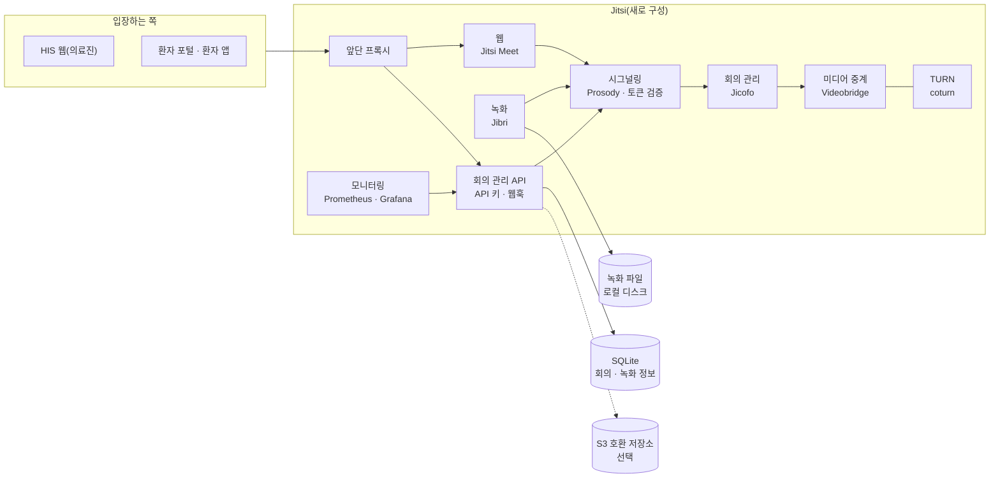
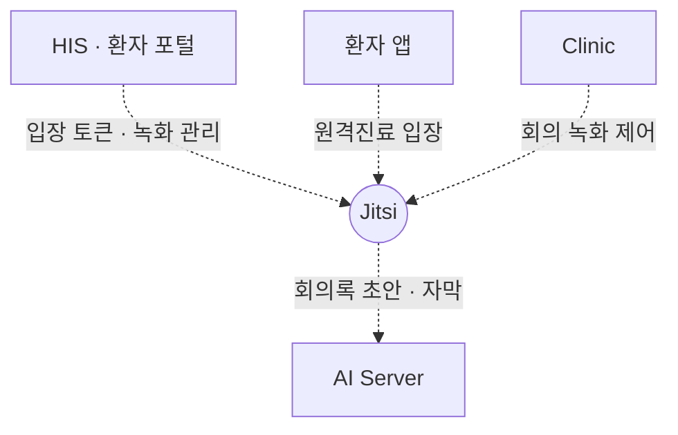

# Jitsi — 원격진료 화상 서버

**Jitsi (hospital-jitsi) — the self-hosted video server for telemedicine**

> 프로젝트 소개서 · 읽는 사람: **의료 전산담당자** · 기준: Jitsi 저장소의 **현재 개발본**(2026-09-29 · 끝의 [이 문서의 근거](#이-문서의-근거)) · [소개서 목록](README.md)

> **지금은 쓸 수 없습니다.** 현재 설치본은 동작하지 않고, 원격진료가 필요한 기관은 **새로 구성해야** 합니다. 이 소개서는 저장소의 코드와 기록이 **무엇을 제공하도록 만들어져 있는지**를 설명합니다 — 아래에 적힌 기능은 지금 돌아가는 것이 아니라, 새로 구성했을 때 얻게 될 것입니다.

---

## Introduction (English)

Jitsi is the video server behind telemedicine in this ecosystem. It packages the open-source Jitsi Meet stack — web client, XMPP signalling, conference focus and media relay — together with a TURN server for difficult networks, server-side recording, a REST API for managing meetings, and Prometheus/Grafana monitoring, all as containers the hospital runs on its own server.

**It is not usable today.** The current installation does not work, and every connection to it in the ecosystem's connection table is marked "not usable now". An institution that needs video visits has to build it anew. This introduction therefore describes what the repository provides and what building it involves, not a running service.

The design is straightforward. A doctor opens a telehealth session in HIS; HIS signs a short token with a secret it shares with the video server, and the browser opens the meeting room with that token — the doctor as host, the patient as guest from the patient portal or app. The signalling server checks the token before anyone enters. A separate REST API wraps Jitsi so other systems can schedule meetings, issue join links, control participants, start and stop recordings and receive webhooks.

Recording and AI are optional. Recordings carry a security level and an access log, and expire after a retention period. When the AI Server is connected, it can draft minutes, summaries and action items from a recording, and provide live Korean captions and English translated captions — drafts only; clinicians decide what, if anything, goes into the record.

What to know before building it — the shared-secret sign-in, the open network ports, the recording host requirements, and the blocked mobile web path — is collected in [What to know](#8-알아-둘-것).

---

## 1. 한 문장

> **EN** — Jitsi is the hospital's own video server for telemedicine and remote consultation; the current installation does not work and must be built anew.

**Jitsi 는 원격진료 · 원격협진 화상을 병원이 직접 운영하는 화상 서버이며, 지금 설치본은 동작하지 않아 새로 구성해야 합니다.**

병원 정보 체계에서 Jitsi 는 **화상의 자리**입니다. 누가 어느 진료에 들어오는지(원격진료 세션 · 환자 · 의사)는 HIS 가 정하고, Jitsi 는 그 방을 열고 영상과 음성을 잇습니다. 오픈소스 Jitsi Meet 을 그대로 쓰고, 병원용 관리 API · 녹화 · 모니터링 · 한국어 화면을 더한 묶음입니다.

## 2. 병원 업무의 어디에 쓰이나

> **EN** — Doctors host video visits from HIS, patients join as guests from the patient portal or app, specialists join remote consultations, and IT staff manage recordings and watch the monitoring dashboards. The scenes below describe what the code is built to do, not a working service.

아래는 **코드가 그리는 흐름**입니다. 지금 설치본에서는 동작하지 않습니다.

| 누가 | 무엇을 하나(예) |
|---|---|
| 의사 | HIS 원격진료 화면에서 방을 열고 진행자로 입장 · 녹화 시작과 중지 |
| 환자 | 환자 포털 · 환자 앱에서 게스트로 입장 — 입장 전 카메라 · 마이크 확인과 동의 |
| 협진 의료진 | 원격협진 · 상담 방에 입장 |
| 전산 담당 | 녹화 목록 · 메모 · 보존 관리 · 모니터링 대시보드 확인 · API 키 발급 |

**장면으로 보면**

- **원격진료 한 건** — 의사가 HIS 에서 원격진료 세션을 엽니다. HIS 가 의사용 토큰과 환자용 토큰을 따로 만들고, 의사는 진행자로, 환자는 포털이나 앱에서 게스트로 같은 방에 들어옵니다. 시그널링 서버가 토큰을 확인한 뒤에만 입장을 허용합니다.
- **녹화와 회의록 초안** — 의사가 녹화를 켜면 녹화 중이라는 표시가 진행자에게 보입니다. AI Server 를 연결해 두었다면 녹화에서 녹취록 · 요약 · 할 일의 **초안**을 받고, 진료기록으로 옮길지는 의료진이 정합니다.

## 3. 할 수 있는 일

> **EN** — Seven groups, as written in the code and records: token-based entry, a meeting-management REST API with three permission levels, meeting and participant events with webhooks, server-side recording with security levels and retention, optional AI drafts and live captions, monitoring, and protective limits.

기준이 되는 코드와 기록에 적힌 기능입니다. 지금 동작하는 것은 아닙니다.

| 묶음 | 무엇이 들어 있나 |
|---|---|
| **화상 진료 입장** | HIS 가 발급한 토큰으로 방에 들어가고, 시그널링 서버가 토큰을 검증합니다. 입장 전 카메라 · 마이크 미리보기와 동의 절차 · 한국어 화면 |
| **회의 관리 API** | 회의 예약 · 목록 · 설정 변경 · 종료 · 참가자 목록 · 내보내기 · 음소거 · 참가 토큰 발급 · 참가 주소 생성 · 녹화 시작 · 중지 · 상태. API 명세(OpenAPI) 화면이 함께 나옵니다. API 키마다 권한을 세 단계(관리 · 운영 · 읽기 전용)로 나눕니다 |
| **이벤트** | 참가자 입장 · 퇴장과 회의 상태 변화를 기록하고, 회의 시작 · 종료 · 참가자 입장 · 퇴장 · 녹화 시작 · 완료를 웹훅으로 알립니다 |
| **녹화** | 서버 쪽 녹화 · 녹화 관리 화면(검색 · 메모 · 태그) · 녹화 보안 등급 4단계와 접근 기록 · 보존 기간이 지나면 자동 만료 · 녹화 중 표시 · 객체 저장소 업로드(선택) |
| **AI 보조(선택)** | 녹화 회의록 · 요약 · 할 일 · 주요 장면 **초안** · 실시간 한국어 자막 · 영어 번역 자막 · 채팅 번역 병기 |
| **모니터링** | 서비스 상태 · 사용량 · 녹화 저장 용량 · API 트래픽 대시보드와 알림 규칙 |
| **보호 장치** | 중계 서버의 내부망 접근 차단 · 웹훅은 공개 https 주소로만 · 토큰 알고리즘 고정 · 요청 속도 · 본문 크기 제한 · 컨테이너 자원 상한 |

### 화면으로 보기

> **EN** — No captures: the current installation does not run.

캡처 없음 — 현재 설치본이 동작하지 않습니다. 캡처는 새로 구성한 뒤에 넣습니다([Jitsi 화면](../screens/jitsi.md)).

## 4. 어떻게 만들어졌나

> **EN** — Nine containers from one compose file: the Jitsi Meet web client, Prosody (XMPP signalling with token check), Jicofo (conference focus), Videobridge (media relay), coturn (TURN), Jibri (recording), a meeting-management API (Node.js 20, Hono, SQLite), Prometheus and Grafana. Live captions add two more containers from a second compose file. Meeting metadata sits in SQLite; recordings sit on local disk with optional S3-compatible upload.

| 구성 요소 | 무엇 | 기술 |
|---|---|---|
| **웹 · 시그널링 · 회의 관리 · 미디어 중계** | 화상 회의 자체 — 방 · 입장 · 영상과 음성 중계 | Jitsi Meet 구성요소(`stable-9823` 이미지) |
| **TURN** | 병원 · 가정의 방화벽 뒤에서도 영상이 이어지게 중계 | coturn 4.6 |
| **녹화** | 가상 화면에 브라우저를 띄워 회의를 녹화 | Jibri |
| **회의 관리 API** | Jitsi 를 감싸 다른 시스템이 프로그램으로 회의를 다루게 하는 REST API | Node.js 20 · Hono · SQLite |
| **모니터링** | 지표 수집과 대시보드 | Prometheus v2.54.1 · Grafana 11.2.0 |
| **자막 구성(선택)** | 실시간 음성 인식 · 번역 자막을 AI Server 와 잇는 중계 | 별도 구성 파일 · Python 3.12 |

**데이터가 사는 곳**

| 저장소 | 무엇이 들어 있나 |
|---|---|
| **SQLite**(회의 관리 API 안) | 회의 · 참가자 · 녹화 정보 · 웹훅 · API 키 · 전사 |
| **로컬 디스크** | 녹화 파일 — 보존 기간이 지나면 자동 만료 |
| **S3 호환 객체 저장소**(선택) | 녹화 파일 사본 |
| **Prometheus** | 서비스 지표 |

## 5. 다른 시스템과의 연결

> **EN** — HIS signs entry tokens for doctors and patients with a shared secret; the patient portal and app open the room; HIS and Clinic manage recordings through the meeting API; recordings and live audio can go to the AI Server. Every one of these connections is marked not usable now, and one more (a short-lived token from an HIS identity provider) exists only as a design.

**모든 연결이 지금은 쓸 수 없습니다.** 새로 구성한 뒤 연결마다 실제로 불러 상태를 다시 판정합니다.

| 상대 | Jitsi 가 주는 것 | Jitsi 가 받는 것 | 로그인 · 인증 방식 | 실제로 연결해 확인했나 |
|---|---|---|---|---|
| **HIS**(의료진 · 환자 포털) | 화상 방 · 녹화 목록 | 입장 토큰(의사 = 진행자 · 환자 = 게스트) · 녹화 메모 · 삭제 | **공유 비밀키**로 서명한 토큰 · 회의 관리 API 키 | 지금은 쓸 수 없음 |
| **환자 앱** | 화상 방 | 입장(대기실 기록 뒤 화상 주소 열기) | HIS 가 서명한 토큰 | 지금은 쓸 수 없음 |
| **Clinic** | 녹화 스트림 · 회의 분석 | 녹화 제어 | 회의 관리 API 키 | 지금은 쓸 수 없음 |
| **AI Server** | 녹화 · 음성 조각 | 회의록 · 요약 초안 · 자막 · 번역 | 발급된 API 키 | 지금은 쓸 수 없음 |
| HIS 신원 제공자 | — | 단기 토큰 | — | 설계만 있음 |

연결마다의 자세한 내용은 [HIS → Jitsi](../integration/cards/his-to-jitsi.md) · [Jitsi → AI Server](../integration/cards/jitsi-to-ai-server.md) 카드와 [연결 상태 표](../RELEASES/2026.09/compatibility.md)에 있습니다.

## 6. 설치 · 운영

> **EN** — What building it anew takes: a server with a public domain and public address, TLS certificates, UDP/TCP media and TURN ports open at every firewall layer, a host sound device and extra privileges for the recording container, and storage sized to the retention period. No GPU. The shared token secret must be the same in HIS, Jitsi and the meeting API. The repository carries scripts to generate component passwords, check health, run an integration test and back up recordings, plus a guide for deploying inside a hospital network.

**새로 구성할 때의 요구사항**입니다. 지금 설치본을 되살리는 절차가 아닙니다.

### 필요한 것

| 항목 | 내용 |
|---|---|
| 서버 | 컨테이너 9개(자막을 켜면 2개 추가). **GPU 는 필요 없습니다** — 음성 인식 · 번역 · 회의록 연산은 AI Server 가 맡습니다 |
| 네트워크 | 공개 도메인 · 공인 주소 · TLS 인증서. 미디어 중계와 TURN 용 UDP · TCP 포트를 **방화벽의 모든 계층에서** 열어야 합니다 — 한쪽만 열면 3명 이상 통화에서 영상이 끊긴다고 저장소가 적고 있습니다. 포트 목록은 소스 저장소 README 에 있습니다 |
| 녹화 | 녹화 컨테이너는 호스트의 **사운드 장치와 추가 권한**이 필요합니다. 저장 공간은 보존 기간에 맞춰 기관이 산정합니다 |
| 먼저 있어야 할 것 | **HIS**(입장 토큰을 만듦) · AI Server(선택) |
| 함께 맞출 값 | 토큰 서명 **공유 비밀키 · 앱 식별자를 HIS · Jitsi · 회의 관리 API 세 곳에 같게** 넣습니다. HIS 쪽에는 화상 서버 주소도 넣습니다 |

### 세우는 순서(저장소 안내)

| 단계 | 하는 일 |
|---|---|
| 1 | 설정 파일 작성 — 도메인 · 공인 주소 · 공유 비밀키 · TURN 비밀값 |
| 2 | 구성요소 비밀번호를 스크립트로 생성 |
| 3 | 컨테이너 기동 |
| 4 | 상태 확인 스크립트 — TURN 중계 할당까지 확인합니다 |
| 5 | 앞단 프록시를 저장소의 경로별 설정대로 구성 · 인증서 |

- **운영 전에 정할 것** — 입장 인증 켜기 · API 키 발급과 권한 · 녹화 사용 여부 · 녹화 보존 기간과 기본 보안 등급 · 녹화 외부 저장 여부 · 운영에서 API 명세 화면 끄기.
- **병원 내부망에 두는 경우** — 저장소에 내부망 배포 안내 문서가 있습니다(직원 · 환자가 같은 망이나 VPN 안에 있는 전제). 병원 밖 환자가 들어오는 원격진료라면 공개 주소와 TURN 이 필요합니다.

### 백업 · 감시

- **백업** — 녹화 파일 백업 스크립트가 있습니다. 회의 관리 API 의 SQLite 파일은 기관이 함께 백업합니다.
- **감시** — Prometheus 가 지표를 모으고 Grafana 대시보드가 서비스 상태 · 사용량 · 저장 용량을 보여 줍니다. 대시보드는 기본으로 서버 안에서만 열립니다. 알림 규칙과 알림 전달 주소를 둘 수 있습니다.
- **점검** — 상태 확인 스크립트와 통합 시험 스크립트가 있습니다.

설정 키 전체: [Jitsi 구성서 §6](../systems/jitsi.md#6-주요-설정). 새로 구성하는 절차는 확인한 뒤 [구축 가이드](../build-guide/)에 싣습니다.

## 7. 이렇게 만든 이유

> **EN** — Four choices: video is self-hosted; Jitsi is wrapped by a REST API rather than modified; entry is by a signed token checked before anyone joins; and recordings carry security levels and an access log, with AI kept optional.

| 설계 | 왜 |
|---|---|
| **화상을 자체 호스팅** | 이 자료의 해석으로는 바깥 화상 서비스에 기대지 않는 선택입니다(저장소는 이유를 직접 적지 않았습니다). 대신 서버 · 방화벽 · 인증서 운영을 기관이 집니다([시스템별 설계 선택](../DESIGN-HISTORY-SYSTEMS.md#5-시스템마다-무엇을-정하고-무엇을-포기했나)) |
| **Jitsi 를 고치지 않고 REST API 로 감쌈** | Jitsi 에는 다른 시스템이 프로그램으로 회의를 만들고 녹화를 제어할 관리 API 가 없어서입니다(저장소 기획서). 감싸 두면 HIS · Clinic 이 같은 방식으로 부릅니다 |
| **입장은 서명된 토큰으로** — 의사는 진행자, 환자는 게스트 | 입장할 때 서명된 토큰을 확인하고, 역할(진행 권한)은 HIS 가 정합니다 |
| **녹화에 보안 등급과 접근 기록** | 진료 영상은 환자 개인정보라, 등급별로 접근을 달리하고 누가 봤는지 남기려는 것입니다(저장소 기획서) |
| **AI 는 선택 구성 · 결과는 초안** | AI Server 가 없어도 화상 서버로 동작하고, 회의록을 진료기록으로 옮길지는 의료진이 정하게 |

## 8. 알아 둘 것

> **EN** — The current installation does not work and has to be built anew; sign-in relies on one secret shared by three places; the mobile web path is on hold and blocked; live captions started as a trial and are assist-only; and the README's release table stops at v2.3.0 while tags go to v2.10.0.

- 🔴 **현재 설치본은 동작하지 않습니다** — 연결도 모두 「지금은 쓸 수 없음」입니다. 원격진료가 필요한 기관은 새로 구성하고, 연결을 하나씩 실제로 불러 확인합니다.
- 🔴 **입장이 공유 비밀키 하나에 기댑니다** — HIS · Jitsi · 회의 관리 API 세 곳이 같은 비밀키를 가져야 하고, 교체할 때도 세 곳을 함께 바꿉니다. 보관 · 교체 절차와 담당자를 정해 둡니다.
- **모바일 웹 입장은 보류 · 차단돼 있습니다** — 휴대전화로 들어오는 환자의 입장 방법은 새로 구성할 때 정합니다(환자 앱 연결도 지금은 쓸 수 없음).
- **실시간 자막 · 번역은 시험 구현에서 시작한 선택 구성**입니다. 무음 구간 오인식 완화가 남은 과제로 적혀 있습니다 — 자막은 보조로만 씁니다.
- **원격진료 규제 대응 표기는 저장소에서 찾지 못했습니다** — 원격진료 허용 범위 · 녹화 보존 · 동의는 나라마다 달라 기관이 판단합니다.
- **버전 표기가 둘입니다** — 코드 선언은 1.0.0, 태그는 v2.10.0 까지 이어졌고, README 의 릴리즈 표는 v2.3.0 에서 멈춰 있습니다.

전체 한계와 대체 수단: [Jitsi 구성서 §10](../systems/jitsi.md#10-한계와-대체-수단).

## 9. 통합 릴리즈 `2026.09` 이후 달라진 점

> **EN** — The current development line is the same commit as the integrated release `2026.09` — nothing has changed.

기준 커밋과 같습니다 — 달라진 점 없음.

## 10. 더 깊이

> **EN** — Where to go next.

| 알고 싶은 것 | 문서 |
|---|---|
| 구성 · 설정 키 · 연동 · 한계 전체 | [Jitsi 구성서](../systems/jitsi.md) |
| 이 버전의 변경 내용 | [릴리즈 요약](../RELEASES/2026.09/systems/jitsi.md) |
| 화면 | [Jitsi 화면](../screens/jitsi.md) |
| 연결 하나를 자세히 | [연결 카드](../integration/cards/) · [공통 규약](../integration/contracts.md) |
| 제3자 구성요소 약관(Grafana 는 AGPL) | [THIRD_PARTY](../THIRD_PARTY.md#1-별도-서비스로-쓰는-제3자-서버) |
| 소스 | [소스 받기](../SOURCES.md) — 저장소 `seanshin/hospital-jitsi` |

---

## 이 문서의 근거

> **EN** — What this introduction was written from.

| 항목 | 값 |
|---|---|
| 읽은 것 | Jitsi 저장소의 **현재 개발본** — 커밋 `0984fbec7177`(마지막 커밋 2026-07-24 · 태그 `v2.10.0` 뒤 9커밋 · 코드 선언 `1.0.0`) · 2026-09-29 에 읽음 · 작업 트리의 미커밋 변경은 읽지 않음 |
| 비교 기준 | 통합 릴리즈 `2026.09` — 커밋 `0984fbec7177`(같은 커밋) |
| 센 방법 | 컨테이너 = 기본 구성 파일의 최상위 서비스 수(선택 구성 파일의 2개는 따로) · 회의 관리 API 의 저장 = 스키마 파일의 테이블 |
| 실제 연결 확인 | 없음 — 현재 설치본이 동작하지 않고, 2026-09 따라가기에서도 설치하지 않음 |
| 사실 확인 | Jitsi 담당의 확인 전 · 생태계 자료 측이 저장소를 읽고 쓴 것 |
