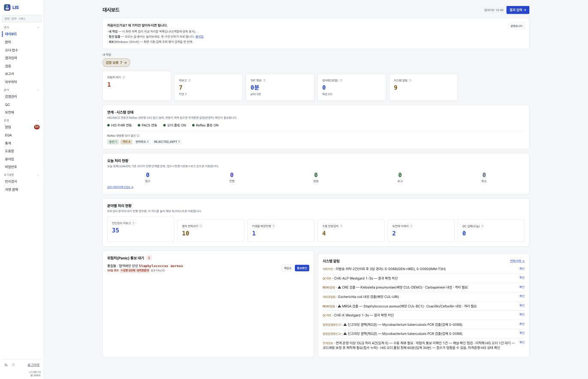
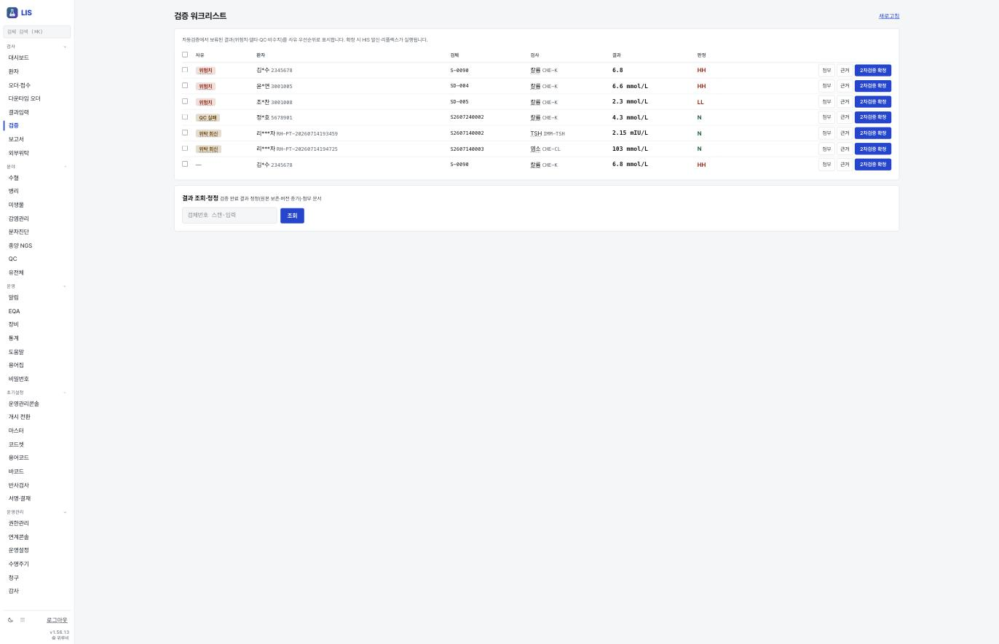
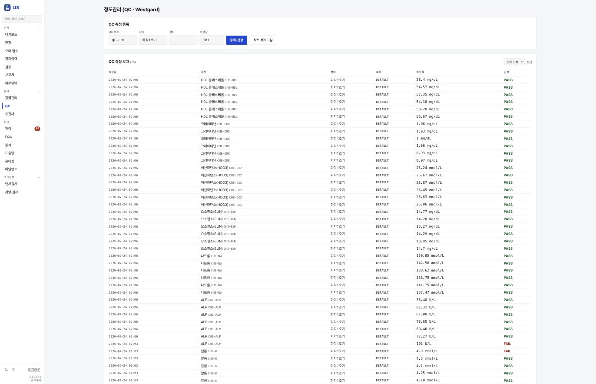
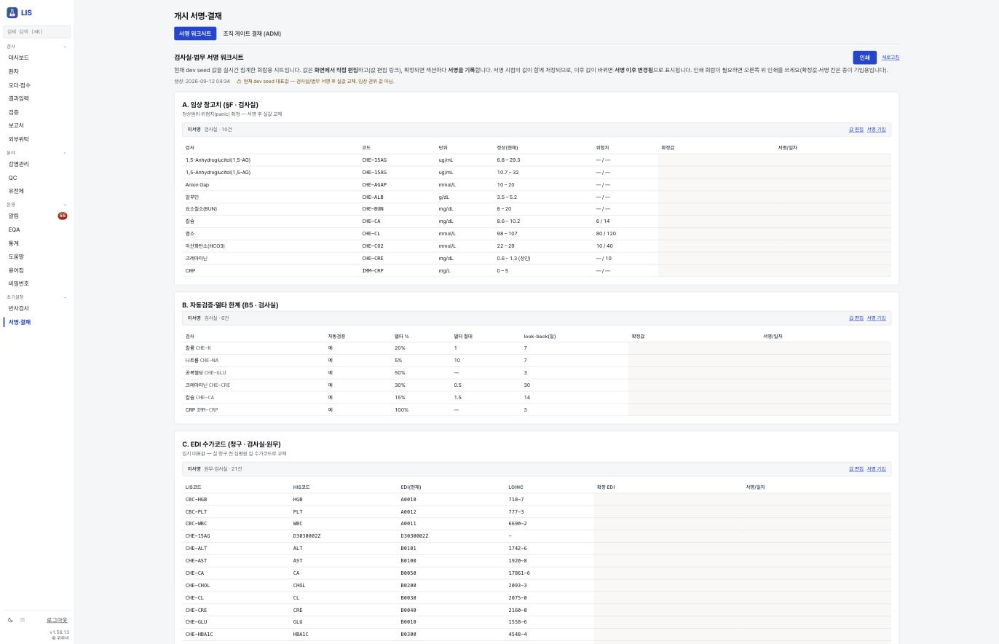
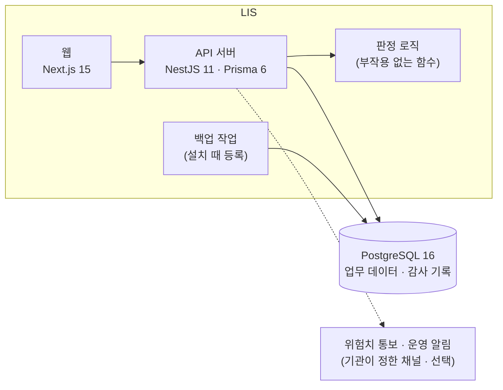
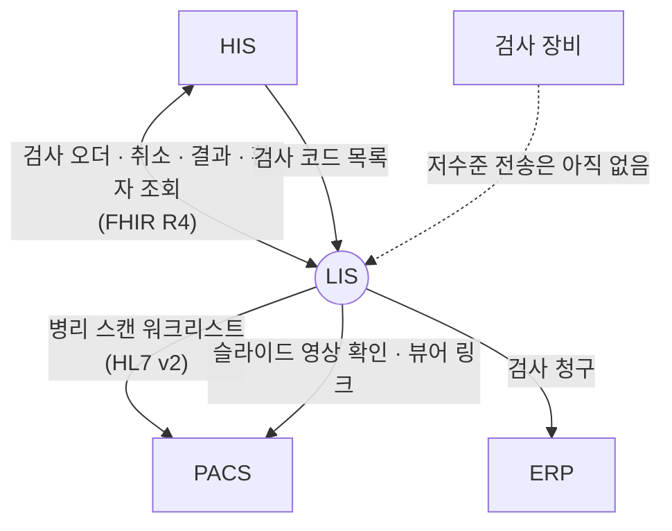

# LIS — 검사실의 업무 시스템

**LIS — the laboratory's working system**

> 프로젝트 소개서 · 읽는 사람: **의료 전산담당자** · 기준: LIS 저장소의 **현재 개발본**(2026-09-29 · 끝의 [이 문서의 근거](#이-문서의-근거)) · [소개서 목록](README.md)

---

## Introduction (English)

LIS is the laboratory information system of the ecosystem. It covers five fields in one system — clinical chemistry and haematology, microbiology, pathology, transfusion, and molecular and genomic testing (including NGS) — across the whole path from receiving an order and labelling a specimen to verifying the result, reporting it back and capturing the charge. Laboratory staff, pathologists, blood-bank staff, genomic reviewers and genetic counsellors each see the part that belongs to their role.

For an IT team, the key facts are these. LIS is a separate system with its own login, its own database and its own install script; one installation serves one institution. It takes test orders from HIS by pulling them over the international FHIR R4 standard every five minutes and sends verified results back the same way. It registers pathology slide scans with PACS and sends laboratory charges to ERP. Several of these links — orders, cancellations, results, patient lookup, test-code import, pathology worklist and viewer link, and billing — were called for real between fresh installs in September 2026.

LIS is built so that a result is not released on a guess. Automatic verification stops when a reference range is missing or units do not match; the person who entered a result cannot verify it; critical values close only when a read-back is recorded; transfusion issue has an independent ABO check; and genomic secondary findings stay hidden — not even counted — without consent. Changes and sensitive views go into an audit log chained by hashes and protected against edits by database triggers. The genomic interpretation helper drafts from a built-in knowledge base and ACMG rules; it sends nothing outside, and a reviewer confirms every interpretation.

What is not there yet, stated plainly: automatic result capture from analysers lacks the low-level serial/TCP link, so a middleware box or file import is needed; the HL7 v2 fallback path with HIS is not built; three LIS↔HIS links (reflex add-on orders, transfusion consent lookup, organisational approval lookup) are built but not yet confirmed end to end; and the install script needed workarounds in the follow-along. Details are in [What to know](#8-알아-둘-것).

---

## 1. 한 문장

> **EN** — LIS runs the laboratory's work from order to verified result across five fields, and exchanges orders and results with HIS over FHIR.

**LIS 는 진단검사 · 미생물 · 병리 · 수혈 · 유전체 검사의 전 과정을 처리하는 검사실 시스템이며, HIS 에서 검사 처방을 받아 검증된 결과를 돌려줍니다.**

병원 정보 체계에서 LIS 는 **임상 부서** 계층에 있습니다. 검사 처방의 원본은 HIS 에 있고, 검체 · 결과 · 정도관리 · 검사실 판정의 원본은 LIS 에 있습니다.

## 2. 병원 업무의 어디에 쓰이나

> **EN** — Laboratory staff, verifying physicians, microbiologists, pathologists, blood-bank staff, genomic reviewers and genetic counsellors, plus an administrator and an auditor role — ten roles in all, each seeing only its own menu.

역할은 **10개**이고, 왼쪽 메뉴는 역할별로 보입니다(저장소의 권한 설계 문서 기준).

| 누가 | 무엇을 하나(예) |
|---|---|
| 접수 담당 | 검체 접수 · 라벨 발행 · 검체 상태 관리 |
| 임상병리사 | 결과 입력 · 1차 검증 · 정도관리 |
| 검증의(의사) | 2차 검증 · 결과 확정 |
| 미생물 검사자 | 배양 · 동정 · 감수성 |
| 병리 판독의 | 병리 판독 · 서명 |
| 수혈 담당 | 혈액 입고 · 교차시험 · 출고 |
| 유전체 판독의 · 유전상담사 | 변이 해석 · 보고서 / 동의 · 유전상담 |
| 관리자 · 감사자 | 마스터 · 권한 · 통계 / 감사 기록 조회 |

**장면으로 보면**

- **아침 채혈 한 건** — 의사가 HIS 에서 혈액검사를 처방하면, LIS 가 5분 안에 가져가 접수 목록에 올립니다. 접수 담당이 라벨을 붙이고, 장비 결과가 들어오면 자동 검증을 거칩니다. 보류된 결과만 검증 목록에 올라오고, 검증의가 확정하면 결과가 HIS 차트로 돌아갑니다.
- **위험치** — 결과가 위험 수준이면 검사실이 담당 의료진에게 통보하고, 받은 사람이 값을 되읽은 기록(복창)이 남아야 통보가 닫힙니다.
- **개시 준비** — 관리자가 개시 전환 센터에서 체크리스트를 하나씩 닫습니다. 참고치 · 위험치 · 수가 코드 매핑은 검사실과 법무가 섹션마다 서명합니다.

## 3. 할 수 있는 일

> **EN** — Nine groups: the core laboratory flow, microbiology, pathology, transfusion, genomics, quality control, governance and go-live, pilot-data cleanup, and operations and audit. Forty-one web screens.

웹 화면은 **41개**입니다(통합 릴리즈 계측 · 현재 개발본과 같음).

| 묶음 | 무엇이 들어 있나 |
|---|---|
| **진단검사** | 처방 수신 → 접수 · 라벨 → 검체(분주 · 거부 · 재채취) → 결과(장비 결과 파일 · 수기) → 자동 검증 · 델타 체크 → 2차 검증 → 위험치 통보와 복창 기록 → HIS 회신 → 청구 |
| **미생물** | 배양 → 그람 예비보고 → 동정 → 감수성(전문가 규칙) → 다제내성균 판정 · 격리 알림 → 법정감염병 신고 기록 → 누적 항균제 감수성 통계 |
| **병리** | 접수 → 그로싱 → 블록 → 슬라이드(특수 염색 · 면역조직화학) → 동결절편 → 판독 → 구조화 보고 → 2단계 사인아웃 → 개정 · 추가 보고 → PACS 슬라이드 영상 보기 |
| **수혈** | 혈액형 · 항체 → 입고 · 유효기간 → 교차시험 자동 판정 → ABO 부적합을 막는 독립 판정 → 출고(동의 상태 확인) → 시행(2인 확인) → 부작용 조사 |
| **유전체 · 분자진단 · NGS** | 동의 → 수탁 · 시퀀싱 → 변이 입력 → ACMG 기준 해석 → 확정 → 이차 소견 동의 게이트 → 보고서 서명 · 배포 → 재분류 |
| **정도관리** | 내부 정도관리(Westgard 규칙) · 외부 정도관리 · 장비 목록 · 소요 시간과 재검률 통계. 정도관리 실패는 결과 확정을 막습니다 |
| **거버넌스 · 개시 전환** | 반사 검사(Reflex — 결과에 따라 추가검사를 자동 제안) 승인 프로토콜 · 조직 결재 게이트 · 검사실 서명 기록. **개시 전환 센터**에서 체크리스트 · 개시 키 · 전환 실행을 한 화면에서 합니다 |
| **파일럿 데이터 정리** | 시드가 만든 행만 지우고, 실제 환자 데이터가 보이면 멈춥니다. 요청과 승인을 다른 관리자가 따로 합니다 |
| **운영 · 감사** | 연계 상태 · 실패 메시지 대기열과 재적재 · 다운타임 오더 · 외부 위탁 · 감사 기록 · 기능 × 역할 권한 |

### 화면으로 보기

> **EN** — Four screens from a rehearsal install with synthetic hospital data.

| | |
|---|---|
|  **대시보드** — 연계 상태 · 위험치 통보 대기 · 시스템 알림 |  **검증 워크리스트** — 보류된 결과만, 사유 순으로 |
|  **정도관리** — 등록 즉시 판정, 실패는 확정 차단으로 |  **개시 서명 · 결재** — 참고치 · 델타 한계 · 수가 매핑을 사람이 서명 |

화면은 가상 병원 데이터가 든 리허설 설치본에서 찍었습니다(2026-09-12). 목록의 환자 이름은 LIS 가 스스로 가립니다. 자세한 설명은 [LIS 화면](../screens/lis.md)에 있습니다.

## 4. 어떻게 만들어졌나

> **EN** — A TypeScript monorepo: a NestJS 11 API with Prisma 6 on PostgreSQL 16, a Next.js 15 web app, and a shared contract package. Judgement logic (verification, microbiology breakpoints, ABO match, ACMG, Westgard and more) lives in side-effect-free domain functions with unit tests. The production compose runs three containers: database, API and web. No cache server and no message broker.

| 구성 요소 | 무엇 | 기술 |
|---|---|---|
| **API 서버** | 검사 흐름 · 연계 · 권한 · 감사 · 예약 작업(오더 가져오기 · 재시도 등) | NestJS 11 · Prisma 6 · Node 20 |
| **판정 로직** | 자동 검증 · 델타 체크 · 감수성 판정 기준 · ABO 적합 · ACMG · Westgard · 이차 소견 게이트 등. 데이터베이스를 건드리지 않는 순수 함수라 단위 시험으로 고정됩니다 | TypeScript |
| **웹** | 검사실 화면 전부 · 개시 전환 센터 | Next.js 15 · React 19 |
| **공유 계약 패키지** | API 와 웹이 함께 쓰는 형식 정의 | TypeScript |

**데이터가 사는 곳**

| 저장소 | 무엇이 들어 있나 |
|---|---|
| **PostgreSQL 16** — 데이터베이스 하나 | 환자(검사에 필요한 만큼) · 오더 · 검체 · 결과 · 정도관리 · 병리 · 수혈 · 유전체 · 설정 · 감사 기록 · 연계 대기열 — 데이터 모델 **84개** |
| **백업 파일** | 매일 데이터베이스 덤프(기본 14일 보관) · 선택으로 암호화 · 원격지 사본 |

- **메시지 브로커도 캐시 서버도 없습니다.** HIS 오더는 LIS 가 주기적으로 가져오고, 보내다 실패한 것은 대기열에 두었다가 다시 보내며, 반복 실패는 따로 격리해 사람이 봅니다.
- **감사 기록은 해시로 이어진 사슬**입니다. 앞 기록의 해시를 다음 기록이 품고, 데이터베이스 트리거가 수정을 막습니다. 감사 보존 기간의 법정 하한은 설정 저장 때와 적용 때 모두 강제됩니다.

## 5. 다른 시스템과의 연결

> **EN** — LIS pulls orders and cancellations from HIS and sends results back over FHIR R4 with a server-to-server SMART token; it imports the HIS test-code catalogue with an integration key; it registers pathology scans with PACS over HL7 v2 and checks slide arrival over DICOMweb; and it sends charges to ERP with a signed request. Orders, cancellations, results, patient lookup, the code catalogue, the pathology worklist and viewer link, and billing were called for real in September 2026. Reflex add-on orders, the transfusion-consent lookup and the approval lookup are built but not yet confirmed end to end.

**LIS 는 HIS 없이는 처방을 받을 수 없고, PACS · ERP 는 필요할 때 붙입니다.** 직원 로그인은 LIS 자체 로그인을 씁니다.

| 상대 | LIS 가 주는 것 | LIS 가 받는 것 | 로그인 · 인증 방식 | 실제로 연결해 확인했나 |
|---|---|---|---|---|
| **HIS** — 오더 · 결과 | 검증된 결과 · 환자 이름 조회 | 검사 오더 · 취소(5분마다 가져옴) | 서버 간 표준 토큰(SMART 클라이언트 자격) | 오더 · 취소 · 결과 · 환자 조회 **확인함**(2026-09-14~15) |
| **HIS** — 검사 코드 | — | 검사 코드 카탈로그(전량 · 바뀐 것만) | 연동 키 | **확인함**(2026-09-15) |
| **HIS** — 반사 검사 · 수혈 동의 · 조직 결재 | 추가검사 오더(의사 승인 대기로) | 승인 상태 · 수혈 동의 상태 · 결재 상태 | 서버 간 표준 토큰 · 연동 키 | 만들어져 있음 · 실제 연결 확인은 아직 |
| **PACS** | 병리 슬라이드 스캔 워크리스트 등록 · 취소 | 슬라이드 도착 여부 · 뷰어 링크 | 원내 폐쇄망 안의 HL7 v2 · PACS 읽기 전용 서비스 계정 | 두 경로 모두 **확인함**(2026-09-15) |
| **ERP** | 검사 청구(수량) | 처리 상태 | 공유 비밀로 서명한 요청 | **확인함**(2026-09-15) |
| **검사 장비** | — | 장비 결과(ASTM · CSV 원문) | — | 받는 API 와 코드 매핑은 있지만, 장비의 직렬 · TCP 전송을 받는 부분은 **아직 없음** |
| **HIS** — HL7 v2 대체 경로 | — | — | — | **아직 없음**(FHIR 주 경로를 씀) |

「확인함」은 2026년 9월에 새로 세운 설치본끼리 실제로 불러 본 결과입니다(가상 데이터 · [따라가 본 결과](../build-guide/follow-along-2026-09.md)). 틀린 비밀 · 토큰 없음 · 재전송 같은 결함을 일부러 넣어 거부되는 것도 함께 봤습니다. 연결마다의 자세한 내용은 [연결 카드](../integration/cards/)(예: [LIS → HIS](../integration/cards/lis-to-his.md) · [HIS → LIS](../integration/cards/his-to-lis.md))와 [연결 상태 표](../RELEASES/2026.09/compatibility.md)에 있습니다.

## 6. 설치 · 운영

> **EN** — One host with Docker and compose, PostgreSQL 16 and no GPU. The install script generates secrets, checks migrations, loads the starter seed, registers the backup job and prints the first administrator password once. The institution prepares the operating system, firewall, TLS, DNS and backup storage. Before go-live, the HIS test codes must be imported and mapped, and site values such as the critical-value notification channel filled in.

### 필요한 것

| 항목 | 내용 |
|---|---|
| 서버 | Docker 와 compose 가 있는 호스트 하나. 설치 스크립트가 디스크 여유 10GB 이상을 확인합니다. **GPU 는 필요 없습니다** |
| 소프트웨어 | 컨테이너 세 개 — PostgreSQL 16 · API · 웹 |
| 먼저 있어야 할 것 | **HIS**(검사 처방을 받으려면). PACS · ERP 는 필요할 때 |
| 기관이 준비할 것 | 운영체제 · Docker · 방화벽 · TLS 인증서 · DNS · 백업 저장소 · HIS 와의 서버 간 자격 · **검사 코드 매핑**(HIS 검사 코드 ↔ LIS 검사) · 참고치 · 위험치 · 수가 코드(검사실 · 법무 서명) · 미생물 판정 기준표 |

### 설치 스크립트가 하는 일

| 단계 | 하는 일 |
|---|---|
| 사전 점검 | Docker · compose · 디스크 여유 확인 |
| 환경 파일 | 비밀값을 무작위로 만듭니다. **기존 환경 파일이 있으면 덮어쓰지 않고 멈춥니다** |
| 빌드 · 기동 | 컨테이너를 빌드해 띄우고 마이그레이션 적용을 확인합니다 |
| 시드 | 운영용 최소 시드(`starter`). 데이터베이스에 데이터가 있으면 건너뜁니다 |
| 백업 | 매일 백업 작업을 등록합니다 |
| 첫 관리자 | 초기 비밀번호를 **한 번만** 화면에 출력합니다 |

사이트 코드와 https 공개 주소를 인자로 받고, http 주소는 거부합니다. 따라가기(2026-09-13~16)에서는 스크립트가 **성공한 단계를 실패로 판정하는 곳**이 있어 그대로는 끝나지 않았고, 운영 이미지로는 시드를 넣을 수 없었습니다 — 우회는 [구축 가이드 S3](../build-guide/S3-clinical-departments.md)에 있습니다.

### 꼭 넣어야 하는 설정

- **DB · 로그인 토큰 비밀 · 공개 주소 · 사이트 코드** — 설치 스크립트가 만들거나 받습니다.
- **HIS 연결** — HIS FHIR 주소 · 토큰 주소 · 클라이언트 자격 · 권한 범위, 그리고 코드 카탈로그용 연동 주소와 키. 오더 가져오기는 자격을 넣은 뒤 켭니다.
- **PACS · ERP 연결** — 쓸 때만. 비어 있으면 그 연결을 쓰지 않습니다.
- **위험치 외부 통보 채널 · 운영 알림 · 원격지 백업 경로** — 기관이 정해서 넣습니다. 개시 전환 센터 체크리스트가 입력과 완료를 확인합니다.
- **보존 기간 지난 데이터 파기** — 기본 꺼짐. 법무가 보존 기간을 확정한 뒤 켭니다.

키 이름 전체: [LIS 구성서 §6](../systems/lis.md#6-주요-설정).

### 백업 · 감시 · 배포

- **백업** — 매일 데이터베이스를 덤프해 기본 14일 보관합니다. 공개키를 지정하면 암호화하고, 원격지 경로를 지정하면 사본을 보냅니다. **복원 리허설 스크립트**가 최신 백업을 임시 데이터베이스에 복원해 건수를 확인하고 지웁니다.
- **감시** — 상태 확인 주소 · 지표(루프백 · 사설 대역에서만 읽힘) · 대시보드의 연계 상태와 운영 이상 요약.
- **배포** — 배포 스크립트가 종단 시험 통과를 먼저 요구합니다. 무중단 전환용 스크립트도 있습니다.
- **개시 전 데이터 정리** — 요청과 승인 두 단계로 시드만 지웁니다. HIS 와 연결해 리허설한 사이트는 HIS 에서 들어온 리허설 데이터가 「실데이터」로 감지되어 별도 절차가 필요합니다([구축 가이드 S8](../build-guide/S8-go-real.md)).

## 7. 이렇게 만든 이유

> **EN** — Five design choices: a result is not released on a guess; the person who entered it cannot verify it; the audit trail cannot be edited; genomic data never leaves the system; and go-live items the system can judge cannot be ticked by hand.

| 설계 | 왜 |
|---|---|
| **모르면 확정하지 않음** — 참고치가 없거나 단위가 맞지 않으면 자동 확정을 막고, 정도관리 실패도 확정을 막음 | 기준이 없는 결과를 「정상」으로 내보내지 않으려는 것입니다. 개시 서명 화면도 시드 값을 「임상 권위 값 아님」이라고 스스로 밝힙니다 |
| **입력자 ≠ 검증자** — 결과를 입력한 사람은 그 결과를 검증할 수 없음. 서명 · 승인 주체는 요청 내용이 아니라 로그인 정보로 정함 | 한 사람의 실수가 두 번째 눈 없이 차트로 가지 않게 |
| **고칠 수 없는 감사 기록** — 해시 사슬 + 데이터베이스 트리거 | 기록이 나중에 바뀌었는지를 누구나 확인할 수 있게 |
| **유전체 데이터는 밖으로 나가지 않음** — 해석 보조는 내장 지식기반과 ACMG 규칙으로 초안만. 이차 소견은 동의 없이는 건수조차 보이지 않음 | 유전 정보는 가장 민감한 정보입니다. 외부 언어모델로 보내지 않고, 동의 범위 밖의 사실은 존재 여부도 드러내지 않습니다 |
| **개시 전환 센터** — 시스템이 판정할 수 있는 항목은 사람이 완료로 찍지 못하고, 근거가 필요한 항목은 첨부 없이 완료할 수 없음 | 「했다」고 적는 것과 실제로 된 것이 갈라지지 않게. 설치 비밀값에 고정 기본값을 쓰지 않는 것도 같은 이유입니다 — 한 기관의 유출이 다른 기관의 침해가 되지 않게 |

자세한 기능 설명: [검사 결과 검증](../functions/detail/result-verification.md) · [위험치 폐루프](../functions/detail/critical-value.md) · [수혈 안전](../functions/detail/transfusion-safety.md) · [유전체 이차 소견](../functions/detail/secondary-findings-gate.md) · [병리 2단계 사인아웃](../functions/detail/pathology-signout.md) · [검체](../functions/detail/specimen-lifecycle.md) · [검사코드 카탈로그 반입](../functions/detail/lab-code-catalog.md).

## 8. 알아 둘 것

> **EN** — Not there yet: the low-level link from analysers; the HL7 v2 fallback with HIS; confirmation of reflex orders, the transfusion-consent lookup and the approval lookup; the install script needed workarounds; one installation per institution; purge of expired data is off until retention is decided.

- 🔴 **검사 장비에서 결과를 자동으로 받는 저수준 연결이 없습니다** — ASTM · CSV 결과를 받는 API 와 장비 코드 매핑은 있지만, 장비의 직렬 · TCP 전송을 받는 부분은 없습니다. 장비와 LIS 사이에 **인터페이스 중계 장치**를 두거나, 결과 파일 · 수기 입력으로 운영합니다.
- 🔴 **HIS 와의 세 경로는 아직 끝까지 확인하지 못했습니다** — 반사 검사 추가 오더 · 수혈 출고 전 동의 확인 · 조직 결재 참조. 개시 전까지 **수혈 동의는 사람이 확인하는 절차를 유지**합니다(LIS 는 확인되지 않으면 「대기」로 두고 출고를 자동 통과시키지 않습니다). 조직 결재는 LIS 관리 화면에서 사람이 기록하는 경로를 씁니다.
- 🔴 **설치 스크립트가 그대로는 끝나지 않았고, 관리자 초기 비밀번호는 한 번만 출력됩니다** — 우회 순서는 [S3](../build-guide/S3-clinical-departments.md)에 있습니다. 설치 화면 기록을 남겨 두십시오.
- **HL7 v2 대체 경로(HIS 구간)가 없습니다** — FHIR 주 경로를 쓰고, 멈췄을 때는 다운타임 오더 절차를 씁니다.
- **검사 코드가 맞아야 흐릅니다** — HIS 기본 시드의 검사 코드 15개 중 LIS 기본 매핑에 있는 것은 3개였습니다(따라가기 실측). 개시 전에 카탈로그 반입과 매핑을 끝냅니다.
- **한 설치본 = 한 기관**입니다. 보존 기간이 지난 데이터 파기는 법무 확정 전까지 꺼져 있습니다. 법정감염병 신고는 **기록**하는 것이고 대외 기관으로 보내지 않습니다.
- 인허가받은 의료기기가 아닙니다. 판정 기준값과 해석 초안의 최종 판단은 검사실 전문가가 합니다([의료 면책 고지](../DISCLAIMER.md)).

전체 한계와 대체 수단: [LIS 구성서 §10](../systems/lis.md#10-한계와-대체-수단).

## 9. 통합 릴리즈 `2026.09` 이후 달라진 점

> **EN** — None. The current development line of LIS is the same commit as the integrated release `2026.09`.

기준 커밋과 같습니다 — 달라진 점 없음.

## 10. 더 깊이

> **EN** — Where to go next.

| 알고 싶은 것 | 문서 |
|---|---|
| 설정 키 · 연동 · 표준 · 한계 전체 | [LIS 구성서](../systems/lis.md) |
| 설치 · 설정 순서 | [구축 가이드 S3](../build-guide/S3-clinical-departments.md) · 리허설 데이터 정리는 [S8](../build-guide/S8-go-real.md) |
| 화면 | [LIS 화면](../screens/lis.md) |
| 검사실 사람이 읽는 안내 | [진단검사 안내](../clinicians/laboratory.md) |
| 기능 하나를 자세히 | [주요 기능](../functions/detail/) — 결과 검증 · 위험치 · 수혈 · 이차 소견 · 병리 사인아웃 · 검체 · 코드 카탈로그 |
| 연결 하나를 자세히 | [연결 카드](../integration/cards/) · [공통 규약](../integration/contracts.md) |
| 실제로 불러 본 결과 | [따라가 본 결과](../build-guide/follow-along-2026-09.md) |
| 릴리즈 요약 | [통합 릴리즈 `2026.09` — LIS](../RELEASES/2026.09/systems/lis.md) |
| 소스 | [소스 받기](../SOURCES.md) — 저장소 `seanshin/lis` |

---

## 이 문서의 근거

> **EN** — What this introduction was written from.

| 항목 | 값 |
|---|---|
| 읽은 것 | LIS 저장소의 **현재 개발본** — 커밋 `ffb34e9d1dbc`(2026-09-09) · 버전 1.56.18(태그 뒤 문서 커밋 1개) · 작업 트리의 미커밋 변경은 읽지 않음 |
| 비교 기준 | 통합 릴리즈 `2026.09` — 같은 커밋 `ffb34e9d1dbc` |
| 센 방법 | 데이터 모델 = 스키마 파일의 `model` 선언 · 웹 화면 = `apps/web/src/app/**/page.*` · 역할 = 저장소 권한 설계 문서의 역할 정의 표 — 2026-09-29 에 다시 센 값(통합 릴리즈 계측과 같음) |
| 실제 연결 확인 | 2026-09-14~15 · 새로 세운 설치본끼리 · 가상 데이터([따라가 본 결과](../build-guide/follow-along-2026-09.md)) |
| 사실 확인 | LIS 담당의 확인 전 · 생태계 자료 측이 저장소를 읽고 쓴 것 |
