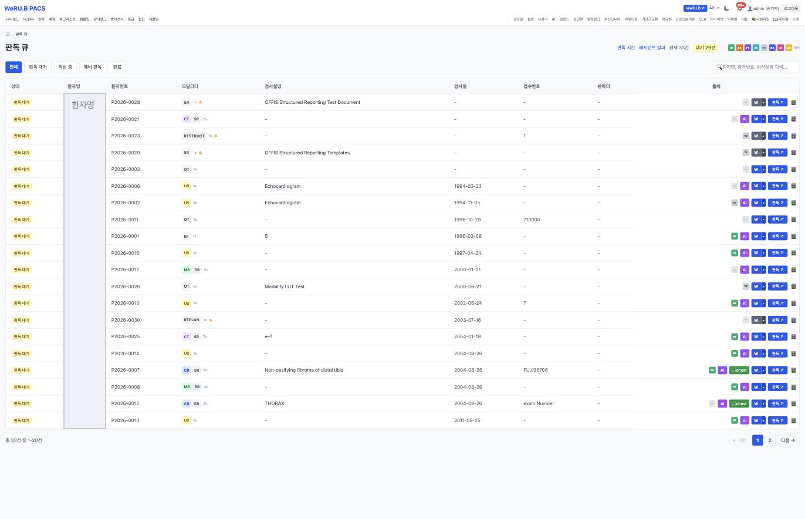
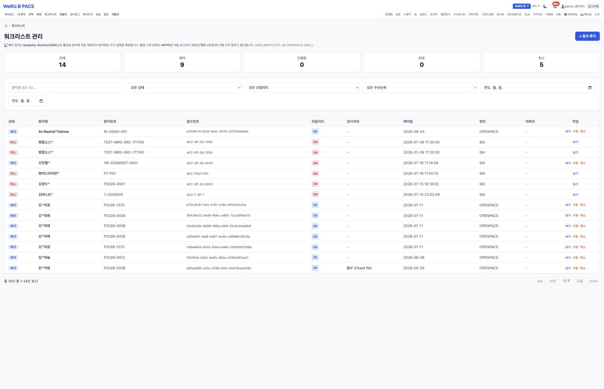
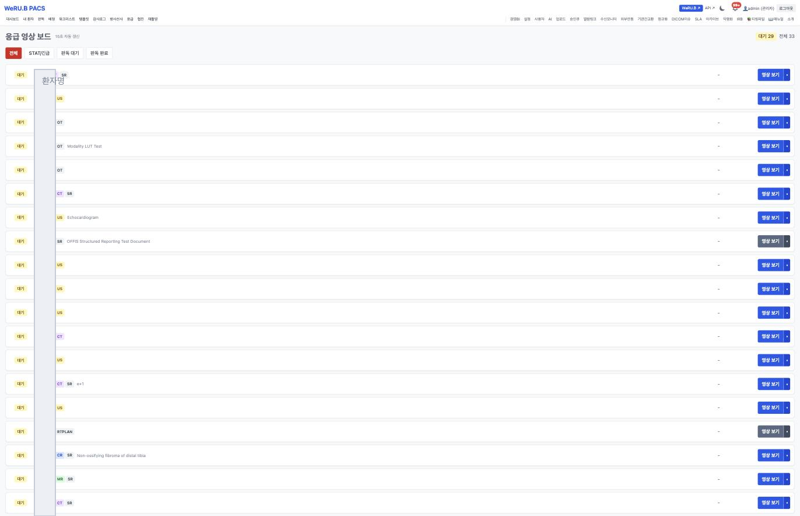
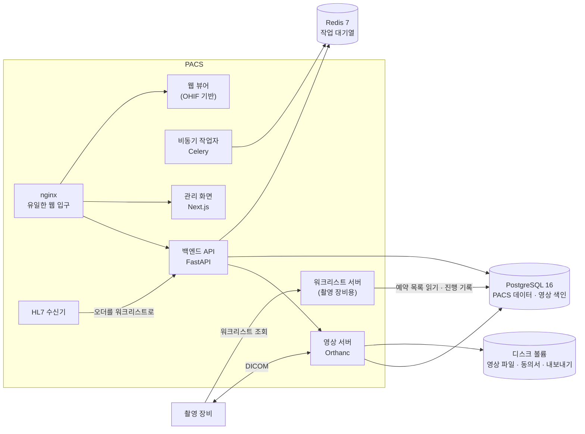
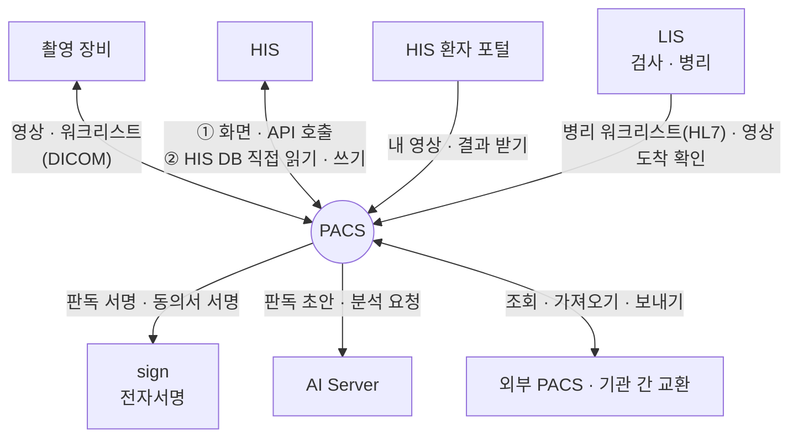

# PACS — 영상을 저장하고 판독하는 시스템

**PACS — storing, viewing and reading medical images**

> 프로젝트 소개서 · 읽는 사람: **의료 전산담당자** · 기준: PACS 저장소의 **현재 개발본**(2026-09-29 · 끝의 [이 문서의 근거](#이-문서의-근거)) · [소개서 목록](README.md)

---

## Introduction (English)

PACS is the imaging system of this ecosystem. It receives images from the scanners (CT, MR, X-ray, ultrasound and others), stores them, shows them in a web viewer, and carries the radiologist's reading work from the worklist to a signed report. It also stores digital pathology slides, so the pathology team can open scanned slides from the laboratory system.

For an IT team, the key point is that PACS is built around a standard image server (Orthanc) and a standard web viewer (OHIF), both taken from open-source projects and extended. Scanners talk to it in DICOM, the standard language of medical imaging; orders can come in as HL7 v2 messages. Around that core, PACS adds its own reading workflow, admin screens, audit trail and AI hooks, packaged as about a dozen containers.

PACS does not hold signing keys. When a radiologist signs a report, or a patient signs a contrast-agent consent, PACS asks the ecosystem's signature service (sign) to do it. AI features only assist: they draft a preliminary report or point out images that may need attention, and a radiologist reviews and confirms. The computation runs on the separate AI Server.

What was checked for real: in September 2026, fresh installs were connected and the links to sign (report signing, patient consent) and to the laboratory system (pathology worklist, viewer link) were called end to end. The paths from the HIS screens into PACS (worklist registration, image lookup, report writing and signing, opening the viewer) are built but not yet verified end to end, so for now reading is done on the PACS screens directly.

What is not there yet, stated plainly: PACS is not a certified medical device; it does not yet send reports back as HL7 messages; the installation files did not run unchanged on a fresh machine; and one AI feature (automatic image screening) is switched on by default and should be switched off at install. Details are in [What to know](#8-알아-둘-것).

---

## 1. 한 문장

> **EN** — PACS stores the hospital's medical images, shows them to the people who need them, and carries the radiologist's reading from the worklist to a signed report.

**PACS 는 병원의 의료 영상을 받아 저장하고, 필요한 사람에게 보여 주고, 판독의가 판독문을 쓰고 서명하기까지를 맡습니다.**

PACS 는 「영상 저장 · 전송 시스템」(Picture Archiving and Communication System)의 줄임말입니다. 촬영 장비가 찍은 영상의 **원본이 PACS 에 있고**, 판독문도 PACS 에서 만들어집니다. 환자 · 오더의 원본은 HIS 에 있고, PACS 는 그것을 받아 씁니다.

## 2. 병원 업무의 어디에 쓰이나

> **EN** — Seven roles are defined. Radiologists and residents read images here; radiographers work from the scanner worklist; doctors look up their patients' images and reports; researchers use de-identified cohorts; administrators manage users, devices and AI models; service accounts let other systems such as the LIS sign in. The pathology team opens scanned slides from the lab system.

PACS 에는 역할이 7개 정의돼 있습니다(현재 개발본의 역할 정의를 센 값). 아래 「무엇을 하나」는 코드와 주석을 읽어 적은 것이고, 역할마다 화면을 하나씩 열어 확인하지는 않았습니다.

| 누가 | 무엇을 하나(예) |
|---|---|
| 판독의(영상의학과 전문의) | 판독 큐에서 검사를 골라 판독문 작성 · 확정 · 본인 서명 · 협진 · 이전 검사 비교 |
| 전공의 | 예비 판독 — 전문의가 확인해 확정합니다 |
| 방사선사 | 촬영 장비가 받는 워크리스트 관리 · 재촬영 요청 · 영상 업로드 |
| 진료의 | 환자의 영상과 판독 결과 보기 |
| 연구자 | 비식별화한 연구 코호트 · IRB 승인 등록 |
| 관리자 | 사용자 · 장비 · 설정 · AI 모델 · 감사 기록 |
| 서비스 계정 | 사람이 아니라 **다른 시스템**이 PACS 에 로그인할 때 쓰는 계정. 예: LIS 가 영상 도착을 확인할 때 쓰는 **읽기 전용** 계정 |

**장면으로 보면**

- **흉부 CT 한 건** — 영상 오더가 PACS 워크리스트에 올라옵니다(HIS 에서 오더가 넘어오는 길은 아직 끝까지 확인하지 못했습니다 — 5절). 방사선사가 촬영 장비에서 이 목록을 불러오므로 환자 정보를 손으로 치지 않습니다. 촬영이 시작 · 끝나면 장비가 PACS 에 알려 상태가 바뀝니다. 영상이 저장되면 판독 큐에 뜨고, 판독의가 뷰어에서 보고 판독문을 써서 확정한 뒤 본인 서명을 합니다.
- **조영제 동의** — 조영제를 쓰는 검사 전에, 직원이 PACS 에서 동의서 서명을 요청합니다. 환자는 서명 포털에서 본인확인을 거쳐 서명하고, PACS 의 동의서 상태가 「완료」로 바뀝니다. 본인확인은 기관이 사업자와 계약하기 전까지 모의 공급자로 동작합니다.
- **병리 슬라이드** — 검사실(LIS)에서 병리 케이스가 생기면 PACS 워크리스트에 스캔할 슬라이드가 등록됩니다. 스캔된 슬라이드가 PACS 에 도착하면, 병리의는 LIS 화면의 링크로 현미경 모드 뷰어를 엽니다.
- **응급실의 밤** — 응급 영상 보드가 15초마다 저절로 갱신되며 긴급 검사와 판독 대기 건수를 보여 줍니다.

## 3. 할 수 있는 일

> **EN** — Eight groups: image storage and exchange in DICOM, cleaning up non-standard images, the reading workflow, the web viewer (2D, 3D, pathology slides), AI assistance, security and audit, links to other systems, and operations (backup, monitoring, statistics). The admin web app has 47 screens.

관리 화면은 **47개**입니다(관리 화면 앱의 `page` 파일을 센 값 · 웹 뷰어 제외).

| 묶음 | 무엇이 들어 있나 |
|---|---|
| **영상 저장 · 교환** | 촬영 장비와 영상 주고받기(DICOM) · 촬영 장비용 워크리스트와 촬영 진행 보고 · HL7 오더 수신 · 외부 PACS 조회 · 가져오기 · 업로드 센터 · 환자 업로드 포털 · CD/USB 반입 키오스크 · 오프라인 패키지 내보내기 |
| **비표준 영상 정리** | 규칙에 맞지 않는 영상을 검증 · 자동 수정(원본 백업 · 되돌리기 · 이력) · 영상 출처 구분(원내 · 외부 · 환자 · 키오스크 · 연구). 예: 필수 정보 칸이 빠진 영상 · 한글 환자 이름이 깨지는 문자 설정 · 실제 크기를 재는 데 쓰는 픽셀 간격 정보가 빠진 영상. 자동으로 고치는 것은 안전하다고 분류된 것뿐이고, 나머지는 기록만 합니다 |
| **판독 업무** | 판독 큐 · 판독 배정(근무표 · 부하 분산) · 기한(SLA) 넘김 알림 · 전공의 예비 판독 · 재촬영 요청 · 판독문 서식 · 협진 · 응급 보드 · 위급 소견 실시간 알림 · 판독 소요 시간 통계 |
| **웹 뷰어** | 2D 판독 · 단면 재구성(MPR) · 측정 · 주석 · 이전 검사 비교 배치 · 3D 볼륨 · 판독문 패널과 AI 패널 · 두 번째 모니터 · 병리 슬라이드 현미경 모드 |
| **AI 보조** | 예비 판독문 초안 · 뷰어 AI 패널(영상 분석 · 이전 검사 비교 · 소견 설명 초안) · 영상 자동 선별 알림 · AI 모델별 성능 추세와 판독의 수용률. 설치 직후 무엇이 켜져 있는지는 [6절 꼭 바꿔야 하는 설정](#꼭-바꿔야-하는-설정)에 모았습니다 |
| **보안 · 감사** | 역할별 접근 · 응급 열람(Break-the-Glass — 긴급할 때 사유를 남기고 여는 것) · 고칠 수 없는 감사 기록 · 비식별화 · 연구 코호트 · IRB 등록부 |
| **연결** | HIS 환자 · 오더 · 판독 결과 · sign 판독 서명과 동의서 서명 · LIS 병리 워크리스트와 영상 도착 확인 · 환자 결과 내보내기 |
| **운영** | 백업 · 복구 리허설 스크립트 · 모니터링(선택) · 영상 미리 불러오기 · 판독 지표와 월간 보고 |

전체 기능과 설정: [PACS 구성서 §4](../systems/pacs.md#4-핵심-기능) · 환자에게 영상을 주는 길: [환자에게 자기 영상을 주는 길](../functions/detail/patient-imaging-export.md).

### 화면으로 보기

> **EN** — A few screens from a rehearsal install with synthetic hospital data. Patient names were masked before publication.

| | |
|---|---|
|  **판독 큐** — 상태 · 촬영 종류 · 영상 출처 배지 |  **워크리스트** — 촬영 장비가 받아 가는 예약 목록 |
|  **응급 영상 보드** — 15초마다 갱신 · 대기와 전체를 함께 |  **AI 모델 관리** — 용도 칸이 모두 「보조」 |

화면은 가상 병원 데이터가 든 리허설 설치본에서 찍었습니다(2026-09-12). 나머지 화면과 설명은 [PACS 화면](../screens/pacs.md)에 있습니다.

## 4. 어떻게 만들어졌나

> **EN** — About a dozen containers behind one nginx entry point: a FastAPI backend with Celery workers, the Orthanc image server, a worklist server for scanners, an HL7 listener, a Next.js admin app and an OHIF-based web viewer. PostgreSQL 16 holds PACS data and Orthanc's index; the image files themselves sit on a disk volume; Redis 7 carries the work queue. Monitoring is an optional profile.

워크리스트 서버는 백엔드가 데이터베이스에 넣어 둔 예약 목록을 읽어 촬영 장비에 내어 줍니다. 예약 목록은 HL7 오더 · 관리 화면 · HIS 연결에서 들어옵니다.

| 구성 요소 | 무엇 | 기술 |
|---|---|---|
| **백엔드 API** | 판독 · 워크리스트 · 감사 · 연결 · AI 호출 | Python 3.12 · FastAPI |
| **비동기 작업자** | 오래 걸리는 일(AI 호출 · 정리 · 보고)을 뒤에서 처리 · 예약 작업 | Celery(worker · beat) |
| **영상 서버** | 영상을 받고 저장하고 내어 줌 — 촬영 장비와 표준(DICOM)으로 대화 | Orthanc(제3자 · 별도 컨테이너) |
| **워크리스트 서버** | 촬영 장비가 예약 목록을 조회하고 촬영 진행을 보고하는 곳 | 자체 |
| **HL7 수신기** | 다른 시스템이 보내는 오더 메시지(HL7 v2) 수신 | 자체 |
| **관리 화면** | 판독 큐 · 워크리스트 · 설정 · AI 모델 · 감사 | Next.js · Node 22 |
| **웹 뷰어** | 영상 보기 · 판독 모드 · 병리 현미경 모드 | OHIF Viewer 소스를 받아 고치고 확장해 빌드 |
| **nginx** | 웹과 API 의 **유일한** 공개 입구 | nginx |
| **모니터링** | 지표 · 경보 · 대시보드 — 켜고 싶을 때만 | Prometheus · Grafana(선택 프로필) |

**데이터가 사는 곳**

| 저장소 | 무엇이 들어 있나 |
|---|---|
| **PostgreSQL 16** | PACS 업무 데이터(사용자 · 워크리스트 · 판독문 · 감사 기록 · 설정)와 **영상 서버의 색인** |
| **디스크 볼륨** | **영상 파일 자체** — 가장 큽니다 · 동의서 · 내보내기 임시 파일 |
| **Redis 7** | 비동기 작업 대기열 · 캐시 |

- API 는 핸들러 약 **475개**입니다(현재 개발본과 같은 커밋의 라우터 데코레이터를 센 값 · 웹소켓 3개 별도).
- 작업자 코드는 이미지 안에 들어갑니다. 작업자 코드를 고치면 이미지를 다시 빌드해야 반영됩니다.

## 5. 다른 시스템과의 연결

> **EN** — PACS talks to scanners in DICOM, to the lab system over HL7 and a read-only service account, to sign for report and consent signatures, to the AI Server for drafts, and to HIS in three separate ways: HIS calling PACS's web API, PACS reading and writing the HIS database directly, and HL7 messages. The sign and LIS links were called for real between fresh installs in September 2026. None of the three HIS paths is verified end to end yet.

**PACS 는 혼자서도 영상을 받고 판독할 수 있고, 다른 시스템은 필요할 때 붙습니다.**

**HIS 와의 흐름은 아직 끝까지 확인되지 않았습니다.** 오더가 HIS 에서 PACS 로 들어오는 길과 판독 결과가 HIS 로 돌아가는 길은 코드로 만들어져 있지만, 실제로 이어 불러 본 적이 없습니다. 그동안 판독은 PACS 화면에서 직접 하고, 결과는 PACS 에서 봅니다.

이 절의 상태 표기는 세 가지입니다. **확인함** = 이 자료가 새 설치본끼리 실제로 불러 확인(날짜 표시). **자체 확인** = PACS 저장소가 모의 환경에서 스스로 시험한 것(이 자료가 부른 것은 아님). **만들어져 있음** = 코드는 있고 실제 연결 확인은 아직.

이미 쓰는 PACS 가 있는 기관은 이 PACS 대신 표준(DICOM · HL7 v2)으로 기존 PACS 를 연결하는 선택도 있습니다.

| 상대 | PACS 가 주는 것 | PACS 가 받는 것 | 로그인 · 인증 방식 | 실제로 연결해 확인했나 |
|---|---|---|---|---|
| **sign** | 판독문 서명 요청 · 조영제 동의서 서명 요청 | 서명 완료 | 시스템별 연동 키 · 판독의 본인 서명은 HIS 가 발급한 서명용 신원 | 판독 서명 · 동의서 환자 서명 **확인함**(2026-09-15 · 환자 본인확인은 모의 공급자로) |
| **LIS** | 영상 도착 여부 · 뷰어 링크 | 병리 슬라이드 스캔 워크리스트 등록 · 취소(HL7 메시지) | 등록 · 취소는 HL7 메시지 · 도착 확인은 PACS 읽기 전용 서비스 계정 | 워크리스트 등록 · 취소 · 뷰어 링크 · 도착 확인 **확인함**(2026-09-15 · 병리 영상은 합성 슬라이드로) |
| **HIS ① 화면 · API** | 워크리스트 등록 결과 · 영상 조회 · 판독 작성과 서명 · 뷰어 열기 | 직원 로그인 · HIS 화면에서 온 요청 | HIS 공개키로 직원 신원 검증 · 서비스 계정 | 만들어져 있음 · 실제 연결 확인은 아직 |
| **HIS ② 데이터베이스** | 판독 결과를 HIS DB 에 직접 씀 | 영상 오더를 HIS DB 에서 직접 읽음(관리자가 누를 때) | HIS DB 접속 정보 | 만들어져 있음 · 실제 연결 확인은 아직 |
| **HIS 환자 포털** | 환자 본인의 영상 · 판독 결과 · 암호화 내보내기 | 환자의 요청 | 서버끼리 부름 · 내보내기 전용 비밀 | 만들어져 있음 · 실제 연결 확인은 아직 · 환자 외부 영상 업로드 중계는 아직 없음 |
| **AI Server** | 영상 · 판독문 초안 요청 | 초안 · 분석 결과 | 발급된 API 키 · 부를 수 있는 곳 목록 | 만들어져 있음 · 실제 연결 확인은 아직 |
| **촬영 장비** | 예약 목록 | 영상 · 촬영 진행 보고 | DICOM 노드 등록(AE 타이틀 — 장비마다 붙이는 이름표) | 만들어져 있음 · 실제 장비와의 확인은 아직 |
| **외부 PACS · 기관 간 교환** | 영상 · 교환용 문서 세트 | 원격 영상 | DICOM · IHE XDS-I.b | 만들어져 있음 · 실제 연결 확인은 아직 |

**HL7 은 방향마다 다릅니다.** 표의 여러 줄에 흩어진 HL7 을 한 곳에 모으면 이렇습니다.

| 방향 | 무엇 | 지금 |
|---|---|---|
| 다른 시스템 → PACS | 영상 · 병리 오더 메시지를 받아 워크리스트로 올림 | 있음 · LIS 와는 실제로 확인함(2026-09-15) |
| 다른 시스템 → PACS | 환자 식별 교차 참조(PIX) 메시지를 받음 | PACS 쪽 수신 기능은 있고 모의 환경에서 자체 확인까지 함 · HIS 가 이 메시지를 보내는 쪽은 아직 없음 |
| PACS → 다른 시스템 | 판독 결과를 HL7 메시지로 보냄 | 아직 없음 |

HIS 와 이어 쓸 때 알아 둘 것:

- **HIS 화면에서 PACS 를 부르는 경로**(①)는 두 시스템 모두 코드가 있지만, 새 설치본끼리 끝까지 확인하지는 못했습니다. 그동안 판독은 **PACS 화면에서 직접** 하고, 판독 서명은 확인된 PACS → sign 경로를 씁니다.
- **영상 오더 동기화**(②)는 관리자가 누를 때 HIS DB 에서 한 번에 **최근 30일 · 최신순 200건까지만** 읽습니다. 아직 끝나지 않은 오더만 읽습니다.
- 이미 받은 오더도 그 200건 안에 들어갑니다. 그래서 30일 안에 끝나지 않은 오더가 200건을 넘으면, 오래된 쪽은 다시 눌러도 넘어오지 않습니다(코드를 읽은 결과 · 실제로 돌려 보지는 않음). 개시 때는 넘어온 건수를 세어 대조합니다.
- ②는 HIS 의 표 구조에 직접 기댑니다. HIS 를 올릴 때마다 다시 맞춰 봐야 합니다.

연결마다의 자세한 내용: [연결 카드](../integration/cards/)(예: [PACS → sign](../integration/cards/pacs-to-sign.md) · [LIS → PACS](../integration/cards/lis-to-pacs.md) · [HIS → PACS](../integration/cards/his-to-pacs.md)) · [연결 상태 표](../RELEASES/2026.09/compatibility.md) · 오류 응답의 모양은 [공통 규약](../integration/contracts.md)(PACS 는 오류를 코드가 아니라 문장 하나로 돌려줍니다).

## 6. 설치 · 운영

> **EN** — PACS runs as containers with Docker Compose, with no GPU. An install script does six steps (prerequisites, generate secrets and institution values, build, start, wait for health, create the first administrator) plus default seeds and a smoke check. In the September 2026 rehearsal the files did not run unchanged; the workarounds are in the build guide. Backup covers the encrypted database and incremental image snapshots, with a restore rehearsal script; server sizing, restore time and migration time were not measured.

### 필요한 것

| 항목 | 내용 |
|---|---|
| 서버 | Docker Engine 24 이상 · Compose v2. **GPU 는 필요 없습니다**(AI 연산은 AI Server 가 합니다). 저장소 README 는 메모리 8GB 이상 · 디스크 50GB 이상을 적습니다(이 자료에서 재지 않은 값) — 영상 저장 용량은 기관의 촬영량에 따라 따로 잡습니다 |
| 먼저 있어야 할 것 | 없습니다 — 혼자 동작합니다. 직원이 HIS 신원으로 들어오게 하려면 HIS, 판독 서명에는 sign, AI 보조에는 AI Server 가 필요합니다 |
| 기관이 준비할 것 | 기관 이름 · 식별자 · 시간대 · 공개 주소와 TLS 인증서 · **촬영 장비 목록**(장비마다 AE 타이틀과 주소 — 비어 있는 채로 옵니다) · HL7 을 받을 상대 대역 |
| 네트워크 | 웹 · API 는 nginx 한 곳으로만 엽니다. 촬영 장비용 DICOM 포트와 HL7 포트는 원내망에 둡니다. **HL7 허용 대역은 앱 설정(`HL7_ALLOWED_PEERS` · `HL7_ALLOWED_FACILITIES`)과 서버 방화벽을 함께 맞춥니다** — 한쪽만 바꾸면 연결이 조용히 끊깁니다 |

### 설치 경로

저장소에 **설치 스크립트**가 있습니다.

| 단계 | 하는 일 |
|---|---|
| 1 | 전제 확인 |
| 2 | 설정 파일 만들기 — 비밀값을 새로 만들고 기관 값을 넣습니다 |
| 3 | 이미지 빌드(웹 뷰어는 OHIF 소스를 받아 고쳐서 빌드 — 빌드하는 곳에서 인터넷이 필요합니다) |
| 4 | 기동 |
| 5 | 백엔드가 살아날 때까지 대기 |
| 6 | 첫 관리자 생성 |
| — | 기관 기본값(영상 검증 규칙 · 촬영 종류 · 메시지) 넣기 · 설치 확인 |

2026년 9월에 새 PC 에서 그대로 돌려 보니 **그대로는 끝나지 않았습니다** — 영상 서버 이미지 태그를 받을 수 없었고, TLS 파일 · 헬스 체크 · 기본 테이블 생성 단계에서 차례로 멈췄습니다. 우회한 순서는 [구축 가이드 S3](../build-guide/S3-clinical-departments.md)에 있습니다.

### 꼭 바꿔야 하는 설정

- **비밀값** — DB · 캐시 비밀번호 · 백엔드 서명 비밀 · 영상 서버 접속 자격. 설치 때 새로 만듭니다.
- **기관 값과 주소** — 일부 주소 설정의 기본값에 **다른 설치본의 주소**가 들어 있습니다. 전부 자기 기관 주소로 바꿉니다(목록: [바꿔야 할 코드 기본값 — PACS](../build-guide/replace-list.md#pacs)).
- **연결 값** — HIS 신원 검증 주소 · sign · AI Server 주소와 키. 비워 두면 그 연결이 꺼진 채로 동작합니다.
- **영상 자동 선별은 기본으로 켜져 있습니다.** 설치할 때 환경 변수 `SCREENING_ENABLED` 를 꺼짐으로 두고, 기관이 결정한 뒤에 켭니다. 판독문 AI 초안은 기본 꺼짐입니다.
- 서비스 계정(다른 시스템이 PACS 에 로그인할 때 쓰는 계정 — 2절)을 두 개 이상 만들 때는 **계정마다 메일 주소를 따로** 줍니다. 기본값이 겹칩니다.

### 백업 · 감시

- **백업** — DB 를 암호화해 백업하고, 영상 파일은 **증분 스냅샷**(바뀐 것만 새로 담는 방식)으로 남깁니다. 복구 리허설 스크립트가 있습니다. 서버 밖 사본은 설정해야 켜지고, 암호화 비밀번호는 서버 밖에도 보관합니다. 복구에 걸리는 시간과 백업 크기는 계측하지 않았습니다.
- **디스크 경보** — 경고 · 위험 비율을 설정합니다. 영상이 쌓이는 속도를 보고 정합니다.
- **모니터링** — 지표 · 경보 · 대시보드를 선택 프로필로 켭니다.
- **버전 확인** — 코드에 버전 선언이 없어, 실행 중인 서비스에서 릴리즈 번호를 읽을 수 없습니다. 배포 기록에 커밋을 함께 남깁니다.

### 아직 재지 않은 것

- **서버 사양** — 동시 사용자 · 하루 촬영 건수에 따른 사양과 영상 한 건의 평균 용량은 계측하지 않았습니다. 디스크는 기관의 촬영량으로 따로 산정합니다.
- **기존 PACS 에서의 이관** — 다른 PACS 에서 영상을 끌어오는 기능(외부 PACS 조회 · 가져오기)은 있습니다. 이관 용도로 대량으로 돌려 본 적은 없고, 걸리는 시간도 재지 않았습니다.
- **장비 제조사와의 호환** — 실제 촬영 장비와 붙여 본 결과는 없습니다.

자세한 설정 키: [PACS 구성서 §6](../systems/pacs.md#6-주요-설정) · 설치 순서: [구축 가이드 S3](../build-guide/S3-clinical-departments.md).

## 7. 이렇게 만든 이유

> **EN** — Five design choices: build on standard open-source imaging components; keep signing keys out of PACS; AI assists and a radiologist confirms; always say where an image came from; fix non-standard images without losing the original.

| 설계 | 왜 |
|---|---|
| **표준 영상 서버 · 뷰어를 가져다 씀**(Orthanc · OHIF) | 어느 제조사 장비와도 표준으로 대화하게. 대가로 판본이 상류 프로젝트에 묶이고, 그 구성요소의 라이선스(GPL · AGPL)가 그대로 따라옵니다 |
| **PACS 는 서명 키를 갖지 않음** — 판독 서명과 동의서 서명은 sign 에 맡김 | 「누가 언제 서명했나」의 증거를 한 곳에서 만들고 검증하게. 시스템마다 키를 갖고 있으면 지킬 곳이 늘어납니다 |
| **AI 는 보조 · 확정은 판독의** — AI 결과는 표준 형식(DICOM SR · SEG)으로 남기고 판독의가 고쳐 확정 | AI 가 무엇을 제안했고 사람이 무엇을 받아들였는지가 따로 남게. 모델마다 판독의 수용률과 성능 변화를 봅니다 |
| **영상의 출처를 말함** — 원내 · 외부 · 환자 · 키오스크 · 연구, AI 생성 · 테스트 데이터를 배지로 구분 | 어디서 온 영상인지가 섞여 판독에 쓰이지 않게 |
| **비표준 영상은 원본을 남기고 고침** — 되돌리기와 이력 · 감사 기록은 추가만 됨 | 고친 흔적과 원본을 모두 잃지 않게. 나중에 무엇이 바뀌었는지 설명할 수 있게 |

다른 시스템의 설계 선택과 나란히 보려면: [형제 시스템의 설계 기록 §5](../DESIGN-HISTORY-SYSTEMS.md).

## 8. 알아 둘 것

> **EN** — PACS is not a certified medical device; neither of the two HIS paths (HIS calling PACS, PACS reading and writing the HIS database) is verified end to end yet; automatic image screening is on by default and should be switched off at install. Also: no HL7 report sending and no HL7 patient feed from HIS yet (PACS's own PIX receiver was self-tested in a mock domain), the install files needed workarounds, and third-party licences (GPL/AGPL for Orthanc) come along; what they require of an institution is for its own legal review.

- 🔴 **인허가받은 의료기기가 아닙니다.** 의료영상저장전송장치 인허가를 목표로 한 문서가 저장소에 있지만(`대응 설계`) 허가 · 인증 증빙은 없습니다. 임상 사용의 적합성 판단과 인허가는 구축 기관이 합니다([면책 고지](../DISCLAIMER.md)).
- 🔴 **HIS 와 잇는 두 경로는 실제 연결 확인이 아직입니다.** HIS 화면 · API 호출(①)과 데이터베이스 직접 읽기 · 쓰기(②) 모두 만들어져 있지만 끝까지 확인하지 못했습니다. 그동안 판독은 PACS 화면에서 직접 합니다.
- 🔴 **영상 자동 선별이 기본으로 켜져 있습니다.** 생태계 원칙은 「AI 는 기관이 결정해서 켠다」입니다. 설치할 때 끄십시오.
- **판독 결과를 HL7 로 보내는 기능 · HIS 가 환자 정보를 HL7 로 보내는 연결 · 환자 외부 영상 업로드 중계는 아직 없습니다.** 다른 HIS 의 오더는 HL7 로 받을 수 있지만, 결과를 돌려보내려면 송신부를 더해야 합니다. 그 작업의 규모는 재지 않았습니다.
- **설치 파일이 그대로 돌지 않았습니다.** 우회 순서를 먼저 읽습니다([S3](../build-guide/S3-clinical-departments.md)).
- **기관 간 영상 교환(XDS-I.b)과 PACS 쪽의 환자 식별 교차 참조(PIX) 수신 기능**은 모의 환경에서 자체 확인까지 했습니다. 실제 교류망 연결은 그쪽 규격과 인증서를 받아야 합니다.
- **제3자 라이선스** — 영상 서버 Orthanc 와 플러그인은 GPL · AGPL 계열이고 이 생태계의 MIT 가 덮지 않습니다. 웹 뷰어 빌드에 묶이는 npm 패키지의 고지 목록은 아직 없습니다([THIRD_PARTY](../THIRD_PARTY.md)). 기관 안에서만 운영할 때 어떤 의무가 생기는지는 이 자료가 판단하지 않습니다 — 기관의 법무 확인 대상입니다.

전체 한계와 대체 수단: [PACS 구성서 §10](../systems/pacs.md#10-한계와-대체-수단).

## 9. 통합 릴리즈 `2026.09` 이후 달라진 점

> **EN** — None. The current development line is the same commit as the one pinned in the integrated release `2026.09`.

기준 커밋과 같습니다 — 달라진 점 없음.

## 10. 더 깊이

> **EN** — Where to go next.

| 알고 싶은 것 | 문서 |
|---|---|
| 구성 · 설정 키 · 연결 · 한계 전체 | [PACS 구성서](../systems/pacs.md) |
| 설치 순서와 우회 | [구축 가이드 S3](../build-guide/S3-clinical-departments.md) |
| 판독 서명과 sign 설정 | [구축 가이드 S4](../build-guide/S4-trust.md) |
| 화면 | [PACS 화면](../screens/pacs.md) |
| 환자에게 영상을 주는 길 | [환자에게 자기 영상을 주는 길](../functions/detail/patient-imaging-export.md) |
| 연결 하나를 자세히 | [연결 카드](../integration/cards/) · [공통 규약](../integration/contracts.md) |
| 실제로 확인한 것 | [따라가 본 결과](../build-guide/follow-along-2026-09.md) |
| 이 판에서 바뀐 것(통합 릴리즈 기준) | [PACS 릴리즈 요약](../RELEASES/2026.09/systems/pacs.md) |
| 제3자 구성요소 | [THIRD_PARTY](../THIRD_PARTY.md) |
| 소스 | [소스 받기](../SOURCES.md) — 저장소 `seanshin/openpacs` |

---

## 이 문서의 근거

> **EN** — What this introduction was written from.

| 항목 | 값 |
|---|---|
| 읽은 것 | PACS 저장소의 **현재 개발본** — 커밋 `532a8ed13e87`(2026-09-10) · 버전 표기 v13.48(릴리즈 기록 파일의 가장 높은 번호 · 실행 중인 서비스가 알려 주는 버전 값은 코드에 없음) · 작업 트리의 미커밋 변경은 읽지 않음 |
| 비교 기준 | 통합 릴리즈 `2026.09` — 커밋 `532a8ed13e87` · **현재 개발본과 같음** |
| 센 방법 | 역할 = 사용자 모델의 역할 정의 · 관리 화면 = 관리 화면 앱의 `page` 파일 · API 핸들러 = 기준 커밋 계측 스냅샷(2026-09-11) — 역할과 화면은 2026-09-29 에 다시 셈 |
| 실제 연결 확인 | 2026-09-14~15 · 통합 릴리즈 기준 설치본끼리 · 가상 데이터([따라가 본 결과](../build-guide/follow-along-2026-09.md)) |
| 사실 확인 | PACS 담당의 확인 전 · 생태계 자료 측이 저장소를 읽고 쓴 것 |
