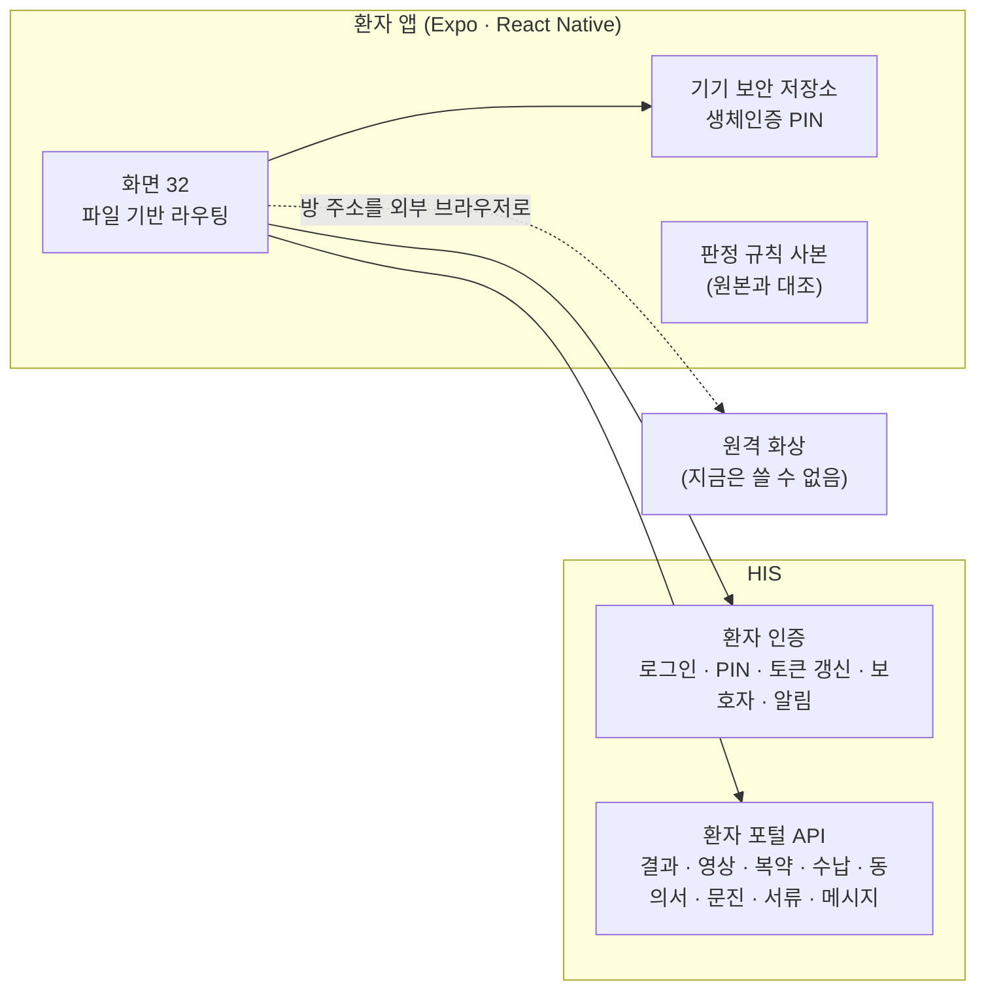
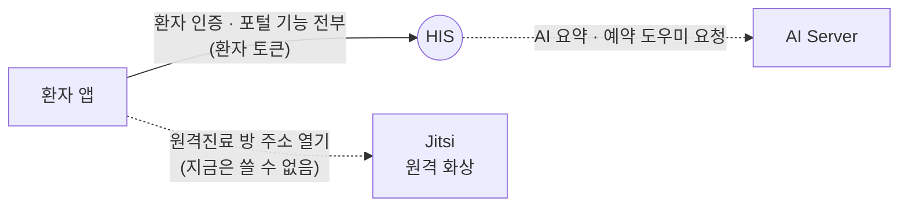

# 환자 앱 — 환자 손안의 병원 기록

**Patient app — the hospital record in the patient's hand**

> 프로젝트 소개서 · 읽는 사람: **의료 전산담당자** · 기준: HIS 저장소의 **현재 개발본**(2026-09-29 · 끝의 [이 문서의 근거](#이-문서의-근거)) · [소개서 목록](README.md)

---

## Introduction (English)

The patient app is a mobile app through which a patient sees their own hospital record and handles small tasks without coming to the desk: appointments and booking, visit history, test results, imaging reports, checkup results and comparisons, medication, payments, consent forms, questionnaires, document requests, messages with their doctor, and delegating access to a guardian. It also shows the patient who has opened their record, including emergency access and whether it was approved afterwards.

For an IT team, the key fact is that the app **has no server and no database of its own**. It is a client of the HIS patient-portal API and lives in the HIS repository (Expo and React Native). Every screen calls HIS; the only setting built into the app is the HIS address (plus a video-visit address). Tokens are kept in the device's secure storage, and a PIN login can use the phone's biometrics after a first normal login.

The app is written to tell the truth when it does not know: a failed lookup is shown as a failure, not as "no results", "0 won" or "normal"; records the hospital has no way to enter (vaccinations, for example) are not shown as "none"; and AI health features show the server's reason when there is no validated way to compute a score. AI features only assist — they draft summaries and suggestions, and the doctor's judgement stands.

What is not there yet, stated plainly: the app is **not published to any app store** and store build settings are not in the repository; sign-up inside the app is blocked until an identity-verification provider is connected; push notifications are not wired on the app side; video visits depend on a video system that is currently unusable; the app is Korean only; and it was not installed during the September 2026 follow-along. Until an institution decides to publish the app, patients use the web patient portal inside HIS. Details are in [What to know](#8-알아-둘-것).

---

## 1. 한 문장

> **EN** — The patient app lets patients see their own record and handle bookings, consents and questionnaires on their phone, through HIS.

**환자 앱은 환자가 휴대전화로 자기 진료 기록을 보고 예약 · 동의서 · 문진 같은 일을 처리하는 앱이며, 모든 데이터를 HIS 에서 받습니다.**

병원 정보 체계에서 환자 앱은 **환자 접점**에 있습니다. HIS 의 웹 환자 포털과 같은 서버 기능을 모바일 화면으로 쓰는 것이고, 원본 기록은 HIS 에 있습니다.

## 2. 병원 업무의 어디에 쓰이나

> **EN** — Patients and guardians use it. Doctors answer patient messages from a staff inbox in HIS. Front-office staff handle document requests and payments that patients start in the app.

| 누가 | 무엇을 하나(예) | 어디서 |
|---|---|---|
| 환자 | 예약 · 결과 · 영상 판독 · 복약 · 수납 확인, 동의서 서명, 문진, 서류 신청 | 환자 앱(또는 웹 환자 포털) |
| 보호자 | 환자와의 보호자 관계를 신청하고 승인 상태를 봅니다(관계 · 법적 근거 · 만료일이 함께 남습니다) | 환자 앱의 보호자 관리 |
| 의사 | 환자가 보낸 메시지를 읽고 답합니다 | HIS 직원 화면의 환자 메시지 수신함 |
| 원무 · 의무기록 | 앱에서 들어온 서류 신청 · 수납을 처리합니다 | HIS 직원 화면 |

**장면으로 보면**

- **검사 뒤 결과 확인** — 환자가 검사 결과 화면을 엽니다. 정상 · 이상 · 위급 판정은 HIS 와 같은 판정 규칙으로 표시되고, 이전 회차와 비교할 수 있습니다. 불러오기에 실패하면 「이상 없음」이 아니라 「불러오지 못했습니다」라고 나옵니다.
- **수술 전 동의서** — 환자가 서명 대기 동의서를 열어 내용을 확인하고 이름을 입력해 서명합니다. 의사 · 입회인 서명이 더 필요한 서식이면 동의서는 완료되지 않은 채 담당의에게 알림이 갑니다.
- **내 기록을 누가 봤나** — 환자가 접근 이력 화면에서 자기 기록을 연 직원과, 응급 상황에서 담당이 아닌 의료진이 사유를 남기고 연 기록(비상 열람)과 그 사후 승인 여부를 봅니다.

## 3. 할 수 있는 일

> **EN** — Thirty-two screens: sign-in (3), 27 tab screens and two inpatient-journey screens, grouped into account, care and booking, results and imaging, health management, documents and payment, messaging, and privacy.

앱 화면은 **32개**입니다(로그인 3 · 탭 27 · 입원 여정 2 — 현재 개발본의 라우트 파일 수).

| 묶음 | 무엇이 들어 있나 |
|---|---|
| **로그인 · 계정** | 전화번호 · 비밀번호 로그인, 기기 생체인증을 쓰는 PIN 로그인, 프로필 · 알림 설정, 보호자 위임 요청 |
| **예약 · 진료** | 예약 조회 · 취소, AI 예약 도우미, 진료 기록 목록, 입원 여정(타임라인 · 진료 · 회진 · 검사), 원격진료 예약 · 입장 |
| **검사 · 영상 · 검진** | 검사 결과와 추이, 영상검사 목록과 판독 리포트, 검진 결과 상세 · 회차별 비교 · 검진 셀프 예약 · 다음 검사 안내 |
| **건강 관리** | 알레르기 · 수술 전 체크리스트 · 건강 메모, 만성질환 추이와 자가측정, 복약 시간표, AI 건강 요약 · 재진 권고 · 약물 상호작용 확인 |
| **문서 · 동의 · 수납** | 동의서 확인과 서명, 문진표, 제증명 · 서류 신청과 발급 상태, 수납 내역 · 연간 요약 · 미수납 |
| **소통 · 알림** | 담당의 메시지와 답장, 알림 목록, 공지사항 |
| **내 정보 보호** | 내 기록 접근 이력 — 일반 열람과 비상 열람, 사후 승인 여부 |

### 화면으로 보기

> **EN** — No screenshots of the app itself yet. The web patient portal, which patients use while the app is unpublished, is shown in the screens chapter.

캡처 없음 — 앱은 따라가기에서 설치하지 않았습니다. 앱이 배포되기 전 환자가 들어오는 **웹 환자 포털**의 로그인 화면은 [환자 앱 화면](../screens/patient-app.md)에 있습니다.

## 4. 어떻게 만들어졌나

> **EN** — An Expo 56 / React Native 0.85 app using file-based routing. It calls the HIS patient-auth and patient-portal APIs over REST, keeps tokens in the device's secure storage, and refreshes the access token automatically. Shared judgement rules (lab flags, which records the hospital can record) are exact copies checked against the HIS originals.

| 구성 요소 | 무엇 | 기술 |
|---|---|---|
| **화면** | 로그인 · 탭 · 입원 여정 화면. 서버 데이터는 조회 도구가 받아 두고 다시 씁니다 | Expo 56 · React Native 0.85 · React 19.2 · expo-router · TanStack Query |
| **API 도우미** | 모든 요청에 로그인 토큰을 붙이고, 만료되면 한 번 갱신해 다시 보냅니다 | — |
| **보안 저장소** | 로그인 토큰을 기기의 암호화 저장소에 둡니다. PIN 로그인은 기기 생체인증을 거칩니다 | expo-secure-store · expo-local-authentication |
| **판정 규칙 사본** | 검사 판정 표시 · 「병원이 기록하지 않는 항목」 목록 같은 공용 규칙을 복사해 두고, HIS 저장소 검사가 원본과 대조합니다(앱 번들러가 공용 패키지를 따라가지 못해서) | — |

**데이터가 사는 곳**

- **앱에는 자기 서버도 데이터베이스도 없습니다.** 모든 기록은 HIS 데이터베이스에 있습니다.
- 기기에는 로그인 토큰과 기기 식별값을 보안 저장소에 남깁니다.

## 5. 다른 시스템과의 연결

> **EN** — The app talks only to HIS, with a patient token issued by HIS. For video visits it opens the room address in an external browser; that video system is currently unusable. AI features are requested through HIS, which forwards them to the AI Server. None of these have been called for real yet.

**환자 앱은 HIS 하나에만 붙습니다.** AI 기능도 앱이 직접 부르지 않고 HIS 를 거쳐 [AI Server](../systems/ai-server.md) 가 처리합니다.

| 상대 | 앱이 보내는 것 | 받는 것 | 로그인 · 인증 방식 | 실제로 연결해 확인했나 |
|---|---|---|---|---|
| **HIS** | 로그인 · PIN · 토큰 갱신 · 기기 푸시 등록 · 보호자 요청 · 서명 · 문진 · 서류 신청 · 메시지 | 결과 · 영상 · 복약 · 수납 · 동의서 · 알림 등 본인 기록 | HIS 가 발급한 환자 토큰 | 만들어져 있음 · 실제 연결 확인은 아직 |
| **Jitsi** | 대기실 입장 기록(HIS 에) 뒤 방 주소를 외부 브라우저로 엶 | — | 앱은 화상 토큰을 받지 않습니다 | 지금은 쓸 수 없음(화상 서버를 새로 구성해야 함) |

연결의 자세한 내용은 [연결 카드 — 환자 앱 → HIS](../integration/cards/환자-앱-to-his.md) · [환자 앱 → Jitsi](../integration/cards/환자-앱-to-jitsi.md)와 [연결 상태 표](../RELEASES/2026.09/compatibility.md)에 있습니다.

## 6. 설치 · 운영

> **EN** — There is nothing to install on a server beyond HIS. The app is built and distributed separately from HIS deployments. The repository holds only development run scripts; store accounts, app identifiers, signing keys and store build settings are for the institution to prepare once it decides to publish.

### 필요한 것

| 항목 | 내용 |
|---|---|
| 서버 | **HIS 외에는 없습니다.** HIS 의 환자 인증 · 환자 포털 기능이 켜져 있어야 합니다 |
| 빌드 도구 | Node · Expo SDK 56 · React Native 0.85 |
| 배포 | 앱 스토어 계정 · 앱 식별자 · 서명 키 · 스토어 빌드 설정은 **저장소에 없습니다.** 배포를 정한 기관이 준비합니다. 저장소의 작업 명령은 개발 실행(`expo start` 계열)과 계약 대조 시험뿐입니다 |
| 먼저 정할 것 | 앱을 스토어에 배포할지(HIS 결정 등록부의 허가권자 항목) · 환자 알림의 적법 근거와 켤지 · 환자 본인확인 방식 — [사람 결정](../checklist/decisions.md) |

### 꼭 넣어야 하는 설정

- **HIS 주소**(`EXPO_PUBLIC_API_URL`)와 **원격 화상 주소**(`EXPO_PUBLIC_TELEHEALTH_URL`)를 빌드할 때 지정합니다. 지정하지 않으면 코드에 적힌 특정 설치본의 주소로 연결됩니다. 앱에 박혀 나가므로 바꾸려면 다시 빌드합니다.
- **앱 이름 · 식별 이름 · 딥링크 스킴 · 아이콘 · 버전**(앱 설정 파일)은 저장소 기본값입니다. 기관 값으로 바꿉니다.
- **HIS 쪽 설정** — 푸시 전체 스위치와 발송 자격, 로그인 유지 시간, 가입 허용과 본인확인 요구를 정합니다. 셀프 예약 · 복약 AI 설명 · 복약 알림 같은 기능 스위치는 기본 꺼짐입니다. 앱 최소 버전과 점검 모드도 HIS 에서 정합니다. 키 이름은 [환자 앱 구성서 §6](../systems/patient-app.md#6-주요-설정)에 있습니다.

### 운영

- 앱 변경은 **HIS 서버 배포와 무관**합니다. 앱을 다시 빌드하고 스토어(또는 기관 배포 경로)를 거쳐야 환자 기기에 반영됩니다.
- 앱의 시험은 서버 계약 대조(앱이 부르는 경로 · 필드가 HIS 에 있는지)이며, 실기기 화면 시험은 없습니다.
- 백업 · 감시는 HIS 가 맡습니다 — [HIS 소개서 §6](his.md#6-설치--운영).

자세한 설정 순서: [구축 가이드 S2](../build-guide/S2-patient-access.md)(통합 릴리즈 `2026.09` 기준).

## 7. 이렇게 만든 이유

> **EN** — Four design choices: HIS is the only server; a failed or impossible lookup is never shown as "none"; features that cannot yet work honestly are blocked with a reason; and the patient can see who opened their record.

| 설계 | 왜 |
|---|---|
| **서버는 HIS 하나** — 앱은 포털 API 의 화면일 뿐 | 웹 포털과 앱이 같은 서버 기능을 쓰므로, 환자가 어느 쪽으로 들어와도 같은 기록 · 같은 판정을 봅니다 |
| **실패는 실패로** — 조회 실패를 「없음 · 0원 · 이상 없음」으로 바꾸지 않음 | 환자는 빈 화면을 「서명할 동의서가 없다」 · 「결과가 정상이다」로 읽습니다. 모르는 것을 안심으로 바꾸지 않습니다 |
| **기록하지 않는 항목은 「없음」이라 하지 않음** — 예: 병원이 예방접종 이력을 따로 관리하지 않으면 그렇다고 밝힘 | 빈 목록을 「접종을 받지 않았다」로 읽지 않게 — 자료가 없는 것과 진짜 0 은 다른 사실입니다 |
| **아직 안 되는 기능은 이유와 함께 막음** — 앱 가입은 본인인증 연동 전까지 막고, 가입이 안 되는 이유와 대안(홈페이지 · 원무과)을 안내 | 한 번도 성공할 수 없는 가입 단추를 두지 않으려는 것입니다 |
| **내 기록 접근 이력을 환자에게** | 비상 열람을 포함해 누가 내 기록을 열었는지 환자 스스로 확인할 수 있게 |

이 원칙들의 뿌리는 HIS 와 같습니다 — [설계 기준은 어떻게 생겼나](../DESIGN-HISTORY.md).

## 8. 알아 둘 것

> **EN** — Not published to any store; no in-app sign-up until identity verification is connected; push is not wired on the app side; video visits are unusable now; consent signing in the app is a typed-name record in HIS rather than a certificate signature; Korean only; not called for real in the follow-along.

- 🔴 **스토어에 배포되지 않았습니다** — 실기기에 설치할 배포본이 없고, 스토어 빌드 설정도 저장소에 없습니다. 배포를 정하기 전에는 HIS 의 **웹 환자 포털**을 씁니다.
- 🔴 **앱에서 신규 가입이 되지 않습니다** — 휴대전화 본인인증 연동이 없어 가입을 막아 두었습니다. 환자는 홈페이지나 원무과에서 가입한 뒤 앱에서 로그인합니다. 본인확인 문자도 문자 발송 제공자가 없어 모의 발송입니다([HIS 소개서 §8](his.md#8-알아-둘-것)).
- 🔴 **실제 연결 확인이 아직입니다** — 2026년 9월 따라가기에서 이 앱은 설치하지 않았습니다. HIS 와의 연결은 코드를 대조한 판정입니다.
- **푸시 알림이 동작하지 않습니다** — 앱 쪽 수신 코드는 있지만 알림 패키지가 앱에 들어 있지 않고, HIS 쪽 발송도 기본 꺼짐입니다.
- **앱의 동의서 서명은 이름을 입력해 HIS 에 기록하는 방식**입니다 — sign 의 서명 인증서 · 타임스탬프를 거치는 경로가 아닙니다. 현재 개발본 코드를 확인한 결과입니다. 통합 릴리즈 기준의 [환자 앱 구성서](../systems/patient-app.md)는 「HIS 를 거쳐 sign 이 처리」로 적고 있어 서로 다르며, 이 소개서는 현재 코드를 따릅니다. 어떤 동의서를 앱에서 받을지, 그 서명의 효력은 기관과 법무가 판단합니다. 인증서 서명 경로는 [동의서 전자서명](../functions/detail/consent-signature.md)에 있습니다.
- **원격진료 화상은 지금 쓸 수 없습니다** — 화상 시스템을 새로 구성해야 합니다. 앱이 여는 방 주소에는 입장 토큰이 붙지 않으므로, 입장 통제는 화상 서버 쪽에서 정합니다.
- **앱 화면은 한국어뿐**이고, **실기기 화면 시험**이 없습니다. AI 건강 요약 · 권고는 참고용 초안입니다([의료 면책 고지](../DISCLAIMER.md)).

전체 한계와 대체 수단: [환자 앱 구성서 §10](../systems/patient-app.md#10-한계와-대체-수단).

## 9. 통합 릴리즈 `2026.09` 이후 달라진 점

> **EN** — Since the integrated release pinned HIS on 2026-09-11, seven commits have touched the app. Replies to doctor messages now reach HIS (they could not be sent before) and doctors have a staff inbox to read them; the checkup "next test" card says "location not registered" instead of a fixed floor and can show walking distance; long profile fields are limited; the Expo template's licence file was renamed so it is no longer read as the app's licence; and the package version now follows HIS.

이 자료의 다른 문서(구성서 · 구축 가이드 · 연결 표)는 **통합 릴리즈 `2026.09`**(HIS v4.18.0 · 2026-09-11)에 맞춰 쓰여 있습니다. 그 뒤로 HIS 저장소에 더해진 커밋 가운데 **환자 앱을 건드린 것은 7개**입니다(모두 번호가 없는 개발본 · 2026-09-13~28).

| 영역 | 달라진 것 |
|---|---|
| **담당의 메시지** | 기준 커밋에서는 앱의 답장이 서버 형식과 맞지 않아 보내지지 않았고, 환자가 보낸 메시지도 「담당의」로 표시됐습니다. 현재 개발본에서 고쳐졌고, HIS 쪽에 **의사가 환자 메시지를 읽고 답하는 직원 수신함**이 새로 생겼습니다 |
| **검진 동선** | 검진 「다음 검사」 카드가 고정된 층 대신 HIS 공간 정보의 위치를 쓰고, 모르면 「위치 미등록」이라고 말합니다. 도면 경로가 확정된 경우 이동 거리(미터)를 함께 보여 줍니다 |
| **입력 길이** | 프로필 입력칸에 길이 제한이 생겼습니다(서버가 긴 값을 조용히 자르던 것을 막는 변경과 함께) |
| **라이선스 표기** | 앱 폴더의 라이선스 파일은 Expo 템플릿의 MIT 원문이었는데, 이것이 앱의 라이선스로 읽혀 **제3자 고지 파일로 이름을 바꿨습니다.** 앱과 HIS 저장소의 라이선스는 아직 정해지지 않았습니다 |
| **입력 안내** | 보호자 신청의 등록번호 입력 예시를 시험용 번호 대신 「진료카드에 적힌 번호」로 바꿨습니다 |
| **버전** | 앱 패키지 버전이 HIS 와 같은 번호(4.19.0)를 따릅니다. 앱 설정 파일의 앱 버전(1.0.0)은 그대로이며, 스토어 배포 때 따로 정합니다 |

## 10. 더 깊이

> **EN** — Where to go next.

| 알고 싶은 것 | 문서 |
|---|---|
| 설정 키 · 연동 · 한계 전체(통합 릴리즈 기준) | [환자 앱 구성서](../systems/patient-app.md) |
| 설치 · 설정 순서 · 사람이 정할 것 | [구축 가이드 S2](../build-guide/S2-patient-access.md) · [사람 결정](../checklist/decisions.md) |
| 화면(웹 환자 포털) | [환자 앱 화면](../screens/patient-app.md) |
| 연결 하나를 자세히 | [환자 앱 → HIS](../integration/cards/환자-앱-to-his.md) · [환자 앱 → Jitsi](../integration/cards/환자-앱-to-jitsi.md) · [공통 규약](../integration/contracts.md) |
| 비상 열람 · 환자에게 영상을 주는 길 | [비상 열람](../functions/detail/emergency-access.md) · [환자 영상 내보내기](../functions/detail/patient-imaging-export.md) |
| 뒷단인 HIS | [HIS 소개서](his.md) |
| 소스 | [소스 받기](../SOURCES.md) — HIS 저장소 `seanshin/werubyHIS` 의 `apps/mobile` |

---

## 이 문서의 근거

> **EN** — What this introduction was written from.

| 항목 | 값 |
|---|---|
| 읽은 것 | HIS 저장소의 **현재 개발본** — 커밋 `f596d24589e6`(2026-09-29) 의 `apps/mobile` 과, 앱이 부르는 HIS 환자 포털 코드 일부(동의서 서명) · 작업 트리의 미커밋 변경은 읽지 않음. `apps/mobile` 은 HIS 소개서가 읽은 커밋 `a39f60fc9d7c` 와 내용이 같습니다 |
| 비교 기준 | 통합 릴리즈 `2026.09` — 커밋 `e9d303984f80`(v4.18.0 · 2026-09-11) |
| 센 방법 | 화면 = `apps/mobile/app/**/*.tsx` 중 `_layout.tsx` 제외 · 달라진 커밋 = `git log e9d30398..HEAD -- apps/mobile` 의 커밋 수 — 2026-09-29 에 센 값 |
| 실제 연결 확인 | 없음 — 2026년 9월 따라가기에서 설치하지 않음 |
| 사실 확인 | HIS 담당의 확인 전 · 생태계 자료 측이 저장소를 읽고 쓴 것 |
