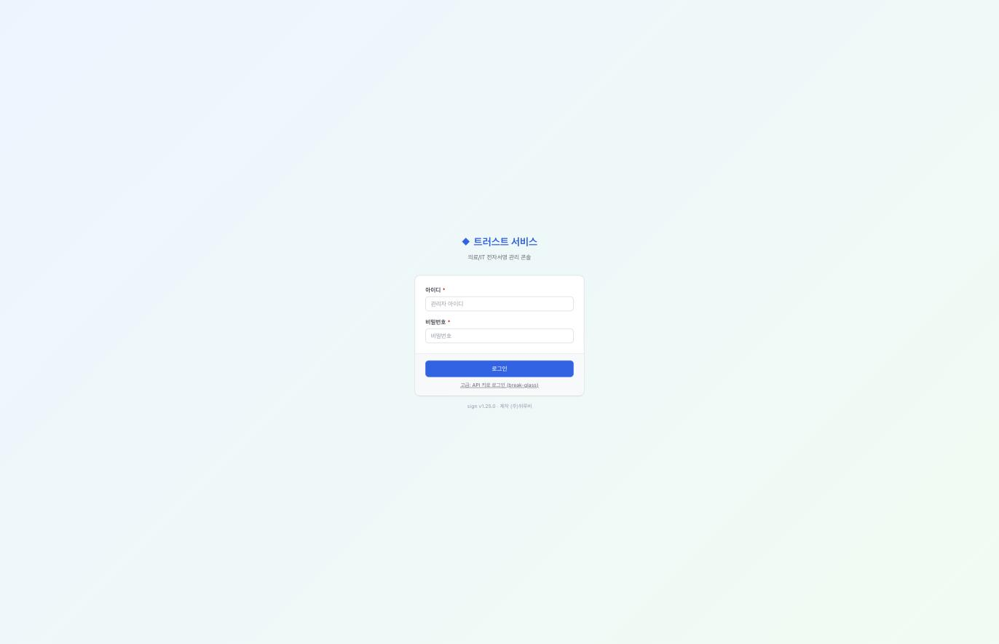
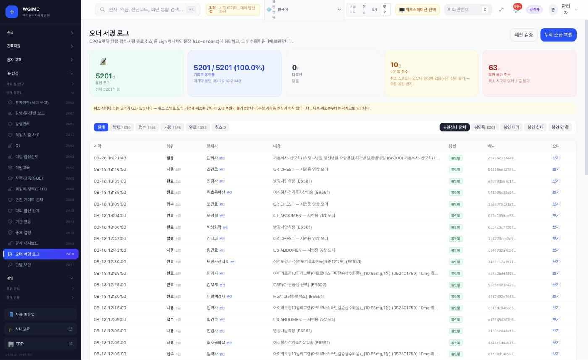
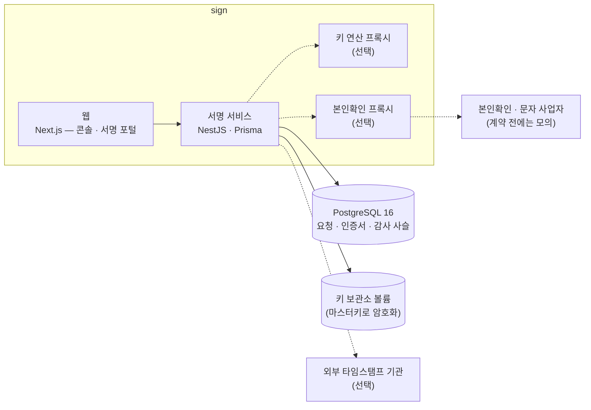
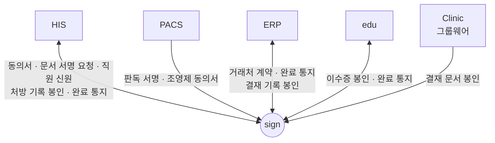

# sign — 서명의 증거를 만드는 시스템

**sign — the service that makes signatures provable**

> 프로젝트 소개서 · 읽는 사람: **의료 전산담당자** · 기준: sign 저장소의 **현재 개발본**(2026-09-29 · 끝의 [이 문서의 근거](#이-문서의-근거)) · [소개서 목록](README.md)

---

## Introduction (English)

sign is the ecosystem's electronic signature service. Its job is to make one thing checkable later, by anyone: **who signed what, when — and that it has not changed since.** Consent forms from HIS and PACS, radiology reports, e-learning completion certificates and contracts from the back office are all signed here.

For an IT team, the most important design fact is that **private keys live only in sign.** HIS, PACS, ERP and edu hold no signing keys; they ask sign to issue certificates and to sign. sign runs its own two-tier certificate authority, its own time-stamping authority (RFC 3161), and produces long-term PDF signatures (PAdES-LTA) that can still be verified after a certificate expires. Every action is appended to an audit hash chain, which is sealed periodically with a timestamp — optionally cross-sealed by an outside timestamp authority so a third party can check it without sign.

Technically it is a NestJS service with PostgreSQL 16 and a Next.js web app (admin console, signing portal, contract pages), deployed as three containers, with two optional proxies that move key operations and identity checks out of the main process. There is no GPU and no AI in sign.

What was checked for real: in September 2026, fresh installs were connected and nine links were called end to end — staff signing with an HIS-issued identity, completion notices back to HIS, ERP and edu, the sealing of HIS order-signature logs, PACS report signing and a patient consent signature, ERP vendor contracts and edu certificates.

What is not there yet, stated plainly: the CA keys are kept in software (no hardware security module yet); identity verification and text-message providers are mock providers until the hospital contracts real ones; there is no link to an accredited timestamp authority; long-term re-timestamping is not built. Details are in [What to know](#8-알아-둘-것).

---

## 1. 한 문장

> **EN** — sign makes "who signed what, when, and that it has not changed since" verifiable for the hospital's documents, and it is the only place in the ecosystem that holds signing keys.

**sign 은 병원 문서에 대해 「누가 · 언제 · 무엇에 서명했고, 그 뒤로 바뀌지 않았다」를 나중에 누구나 확인할 수 있게 만드는 전자서명 서비스입니다.**

생태계에서 **서명용 개인키**(서명을 만드는 비밀 열쇠)를 가진 곳은 sign 하나뿐입니다. HIS · PACS · ERP · edu 는 키를 갖지 않고, 서명이 필요하면 sign 에 요청합니다.

## 2. 병원 업무의 어디에 쓰이나

> **EN** — Most people meet sign without knowing it: a doctor signing a report, a patient signing a consent on a phone, a vendor signing a contract. Only the IT or security team logs in to the sign console, with three roles: administrator, operator and viewer.

대부분의 사람은 sign 화면에 직접 들어가지 않습니다. **다른 시스템에서 「서명」을 누르면 sign 이 뒤에서 서명을 만듭니다.**

| 누가 | 무엇을 하나(예) | 어디서 |
|---|---|---|
| 의사 · 판독의 | 동의서 · 판독문에 본인 서명 — HIS 가 발급한 신원으로 | HIS · PACS 화면 |
| 환자 · 보호자 | 동의서에 서명 — 휴대폰으로 받은 1회용 링크 | sign 서명 포털 |
| 외부 거래처 | 계약서에 서명 | sign 서명 포털 |
| 교육 담당 | 법정교육 이수증 발급(이수증은 시스템이 서명) | edu |
| 전산 · 보안 담당 | 인증서 발급 · 폐기 · 서명 요청 현황 · 감사 기록 · 연동 키 · 백업 상태 | sign 관리 콘솔(관리자 · 운영자 · 조회자) |

**장면으로 보면**

- **판독 서명** — 판독의가 PACS 에서 판독문을 확정하고 서명을 누릅니다. 판독의 본인임은 HIS 가 발급한 서명용 신원으로 확인되고, sign 이 판독문에 서명과 타임스탬프를 붙입니다. 확정하지 않은 판독문은 서명되지 않습니다.
- **조영제 동의** — 직원이 PACS 에서 동의서 서명을 요청하면 환자용 1회용 서명 링크가 만들어집니다. 환자는 본인확인을 거쳐 서명하고, 같은 링크로는 두 번 서명할 수 없습니다. 서명이 끝나면 PACS 의 동의서 상태가 「완료」로 바뀝니다.
- **동의서 완료 통지** — 동의서 서명이 끝나면 sign 이 HIS 에 **서명된 완료 통지**를 보냅니다. HIS 는 통지의 서명을 확인한 뒤에야 동의 상태를 바꿉니다. 서명이 틀리거나 없는 통지는 반영되지 않습니다.
- **처방 기록 봉인** — HIS 가 처방 행위(발행 · 접수 · 시행 · 완료 · 취소)의 서명 로그를 sign 의 감사 원장에 올립니다. 나중에 저장된 기록 하나를 바꾸면 검증이 「체인 불일치」로 드러납니다.

## 3. 할 수 있는 일

> **EN** — Seven groups: certificates and signatures (own CA, own timestamp authority, PAdES-LTA), tamper evidence (audit hash chain sealed by timestamps), key custody, signing channels (system-submitted, one-time portal link, staff sign-on, proxy), integration APIs and webhooks, optional general e-contracts, and the console with monitoring and backup. The web app has 38 screens.

웹 화면은 **38개**입니다(관리 콘솔 · 서명 포털 · 계약 교부와 진위 확인 페이지 — 웹 앱의 `page` 파일을 센 값).

| 묶음 | 무엇이 들어 있나 |
|---|---|
| **인증서 · 서명** | 자체 인증기관(2단 — 최상위와 발급용)이 서명자마다 인증서를 발급 · 자체 타임스탬프 · 장기 보존용 PDF 서명(PAdES-LTA) · 서명 **당시** 기준으로 인증서 폐기 여부를 확인하는 검증 |
| **위변조 증거** | 모든 행위(생성 · 발송 · 열람 · 서명 · 폐기)를 **추가만 되는** 해시 사슬에 쌓고, 사슬 머리를 타임스탬프로 봉인 · 외부 타임스탬프 기관의 교차 봉인(선택) |
| **키 보관** | 기본은 마스터키로 암호화한 소프트웨어 보관소 · 키 연산을 별도 프로세스로 떼어 내는 구성(선택) · 하드웨어 보안 모듈(HSM) · 클라우드 키 관리 어댑터(준비됨 · 아직 적용 안 함) |
| **서명 방식** | 연동 시스템이 서명을 요청 · 1회용 링크로 서명자가 브라우저에서 서명 · 의료진이 HIS 신원으로 서명 · 대리 서명. 서명의 위험도에 따라 본인확인 방법을 묶어 둡니다 |
| **연동** | 한 번의 호출로 인증서 발급과 서명 요청 · 서명된 완료 통지(웹훅 — 재시도 · 중복 방지) · 다른 시스템의 중요한 행위를 봉인해 두는 감사 원장 · 전체 API 명세(OpenAPI) |
| **일반 전자계약**(켜야 동작) | PDF 서식 · 발송 · 순차 · 동시 서명 · 보관 · 교부 링크 · QR 진위 확인 |
| **콘솔 · 운영** | 인증서 발급 · 폐기 · 역할별 권한 · 2단계 인증 · 비활동 로그아웃 · 연동 키 무중단 교체 · 이상 징후 탐지(백업 신선도 · 감사 사슬 무결성 · 로그인 실패 급증 · 통지 실패)와 메일 알림 |

전체 기능과 설정: [sign 구성서 §4](../systems/sign.md#4-핵심-기능) · 동의서 서명의 흐름: [동의서 전자서명](../functions/detail/consent-signature.md) · 처방 서명 봉인: [처방 서명](../functions/detail/order-signature.md).

### 화면으로 보기

> **EN** — Two screens: the sign console login, and the HIS screen that shows order-signature logs sealed into sign's audit chain. The inside of the console has not been captured yet.

| | |
|---|---|
|  **관리 콘솔 로그인** — 평소 경로가 막혔을 때 쓰는 비상 로그인(API 키)을 숨기지 않고 따로 둡니다 |  **HIS 의 오더 서명 로그** — sign 원장에 봉인된 처방 기록 · 사슬 검증 |

화면은 가상 병원 데이터가 든 리허설 설치본에서 찍었습니다(2026-09-12). 콘솔 안쪽(인증서 · 서명 요청 · 검증 결과)은 아직 찍지 못했습니다 — [sign 화면](../screens/sign.md).

## 4. 어떻게 만들어졌나

> **EN** — A TypeScript service (Node 22, NestJS, Prisma) on PostgreSQL 16, with a Next.js web app for the console and signing portal. The code is split into domain, application, infrastructure and presentation layers. Keys sit in an encrypted vault on its own volume; two optional proxies can take key operations and identity checks out of the main process. No cache, no message broker, no GPU.

| 구성 요소 | 무엇 | 기술 |
|---|---|---|
| **서명 서비스** | 인증기관 · 타임스탬프 · 서명 · 검증 · 감사 사슬 · 완료 통지 · API | Node 22 · NestJS · Prisma |
| **웹** | 관리 콘솔 · 서명 포털 · 계약 교부 · 진위 확인 | Next.js |
| **키 연산 프록시**(선택) | 키로 서명하는 일을 서명 서비스 프로세스 밖에서 | 같은 저장소 · compose 선택 프로필 |
| **본인확인 프록시**(선택) | 본인확인 사업자 연결을 별도 프로세스로 | 같은 저장소 · compose 선택 프로필 |

**데이터가 사는 곳**

| 저장소 | 무엇이 들어 있나 |
|---|---|
| **PostgreSQL 16** | 서명 요청 · 참가자 · 인증서 · 감사 사슬 · 연동 소비자 · 계약 — 데이터 모델 **14개** |
| **키 보관소 볼륨** | 인증기관 · 타임스탬프 키와 서명자 키 — 마스터키로 암호화. **재기동 뒤에도 남아야 하므로 볼륨 보존과 백업이 필수**입니다 |

- 코드는 **업무 규칙(domain) · 흐름(application) · 바깥 연결(infrastructure) · 입구(presentation)** 네 층으로 나뉘어 있습니다. 키 보관이나 본인확인 사업자처럼 바깥과 닿는 부분은 바깥 연결 층에 모여 있습니다(폴더 구성을 보고 읽은 것입니다).
- API 는 **162개** 동작입니다(OpenAPI 명세의 항목을 센 값 · 기준 커밋).

## 5. 다른 시스템과의 연결

> **EN** — Five systems call sign: HIS, PACS, ERP, edu and the groupware (Clinic). Staff identity comes from HIS and is checked with HIS's public key, so no shared secret is needed for it. Other systems use per-system API keys, and sign's completion notices carry an HMAC signature. Nine links were called for real between fresh installs in September 2026.

**sign 은 스스로 업무를 시작하지 않습니다.** 다른 시스템이 서명을 요청하고, sign 은 서명이 끝나면 요청한 시스템에 알립니다.

| 상대 | sign 이 받는 것 | sign 이 주는 것 | 로그인 · 인증 방식 | 실제로 연결해 확인했나 |
|---|---|---|---|---|
| **HIS** | 직원 신원(서명용) · 처방 서명 로그 봉인 · 동의서 · 발급 문서 서명 요청 | 서명 완료 통지 | 직원 신원은 HIS 공개키로 검증 · 시스템 연동 키 · 서명된 통지 | 직원 서명 · 완료 통지 · 처방 로그 봉인 **확인함**(2026-09-14) · HIS 화면에서 보내는 동의서 서명 요청은 만들어져 있음 · 확인은 아직 |
| **PACS** | 판독문 서명 · 조영제 동의서 서명 요청 | 서명 완료 | 연동 키 · 판독의 신원은 HIS 발급 | 둘 다 **확인함**(2026-09-15) |
| **ERP** | 외부 거래처 계약 서명 · 결재 기록 봉인 | 계약 완료 통지 | 연동 키 · 서명된 통지 | 계약 서명 · 완료 통지 **확인함**(2026-09-15) · 결재 기록 봉인은 만들어져 있음 · 확인은 아직 · 일반 전자계약 호출은 ERP 쪽에 아직 없음 |
| **edu** | 법정교육 이수증 봉인 · 폐기 · 철회 | 이수증 완료 통지 | 연동 키 · 서명된 통지 | 둘 다 **확인함**(2026-09-15) |
| **Clinic** | 그룹웨어 결재 문서 봉인 | — | 연동 키 | 만들어져 있음 · 확인은 아직(설치하지 않음) |

「확인함」은 2026년 9월에 새로 세운 설치본끼리 실제로 불러 본 결과입니다(가상 데이터). 틀린 키 · 위조한 통지 · 망가뜨린 신원 · 같은 링크 재사용을 일부러 넣어 거부되는 것도 확인했습니다([따라가 본 결과](../build-guide/follow-along-2026-09.md)).

- 완료 통지를 받는 쪽 주소는 운영 설정에서 **`https` 만** 받습니다. 원내 시스템이 `http` 로만 떠 있으면 앞에 TLS 를 두어야 통지가 들어갑니다.
- 통지는 실패하면 **5분마다 다시 보내고**, 계속 실패하면 「실패 확정」으로 멈춥니다 — 그 뒤에는 따로 다시 보내야 합니다. 재시도 스케줄러를 끄면 밖에서 주기적으로 불러 줘야 밀린 통지가 나갑니다.
- 부르는 쪽은 sign 주소를 **판본 경로(`/v1`)까지** 넣어야 합니다.

연결마다의 자세한 내용: [연결 카드](../integration/cards/)(예: [HIS → sign](../integration/cards/his-to-sign.md) · [PACS → sign](../integration/cards/pacs-to-sign.md) · [sign → HIS](../integration/cards/sign-to-his.md)) · [연결 상태 표](../RELEASES/2026.09/compatibility.md) · 서명 · 재시도 규칙은 [공통 규약](../integration/contracts.md) · 전체 그림은 [신뢰의 사슬](../diagrams/trust-chain.md).

## 6. 설치 · 운영

> **EN** — Three containers (service, web, PostgreSQL) plus two optional proxies; database migrations apply on container start. The production image built and ran unchanged in the September 2026 rehearsal, but the compose file expects an external network to exist. Several secrets are mandatory and the service refuses to start without them. Backups are GPG-encrypted, and a lost backup passphrase means no backup can be opened.

### 필요한 것

| 항목 | 내용 |
|---|---|
| 서버 | 따라가기에서는 다른 시스템과 같은 개발 PC 에 함께 띄웠습니다(권장 사양은 계측하지 않았습니다). **GPU · 캐시는 필요 없습니다** |
| 소프트웨어 | 컨테이너(Docker) — 서명 서비스 · 웹 · PostgreSQL 16. 키 연산 · 본인확인 프록시는 선택 |
| 먼저 있어야 할 것 | 의료진 서명을 쓰려면 **HIS**(신원 발급 · 공개키 목록). 그 밖에는 없습니다 |
| 기관이 정할 것 | 공인 타임스탬프 기관을 쓸지 · 키 보관 장치(HSM)를 마련할지 · 본인확인 사업자와 문자 · 메시지 사업자 계약 |

### 설치 경로

- 운영용 compose 로 올립니다. 컨테이너가 뜰 때 **DB 스키마를 스스로 적용**합니다.
- 2026년 9월 따라가기에서 **운영용 이미지가 원본 그대로 빌드되고 떴습니다.** 다만 compose 가 **미리 만들어 둔 바깥 네트워크 하나를 요구**해, 새 서버에서는 네트워크를 만들거나 설정을 기관 구성에 맞게 바꿔야 합니다([구축 가이드 S4](../build-guide/S4-trust.md)).
- **첫 관리자**는 설치 때 환경 변수로 만듭니다. 없으면 기동 로그가 「관리자 계정 미부트스트랩」을 경고합니다.
- 테스트를 마치고 실운영으로 넘어갈 때는 **테스트 데이터와 인증기관을 새로 만드는 초기화 절차**가 있습니다. 이때 연동 시스템이 받아 둔 인증서도 다시 발급받습니다.

### 꼭 넣어야 하는 설정

- **없으면 시작하지 않는 것** — 마스터키 · 페퍼(키 보관소 암호화 재료) · HIS 연동 키 · 통지 서명 비밀. 임시 키로 떠서 조용히 도는 일이 없게 했습니다.
- **DB 비밀번호는 반드시 직접 넣습니다.**
- **주소** — 공개 주소 · HIS 공개키 목록 주소 등 몇몇 기본값에 **다른 설치본의 주소**가 들어 있습니다. 모두 자기 기관 값으로 바꿉니다([바꿔야 할 코드 기본값 — sign](../build-guide/replace-list.md#sign)).
- **본인확인 · 알림** — 사업자와 계약하기 전에는 **모의 공급자**로 동작하고, 서명 포털이 스스로 「데모」라고 표시합니다.
- **보안 헤더** — 콘솔 · 포털의 콘텐츠 보안 정책은 관찰 모드가 기본입니다. 위반 보고를 본 뒤 차단 모드로 바꿉니다.

### 백업 · 감시

- **백업** — DB 덤프를 만들어 목차까지 검사한 뒤 **GPG 로 암호화하고 평문을 바로 지웁니다.** 기본 보존은 로컬 14세대 · 서버 밖 30세대입니다. 키 보관소 볼륨도 백업 대상입니다.
- **백업이 멈춘 것은 「성공 신호가 안 온 것」으로 압니다.** 백업이 끝나면 앱에 성공 신호를 보내고, 기준 시간(기본 26시간)을 넘기면 경보가 납니다.
- **복구는 해 봐야 압니다.** 저장소 런북은 분기마다 복구 리허설을 두고, **복원본 위에서 감사 사슬 검증이 통과해야** 성공으로 봅니다.
- **이상 징후 탐지** — 감사 사슬 무결성 · 로그인 실패 급증 · 통지 실패 확정 · 준비 상태를 보고 메일로 알립니다. 알림 수신처를 넣지 않으면 로그에만 남습니다.

자세한 설정 키: [sign 구성서 §6](../systems/sign.md#6-주요-설정) · 설치 순서와 키 관리: [구축 가이드 S4](../build-guide/S4-trust.md).

## 7. 이렇게 만든 이유

> **EN** — Five design choices: keys live in one place only; signatures stay verifiable after certificates expire; the audit chain can be checked by an outsider; staff identity is verified with HIS's public key rather than a shared secret; and the service refuses to start without its key material.

| 설계 | 왜 |
|---|---|
| **개인키는 sign 한 곳에만** | 키를 지킬 곳을 하나로 줄이고, 「누가 서명했나」의 증거를 한 곳에서 만들고 검증하게 |
| **서명 당시를 기준으로 검증**(PAdES-LTA · 서명 시점의 폐기 여부) | 몇 년 뒤 인증서가 만료돼도 그 문서가 서명 당시 유효했음을 확인할 수 있게 — 의무기록은 오래 보존합니다 |
| **감사 사슬 + 타임스탬프 봉인 + 외부 교차 봉인(선택)** | 운영자 자신도 기록을 몰래 고칠 수 없게. 외부 봉인을 붙이면 제3자가 sign 없이 표준 도구로 확인할 수 있습니다 |
| **의료진 신원은 HIS 공개키로 검증** | 두 시스템이 비밀을 나눠 가질 필요가 없게. HIS 가 발급한 신원이 위조되면 검증에서 막힙니다 |
| **키 재료가 없으면 기동 거부** | 설정이 빠진 채 임시 키로 서명을 만들어 놓고 나중에 무효가 되는 일이 없게 |

대가도 있습니다 — 외부 인증기관에 기대지 않는 대신 **키를 기관이 보관**해야 하고, 마스터키나 백업 암호를 잃으면 과거 증거를 다시 열 수 없습니다([형제 시스템의 설계 기록 §5](../DESIGN-HISTORY-SYSTEMS.md)).

## 8. 알아 둘 것

> **EN** — CA keys are kept in software (no HSM yet); identity-verification and messaging providers are mocks until contracted; losing the master key or the backup passphrase means old evidence cannot be reopened. Also: no accredited timestamp authority, no long-term re-timestamping, single institution only, Korean-only screens, and the legal effect of signatures is for the hospital and its lawyers to judge.

- 🔴 **인증기관 키를 소프트웨어로 보관합니다.** 하드웨어 보안 모듈(HSM)은 어댑터만 준비돼 있고 적용되지 않았습니다. 실운영 전환 때 장비나 클라우드 키 관리 서비스를 마련해 옮기는 것을 권합니다.
- 🔴 **본인확인 · 문자 · 메시지 사업자 연결이 모의 상태입니다.** 실제 환자가 서명하기 전에 기관이 사업자와 계약해 연결을 끝냅니다.
- 🔴 **마스터키와 백업 암호를 잃으면 되돌릴 수 없습니다.** 서버 밖에도 보관합니다(저장소 런북은 사본 세 곳을 적습니다). 마스터키를 바꾸면 봉인된 연동 설정과 관리자 세션이 모두 무효가 됩니다.
- **공인 타임스탬프 기관과 연결돼 있지 않습니다** — 서명에는 자체 타임스탬프를 씁니다. 계약하면 주소 설정만 바꾸도록 돼 있습니다.
- **장기 보관 문서의 재타임스탬프**(인증서 수명보다 긴 보존을 위한 갱신)는 아직 없습니다.
- **한 기관(단일 테넌트)** 을 전제로 합니다. 화면은 **한국어뿐**입니다.
- 계약 첨부는 보존 기간을 설정하지 않으면 **영구 보관**됩니다.
- **전자서명의 법적 효력 판단**과 국내 검증필 암호모듈(KCMVP)이 필요한지는 구축 기관과 법무가 정합니다. 보안 기준 대응표는 `대응 설계` 이고 외부 인증 · 승인 증빙은 없습니다.

전체 한계와 대체 수단: [sign 구성서 §10](../systems/sign.md#10-한계와-대체-수단).

## 9. 통합 릴리즈 `2026.09` 이후 달라진 점

> **EN** — The integrated release `2026.09` pinned sign at 1.30.1. Since then there are 2 commits with no new version number: a test-account panel on the console login screen for development and rehearsal builds only, removed from production builds with a guard that checks the built output, and a script that creates the matching console users locally. The signing service itself did not change.

이 자료의 다른 문서(구성서 · 구축 가이드 · 연결 표)는 **통합 릴리즈 `2026.09`**(sign 1.30.1)에 맞춰 쓰여 있습니다. 그 뒤로 sign 에 **2커밋**(2026-09-13)이 더해졌고, 아직 **새 판 번호는 없습니다**(변경 이력의 「미발행」 절).

| 영역 | 달라진 것 |
|---|---|
| **콘솔 로그인** | 개발 · 리허설용 빌드에서만 로그인 화면에 **테스트 계정 패널**(관리자 · 운영자 · 조회자를 눌러 자동 입력)이 생겼습니다. HIS 와 같은 형태입니다 |
| **빌드 모드** | 웹을 빌드할 때 모드(개발 · 리허설 · 리얼)를 정하고, **정하지 않으면 리얼**입니다. 리얼 빌드에서는 패널과 계정 정보가 빈 껍데기로 바뀌고, 빌드 산출물에 계정 정보가 남았는지 직접 검사하는 확인 스크립트가 붙었습니다 |
| **도구** | 같은 계정을 로컬 개발 DB 에 만드는 스크립트(여러 번 돌려도 한 번만 생김) |
| **서명 서비스** | 바뀌지 않았습니다 — 인증서 · 서명 · 감사 · 연동 코드는 통합 릴리즈와 같습니다 |

## 10. 더 깊이

> **EN** — Where to go next.

| 알고 싶은 것 | 문서 |
|---|---|
| 구성 · 설정 키 · 연결 · 한계 전체 | [sign 구성서](../systems/sign.md) |
| 설치 순서 · 키 관리 · 백업 | [구축 가이드 S4](../build-guide/S4-trust.md) |
| 화면 | [sign 화면](../screens/sign.md) |
| 동의서 · 처방 서명이 흐르는 길 | [동의서 전자서명](../functions/detail/consent-signature.md) · [처방 서명](../functions/detail/order-signature.md) |
| 신뢰가 이어지는 모양 | [신뢰의 사슬](../diagrams/trust-chain.md) |
| 연결 하나를 자세히 | [연결 카드](../integration/cards/) · [공통 규약](../integration/contracts.md) |
| 실제로 확인한 것 | [따라가 본 결과](../build-guide/follow-along-2026-09.md) |
| 이 판에서 바뀐 것(통합 릴리즈 기준) | [sign 릴리즈 요약](../RELEASES/2026.09/systems/sign.md) |
| 소스 | [소스 받기](../SOURCES.md) — 저장소 `seanshin/sign` |

---

## 이 문서의 근거

> **EN** — What this introduction was written from.

| 항목 | 값 |
|---|---|
| 읽은 것 | sign 저장소의 **현재 개발본** — 커밋 `e2e51ac153a3`(2026-09-13) · 버전 표기 1.30.1(태그 뒤 미발행 커밋 포함) · 작업 트리의 미커밋 변경은 읽지 않음 |
| 비교 기준 | 통합 릴리즈 `2026.09` — 커밋 `93f56d839c3f`(1.30.1) · 그 뒤 2커밋 |
| 센 방법 | 웹 화면 = 웹 앱의 `page` 파일(2026-09-29 다시 셈) · 데이터 모델 = 스키마 파일의 `model` 선언(2026-09-29 다시 셈) · API = 기준 커밋 OpenAPI 명세의 동작 항목(2026-09-11 계측 · 이후 서버 코드 변경 없음) |
| 실제 연결 확인 | 2026-09-14~15 · 통합 릴리즈 기준 설치본끼리 · 가상 데이터([따라가 본 결과](../build-guide/follow-along-2026-09.md)) |
| 사실 확인 | sign 담당의 확인 전 · 생태계 자료 측이 저장소를 읽고 쓴 것 |
