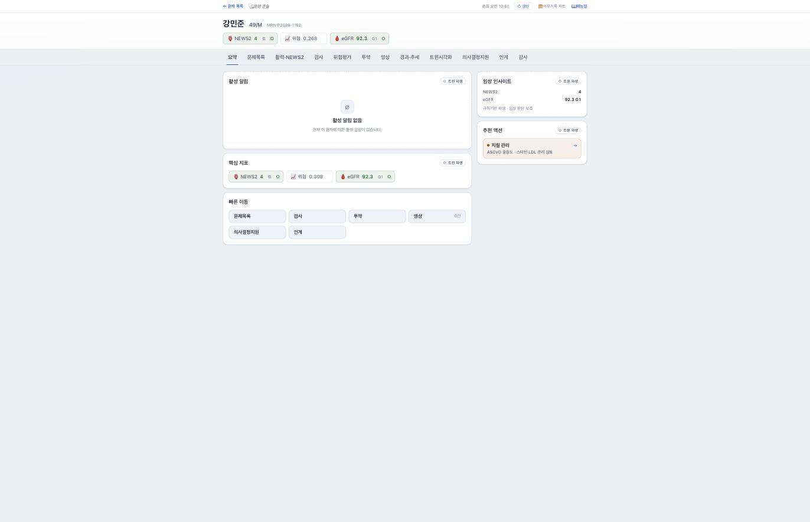
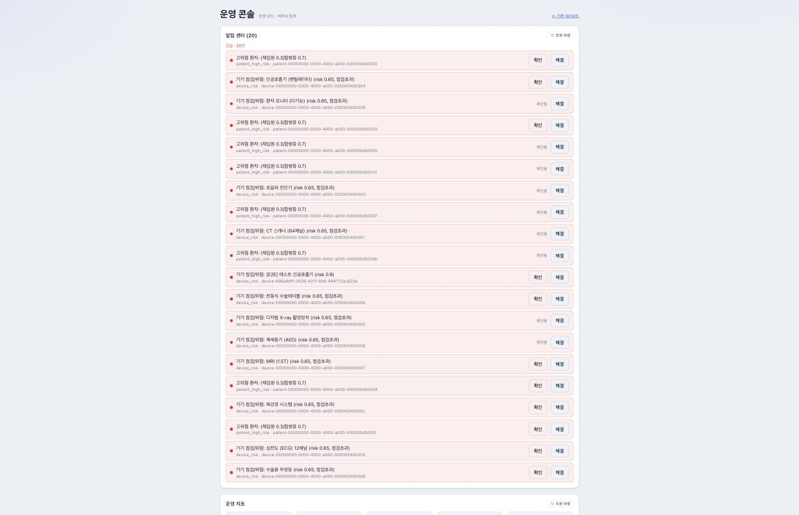
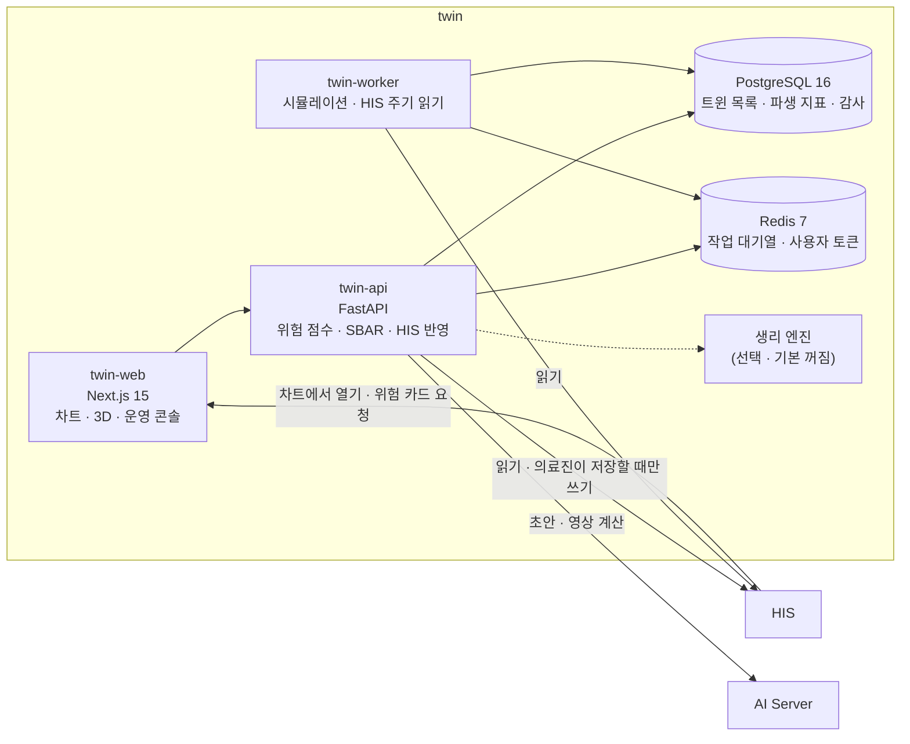
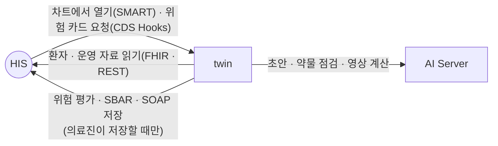

# twin — 환자와 병원 운영을 읽어 위험을 미리 보여 주는 디지털 트윈

**twin — a digital twin that reads the patient record and hospital operations to show risk ahead of time**

> 프로젝트 소개서 · 읽는 사람: **의료 전산담당자** · 기준: twin 저장소의 **현재 개발본**(2026-09-29 · 끝의 [이 문서의 근거](#이-문서의-근거)) · [소개서 목록](README.md)

---

## Introduction (English)

twin is a separate service that builds a "digital twin" of the hospital — a live model of its patients, beds, units and equipment — from data it **reads** out of HIS. For a clinician it opens from the patient chart and shows risk-score cards (cardiovascular, kidney, early warning, venous thromboembolism, pulmonary embolism severity, liver, pneumonia, atrial fibrillation, gastrointestinal bleeding, acute pancreatitis), an SBAR handover summary and simple what-if comparisons for treatments. For hospital management it offers an operations console with bed, ICU, emergency and operating-room indicators, discrete-event simulation for "what if we add beds or staff", and equipment maintenance risk.

The most important design fact for an IT team: twin does **not** own clinical data. Patient detail is fetched from HIS when someone opens it, and the twin database keeps only derived indicators, aggregates and identifiers. The only things twin writes back to HIS are a risk assessment, an SBAR note and a clinician-written SOAP note — and only when a clinician presses save on the screen, using that clinician's own authorization.

The numbers are not produced by a language model. Risk scores, the NEWS2 early-warning score and eGFR are calculated with published formulas, and the SBAR summary is rule-based. The AI Server is used only to assist: explanatory drafts, citations of reference documents, imaging calculations and the 3D patient avatar. AI output is labelled as machine-generated and never goes into the medical record by itself.

Technically it is a Python (FastAPI) API and worker with PostgreSQL 16 and Redis 7, plus a Next.js web app, all in Docker Compose; it needs no GPU of its own. It connects to HIS through SMART on FHIR app launch, CDS Hooks and FHIR R4, and to the AI Server through an API key.

Stated plainly: twin was **not installed** in the September 2026 follow-along, so none of its connections has been called for real yet. Whether it is a medical device has not been decided, the repository's own risk analysis marks two AI-related failure modes as needing action, and there is no database backup script yet. Details are in [What to know](#8-알아-둘-것).

---

## 1. 한 문장

> **EN** — twin reads data from HIS and shows clinicians risk-score cards and handover summaries, and shows managers bed, unit and equipment indicators with what-if simulation. At a glance: usable only with HIS in place; five containers — API, worker, PostgreSQL, Redis and the web app, which the compose file lists as an optional profile but which is needed to open twin from the HIS chart; the code to take is the same as the integrated release; nothing has been verified by a real call, because twin was not built in the September 2026 test installs.

**twin 은 HIS 의 자료를 읽어서, 의료진에게는 환자의 위험 점수와 인계 요약을, 병원 운영 쪽에는 병상 · 병동 · 장비 지표와 「이렇게 바꾸면 어떻게 되나」 시뮬레이션을 보여 주는 별도 서비스입니다.**

### 한눈에 — 도입 판단

| | |
|---|---|
| **지금 쓸 수 있나** | 조건부 — **HIS 가 있어야** 씁니다. 다른 시스템과 실제로 이어 본 적이 없고, 의료기기 해당 여부도 정해지지 않았습니다(8절) |
| **세워야 하는 것** | 컨테이너 5개 — API · 워커(같은 이미지) · PostgreSQL 16 · Redis 7 · 웹. 웹은 설치 파일에 선택 프로파일로 적혀 있지만 켜서 올립니다 — 빼면 HIS 차트에서 twin 을 열 수 없습니다. 생리 엔진 컨테이너는 선택입니다. GPU 는 필요 없습니다 |
| **먼저 있어야 할 것** | HIS — 앱 등록 · twin 전용 읽기 계정 · 환자의 AI 활용 동의 기록. AI Server — 설명 초안 · 아바타 · 영상 계산을 쓸 때만, 호출 키와 함께 |
| **받을 코드** | 통합 릴리즈 코드와 같은 현재 개발본입니다. 저장소 태그가 아니라 [소스 받기](../SOURCES.md)가 가리키는 커밋을 받습니다 |
| **실제로 확인된 것** | 없음 — 2026년 9월 시험 설치에서 twin 은 세우지 않았습니다. 화면 캡처는 가상 병원 데이터로 찍은 것이고, 연결 확인은 아닙니다 |
| **아직 모르는 것** | 동시 사용자 수 · HIS 에 주는 읽기 부하 · HIS 쪽 준비에 걸리는 시간 · 감사 기록 보존 기간 설정 · 의료기기 해당 여부 |

「디지털 트윈」은 실제 병원(환자 · 병상 · 장비)을 컴퓨터 안에 모형으로 옮겨 두고, 그 모형으로 상태를 보고 미래를 가늠하는 방식을 말합니다. twin 은 진료 기록의 원본을 갖지 않습니다. 원본은 HIS 에 있고, twin 은 필요할 때 읽어 와서 계산합니다.

## 2. 병원 업무의 어디에 쓰이나

> **EN** — Doctors and nurses open it from the chart to see risk cards and a rule-based SBAR summary; bed managers and executives use the operations console and simulation; biomedical engineering sees equipment risk; administrators manage alert rules and the audit log.

| 누가 | 무엇을 하나(예) |
|---|---|
| 의사 | 차트에서 twin 을 열어 위험 점수 카드를 보고, 카드마다 계산식 · 변수 · 원 논문을 펼쳐 봅니다. 치료 중재(금연 · 혈압 · 혈당 · 스타틴)의 효과를 비교합니다 |
| 간호사 | 조기경고 점수(NEWS2)와 활력 추세를 보고, 인계용 SBAR(상황 · 배경 · 평가 · 권고 순의 요약)를 확인합니다 |
| 병상 · 운영 관리 | 병상 · 중환자실 · 응급실 · 수술실의 점유와 부하를 보고, 병상을 늘리거나 인력을 바꾸면 어떻게 되는지 시뮬레이션합니다 |
| 의공 · 장비 관리 | 장비별 점검 준수와 고장 위험을 봅니다 |
| 시스템 관리자 | 알림 규칙을 정하고, 환자 정보 조회 감사 기록을 봅니다 |

**장면으로 보면**

- **외래의 한 환자** — 의사가 HIS 차트에서 twin 을 엽니다. 심혈관 · 신장 위험 카드가 뜨고, 흡연 여부처럼 차트에 없는 입력은 0 으로 채우지 않고 「입력 필요」로 표시됩니다. 의사가 화면에서 값을 넣으면 그 조회에만 반영되고 저장되지 않습니다.
- **병동 인계** — 간호사가 인계 탭에서 SBAR 요약을 봅니다. SBAR 는 규칙으로 만든 것이라 AI 문장이 섞이지 않습니다. AI Server 는 설명 초안 · 근거 인용 같은 보조만 맡습니다(3절). 의료진이 「차트 저장」을 눌러야 HIS 에 문서로 남습니다.
- **병상 회의** — 운영 담당자가 운영 콘솔에서 병동별 점유와 위험 분포를 보고, 「병상 10개를 늘리면 응급실 대기가 어떻게 바뀌나」를 시뮬레이션합니다. 이 화면에는 환자 이름이 나오지 않습니다.

## 3. 할 수 있는 일

> **EN** — Six groups: operations twin and simulation, equipment twin, patient risk-score cards with editable inputs, treatment what-if, clinical documents written back to HIS, and the patient avatar. An optional MCP server exposes read tools to external AI agents; its write tools are a second, separate switch and write only the same risk and SBAR documents. Web screens: 15.

웹 화면은 **15개**입니다(대시보드 · 환자 차트 · 3D 보기 · 운영 콘솔 · 영상 · 근거 자료 · 감사 · 알림 규칙 · 사용 설명 등 — 센 방법은 끝의 근거 절).

| 묶음 | 무엇이 들어 있나 |
|---|---|
| **운영 트윈** | **지표** — 병상 · 중환자실 · 응급실 · 수술실의 점유 · 회전 · 부하, 병동 단위 위험 분포 **시뮬레이션** — 병상 증설 · 인력 변경을 해 보면 어떻게 되나, 필요한 최소 인력 · 병상 수 찾기 |
| **장비 트윈** | 장비별 점검 준수 · 고장 위험(고장 나기 전에 점검할 때를 가늠하는 예지 정비) · 점검 초과 알림 |
| **환자 위험 점수 카드** | **10종** — 심혈관 · 신장 · 조기경고(NEWS2) · 정맥혈전색전증 · 폐색전증 중증도 · 간 · 폐렴 · 심방세동 · 소화기 출혈 · 급성 췌장염 **카드마다** — 계산식 · 변수 · 등급 · 적용 범위 · 원 논문 인용. 모든 모델은 모델 목록에 등재돼야 합니다 **입력** — HIS 가 FHIR 로 내주는 관찰 값에서 국제 검사 코드(LOINC)나 항목 이름으로 찾아 채웁니다 |
| **임상 입력** | 자동으로 채운 입력을 의료진이 화면에서 고칠 수 있습니다(그 조회에만 적용 · 저장 안 함). 빠진 입력은 「입력 필요」 |
| **치료 중재 비교** | 금연 · 혈압 · 혈당 · 스타틴 같은 중재의 효과를 여러 모델로 비교 |
| **임상 문서 · HIS 반영** | 위험 평가 · SBAR · SOAP(의료진이 쓴 경과 기록)를 FHIR 형식으로 HIS 에 저장 — 보내기 전에 형식 검증. 차트를 열 때 위험 카드를 HIS 화면에 띄우는 CDS Hooks(차트에 참고 카드를 끼워 넣는 표준) |
| **환자 아바타** | 장기 3D 모형 · 심장 전기 활동 시각화 · 예후 시뮬레이션 **기본 모형**은 twin 혼자 그립니다. AI Server 가 있으면 생리 반응이 움직이는 모습이 더해지고, 없거나 응답이 없으면 기본 모형으로 남습니다 **예후 시뮬레이션**은 별도 생리 엔진 컨테이너가 있어야 합니다 이보다 넓은 「장기 · 생체 3D 트윈」은 아직 설계 단계입니다(8절) |
| **외부 AI 에이전트 연결(선택)** | MCP 로 외부 AI 도구에 **읽기** 기능을 엽니다. 기본 꺼짐 · 켜면 응답의 직접 식별자를 가립니다. 쓰기 도구는 따로 켜야 하며(6절), 켜도 쓰는 것은 위의 위험 평가 · SBAR 뿐입니다 |
| **관측 · 감사** | 환자 정보 조회 감사 기록 · Prometheus 지표 · 요청별 지연과 HIS 호출 수 · 쓰는 AI 모델이 바뀌면 알림 |

업무별로 다시 묶은 것: [업무별 기능 지도](../functions/) · 설정 키까지 전부: [twin 구성서](../systems/twin.md).

### 화면으로 보기

> **EN** — Two screens captured with synthetic hospital data: the patient chart with twin-derived badges, and the operations console showing aggregates without patient names.

| | |
|---|---|
|  **환자 차트** — NEWS2 · 위험 점수 · eGFR 배지 · twin 이 만든 카드에 「트윈 파생 · 규칙기반 파생 · 임상 판단 보조」 표시 |  **운영 콘솔** — 「운영 모드 · 비PHI 집계」라는 화면 표시 · 이름 · 진단은 없고 환자는 번호로만 · 고위험 · 장비 알림 |

「비PHI」는 이름 · 진단 같은 직접 식별 정보를 화면에 싣지 않는다는 뜻입니다. 환자 번호는 보이고, 번호도 개인정보입니다. 그래서 이 화면과 twin DB 는 개인정보를 다루는 것으로 봅니다(4절).

화면은 가상 병원 데이터로 찍었습니다(2026-09-12). 설명은 [twin 화면](../screens/twin.md)에 있습니다.

## 4. 어떻게 만들어졌나

> **EN** — A Python 3.12 FastAPI API and a worker (simulation and periodic reading from HIS) sharing one image, PostgreSQL 16 for the twin registry and derived data, Redis 7 for the job queue and per-user tokens, and a Next.js 15 web app. An optional physiology-engine container and MCP server are off by default. No clinical record is stored in twin.

| 구성 요소 | 무엇 | 기술 |
|---|---|---|
| **twin-api** | 위험 점수 계산 · SBAR · HIS 반영 · 운영 지표 · 감사 · 지표 · 시작할 때 DB 스키마를 올림 | Python 3.12 · FastAPI · Alembic |
| **twin-worker** | 시뮬레이션 작업 실행 · HIS 에서 운영 자료를 주기적으로 읽음(기본 60초) · 알림 판정 | twin-api 와 같은 이미지 · SimPy(시뮬레이션 라이브러리) |
| **twin-web** | 의료진 화면 · 운영 콘솔 · 3D 보기 · 차트에서 여는 입구(SMART) — 설치 파일에서는 선택(`web` 프로파일)으로 적혀 있지만, 빼면 HIS 차트에서 twin 을 열 수 없어 **병원에서 쓰려면 사실상 필요합니다** | Next.js 15 |
| **생리 엔진** | 예후 시뮬레이션용 별도 컨테이너 — 선택(`pulse` 프로파일 · 기본 꺼짐) | 제3자 생리 엔진(Pulse)을 감싼 컨테이너 |
| **MCP 질의 서버** | 외부 AI 에이전트용 도구 — 기본 꺼짐 | twin-api 안 |

**데이터가 사는 곳**

| 저장소 | 무엇이 들어 있나 |
|---|---|
| **PostgreSQL 16**(twin 전용) | 트윈 목록과 상태 · 파생 지표 · 알림 규칙과 발송 기록 · 시뮬레이션 작업 · 환자 정보 조회 감사 기록 — **환자 이름 · 진단 문장 · 생년월일은 두지 않습니다.** 환자는 HIS 의 환자 번호로만 가리킵니다. 이 번호도 개인정보이므로 twin DB 는 개인정보가 든 DB 로 다룹니다 — 운영 콘솔의 「비PHI」 표시는 이름 · 진단이 없다는 뜻일 뿐입니다(3절) |
| **Redis 7** | 시뮬레이션 작업 대기열 · 의료진별 로그인 토큰 · 짧게 쓰는 캐시 |
| **HIS** | 환자 상세의 원본 — twin 은 화면을 열 때마다 읽어 옵니다. 병상 · 재원 같은 운영 자료는 워커가 기본 60초마다 읽습니다 |

- **규모** — API 핸들러 **107** · 웹 화면 **15** · 테스트 함수 **881**(근거 절의 센 방법).
- **감사 기록에 남는 것** — 누가(의료진 식별자 · 역할) · 언제 · 어느 환자 번호의 무엇을 · 어느 기능으로 · 어디서 접속했나. 진료 내용은 남기지 않습니다.
- **숫자는 계산식으로** — 위험 점수 · NEWS2 · eGFR 은 공표된 계산식으로 내고, SBAR 는 규칙으로 만듭니다. 언어 모델은 이 숫자에 끼어들지 않습니다.

## 5. 다른 시스템과의 연결

> **EN** — twin attaches to HIS (chart launch, CDS Hooks, FHIR reads, operations reads, write-back on clinician save) and to the AI Server (drafts, drug checks, imaging calculations). twin was not installed in the September 2026 follow-along, so every connection is built but not yet verified by a real call.

twin 은 **HIS 가 있어야** 쓸 수 있습니다. 의료진은 HIS 차트에서 twin 을 엽니다 — HIS 가 그 의료진과 환자를 묶어 넘겨주고, twin 은 HIS 의 공개키로 신원을 확인합니다.

연결 상태 표에 실린 twin 의 연결은 **7개**입니다(HIS 에서 들어옴 3 · HIS 로 나감 3 · AI Server 로 나감 1).

| # | 방향 | 무엇 | 로그인 · 인증 방식 | 실제로 연결해 확인했나 |
|---|---|---|---|---|
| 1 | HIS → twin | 차트에서 twin 열기 — 옛 방식 | HIS 가 만든 서명된 실행 링크(5분) | 만들어져 있음 · 실제 연결 확인은 아직 |
| 2 | HIS → twin | 차트에서 twin 열기 — SMART 방식 | SMART on FHIR 앱 실행 · HIS 공개키로 신원 확인 | 만들어져 있음 · 실제 연결 확인은 아직 |
| 3 | HIS → twin | 차트를 열 때 위험 카드 요청(CDS Hooks) | HIS 와 나눈 공유 비밀 | 만들어져 있음 · 실제 연결 확인은 아직 |
| 4 | twin → HIS | 환자 기록 읽기(FHIR) | 전용 서비스 계정 · 시스템 범위 읽기 토큰(SMART Backend Services) | 만들어져 있음 · 실제 연결 확인은 아직 |
| 5 | twin → HIS | 운영 자료 읽기 — 병상 · 병동 · 재원 · 장비 · AI 활용 동의 · 활력 | 전용 서비스 계정 | 만들어져 있음 · 실제 연결 확인은 아직 |
| 6 | twin → HIS | 위험 평가 · SBAR · SOAP 저장(의료진이 저장할 때만) | 저장을 누른 의료진 본인의 토큰 | 만들어져 있음 · 실제 연결 확인은 아직 |
| 7 | twin → AI Server | 초안 · 요약 · 약물 상호작용 · 영상 계산 요청 | 발급된 API 키 | 만들어져 있음 · 실제 연결 확인은 아직 |

1번과 2번은 둘 다 살아 있습니다. twin 은 두 방식을 모두 받도록 만들어져 있고, 어느 쪽으로 여는지는 HIS 쪽 구성에 달렸습니다. twin 이 PACS 에서 영상 목록을 읽는 기능도 있습니다. 이 연결은 연결 상태 표에 행이 없고 구성서에도 「확인 중」으로만 적혀 있어, 여기서도 상태를 적지 않습니다.

twin 은 2026년 9월 따라가기에서 **설치하지 않았습니다**([따라가 본 결과](../build-guide/follow-along-2026-09.md)). 연결마다의 자세한 내용은 [연결 카드 — HIS → twin](../integration/cards/his-to-twin.md) · [twin → HIS](../integration/cards/twin-to-his.md) · [twin → AI Server](../integration/cards/twin-to-ai-server.md)와 [연결 상태 표](../RELEASES/2026.09/compatibility.md)에 있습니다.

## 6. 설치 · 운영

> **EN** — Docker Compose with API, worker, PostgreSQL and Redis by default; the web app is an optional profile in the file but is needed in practice, since without it twin cannot be opened from the HIS chart; the physiology engine is optional. Most safety switches ship off; only evidence citations and the avatar ship on. No GPU on the twin server. HIS must register twin as a SMART app and issue a read-only service identity; the AI Server must issue a key. The API applies database migrations on start. The Redis password is mandatory.

### 필요한 것

| 항목 | 내용 |
|---|---|
| 서버 | 컨테이너(Docker Compose)가 도는 서버. **GPU 는 필요 없습니다**(무거운 계산은 AI Server 가 합니다). 저장소 배포 안내는 컨테이너 메모리 상한의 합을 약 2.8GB 로 적습니다 |
| 먼저 있어야 할 것 | **HIS**(필수) · AI Server(초안 · 아바타 · 영상 계산을 쓰려면) |
| HIS 쪽 준비 | SMART 앱 등록(차트에서 열기용 · 시스템 범위 읽기용 — HIS 관리 화면 `/admin/smart-clients`) · twin 전용 읽기 서비스 계정 · AI 활용 동의 조회. 걸리는 시간은 재 보지 않았습니다 |
| AI Server 쪽 준비 | 호출 키 · 쓸 모델 |

### 설치 순서(저장소 기준)

1. 설정 파일(`.env`)을 예시에서 복사해 DB · Redis 비밀번호 · API 키 · HIS 와 AI Server 주소 · SMART 클라이언트를 채웁니다. **Redis 비밀번호와 API 키는 비어 있으면 시작하지 않습니다.**
2. `docker compose up` 으로 API · 워커 · DB · Redis 를 올리면서 `web` 프로파일을 붙입니다. 웹이 없으면 HIS 차트에서 twin 을 열 수 없습니다(4절).
3. API 가 시작할 때 DB 스키마(마이그레이션)를 자동으로 올립니다.
4. 의존성 상태 확인 주소로 HIS · AI Server 연결을 봅니다.

### 운영 전에 정할 스위치

대부분 **꺼진 채로** 옵니다. 켜진 채로 오는 것은 맨 아래 「근거 인용 · 환자 아바타」 하나뿐입니다.

| 스위치 | 뜻 | 기본 |
|---|---|---|
| 환자 동의 요구 | 워커가 주기적으로 읽을 때 HIS 의 AI 활용 동의를 먼저 확인하고, 동의가 없으면 파생 지표를 만들지 않음 — 저장소는 동의 운영을 확인한 뒤 켜기를 권함 | 꺼짐 |
| 웹 · API 사이 신원 서명 검증 강제 | 웹이 API 에 넘기는 사용자 · 역할 정보에 붙인 서명을 API 가 확인하게 합니다. 운영 전에 켭니다 | 꺼짐 |
| MCP 질의 서버 | 외부 AI 에이전트용 | 꺼짐 |
| MCP 쓰기 도구 | 질의 서버와 별개의 스위치. 켜도 「미리보기 → 확인」 두 단계와 의료진 로그인 세션이 있어야 위험 평가 · SBAR 를 기록 | 꺼짐 |
| 생리 엔진 예후 | 별도 컨테이너 | 꺼짐 |
| 근거 인용 · 환자 아바타 | 근거 인용은 AI Server 를 부름 · 아바타는 AI Server 가 있으면 생리 반응을 더함(3절) | 코드 기본값은 켜짐. AI Server 가 없으면 근거 칸은 카드에서 빠지고, 아바타는 기본 모형만 보입니다. 켤지는 기관이 정합니다 |
| 관리자 보조 로그인 | HIS 를 거치지 않고 비밀번호로 들어오는 관리자 진입 | 비밀번호를 넣지 않으면 꺼짐 |

환자의 AI 활용 동의 기록은 **HIS 에 하나** 있습니다. 동의가 없으면 HIS 가 차트에서 twin 을 여는 실행과 twin 의 되쓰기를 거부합니다([구축 가이드 S6](../build-guide/S6-ai.md)). twin 의 「환자 동의 요구」 스위치는 여기에 더해, 워커가 주기적으로 읽을 때도 같은 동의를 확인하게 할지를 정합니다.

### 백업 · 감시

- **백업** — 저장소에 twin DB 백업 스크립트는 없습니다. 운영 안내가 「실운영 전환 때 만들 항목」으로 적어 두었습니다. twin DB 에만 있는 것은 환자 정보 조회 감사 기록 · 알림 규칙과 발송 기록 · 시뮬레이션 결과입니다. 감사 기록의 보존 기간 설정은 찾지 못했으니 기관 규정에 맞춰 정합니다.
- **부하** — 동시 사용자 수와 HIS 에 주는 읽기 부하는 계측하지 않았습니다.
- **상태 확인** — 살아 있나 · 의존성(HIS · AI Server) 상태 주소 · Prometheus 지표.
- **모델 감시** — 쓰는 대화 모델의 이름과 지문(digest)을 설정으로 고정하고, 기본 6시간마다 AI Server 와 대조해 바뀌면 알립니다.

설정 키 전체: [twin 구성서 §6](../systems/twin.md#6-주요-설정) · 구축 순서: [구축 가이드 S6](../build-guide/S6-ai.md).

## 7. 이렇게 만든 이유

> **EN** — Four choices: read HIS instead of copying it; numbers from formulas, not from a language model; nothing reaches the record without a clinician's save; missing inputs shown as "input needed", never as zero.

| 설계 | 왜 |
|---|---|
| **HIS 를 읽기만 하고 복사하지 않는다** — twin DB 에는 파생 지표와 집계만 | 진료 기록의 원본이 두 곳이 되면 어느 쪽이 맞는지 모르게 됩니다. twin 을 떼어 내도 HIS 는 그대로입니다 |
| **숫자는 계산식으로, 언어 모델은 설명만** | 위험 점수가 모델의 그날 상태에 따라 달라지면 믿을 수 없습니다. 공표된 식은 누구나 다시 계산해 볼 수 있습니다 |
| **의료진이 저장해야 기록이 된다** — AI 출력은 `machine-generated` 표시 · 의무기록에 직접 들어가지 않음 | AI 가 쓴 문장이 사람의 확인 없이 진료 기록이 되지 않게 |
| **모르는 입력은 0 이 아니라 「입력 필요」** | 빈 값을 0 으로 채우면 위험이 낮게 계산됩니다. 모자란 것을 모자라다고 보여 줘야 의료진이 채웁니다 |
| **환자 화면과 운영 화면을 나눈다** | 운영 회의에 환자 이름이 필요 없습니다. 개인정보를 볼 사람과 집계를 볼 사람을 화면 단위로 가릅니다 |

## 8. 알아 둘 것

> **EN** — Not installed in the follow-along, so none of the 7 connections is verified; medical-device status undecided and two AI failure modes marked as needing action; no database backup script; the code declares a version newer than the last tag; the 3D organ twin is only a design.

- 🔴 **실제 연결 확인이 하나도 없습니다** — twin 은 2026년 9월 따라가기에서 설치하지 않았습니다. 5절 표의 연결 7개 모두 「만들어져 있음 · 실제 연결 확인은 아직」입니다.
- 🔴 **의료기기 해당 여부가 정해지지 않았습니다** — 안전 등급 분류는 예비 단계입니다. 저장소의 위험 분석(FMEA)은 AI 관련 고장 가운데 **자동화 편향**(사람이 AI 결과를 그대로 믿는 것)과 **데이터 편향** 두 가지를 「조치 필요」로 두었습니다(정량 검증을 아직 하지 않음). 판단과 인허가는 구축 기관이 합니다([의료 면책 고지](../DISCLAIMER.md)).
- **twin DB 백업 스크립트가 없습니다** — 볼륨 스냅샷 등으로 기관이 준비합니다. 환자 기록 원본은 HIS 에 있어 twin DB 를 잃어도 진료 기록은 남습니다.
- **안전 스위치 여럿이 꺼진 채로 옵니다** — 환자 동의 요구 · 신원 서명 검증 강제. 운영 전에 켤지 정합니다.
- **일부 입력은 자동으로 채워지지 않습니다**(수술 · 시술 세부 · 이동성 등) — 화면에서 넣거나 「미평가」로 남습니다. 흡연 상태가 없으면 가정값을 쓰고 가정했다고 표시합니다.
- **코드의 버전 표기가 마지막 태그보다 뒤입니다** — 코드는 1.20.88 을, 저장소의 마지막 태그는 v1.20.72 를 가리킵니다. 태그가 아니라 [소스 받기](../SOURCES.md)가 가리키는 커밋을 받습니다.
- **장기 · 생체 3D 트윈은 설계 단계**입니다. 별도 GPU · 고성능 연산 자원이 있어야 진행합니다.

전체 한계와 대체 수단: [twin 구성서 §10](../systems/twin.md#10-한계와-대체-수단).

## 9. 통합 릴리즈 `2026.09` 이후 달라진 점

> **EN** — The current head equals the base commit of the integrated release — nothing has changed.

기준 커밋과 같습니다 — 달라진 점 없음.

## 10. 더 깊이

> **EN** — Where to go next.

| 알고 싶은 것 | 문서 |
|---|---|
| 설정 키 · 연동 · 표준 · 한계 전체 | [twin 구성서](../systems/twin.md) |
| 이 버전에서 바뀐 것 | [릴리즈 요약](../RELEASES/2026.09/systems/twin.md) |
| 화면 | [twin 화면](../screens/twin.md) |
| AI 를 켜는 순서 | [구축 가이드 S6](../build-guide/S6-ai.md) · [AI 개요](../overview/07-ai.md) |
| 연결 하나를 자세히 | [연결 카드](../integration/cards/) · [연결 상태 표](../RELEASES/2026.09/compatibility.md) |
| 의사가 읽을 안내 | [의사 안내](../clinicians/physician.md) |
| 제3자 구성요소 · 모델 약관 | [THIRD_PARTY](../THIRD_PARTY.md) |
| 소스 | [소스 받기](../SOURCES.md) — 저장소 `seanshin/medical-digital-twin` |

---

## 이 문서의 근거

> **EN** — What this introduction was written from.

| 항목 | 값 |
|---|---|
| 읽은 것 | twin 저장소의 **현재 개발본** — 커밋 `526b4f9a4d3f`(2026-09-03) · 코드 선언 버전 1.20.88(저장소의 마지막 태그는 v1.20.72) · 작업 트리는 읽지 않음 |
| 비교 기준 | 통합 릴리즈 `2026.09` — 같은 커밋 `526b4f9a4d3f` |
| 센 방법 | API 핸들러 = API 코드의 FastAPI 라우터 HTTP 데코레이터 수 · 웹 화면 = 웹 앱의 `page.*` 파일 수 · 테스트 = `test_*.py` 의 테스트 함수 선언 수 — [규모 스냅샷](../data/scale-snapshot.json)(2026-09-11 계측 · 현재 개발본이 같은 커밋이라 그대로) · 스위치 기본값 = 설정 코드의 기본값 · 컨테이너 메모리 = 저장소 배포 안내의 값 · 연결 수 = 연결 상태 표의 twin 행 |
| 실제 연결 확인 | 없음 — 2026-09 따라가기에서 설치하지 않음 |
| 사실 확인 | twin 담당의 확인 전 · 생태계 자료 측이 저장소를 읽고 쓴 것 |
