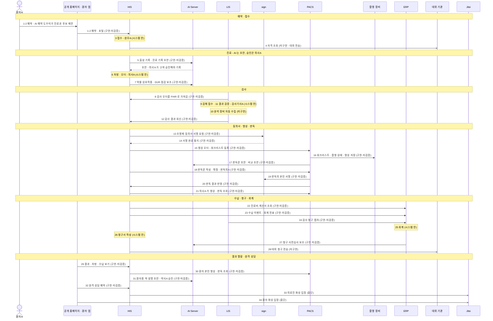

# 시나리오 01 — 외래 환자 한 명의 여정

> 🟡 **초안** — 화면 캡처 17 자리 중 ✅ 10 · 🟡 3(가상 병원 데이터 · [캡처 표](#화면-캡처-자리)) · 데모 병원 이름을 쓰는 화면은 이름을 정한 뒤 · 새 설치본으로 따라가 보기 전
> 연결 상태: [연결 상태 표](../RELEASES/draft/compatibility.md)(판정 2026-09-11 · 코드 대조 · 실제 호출 확인 없음) · 읽는 법은 [시나리오 안내](README.md#연결-상태를-읽는-법)

데모 병원 내과 외래에 처음 온 환자A 가 예약부터 원격 재진까지 가는 길입니다. 혈액검사와 조영 CT 를 받고, 결과를 앱으로 보고, 재진을 원격 상담으로 잡습니다. [ROADMAP §3 관통 흐름 1](../ROADMAP.md#3-관통-흐름--시스템-경계를-넘어-한-줄로-읽히는-것)과 [환자 여정 스윔레인](../diagrams/patient-journey.md)을 사람과 화면 쪽에서 다시 읽은 것입니다.

## 등장 인물

| 인물 | 하는 일 | HIS 역할 이름 |
|---|---|---|
| 환자A | 가상 외래 환자(내과 초진) | 환자 — HIS 사용자 역할이 아니라 환자 포털 · 환자 앱으로 들어옵니다 |
| 원무A | 접수 · 수납 · 보험 청구서 작성 | 원무 |
| 의사A | 내과 외래 진료 · 처방 · 결과 설명 | 의사 |
| 간호사A | 외래 간호 · 동의서 서명 요청 | 간호사 |
| 검사기사A | 진단검사 접수 · 결과 검증(LIS) | 검사기사 |
| 영상 검사기사A | CT 촬영 | 검사기사 |
| 판독의A | 영상 판독 · 판독 서명 | 의사 |
| 약사A | 환자용 약 설명 초안 감수 · 승인 | 약사 |
| 회계 담당A | ERP 전표 · 결산 | HIS 역할 밖(ERP 사용자) |

## 한눈에

## 단계 표

| # | 단계 | 누가 | 어느 시스템 | 무엇을 하나 | 연결 상태 | 화면 | AI 가 보조하는 곳 |
|---|---|---|---|---|---|---|---|
| 1 | 예약(홈페이지) | 환자A | 공개 홈페이지 → HIS | AI 예약 도우미에게 증상을 말하고, 날짜 · 시간을 골라 예약합니다 | `구현·미검증` HIS ⇄ 공개 홈페이지 · 예약(AI 예약 상담 · 포털) | 공개 홈페이지 예약 화면 · HIS `예약`(`/schedule`) | AI 가 대화에서 증상을 받아 **진료과 후보를 제안**합니다 → 진료과와 시간은 **환자A 가 직접 고릅니다** |
| 2 | 예약(앱 · 선택) | 환자A | 환자 앱 → HIS | 같은 예약을 환자 앱으로 합니다 | `구현·미검증` HIS ⇄ 환자 앱 · 포털 기능 | 환자 앱 예약 | 1과 같습니다(AI 예약 도우미 → 환자가 고름) |
| 3 | 접수 | 원무A | HIS | 환자A 를 접수하고 진료실 대기에 올립니다 | `시스템 안` | `접수`(`/reception`) · `진료실 대기`(`/clinic-queue`) | — |
| 4 | 자격 조회 | 원무A | HIS → 대외 기관 | 건강보험 자격을 대외 기관에 조회합니다 | `미구현` README — 대외 기관 전송 모듈 없음(연결 표 밖) · 설정 `eligibility.mode` 는 모의 모드 | `접수` | — |
| 5 | 진료 · 음성 기록 | 의사A | HIS → AI Server | 진료 대화를 음성으로 받아 적고 진료 기록 초안을 만듭니다 | `구현·미검증` HIS ⇄ AI Server · VoiceEMR 실시간 STT · 앰비언트 진료 스크라이브 | 진료과 화면(예: `내과` `/internal-medicine`) · `음성 설정 (VoiceEMR)`(`/settings/voice`) | AI 가 음성을 글로 옮기고 **진료 기록 초안**을 만듭니다 → **의사A 가 읽고 고쳐 승인해야** 진료기록이 됩니다. 승인 · 수정 · 거부는 AI 제안 원장에 남습니다 |
| 6 | 처방 · 오더 | 의사A | HIS | 약 처방과 혈액검사 · 조영 CT 오더를 넣습니다 | `시스템 안` | `처방(CPOE)`(`/orders`) | — (약속처방 · 처방 규칙은 규칙 기반입니다) |
| 7 | 약물 점검 | 의사A | HIS → AI Server | 처방한 약의 병용 · 연령 · 용량 주의 등을 점검합니다 | `구현·미검증` HIS ⇄ AI Server · 임상 보조 스킬(약물상호작용 · DUR) | `처방(CPOE)` | AI Server 가 공공 DUR 기준을 먼저 조회하고 **참고 정보**를 문장으로 냅니다 → **처방을 유지할지 바꿀지는 의사A 가 정합니다.** 실시간 처방 차단이 아닙니다 |
| 8 | 검사 오더 전달 | (자동) | HIS → LIS | LIS 가 HIS 의 검사 오더를 FHIR 로 가져갑니다(연결 표 기준 5분 주기 증분 폴링) | `구현·미검증` HIS ⇄ LIS · 검사 오더 전달 | — | — |
| 9 | 검체 접수 | 검사기사A | LIS | 검체를 접수하고 라벨을 붙입니다(분주 · 거부 · 재채취 포함) | `시스템 안` | LIS 접수 | — |
| 10 | 장비 결과 수집 | (자동) | 검사 장비 → LIS | 분석 장비의 결과를 LIS 로 자동으로 받습니다 | `미구현` 검사 장비 ⇄ LIS · 장비 결과 자동 수집 | — | — |
| 11 | 결과 검증 | 검사기사A | LIS | 결과 파일 입력 · 수기 입력 → 자동 검증 · 델타 체크 → 2차 검증으로 확정합니다. 입력자와 검증자가 같으면 검증을 막습니다 | `시스템 안` | LIS 결과 · 검증 | — (자동 검증은 규칙 기반 판정입니다) |
| 12 | 결과 회신 | 검사기사A | LIS → HIS | 확정 결과를 FHIR DiagnosticReport 로 HIS 에 보내고, HIS 에서 직원이 확인한 뒤 반영합니다 | `구현·미검증` HIS ⇄ LIS · 검사 결과 전달 | `검사실`(`/lab`) · `검사·영상 보드`(`/diagnostics-board`) | — |
| 13 | 조영제 동의서 | 간호사A · 환자A | HIS → sign | 조영 CT 동의서의 서명을 요청하고, 환자A 가 서명합니다 | `구현·미검증` HIS ⇄ sign · 동의서 서명요청 제출 | `동의서`(`/workstation/consent`) | — |
| 14 | 서명 완료 반영 | (자동) | sign → HIS | 서명 완료가 HIS 의 동의서 상태에 반영됩니다 | `구현·미검증` HIS ⇄ sign · 서명 이벤트 통지 | `동의서`(`/consent`) | — |
| 15 | 영상 오더 → 워크리스트 | (자동) | HIS → PACS | 조영 CT 오더가 PACS 워크리스트에 등록됩니다 | `구현·미검증` HIS ⇄ PACS · 워크리스트 자동 등록 | `영상실`(`/imaging`) | — |
| 16 | 촬영 | 영상 검사기사A | PACS → 촬영 장비 | 장비가 워크리스트를 받아 촬영하고, 촬영 상태를 알리고, 영상을 PACS 에 저장합니다 | `구현·미검증` 검사 장비 ⇄ PACS · MWL · MPPS · C-STORE | `영상실` 워크스테이션(`/workstation/imaging`) | — |
| 17 | 판독 보조 | 판독의A | PACS → AI Server | PACS 뷰어의 판독 모드에서 AI 패널을 엽니다 | `구현·미검증` AI Server ⇄ PACS · 영상 AI 보조 | PACS 웹 뷰어(판독 모드 · AI 패널) | AI 가 **예비 판독문 초안** · 이전 검사 비교 · 소견 설명 초안을 만듭니다 → **판독의A 가 고쳐 확정합니다.** AI 결과는 DICOM SR · SEG 로 남고, 판독의의 수용률이 집계됩니다 |
| 18 | 판독문 작성 · 확정 | 판독의A | HIS → PACS | HIS 판독 화면에서 판독문을 쓰고 확정합니다(PACS 화면에서 바로 쓸 수도 있습니다) | `구현·미검증` HIS ⇄ PACS · 판독 작성 · 수정 · 서명 프록시 | `판독 대기`(`/workstation/reading`) | — |
| 19 | 판독 서명 | 판독의A | PACS → sign | 판독의 본인이 판독보고서에 전자서명합니다(PACS 는 서명 키를 갖지 않습니다) | `구현·미검증` PACS ⇄ sign · 판독보고서 STAFF 전자서명 | PACS 판독 화면 | — |
| 20 | 판독 결과 반영 | (자동) | PACS → HIS | 확정 판독이 HIS 영상 결과에 반영되고 오더가 완료로 바뀝니다 | `구현·미검증` HIS ⇄ PACS · 판독 결과 반영 | `검사·영상 보드`(`/diagnostics-board`) | — |
| 21 | 결과 설명 | 의사A · 환자A | HIS → PACS | 의사A 가 HIS 에서 검사 결과와 영상 · 판독을 열어 환자A 에게 설명합니다 | `구현·미검증` HIS ⇄ PACS · 영상 조회 프록시 | `PACS 주치의 포털`(`/pacs-portal`) | — |
| 22 | 수납 | 원무A | HIS → ERP | 진료비 계산서를 ERP 산정값으로 조회해 수납합니다 | `구현·미검증` HIS ⇄ ERP · 진료비 계산서 조회 | `수납`(`/billing`) | — |
| 23 | 수납 → 회계 | (자동) | HIS → ERP | 수납 이벤트가 ERP 로 가서 회계 전표가 됩니다(같은 출처의 전표를 두 번 만들지 않음) | `구현·미검증` HIS ⇄ ERP · 운영 이벤트 전달 | — | — |
| 24 | 검사 청구 캡처 | (자동) | LIS → ERP | LIS 의 검사 수량이 ERP 산정으로 넘어갑니다 | `구현·미검증` ERP ⇄ LIS · 검사 청구 캡처 | — | — |
| 25 | 회계 | 회계 담당A | ERP | 전표 · 일마감 · 결산으로 이어집니다 | `시스템 안` | ERP | — |
| 26 | 보험 청구서 작성 | 원무A | HIS | 보험 청구서(EDI 서식)를 작성합니다 | `시스템 안` | `보험 청구`(`/claims`) | — |
| 27 | 청구 사전심사 | 원무A | ERP → AI Server | ERP 가 청구 전 사전심사를 합니다 | `구현·미검증` AI Server ⇄ ERP · 청구 사전심사 | ERP 청구 사전심사 | AI 가 고시 근거를 찾아 주고 **삭감 위험 평가를 보조**합니다 → **청구 내용의 확정은 원무A 가 합니다** |
| 28 | 대외 청구 전송 | 원무A | HIS → 대외 기관 | 작성한 청구서를 심사 기관에 보냅니다 | `미구현` README — 대외 기관 전송 모듈 없음(연결 표 밖) | `HIRA 청구`(`/admin/hira-edi`) — 화면이 **「전송 연동 미구축 · 원내 접수까지」** 라고 적고 수기 제출 절차를 안내합니다 | — |
| 29 | 결과 열람 | 환자A | 환자 앱 → HIS | 검사 결과 · 처방 · 수납 내역을 봅니다 | `구현·미검증` HIS ⇄ 환자 앱 · 포털 기능 | 환자 앱 결과 · 수납 | — |
| 30 | 영상 · 판독 열람 | 환자A | HIS(환자 포털) → PACS | 본인 영상 목록 · 판독 · 판독 PDF 를 봅니다 | `구현·미검증` HIS ⇄ PACS · 환자 본인 영상 · 판독 조회 | 환자 앱 영상검사 | — |
| 31 | 복약 설명 | 약사A · 환자A | HIS → AI Server | 환자용 약 설명을 앱에서 봅니다 | `구현·미검증` HIS ⇄ AI Server · 생성형 소형 클라이언트(환자 약 설명) | `AI 약물설명 승인`(`/admin/drug-explain`) · 환자 앱 복약 관리 | AI 가 환자용 **약 설명 초안**을 만듭니다 → **약사A 가 `AI 약물설명 승인` 화면에서 감수 · 승인합니다** |
| 32 | 원격 상담 예약 | 환자A | 환자 앱 → HIS | 재진을 원격 상담으로 예약합니다 | `구현·미검증` HIS ⇄ 환자 앱 · 포털 기능(원격진료 예약) | 환자 앱 원격진료 · HIS `화상진료`(`/telehealth`) | — |
| 33 | 의료진 화상 입장 | 의사A | HIS → Jitsi | 예약 시각에 화상 방에 들어갑니다 | `중단` HIS ⇄ Jitsi · 원격진료 화상 입장(의료진) | `화상진료` · `비대면진료`(`/remote-consult`) | — |
| 34 | 환자 화상 입장 | 환자A | 환자 앱 → Jitsi · HIS 환자 포털(웹) → Jitsi | 앱이나 웹 포털에서 화상 방에 들어갑니다 | `중단` 환자 앱 ⇄ Jitsi · 원격진료 입장 / HIS ⇄ Jitsi · 환자 화상 입장 | 환자 앱 원격진료 | — |

- 21 에서 HIS 화면이 영상 바이트를 PACS 에서 중계해 보여 주는 연결(WADO)은 `판정 불가`입니다 — 배포 구성(주소 · 앞단 프록시)에 따라 달라집니다. 새 설치본에서 확인합니다.
- 13 의 영상 · 조영제 동의서는 PACS 에서 sign 으로 바로 서명을 요청하는 연결도 있습니다(PACS ⇄ sign · 영상 · 조영제 동의서 환자 서명 · `구현·미검증`). 두 경로를 어떻게 나눠 쓸지는 새 설치본으로 따라가 보며 정리합니다.
- 12 의 결과 회신에는 HL7 v2(ORU^R01) 대체 경로도 있지만 `미구현`입니다. FHIR 주 경로를 씁니다.

## 사람이 결정 · 승인하는 지점

**업무 중에 사람이 정하는 곳**

| # | 누가 | 무엇을 정하나 |
|---|---|---|
| 1 · 2 | 환자A | AI 가 제안한 진료과 후보 가운데 진료과와 시간을 고릅니다 |
| 5 | 의사A | 진료 기록 초안을 승인 · 수정 · 거부합니다. 승인한 것만 진료기록이 됩니다 |
| 7 | 의사A | DUR 참고 정보를 보고 처방을 유지할지 바꿀지 정합니다 |
| 11 · 12 | 검사기사A | 2차 검증으로 결과를 확정합니다(입력자와 다른 사람). HIS 로 온 결과는 직원이 확인한 뒤 반영됩니다 |
| 13 | 환자A | 동의서에 서명합니다 |
| 17 · 18 · 19 | 판독의A | AI 초안을 고쳐 판독을 확정하고, 본인이 서명합니다 |
| 27 | 원무A | 사전심사 보조를 참고해 청구 내용을 확정합니다 |
| 31 | 약사A | 환자용 약 설명 초안을 감수 · 승인합니다 |

**구축 기관이 미리 정해 둘 것** — 결정 등록부 키는 [사람 결정 체크리스트](../checklist/decisions.md), 설정 키는 각 [시스템 구성서](../systems/) §6 에 있습니다.

| 무엇 | 어디서 | 이 시나리오의 단계 |
|---|---|---|
| AI 임상 기능을 어디까지 켤 것인가 — 선행 결정: AI 의 의료기기 해당성 확인 · 임상데이터 처리 경계 · 진료 음성 녹음 적법 근거 | 결정 등록부 `policy.ai.clinicalFeatureScope`(개시 전 필수) · `legal.ai.deviceClassification` · `legal.phiBoundary.gpuTier` · `legal.voiceRecording.basis` | 5 · 7 · 17 · 31 |
| 확정 전 초안을 누가 볼 수 있고 언제까지 두는가 | 결정 등록부 `draft.visibility` · `draft.retention` | 5 |
| AI 기능 스위치 — HIS 의 AI 전체 스위치는 코드 기본값이 켜짐, PACS 의 영상 자동 선별도 켜짐, PACS 의 AI 예비 판독문 초안은 꺼짐. 설치 직후 끄고 결정으로 켭니다 | HIS `ai.server.enabled` · PACS `SCREENING_ENABLED` · `ai_auto_draft` | 5 · 7 · 17 |
| PACS 가 HIS 의 워크리스트 등록을 받게 켜기 | PACS `HIS_INBOUND_ENABLED`(기본 꺼짐) | 15 |
| 전자서명 연결 — HIS 의 sign 연결 모드는 기본이 모의, PACS 의 sign 연결은 기본 꺼짐 | HIS `sign.mode` · PACS `SIGN_SERVICE_ENABLED` | 13 · 14 · 19 |
| 환자 본인 영상 열람 · 내보내기를 켤 것인가 | PACS `PATIENT_VIEW_ENABLED` · `PATIENT_EXPORT_ENABLED` · HIS `pacs.exportEnabled`(모두 기본 꺼짐) | 30 |
| 앱의 복약 AI 설명을 켤 것인가 | HIS `portal.aiDrugExplain`(기본 꺼짐) | 31 |
| 환자 앱을 스토어에 배포할 것인가 | 결정 등록부 `mobile.appStoreRelease` | 2 · 29 ~ 32 |
| 요양기관 종별 · 본인부담금 절사 | 결정 등록부 `billing.institutionType` · `policy.copay.rounding`(둘 다 개시 전 필수) | 22 |

## 이 시나리오에서 아직 안 되는 것

| 안 되는 것 | 근거 | 대체 수단 · 구축 기관이 할 일 |
|---|---|---|
| **자격 조회 · 대외 청구 전송**(4 · 28) | README · [HIS 구성서 §10](../systems/his.md#10-한계와-대체-수단) | 전송 모듈을 붙이거나 기존 청구 소프트웨어와 함께 씁니다. 청구서는 작성까지입니다 |
| **원격 상담 화상**(33 · 34) — Jitsi 현재 설치본이 동작하지 않습니다 | 연결 상태 `중단` · [Jitsi 구성서](../systems/jitsi.md) | 화상 시스템을 새로 구성합니다. 그전에는 원격 상담 예약(32)까지만 쓸 수 있습니다 |
| **분석 장비 → LIS 자동 수집**(10) | 연결 상태 `미구현` | 결과 파일 입력 · 수기 입력으로 운영하거나, 장비와 LIS 사이에 인터페이스 중계 장치를 둡니다 |
| **HL7 v2 대체 경로** — 검사 결과 ORU^R01 · 검사 처방 OML^O21 · 판독 결과 ORU^R01 · 환자 인구정보 ADT(PIX) | 연결 상태 `미구현` | 생태계 안에서는 FHIR · REST · DB 반영 경로를 씁니다. 다른 HIS 와 붙이려면 HL7 송신부를 추가합니다 |
| **환자 외부 영상 업로드**(환자 포털 → PACS 중계) | 연결 상태 `미구현` | 원내에서 PACS 의 업로드 센터 · 키오스크로 받습니다 |
| **환자 앱** — 스토어에 배포되지 않았고, 앱에서 신규 가입이 안 되며(본인인증 연동 없음), 푸시 알림 수신이 동작하지 않습니다 | [환자 앱 구성서 §10](../systems/patient-app.md#10-한계와-대체-수단) | 배포 결정 전에는 HIS 의 웹 환자 포털을 씁니다. 본인인증 업체 · 문자 발송 제공자를 붙입니다 |
| **문자 발송** — 제공자가 등록돼 있지 않아 본인확인 문자가 모의 발송입니다. sign 의 본인확인 사업자 · 문자 사업자도 모의입니다 | README · [sign 구성서 §10](../systems/sign.md#10-한계와-대체-수단) | 기관이 계약해 연결합니다. 동의서 서명 방식(13)은 그에 맞춰 정합니다 |
| **영상 AI 사전판독** — HIS 사용 매뉴얼상 "사용 불가"입니다 | [HIS 구성서 §10](../systems/his.md#10-한계와-대체-수단) | 판독은 PACS 의 판독 흐름(17 ~ 19)으로 합니다 |
| **오더세트 금기 조건**이 자동으로 평가되지 않고 "금기 수동 확인"으로 표시됩니다 | [HIS 구성서 §10](../systems/his.md#10-한계와-대체-수단) | 처방(6) 때 사람이 확인합니다 |
| **실제 호출로 확인된 연결이 없습니다** — 표의 `구현·미검증`은 코드가 맞물려 있다는 뜻입니다 | [연결 상태 표](../RELEASES/draft/compatibility.md) | 새 설치본으로 따라가 보며 `검증됨`과 확인일을 붙입니다 |

## 화면 캡처 자리

이미지는 [캡처 대장](../assets/CAPTURE-LEDGER.md)에 적고 사람이 확인한 것만 싣습니다. **아래 표의 「캡처」 칸이 채워진 자리는 [화면으로 보는 생태계](../screens/)에서 실물을 볼 수 있습니다**(2026-09-12 · 가상 병원 데이터가 든 리허설 설치본).

나머지 자리는 조건(AI 기능을 켠 설치본 · 형제 시스템 접속 · 수검자가 있는 날 등)이 갖춰진 뒤 채웁니다.

| 자리 | 담을 화면 | 시스템 · 화면 | 조건 | 캡처 |
|---|---|---|---|---|
| 01-01 | AI 예약 도우미 대화와 진료과 후보 | 공개 홈페이지 예약 | 데모 병원 이름 확정 뒤 | ⬜ |
| 01-02 | 접수와 진료실 대기 | HIS `접수` · `진료실 대기` | — | ✅ 들어옴 [`his-care-reception.png`](../assets/screens/his-care-reception.png) · [`his-care-clinic-queue.png`](../assets/screens/his-care-clinic-queue.png) |
| 01-03 | 진료 기록 초안과 승인 · 수정 · 거부 버튼(AI 표기와 면책 문구가 보이게) | HIS 진료과 화면 | AI 기능을 켠 설치본 | 🟡 진료과 화면 골격은 들어옴(세부 분과 탭 · 내 환자 · 차트 열기) · AI 초안 패널은 아직 [`his-care-internal-medicine.png`](../assets/screens/his-care-internal-medicine.png) |
| 01-04 | DUR 참고 정보가 붙은 처방 | HIS `처방(CPOE)` | AI 기능을 켠 설치본 | 🟡 화면은 들어옴 · DUR 패널을 연 상태는 아직 [`his-care-orders.png`](../assets/screens/his-care-orders.png) |
| 01-05 | 결과 검증(자동 검증 · 델타 체크 · 2차 검증) | LIS 결과 · 검증 | — | ✅ 들어옴 — 위험치 · QC 실패 · 위탁 회신이 사유 우선순위로 [`lis-verify-worklist.png`](../assets/screens/lis-verify-worklist.png) |
| 01-06 | 동의서 서명 요청과 서명 완료 상태 | HIS `동의서` · sign 서명 화면 | sign 연결을 모의가 아닌 모드로 | ✅ 들어옴(HIS 쪽 둘 — 워크스테이션에서 **요청**하고, 동의서 관리에서 **서명대기/서명완료**를 봄) · sign 서명 화면은 아직 [`his-support-consent.png`](../assets/screens/his-support-consent.png) · [`his-support-workstation-consent.png`](../assets/screens/his-support-workstation-consent.png) |
| 01-07 | 판독 모드의 AI 패널과 판독문 초안 | PACS 웹 뷰어 | AI 기능을 켠 설치본 | ⬜ |
| 01-08 | 판독 서명 | PACS 판독 화면 | — | 🟡 판독 큐가 들어옴(**판독 대기 → 작성 중 → 예비 판독 → 완료** 로 서명 전후가 갈림) · 서명 장면 자체는 아직 [`pacs-reading-queue.png`](../assets/screens/pacs-reading-queue.png) |
| 01-09 | 진료비 계산서(ERP 산정값)와 수납 | HIS `수납` | — | ✅ 들어옴(수납 대기열) · ERP 산정값이 뜬 계산서 상세는 아직 [`his-ops-billing.png`](../assets/screens/his-ops-billing.png) |
| 01-10 | 청구 사전심사의 고시 근거 · 삭감 위험 보조 | ERP 청구 사전심사 | — | ✅ 들어옴 — 케이스별 `BLOCK`/`WARN` · 위험액·청구액 병기 · 담당 `미배정` · AI 는 보조 버튼 [`erp-claim-precheck.png`](../assets/screens/erp-claim-precheck.png) · [`erp-dashboard.png`](../assets/screens/erp-dashboard.png) |
| 01-11 | 결과 · 영상 · 판독 열람 | 환자 앱 | 앱 빌드 뒤 | ⬜ |
| 01-12 | 환자용 약 설명 초안 감수 · 승인 | HIS `AI 약물설명 승인` | — | ✅ 들어옴 — **약사 승인분만 환자에게 노출** · 검수 기준 4가 화면에 · 🔴 **공개 정보 개정으로 재생성되면 승인이 자동 해제**되어 다시 검수 목록에 [`his-system-admin-drug-explain.png`](../assets/screens/his-system-admin-drug-explain.png) |
| 01-13 | 원격 상담 화상 | Jitsi | 화상 시스템을 새로 구성한 뒤 | ⬜ |
| 01-14 | 검체 접수와 상태별 분모(9단계) | LIS 접수 | — | ✅ 들어옴 — 접수·라벨발행 · 거부/분주/정정 · 총 40 중 응급 3 · 접수 10 · 진행 20 · 완료 7 · 보고 2 · 취소 1 [`lis-order-receipt.png`](../assets/screens/lis-order-receipt.png) |
| 01-15 | 영상 오더가 장비 워크리스트로 가는 자리(15·16단계) | PACS 워크리스트 | — | ✅ 들어옴 — **MWL 로 장비에 자동 제공 · MPPS 로 촬영 시작·완료 자동 보고** · 예약 9 · 취소 5 [`pacs-worklist.png`](../assets/screens/pacs-worklist.png) |
| 01-17 | 대외 청구 전송이 막힌 자리(28단계)와 수기 대체 절차 | HIS `HIRA 청구` | — | ✅ 들어옴 — 🔴 **「심평원 전송 연동 미구축 — 이 화면의 제출은 원내 접수까지입니다」** · 상태 이름이 아예 `원내 접수(미전송)` [`his-system-admin-hira-edi.png`](../assets/screens/his-system-admin-hira-edi.png) |
| 01-16 | 수납이 회계 전표가 되는 자리(23단계) | ERP 재무 | — | ✅ 들어옴 — 전표마다 **출처 배지**(patient · claims · scm · manual)와 원 이벤트 참조 [`erp-accounting.png`](../assets/screens/erp-accounting.png) |

## 근거

[연결 상태 표](../RELEASES/draft/compatibility.md) · [환자 여정 스윔레인](../diagrams/patient-journey.md) · [HIS 메뉴 구성](../systems/his-domains.md) · 시스템 구성서 [HIS](../systems/his.md) · [LIS](../systems/lis.md) · [PACS](../systems/pacs.md) · [sign](../systems/sign.md) · [ERP](../systems/erp.md) · [AI Server](../systems/ai-server.md) · [환자 앱](../systems/patient-app.md) · [공개 홈페이지](../systems/homepage.md) · [Jitsi](../systems/jitsi.md) · [HIS 릴리즈 요약](../RELEASES/draft/systems/his.md) · [사람 결정 체크리스트](../checklist/decisions.md) · [README 「지금 알고 시작해야 할 것」](../README.md#지금-알고-시작해야-할-것)
