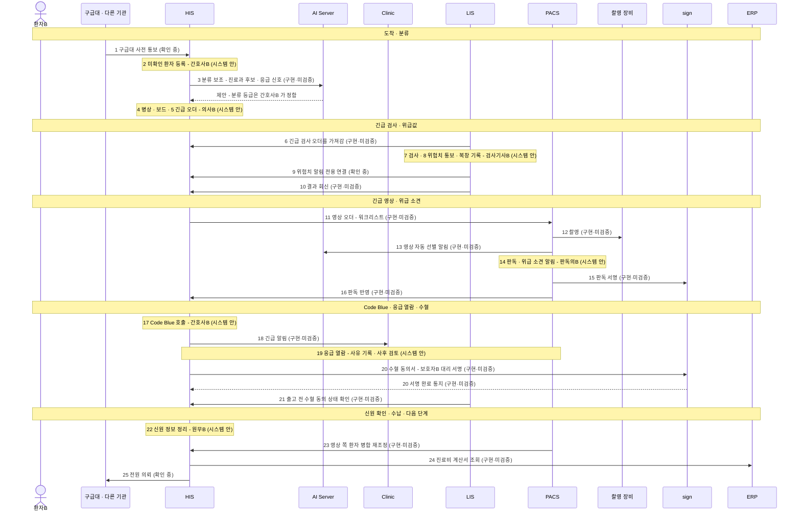

# 시나리오 02 — 응급

> 🟡 **초안** — 화면 캡처는 데모 병원 이름을 정한 뒤 넣습니다 · 새 설치본으로 따라가 보기 전
> 연결 상태: [연결 상태 표](../RELEASES/draft/compatibility.md)(판정 2026-09-11 · 코드 대조 · 실제 호출 확인 없음) · 읽는 법은 [시나리오 안내](README.md#연결-상태를-읽는-법)

의식이 흐린 환자B 가 구급차로 데모 병원 응급실에 옵니다. 신원을 모르는 채로 등록하고, 분류 · 긴급 검사 · 긴급 영상을 거치는 동안 위급값과 위급 소견이 나오고, 상태가 나빠져 Code Blue 가 호출됩니다. 수혈을 받은 뒤 전원하거나 입원합니다(입원은 [시나리오 04](04-inpatient-to-discharge.md)로 이어집니다).

응급에서는 **시간과 알림**이 중요합니다. 그래서 이 시나리오는 "알림이 어느 연결로 가는가"를 따로 적었고, 연결 상태 표에서 확인되지 않는 알림 경로는 `확인 중`으로 두었습니다.

## 등장 인물

| 인물 | 하는 일 | HIS 역할 이름 |
|---|---|---|
| 환자B | 가상 응급 환자(도착 때 신원 미확인) | 환자 |
| 보호자B | 나중에 도착한 가족 · 대리 서명 | 환자 쪽(HIS 사용자 아님) |
| 응급 간호사B | 등록 · 분류 · 병상 배정 · Code Blue 호출 | 간호사 |
| 응급 의사B | 진료 · 긴급 오더 · 전원 또는 입원 결정 | 의사 |
| 검사기사B | 긴급 검사 · 위험치 통보 · 혈액 출고 | 검사기사 |
| 영상 검사기사B | 긴급 CT 촬영 | 검사기사 |
| 판독의B | 긴급 판독 · 판독 서명 | 의사 |
| 원무B | 신원 확인 뒤 정보 정리 · 수납 | 원무 |

## 한눈에

입원이 결정되면(전원 대신) HIS 안에서 입원으로 넘어가 [시나리오 04](04-inpatient-to-discharge.md)가 이어집니다. 이 전환은 흐름도에 따로 그리지 않았습니다.

## 단계 표

| # | 단계 | 누가 | 어느 시스템 | 무엇을 하나 | 연결 상태 | 화면 | AI 가 보조하는 곳 |
|---|---|---|---|---|---|---|---|
| 1 | 구급대 사전 통보 | (외부) | 구급대 → HIS | 이송 전에 구급대가 환자 정보를 미리 알립니다 | `확인 중` 연결 상태 표에 없음 · 개시 점검 항목 `integ.ems119`(119 사전통보 개통)가 따로 있음 | — | — |
| 2 | 미확인 환자 등록 | 응급 간호사B | HIS | 신원을 모르는 채로 환자B 를 등록합니다 | `시스템 안` | `응급 미확인 등록`(`/patients/register/emergency`) | — |
| 3 | 분류(triage) | 응급 간호사B | HIS → AI Server | 증상에 따라 긴급도와 진료과를 가립니다 | `구현·미검증` HIS ⇄ AI Server · 임상 보조 스킬(트리아지) | `응급실`(`/emergency`) | AI 가 증상을 뽑아 **진료과 후보를 제시하고 응급 신호를 표시하며 추가 질문을 만듭니다** → **분류 등급은 간호사B 가 정합니다** |
| 4 | 병상 배정 · 보드 | 응급 간호사B | HIS | 응급실 병상을 배정하고 보드에 올립니다 | `시스템 안` | `응급실 보드`(`/emergency-board`) · `응급실` 워크스테이션(`/workstation/emergency`) | — |
| 5 | 초기 진료 · 긴급 오더 | 응급 의사B | HIS | 진료하고 긴급 혈액검사 · 긴급 CT 오더를 넣습니다 | `시스템 안` | `처방(CPOE)`(`/orders`) | — |
| 6 | 긴급 검사 오더 전달 | (자동) | HIS → LIS | LIS 가 HIS 의 검사 오더를 FHIR 로 가져갑니다 | `구현·미검증` HIS ⇄ LIS · 검사 오더 전달(연결 표 기준 5분 주기 증분 폴링) | — | — |
| 7 | 긴급 검사 | 검사기사B | LIS | 검체를 접수해 검사하고 자동 검증 · 델타 체크로 확인합니다 | `시스템 안` | LIS 결과 · 검증 | — (자동 검증은 규칙 기반 판정입니다) |
| 8 | 위험치 통보 · 복창 | 검사기사B → 응급 의사B | LIS | 위험치를 담당 의료진에게 통보하고, 받은 사람의 복창을 기록합니다. 응답이 없으면 상향합니다 | `시스템 안` LIS 의 위험치 폐루프(통보 · 상향 · 복창 기록) | LIS 위험치 | — |
| 9 | 위험치 화면 알림 | (자동) | LIS → HIS | HIS 화면에 위험치를 따로 알립니다 | `확인 중` 연결 상태 표의 LIS → HIS 에는 결과 전달만 있고 위험치 알림 전용 연결은 없음 | — | — |
| 10 | 결과 회신 | 검사기사B | LIS → HIS | 확정 결과를 HIS 로 보내고, HIS 에서 직원이 확인한 뒤 반영합니다 | `구현·미검증` HIS ⇄ LIS · 검사 결과 전달 | `검사·영상 보드`(`/diagnostics-board`) | — |
| 11 | 긴급 영상 오더 | (자동) | HIS → PACS | 긴급 CT 오더가 PACS 워크리스트에 등록됩니다 | `구현·미검증` HIS ⇄ PACS · 워크리스트 자동 등록 | `영상실`(`/imaging`) | — |
| 12 | 촬영 | 영상 검사기사B | PACS → 촬영 장비 | 워크리스트로 촬영하고 영상을 PACS 에 저장합니다 | `구현·미검증` 검사 장비 ⇄ PACS · MWL · MPPS · C-STORE | `영상실` 워크스테이션(`/workstation/imaging`) | — |
| 13 | 영상 자동 선별 | 판독의B | PACS → AI Server | 영상이 들어오면 조치가 필요할 수 있는 소견을 골라 판독의에게 알립니다 | `구현·미검증` AI Server ⇄ PACS · 영상 AI 보조 | PACS 응급 보드 | AI 가 조치가 필요할 수 있는 소견을 골라 **알림을 올립니다** → **영상을 보고 판단하는 것은 판독의B 입니다.** 코드 기본값이 켜짐이라 설치할 때 끄고 기관 결정 뒤 켭니다 |
| 14 | 판독 · 위급 소견 알림 | 판독의B | PACS | 긴급 판독을 하고, 위급 소견을 실시간 알림으로 올립니다 | `시스템 안` PACS 의 응급 보드 · 위급 소견 실시간 알림 | PACS 응급 보드 · 판독 화면 · HIS `판독 대기`(`/workstation/reading`) | 판독문 초안 보조는 [시나리오 01](01-outpatient-journey.md) 17 과 같습니다(판독의가 고쳐 확정) |
| 15 | 판독 서명 | 판독의B | PACS → sign | 판독의 본인이 판독보고서에 서명합니다 | `구현·미검증` PACS ⇄ sign · 판독보고서 STAFF 전자서명 | PACS 판독 화면 | — |
| 16 | 판독 반영 | (자동) | PACS → HIS | 확정 판독이 HIS 에 반영됩니다 | `구현·미검증` HIS ⇄ PACS · 판독 결과 반영 | `검사·영상 보드` | — |
| 17 | Code Blue | 응급 간호사B | HIS | 상태가 나빠진 환자B 에 대해 Code Blue · 신속대응팀을 호출합니다 | `시스템 안` | `Code Blue / RRT`(`/code-blue`) | — |
| 18 | 팀 긴급 알림 | (자동) | HIS → Clinic | 그룹웨어의 긴급 알림으로 팀에 알립니다 | `구현·미검증` HIS ⇄ Clinic · 업무 연동 API 군(알림 · 긴급 알림) | Clinic 알림함 | — |
| 19 | 응급 열람 | 응급 의사B | HIS · PACS | 평소 권한 밖의 기록 · 영상을 사유를 남기고 엽니다 | `시스템 안` 시스템마다 따로(연결 아님) | HIS `응급 접근 검토`(`/admin/break-glass`) | — |
| 20 | 수혈 동의서 | 응급 의사B · 보호자B | HIS ⇄ sign | 수혈 동의서 서명을 요청하고, 보호자B 가 대리 서명합니다. 서명 완료가 HIS 에 반영됩니다 | `구현·미검증` HIS ⇄ sign · 서명요청 제출 / 서명 이벤트 통지 | `동의서`(`/workstation/consent`) | — |
| 21 | 수혈 동의 확인 · 출고 | 검사기사B | LIS → HIS | 혈액을 내주기 전에 LIS 가 HIS 의 수혈 동의 상태를 확인합니다. 시행은 2인 확인입니다 | `구현·미검증` HIS ⇄ LIS · 수혈 동의 상태 참조 | `혈액은행`(`/blood-bank`) · `혈액은행` 워크스테이션(`/workstation/blood-bank`) | — (교차시험 · ABO 판정은 규칙 기반 판정입니다) |
| 22 | 신원 정보 정리 | 원무B | HIS | 신원이 확인되면 환자 정보를 채웁니다 | `시스템 안` | `환자 관리`(`/patients`) | — |
| 23 | 영상 쪽 환자 병합 | (관리자) | PACS → HIS | PACS 가 HIS 쪽 환자 병합을 읽어 영상의 환자 귀속을 다시 맞춥니다 | `구현·미검증` HIS ⇄ PACS · 영상 오더 동기화 · 환자 병합 재조정 | PACS 관리 화면 | — |
| 24 | 수납 | 원무B | HIS → ERP | 진료비 계산서를 ERP 산정값으로 조회해 수납합니다 | `구현·미검증` HIS ⇄ ERP · 진료비 계산서 조회 | `수납`(`/billing`) | — |
| 25 | 전원 의뢰 | 응급 의사B | HIS → 다른 기관 | 다른 기관으로 전원을 의뢰합니다(입원하면 [시나리오 04](04-inpatient-to-discharge.md)) | `확인 중` 연결 상태 표에 기관 사이 전원 연결이 없음 | `전원 의뢰`(`/transfer/request`) · `전원 관리`(`/transfer`) | — |

- 6: 연결 상태 표 기준으로 LIS 는 HIS 의 오더를 5분 주기로 가져갑니다(LIS 설정 `HIS_ORDER_POLL`). 긴급 검사에서 이 간격을 어떻게 다룰지 — 주기 설정 · 원내 연락 절차 — 는 새 설치본으로 따라가 보며 확인합니다.
- 18: 연결 표에는 HIS → Clinic 긴급 알림 연결이 있지만, Code Blue 호출(17)이 이 연결을 부르는지는 새 설치본으로 확인합니다.
- 22: 미확인 등록 기록과 확인된 환자 기록을 HIS 안에서 어떤 절차로 잇는지는 새 설치본으로 확인합니다. 영상 쪽은 23 의 연결이 있습니다.

## 사람이 결정 · 승인하는 지점

**업무 중에 사람이 정하는 곳**

| # | 누가 | 무엇을 정하나 |
|---|---|---|
| 3 | 응급 간호사B | AI 분류 보조의 제안을 참고해 분류 등급을 정합니다 |
| 8 | 검사기사B · 응급 의사B | 위험치를 통보하고 복창으로 받았음을 남깁니다 |
| 13 · 14 | 판독의B | 자동 선별 알림을 참고해 먼저 볼 영상을 정하고, 판독을 확정합니다 |
| 17 | 응급 간호사B | Code Blue 를 호출합니다 |
| 19 | 응급 의사B | 응급 열람의 사유를 남깁니다. 열람은 사후에 검토됩니다 |
| 20 | 보호자B | 수혈 동의서에 대리 서명합니다 |
| 21 | 검사기사B 외 1인 | 수혈 시행을 2인이 확인합니다 |
| 25 | 응급 의사B | 전원할지 입원할지 정합니다 |

**구축 기관이 미리 정해 둘 것** — 결정 등록부 키는 [사람 결정 체크리스트](../checklist/decisions.md), 설정 키는 각 [시스템 구성서](../systems/) §6 에 있습니다.

| 무엇 | 어디서 | 이 시나리오의 단계 |
|---|---|---|
| AI 임상 기능을 어디까지 켤 것인가 · AI 자동실행 범위(현행: 자동실행 없음) | 결정 등록부 `policy.ai.clinicalFeatureScope`(개시 전 필수) · `policy.ai.autonomyScope` · 선행 `legal.ai.deviceClassification` | 3 · 13 |
| 분류 규칙 | HIS `트리아지 관리`(`/admin/triage`) | 3 |
| 영상 자동 선별 — 코드 기본값이 켜짐 | PACS `SCREENING_ENABLED` · `SCREENING_ACTIONABLE_CONFIDENCE` | 13 |
| 경보 라우팅표 · 단계(tier)를 승인할 것인가 | 결정 등록부 `policy.alertRouting` | 8 · 9 · 14 · 18 |
| 직원 검사 결과 알림을 살릴 것인가 | 결정 등록부 `policy.labResult.staffNotify` | 9 |
| 위급 검사값을 환자에게도 알릴 것인가(현행: 보류) | 결정 등록부 `policy.criticalValue.patientNotify` | 8 |
| 위험치 외부 통보 채널 | LIS `CRITICAL_WEBHOOK_URL`(기본 비어 있음) | 8 |
| 검사 오더 가져오기 주기 | LIS `HIS_ORDER_POLL` | 6 |
| 119 사전통보 개통 | 개시 점검 항목 `integ.ems119` | 1 |
| 응급 열람의 사후 검토를 누가 언제 하는가 | HIS `응급 접근 검토` 운영 | 19 |
| 대리 서명의 법적 효력 · 본인확인 방식 | 구축 기관 · 법무([sign 구성서 §8](../systems/sign.md#8-표준과-규제)) | 20 |
| Clinic 연동 키의 발급 · 보관 · 교체 | [Clinic 구성서 §10](../systems/clinic.md) | 18 |

## 이 시나리오에서 아직 안 되는 것

| 안 되는 것 · 확인이 남은 것 | 근거 | 대체 수단 · 구축 기관이 할 일 |
|---|---|---|
| **구급대 사전 통보 연결**(1)이 연결 상태 표에 없습니다 | 연결 상태 표 · 개시 점검 항목 `integ.ems119` | 개통 절차를 개시 점검 항목으로 관리하고, 개통 전에는 기존 연락 절차를 씁니다 |
| **위험치를 HIS 화면에 따로 알리는 연결**(9)이 연결 상태 표에 없습니다 | 연결 상태 표 | 위험치 폐루프(통보 · 상향 · 복창 기록)는 LIS 안에서 합니다. 경보 라우팅은 결정 등록부 `policy.alertRouting` 에서 정합니다 |
| **분석 장비 → LIS 자동 수집**이 `미구현`입니다 — 긴급 검사도 같습니다 | 연결 상태 표 | 결과 파일 입력 · 수기 입력 또는 인터페이스 중계 장치 |
| **환자 인구정보 · 병합 HL7 ADT(PIX)**(HIS → PACS)가 `미구현`입니다 | 연결 상태 표 | 생태계 안에서는 PACS 의 병합 재조정 경로(23)를 씁니다 |
| **다른 기관으로의 전원 전송**(25)이 연결 상태 표에 없습니다. 감염병 신고 같은 대외 기관 전송은 구현돼 있지 않습니다(LIS 의 법정감염병 신고는 기록까지) | README · [LIS 구성서 §8](../systems/lis.md#8-표준과-규제) | 전원 서류는 기관의 기존 절차로 보냅니다 |
| **문자 발송**이 모의 발송입니다 — 보호자에게 문자로 알릴 수 없습니다 | README | 문자 발송 제공자를 연동합니다 |
| **영상 AI 사전판독** — HIS 사용 매뉴얼상 "사용 불가"입니다 | [HIS 구성서 §10](../systems/his.md#10-한계와-대체-수단) | 판독은 PACS 의 판독 흐름으로 합니다 |
| **실제 호출로 확인된 연결이 없습니다** — 응급에서 알림이 제시간에 가는지는 코드 대조로 알 수 없습니다 | [연결 상태 표](../RELEASES/draft/compatibility.md) | 리허설(구축 단계 S7)에서 가상 환자로 알림 경로를 끝까지 따라가 봅니다 |

## 화면 캡처 자리

이미지는 [캡처 대장](../assets/CAPTURE-LEDGER.md)에 적고 사람이 확인한 것만 싣습니다. **아래 표의 「캡처」 칸이 채워진 자리는 [화면으로 보는 생태계](../screens/)에서 실물을 볼 수 있습니다**(2026-09-12 · 가상 병원 데이터가 든 리허설 설치본).

나머지 자리는 조건(AI 기능을 켠 설치본 · 형제 시스템 접속 · 수검자가 있는 날 등)이 갖춰진 뒤 채웁니다.

| 자리 | 담을 화면 | 시스템 · 화면 | 조건 | 캡처 |
|---|---|---|---|---|
| 02-01 | 신원 미확인 환자 등록 | HIS `응급 미확인 등록` | — | ✅ 들어옴 — **최소 정보만 받습니다**(추정 성별 · 추정 연령 · 손상 유형 11) · 임시 ID 자동 부여 · 신원 확인 뒤 갱신 안내 [`his-care-patients-register-emergency.png`](../assets/screens/his-care-patients-register-emergency.png) |
| 02-02 | 분류 화면과 AI 분류 보조 제안(AI 표기와 면책 문구가 보이게) | HIS `응급실` | AI 기능을 켠 설치본 | ✅ 들어옴 · AI 분류 보조 제안이 뜬 상태는 아직 [`his-care-emergency.png`](../assets/screens/his-care-emergency.png) |
| 02-03 | 응급실 보드 | HIS `응급실 보드` | — | ✅ 들어옴 [`his-care-emergency-board.png`](../assets/screens/his-care-emergency-board.png) |
| 02-04 | 위험치 통보 · 복창 기록 | LIS 위험치 | — | ✅ 들어옴 — 판정 배지(HH·LL)와 통보 대기(발송 실패 표시 포함) [`lis-verify-worklist.png`](../assets/screens/lis-verify-worklist.png) · [`lis-dashboard.png`](../assets/screens/lis-dashboard.png) |
| 02-05 | 영상 자동 선별 알림과 응급 보드 | PACS 응급 보드 | AI 기능을 켠 설치본 | ✅ 응급 보드가 들어옴 — **15초 자동 갱신 · 대기 29 / 전체 33** · STAT/긴급 · 판독 대기 · 판독 완료 탭. 자동 선별 알림이 뜬 장면은 아직 [`pacs-emergency-board.png`](../assets/screens/pacs-emergency-board.png) · [`pacs-admin-dashboard.png`](../assets/screens/pacs-admin-dashboard.png) |
| 02-06 | Code Blue · 신속대응팀 호출 | HIS `Code Blue / RRT` | — | ✅ 들어옴 [`his-care-code-blue.png`](../assets/screens/his-care-code-blue.png) |
| 02-07 | 응급 열람 사유 입력과 사후 검토 목록 | HIS `응급 접근 검토` | — | ✅ 들어옴 [`his-system-admin-break-glass.png`](../assets/screens/his-system-admin-break-glass.png) |
| 02-08 | 출고 전 수혈 동의 확인 | HIS `혈액은행` · LIS 수혈 | — | 🟡 혈액은행 화면이 들어옴(대시보드 · 재고 관리 · **수혈 관리** · 안전·MTP·발주 탭 · 혈액형 8종 재고) · **재고가 0 이라 출고 전 확인 장면은 아직** [`his-support-blood-bank.png`](../assets/screens/his-support-blood-bank.png) |
| 02-09 | 전원 의뢰 | HIS `전원 의뢰` | — | ✅ 들어옴(전원 관리 — 발신·수신·긴급도) · 의뢰 작성 화면은 아직 [`his-ops-transfer.png`](../assets/screens/his-ops-transfer.png) |

## 근거

[연결 상태 표](../RELEASES/draft/compatibility.md) · [HIS 메뉴 구성](../systems/his-domains.md) · 시스템 구성서 [HIS](../systems/his.md) · [LIS](../systems/lis.md) · [PACS](../systems/pacs.md) · [sign](../systems/sign.md) · [Clinic](../systems/clinic.md) · [AI Server](../systems/ai-server.md) · 릴리즈 요약 [HIS](../RELEASES/draft/systems/his.md) · [AI Server](../RELEASES/draft/systems/ai-server.md) · [PACS](../RELEASES/draft/systems/pacs.md) · [사람 결정 체크리스트](../checklist/decisions.md) · [개시 점검](../checklist/go-live.md) · [README 「지금 알고 시작해야 할 것」](../README.md#지금-알고-시작해야-할-것)
