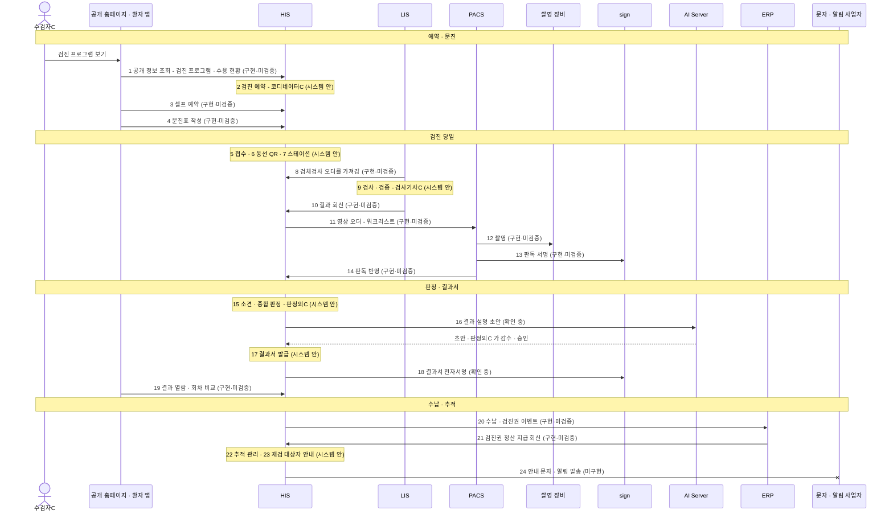

# 시나리오 03 — 건강검진

> 🟡 **초안** — 화면 캡처 13 자리 중 ✅ 9 · 🟡 1(가상 병원 데이터 · [캡처 표](#화면-캡처-자리)) · 데모 병원 이름을 쓰는 화면은 이름을 정한 뒤 · 새 설치본으로 따라가 보기 전
> 연결 상태: [연결 상태 표](../RELEASES/draft/compatibility.md)(판정 2026-09-11 · 코드 대조 · 실제 호출 확인 없음) · 읽는 법은 [시나리오 안내](README.md#연결-상태를-읽는-법)

수검자C 가 데모 병원 건강검진센터에서 종합검진을 받습니다. 홈페이지에서 프로그램을 보고 예약하고, 앱으로 문진표를 쓰고, 검진 당일에는 QR 동선 안내를 따라 스테이션을 돕니다. 판정의가 종합 판정을 하고 AI 가 만든 결과 설명 초안을 감수한 뒤 결과서가 나갑니다. 재검이 필요한 항목은 추적 관리로 넘어가고, 진료가 필요하면 [시나리오 01 외래](01-outpatient-journey.md)로 이어집니다.

## 등장 인물

| 인물 | 하는 일 | HIS 역할 이름 |
|---|---|---|
| 수검자C | 가상 수검자 | 환자 — 환자 포털 · 환자 앱으로 들어옵니다 |
| 검진 코디네이터C | 검진 예약 · 접수 · 동선 · 결과서 발급 · 추적 관리 | 검진센터 |
| 간호사C | 검진 스테이션(기초 계측 등) | 간호사 |
| 검사기사C | 검체검사(LIS) | 검사기사 |
| 영상 검사기사C | 흉부 X선 촬영 | 검사기사 |
| 판독의C | 영상 판독 · 판독 서명 | 의사 |
| 판정의C | 검진 소견 · 종합 판정 · AI 결과 설명 초안 감수 | 의사 |
| 원무C | 검진비 수납 | 원무 |
| 고객상담C | 재검 대상자 안내 · 캠페인 | 고객상담 |

## 한눈에

## 단계 표

| # | 단계 | 누가 | 어느 시스템 | 무엇을 하나 | 연결 상태 | 화면 | AI 가 보조하는 곳 |
|---|---|---|---|---|---|---|---|
| 1 | 검진 프로그램 보기 | 수검자C | 공개 홈페이지 → HIS | 검진 프로그램 · 절차 · 수용 현황을 로그인 없이 봅니다 | `구현·미검증` HIS ⇄ 공개 홈페이지 · 공개 정보 조회(검진 프로그램 · 수용량) | 공개 홈페이지 건강검진 | — |
| 2 | 검진 예약 | 검진 코디네이터C | HIS | 검진 프로그램과 날짜를 정해 예약합니다 | `시스템 안` | `검진 예약`(`/his-checkup/schedule`) · 단체는 `단체 검진`(`/his-checkup/contracts`) | — |
| 3 | 셀프 예약(선택) | 수검자C | 환자 앱 → HIS | 앱에서 검진을 직접 예약합니다 | `구현·미검증` HIS ⇄ 환자 앱 · 포털 기능 | 환자 앱 검진 셀프 예약 | — |
| 4 | 문진표 | 수검자C | 환자 앱 → HIS | 검진 전에 문진표를 작성합니다 | `구현·미검증` HIS ⇄ 환자 앱 · 포털 기능(문진) | 환자 앱 문진표 · HIS `문진표 관리`(`/his-checkup/questionnaires`) | — |
| 5 | 접수 | 검진 코디네이터C | HIS | 검진 당일 접수합니다 | `시스템 안` | `검진 접수`(`/his-checkup/reception`) · `검진 대기`(`/his-checkup/waiting`) | — |
| 6 | 동선 안내(QR) | 수검자C · 검진 코디네이터C | HIS | QR 로 다음 검사 장소를 안내하고, 동선과 대기를 현황판으로 봅니다 | `시스템 안` | `동선 모니터(QR)`(`/patient-flow`) · `동선 현황판`(`/his-checkup/flow-board`) · `대기 디스플레이`(`/display/checkup`) | — |
| 7 | 스테이션 검사 | 간호사C | HIS | 검진 스테이션에서 계측 · 기초검사를 합니다 | `시스템 안` | `검진 스테이션`(`/his-checkup/station`) · `검사실 허브`(`/his-checkup/ws`) | — |
| 8 | 검체검사 오더 전달 | (자동) | HIS → LIS | LIS 가 검사 오더를 FHIR 로 가져갑니다 | `구현·미검증` HIS ⇄ LIS · 검사 오더 전달 | — | — |
| 9 | 검체 검사 · 검증 | 검사기사C | LIS | 접수 · 검사 · 자동 검증 · 2차 검증으로 결과를 확정합니다 | `시스템 안` | LIS 결과 · 검증 | — (자동 검증은 규칙 기반 판정입니다) |
| 10 | 결과 회신 | 검사기사C | LIS → HIS | 확정 결과를 HIS 로 보내고, HIS 에서 직원이 확인한 뒤 반영합니다 | `구현·미검증` HIS ⇄ LIS · 검사 결과 전달 | `검사실`(`/lab`) | — |
| 11 | 영상 오더 → 워크리스트 | (자동) | HIS → PACS | 흉부 X선 오더가 PACS 워크리스트에 등록됩니다 | `구현·미검증` HIS ⇄ PACS · 워크리스트 자동 등록 | `영상실`(`/imaging`) | — |
| 12 | 촬영 | 영상 검사기사C | PACS → 촬영 장비 | 워크리스트로 촬영하고 영상을 PACS 에 저장합니다 | `구현·미검증` 검사 장비 ⇄ PACS · MWL · MPPS · C-STORE | `영상실` 워크스테이션(`/workstation/imaging`) | — |
| 13 | 판독 · 서명 | 판독의C | PACS → sign | 판독하고 판독의 본인이 서명합니다 | `구현·미검증` PACS ⇄ sign · 판독보고서 STAFF 전자서명 | PACS 판독 화면 · HIS `판독 대기`(`/workstation/reading`) | 판독문 초안 보조는 [시나리오 01](01-outpatient-journey.md) 17 과 같습니다(판독의가 고쳐 확정) |
| 14 | 판독 반영 | (자동) | PACS → HIS | 확정 판독이 HIS 에 반영됩니다 | `구현·미검증` HIS ⇄ PACS · 판독 결과 반영 | `검사·영상 보드`(`/diagnostics-board`) | — |
| 15 | 소견 · 종합 판정 | 판정의C | HIS | 검사 · 영상 · 문진을 모아 소견을 쓰고 종합 판정합니다 | `시스템 안` | `소견 대기`(`/his-checkup/review`) | — |
| 16 | 결과 설명 초안 | 판정의C | HIS → AI Server | 수검자가 읽을 검진 결과 설명의 초안을 받습니다 | `확인 중` HIS ⇄ AI Server 연결은 `구현·미검증` 이지만, 연결 표의 목적 칸에 검진 결과 설명이 따로 적혀 있지 않음 | `검진해석 콘텐츠(감수)`(`/admin/checkup-explainer`) | AI 가 **검진 결과 설명 초안**을 만듭니다 → **판정의C 가 감수 · 승인하는 화면을 거칩니다** |
| 17 | 결과서 발급 | 검진 코디네이터C | HIS | 참고치 · 판정이 표시된 검진 결과서(PDF)를 발급합니다 | `시스템 안` | `건강검진센터`(`/his-checkup`) | — |
| 18 | 결과서 전자서명 | (자동) | HIS → sign | 결과서에 전자서명을 붙입니다 | `확인 중` 연결 표의 HIS → sign 서명요청 목적은 "동의서 · 발급 문서 · ERP 계약" — 검진 결과서가 여기에 드는지 확인 중 | — | — |
| 19 | 결과 열람 | 수검자C | 환자 앱 → HIS | 검진 결과 상세(종합 판정 · 항목)와 회차별 비교를 봅니다 | `구현·미검증` HIS ⇄ 환자 앱 · 포털 기능 | 환자 앱 검진 결과 | — |
| 20 | 수납 · 검진권 | 원무C | HIS → ERP | 검진비를 수납하고(검진권 사용 포함) 이벤트가 ERP 회계로 갑니다 | `구현·미검증` HIS ⇄ ERP · 운영 이벤트 전달(수납 · 검진권) | `수납`(`/billing`) | — |
| 21 | 검진권 정산 회신 | (자동) | ERP → HIS | 검진권 딜러 정산의 지급 결과를 ERP 가 HIS 에 알립니다 | `구현·미검증` HIS ⇄ ERP · 검진권 딜러 정산 지급 회신 | `검진권 대시보드`(`/admin/voucher/dashboard`) | — |
| 22 | 추적 관리 | 검진 코디네이터C · 간호사C | HIS | 재검 · 추가 진료가 필요한 항목을 추적 목록에 올립니다 | `시스템 안` | `추적 관리`(`/his-checkup/follow-ups`) | — |
| 23 | 재검 대상자 안내 | 고객상담C | HIS | 재검 대상자를 골라 안내 캠페인을 만듭니다 | `시스템 안` | `검진 대상자`(`/crm/checkup/targets`) · `캠페인`(`/crm/campaigns`) | — |
| 24 | 안내 문자 · 알림 발송 | (자동) | HIS → 문자 · 알림 사업자 | 결과 · 재검 안내를 문자나 앱 푸시로 보냅니다 | `미구현` README — 문자 발송 제공자 없음(모의 발송) · [환자 앱 구성서 §10](../systems/patient-app.md#10-한계와-대체-수단) — 푸시 수신 미동작 · 연결 표 밖 | — | — |

- 8: 검진 검사 항목이 일반 검사 오더와 같은 연결(FHIR 검사 오더)로 LIS 에 가는지는 새 설치본으로 따라가 보며 확인합니다. 연결 자체는 연결 상태 표에 `구현·미검증`으로 있습니다.
- 3: 앱의 셀프 예약 기능 스위치(`portal.selfBooking`)는 기본 꺼짐입니다.
- 17: 검진 결과서 PDF 의 참고치 · 판정 표시는 HIS v4.15.0 에서 바로잡았습니다([HIS 릴리즈 요약](../RELEASES/draft/systems/his.md)).

## 사람이 결정 · 승인하는 지점

**업무 중에 사람이 정하는 곳**

| # | 누가 | 무엇을 정하나 |
|---|---|---|
| 9 | 검사기사C | 2차 검증으로 검체검사 결과를 확정합니다 |
| 13 | 판독의C | 판독을 확정하고 본인이 서명합니다 |
| 15 | 판정의C | 소견과 종합 판정을 정합니다 |
| 16 | 판정의C | AI 가 만든 결과 설명 초안을 감수 · 승인합니다. AI 산출물은 사람이 승인해야 정본이 됩니다([HIS 구성서 §9](../systems/his.md#9-ai-사용)) |
| 22 · 23 | 검진 코디네이터C · 고객상담C | 재검 대상과 안내 방법을 정합니다 |

**구축 기관이 미리 정해 둘 것** — 결정 등록부 키는 [사람 결정 체크리스트](../checklist/decisions.md), 설정 키는 각 [시스템 구성서](../systems/) §6 에 있습니다.

| 무엇 | 어디서 | 이 시나리오의 단계 |
|---|---|---|
| AI 임상 기능을 어디까지 켤 것인가 | 결정 등록부 `policy.ai.clinicalFeatureScope`(개시 전 필수) · 선행 `legal.ai.deviceClassification` · `legal.phiBoundary.gpuTier` | 16 |
| 검진 결과 설명을 감수할 의사와 감수 절차 | HIS `검진해석 콘텐츠(감수)` 운영 | 16 |
| 검진 프로그램 · 검사항목 · 프로토콜 · 문진표 | HIS `검진 프로그램`(`/his-checkup/programs`) · `검사항목 관리`(`/his-checkup/test-catalog`) · `검진 프로토콜`(`/his-checkup/protocols`) · `문진표 관리` | 1 · 4 · 7 |
| "너무 오래 기다렸다"의 기준을 하나로 할 것인가 | 결정 등록부 `qi.waitThresholdUnify` | 6 |
| 앱 셀프 예약을 켤 것인가 · 앱을 배포할 것인가 | HIS `portal.selfBooking`(기본 꺼짐) · 결정 등록부 `mobile.appStoreRelease` | 3 · 4 · 19 |
| 환자 앱 알림 — 적법 근거 확인 → 켤지(마스터) → 건별 발송 판단 | 결정 등록부 `legal.patientPush.consentScope` → `policy.patientPush.enable` → `staff.patientPush.perEvent` | 24 |
| 문자 · 예약 알림 채널 — 처리위탁 계약과 도입 여부 | 결정 등록부 `legal.sms.entrustment` · `legal.appointmentNotify.adapter`(현행: 도입하지 않음) | 24 |
| 검진권 발행 개시(법무) | 개시 점검 항목 `legal.voucher` | 20 · 21 |

## 이 시나리오에서 아직 안 되는 것

| 안 되는 것 · 확인이 남은 것 | 근거 | 대체 수단 · 구축 기관이 할 일 |
|---|---|---|
| **결과 · 재검 안내를 문자나 앱 푸시로 보낼 수 없습니다**(24) — 문자 발송 제공자가 없고(모의 발송), 앱의 푸시 수신이 동작하지 않으며, 서버 쪽 푸시 발행도 기본 꺼짐입니다 | README · [환자 앱 구성서 §10](../systems/patient-app.md#10-한계와-대체-수단) | 문자 제공자를 연동하고, 앱에 알림 패키지를 추가한 뒤 대외 발신 세 조건(구현 + 설정 + 승인)으로 켭니다. 그전에는 기관의 기존 연락 방식으로 안내합니다 |
| **AI 결과 설명 초안이 어느 연결로 가는지**(16)가 연결 상태 표에서 확인되지 않습니다 | 연결 상태 표 | 새 설치본으로 따라가 보며 확인합니다 |
| **결과서 전자서명**(18)이 sign 서명요청의 대상인지 확인되지 않습니다 | 연결 상태 표 | 확인 전에는 결과서를 서명 없는 PDF 로 보고 발급 절차를 정합니다 |
| **환자 앱** — 스토어에 배포되지 않았고, 앱에서 신규 가입이 안 됩니다 | [환자 앱 구성서 §10](../systems/patient-app.md#10-한계와-대체-수단) | 배포 결정 전에는 HIS 의 웹 환자 포털을 씁니다 |
| **분석 장비 → LIS 자동 수집**이 `미구현`입니다 | 연결 상태 표 | 결과 파일 입력 · 수기 입력 또는 인터페이스 중계 장치 |
| **외국어 수검자** — 화면 번역은 모두 AI 초안이고 사람 검수를 마친 것이 없습니다. 환자 앱은 한국어뿐입니다 | README · [환자 앱 구성서 §10](../systems/patient-app.md#10-한계와-대체-수단) | 검수자를 지정해 번역 검수 흐름으로 확정합니다(결정 등록부 `i18n.reviewOwnership`) |
| **청구 · 자격조회 같은 대외 기관 전송**이 구현돼 있지 않습니다 | README | 전송 모듈을 붙이거나 기존 청구 소프트웨어와 함께 씁니다 |
| **실제 호출로 확인된 연결은 4개**(HIS → sign 직원 신원 · 서명 · sign → HIS 서명 완료 통지 · HIS → LIS 검사 오더 전달 · LIS → HIS 환자 조회 · 2026-09-14) — 나머지 `구현·미검증`은 코드가 맞물려 있다는 뜻입니다 | [연결 상태 표](../RELEASES/draft/compatibility.md) | 새 설치본으로 따라가 보며 `검증됨`과 확인일을 붙여 갑니다 |

## 화면 캡처 자리

이미지는 [캡처 대장](../assets/CAPTURE-LEDGER.md)에 적고 사람이 확인한 것만 싣습니다. **아래 표의 「캡처」 칸이 채워진 자리는 [화면으로 보는 생태계](../screens/)에서 실물을 볼 수 있습니다**(2026-09-12 · 가상 병원 데이터가 든 리허설 설치본).

> ⚠️ **이 시나리오의 자리는 대부분 비어 있습니다.** 캡처를 찍은 날이 토요일이라 **수검자가 0명**이었습니다 — 검진 접수 · 동선 현황판 · 스테이션 · 소견 대기는 **수검자가 있는 평일**에 다시 찍습니다.

| 자리 | 담을 화면 | 시스템 · 화면 | 조건 | 캡처 |
|---|---|---|---|---|
| 03-01 | 검진 프로그램 목록 · 수용 현황 | 공개 홈페이지 건강검진 | 데모 병원 이름 확정 뒤 | ⬜ |
| 03-02 | 검진 예약 | HIS `검진 예약` | — | ✅ 들어옴(구조) — 날짜별 예약 목록 · 수검자 · 프로그램 · 금액 · 상태. **캡처한 날은 토요일이라 0건**(「해당 날짜에 예약이 없습니다」) [`his-support-his-checkup-schedule.png`](../assets/screens/his-support-his-checkup-schedule.png) |
| 03-03 | 문진표 작성 | 환자 앱 | 앱 빌드 뒤 | ⬜ |
| 03-04 | QR 동선 안내와 동선 현황판 | HIS `동선 모니터(QR)` · `동선 현황판` | — | ✅ 둘 다 들어옴 — 동선 현황판(**0 수검자 × 11 스테이션 · 5초 갱신**)과 **동선 모니터(QR 체크인 기반 구역별 인원 · 환자별 동선 조회)**. 검진 수검자가 스테이션을 흐르는 장면은 아직 [`his-support-his-checkup-flow-board.png`](../assets/screens/his-support-his-checkup-flow-board.png) · [`his-support-patient-flow.png`](../assets/screens/his-support-patient-flow.png) |
| 03-05 | 대기 디스플레이 | HIS `대기 디스플레이` | 수검자 이름이 가상 데이터인지 확인 | ✅ 들어옴 — 대기실용 화면(어두운 바탕 · 4초 갱신) · **대기 · 검사중 · 검사완료 · 소견대기** 네 칸. 캡처한 날은 전부 0 이라 **이름이 뜨지 않은 상태**입니다 [`his-support-display-checkup.png`](../assets/screens/his-support-display-checkup.png) |
| 03-06 | 검진 스테이션 | HIS `검진 스테이션` | — | ✅ 들어옴 — **스테이션 탭 9**(채혈 · 검체 · 신체계측 · 심전도 · X-ray · 초음파 · 내시경 · 안과 · 폐기능) · 8초 자동 갱신 · 대기 0 [`his-support-his-checkup-station.png`](../assets/screens/his-support-his-checkup-station.png) |
| 03-07 | 소견 대기와 종합 판정 | HIS `소견 대기` | — | ✅ 들어옴 — 총 16 · **소견대기 10 · 검사완료 5 · 부분완료 1** · 행마다 프로그램과 **결과 진행 분모**(1/1 · 4/5 · 13/14) [`his-support-his-checkup-review.png`](../assets/screens/his-support-his-checkup-review.png) |
| 03-08 | 결과 설명 초안 감수 · 승인(AI 표기와 면책 문구가 보이게) | HIS `검진해석 콘텐츠(감수)` | AI 기능을 켠 설치본 | ✅ 들어옴(감수 구조) — 작성중 → 감수중 → 승인 → 반려 · 저장 시 **가드레일 자동 검증**(진단 확정 · 처방/용량 지시 금지) · 배지 `소비자 노출` 과 **`4-eyes(2인 승인): 비활성`**. AI 가 만든 초안이 실제로 뜬 장면은 아직 [`his-system-admin-checkup-explainer.png`](../assets/screens/his-system-admin-checkup-explainer.png) |
| 03-09 | 검진 결과서 PDF | HIS `건강검진센터` | 결과서에 데모 병원 이름만 보이는지 확인 | 🟡 건강검진센터 허브가 들어옴(단계별 현황) · 결과서 PDF 는 아직 [`his-support-his-checkup.png`](../assets/screens/his-support-his-checkup.png) |
| 03-10 | 결과 상세와 회차별 비교 | 환자 앱 | 앱 빌드 뒤 | ⬜ |
| 03-11 | 추적 관리 목록 | HIS `추적 관리` | — | ✅ 들어옴 — **기한 초과 6건을 맨 위에** 올리고 추적 사유(위용종 추적 · HbA1c 상승 · 안압 상승)와 근거 검진 회차를 함께 적음 [`his-support-his-checkup-follow-ups.png`](../assets/screens/his-support-his-checkup-follow-ups.png) |
| 03-12 | 검진 프로그램 구성(2단계의 「프로그램」이 어디서 오나) | HIS `검진 프로그램` | — | ✅ 들어옴 — 프로그램 14 · 가격 · 소요시간 · 항목수 · **국가암검진 6종은 0원**(공단 부담) [`his-support-his-checkup-programs.png`](../assets/screens/his-support-his-checkup-programs.png) |
| 03-13 | 검진권 정산(21단계) | HIS `검진권 대시보드` | — | ✅ 들어옴 — 상태 6(ISSUED · ALLOCATED · SOLD · REDEEMED · REFUNDED · REVOKED) · 딜러 정산 **USD·KRW 이중 통화** · `DRAFT`/`CONFIRMED` 구분 [`his-system-admin-voucher-dashboard.png`](../assets/screens/his-system-admin-voucher-dashboard.png) |

## 근거

[연결 상태 표](../RELEASES/draft/compatibility.md) · [HIS 메뉴 구성](../systems/his-domains.md) · 시스템 구성서 [HIS](../systems/his.md) · [LIS](../systems/lis.md) · [PACS](../systems/pacs.md) · [sign](../systems/sign.md) · [ERP](../systems/erp.md) · [환자 앱](../systems/patient-app.md) · [공개 홈페이지](../systems/homepage.md) · 릴리즈 요약 [HIS](../RELEASES/draft/systems/his.md) · [환자 앱](../RELEASES/draft/systems/patient-app.md) · [사람 결정 체크리스트](../checklist/decisions.md) · [개시 점검](../checklist/go-live.md) · [README 「지금 알고 시작해야 할 것」](../README.md#지금-알고-시작해야-할-것)
