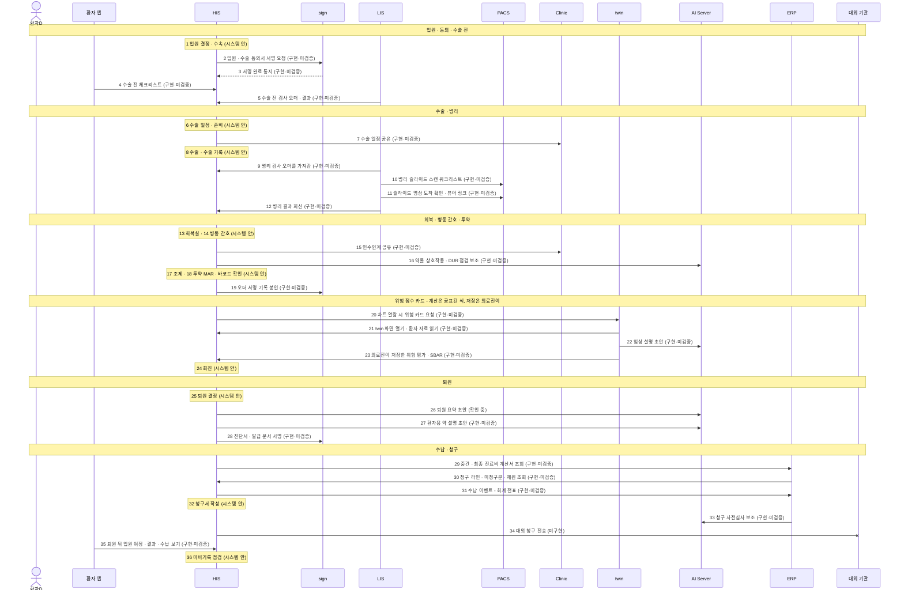

# 시나리오 04 — 입원에서 퇴원까지

> 🟡 **초안** — 화면 캡처는 데모 병원 이름을 정한 뒤 넣습니다 · 새 설치본으로 따라가 보기 전
> 연결 상태: [연결 상태 표](../RELEASES/draft/compatibility.md)(판정 2026-09-11 · 코드 대조 · 실제 호출 확인 없음) · 읽는 법은 [시나리오 안내](README.md#연결-상태를-읽는-법)

환자D 가 데모 병원 외과 병동에 입원해 수술을 받습니다. 수술에서 떼어 낸 조직은 병리로 가고, 병동에서는 간호 · 투약(MAR · 바코드 확인)이 이어지며, 주치의는 차트에서 위험 점수 카드를 봅니다. 퇴원 때는 퇴원 요약 · 약 설명 · 진단서가 나오고, 중간정산과 퇴원 수납 · 보험 청구로 끝납니다. [시나리오 02 응급](02-emergency.md)에서 입원이 결정된 경우도 여기로 이어집니다.

## 등장 인물

| 인물 | 하는 일 | HIS 역할 이름 |
|---|---|---|
| 환자D | 가상 입원 환자(외과 수술) | 환자 — 환자 포털 · 환자 앱으로 들어옵니다 |
| 보호자D | 동의서 서명에 함께함 | 환자 쪽(HIS 사용자 아님) |
| 주치의D | 입원 · 처방 · 회진 · 퇴원 결정 | 의사 |
| 집도의D | 수술 동의서 설명 · 수술 · 수술 기록 | 의사 |
| 병리의D | 병리 판독 · 사인아웃(LIS) | 의사 |
| 검사기사D | 수술 전 검사 · 병리 슬라이드 준비와 스캔 | 검사기사 |
| 회복실 간호사D | 회복실(PACU) 간호 | 간호사 |
| 병동 간호사D | 병동 간호 · 투약 · 인수인계 | 간호사 |
| 약사D | 조제 · 약물 점검 · 환자용 약 설명 감수 | 약사 |
| 원무D | 입원 수속 · 중간정산 · 퇴원 수납 · 청구서 작성 | 원무 |
| 의무기록사D | 퇴원 뒤 미비기록 점검 | 의무기록사 |

## 한눈에

## 단계 표

| # | 단계 | 누가 | 어느 시스템 | 무엇을 하나 | 연결 상태 | 화면 | AI 가 보조하는 곳 |
|---|---|---|---|---|---|---|---|
| 1 | 입원 결정 · 수속 | 주치의D · 원무D | HIS | 입원을 결정하고 병상을 배정해 수속합니다 | `시스템 안` | `입원`(`/workstation/admission`) · `병상·입원 보드`(`/bed-board`) · `병상 현황`(`/beds`) | — |
| 2 | 입원 · 수술 동의서 | 집도의D · 환자D · 보호자D | HIS → sign | 입원 · 수술 · 마취 동의서의 서명을 요청하고, 환자D 가 서명합니다 | `구현·미검증` HIS ⇄ sign · 동의서 서명요청 제출 | `동의서`(`/workstation/consent`) | — |
| 3 | 서명 완료 반영 | (자동) | sign → HIS | 서명 완료가 HIS 동의서 상태에 반영됩니다. 동의서가 개정되면 앞 판본은 대체됨으로 표시됩니다 | `구현·미검증` HIS ⇄ sign · 서명 이벤트 통지 | `동의서`(`/consent`) | — |
| 4 | 수술 전 체크리스트 | 환자D | 환자 앱 → HIS | 앱에서 수술 전 체크리스트를 확인합니다 | `구현·미검증` HIS ⇄ 환자 앱 · 포털 기능 | 환자 앱 수술 전 체크리스트 | — |
| 5 | 수술 전 검사 | 검사기사D | HIS ⇄ LIS | LIS 가 검사 오더를 가져가 검사하고, 확정 결과를 HIS 로 돌려줍니다 | `구현·미검증` HIS ⇄ LIS · 검사 오더 전달 / 검사 결과 전달 | `검사실`(`/lab`) | — |
| 6 | 수술 일정 · 준비 | 집도의D | HIS | 수술 일정을 잡고 수술 준비를 확인합니다 | `시스템 안` | `수술`(`/surgery`) · `수술 준비`(`/workstation/surgery-prep`) | — |
| 7 | 수술 일정 공유 | (자동) | HIS → Clinic | 수술 일정이 그룹웨어의 수술판에 보입니다 | `구현·미검증` HIS ⇄ Clinic · 업무 연동 API 군(수술 일정) | Clinic 수술판 | — |
| 8 | 수술 · 수술 기록 | 집도의D | HIS | 수술을 하고 수술 기록을 남깁니다. 떼어 낸 조직의 병리 검사를 오더합니다 | `시스템 안` | `수술` | — |
| 9 | 병리 검사 오더 | (자동) | HIS → LIS | LIS 가 병리 검사 오더를 FHIR 로 가져가 병리 접수로 이어집니다 | `구현·미검증` HIS ⇄ LIS · 검사 오더 전달 | `병리과`(`/pathology`) | — |
| 10 | 슬라이드 스캔 워크리스트 | 검사기사D | LIS → PACS | 그로싱 · 블록 · 슬라이드를 만든 뒤, 스캔할 슬라이드를 PACS 워크리스트에 올립니다 | `구현·미검증` LIS ⇄ PACS · 병리 슬라이드 스캔 워크리스트 등록 · 취소 | LIS 병리 | — |
| 11 | 병리 판독 · 사인아웃 | 병리의D | LIS → PACS | 슬라이드 영상이 PACS 에 도착했는지 확인하고, PACS 뷰어의 현미경 모드로 보며 판독합니다. 구조화 보고 뒤 2단계 사인아웃합니다 | `구현·미검증` LIS ⇄ PACS · WSI 뷰어 링크 · 영상 도착 확인 · 열람 확인 기록 | LIS 병리 · PACS 웹 뷰어(현미경 모드) | — |
| 12 | 병리 결과 회신 | (자동) | LIS → HIS | 확정된 병리 보고가 HIS 로 가고, 직원이 확인한 뒤 반영합니다 | `구현·미검증` HIS ⇄ LIS · 검사 결과 전달 | `병리과` · `검사·영상 보드`(`/diagnostics-board`) | — |
| 13 | 회복실 | 회복실 간호사D | HIS | 수술 뒤 회복실에서 관찰하고 병동으로 보냅니다 | `시스템 안` | `회복실(PACU)`(`/pacu`) · `수술 후 회복`(`/workstation/post-op`) | — |
| 14 | 병동 간호 | 병동 간호사D | HIS | 병동 간호 기록, 낙상 · 욕창 재평가, 활력징후 경보를 봅니다 | `시스템 안` | `간호 워크스테이션`(`/nurse-station`) · `간호(입원)`(`/workstation/nursing`) · `낙상/욕창 재평가`(`/admin/risk-reassessment`) | — |
| 15 | 인수인계 공유 | 병동 간호사D | HIS → Clinic | 교대 때 특이사항을 인수인계하고, 인수자가 수신을 확인합니다 | `구현·미검증` HIS ⇄ Clinic · 업무 연동 API 군(인수인계) | HIS `인수인계`(`/handoffs`) · Clinic 인수인계 | — |
| 16 | 처방 · 약물 점검 | 주치의D · 약사D | HIS → AI Server | 수술 뒤 처방을 넣고, 약물 상호작용 · DUR 을 점검합니다 | `구현·미검증` HIS ⇄ AI Server · 임상 보조 스킬(약물상호작용 · DUR) | `처방(CPOE)`(`/orders`) · `약사 임상활동`(`/pharmacist-activity`) | AI Server 가 공공 DUR 기준을 먼저 조회해 **참고 정보**를 냅니다 → **처방은 주치의D 가, 조제 전 확인은 약사D 가 정합니다.** 실시간 처방 차단이 아닙니다 |
| 17 | 조제 | 약사D | HIS | 처방을 조제합니다(마약류는 따로 관리) | `시스템 안` | `약국`(`/pharmacy`) · `약국 보드`(`/pharmacy-board`) | — |
| 18 | 투약 · 바코드 확인 | 병동 간호사D | HIS | 바코드로 환자와 약을 대조하고, 투약 기록(MAR)에 남깁니다 | `시스템 안` | `간호(입원)`(`/workstation/nursing`) | — |
| 19 | 오더 서명 기록 봉인 | (자동) | HIS → sign | 처방 서명 기록을 sign 의 감사 해시체인에 쌓고 타임스탬프로 봉인합니다 | `구현·미검증` HIS ⇄ sign · 신뢰의 사슬(오더 서명 로그 감사 이벤트) | `오더 서명 로그`(`/admin/order-sign-logs`) | — |
| 20 | 위험 점수 카드 | 주치의D | HIS → twin | 차트를 열면 HIS 차트에 twin 의 위험 카드(심혈관 · 신장 eGFR 등)가 뜹니다 | `구현·미검증` HIS ⇄ twin · CDS Hooks patient-view | 차트 화면의 위험 카드 | — (위험 점수는 공표된 계산식으로 산출하며 LLM 을 거치지 않습니다. 빠진 입력은 0 이 아니라 "입력 필요"로 표시합니다) |
| 21 | twin 화면 · 자료 읽기 | 주치의D | HIS → twin · twin → HIS | 차트에서 twin 을 열면 조기 경보(NEWS2) · 정맥혈전색전증 등의 점수 카드를 봅니다. twin 은 환자 자료를 HIS 에서 읽어 옵니다 | `구현·미검증` HIS ⇄ twin · SMART on FHIR EHR launch / 환자 트윈 FHIR 읽기 | twin 환자 화면 | — (20 과 같음) |
| 22 | 임상 설명 초안 | 주치의D | twin → AI Server | 위험 점수에 대한 임상 설명 초안을 받습니다 | `구현·미검증` AI Server ⇄ twin · 위험 예측 보조 · 서술형 요약 | twin 환자 화면 | AI 가 **임상 설명 초안**을 만들고 `machine-generated` 로 표시합니다 → **의무기록에 직접 기록되지 않으며**, 주치의D 가 23 에서 저장할 때만 HIS 로 갑니다 |
| 23 | 위험 평가 · SBAR 저장 | 주치의D | twin → HIS | 위험 평가 · SBAR · 의료진이 쓴 SOAP 를 HIS 에 저장합니다. 보내기 전에 FHIR 규격을 검증합니다 | `구현·미검증` HIS ⇄ twin · FHIR write-back | twin 의 "차트 저장" | SBAR 는 규칙 기반으로 만듭니다(LLM 을 쓰지 않음) → **주치의D 가 저장을 눌렀을 때만, 그 사용자의 권한으로** HIS 에 들어갑니다 |
| 24 | 회진 | 주치의D | HIS | 회진하며 경과를 봅니다 | `시스템 안` | `회진`(`/rounds`) · `입원 환자`(`/inpatient`) | — |
| 25 | 퇴원 결정 | 주치의D | HIS | 퇴원을 결정하고 퇴원 절차를 시작합니다 | `시스템 안` | `퇴원`(`/workstation/discharge`) | — |
| 26 | 퇴원 요약 초안 | 주치의D | HIS → AI Server | 퇴원 요약의 초안을 받습니다 | `확인 중` 개시 점검 항목 `ai.draftProvenanceSchema` 의 대상에 퇴원요약 AI 초안이 있으나, 연결 표 HIS → AI Server 행의 목적 칸에 퇴원 요약이 따로 적혀 있지 않음 | `퇴원` | AI 가 **퇴원 요약 초안**을 만듭니다 → **주치의D 가 고쳐 승인해야** 기록이 됩니다 |
| 27 | 퇴원 약 설명 | 약사D · 환자D | HIS → AI Server | 퇴원약에 대한 환자용 설명을 준비합니다 | `구현·미검증` HIS ⇄ AI Server · 생성형 소형 클라이언트(환자 약 설명) | `AI 약물설명 승인`(`/admin/drug-explain`) | AI 가 환자용 **약 설명 초안**을 만듭니다 → **약사D 가 감수 · 승인합니다** |
| 28 | 진단서 · 서류 서명 | 주치의D | HIS → sign | 진단서 · 제증명을 발급하고 전자서명을 붙입니다 | `구현·미검증` HIS ⇄ sign · 동의서 · 발급 문서 서명요청 제출 | `진단서 발급`(`/workstation/certificates`) · `서류 발급`(`/workstation/documents`) | — |
| 29 | 중간정산 · 퇴원 수납 | 원무D | HIS → ERP | 입원 중 중간정산을 하고, 퇴원 때 최종 진료비를 ERP 산정값으로 조회해 수납합니다 | `구현·미검증` HIS ⇄ ERP · 중간 / 최종 진료비 계산서 조회 | `수납`(`/billing`) · `원무·수납 보드`(`/reception-billing-board`) | — |
| 30 | 청구 라인 · 재원 조회 | (자동) | ERP → HIS | ERP 가 HIS 의 청구 라인 · 미청구 진행분 · 재원 현황을 조회합니다 | `구현·미검증` HIS ⇄ ERP · 청구 라인 · 미청구 진행분 · 재원 조회(연결 표의 목적: 전환 시 일괄 적재 · 간호 모니터) | — | — |
| 31 | 수납 → 회계 | (자동) | HIS → ERP | 수납 이벤트가 ERP 로 가서 회계 전표가 됩니다 | `구현·미검증` HIS ⇄ ERP · 운영 이벤트 전달 | — | — |
| 32 | 보험 청구서 작성 | 원무D | HIS | 입원 진료의 보험 청구서(EDI 서식)를 작성합니다 | `시스템 안` | `보험 청구`(`/claims`) | — |
| 33 | 청구 사전심사 | 원무D | ERP → AI Server | ERP 가 청구 전 사전심사를 합니다 | `구현·미검증` AI Server ⇄ ERP · 청구 사전심사 | ERP 청구 사전심사 | AI 가 고시 근거를 찾아 주고 **삭감 위험 평가를 보조**합니다 → **청구 내용의 확정은 원무D 가 합니다** |
| 34 | 대외 청구 전송 | 원무D | HIS → 대외 기관 | 청구서를 심사 기관에 보냅니다 | `미구현` README — 대외 기관 전송 모듈 없음(연결 표 밖) | — | — |
| 35 | 퇴원 뒤 열람 | 환자D | 환자 앱 → HIS | 입원 여정(타임라인 · 진료 · 회진 · 검사 기록) · 결과 · 수납 내역을 보고 서류를 신청합니다 | `구현·미검증` HIS ⇄ 환자 앱 · 포털 기능 | 환자 앱 입원 여정 · 서류 신청 | — |
| 36 | 미비기록 점검 | 의무기록사D | HIS | 퇴원 기록에 빠진 것이 없는지 점검합니다 | `시스템 안` | `미비기록(HIM)`(`/admin/him`) | — |

- 5: 한 행에 HIS → LIS(검사 오더 전달)와 LIS → HIS(검사 결과 전달) 두 연결을 함께 적었습니다. 둘 다 `구현·미검증`입니다.
- 9 · 12: 연결 표의 검사 오더 · 결과 연결은 검사 종류를 나눠 적지 않습니다. 병리 오더와 병리 보고가 이 연결로 오가는지는 새 설치본으로 따라가 보며 확인합니다(오더 취소 연결의 목적 칸에는 병리 케이스 취소가 적혀 있습니다).
- 18: 투약 기록(MAR)과 바코드 투약 확인은 [HIS 릴리즈 요약](../RELEASES/draft/systems/his.md)의 기능 목록에 있습니다. 메뉴 이름으로 따로 있지 않아 간호 워크스테이션 화면으로 적었고, 정확한 화면은 새 설치본으로 확인합니다.
- 28: 진단서를 연결 표 목적 칸의 "발급 문서"로 읽었습니다. 새 설치본으로 따라가 보며 확인합니다.
- 36: `미비기록(HIM)` 메뉴의 기본 사용 역할은 관리자입니다. 의무기록사에게 열지는 기관이 역할 권한으로 정합니다.

## 사람이 결정 · 승인하는 지점

**업무 중에 사람이 정하는 곳**

| # | 누가 | 무엇을 정하나 |
|---|---|---|
| 2 | 환자D · 보호자D | 동의서에 서명합니다 |
| 11 | 병리의D | 병리 보고를 2단계로 사인아웃해 확정합니다 |
| 16 | 주치의D · 약사D | DUR 참고 정보를 보고 처방과 조제를 정합니다 |
| 18 | 병동 간호사D | 바코드로 환자와 약을 대조한 뒤 투약합니다 |
| 22 · 23 | 주치의D | twin 의 AI 설명 초안과 위험 평가 · SBAR 를 차트에 저장할지 정합니다. 저장하지 않으면 HIS 에 들어가지 않습니다 |
| 26 | 주치의D | 퇴원 요약 초안을 고쳐 승인합니다 |
| 27 | 약사D | 환자용 약 설명 초안을 감수 · 승인합니다 |
| 33 | 원무D | 사전심사 보조를 참고해 청구 내용을 확정합니다 |

**구축 기관이 미리 정해 둘 것** — 결정 등록부 키는 [사람 결정 체크리스트](../checklist/decisions.md), 설정 키는 각 [시스템 구성서](../systems/) §6 과 [구축 가이드 S6](../build-guide/S6-ai.md)에 있습니다.

| 무엇 | 어디서 | 이 시나리오의 단계 |
|---|---|---|
| AI 임상 기능을 어디까지 켤 것인가 | 결정 등록부 `policy.ai.clinicalFeatureScope`(개시 전 필수) · 선행 `legal.ai.deviceClassification` · `legal.phiBoundary.gpuTier` | 16 · 22 · 26 · 27 · 33 |
| 확정 전 초안을 누가 볼 수 있고 언제까지 두는가 · AI 초안의 출처 기록 방식 | 결정 등록부 `draft.visibility` · `draft.retention` · 개시 점검 항목 `ai.draftProvenanceSchema` | 26 |
| twin 이 환자의 AI 활용 동의를 요구할 것인가 | twin `patient_require_consent`(기본 꺼짐) | 20 ~ 23 |
| AI 품질 임계값 | 결정 등록부 `policy.aiQualityThreshold` | 22 |
| 활력 출처 표시 · 회복실 통합을 위한 변경 | 결정 등록부 `policy.vitalsSourceMeta` | 13 · 14 |
| 욕창 재평가를 어디에 저장할 것인가 | 결정 등록부 `schema.pressureUlcer.reassessment` | 14 |
| 투약 확인 · 고위험 · MAR · 위급값 같은 안전 문구를 번역할 것인가 | 결정 등록부 `i18n.safetyStringTranslation` | 18 |
| 분할조제 회차를 어디에 담을 것인가 · 원외 처방전 유효기간의 근거 | 결정 등록부 `pharmacy.splitDispensingSchema` · `pharmacy.prescriptionValidityBasis` | 17 · 25 |
| 요양기관 종별 · 본인부담금 절사 · 입금 참조번호 대사 | 결정 등록부 `billing.institutionType` · `policy.copay.rounding`(둘 다 개시 전 필수) · `billing.paymentRefReconciliation` | 29 |
| ERP 로 나가는 환자번호를 가명화할 것인가 | 결정 등록부 `legal.erpMrn.pseudonymization` | 29 ~ 31 |
| 동의서 · 진단서 전자서명의 법적 효력 · 본인확인 방식 | 구축 기관 · 법무([sign 구성서 §8](../systems/sign.md#8-표준과-규제)) | 2 · 28 |
| 환자 앱을 스토어에 배포할 것인가 | 결정 등록부 `mobile.appStoreRelease` | 4 · 35 |

## 이 시나리오에서 아직 안 되는 것

| 안 되는 것 · 확인이 남은 것 | 근거 | 대체 수단 · 구축 기관이 할 일 |
|---|---|---|
| **대외 청구 전송**(34) | README · [HIS 구성서 §10](../systems/his.md#10-한계와-대체-수단) | 전송 모듈을 붙이거나 기존 청구 소프트웨어와 함께 씁니다 |
| **청구 심사결과 · 재고 입고 · 자산 코드 매핑을 ERP 에서 HIS 로 돌려주는 경로** — HIS 가 받을 준비만 돼 있습니다 | 연결 상태 `미구현`(ERP → HIS) | 필요하면 규격을 맞춰 구현하거나 수작업으로 대신합니다([ERP 구성서 §10](../systems/erp.md#10-한계와-대체-수단)) |
| **퇴원 요약 AI 초안**(26)이 어느 연결로 가는지 연결 상태 표에서 확인되지 않습니다 | 연결 상태 표 · 개시 점검 항목 `ai.draftProvenanceSchema` | 새 설치본으로 따라가 보며 확인합니다 |
| **그룹웨어(Clinic)의 병동 · 투약 · 수술 화면이 HIS 자료를 받는 연결**은 `판정 불가`입니다(배포 구성에 따라 달라짐). HIS 에서 자료를 받지 못한 Clinic 화면은 예시 데이터로 채우고 "데모" 출처 배지를 붙입니다 | 연결 상태 표 · [Clinic 구성서 §10](../systems/clinic.md) | 투약 기록의 정본은 HIS 입니다. Clinic 화면에 데모 배지가 보이면 HIS 연결부터 점검합니다 |
| **twin** — 의료기기 해당성이 확정되지 않았고, 저장소의 고장 모드 분석은 자동화 편향 · 데이터 편향을 "조치 필요"로 둡니다(정량 검증 미실시). 일부 입력은 자동으로 채워지지 않을 수 있습니다 | [twin 구성서 §10](../systems/twin.md) | AI 출력은 의무기록에 직접 기록되지 않는 참고 초안으로 씁니다. 빠진 입력은 화면에서 받거나 "미평가"로 둡니다 |
| **오더세트 금기 조건**이 자동 평가되지 않고 "금기 수동 확인"으로 표시됩니다. **원외 처방전 유효기간**은 설정이 아니라 코드 값입니다 | [HIS 구성서 §10](../systems/his.md#10-한계와-대체-수단) | 처방 때 사람이 확인합니다. 유효기간은 결정 등록부 항목으로 근거를 확인합니다 |
| **전자서명 신뢰 기반** — CA 키를 소프트웨어로 보관하고(하드웨어 보안 모듈 미적용), 공인 타임스탬프 기관과 연결돼 있지 않으며, 본인확인 사업자가 모의 상태입니다. 장기 보관 문서의 재타임스탬프 작업이 아직 없습니다 | README · [sign 구성서 §10](../systems/sign.md#10-한계와-대체-수단) | 실운영 전환 시점에 하드웨어 보안 모듈 · 공인 타임스탬프 기관 · 본인확인 사업자를 준비합니다. 보존 기간이 긴 문서는 별도 보존 절차를 둡니다 |
| **분석 장비 → LIS 자동 수집**이 `미구현`입니다 | 연결 상태 표 | 결과 파일 입력 · 수기 입력 또는 인터페이스 중계 장치 |
| **환자 앱** — 스토어 미배포 · 앱 신규 가입 불가 · 푸시 수신 미동작 | [환자 앱 구성서 §10](../systems/patient-app.md#10-한계와-대체-수단) | 배포 결정 전에는 HIS 의 웹 환자 포털을 씁니다 |
| **오프라인 동기화**는 범위 밖입니다 — 망 장애 때 병동이 계속 쓸 수 있는 오프라인 기능이 없습니다 | [HIS 구성서 §10](../systems/his.md#10-한계와-대체-수단) | 기관의 다운타임 절차를 준비합니다 |
| **실제 호출로 확인된 연결이 없습니다** | [연결 상태 표](../RELEASES/draft/compatibility.md) | 새 설치본으로 따라가 보며 `검증됨`과 확인일을 붙입니다 |

## 화면 캡처 자리

이미지는 [캡처 대장](../assets/CAPTURE-LEDGER.md)에 적고 사람이 확인한 것만 싣습니다. **아래 표의 「캡처」 칸이 채워진 자리는 [화면으로 보는 생태계](../screens/)에서 실물을 볼 수 있습니다**(2026-09-12 · 가상 병원 데이터가 든 리허설 설치본).

나머지 자리는 조건(AI 기능을 켠 설치본 · 형제 시스템 접속 · 수검자가 있는 날 등)이 갖춰진 뒤 채웁니다.

| 자리 | 담을 화면 | 시스템 · 화면 | 조건 | 캡처 |
|---|---|---|---|---|
| 04-01 | 병상 · 입원 보드와 입원 수속 | HIS `병상·입원 보드` · `입원` | — | ✅ 들어옴(보드) · 입원 수속 화면은 아직 [`his-care-bed-board.png`](../assets/screens/his-care-bed-board.png) |
| 04-02 | 수술 동의서 서명 요청과 서명 완료 상태 | HIS `동의서` · sign 서명 화면 | sign 연결을 모의가 아닌 모드로 | ✅ 들어옴(HIS 쪽) [`his-support-workstation-consent.png`](../assets/screens/his-support-workstation-consent.png) |
| 04-03 | 수술 준비 | HIS `수술 준비` | — | 🟡 수술방 관리가 들어옴 · 수술 준비 워크스테이션은 아직 [`his-care-surgery.png`](../assets/screens/his-care-surgery.png) |
| 04-04 | 병리 슬라이드 현미경 모드 | PACS 웹 뷰어 · LIS 병리 | — | ⬜ |
| 04-05 | 회복실 | HIS `회복실(PACU)` | — | 🟡 수술방 관리가 들어옴(회복실 PACU 탭이 보임) · 회복실 화면 자체는 아직 [`his-care-surgery.png`](../assets/screens/his-care-surgery.png) |
| 04-06 | 바코드 투약 확인과 투약 기록(MAR) | HIS `간호(입원)` | — | 🟡 간호 워크스테이션이 들어옴 · 투약 관리 탭은 아직 [`his-care-nurse-station.png`](../assets/screens/his-care-nurse-station.png) |
| 04-07 | 차트의 twin 위험 카드 | HIS 차트 · twin | twin 을 연결한 설치본 | ✅ 들어옴 — NEWS2 · 위험 점수 · eGFR 과 「트윈 파생」 배지 [`twin-patient-chart.png`](../assets/screens/twin-patient-chart.png) |
| 04-08 | twin 의 AI 설명 초안(`machine-generated` 표시)과 "차트 저장" | twin 환자 화면 | AI 기능을 켠 설치본 | 🟡 추천 액션과 「규칙기반 파생·임상 판단 보조」는 보임 · "차트 저장"을 누른 장면은 아직 [`twin-patient-chart.png`](../assets/screens/twin-patient-chart.png) |
| 04-09 | 퇴원 요약 초안 승인(AI 표기와 면책 문구가 보이게) | HIS `퇴원` | AI 기능을 켠 설치본 | ⬜ |
| 04-10 | 중간정산 · 퇴원 수납 | HIS `수납` · `원무·수납 보드` | — | ✅ 들어옴(수납 대기열·미수납) · 퇴원 수납 장면은 아직 [`his-ops-billing.png`](../assets/screens/his-ops-billing.png) |
| 04-11 | 진단서 발급과 전자서명 | HIS `진단서 발급` | 발급 문서에 데모 병원 이름만 보이는지 확인 | ✅ 들어옴 [`his-support-workstation-certificates.png`](../assets/screens/his-support-workstation-certificates.png) |
| 04-12 | 입원 여정 타임라인 | 환자 앱 | 앱 빌드 뒤 | ⬜ |

## 근거

[연결 상태 표](../RELEASES/draft/compatibility.md) · [HIS 메뉴 구성](../systems/his-domains.md) · 시스템 구성서 [HIS](../systems/his.md) · [LIS](../systems/lis.md) · [PACS](../systems/pacs.md) · [sign](../systems/sign.md) · [ERP](../systems/erp.md) · [twin](../systems/twin.md) · [Clinic](../systems/clinic.md) · [AI Server](../systems/ai-server.md) · [환자 앱](../systems/patient-app.md) · 릴리즈 요약 [HIS](../RELEASES/draft/systems/his.md) · [twin](../RELEASES/draft/systems/twin.md) · [사람 결정 체크리스트](../checklist/decisions.md) · [개시 점검](../checklist/go-live.md) · [구축 가이드 S6](../build-guide/S6-ai.md) · [README 「지금 알고 시작해야 할 것」](../README.md#지금-알고-시작해야-할-것)
