# 사람을 시스템에 넣고 빼는 일 — 로그인 · 인증서 · 채용 · 의료진 등록

> 🟡 **초안 — 캡처 넣는 중** · [화면 소개 목차](README.md)
> 화면은 **가상 병원 데이터가 든 리허설 설치본**에서 2026-09-12 에 찍었습니다. 화면 상단에 `리허설 · 시드 데이터 · 대외 발신 차단` 배너가 그대로 보입니다.

**EN** — How people enter and leave the system: first login, certificate enrolment, hiring, clinician registration, emergency access, and offboarding. Captured 2026-09-12 on a rehearsal installation running synthetic data (the header badge reads "rehearsal · seed data · outbound blocked").

구축 기관이 **가장 먼저** 하는 일입니다. 병원을 세우려면 사람이 먼저 들어가야 하기 때문입니다.

---

## 1. 로그인 — 처음 들어가는 자리

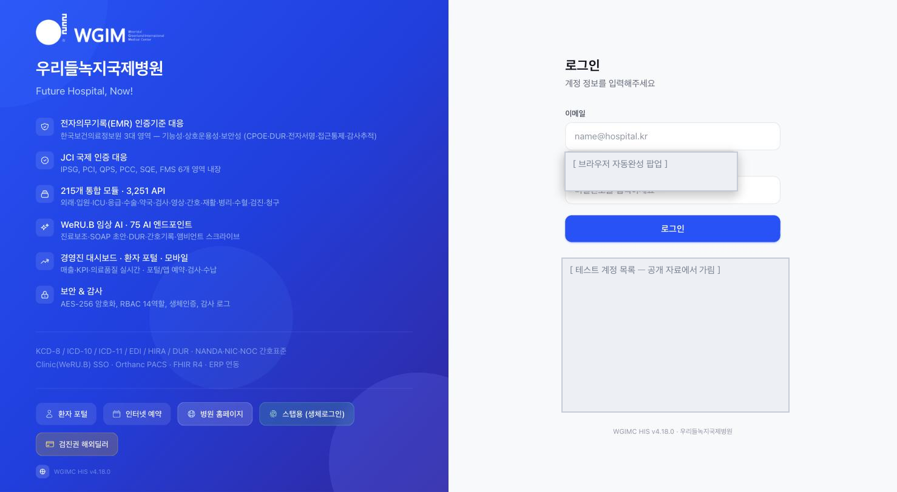

왼쪽은 이 설치본이 스스로 밝히는 것 — 전자의무기록 인증기준 대응 · JCI 국제 인증 대응 · 통합 모듈과 API 수 · 임상 AI 엔드포인트 수 · 경영진 대시보드 · 보안과 감사. 아래에 쓰는 표준(KCD · ICD · EDI · HIRA · DUR · NANDA·NIC·NOC 간호표준 · FHIR R4 · ERP 연동)과, 직원이 아닌 사람이 가는 입구(환자 포털 · 인터넷 예약 · 병원 홈페이지 · 생체로그인)가 있습니다.

오른쪽이 직원 로그인입니다. **HIS 가 직원 신원의 정본**이고, 여기서 발급한 토큰을 형제 시스템이 검증합니다([신원 허브](../diagrams/identity-hub.md)).

> 회색으로 덮인 자리는 **개발 전용 테스트 계정 목록**입니다. 공개 자료에서는 가렸습니다.
>
> 이것이 **리허설 모드의 의도된 동작**이라는 점이 중요합니다. 시드 계정으로 눌러 보며 구축을 진행하라고 둔 것이고, **그 노출을 끝내는 일이 개시 차단 항목으로 등록돼 있습니다** — [Go-Live 체크리스트](../checklist/go-live.md)의 `security.hisMode` 「운영 모드 REAL 전환(**시드 로그인 노출 종료**)」은 **시스템이 빌드의 운영 모드 상한을 직접 읽어 판정**하는 실검증 항목이라, 담당자가 "됐다"고 표시해도 바뀌지 않습니다. 데모·시드 데이터 정리(`flag.demoSeedPurge`)도 같은 개시 차단 항목입니다.
>
> **개발 편의 기능을 "나중에 지우자"로 두지 않고, 개시를 막는 항목으로 등록해 둔 것**입니다 → [취지 8 「개시 전과 후를 모드로 가른다」](../overview/02-principles.md#8-개시-전과-후를-모드로-가른다)

로그인 뒤 화면 위쪽에 늘 보이는 것 — 통합 검색 · **운영 모드 배지**(`리허설 · 시드 데이터 · 대외 발신 차단`) · 언어 선택(한국어 · EN) · 워크스테이션 선택 · **화면번호** 입력 · 알림 · 역할 표시.

### 역할이 바뀌면 화면이 바뀐다

같은 설치본에 **역할만 바꿔 들어가** 같은 자리를 찍었습니다. 권한이 문서가 아니라 화면으로 드러나는 곳입니다.

**의사** — 통합 상황판이 첫 화면입니다. 외래 메뉴에 `진료실 대기` · `환자 관리` · `예약` · `처방(CPOE)` 이 있고 **`접수` 와 `외국인 환자 등록` 은 없습니다.** 왼쪽 아래 도움말이 **「의사 진료 매뉴얼」** 로 바뀌고, 관리자에게 보이던 ERP 바로가기가 사라집니다.

**간호사** — 같은 통합 상황판인데 외래 메뉴에 **`접수` 와 `외국인 환자 등록` 이 있습니다.** 도움말은 **「간호 매뉴얼」**.

**경영진** — 여기서는 **첫 화면 자체가 달라집니다.** 통합 상황판이 아니라 경영 대시보드(`/executive`)로 들어가고, 왼쪽 메뉴가 크게 줄어듭니다(진료 · 환자·고객 · 질·안전 · 운영 · 시스템 관리 · 개인).

이 화면에서도 같은 원칙이 보입니다 — 오늘 매출 옆에 **"전주비 산출 불가(표본 없음)"**, 보험 청구 삭감률에 **"산출 불가 — 이번달 청구 0건"**. 경영 지표에서도 없는 값을 0으로 그리지 않습니다.

> 세 화면의 지표 숫자는 같습니다(같은 시점의 같은 병원). **다른 것은 볼 수 있는 메뉴와 첫 화면**입니다.

---

## 2. 신규 입사자 — 등록에서 활성화까지

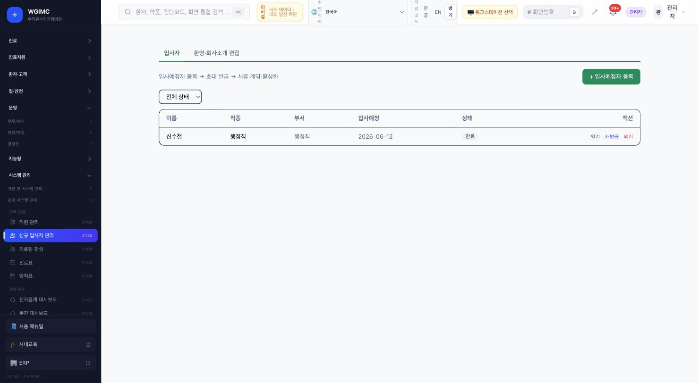

화면이 절차를 스스로 적고 있습니다 — **입사예정자 등록 → 초대 발급 → 서류·계약·활성화**. 입사예정자마다 이름 · 직종 · 부서 · 입사예정일 · 상태가 서고, 초대를 다시 보내거나(재발급) 폐기할 수 있습니다. 초대에는 기한이 있어 지나면 `만료` 로 남습니다.

`환영·회사소개 편집` 탭에서 입사자가 받는 안내를 기관이 직접 고칩니다.

---

## 3. 직원 관리 — 신원의 정본

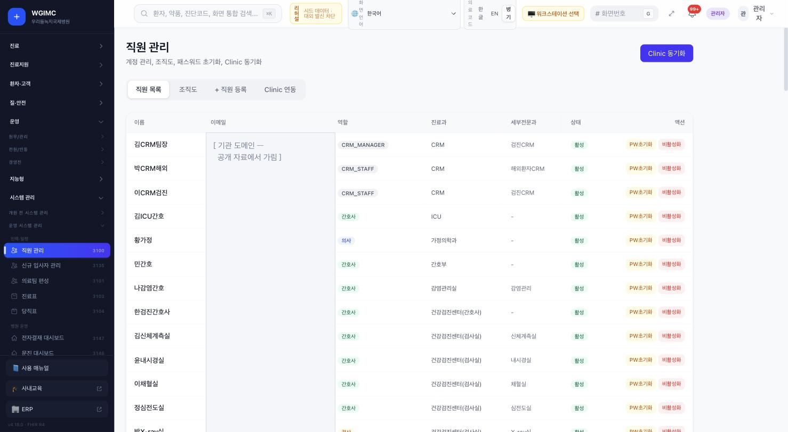

직원마다 **역할 · 진료과 · 세부전문과 · 상태**가 붙습니다. 탭은 `직원 목록` · `조직도` · `직원 등록` · `Clinic 연동` 이고, 오른쪽 위의 **`Clinic 동기화`** 가 그룹웨어로 직원을 내보내는 자리입니다(HIS → Clinic 직원 일괄 등록 · [연결 상태](../RELEASES/draft/compatibility.md) `구현·미검증`).

한 직원을 두고 할 수 있는 일은 **비밀번호 초기화**와 **비활성화**입니다. 지우는 것이 아니라 비활성화라는 점이 기록 보존과 이어집니다.

---

## 4. 역할 권한 — 이 화면이 실제로 판정하는 것만 말한다

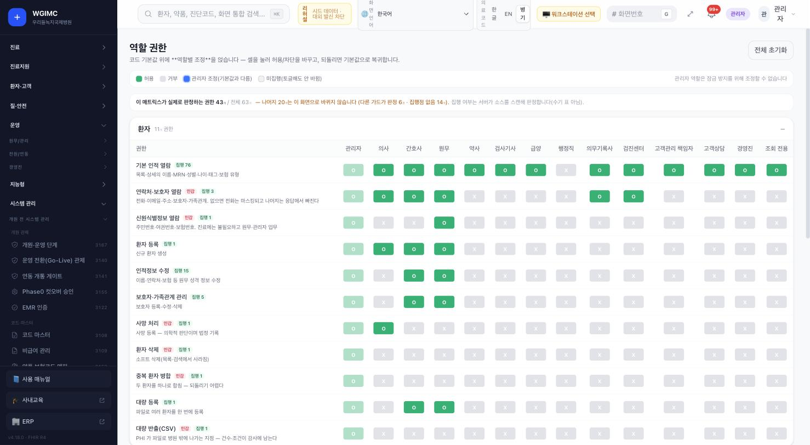

권한을 세로로, 역할 14개를 가로로 놓은 매트릭스입니다. 셀을 눌러 허용·차단을 바꾸고, 되돌리면 코드 기본값으로 복귀합니다.

**이 화면이 이 생태계의 취지를 가장 잘 보여 줍니다.** 화면이 스스로 이렇게 밝히기 때문입니다.

> **이 매트릭스가 실제로 판정하는 권한 43개 / 전체 63개** — 나머지 20개는 이 화면으로 바뀌지 않습니다(다른 가드가 판정 6개 · **집행점 없음 14개**). 집행 여부는 서버가 소스를 스캔해 판정합니다(수기 표 아님).

- 범례에 **`미집행(토글해도 안 바뀜)`** 이 따로 있습니다. 켜는 시늉을 보여 주지 않습니다 → [취지 3 「모르는 것을 아는 척하지 않는다」](../overview/02-principles.md#3-모르는-것을-아는-척하지-않는다)
- 권한마다 **`민감`** 표시와 **집행점 수**(`집행 76` · `집행 1` …)가 붙습니다. 그 권한이 코드 몇 곳에서 실제로 검사되는지입니다.
- `관리자 역할은 잠금 방지를 위해 조정할 수 없습니다` — 자기 발등을 찍지 못하게 막아 둔 자리입니다.
- 권한 설명이 업무 말로 적혀 있습니다(예: 연락처·보호자 열람 = "전화·이메일·주소·보호자·가족관계. 없으면 전화는 마스킹되고 나머지는 응답에서 빠진다").

### 부서로도 나눈다 — 접근 권한 관리

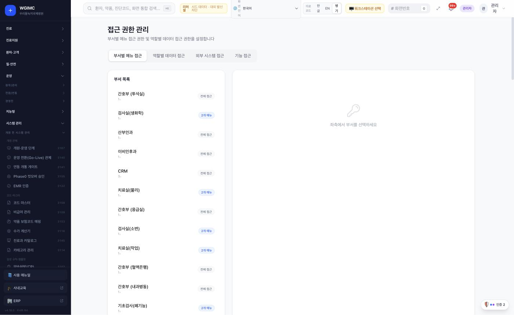

역할(위 매트릭스)과 **별개의 축**입니다. `부서별 메뉴 접근` · `역할별 데이터 접근` · `외부 시스템 접근` · `기능 접근` 네 탭으로 나뉘고, 부서마다 `전체 접근` 인지 `N개 메뉴` 인지가 붙습니다. 같은 간호사여도 투석실 · 응급실 · 혈액은행 · 내과병동이 서로 다른 범위를 가질 수 있습니다.

### 자격과 교육 — 면허를 확인하는 자리

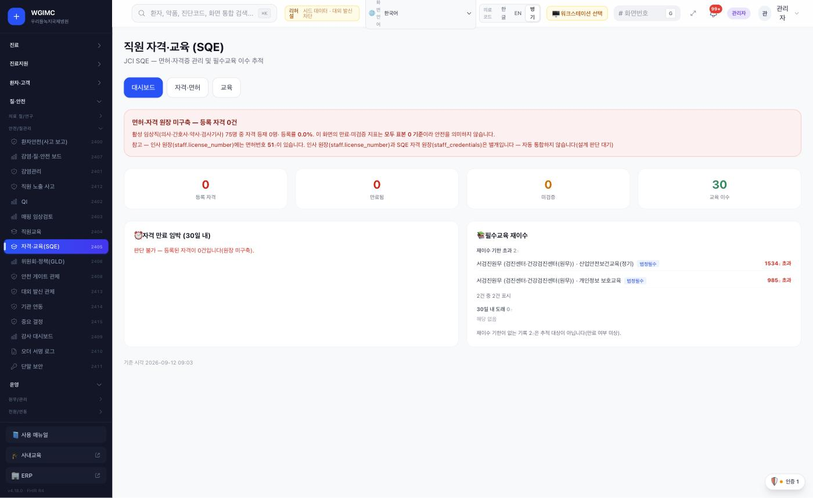

JCI SQE(면허·자격증 관리와 필수교육 이수 추적)입니다. 이 리허설 설치본은 **활성 임상직 75명 중 자격 등재 0명**인데, 화면이 그 상태를 이렇게 적습니다.

> **이 화면의 만료·미검증 지표는 모두 표본 0 기준이라 안전을 의미하지 않습니다.**
> 자격 만료 임박(30일 내) — **판단 불가 — 등록된 자격이 0건입니다(원장 미구축).**

그리고 **정본이 갈린 자리**도 스스로 밝힙니다 — 인사 원장에는 면허번호가 51건 있지만 SQE 자격 원장과는 별개이고 **자동 통합하지 않는다(설계 판단 대기)** 고 적습니다 → [취지 4 「정본은 하나」](../overview/02-principles.md#4-정본은-하나)

---

## 5. 인증 관리 콘솔 — 서명할 수 있게 만드는 자리

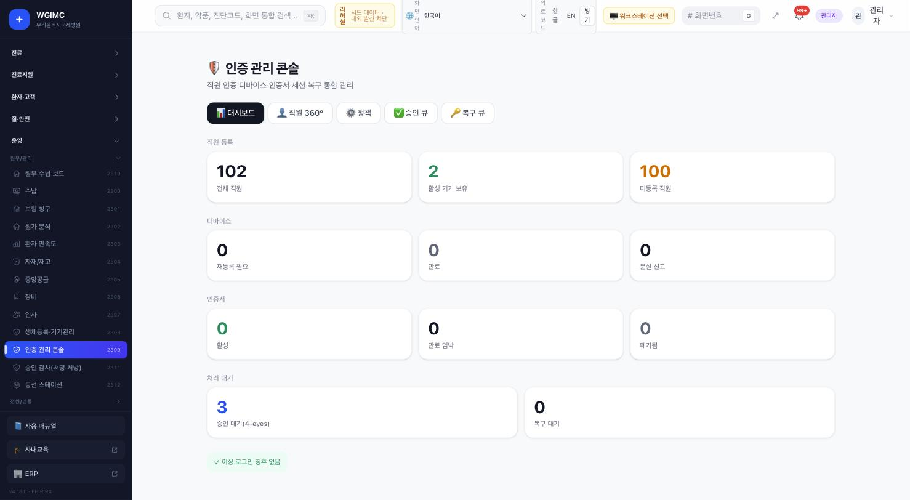

직원 인증 · 디바이스 · 인증서 · 세션 · 복구를 한 화면에서 봅니다. 탭은 `대시보드` · `직원 360°` · `정책` · `승인 큐` · `복구 큐`.

캡처 시점의 이 리허설 설치본은 이렇습니다 — **전체 직원 102명 중 기기를 등록한 사람 2명, 미등록 100명. 인증서는 활성 0.** 승인 대기(**4-eyes** — 두 사람이 승인해야 하는 건) 3건.

> 이것이 **구축 초기의 정상 상태**입니다. 직원을 넣은 뒤 인증서와 기기를 등록하는 일이 남아 있다는 뜻이고, 화면은 그 남은 양을 숨기지 않고 100 이라고 적습니다.

인증서를 실제로 발급한 뒤의 화면은 이 자료에 아직 없습니다. **발급은 데이터를 바꾸는 일이라 캡처를 위해 하지 않았습니다.**

이어지는 자리 — 본인이 자기 인증서를 보는 `내 전자인증서`, 서명 수단을 등록하는 `내 서명 등록`, 어느 단말에서 로그인·서명할 수 있는지 정하는 `생체등록·기기관리` 와 `단말 보안`, 그리고 실제로 서명한 기록이 남는 `오더 서명 로그` 와 `승인 감사(서명·처방)`. 전자서명 자체는 [sign](sign.md) 이 합니다.

### 인증서는 sign 이 발급하고, HIS 는 비춰 본다

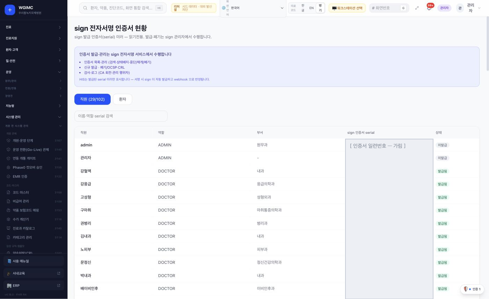

HIS 의 이 화면은 **sign 이 발급한 인증서의 미러이고 읽기 전용**입니다. 발급·중단·재개·폐기와 OCSP·CRL, CA 회전 감사는 [sign](sign.md) 에서 합니다. 서명할 때 sign 이 자동으로 발급하고 웹훅으로 HIS 에 반영됩니다 — 직원이 미리 발급받아 둘 필요가 없습니다.

이 설치본은 직원 102명 중 **29명에게 발급**돼 있습니다. (일련번호 열은 공개 자료에서 가렸습니다.)

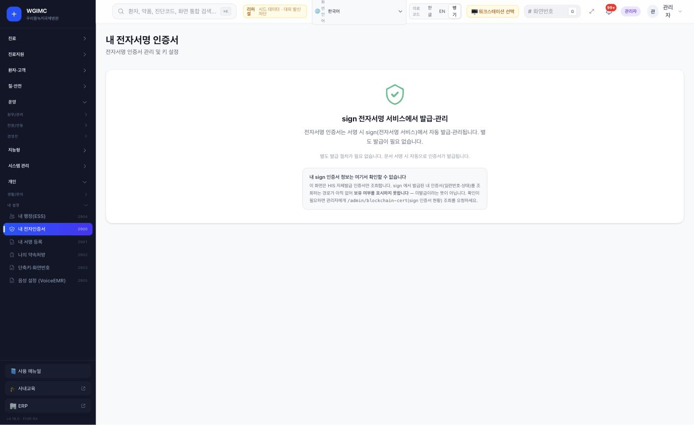

직원 본인이 보는 화면입니다. 그런데 이 화면은 **자기가 못 하는 일을 먼저 말합니다.**

> **내 sign 인증서 정보는 여기서 확인할 수 없습니다.** 이 화면은 HIS 자체발급 인증서만 조회합니다. sign 에서 발급된 내 인증서(일련번호·상태)를 조회하는 경로가 아직 없어 **보유 여부를 표시하지 못합니다 — 미발급이라는 뜻이 아닙니다.**

없는 것을 "없음"이나 "0"으로 적지 않고 **"표시하지 못한다"** 고 적은 자리입니다 → [취지 3](../overview/02-principles.md#3-모르는-것을-아는-척하지-않는다). 동시에 이것은 지금의 **기능 공백**이기도 합니다(사용자는 관리자에게 조회를 요청해야 합니다).

### 어느 단말에서 일할 수 있나

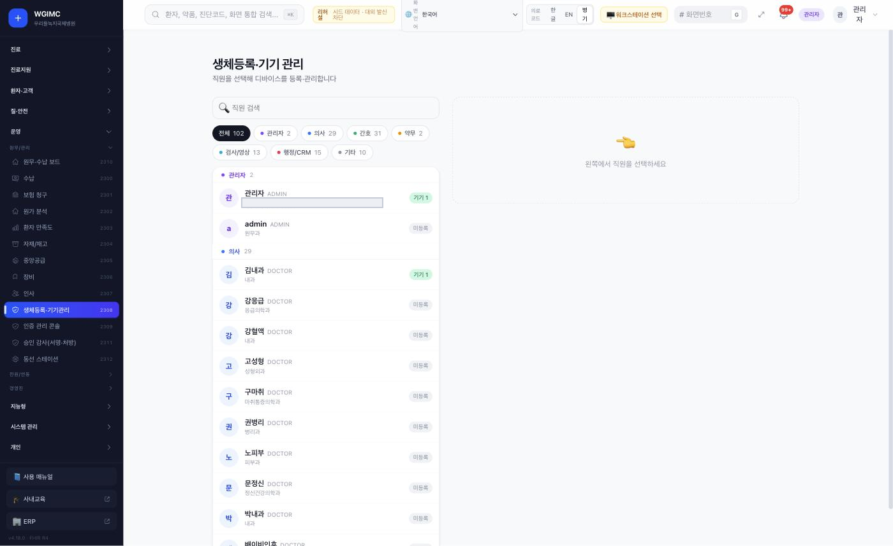

직원 102명을 역할로 나눠(관리자 2 · 의사 29 · 간호 31 · 약무 2 · 검사/영상 13 · 행정/CRM 15 · 기타 10) 각자의 기기 등록 상태를 봅니다. 생체 로그인(로그인 화면의 `스탭용 생체로그인`)이 여기에 기댑니다.

---

## 6. 의료진 등록 — 채용 뒤에 더 하는 일

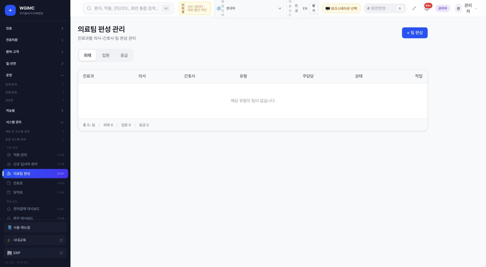

의료진은 직원 등록만으로 진료할 수 없습니다. **진료과별 의사–간호사 팀**을 외래 · 입원 · 응급으로 나눠 편성하고(위 화면 · 이 설치본은 아직 0팀), 이어서 진료표(요일 · 시간 · 진료실)와 당직표를 짭니다. 처방 권한은 [역할 권한](#4-역할-권한--이-화면이-실제로-판정하는-것만-말한다)과 처방의 지정 규칙에서 정하고, 오더에 서명하려면 [인증서](#5-인증-관리-콘솔--서명할-수-있게-만드는-자리)가 있어야 합니다.

🔴 **AI 를 쓸 것인지는 별도 결정입니다.** AI 임상 기능 범위는 [개시 전 필수 결정](../checklist/decisions.md)이고, 선행 결정(의료기기 해당성 · 임상데이터 처리 경계 · 진료 음성 녹음 근거)이 먼저 기록돼야 합니다 → [S6](../build-guide/S6-ai.md).

---

## 7. 권한 밖으로 나가는 일 — 응급 열람과 퇴직

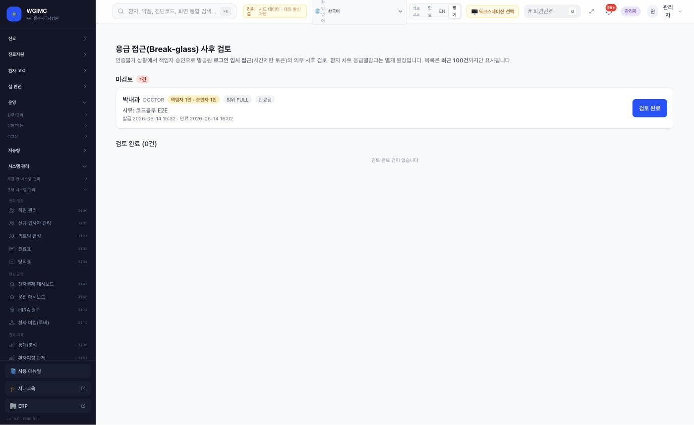

- **응급 열람** — 인증이 불가능한 상황에서 **책임자 승인으로 발급된 시간제한 토큰**입니다. 화면은 이것을 **의무 사후 검토** 원장으로 다루고, 건마다 책임자 · 승인자 · 범위 · 사유 · 발급/만료 시각을 남깁니다(예시는 30분짜리). 환자 차트 응급열람과는 **별개 원장**입니다.
- **퇴직** — 직원 상태를 바꾸고 역할 · 접근 권한을 회수하고 인증서를 폐기하고 등록 단말을 해제합니다. 🔴 **형제 시스템의 계정 · 세션 회수 방식은 시스템마다 다릅니다.**

  **어디까지 코드로 확인했나**(기준 커밋 · 2026-09-16 · 화면에서 돌려 본 것이 아니라 코드에서 경로가 있는지만 본 것입니다)

  | 시스템 | 확인한 것 |
  |---|---|
  | HIS | 직원 상태 · 역할 · 인증서 · 단말을 다루는 화면이 있습니다(위 순서) — **여기가 1차입니다** |
  | LIS | 관리자가 계정을 **비활성으로 바꾸는 경로**가 있습니다. **마지막 남은 활성 관리자는 비활성화하지 못하게 막고**, 비활성화하면 그 사람이 결재자로 걸려 있던 항목을 표시합니다 |
  | sign | **세션을 서버에서 즉시 폐기**하는 장치가 있습니다(로그아웃 · 비밀번호 변경 시 · 만료 전이라도) |
  | PACS · AI Server | 계정에 **활성 여부**가 있고, AI Server 는 관리 화면에서 켜고 끕니다 |
  | ERP · edu | 직원 계정이 **HIS 신원에서 파생**됩니다(첫 진입이 HIS 로그인). 자체 계정을 따로 거두는 경로는 **이번 확인에서 찾지 못했습니다** — 있는지 없는지를 단정하지 않고 각 프로젝트에 확인을 요청해 두었습니다 |
  | Clinic · twin · cerno · Jitsi | 설치하지 않아 확인하지 못했습니다 |

  🔴 **표에 있다고 "퇴직 처리가 끝난다"는 뜻이 아닙니다.** 경로가 코드에 있는지만 본 것이고, **실제로 돌려 본 기록은 없습니다.** 개시 전에 시스템마다 한 번씩 직접 해 보고 기록을 남기십시오.
- 지운 뒤에도 남아야 할 기록은 `보유·파기(Retention)` 와 `감사 로그` 가 맡습니다.

---

## 이 장이 말하지 않는 것

- **화면이 있다는 것과 절차가 검증됐다는 것은 다릅니다.** 위 순서는 화면이 스스로 적은 것과 메뉴 구성에서 읽은 것이고, 새 설치본에서 처음부터 따라가 본 기록은 아직 없습니다.
- 로그인의 2단계 인증 · 패스키 여부와 초대 기한은 `확인 필요(따라가기)` 입니다. 형제 시스템의 계정 회수는 **경로가 있는지까지만** 위에 적었고, **실제로 회수해 본 기록은 없습니다.**
- 캡처는 한 설치본의 한 시점입니다. 기관마다 메뉴 · 역할 · 항목이 다릅니다.
