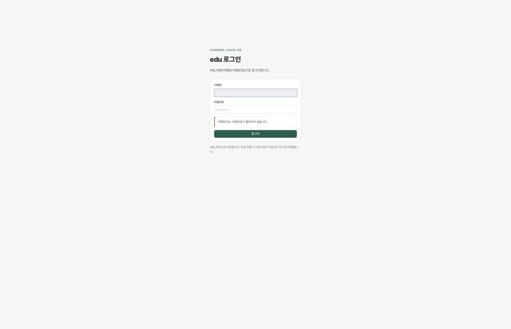

# edu 화면

> 🟡 **초안 — 캡처 넣는 중** · [화면 소개 목차](README.md) · [edu 시스템 구성서](../systems/edu.md)
> 계층 협업·교육 · 버전 `2.7.0` · 구현 상태 `확인 필요` — 운영 여부 재확인 전 · 화면 41 · 기준: [통합 릴리즈 초안](../RELEASES/draft/manifest.md)(계측일 2026-09-11)

**EN** — Staff e-learning. Screens are captured on **synthetic hospital data**; institution-identifying information, secrets and infrastructure details are masked before publication ([capture rules](../assets/screens/README.md)).

---

## 무엇을 하는 화면인가

직원 이러닝 · 법정교육 · 전자 이수증. 이수증은 [sign](sign.md) 이 봉인합니다. 직원 입사 · 변경 · 퇴직은 HIS 의 직원 이벤트 웹훅으로 받습니다.

## 화면

edu 는 **자체 계정을 두지 않습니다.** 로그인 화면이 그것을 그대로 적습니다.

> **HIS 계정(이메일 · 비밀번호)으로 로그인합니다.**
> HIS 계정으로 인증합니다. **운영 전환 시 HIS SSO 자동 로그인으로 대체됩니다.**

[5장 「신원」](../overview/05-identity-trust-standards.md)이 적은 **"edu 는 로그인이 HIS SSO 뿐이라 HIS 없이 따로 쓸 수 없다"** 가 로그인 화면에서 그대로 확인됩니다. HIS 가 멈추면 edu 로 들어갈 수 없다는 뜻이기도 합니다.

> ⚠️ **이 설치본에서는 edu 에 적힌 기관 이름이 HIS 에 설정된 기관 이름과 다릅니다.** 시스템마다 기관명을 따로 설정하기 때문으로 보입니다 → [취지 4 「정본은 하나」](../overview/02-principles.md#4-정본은-하나)

## 캡처 자리

| # | 담을 화면 | 파일 | 상태 |
|---|---|---|---|
| 📷 edu-1 | 교육 과정과 수강 | `edu-courses.png` | ⬜ |
| 📷 edu-2 | 법정교육 이수 현황 | `edu-mandatory.png` | ⬜ |
| 📷 edu-3 | 전자 이수증(sign 봉인) | `edu-certificate.png` | ⬜ |

## 알아 둘 것

**로그인이 HIS SSO 뿐**이라 HIS 없이 따로 쓸 수 없습니다.

- 이 시스템이 다른 시스템과 실제로 맞물리는지는 [연결 상태](../RELEASES/draft/compatibility.md)에서 봅니다 — **`검증됨` 21**(HIS → sign 직원 신원 · 서명 · sign → HIS 서명 완료 통지 · HIS → sign 오더 서명 로그 봉인 · HIS → LIS 검사 오더 전달 · LIS → HIS 환자 조회 · LIS → HIS 검사 결과 전달 · HIS → LIS 오더 취소 전파 · HIS → ERP 직원 SSO · HIS ⇄ edu 직원 SSO · 공개키 조회 · 직원 명부 · 이수 기록 · edu ⇄ sign 이수증 서명 · 완료 통지 · ERP ⇄ sign 외주 계약 서명 · 완료 통지 · PACS → sign 판독 서명 · LIS → PACS 병리 워크리스트 · LIS → ERP 검사 청구 · LIS → PACS 병리 뷰어 링크 · LIS → HIS 검사코드 카탈로그 반입 — 새 설치본끼리 실제 호출로 확인 2026-09-14 · 나머지는 코드 대조 2026-09-11).
- 설치 요구사항 · 주요 설정 · 한계는 [edu 시스템 구성서](../systems/edu.md)에 있습니다.
- 캡처를 넣는 규칙은 [캡처 안내](../assets/screens/README.md), 사람 확인은 [캡처 대장](../assets/CAPTURE-LEDGER.md)에 있습니다.
