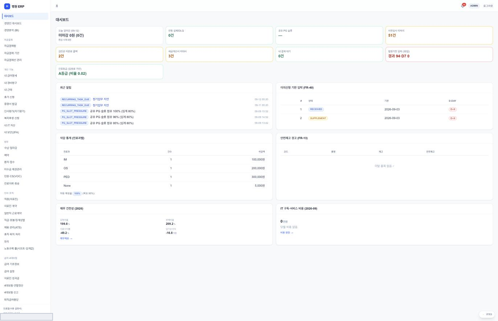
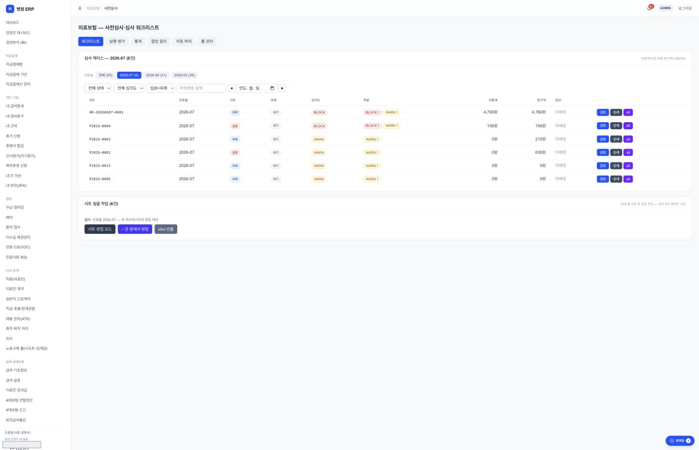
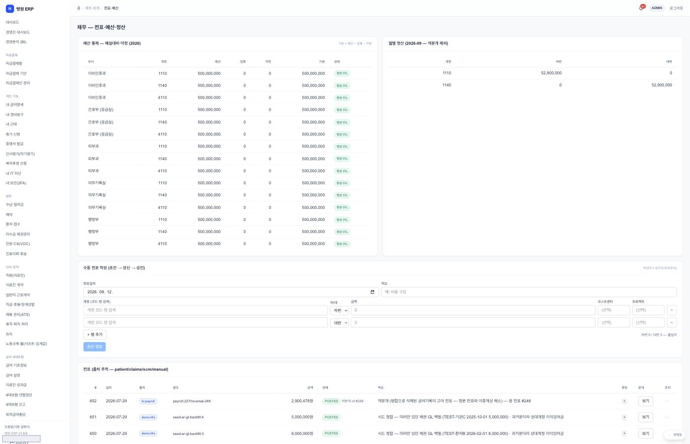
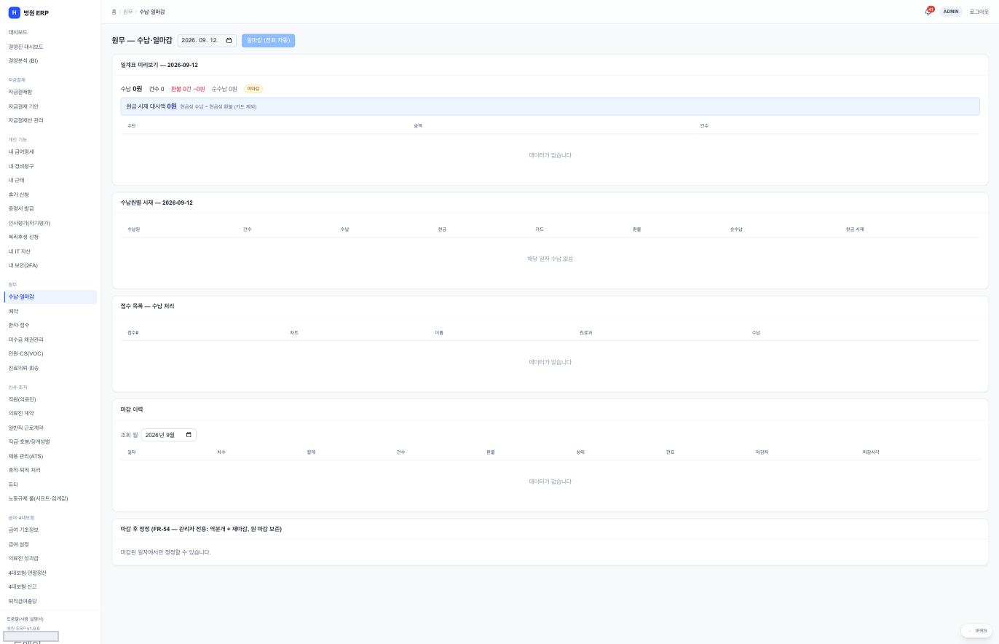
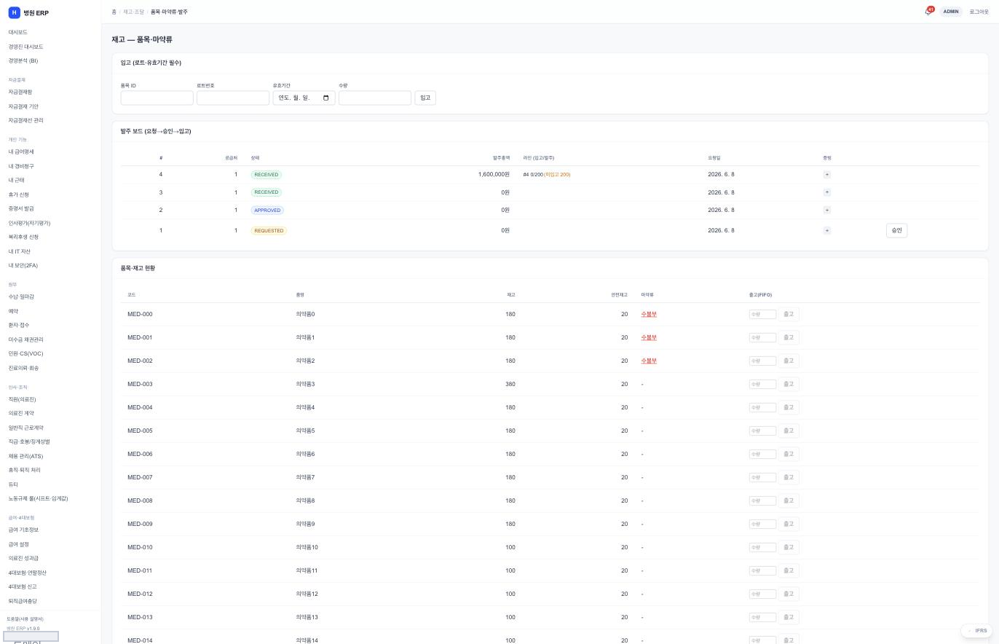

# ERP 화면

> 🟡 **초안 — 캡처 넣는 중** · [화면 소개 목차](README.md) · [ERP 시스템 구성서](../systems/erp.md)
> 계층 경영 · 버전 `1.287.3` · 구현 상태 `파일럿` — 문서마다 표기가 엇갈려 재확인 대상 · 화면 113 · 기준: [통합 릴리즈 초안](../RELEASES/draft/manifest.md)(계측일 2026-09-11)

**EN** — Enterprise resource planning. Screens are captured on **synthetic hospital data**; institution-identifying information, secrets and infrastructure details are masked before publication ([capture rules](../assets/screens/README.md)).

---

## 무엇을 하는 화면인가

재무회계 · 원가 · 인사급여 · 자재 · 보험청구 · 세무. HIS 의 수납 이벤트가 전표로 들어오고, 진료비 계산서의 산정값을 HIS 에 돌려줍니다.

## 화면

오늘 마감 · 연동 실패(DLQ) · 결제 · **사전심사 미처리** · 세금계산서 · 결재 대기 · **법정기한 임박** · 간호등급이 위에 서고, 아래에 최근 알림(정기업무 지연 · 결제 슬롯 점유 임계 초과) · **이의신청 기한 임박** · **삭감 통계(진료과별 건수와 삭감액, 자동 매칭률)** · 안전재고 경고 · **재무 건전성**(유동비율 · 부채비율 · 의료이익률 · 당기순이익) · IT 구독 비용이 놓입니다.

> ⚠️ **화면과 문서의 버전이 어긋납니다.** 이 자료의 머리는 저장소 정본 표기 `1.287.3` 을 적었는데, 화면 왼쪽 아래는 **`병원 ERP v1.9.0`** 이라고 말합니다(2026-09-12 확인). 어느 쪽이 맞는지 **한쪽을 고르지 않고 둘 다 적습니다** — 매니페스트가 13행 중 8행에서 이런 어긋남을 표시하는 것과 같은 경우입니다 → [매니페스트](../RELEASES/draft/manifest.md) · [취지 1](../overview/02-principles.md).

> 이 설치본은 HIS 와 **같은 주소 아래 `/erp/` 경로**로 열립니다. [시스템 구성서](../systems/erp.md)의 배포 형태와 함께 봅니다.

청구 전에 **삭감 위험을 먼저 봅니다.** 케이스마다 심각도가 `BLOCK`(막음) · `WARN`(경고)으로 갈리고, **위험액과 청구액을 나란히** 적습니다. 담당이 정해지지 않은 건은 `미배정`으로 남습니다 — 비워 두지 않고 "아직 아무도 맡지 않았다"고 말합니다.

> 🔴 **`BLOCK` 은 자동으로 지우지 않습니다.** 사람이 `검토` 를 열어 판단합니다. 옆의 `AI` 버튼은 **보조**입니다 → [취지 1](../overview/02-principles.md). 위에 `실행 평가` · `자동 처리` · `룰 관리` 탭이 따로 있어, **무엇을 규칙으로 자동 처리했는지**를 룰 단위로 되짚을 수 있습니다.

예산 통제(예실대비)와 월별 정산이 위에, 수동 전표 작성(**초안 → 상신 → 승인**)이 가운데, 전표 목록이 아래에 섭니다.

> 📌 **전표마다 「출처」 배지가 붙습니다** — `patient` · `claims` · `scm` · `manual` 로 나뉘고, 참조 칸에 원 이벤트 키가 그대로 남습니다(예: 급여 전표의 역분개는 **원 전표 번호를 적요에 적어** 이중기록을 해소합니다). **숫자가 어디서 왔는지를 회계에서도 말합니다** → [취지 2 「출처를 말한다」](../overview/02-principles.md#2-출처를-말한다)

캡처한 날은 **토요일**이라 수납이 0 건입니다. 화면은 빈칸을 두지 않고 **「해당 일자 수납 없음」** 이라고 말하고, 현금 시재 대사액도 `0원`과 **계산식**(현금성 수납 − 현금성 환불, 카드 제외)을 함께 적습니다.

> 📌 **마감을 되돌리지 않습니다.** 맨 아래 「마감 후 정정」은 관리자 전용이고 방식이 **덮개 전표 + 재마감**이며 **원 마감을 보존**합니다. 지우고 다시 쓰는 대신 **덮개를 쌓아 이력을 남깁니다** → [취지 4](../overview/02-principles.md).

입고는 **로트번호와 유효기간이 필수**이고, 발주 보드는 `REQUESTED → APPROVED → RECEIVED` 로 흐릅니다. 품목마다 재고 · **안전재고** · 마약류 여부 · 출고(FIFO)가 한 줄에 있고, **마약류 품목은 빨간 글씨**로 구분됩니다.

## 캡처 자리

| # | 담을 화면 | 파일 | 상태 |
|---|---|---|---|
| ✅ erp-1 | 청구 사전심사 — `BLOCK`/`WARN` · 위험액·청구액 · 미배정 | [`erp-claim-precheck.png`](../assets/screens/erp-claim-precheck.png) | 확인(2026-09-12) |
| ✅ erp-2 | 수납 · 일마감 — 0 건을 말하는 방식 · **마감 후 정정 = 덮개 전표** | [`erp-daily-closing.png`](../assets/screens/erp-daily-closing.png) | 확인(2026-09-12) · 계산서 화면은 남음 |
| ✅ erp-3 | 전표 · 예산 · 정산 — **출처 배지**(patient·claims·scm·manual) | [`erp-accounting.png`](../assets/screens/erp-accounting.png) | 확인(2026-09-12) |
| ✅ erp-4 | 품목 · 마약류 · 발주 — 로트·유효기간 필수 · 안전재고 | [`erp-inventory.png`](../assets/screens/erp-inventory.png) | 확인(2026-09-12) |

## 알아 둘 것

청구 사전심사에서도 **신고 금액 확정은 AI 에 넘기지 않습니다.** BI 도구(Grafana · Metabase)는 AGPL 계열이라 별도 compose 로 선택해 붙입니다([THIRD_PARTY](../THIRD_PARTY.md)).

- 이 시스템이 다른 시스템과 실제로 맞물리는지는 [연결 상태](../RELEASES/draft/compatibility.md)에서 봅니다 — **`검증됨` 26**(HIS → sign 직원 신원 · 서명 · sign → HIS 서명 완료 통지 · HIS → sign 오더 서명 로그 봉인 · HIS → LIS 검사 오더 전달 · LIS → HIS 환자 조회 · LIS → HIS 검사 결과 전달 · HIS → LIS 오더 취소 전파 · HIS → ERP 직원 SSO · HIS ⇄ edu 직원 SSO · 공개키 조회 · 직원 명부 · 이수 기록 · edu ⇄ sign 이수증 서명 · 완료 통지 · ERP ⇄ sign 외주 계약 서명 · 완료 통지 · PACS → sign 판독 서명 · LIS → PACS 병리 워크리스트 · LIS → ERP 검사 청구 · LIS → PACS 병리 뷰어 링크 · LIS → HIS 검사코드 카탈로그 반입 · HIS → ERP 약품 보험코드 매핑 반입 · ERP → HIS 청구 라인 · 재원 조회 · HIS → ERP 진료비 계산서 조회 · ERP → HIS 검진권 정산 지급 회신 · ERP → HIS 의료진 계약 서명 발의 — 새 설치본끼리 실제 호출로 확인 2026-09-14 · 나머지는 코드 대조 2026-09-11).
- 설치 요구사항 · 주요 설정 · 한계는 [ERP 시스템 구성서](../systems/erp.md)에 있습니다.
- 캡처를 넣는 규칙은 [캡처 안내](../assets/screens/README.md), 사람 확인은 [캡처 대장](../assets/CAPTURE-LEDGER.md)에 있습니다.
