# HIS 화면 — 병원 하나가 돌아가는 자리

> 🟡 **초안** · 캡처 **264 / 266**(제외 2 — 인프라 주소 · 외부 기관 정보가 화면 전체에 걸림) · [화면 소개 목차](README.md) · 캡처 목록: [assets/screens/INDEX.md](../assets/screens/INDEX.md)
> 근거: [HIS 메뉴 구성 — 도메인별](../systems/his-domains.md)(HIS `v4.18.0` · 기준 커밋 2026-09-11 · 자동 추출) · [HIS 시스템 구성서](../systems/his.md) · ⚠️ 캡처한 설치본은 **v4.19.0**([까닭](README.md#장))

**EN** — The HIS ships **266 screens** in its default menu, grouped into 8 domains and 26 menu clusters. This chapter walks the domains and shows what each screen is for. Menu names and default roles are **code defaults** — an administrator can rename, reorder, hide or add menus. A screen existing is not the same as a connection being verified: see [connection status](../RELEASES/draft/compatibility.md) (**0 verified**). Captured so far: **264 of 266** menu screens (2 withheld — infrastructure addresses / partner details), on a rehearsal install running v4.19.0 (base commit: v4.18.0).

---

## 한눈에

| 도메인 | 무엇을 하는 자리 | 메뉴 묶음 | 화면 |
|---|---|---|---:|
| [진료 `care`](#진료--care) | 외래 · 간호 · 수술/중환자 · 전문 진료 · 특수 치료 · 입원 · 협진 | 7 | 45 |
| [진료지원 `support`](#진료지원--support) | 약국 · 검사 · 영상 · 병리 · 워크스테이션 · 건강검진센터 · 의무기록 | 4 | 62 |
| [환자·고객 `patient`](#환자고객--patient) | CRM · 캠페인 · 해외환자 · 병원 안내 | 2 | 17 |
| [질·안전 `quality`](#질안전--quality) | 환자안전 · 감염관리 · QI · 임상 연구 · 감사 · 안전 게이트 | 2 | 22 |
| [운영 `ops`](#운영--ops) | 원무 · 수납 · 청구 · 자재 · 인사 · 전원 · 경영 대시보드 | 3 | 19 |
| [지능형 `intel`](#지능형--intel) | AI 컨시어지 · 예약 도우미 · 환자 여정 · 상호운용성 | 1 | 7 |
| [시스템 관리 `system`](#시스템-관리--system) | 개원 전 기준 · 운영 관리 · 검진권 · 외부 연동 · 홈페이지 | 5 | 87 |
| [개인 `personal`](#개인--personal) | 내 설정 · 전자인증서 · 음성 설정 | 2 | 7 |
| | | **26** | **266** |

- 화면 경로와 기본 사용 역할은 [메뉴 구성표](../systems/his-domains.md)에 전부 있습니다. 이 장은 **무엇을 하는 화면인지**를 설명합니다.
- 📷 표시는 아직 이 장에 넣지 않은 **캡처 자리**입니다. 찍어 둔 화면 전부는 [캡처 목록](../assets/screens/INDEX.md)에 있습니다.
- 이 장에서 되풀이해 나오는 **"모른다"고 말하는 아홉 가지 방식**은 [개요서 취지 3](../overview/02-principles.md#화면이-모른다고-말하는-아홉-가지-방식)에 표로 모아 두었습니다.

---

## 진료 — `care`

외래·입원·간호·전문진료·수술 등 임상 진료 전반. **환자 한 명의 진료가 시작되고 끝나는 자리**입니다.

| 묶음 | 화면 | 하는 일 |
|---|---:|---|
| **외래** | 9 | `접수` 에서 환자를 받고 `진료실 대기` 로 넘기며, 의사는 `처방(CPOE)` 에서 처방과 오더를 냅니다. `통합 상황판` · `대시보드` 가 그날의 전체 흐름을 보여 줍니다. 외국인 환자와 응급 미확인 환자는 등록 화면이 따로 있습니다 |
| **간호** | 3 | `간호 워크스테이션` 에서 투약 · 활력징후 · 간호기록을 다루고, `간호 스테이션 보드` 는 병동에 띄우는 현황판입니다 |
| **수술/중환자** | 6 | `수술` · `회복실(PACU)` · `중환자실` · `응급실` 과 각 보드, 그리고 `Code Blue / RRT` 호출 화면 |
| **전문 진료** | 12 | 내과 · 정형외과 · 신경외과 · 산부인과 · 소아청소년과 · 정신과 · 안과 · 이비인후과 · 피부과 · 치과 · 성형외과 · 비뇨의학과 — 과마다 그 과의 서식과 도구가 붙은 진료 화면 |
| **특수 치료** | 5 | 재활의학 · 방사선종양 · `항암 치료(사이클)` · 투석실 · 장기이식 — 주기와 프로토콜이 있는 치료 |
| **입원** | 6 | `입원 환자` · `회진` · `인수인계` · `병상 현황` · 급식 |
| **협진/의뢰** | 4 | `협진 의뢰` · 의뢰서 문서 · `상담 데스크` · `고객의 소리(VoC)` |

**캡처 자리**

| # | 담을 화면 | 화면 경로 | 파일 |
|---|---|---|---|
| ✅ care-1 | 접수 — AI 접수 어시스턴트 · 곧 도착 예약 | `/reception` | [`his-care-reception.png`](../assets/screens/his-care-reception.png) |
| ✅ care-2 | 진료실 대기 — 진료 순서와 호출 | `/clinic-queue` | [`his-care-clinic-queue.png`](../assets/screens/his-care-clinic-queue.png) |
| ✅ care-3 | 처방(CPOE) — 오더 추적 · 부서별 대기열 | `/orders` | [`his-care-orders.png`](../assets/screens/his-care-orders.png) |
| ✅ care-4 | 통합 상황판 — 그날의 전체 흐름 | `/command-center` | [`his-care-command-center.png`](../assets/screens/his-care-command-center.png) |
| ✅ care-5 | 간호 워크스테이션 — 투약 · 활력징후 · 인계 | `/nurse-station` | [`his-care-nurse-station.png`](../assets/screens/his-care-nurse-station.png) |
| ✅ care-6 | 병상·입원 보드 — 병동별 가동률 | `/bed-board` | [`his-care-bed-board.png`](../assets/screens/his-care-bed-board.png) |
| ✅ care-7 | 전문 진료(내과) — 세부 분과 탭 8 | `/internal-medicine` | [`his-care-internal-medicine.png`](../assets/screens/his-care-internal-medicine.png) |
| ✅ care-8 | 전문 진료(소아청소년과) — 같은 골격, 분과 탭 없음 | `/pediatrics` | [`his-care-pediatrics.png`](../assets/screens/his-care-pediatrics.png) |
| ✅ care-9 | 특수 치료 — 항암 사이클 엔진 | `/chemo` | [`his-care-chemo.png`](../assets/screens/his-care-chemo.png) |

### 전문 진료 12과 — 골격은 하나, 과마다 얹히는 것이 다르다

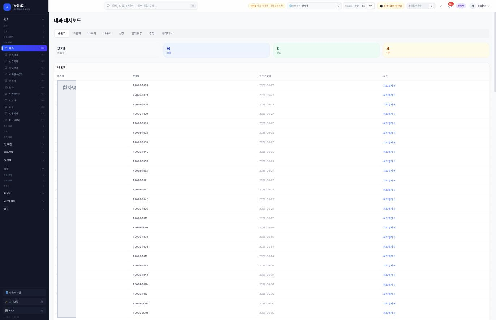

전문 진료 12과는 **같은 골격**을 씁니다 — 위쪽에 그 과의 지표 네 칸(총 검사 · 오늘 · 완료 · 대기), 아래에 `내 환자` 목록과 `차트 열기`. 다른 것은 **그 위에 얹히는 것**입니다. 내과에는 **세부 분과 탭 8개**(순환기 · 호흡기 · 소화기 · 내분비 · 신장 · 혈액종양 · 감염 · 류마티스)가 서고,

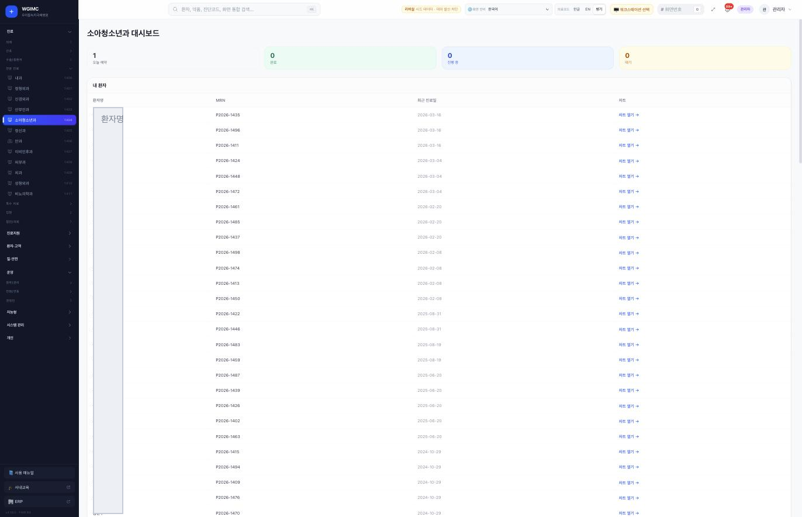

소아청소년과에는 서지 않습니다. **분과가 있는 과에만 탭이 생깁니다.**

12과를 모두 열어 보면 골격이 두 가지입니다 — 환자가 많은 과(정형외과 · 신경외과 · 정신과 · 성형외과 · 비뇨의학과)는 **내 환자 목록**이 길게 서고, 외래 시술이 중심인 과(안과 · 이비인후과 · 피부과 · 치과)는 **오늘 환자 목록(검사/시술 · 치료 내용)과 개별 환자 조회**가 붙습니다.

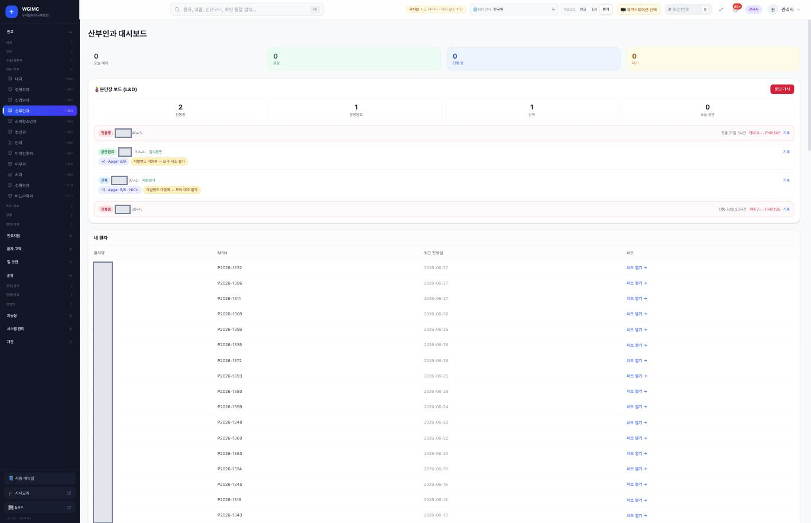

산부인과만 공통 골격 위에 **분만장 보드(L&D)** 가 하나 더 섭니다 — 진통중 · 분만완료 · 산욕, Apgar 점수, 태아 심박(FHR). 그리고 신생아 행마다 🔴 **「식별밴드 미등록 — 모아 대조 불가」** 배지가 붙습니다. 엄마와 아기를 대조할 수 없는 상태를 **따로 표시해 두는** 자리입니다.

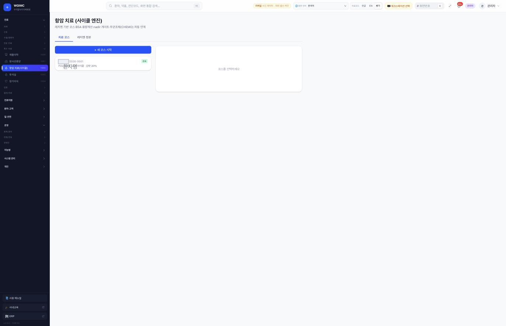

특수 치료 5개는 성격이 다릅니다 — **주기와 프로토콜이 있는 치료**라서, 항암은 코스를 사이클로 관리합니다(레지멘 기반 코스 · 체표면적 용량계산 · **nadir 게이트** · 무균조제 자동 연계). 화면이 `4/4 사이클 · 감량 20%` 처럼 **그 환자가 지금 어디까지 왔는지**를 한 줄로 말합니다.

> 👤 **환자명은 공개 자료에서 가렸습니다.** 환자번호(MRN)는 가상 데이터라 그대로 둡니다.

### 통합 상황판 — 그날의 병원이 한 화면에

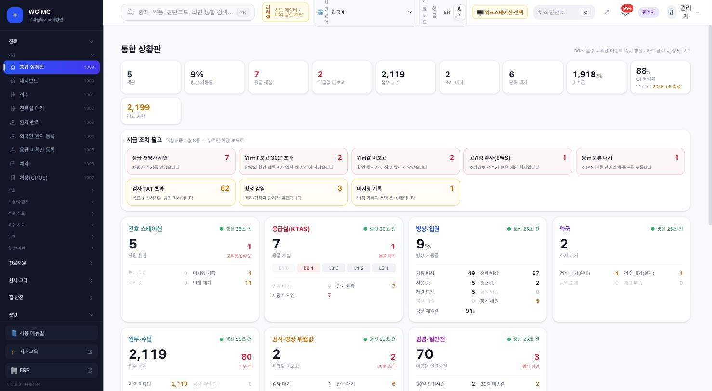

왼쪽에 도메인 메뉴, 위쪽에 그날의 지표 카드(재원 · 병상 가동률 · 응급 재실 · 접수 대기 · 미수금 · QI 달성률)가 서고, **「지금 조치 필요」** 가 눌러야 할 일을 건수와 함께 모읍니다. 아래는 부서별 보드(간호 스테이션 · 응급실(KTAS) · 병상·입원 · 약국 · 원무·수납 · 검사·영상 위험값 · 감염·질안전)와 **「원내 여정」**(접수 → 호출 → 진료중 → 수납대기 → 완료 단계별 인원과 지연)입니다.

> 화면의 병원 · 환자 · 수치는 모두 **가상 데이터**입니다.

### 접수 — 환자가 병원에 들어오는 자리

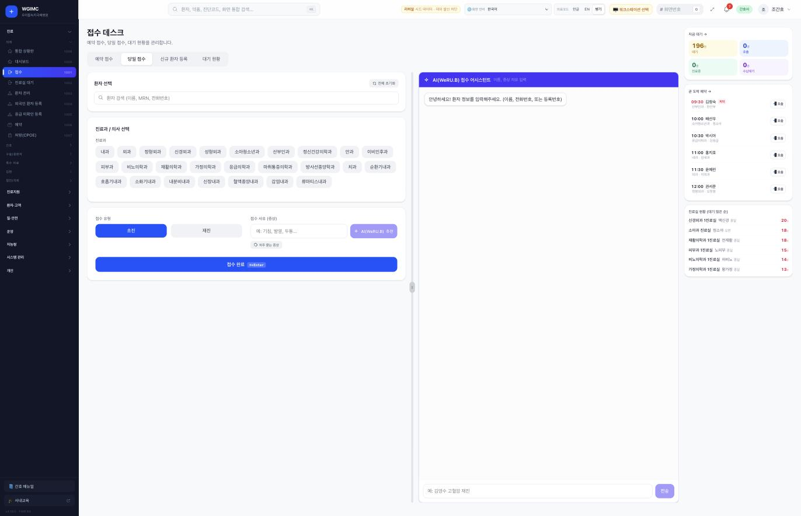

`예약 접수` · `당일 접수` · `신규 환자 등록` · `대기 현황` 네 탭입니다. 환자를 찾아 진료과와 의사를 고르고, 초진·재진과 증상을 적어 접수합니다. 오른쪽에 **AI(WeRU.B) 접수 어시스턴트**가 있어 "이름 · 전화번호 · 증상"을 자유롭게 적으면 접수를 돕고, 증상 칸에는 `AI(WeRU.B) 추천` 버튼이 붙습니다. **AI 는 접수를 돕고 제안할 뿐이고 접수 확정은 사람이 누릅니다.**

오른쪽 세로줄에 지금 대기 수 · **곧 도착 예약**(시각 · 환자 · 진료과와 `호출` 버튼 · 지각 표시) · 진료실 현황이 섭니다.

> 이 화면은 **간호사 계정**으로 찍었습니다. 접수 메뉴는 관리자 · 간호사 · 원무에게 보이고 **의사에게는 보이지 않습니다** → [역할 비교](by-onboarding.md#역할이-바뀌면-화면이-바뀐다)

### 간호 워크스테이션과 병상 보드

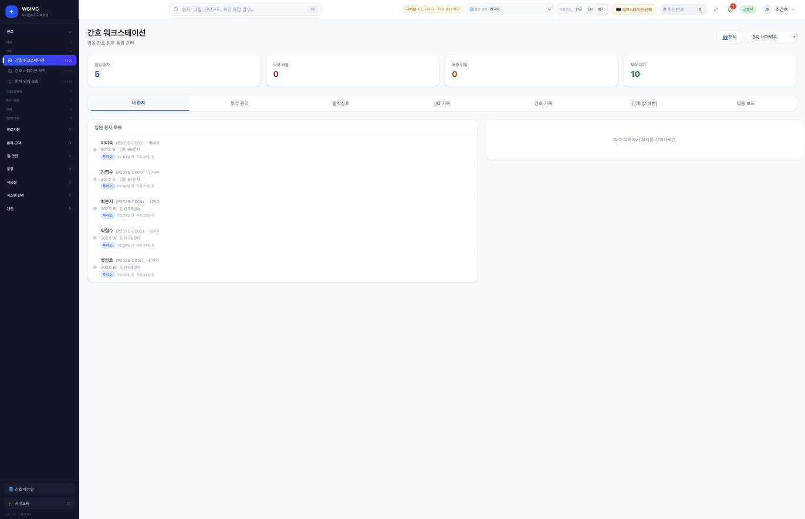

병동을 고르면 그 병동의 입원 환자 · 낙상 위험 · 욕창 위험 · **투약 대기** 수가 먼저 서고, 아래 탭으로 간호 업무가 나뉩니다 — `내 환자` · `투약 관리` · `활력징후` · `I/O 기록` · `간호 기록` · **`인계(상·하반)`** · `병동 보드`. 환자마다 병실 · 입원 며칠째 · 투약 건수 · **마지막 활력징후와 마지막 기록이 얼마나 지났는지**가 붙습니다.

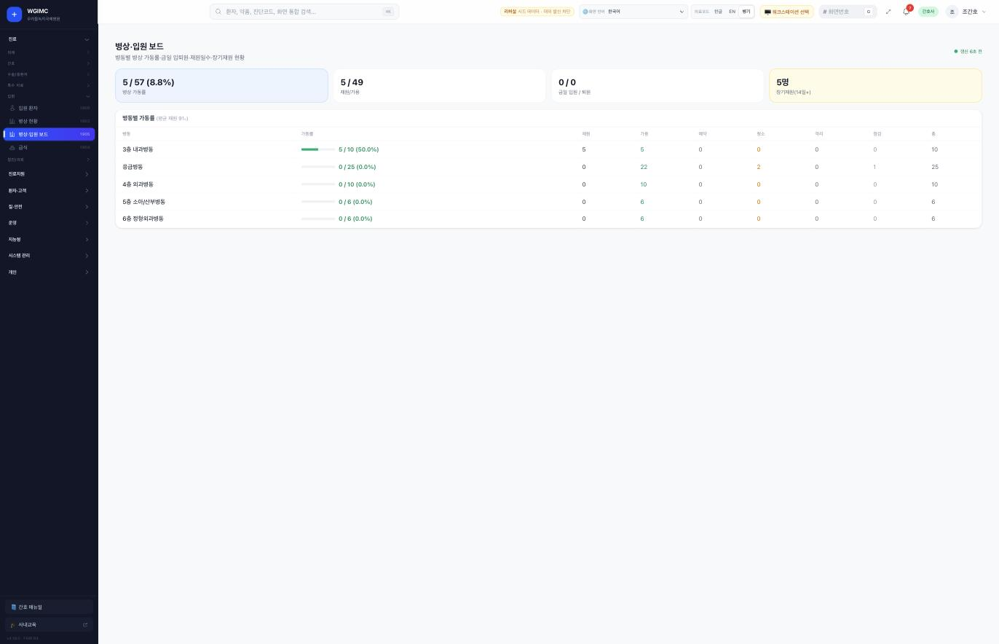

병동별 병상 가동률과 재원 · 가용 · 예약 · 청소 · 격리 · 점검 상태를 한 판에 봅니다. **장기재원(14일 이상)** 을 따로 세고, 평균 재원일을 함께 적습니다. 병동 벽에 띄우는 용도입니다.

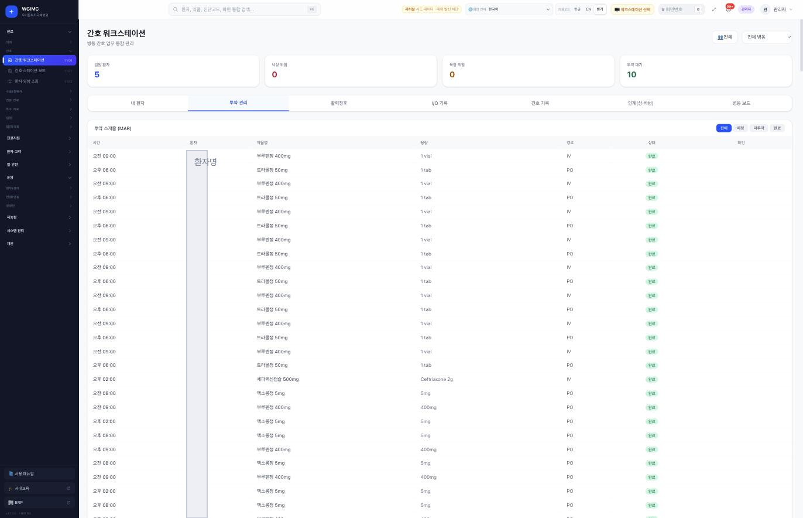

간호 워크스테이션의 **투약 관리 탭**은 투약 스케줄(MAR)입니다 — 시간 · 환자 · 약물명 · 용량 · **경로(IV · PO)** · 상태 · 확인이 한 줄이고, 위에 **투약 대기 10** 이 섭니다. 필터가 `전체 · 예정 · 미투약 · 완료` 로 갈려, **주지 않은 약이 따로 보입니다.** 바코드 확인 강제 여부는 정책성 설정이고 담당 위원회가 배정돼 있습니다([S0 위원회](../build-guide/S0-prepare.md)).

> 👤 환자명 열은 공개 자료에서 가렸습니다.

### 진료실 대기 — 없는 값을 그리지 않는 자리

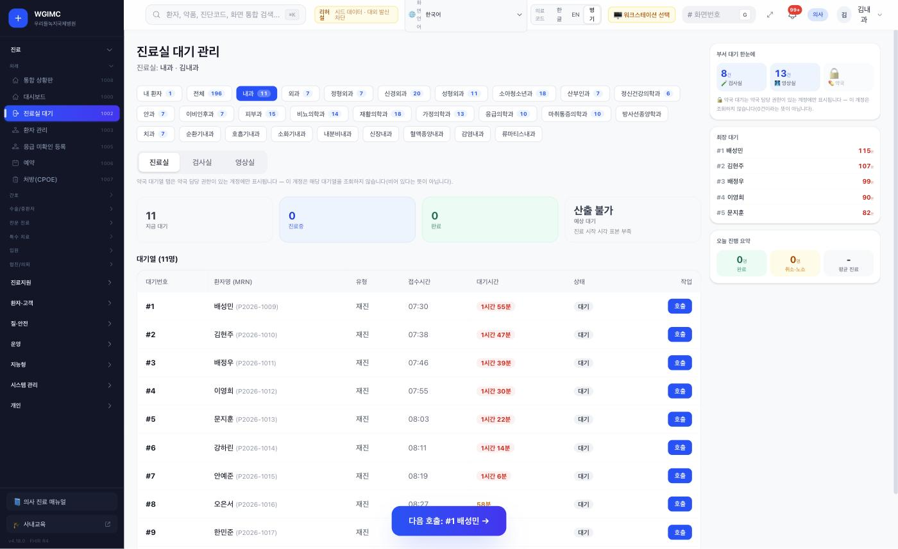

진료과별 대기 수가 위에 서고, 아래에 내 진료실 대기열(대기번호 · 환자 · 유형 · 접수시간 · **대기시간** · 호출 버튼)이 있습니다. 오른쪽에 부서 대기 현황과 최장 대기 순위, 아래에 `다음 호출` 버튼이 떠 있습니다.

이 한 화면에 이 자료의 원칙이 두 번 나옵니다.

> **예상 대기 — `산출 불가`** · 진료 시작 시각 표본 부족
> 🔒 **약국 대기 탭은 약국 담당 권한이 있는 계정에만 표시됩니다 — 이 계정은 해당 대기열을 조회하지 않습니다(비어 있다는 뜻이 아닙니다).**

앞은 표본이 없어서 값을 내지 않는 것이고, 뒤는 **권한이 없어 못 보는 것을 "없음"으로 그리지 않는 것**입니다 → [취지 2](../overview/02-principles.md#2-출처를-말한다) · [취지 3](../overview/02-principles.md#3-모르는-것을-아는-척하지-않는다)

### 처방(CPOE) — 오더가 지나가는 길

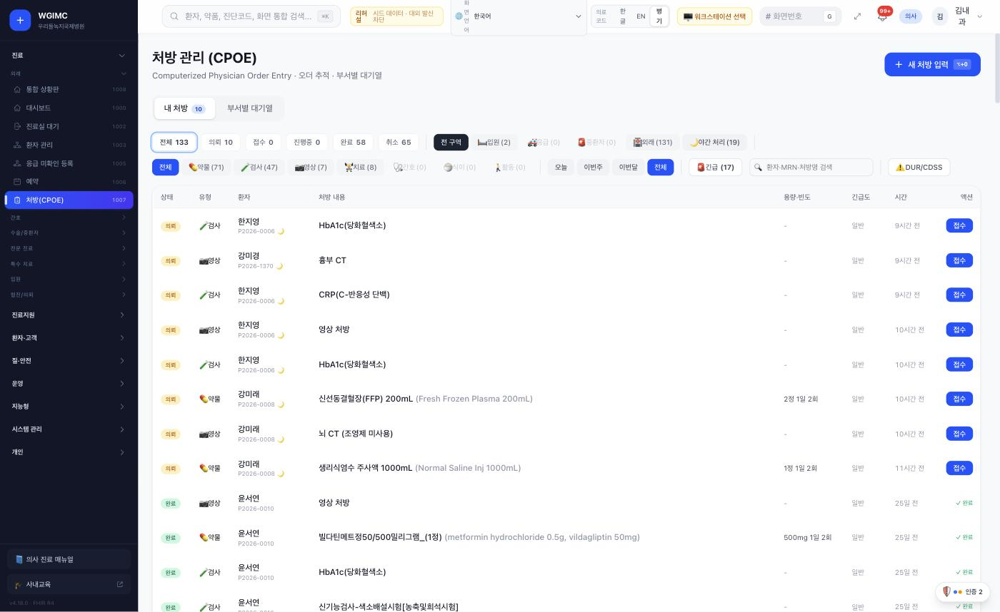

`내 처방` 과 `부서별 대기열` 로 나뉘고, **상태**(의뢰 · 접수 · 진행중 · 완료 · 취소) · **구역**(외래 · 입원 · 응급 · 중환자 · 야간 처리) · **종류**(약물 · 검사 · 영상 · 치료 · 간호 · 식이 · 활동)로 걸러 봅니다. 행마다 환자와 MRN · 처방 내용(성분명 병기) · 용량·빈도 · 긴급도 · 경과 시간 · 다음 작업 버튼이 붙습니다. 오른쪽 위 `새 처방 입력`, 그리고 **`DUR/CDSS`** 가 약물 상호작용·금기 점검으로 가는 자리입니다.

> AI 가 보조하는 자리 — 진료 기록 초안 · 음성 기록 · DUR 점검 보조. **의료진이 승인해야 기록이 됩니다.** 화면에 `AI(WeRU.B)` 표기와 면책 문구가 함께 보입니다.

### 수술 · 중환자실 · 회진 — 입원 환자가 지나는 자리

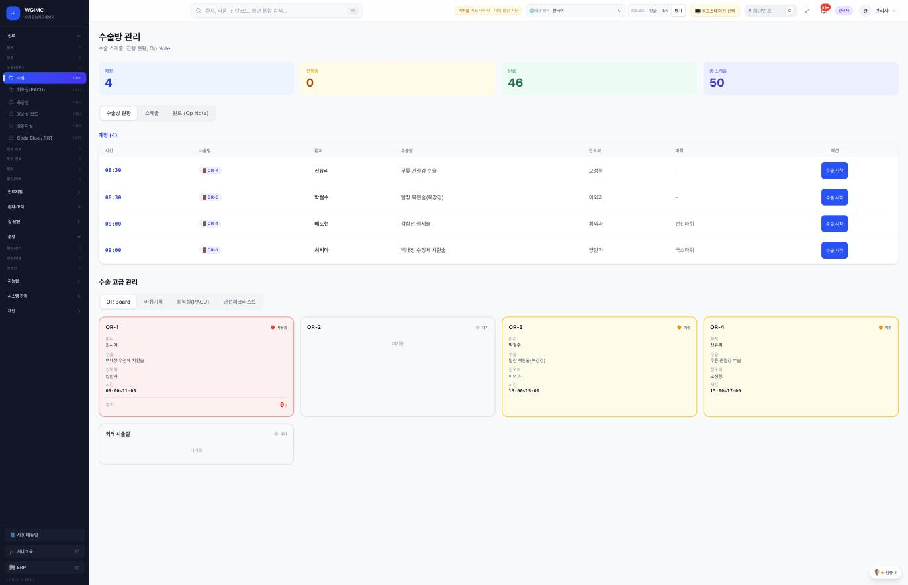

수술은 **스케줄 · 수술방 현황 · Op Note** 로 나뉩니다. 예정 목록에 시간 · 수술방 · 환자 · 수술명 · **집도의 · 마취 방식**이 서고, `수술 시작` 을 누르면 진행으로 넘어갑니다. 아래 **OR Board** 가 수술방마다 지금 누가 어떤 수술을 몇 시부터 하는지와 경과를 보여 줍니다. 옆 탭에 **마취기록 · 회복실(PACU) · 안전체크리스트**가 있습니다.

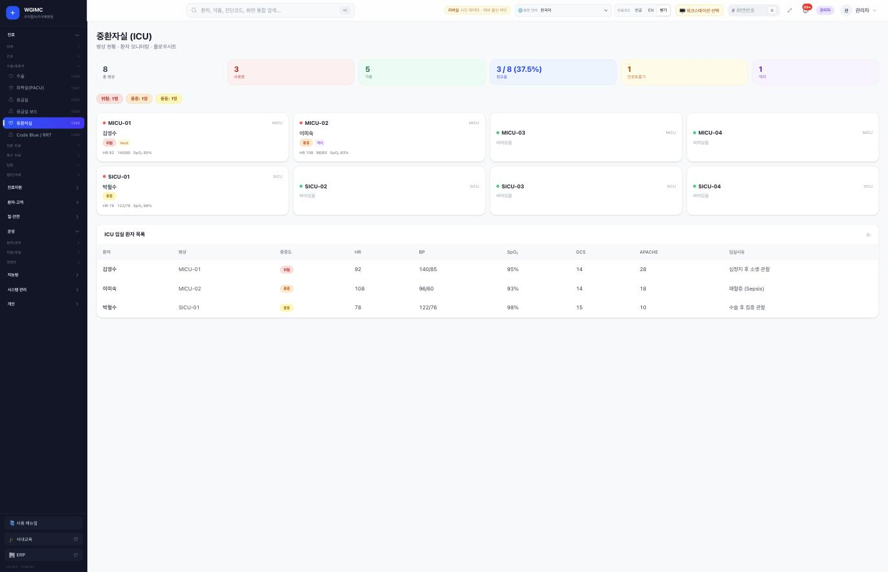

중환자실은 병상마다 카드가 있고, 환자 · 중증도 · **인공호흡기 · 격리 여부**와 활력징후(HR · BP · SpO₂)가 붙습니다. 아래 목록에는 **GCS**(의식 수준)와 **APACHE**(중증도 지수), 그리고 입실 사유가 함께 섭니다.

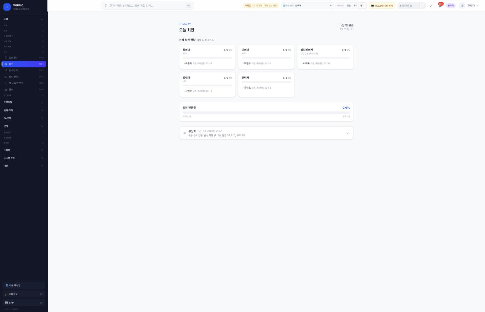

회진은 **의사별로** 오늘 돌 환자와 병실을 묶고 진행률을 셉니다. 환자 카드에는 입원 경위가 한 줄로 붙습니다(예: "응급 경유 입원 — 급성 복통(RLQ), 발열 38.5°C, 구토 2회").

### 신원을 모르는 환자를 받는 자리

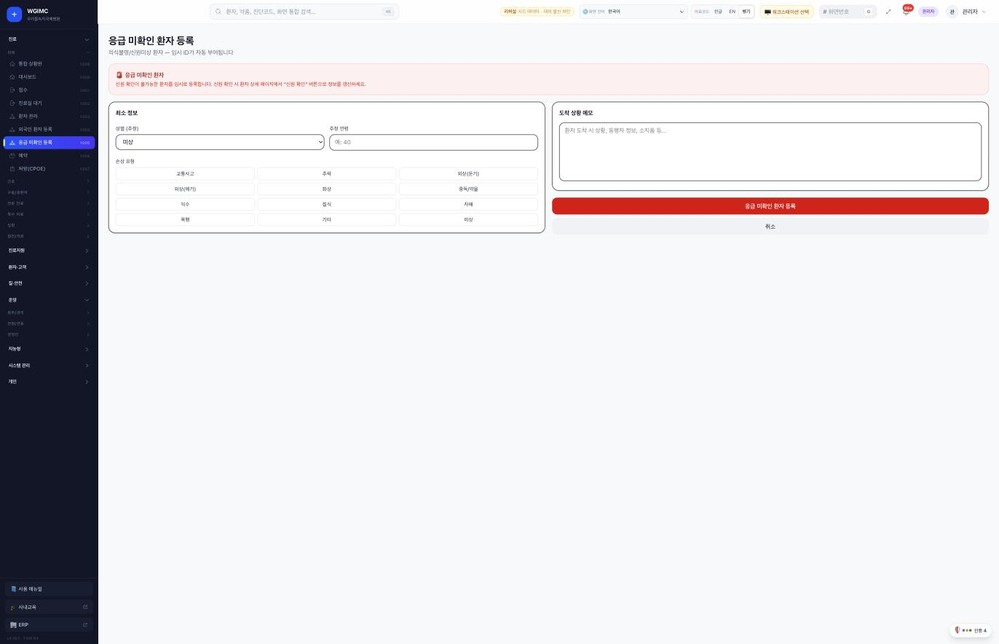

의식불명이거나 신원을 알 수 없는 환자가 오면, 이 화면이 **아는 것만 받습니다** — 추정 성별 · 추정 연령 · 손상 유형(교통사고 · 추락 · 외상 · 화상 · 중독/약물 · 익수 · 질식 · 자해 · 폭행 · 기타 · 미상) · 도착 상황 메모. 이름 칸도 주민등록번호 칸도 없습니다.

**임시 ID 가 자동으로 붙고**, 화면이 다음에 할 일을 적습니다 — "신원 확인 시 환자 상세 페이지에서 `신원 확인` 버튼으로 정보를 갱신하세요."

> **모르는 것을 빈칸으로 두거나 아무 값이나 넣지 않고, 「미상」이라는 값으로 받습니다** → [취지 1](../overview/02-principles.md). 응급 열람은 뒤에 사후 검토가 따라옵니다(응급 접근 사후 검토 — [`his-system-admin-break-glass.png`](../assets/screens/his-system-admin-break-glass.png)).

### 응급실 — 중증 우선으로 자리를 정한다

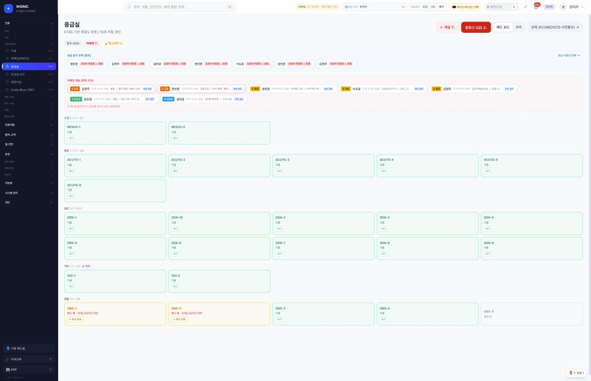

왼쪽 위에 **응급 접수 트랙**(원무가 처리할 것 — 예: `보호자 미등록`)이 서고, 그 아래 **미배정 재실 환자가 중증 우선으로** 줄을 섭니다. 환자마다 KTAS 등급 · 도착 경과 · 주증상 요약 · **권장 배정 구역**이 붙습니다.

아래는 구역별 베드판입니다 — 소생 2 · 중증 6 · 일반 10 · 격리 2 · 관찰 5. 빈 베드를 누르거나 **환자를 끌어다 놓아** 배정합니다. 청소 중이거나 정비 중인 베드는 그 상태와 **지연 시간**이 그대로 붙습니다(이 설치본에는 오래 묵은 청소 지연이 보입니다 — 시드 데이터의 상태를 감추지 않습니다).

### Code Blue · RRT — 호출하는 곳과 기록하는 곳을 나눈다

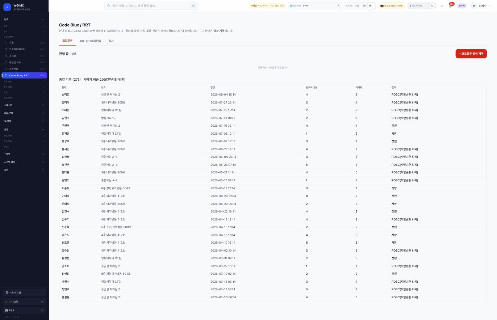

화면이 자기 역할을 먼저 못 박습니다 — **"호출·알림은 스태프콜(CODE)이 담당합니다. 이 화면은 경과 기록입니다."** 진행 중인 코드블루와 종결 기록이 나뉘고, 종결 기록에는 환자 · 장소 · 발견 시각 · **팀 도착(분)** · **제세동 횟수** · 결과(자발순환 회복 · 전원 · 사망)가 남습니다. 소생 질을 되짚을 수 있는 항목들입니다.

조회 범위도 밝힙니다 — "**서버가 최근 200건까지만 반환**".

### 응급실 보드 — 과밀도를 숫자로

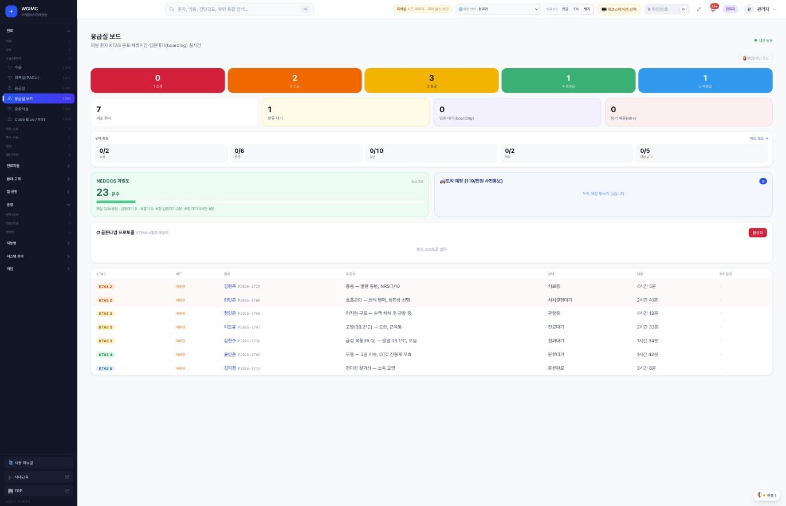

재실 환자를 **KTAS 5단계**(소생 · 긴급 · 응급 · 준응급 · 비응급)로 나눠 세고, 구역(소생 · 중증 · 일반 · 격리 · 관찰) 점유와 입원 대기(boarding) · 장기 체류를 함께 봅니다. **NEDOCS 과밀도**를 등급과 함께 내고 그 계산 근거(재실/병상 · 입원대기 · 호흡기 · 최장 대기)를 옆에 적습니다.

- 🚑 **도착 예정(119 · 전원 사전통보)** 자리가 따로 있습니다. 이 설치본은 "도착 예정 통보가 없습니다" — 119 사전통보 개통은 [Go-Live 점검 항목](../checklist/go-live.md)입니다.
- ⏱ **골든타임 프로토콜**(STEMI · 뇌졸중)을 활성화하는 자리가 보드 안에 있습니다.
- 환자 행에는 KTAS 배지 · 주증상(발한 동반 · NRS 7/10 처럼 구체적으로) · 상태 · **체류 시간**이 붙습니다.
- 오른쪽 위에 **MCI/재난 모드** 전환이 있습니다.

---

### 비어 있는 칸이 하는 말 — 대시보드 · 예약 · 급식

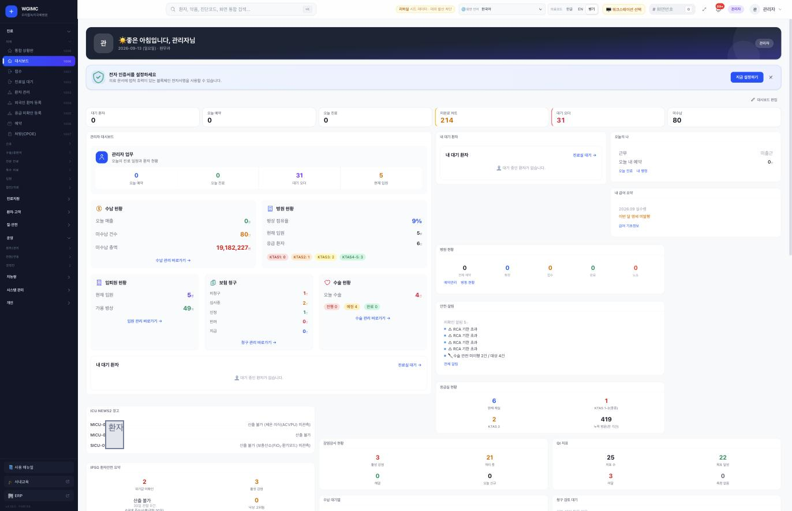

직원 첫 화면의 **ICU NEWS2 경고** 칸은 병상마다 점수 대신 **`산출 불가`** 와 까닭을 적습니다 — "체온 · 의식(ACVPU) 미기록", "보충산소(FiO₂ · 환기모드) 미기록". 입력이 빠진 점수를 0점(정상)으로 계산하지 않습니다 → [취지 3](../overview/02-principles.md#3-모르는-것을-아는-척하지-않는다)

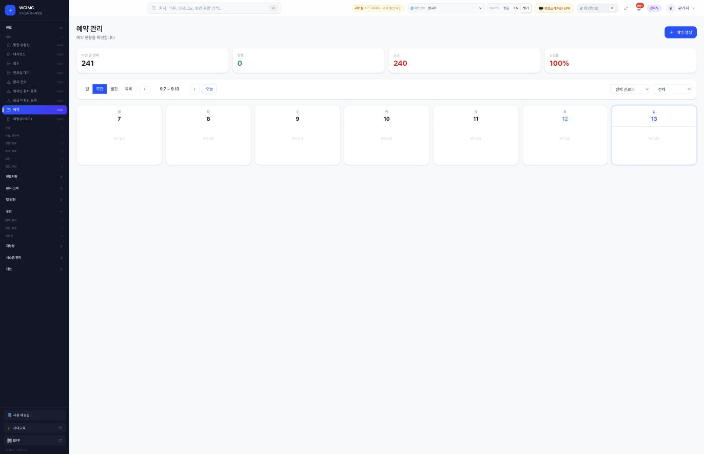

예약 화면은 이번 달 241건 중 완료 0 · **노쇼 240 · 노쇼율 100%** 를 그대로 띄웁니다. 리허설 설치본이라 지난 예약에 도착 기록이 없기 때문이고, 화면은 그 숫자를 보기 좋게 고치지 않습니다. 개원 전에 시드 예약을 정리하는 일은 [Go-Live 체크리스트](../checklist/go-live.md)가 맡습니다.

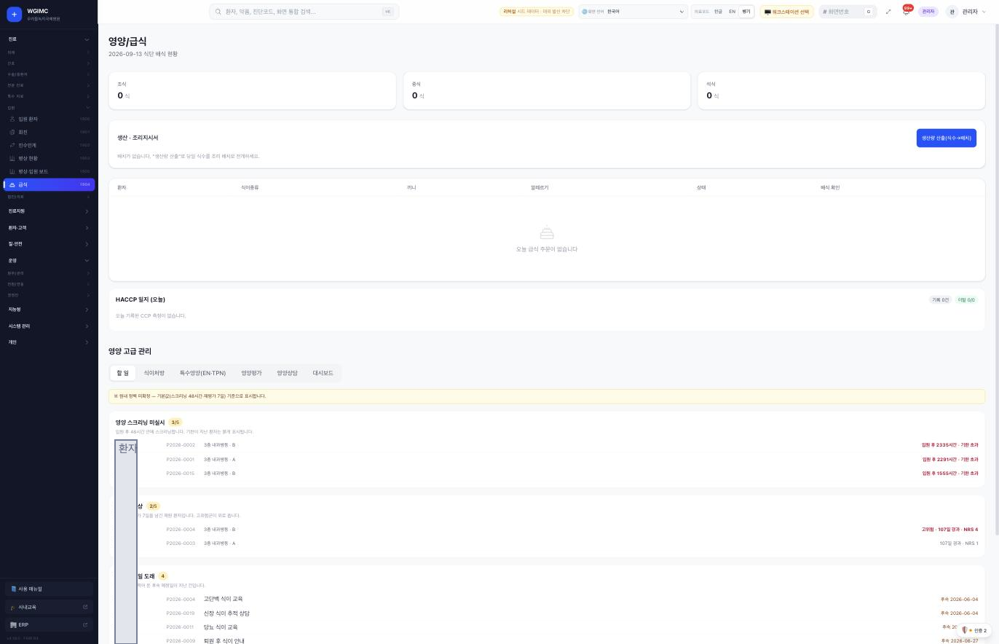

영양 고급 관리의 할 일 목록 위에 노란 줄 하나가 있습니다 — **"원내 정책 미확정 — 기본값(스크리닝 48시간 · 재평가 7일) 기준으로 표시합니다."** 기한 초과 표시가 **기관이 정한 기준이 아니라 코드 기본값에서 나왔다**는 것을 먼저 밝힙니다 → [취지 5](../overview/02-principles.md#5-사람이-정할-것은-화면에서)

---

## 진료지원 — `support`

약국·검사·영상·의무기록·워크스테이션 등 진료 지원. 화면이 **62개로 가장 많은 축**이고, 부서마다 일하는 자리가 따로 있습니다.

| 묶음 | 화면 | 하는 일 |
|---|---:|---|
| **진료 지원** | 14 | `약국` · `검사실` · `영상실` · `병리과` · `혈액은행` · `기초검사` 와 각 보드, `화상진료` · `비대면진료` · `만성질환 관리` · `임상 도구(점수·계산)` · `PACS 주치의 포털` |
| **워크스테이션** | 28 | 부서·역할별로 "그 자리에서 할 일만" 모아 둔 화면입니다 — 접수 · 간호(입원/외래) · 검사실 · 영상실 · 판독 대기 · 약국 · 수술 준비 · 수술 후 회복 · 중환자실 · 주치의 · 응급실 · 혈액은행 · 영양 · 장비 · 중앙공급 · 감염관리 · 재활 · 동의서 · 서류 발급 · 진단서 발급 · 입원 · 퇴원 |
| **클리닉 센터** | 17 | 건강검진센터 한 벌 — `검진 접수` · `검진 대기` · `검사실 허브` · `동선 현황판` · `동선 모니터(QR)` · `대기 디스플레이` · `검진 스테이션` · 문진표 · 프로그램 · 프로토콜 · `소견 대기` · 단체 검진 · `추적 관리` · 검진 통계 |
| **의무기록** | 3 | `동의서` · `기록 검색` · `사본 발급` |

**캡처 자리**

| # | 담을 화면 | 화면 경로 | 파일 |
|---|---|---|---|
| ✅ sup-1 | 약국 조제 — 접수 → 조제 → 검수 → 불출 | `/pharmacy` | [`his-support-pharmacy.png`](../assets/screens/his-support-pharmacy.png) |
| ✅ sup-2 | 검사실 — 검체와 진행 상태 | `/lab` 계열 | [`his-support-lab.png`](../assets/screens/his-support-lab.png) |
| ✅ sup-3 | 판독 대기열 · 일반촬영 워크스테이션 | `/workstation/reading` · `/workstation/imaging` | [`…-reading.png`](../assets/screens/his-support-workstation-reading.png) · [`…-imaging.png`](../assets/screens/his-support-workstation-imaging.png) |
| ✅ sup-4 | 워크스테이션 허브 — 부서별 전용 작업 화면 | `/workstation` | [`his-support-workstation.png`](../assets/screens/his-support-workstation.png) |
| ✅ sup-5 | 건강검진센터 — 단계별 현황과 바로가기 | `/his-checkup` | [`his-support-his-checkup.png`](../assets/screens/his-support-his-checkup.png) |
| ✅ sup-6 | 동의서 — 서명 요청과 완료 상태 | 의무기록 `동의서` | [`his-support-consent.png`](../assets/screens/his-support-consent.png) |
| ✅ sup-7 | 검진 — 프로그램 · 스테이션 · 동선 · 소견 · 추적 | `/his-checkup/*` | [`…-programs`](../assets/screens/his-support-his-checkup-programs.png) · [`…-station`](../assets/screens/his-support-his-checkup-station.png) · [`…-flow-board`](../assets/screens/his-support-his-checkup-flow-board.png) · [`…-review`](../assets/screens/his-support-his-checkup-review.png) · [`…-follow-ups`](../assets/screens/his-support-his-checkup-follow-ups.png) · [`…-schedule`](../assets/screens/his-support-his-checkup-schedule.png) |
| ✅ sup-8 | 혈액은행 — 재고 · 수혈 · MTP | `/blood-bank` | [`his-support-blood-bank.png`](../assets/screens/his-support-blood-bank.png) |

### 아직 연결되지 않은 워크스테이션은, 그렇다고 말한다

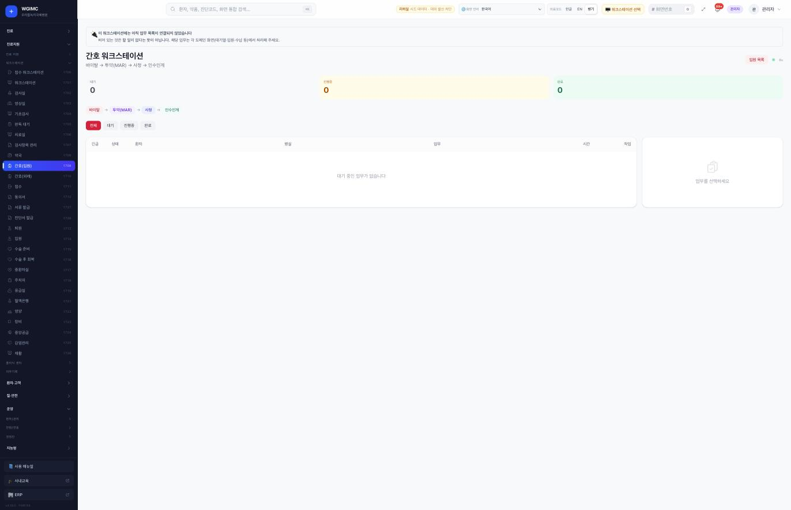

워크스테이션 28개가 모두 채워져 있는 것은 아닙니다. 간호(입원) 워크스테이션은 흐름(**바이탈 → 투약(MAR) → 사정 → 인수인계**)과 대기·진행중·완료 칸까지 서 있지만, 맨 위에 이렇게 적습니다.

> ⚠️ **이 워크스테이션은 아직 업무 목록이 연결되지 않았습니다.**
> **비어 있는 것은 할 일이 없다는 뜻이 아닙니다.** 해당 업무는 각 도메인 화면(대기열 · 입원 · 수납 등)에서 처리해 주세요.

**빈 화면을 「없음」으로 읽지 말라고 화면이 먼저 말합니다.** 그리고 그동안 어디서 일하면 되는지를 적어 둡니다 → [취지 1](../overview/02-principles.md) · [화면이 「모른다」고 말하는 아홉 가지 방식](../overview/02-principles.md#화면이-모른다고-말하는-아홉-가지-방식).

### 워크스테이션 28개 — 연결된 것, 연결되지 않은 것, 설정이 어긋난 것

워크스테이션을 전부 열어 보면 **세 부류**로 갈립니다. 화면이 스스로 어느 부류인지 말합니다.

**① 업무 목록이 연결된 워크스테이션** — [약국](../assets/screens/his-support-workstation-pharmacy.png)(접수 → 조제 → 검수 → 불출 · STAT/URGENT) · [응급실](../assets/screens/his-support-workstation-emergency.png)(처분 407 · 코드블루/레드/화이트) · [접수](../assets/screens/his-support-workstation-front-desk.png)(빠른 접수 · QR 스캔) · [서류 발급](../assets/screens/his-support-workstation-documents.png)(**의료법 §21** 을 부제에 · 발급완료 2 · 반려 1) · [주치의](../assets/screens/his-support-workstation-attending.png) · [물리치료](../assets/screens/his-support-workstation-therapy.png) · [영양](../assets/screens/his-support-workstation-nutrition.png) · [외래 간호](../assets/screens/his-support-workstation-outpatient-nursing.png) · [검사항목 템플릿](../assets/screens/his-support-workstation-templates.png).

**② 아직 연결되지 않았다고 말하는 워크스테이션** — 수술 준비 · 입원 · 접수 · 중앙공급 · 장비 · 감염관리 · 재활 · 혈액은행 · 중환자실 · 간호(입원) 이 모두 같은 띠를 겁니다: **"비어 있는 것은 할 일이 없다는 뜻이 아닙니다."** ([수술 준비](../assets/screens/his-support-workstation-surgery-prep.png) · [입원](../assets/screens/his-support-workstation-admission.png) · [중앙공급](../assets/screens/his-support-workstation-cssd.png) · [혈액은행](../assets/screens/his-support-workstation-blood-bank.png) · [감염관리](../assets/screens/his-support-workstation-infection-control.png))

**③ 설정이 어긋났다고 말하는 워크스테이션** — 가장 드문 부류입니다.

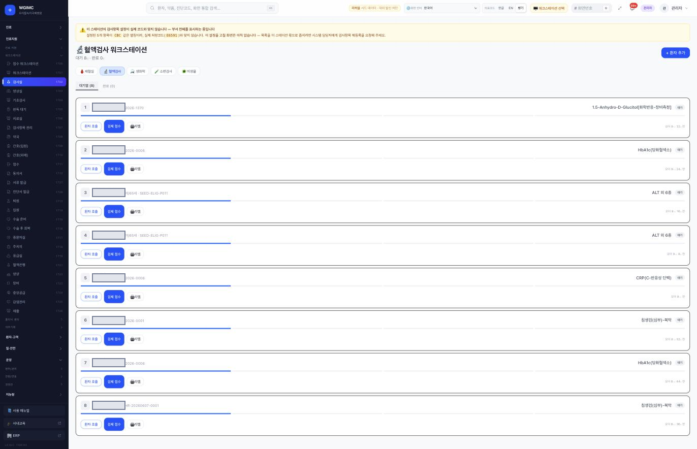

> **이 스테이션의 검사항목 설정이 실제 코드와 맞지 않습니다 — 부서 전체를 표시하는 중입니다.** 설정된 5개 항목이 `CBC` 같은 명칭이며, 실제 처방코드(`E6591`)와 맞지 않습니다. **이 설정을 고칠 화면은 아직 없습니다** — 목록을 이 스테이션 위주로 좁히려면 시스템 담당자에게 검사항목 재등록을 요청해 주세요.

설정이 틀렸을 때 **조용히 빈 목록을 보여 주지 않고, 더 넓게(부서 전체) 보여 주면서 그 사실을 알립니다.** 그리고 고칠 화면이 없다는 것까지 말합니다. [기초검사](../assets/screens/his-support-workstation-diagnostic.png)도 같은 모양입니다 — "담당 자리가 지정되지 않은 검사 종류 7종 … **어느 자리의 대기 목록에도 뜨지 않습니다**", 그리고 목표 소요시간 미설정이라 **지연 판정 불가**.

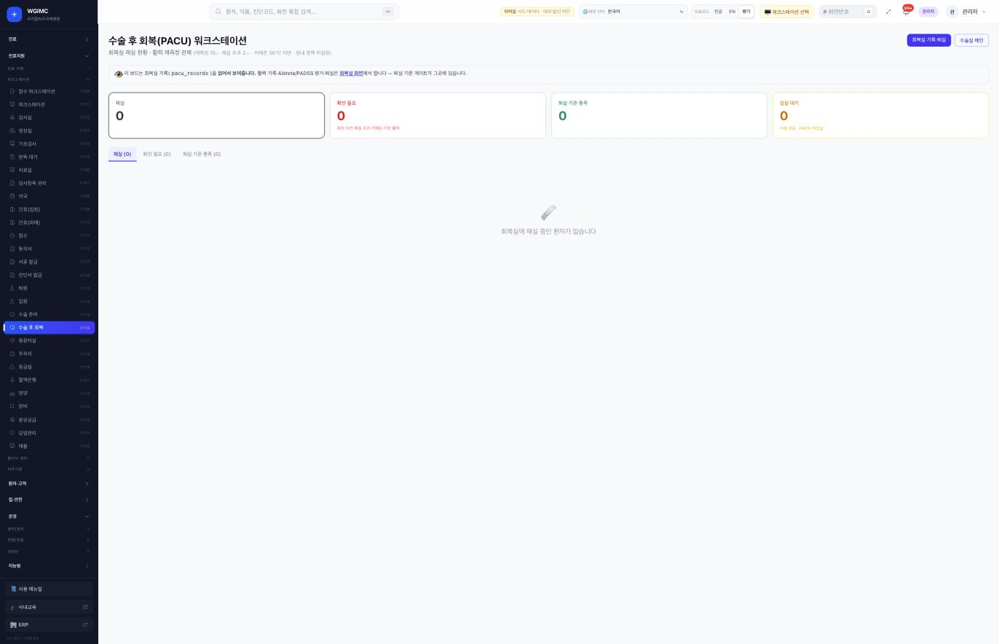

회복실 워크스테이션은 기준값(재측정 15분 · 재실 초과 2시간 · 저체온 36°C 미만)을 부제에 적으면서 **"(원내 정책 미설정)"** 을 붙입니다 — 기본값으로 돌고 있다는 뜻입니다. 그리고 "이 보드는 회복실 기록을 **읽어서** 보여 줍니다 … 퇴실은 회복실 화면에서"라고 **어디가 쓰는 곳인지** 밝힙니다.

### 진료 지원 — 보드와 포털

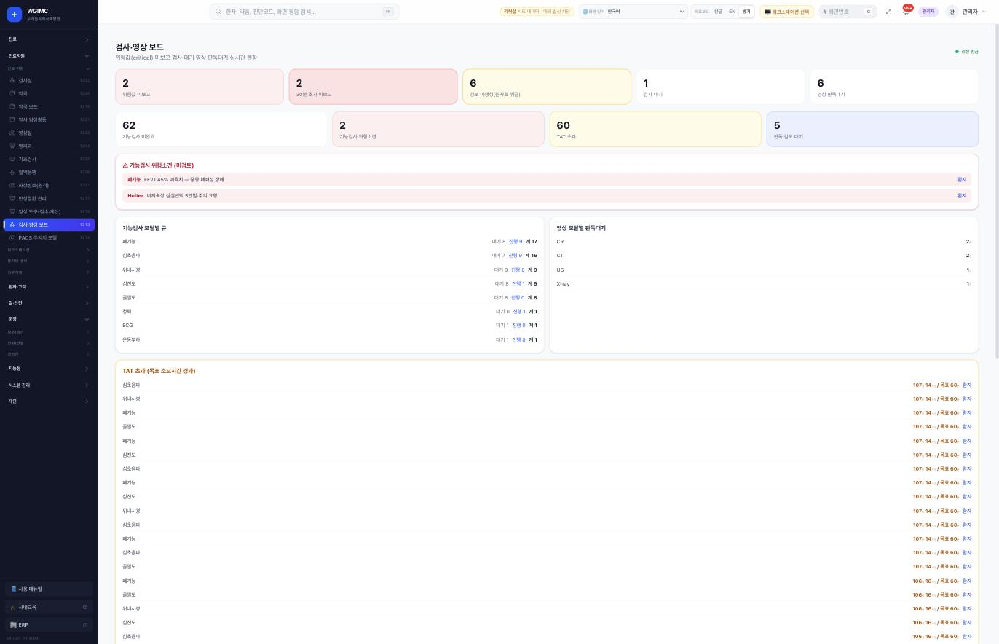

검사·영상 보드는 위험값 미보고 2건 옆에 **"30분 초과 미보고 2"** 를 따로 세고, **"경보 미생성(원자료 위급) 6"** — 원자료는 위급인데 경보가 만들어지지 않은 건을 별도 칸으로 둡니다. TAT 초과 60건은 **경과 시간 / 목표** 로 적습니다.

[비대면 진료](../assets/screens/his-support-remote-consult.png)는 SLA 준수와 평균 응답을 **「산출 불가 — 이번 달 답변 없음」** 으로, [PACS 주치의 포털](../assets/screens/his-support-pacs-portal.png)은 "**이 화면은 HIS 계정으로 로그인되지 않습니다** — 계정이 없다면 HIS 영상실이나 환자 차트에서 같은 영상을 볼 수 있습니다"라고 대체 경로를 적습니다. [임상 도구](../assets/screens/his-support-clinical-tools.png)는 89개 점수표 · 계산식 위에 "**모든 산출은 보조도구이며 최종 임상판단은 의사에게 귀속**"을 겁니다.

그 밖에 [검사실](../assets/screens/his-support-lab.png)(9탭) · [영상실](../assets/screens/his-support-imaging.png)(PACS ON · 촬영 대기 8 · 판독 대기 4) · [병리과](../assets/screens/his-support-pathology.png) · [기초검사](../assets/screens/his-support-diagnostics.png)(담당 `미배정` 을 주황으로) · [원격진료](../assets/screens/his-support-telehealth.png) · [만성질환](../assets/screens/his-support-chronic.png)(조절 불량 26 / 62) · [약국 보드](../assets/screens/his-support-pharmacy-board.png) · [약사 임상활동](../assets/screens/his-support-pharmacist-activity.png).

### 워크스테이션 — 그 자리에서 할 일만

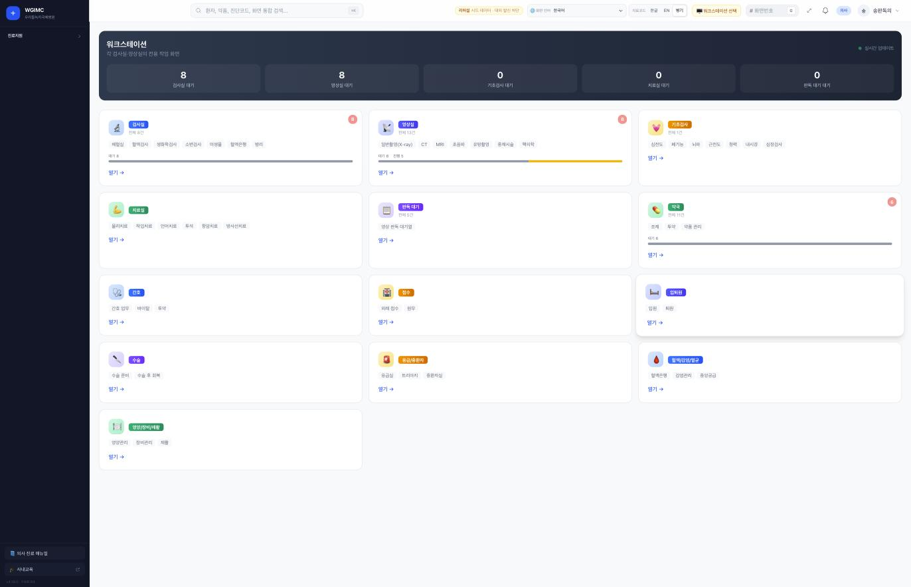

부서·역할마다 **그 자리에서 할 일만** 모아 둔 화면이 28개 있고, 이 허브가 그 입구입니다. 위에 검사실 · 영상실 · 기초검사 · 치료실 · 판독의 대기 수가 서고, 아래 카드마다 그 부서의 세부 작업이 붙습니다(예: 영상실 = 일반촬영 · CT · MRI · 초음파 · 유방촬영 · 중재시술 · 핵의학).

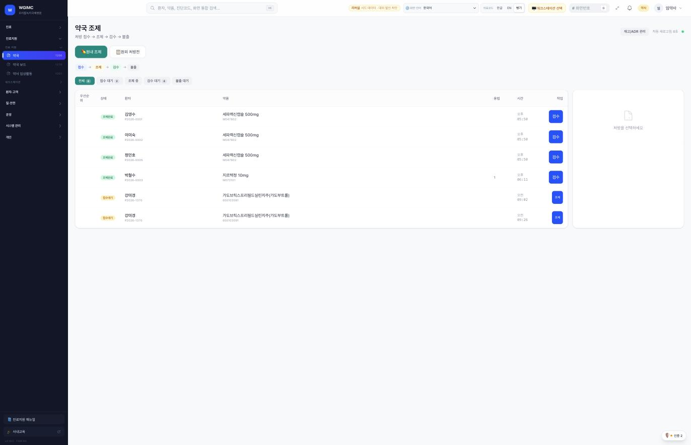

약국은 **접수 → 조제 → 검수 → 불출** 네 단계로 움직입니다. 단계마다 대기 수가 있고, 행에서 바로 다음 단계로 넘깁니다. 성분명과 약품 코드가 함께 보이고, 오른쪽 위에 재고·부작용(ADR) 관리가 있습니다.

> 이 화면은 **약사 계정**으로 찍었습니다. 의사 계정으로 열면 같은 화면이 **비어 보입니다** — 대기열이 그 역할의 것만 차기 때문입니다.

### 건강검진센터 — 사람이 흐르는 하루를 화면이 따라간다

검진은 **한 사람이 여러 방을 도는 일**이라, 화면도 그 흐름을 따라 17개로 나뉩니다. 캡처한 날이 토요일이라 **수검자가 0명**이었고, 그래서 오히려 **아무도 없을 때 화면이 무엇을 말하는지**가 잘 보입니다.

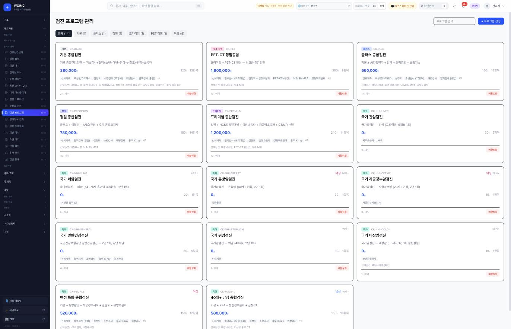

먼저 **파는 것이 정의되어 있어야** 예약을 받습니다. 프로그램 14개가 등급별로(기본 · 플러스 · 정밀 · 프리미엄 · PET 정밀 · 특화 9) 있고, 카드마다 **가격 · 소요시간 · 항목 수 · 포함 검사 태그 · 선택옵션**이 붙습니다. 🔴 **국가암검진 6종은 가격이 `0원`** 입니다 — 공단이 부담하는 검진이라 기관이 환자에게 받지 않습니다. 0 이 "값을 안 정했다"가 아니라 **정말 0** 인 자리입니다.

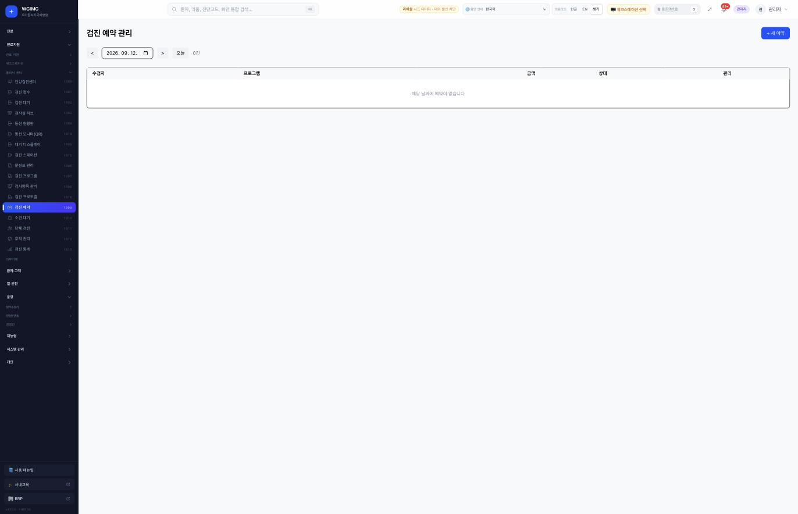

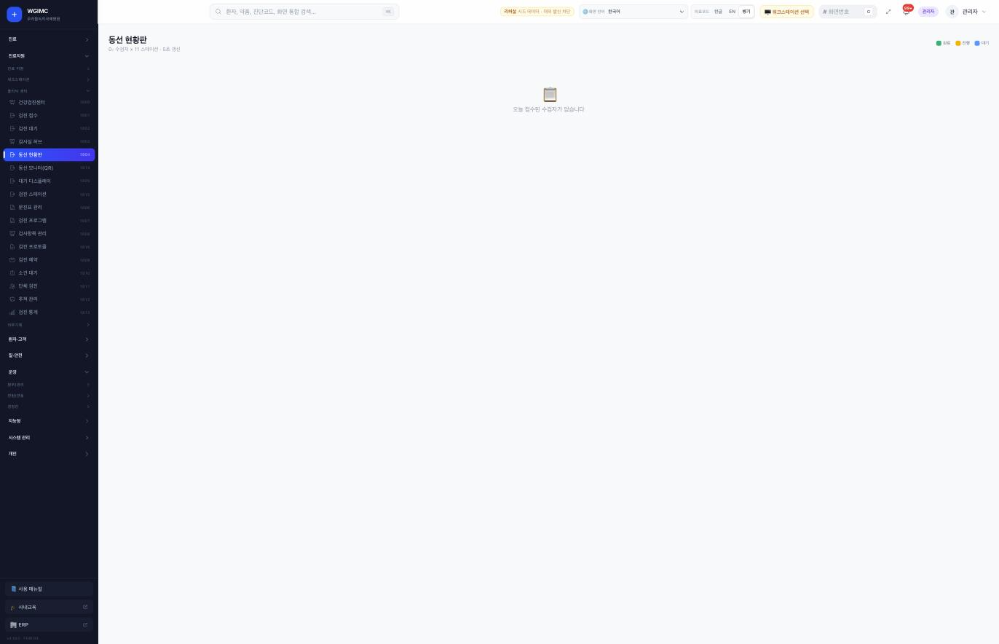

예약 화면과 동선 현황판은 **빈 화면을 빈 채로 보여 줍니다.** 동선 현황판은 머리에 **「0 수검자 × 11 스테이션 · 5초 갱신」** 이라고 적어, **화면이 멈춘 것이 아니라 올 사람이 없는 것**임을 구분해 줍니다.

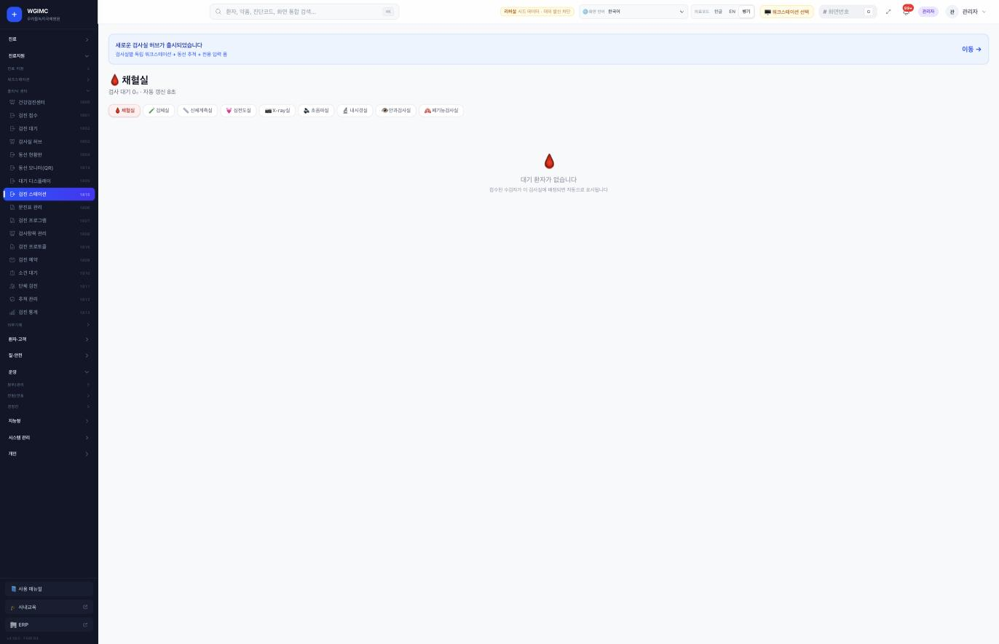

스테이션은 **방마다 화면이 따로**입니다 — 채혈실 · 검체실 · 신체계측실 · 심전도실 · X-ray실 · 초음파실 · 내시경실 · 안과검사실 · 폐기능검사실. 8초마다 저절로 갱신되고, "접수한 수검자가 이 검사실에 배정되면 자동으로 표시됩니다"라고 **왜 비어 있는지**를 적습니다.

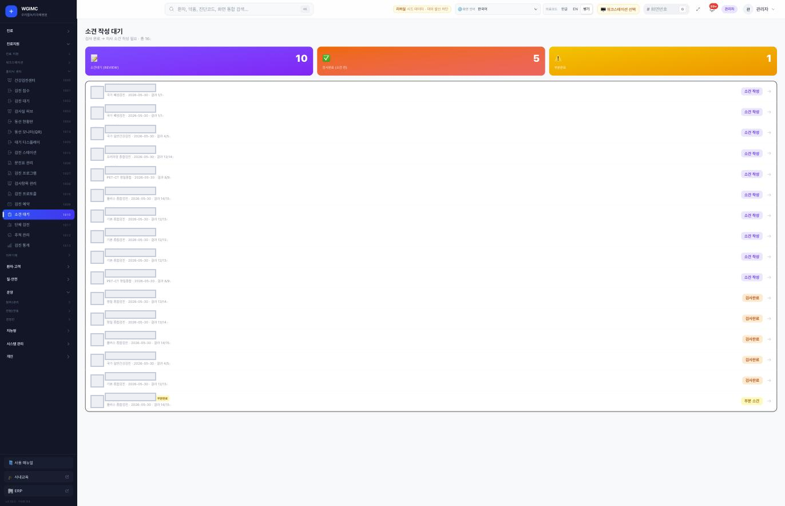

검사가 끝나면 **의사가 소견을 씁니다.** 총 16건이 **소견대기 10 · 검사완료 5 · 부분완료 1** 로 갈리고, 행마다 **결과 진행이 분모와 함께**(`1/1` · `4/5` · `13/14`) 붙습니다 — 14개 중 13개만 나온 검진을 "완료"로 올리지 않습니다 → [취지 5](../overview/02-principles.md).

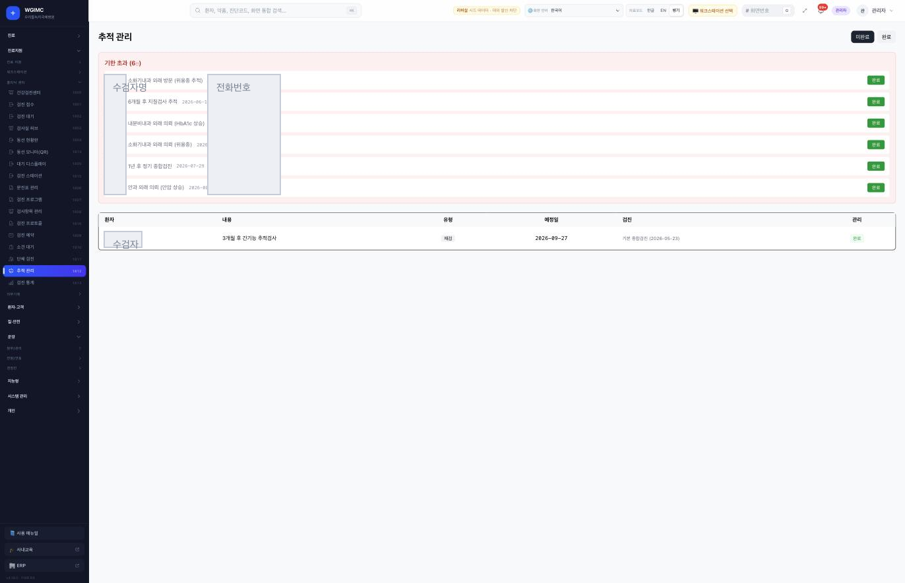

검진은 결과를 주고 끝나는 일이 아닙니다. 추적 관리는 **기한이 지난 6건을 맨 위로 끌어올리고**, 추적 사유(위용종 추적 · HbA1c 상승 · 안압 상승)와 **어느 검진 회차에서 나온 것인지**를 함께 적습니다. → [시나리오 03](../scenarios/03-health-checkup.md)

> 🔴 수검자 이름과 연락처는 공개 자료에서 가렸습니다.

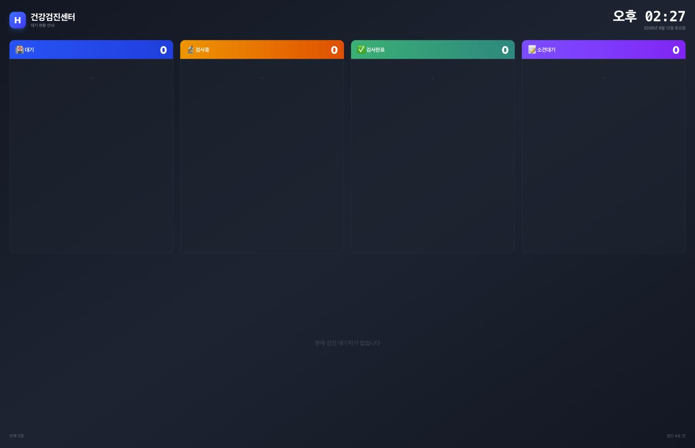

대기실에 거는 화면은 따로 있습니다(어두운 바탕 · 큰 글씨 · 4초 갱신). 대기 · 검사중 · 검사완료 · **소견대기** 네 칸으로 나뉘어, 수검자가 **자기가 지금 어느 단계인지** 볼 수 있습니다. 이 날은 네 칸 모두 0 이라 「현재 검진 대기자가 없습니다」가 떠 있습니다.

### 혈액은행 — 재고가 0 이어도 구조는 보인다

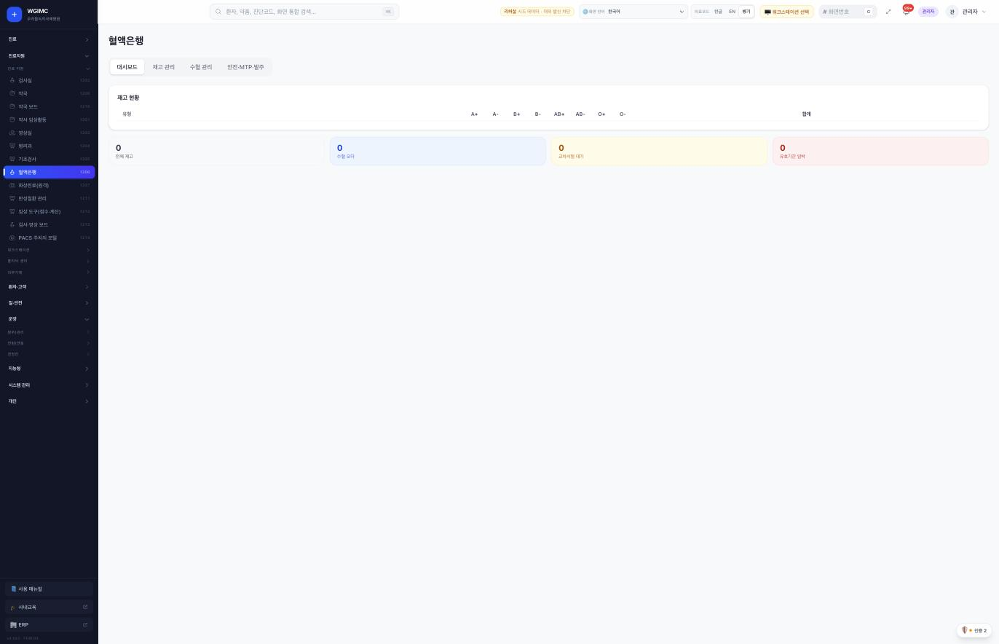

혈액형 **8종(A± · B± · AB± · O±)** 재고 표와 네 묶음(대시보드 · 재고 관리 · **수혈 관리** · 안전·MTP·발주)이 있습니다. 이 설치본은 **전체 재고 0 · 수혈 오더 0 · 교차시험 대기 0 · 유효기간 임박 0** 입니다. 출고 전 동의 확인 장면은 재고가 있어야 찍을 수 있습니다 → [시나리오 02](../scenarios/02-emergency.md).

### 동의서 · 진단서 · 퇴원 — 문서가 나가는 자리

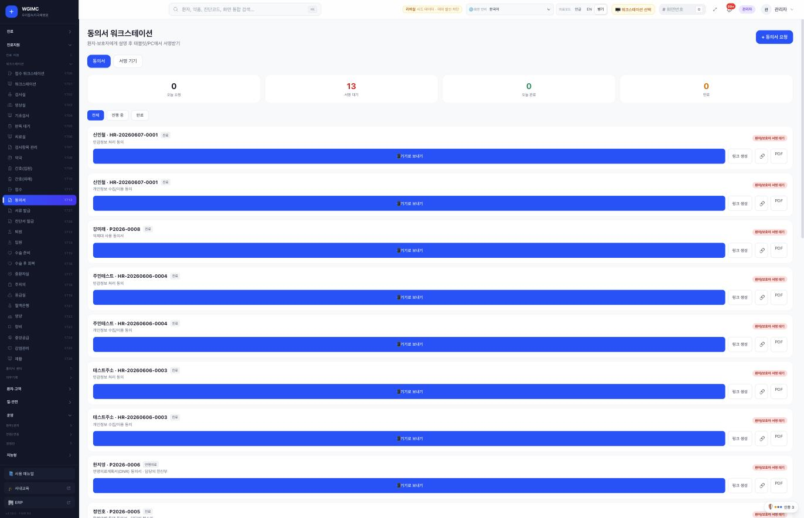

**"환자 · 보호자에게 설명한 뒤 태블릿/PC 에서 서명받기"** 가 이 화면의 일입니다. 서명 대기가 환자와 동의서 종류별로 서고, 건마다 **`기기로 보내기`**(옆에 둔 태블릿으로) · **링크 생성**(환자 기기로) · **PDF** 를 고릅니다. 동의서 종류에는 민감정보 처리 · 개인정보 수집·이용 · 약제 사용 같은 것과 함께 **연명의료계획서(DNR)** 가 담당의와 함께 따로 있습니다. 서명 자체는 [sign](sign.md) 이 합니다.

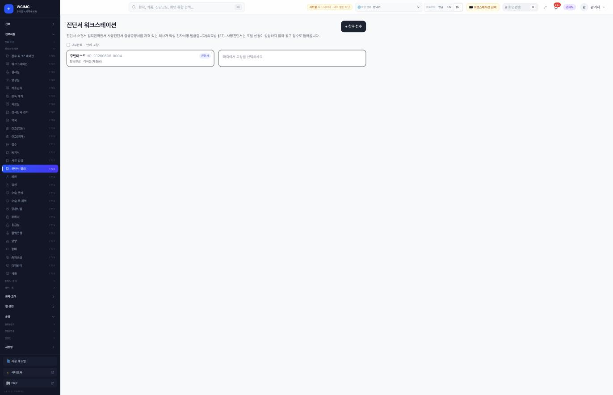

진단서 · 소견서 · 입퇴원확인서 · 사망진단서 · 출생증명서를 발급합니다. 머리글이 **법적 근거와 업무 규칙의 이유**를 함께 적습니다.

> **자격 있는 의사가 작성 · 전자서명 발급합니다(의료법 §17).** 사망진단서는 포털 신청이 성립하지 않아 **창구 접수로 들어옵니다.**

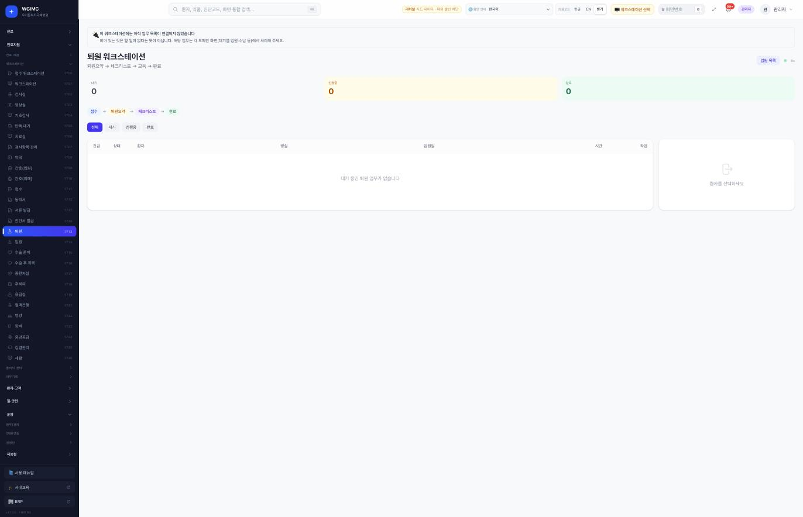

퇴원 워크스테이션은 **비어 있습니다.** 그런데 비어 있는 채로 두지 않고 그 이유를 적습니다.

> 🔧 이 워크스테이션은 **아직 업무 목록이 연결되지 않았습니다.** **비어 있는 것은 할 일이 없다는 뜻이 아닙니다.** 해당 업무는 각 도메인 화면(대기열 · 입원 · 수납 등)에서 처리해 주세요.

**아직 안 만든 것을 "없음"으로 보이게 두지 않고, 지금은 어디서 하는지까지** 알려 줍니다 → [취지 3](../overview/02-principles.md#3-모르는-것을-아는-척하지-않는다)

### 의무기록 — 동의서와 사본이 나가는 자리

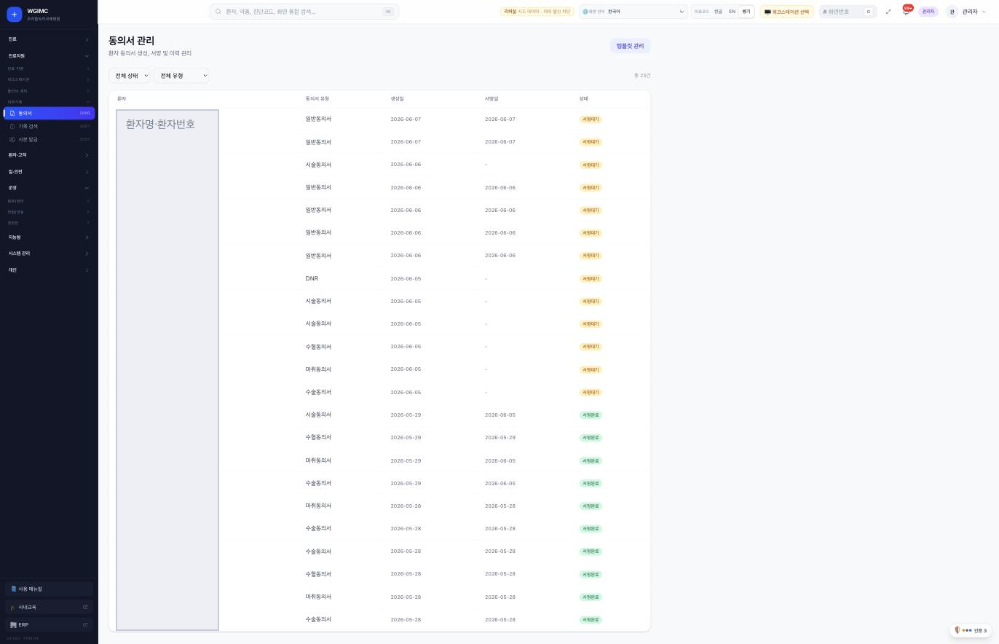

동의서는 **유형별로 관리**합니다 — 일반 · 시술 · 수술 · 마취 · 수혈 · **DNR**. 행마다 **생성일과 서명일이 따로** 있고, 서명일이 `-` 인 것이 `서명대기` 입니다. 만든 것과 받은 것을 한 칸으로 뭉치지 않습니다. 서명은 [sign](sign.md) 이 맡습니다([S4](../build-guide/S4-trust.md)).

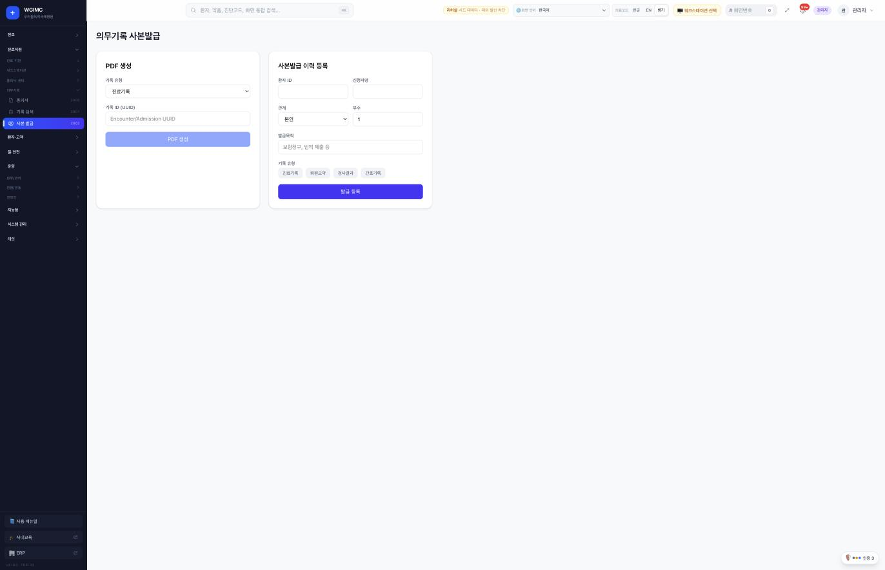

사본 발급은 **PDF 를 만드는 일과 발급 이력을 남기는 일이 나란히** 있습니다. 이력에는 **신청자 · 환자와의 관계 · 부수 · 발급목적**(보험청구 · 법적 제출 등)과 어떤 기록을 줬는지(진료기록 · 퇴원요약 · 검사결과 · 간호기록)를 적습니다. **누가 왜 가져갔는지가 남습니다.**

> 👤 환자명·환자번호 열은 공개 자료에서 가렸습니다.

### 판독 대기 — 안 되는 것을 안 된다고 적는 자리

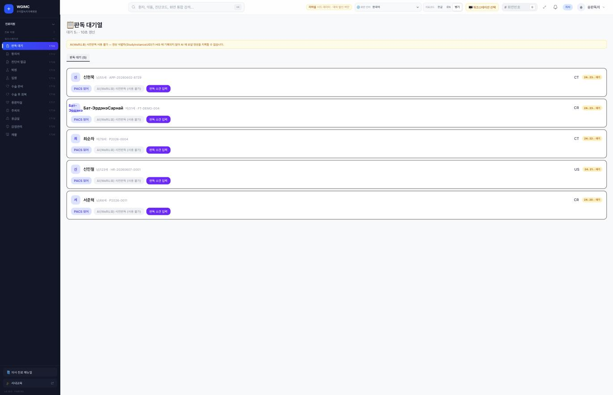

판독을 기다리는 검사가 환자 · 모달리티(CT · CR · US) · 경과 시간과 함께 서고, 행마다 `PACS 뷰어` · `AI(WeRU.B) 사전판독` · `판독 소견 입력` 이 붙습니다. 그런데 가운데 버튼은 **회색이고 `(사용 불가)`** 입니다. 화면이 그 이유를 맨 위에 적습니다.

> **AI(WeRU.B) 사전판독 사용 불가 — 영상 식별자(StudyInstanceUID)가 HIS 에 기록되지 않아 AI 에 보낼 영상을 지목할 수 없습니다.**

[HIS 구성서 §10](../systems/his.md#10-한계와-대체-수단)이 적은 「영상 AI 사전판독은 사용 불가」의 실물이고, **왜 안 되는지까지** 화면이 밝힙니다. 판독은 [PACS](pacs.md) 의 판독 흐름으로 합니다.

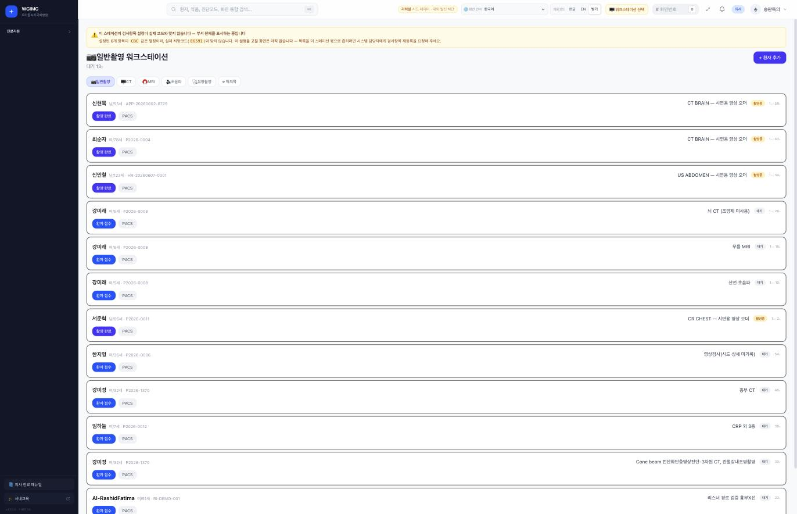

같은 원칙이 설정에도 적용됩니다. 이 스테이션은 자기 설정이 틀렸다는 것을 스스로 알립니다.

> ⚠️ **이 스테이션의 검사항목 설정이 실제 코드와 맞지 않습니다 — 부서 전체를 표시하는 중입니다.** 설정된 6개 항목이 `CBC` 같은 명칭이라 실제 처방코드와 맞지 않습니다. **이 설정을 고칠 화면은 아직 없습니다** — 목록을 이 스테이션 몫으로 좁히려면 시스템 담당자에게 검사항목 재등록을 요청해 주세요.

**틀린 설정으로 걸러 놓고 "이게 전부"라고 하지 않고**, 부서 전체를 보여 주면서 그 사실과 조치 방법, 그리고 **고칠 화면이 아직 없다는 것까지** 적습니다 → [취지 2](../overview/02-principles.md#2-출처를-말한다) · [취지 3](../overview/02-principles.md#3-모르는-것을-아는-척하지-않는다)

---

## 환자·고객 — `patient`

CRM·예약·병원 안내 등 환자/고객 관리. **병원이 환자에게 먼저 말을 거는 자리**입니다.

| 묶음 | 화면 | 하는 일 |
|---|---:|---|
| **CRM** | 11 | `CRM 대시보드` · `검진 대상자` · `검진 실적` · `해외환자 케이스` · `해외환자 실적` · 캠페인 · 템플릿 · 세그먼트 · `CRM 상담` · `CRM 분석` · 자동화 |
| **병원 안내** | 6 | 진료과 안내 · 의료진 소개 · 시설 안내 · 병원 소식 · 건강정보 · 채용 안내 — 공개 홈페이지에 나가는 내용을 여기서 관리합니다 |

> 🔴 **대외 발신은 세 조건** — 환자에게 나가는 알림은 **구현 + 설정(기본 꺼짐) + 승인**이 모두 갖춰져야 나갑니다. 캠페인·자동화를 켜기 전에 적법 근거(`legal.patientPush.consentScope`)와 원내 결정(`policy.patientPush.enable`)이 [결정 등록부](../checklist/decisions.md)에 기록돼야 합니다.

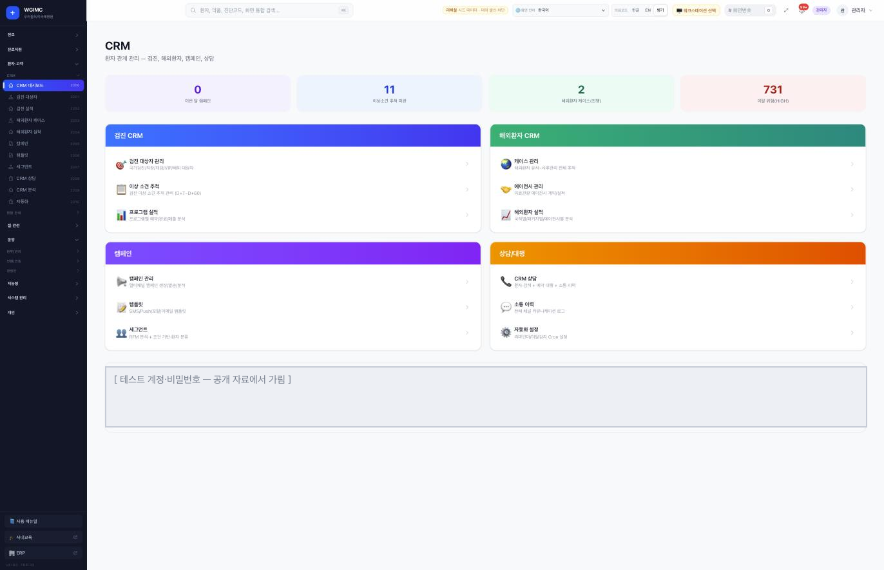

CRM 은 네 축으로 나뉩니다 — **검진 CRM**(대상자 관리 · 이상 소견 추적 · 프로그램 실적) · **해외환자 CRM**(케이스 · 에이전시 · 실적) · **캠페인**(관리 · 템플릿 · **RFM 세그먼트**) · **상담/대행**(CRM 상담 · 소통 이력 · 자동화). 위에 이번 달 캠페인 · 이상 소견 추적 미완 · 해외환자 진행 케이스 · **이탈 위험(HIGH)** 수가 섭니다.

> 아래쪽 회색 자리는 **테스트 계정과 비밀번호가 화면에 표시되는 블록**이라 공개 자료에서 가렸습니다.

### 어느 값이 정본이고 어느 값이 예시인가

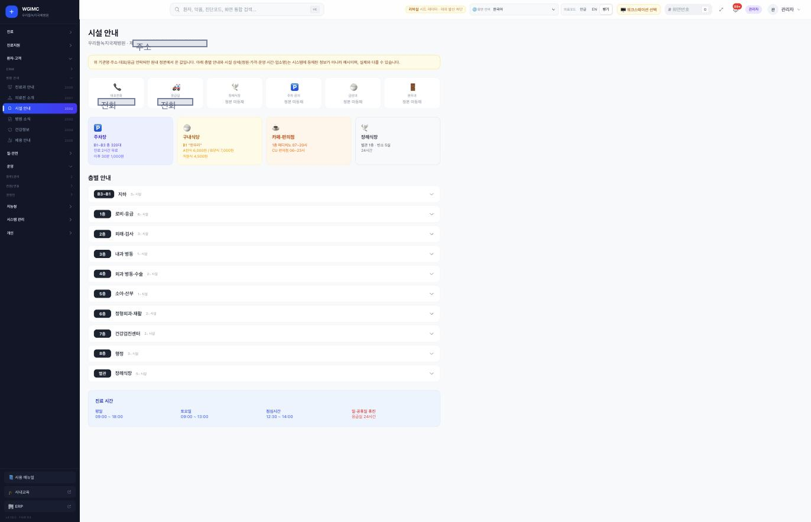

시설 안내 화면은 맨 위에 **어느 칸이 원내 정본에서 온 값이고 어느 칸이 예시인지**를 나눠 적습니다. 기관명 · 주소 · 대표/응급 연락처는 정본에서 오고, 아래 층별 안내와 시설 상세는 **시스템에 등재된 정보가 아니라 예시이며 실제와 다를 수 있다**고 밝힙니다. 이 내용이 홈페이지로 나가기 전에 무엇을 채워야 하는지가 화면에 드러납니다 → [취지 2](../overview/02-principles.md#2-출처를-말한다)

> 🔴 주소 · 전화 · 채용 연락처 · 의료진 이름은 공개 자료에서 가렸습니다(기관 식별 정보).

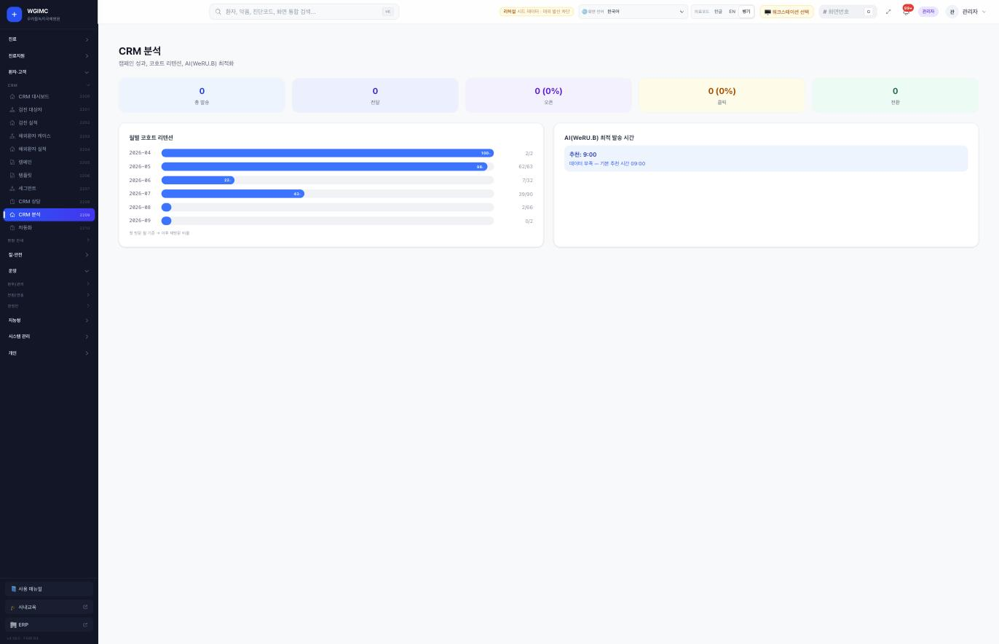

CRM 분석의 **AI(WeRU.B) 최적 발송 시간** 칸은 "추천: 9:00" 아래에 **"데이터 부족 — 기본 추천 시간 09:00"** 이라고 적습니다. 발송 실적이 0 인 상태에서 나온 추천이 **학습 결과가 아니라 기본값**이라는 뜻입니다. 코호트 리텐션 막대도 월마다 **분자/분모**(2/2 · 62/63 · 7/32 …)를 함께 적습니다 → [취지 5 「분모를 함께」](../overview/02-principles.md)

**캡처 자리** — 검진 대상자 · 캠페인 · 세그먼트 · 자동화 · 해외환자 실적 등 CRM 나머지 10장은 [캡처 목록](../assets/screens/INDEX.md)에 있습니다.

### 병원 안내 — 환자가 보는 쪽

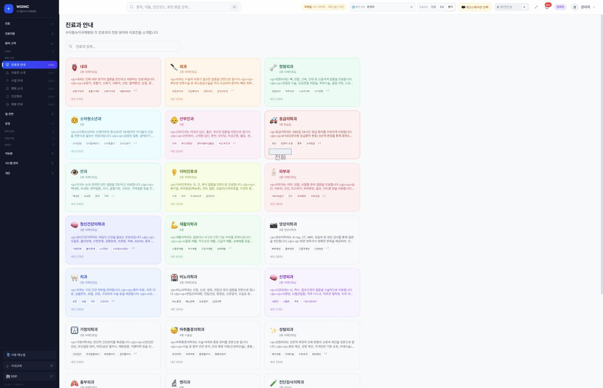

직원 화면 안에 **환자가 보는 안내 페이지의 원본**이 함께 있습니다. 진료과마다 카드가 있고, 소속 의료진 수 · 위치 · **전문 분야 태그** · 내선이 붙습니다. 이 내용이 [공개 홈페이지](homepage.md)로 나갑니다.

> ⚠️ **관찰된 표시 문제 하나** — 이 설치본에서는 진료과 설명 본문에 **HTML 태그가 글자 그대로 보입니다**(`
…
`). 콘텐츠 관리에서 넣은 서식이 이 화면에서 풀리지 않은 것으로 보입니다(2026-09-12). 고쳐진 것을 확인하기 전까지 **그대로 적습니다** → [취지 1](../overview/02-principles.md).

> 🔴 대표 전화는 공개 자료에서 가렸습니다(기관 식별 정보).

### 상담 데스크 — 직원은 한국어로, 환자는 자기 말로

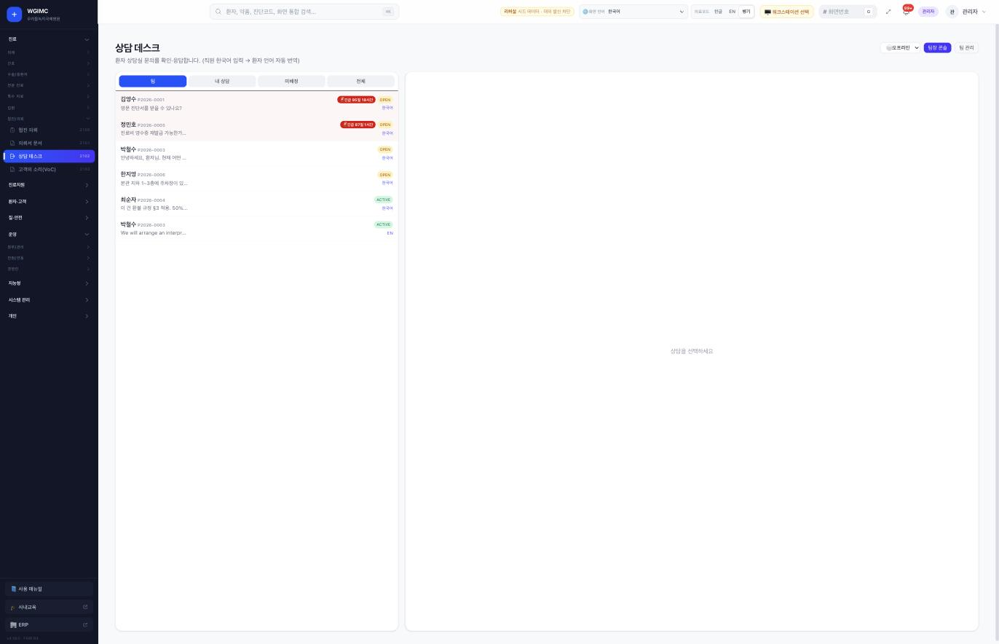

환자 상담실 문의를 확인하고 답하는 자리입니다. 화면이 동작을 한 줄로 적습니다 — **"직원 한국어 입력 → 환자 언어 자동 번역"**. 문의마다 **언어 배지**(한국어 · EN …)와 상태(OPEN · ACTIVE), 그리고 **얼마나 지났는지**가 붙습니다. 오래 방치된 건은 긴급 배지에 경과 시간이 그대로 나옵니다.

> 🔴 **상담실 AI 자동응답은 기관이 따로 정할 것입니다.** 설정 설명이 "켜면 사람 검토 없이 환자에게 전송된다"고 적고 있고, 결정 등록부에 항목이 없습니다 → [취지 1](../overview/02-principles.md#1-ai-는-보조-판단은-사람) · [S6](../build-guide/S6-ai.md)
> 번역도 마찬가지입니다 — **화면 번역은 모두 AI 초안이고 사람 검수를 마친 것이 없습니다**([README](../README.md#지금-알고-시작해야-할-것)).

---

## 질·안전 — `quality`

환자안전·감염관리·질 지표·임상 연구. **"모르는 것을 아는 척하지 않는다"가 가장 잘 보이는 자리**입니다.

| 묶음 | 화면 | 하는 일 |
|---|---:|---|
| **의료 질/연구** | 6 | 임상경로 · `다학제진료(MDT)` · 암 등록 · `임상 연구(IRB)` · `OMOP CDM` · 당직/근무 |
| **안전/질관리** | 16 | `환자안전(사고 보고)` · 감염관리 · `직원 노출 사고` · QI · `매핑 임상검토` · 직원교육 · `자격·교육(SQE)` · `위원회·정책(GLD)` · **`안전 게이트 관제`** · **`대외 발신 관제`** · `기관 연동` · **`중요 결정`** · `감사 대시보드` · `오더 서명 로그` · `단말 보안` |

- **안전 게이트**는 끔 / 경고 / 차단 세 모드입니다. 리허설에서 경고로 운영해 보고 목표 모드로 올립니다([S7](../build-guide/S7-rehearsal.md)).
- **대외 발신 관제**가 기관 밖으로 나가는 채널의 세 조건을 한 화면에서 보여 줍니다.
- **중요 결정**(결정 등록부)은 결정 56건을 층 · 선택지 · 결정권자 · 적용 방식으로 관리합니다([체크리스트](../checklist/decisions.md)).

### 안전 게이트 — 끔 · 경고 · 차단, 그리고 "위반 0"을 읽는 법

게이트마다 **끔 / 경고 / 차단** 세 버튼이 있고, 7일·30일 위반 통계와 **거버넌스 결정 번호**가 함께 붙습니다. 리허설에서 경고로 운영해 보고 차단으로 올리는 판단을 이 화면에서 합니다.

판정 문구가 이 자료의 원칙을 그대로 보여 줍니다.

> 🔴 **BLOCK 인데 평가 모집단 미상 — "위반 0"을 준수로 읽을 수 없다**
> 30일간 평가된 적 없음 — 승격 판단 근거 없음
> 30일 25건 평가 · 위반 0건 — BLOCK 승격 검토

차단 모드로 켜 두었다는 것만으로 안전하다고 말하지 않습니다. **무엇을 몇 건이나 평가했는지(분모)를 모르면 "위반 0"은 아무 말도 아니라고** 적습니다. 거버넌스 결정이 없는 게이트에는 `의결 근거 없음` 이 붙습니다 → [취지 3](../overview/02-principles.md#3-모르는-것을-아는-척하지-않는다) · [취지 8](../overview/02-principles.md#8-개시-전과-후를-모드로-가른다)

### 기관 연동 — 안 되는 것을 일정으로 관리한다

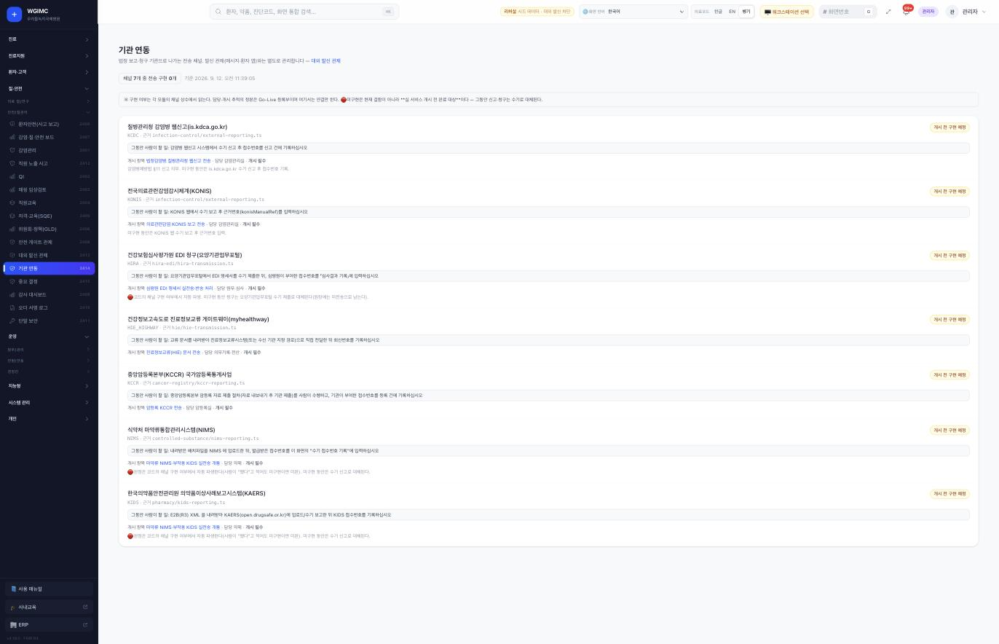

법정 보고 · 청구 기관으로 나가는 전송 채널을 한 곳에 모읍니다. 이 설치본은 **채널 7개 중 전송 구현 0개**입니다 — 질병관리청 감염병 웹신고 · 전국의료관련감염감시체계(KONIS) · 건강보험심사평가원 EDI 청구 · 건강정보고속도로 진료정보교류 · 중앙암등록본부(KCCR) · 식약처 마약류통합관리시스템(NIMS) · 한국의약품안전관리원 이상사례보고(KAERS).

**그런데 채널마다 네 가지를 함께 적습니다.**

1. **근거 파일 경로** — 구현 여부를 어디서 읽는지
2. **"그동안 사람이 할 일"** — 예: "감염병 웹신고 시스템에서 수기 신고 후 **접수번호를 신고 건에 기록**하십시오"
3. **개시 정책 항목과 담당** — Go-Live 등록부의 어느 항목인지, 어느 부서가 맡는지, 개시 필수인지
4. **법적 근거** — 예: "감염병예방법 §11 신고 의무"

그리고 맨 위에서 성격을 못 박습니다.

> 🔴 **여기 구현은 현재 결함이 아니라 「실 서비스 개시 전 완료 대상」이다 — 그동안 신고 · 청구는 수기로 대체한다.**

**안 되는 것을 "결함"이 아니라 "일정"으로 관리하고, 그동안의 대체 수단을 사람에게 지시로 적어 둔 자리**입니다 → [README 「지금 알고 시작해야 할 것」](../README.md#지금-알고-시작해야-할-것) · [취지 7](../overview/02-principles.md#7-대외-발신은-세-조건)

### 연동 개통 게이트 — 개발 시드를 실결재로 바꾸는 절차

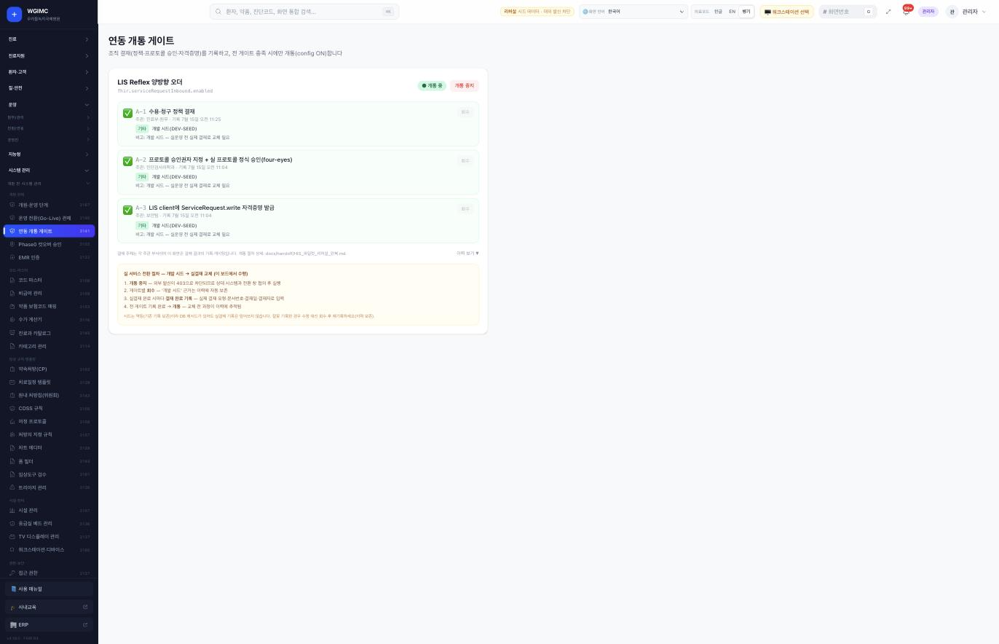

**"조직 결재(정책 · 프로토콜 승인 · 자격증명)를 기록하고, 전 게이트 충족 시에만 개통(config ON)합니다."**

이 설치본의 LIS Reflex 양방향 오더는 게이트 3개를 모두 채워 **개통 중**입니다 — 수용 · 청구 정책 결재(진료부 · 원무) · 프로토콜 승인권자 지정과 **four-eyes 정식 승인**(진단검사의학과) · 자격증명 발급(보안팀).

**그런데 세 게이트 모두 근거가 `개발 시드(DEV-SEED)` 이고, 비고에 "실운영 전 실제 결재로 교체 필요"라고 적혀 있습니다.**

아래에 교체 절차가 그대로 있습니다.

> **실 서비스 전환 절차 — 개발 시드 → 실결재 교체**
> 1. **개통 중지** — 외부 발신이 403 으로 차단되므로 **상대 시스템과 전환 창을 협의한 뒤** 실행
> 2. **게이트별 회수** — '개발 시드' 근거는 **이력에 자동 보존**
> 3. 실결재가 끝날 때마다 **실제 결재 유형 · 문서번호 · 결재일**로 기록
> 4. 전 게이트 기록 완료 → **개통**. 교체 전 과정이 이력에 남습니다
>
> ⚠️ "잘못 기록한 경우 **수정 대신 회수 후 재기록**하세요(이력 보존)."

시드로도 개통은 되지만 **그것이 시드임을 숨기지 않고**, 교체를 절차로 만들어 두었습니다. [테스트 계정 노출이 개시 차단 항목인 것](by-onboarding.md#1-로그인--처음-들어가는-자리)과 같은 태도입니다.

### 대외 발신 관제 — 구현 + 설정 + 승인

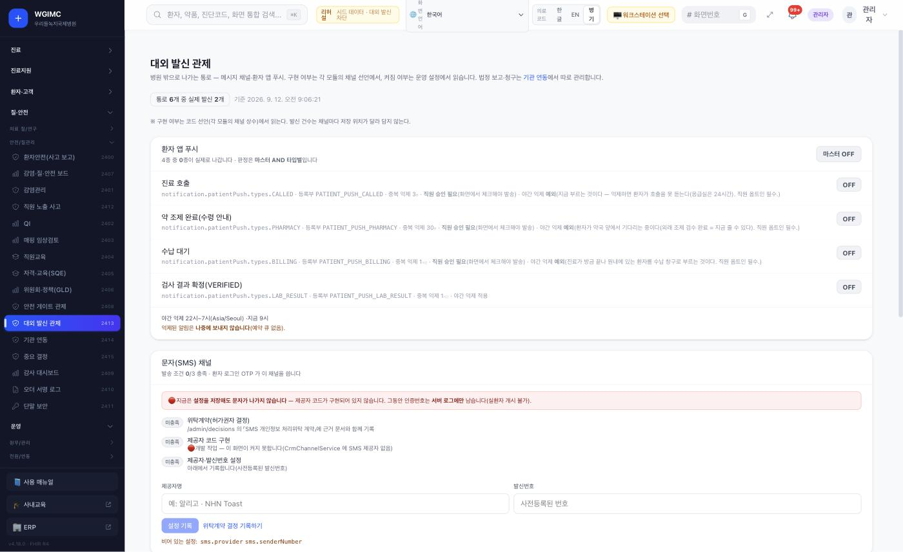

병원 밖으로 나가는 통로를 한 화면에 모읍니다. **구현 여부는 각 모듈의 코드 선언에서, 켜짐 여부는 운영 설정에서** 읽습니다. 이 설치본은 **통로 6개 중 실제 발신 2개**입니다.

- **환자 앱 푸시** — 마스터 OFF. "4종 중 **0종**이 실제로 나갑니다 · 판정은 **마스터 AND 타입별**입니다." 종류마다 설정 키와 등록부 키, 중복 억제 시간, **직원 승인 필요**(화면에서 체크해야 발송), 야간 억제(22시~7시)와 그 예외가 적혀 있습니다. 억제된 알림은 **나중에 보내지 않습니다(예약 큐 없음)**.
- **문자(SMS)** — 발송 조건 **0/3 충족**. 🔴 "지금은 설정을 저장해도 **문자가 나가지 않습니다** — 제공자 코드가 구현되어 있지 않습니다." 미충족 세 가지가 그대로 세 조건입니다 — **위탁계약(허가권자 결정)** · **제공자 코드 구현** · **제공자·발신번호 설정**.

→ [취지 7 「대외 발신은 세 조건」](../overview/02-principles.md#7-대외-발신은-세-조건) · [README 「지금 알고 시작해야 할 것」](../README.md#지금-알고-시작해야-할-것)

### 오더 서명 로그 — 봉인률 100%인데도 세는 것

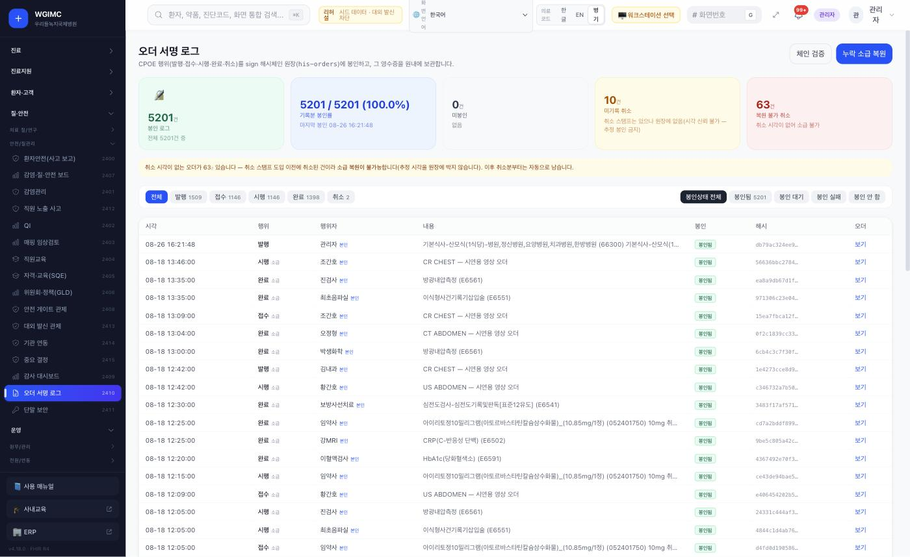

처방 행위(발행 · 접수 · 시행 · 완료 · 취소)를 [sign](sign.md) 의 **해시체인 원장에 봉인**하고 영수증을 원내에 보관합니다. 행마다 시각 · 행위 · 행위자 · 내용 · 봉인 상태 · **해시** 가 남고, `체인 검증` 으로 사슬이 끊기지 않았는지 확인합니다.

이 설치본은 **5,201건 중 5,201건(100.0%) 봉인**입니다. 그런데 화면은 100% 옆에 두 가지를 더 셉니다.

> ⚠️ **미기록 취소 10건** — 취소 스탬프는 있으나 원장에 없음(**시각 신뢰 불가 — 추정 봉인 금지**)
> 🔴 **복원 불가 취소 63건** — 취소 시각이 없어 소급 불가. "취소 스탬프 도입 이전에 취소된 건이라 소급 복원이 불가능합니다(**추정 시각을 원장에 박지 않습니다**). 이후 취소분부터는 자동으로 남습니다."

**100%를 100%라고만 말하지 않습니다.** 그 100% 밖에 무엇이 있는지, 왜 채울 수 없는지, 언제부터 괜찮아지는지를 함께 적습니다 → [취지 3](../overview/02-principles.md#3-모르는-것을-아는-척하지-않는다)

### 연구와 감염관리 — 만들지 않은 것을 만든 척하지 않는다

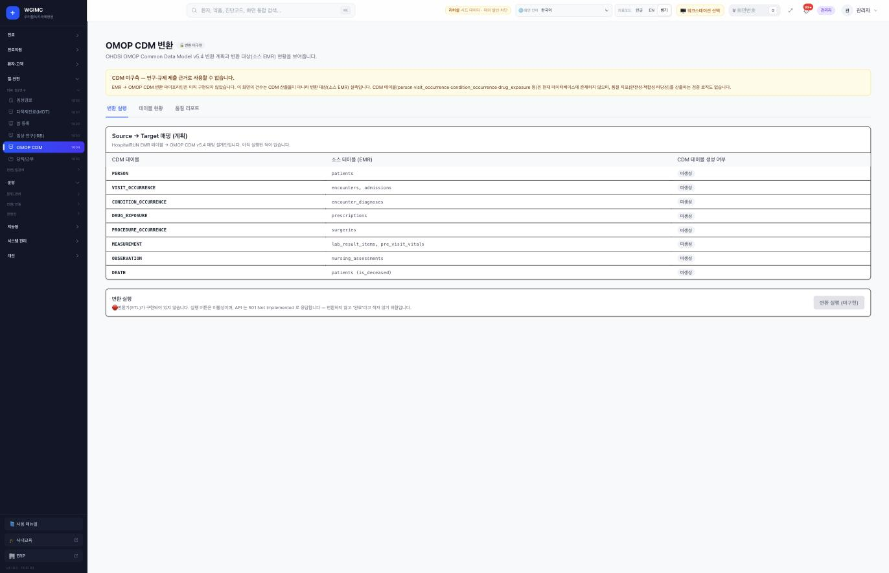

연구용 공통 데이터 모델(OHDSI OMOP CDM v5.4)로 바꾸는 화면입니다. 그런데 이 화면이 하는 일은 **아직 하지 않았다고 말하는 것**입니다.

> 제목 옆 **`변환 미구현`** · 맨 위 **"CDM 미구축 — 연구 · 규제 제출 근거로 사용할 수 없습니다"**
> 매핑 표(PERSON ← patients · VISIT_OCCURRENCE ← encounters · CONDITION_OCCURRENCE ← encounter_diagnoses …) 여덟 줄이 전부 **`미생성`**
> 🔴 **"변환기(ETL)가 구현되어 있지 않습니다. 실행 버튼은 비활성이며, API 는 `501 Not Implemented` 로 응답합니다 — 변환되지 않고 '완료'라고 적지 않기 위함입니다."**

화면의 건수도 **"CDM 산출물이 아니라 변환 대상(소스 EMR) 집계"** 라고 밝히고, 품질 지표(완전성 · 적합성 · 타당성)를 산출하는 검증 로직도 **아직 없다**고 적습니다. **가짜 성공을 만들지 않으려고 API 를 501 로 둔 자리**입니다.

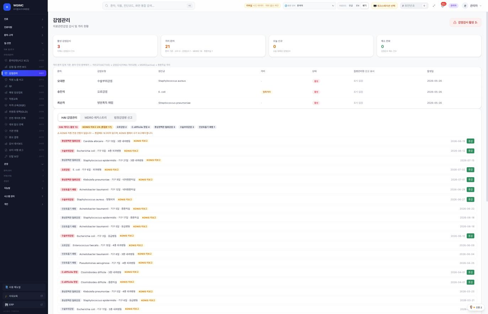

의료관련감염 감시와 격리 현황입니다. 격리 환자 수 옆에 **집계 기준**이 주석으로 붙습니다 — "환자 단위 중복 제거 — 격리오더(ACTIVE) + 감염감시 + MDRO(active) + 중환자실 격리". **무엇을 세었는지를 먼저 정의합니다.**

탭은 `HAI 감염관리` · `MDRO 레지스트리` · `법정감염병 신고` 로 나뉘고, 감염 유형별 건수(요로감염 · C.difficile 장염 · 중심정맥관 혈류감염 · 수술부위감염 · 인공호흡기 폐렴)와 **기구 일수**가 함께 섭니다.

여기서도 대외 전송의 한계가 화면에 적혀 있습니다.

> ⚠️ **KONIS 자동 전송 연동이 없습니다 — 종결해도 보고되지 않으며, KONIS 웹에서 수기 보고해야 합니다.**

**미보고 건수를 세고**(이 설치본은 29건 · 그중 종결 17), 건마다 `KONIS 미보고` 배지를 답니다. 안 되는 것을 적고, **대체 수단(수기 보고)까지 알려 줍니다** → [README 「지금 알고 시작해야 할 것」](../README.md#지금-알고-시작해야-할-것)

### 감사 대시보드 — 무엇을 세지 않았는지 먼저 말한다

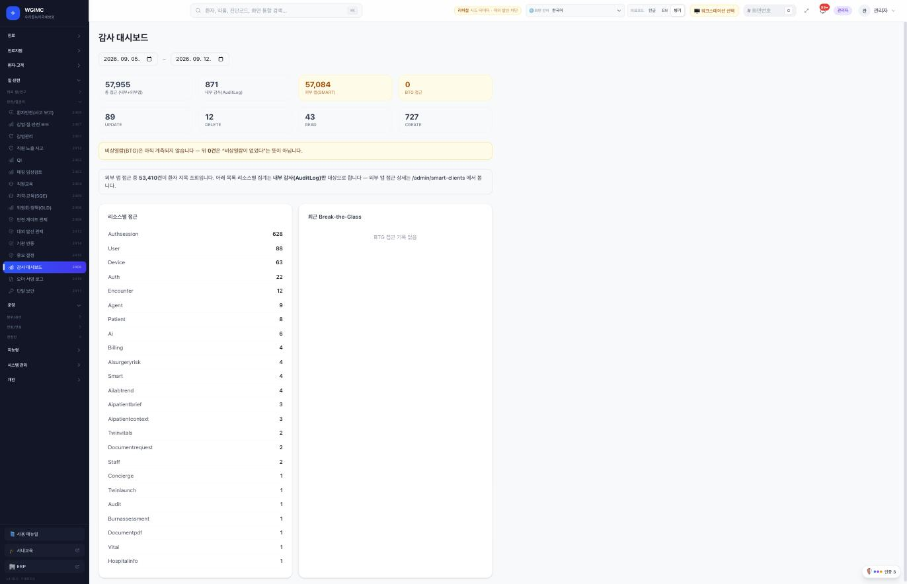

기간을 정해 접근 기록을 셉니다 — 총 접근, 내부 감사, 외부 앱(SMART), 비상열람(BTG), 그리고 UPDATE · DELETE · READ · CREATE. 아래에 리소스별 접근 수와 최근 비상열람이 섭니다.

그런데 숫자보다 먼저 두 개의 상자가 나옵니다.

> ⚠️ **비상열람(BTG)은 아직 계측되지 않습니다 — 위 0건은 "비상열람이 없었다"는 뜻이 아닙니다.**
> ℹ️ 외부 앱 접근 중 상당수가 환자 지목 조회입니다. **아래 목록·리소스별 집계는 내부 감사(AuditLog)만 대상으로 합니다** — 외부 앱 접근 상세는 SMART 클라이언트 화면에서 봅니다.

앞은 **계측되지 않은 0**을 0으로 읽지 말라는 것이고, 뒤는 **이 표의 분모가 무엇인지**를 밝히는 것입니다 → [취지 2](../overview/02-principles.md#2-출처를-말한다) · [취지 3](../overview/02-principles.md#3-모르는-것을-아는-척하지-않는다)

### 환자안전 — 법적 근거를 화면이 밝힌다

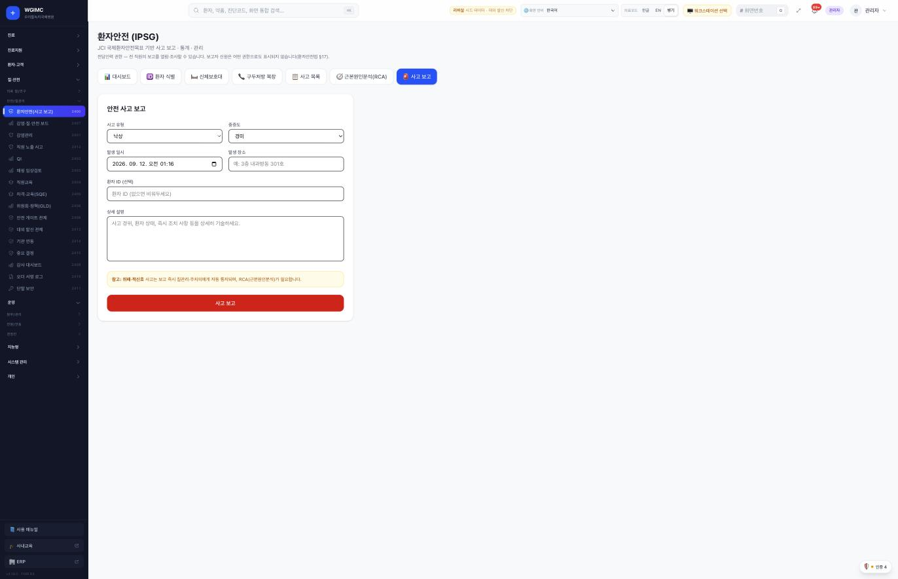

JCI 국제환자안전목표를 축으로 사고를 보고 · 통계 · 관리합니다(대시보드 · 환자 식별 · 신체보호대 · 구두처방 복창 · 사고 목록 · 근본원인분석(RCA) · 사고 보고).

머리글이 이 화면이 선 법적 자리를 적습니다.

> 전담인력 관할 — 전 직원이 보고를 열람 · 조사할 수 있습니다. **보고자 신원은 어떤 경우로도 표시되지 않습니다(환자안전법 §17).**

보고 폼에서 **환자 ID 는 선택**입니다("없으면 비워두세요"). 환자를 특정하지 않고도 보고할 수 있게 한 것입니다. 그리고 보고 뒤에 무엇이 자동으로 일어나는지 미리 적습니다 — **"위해 · 적신호 사고는 보고 즉시 질관리 · 주치의에게 자동 통지되며, RCA(근본원인분석)가 필요합니다."**

---

### 비율을 내지 않는 자리들 — 안전 보드 · 직원교육 · 노출 사고 · 매핑 검토

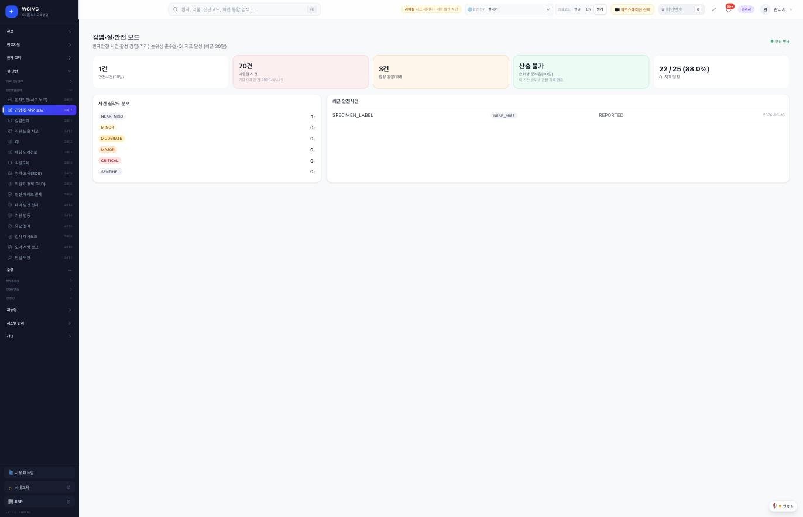

감염 · 질 · 안전 보드의 다섯 칸 중 **손위생 준수율(30일)은 `산출 불가`** 입니다 — "이 기간 손위생 관찰 기록 없음". 옆 칸은 **최근 30일 안전사건 1건**과 함께 **미종결 사건 70건(가장 오래된 건 2025-10-23)** 을 나란히 셉니다. 새로 생긴 것이 적다는 숫자만 보여 주지 않습니다.

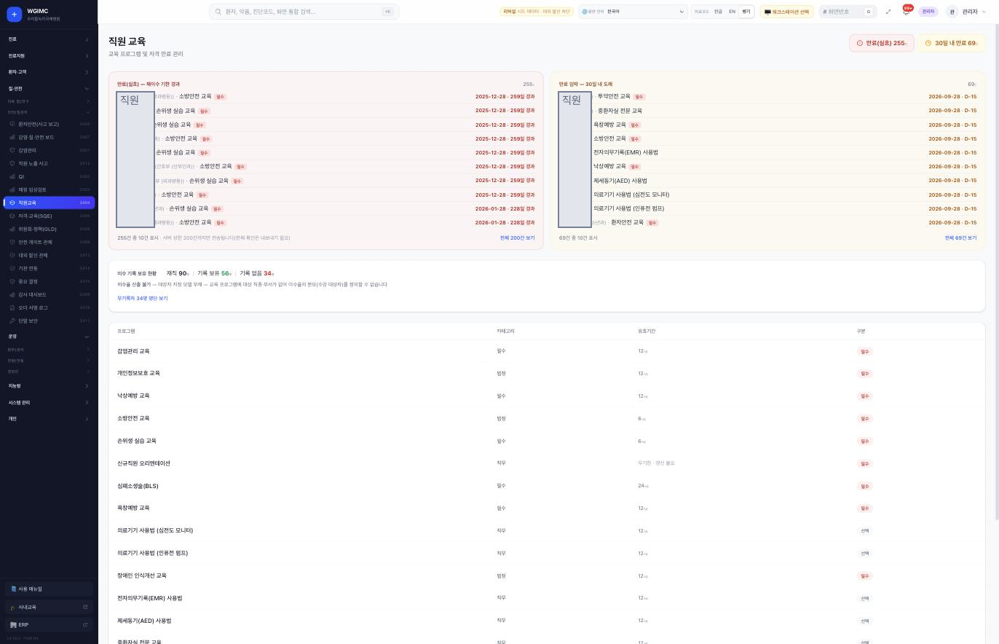

직원교육은 재직 90명 중 **기록 보유 56 · 기록 없음 34** 를 적고, 이수율 자리에 이렇게 씁니다.

> **이수율 산출 불가 — 대상자 지정 모델 부재** — 교육 프로그램에 대상 직종 · 부서가 없어 **이수율의 분모(수강 대상자)를 정의할 수 없습니다**

만료 목록도 "255건 중 10건 표시 · **서버 상한 200건까지만 전송됩니다**(전체 확인은 내보내기 필요)"라고 잘린 것을 밝힙니다 → [아홉 가지 방식](../overview/02-principles.md#화면이-모른다고-말하는-아홉-가지-방식)

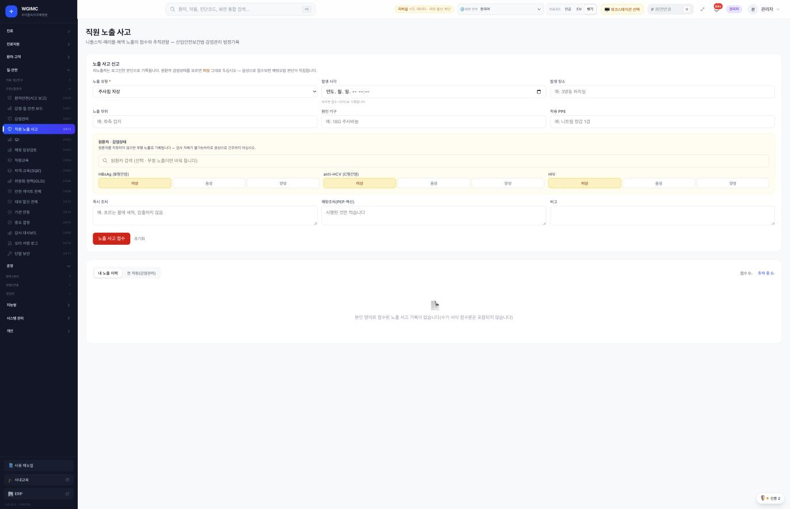

니들스틱 · 체액 노출 신고 폼은 원환자 감염상태(HBsAg · anti-HCV · HIV)의 기본값이 **`미상`** 이고, 입력 안내가 그 까닭을 적습니다.

> 원환자 감염상태를 모르면 **미상 그대로 두십시오 — 음성으로 접수되면 예방요법 판단이 뒤집힙니다.**
> 원환자를 지정하지 않으면 무명 노출로 기록됩니다 — **검사 자체가 불가능하므로 음성으로 간주하지 마십시오.**

아래 이력도 "(수기 서식 접수분은 포함되지 않습니다)"라고 분모의 범위를 밝힙니다. **모르는 값을 안심되는 값으로 채우지 않는다**는 규칙이 폼의 기본값에 들어가 있습니다 → [취지 3](../overview/02-principles.md#3-모르는-것을-아는-척하지-않는다)

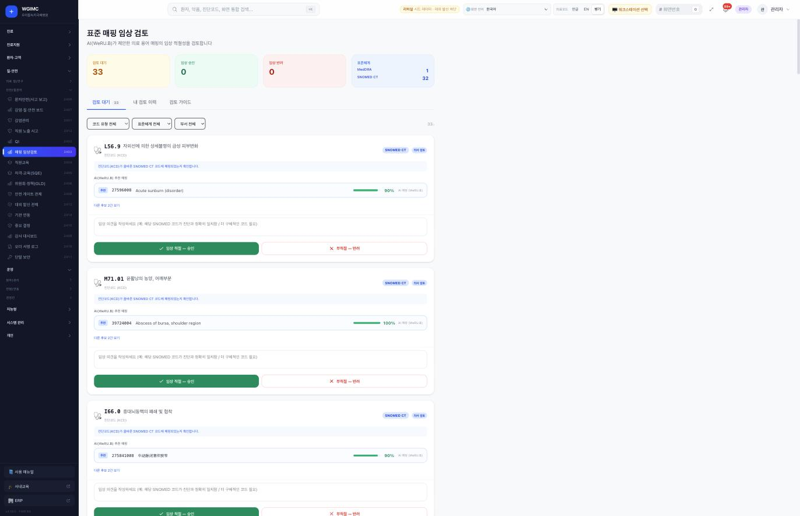

AI(WeRU.B)가 제안한 진단코드(KCD) → SNOMED CT 매핑을 **임상 적절 — 승인 / 부적절 — 반려** 로 사람이 가릅니다. 검토 대기 33 · 승인 0 · 반려 0 — 아직 아무것도 자동으로 확정되지 않았습니다.

> ⚠️ **관찰** — 이 설치본의 추천 한 건은 용어 이름이 **중국어로 표기**돼 있습니다(`I66.0` 추천, 2026-09-13). 사람이 검토하는 자리가 왜 필요한지를 보여 주는 예로 그대로 적습니다 → [취지 1](../overview/02-principles.md#1-ai-는-보조-판단은-사람)

---

## 운영 — `ops`

원무·청구·인사·경영 대시보드·전원/연동.

| 묶음 | 화면 | 하는 일 |
|---|---:|---|
| **원무/관리** | 13 | `원무·수납 보드` · `수납` · `보험 청구` · `원가 분석` · 환자 만족도 · `자재/재고` · 중앙공급 · 장비 · 인사 · `생체등록·기기관리` · `인증 관리 콘솔` · `승인 감사(서명·처방)` · 동선 스테이션 |
| **전원/연동** | 4 | `전원 관리` · `전원 의뢰` · `수신 전원` · `전원 이력` |
| **경영진** | 2 | `경영 대시보드` · `의료 품질` |

> 🔴 **청구서 작성까지는 HIS 가 합니다.** 대외 기관으로 보내는 **청구 · 자격조회 전송 모듈은 구현돼 있지 않습니다.** 기관이 전송 모듈을 붙이거나 기존 청구 소프트웨어와 함께 씁니다([README](../README.md#지금-알고-시작해야-할-것)).

### 수납과 보험 청구 — 보냈는지, 받았는지

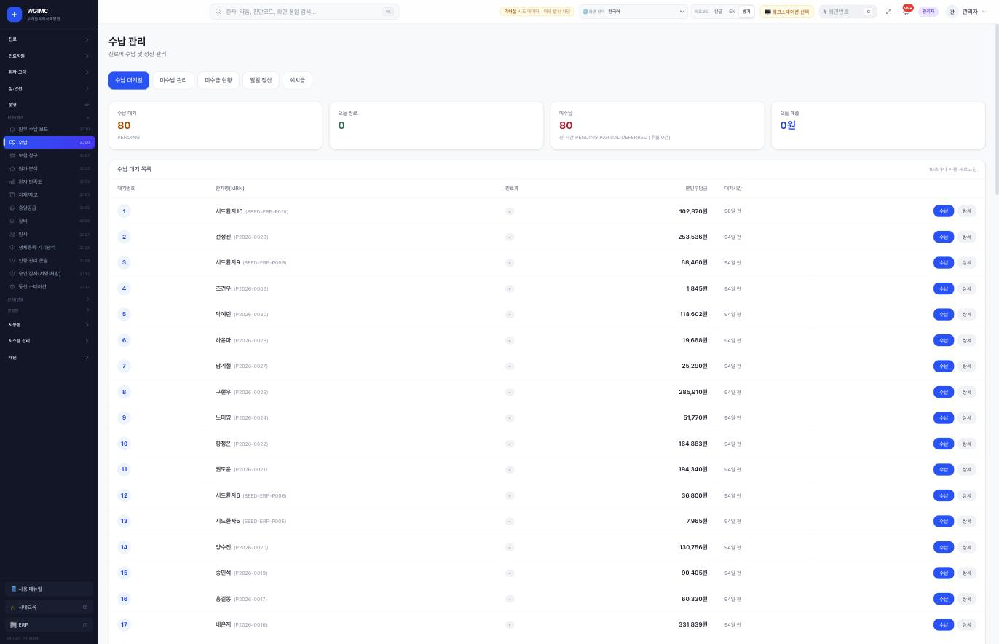

수납은 `수납 대기열` · `미수납 관리` · `미수금 현황` · `일일 정산` · `예치금` 으로 나뉩니다. 대기열에 환자와 MRN · 진료과 · **본인부담금** · **얼마나 기다렸는지**가 서고, 행에서 바로 수납합니다. 위에 수납 대기 · 오늘 완료 · **미수납**(전 기간 · 상태별) · 오늘 매출이 있습니다.

> 이 설치본의 대기 건에는 `SEED-ERP-…` 같은 **시드 환자 식별자**가 그대로 보입니다. 리허설 데이터라는 것이 목록에서 바로 드러나고, 이 정리는 [Go-Live 체크리스트](../checklist/go-live.md)의 `flag.demoSeedPurge`(개시 차단)가 맡습니다.

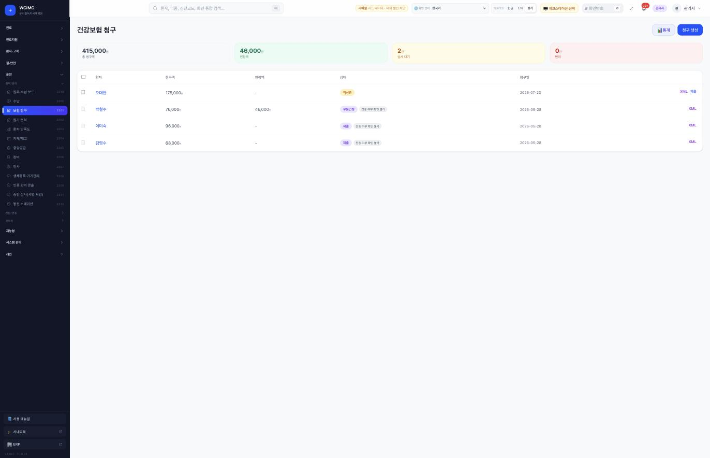

청구는 총 청구액 · **인정액** · 심사 대기 · 반려로 요약되고, 건마다 상태(`작성중` · `제출` · `부분인정`)와 **`XML`**(청구 파일 생성) 이 붙습니다.

여기서 이 자료가 밝혀 온 한계가 **화면의 배지 하나로** 나타납니다.

> 상태가 `제출` 인 건 옆에 **`전송 여부 확인 불가`**

**보냈다고 기록은 남지만, 상대 기관이 받았는지 확인할 길이 없다**는 뜻입니다. 대외 기관 전송 모듈이 없기 때문입니다. 화면은 이것을 "전송 완료"로 적지 않고 **확인할 수 없다고 적습니다** → [취지 3 「아홉 가지 방식」 9번](../overview/02-principles.md#화면이-모른다고-말하는-아홉-가지-방식)

### 경영 대시보드 — 0 과 「산출 불가」를 나눈다

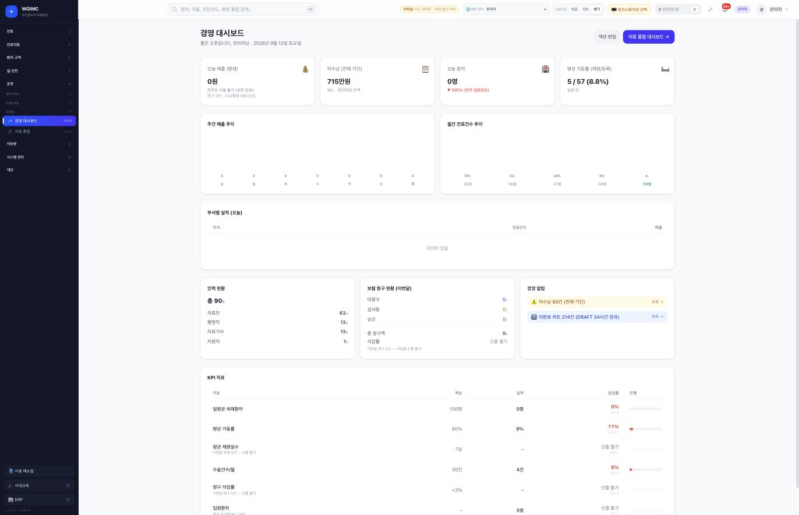

경영 지표 화면이 이 자료의 규칙을 가장 분명하게 보여 주는 자리입니다. KPI 표에서 **어떤 줄은 `0%` 이고 어떤 줄은 `산출 불가`** 입니다.

| 지표 | 실적 | 달성률 | 왜 |
|---|---|---|---|
| 일평균 외래환자 | 0명 | **0%** | 정말로 0 명입니다(토요일) |
| 병상 가동률 | 9% | **11%** | 값이 있습니다 |
| 평균 재원일수 | – | **산출 불가** | 이번달 퇴원 **0건** — 나눌 분모가 없습니다 |
| 청구 삭감률 | – | **산출 불가** | 이번달 청구 **0건** — 분모가 없습니다 |

**분모가 없으면 비율을 0 으로 적지 않습니다** → [취지 5 「분모를 함께」](../overview/02-principles.md). 오른쪽 경영 알림은 미수납 80건과 **미완료 차트 214건(DRAFT 24시간 경과)** 을 띄웁니다 — 좋은 숫자만 고르지 않습니다.

### 전원 — 다른 병원으로 보내고 받는 자리

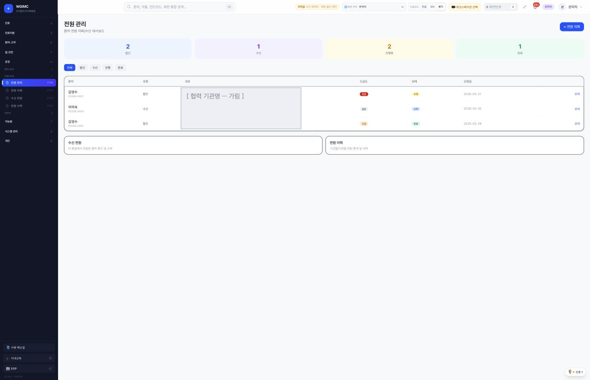

발신 · 수신 · 진행중 · 완료로 나눠 세고, 건마다 환자 · 유형 · **경로(보내는 병원 → 받는 병원)** · 긴급도 · 상태 · 요청일이 섭니다. 아래에 `수신 전원`(타 병원에서 온 환자 확인과 수락)과 `전원 이력`(기간별 · 기관별 통계)이 있습니다. 표준으로 주고받는 절차는 [상호운용성 화면](#표준으로-말하는-자리--상호운용성과-연동-테스트)의 전원 4단계입니다.

> 경로 칸을 가린 것은 이 설치본의 시드 데이터에 **실존 의료기관 이름**이 들어 있기 때문입니다. 공개 자료에는 협력 기관명을 싣지 않습니다.

### 원무·수납 보드 — 자격을 확인하지 못한 사람이 몇 명인가

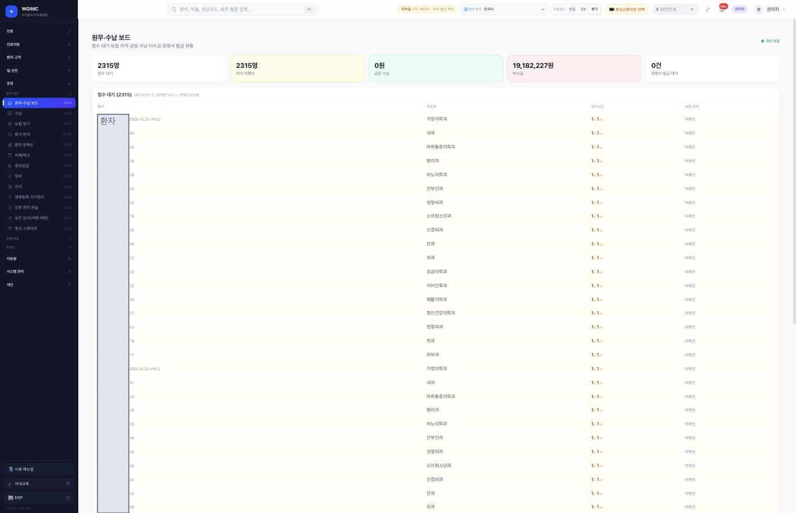

원무 · 수납 보드는 접수 대기 옆에 **보험 자격 미확인** 수를 따로 셉니다. 캡처 시점에 두 수가 **같았습니다(2,315 / 2,315)** — 대기 중인 사람 전원의 자격이 확인되지 않았다는 뜻입니다. 대외 자격조회 전송 모듈이 없기 때문이고, 화면은 이것을 "확인됨"으로 두지 않고 행마다 **`미확인`** 으로 적습니다. 목록도 "대기시간이 긴 50명만 표시 — 전체 N명"이라고 잘린 것을 밝힙니다 → [README](../README.md#지금-알고-시작해야-할-것)

원가 분석 · 자재/재고 · 중앙공급 · 장비 · 인사 · 환자 만족도 · 승인 감사 · 동선 스테이션 · 전원 의뢰/수신/이력 · 의료 품질은 [캡처 목록](../assets/screens/INDEX.md)에 있습니다.

> 🔴 전원 화면의 환자명과 협력 기관명, 의료 품질 화면의 작성자 이름은 가렸습니다.

---

## 지능형 — `intel`

AI(WeRU.B) 진단보조·시뮬레이션·디지털 트윈.

| 화면 | 하는 일 |
|---|---|
| `AI(WeRU.B) 컨시어지` | 직원이 묻는 것에 근거와 함께 답하는 보조 창구 |
| `AI(WeRU.B) 예약 도우미` | 증상에서 진료과 후보를 제안(공개 홈페이지 예약에서도 같은 보조가 쓰입니다) |
| `시뮬레이터/플로어맵` · `메타버스 뷰어` | 공간과 동선을 놓고 보는 시뮬레이션 |
| `환자 여정` | 환자 한 명이 지나온 시스템 경계를 따라가 보는 화면 |
| `상호운용성` · `연동 테스트 콘솔` | 표준 연결과 연동을 눌러 보는 자리 |

> **AI 는 보조합니다.** 제안과 초안을 만들 뿐이고, 진단 · 처방을 확정하지 않습니다. AI 연산은 기관 안의 [AI Server](ai-server.md) 한 곳에서 하고, 의료 · 개인건강정보 작업은 `local_only` 로 묶여 외부 AI 제공자에게 가지 않습니다.

### AI 감독 관제 — 분모가 없으면 비율을 내지 않는다

`AI 제안이 사람에게 어떻게 처리됐는가` 를 봅니다 — 수용 · 수정 · 거부 · 만료, 검토 소요, 호출 분포. 화면 부제가 규칙을 먼저 밝힙니다: **"비율에는 분모가 함께 붙고, 표본이 없으면 값 대신 그 사실을 말합니다."**

이 설치본은 제안 원장이 비어 있어 수용률 · 수정률 · 거부율 · 만료율이 모두 **`산출 불가`** 이고, 각 칸 아래에 분모가 무엇인지(`결정된 건수 = ACCEPTED+EDITED+REJECTED`) 적혀 있습니다. 그 밖에도:

- `승인·수정량 미측정 0` 옆에 **"재지 않았다(0 이 아니다)"**
- `승인인데 수정 있음` 옆에 **"편집거리 > 0 — 승인=무수정이 아니다"**
- 무검토 승인 의심 — **"'의심 0건'이 아닙니다"**(판정에 필요한 노출 기록이 없어서), 그리고 임계값이 **"코드 기본값 5초를 씁니다(원내 정책으로 정해진 값이 아닙니다)"**
- 표 아래 — **"이 표의 0 은 'AI 를 안 썼다'가 아니라 '이 원장에 남은 것이 없다'"**

> 📏 **이 화면에 AI 호출 지연 실측이 있습니다** — 표본 12건에서 p50 6,671.5ms · p90 29,457.5ms. **표본 12건은 판단 근거로 삼기에 너무 적습니다.** 이 자료가 「모델별 응답 시간은 아직 계측이 없다」고 적어 온 것은 그대로 유효하며, 계측은 리허설에서 기관 규모로 다시 합니다.

### 표준으로 말하는 자리 — 상호운용성과 연동 테스트

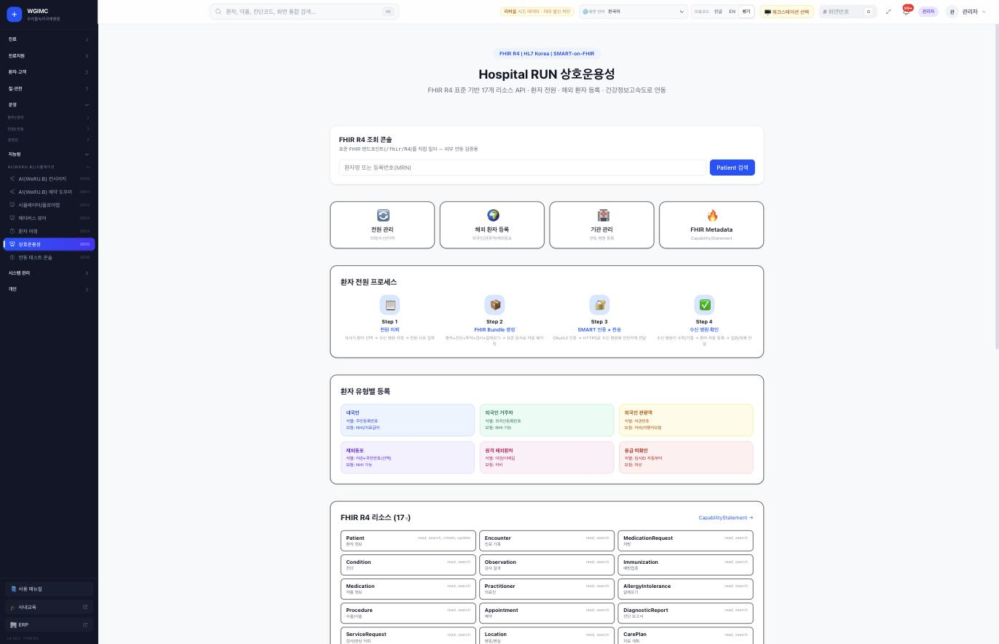

이 화면이 **표준 층의 실물**입니다. 위에 `FHIR R4 | HL7 Korea | SMART-on-FHIR` 이 서고, **FHIR R4 조회 콘솔**(표준 엔드포인트를 직접 질의 — 외부 연동 검증용)이 있습니다.

- **FHIR R4 리소스 17종**이 각각 지원 동작과 함께 나열됩니다 — Patient(read · search · create · update) · Encounter · Condition · Observation · MedicationRequest · Immunization · Practitioner · AllergyIntolerance · Procedure · Appointment · DiagnosticReport · ServiceRequest · Location · CarePlan …
- **환자 전원 4단계** — 전원 의뢰 → **FHIR Bundle 생성**(환자+진단+투약+검사+알레르기를 표준 포맷으로 자동 패키징) → **SMART 인증 + 전송**(OAuth2 → HTTPS) → 수신 병원 확인
- **환자 유형 6종**을 식별 수단과 함께 나눕니다 — 내국인 · 외국인 거주자 · 외국인 관광객 · 재외동포 · 원격 화상환자 · **응급 미확인(임시 ID 자동부여)**

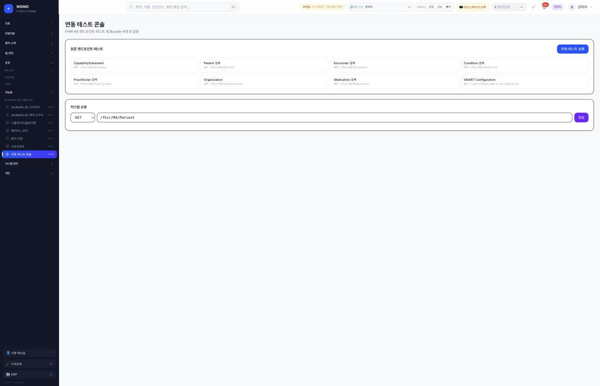

**연동이 실제로 응답하는지 눌러 보는 자리**입니다. 표준 엔드포인트 8종(`/fhir/R4/metadata` · Patient · Encounter · Condition · Practitioner · Organization · Medication · `/.well-known/smart-configuration`)을 한 번에 실행하거나, 아래 커스텀 요청으로 직접 질의합니다.

> 📌 이 자료의 [연결 상태](../RELEASES/draft/compatibility.md)는 **코드 대조**로 판정한 것이라 `검증됨` 이 0 입니다. 이 콘솔은 그 판정을 **실제 호출로 바꿀 수 있는 자리**입니다 — 구축 기관이 리허설(S7)에서 쓰는 도구이기도 합니다.

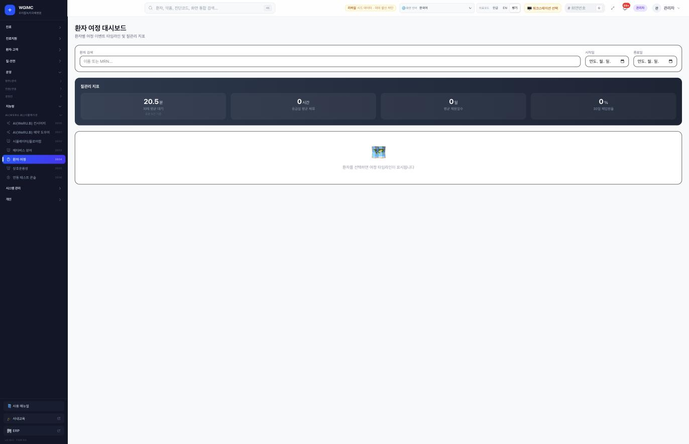

환자별 여정 타임라인과 질관리 지표(외래 평균 대기 · 응급실 평균 체류 · 평균 재원일수 · 30일 재입원율)입니다. 여기서도 **분모를 함께 적습니다** — 평균 대기 옆에 "공휴 3건 기준".

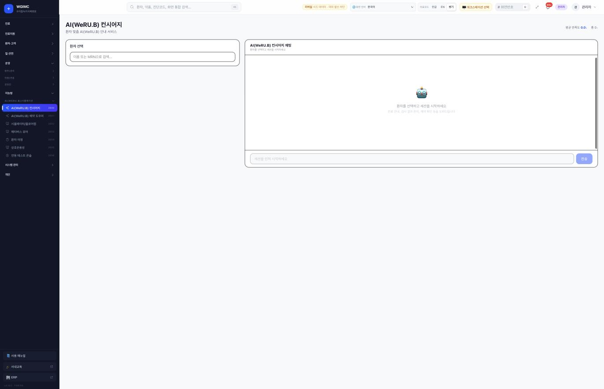

**AI 컨시어지**는 환자를 고른 뒤 세션을 열어 진료 안내 · 검사 결과 안내 · 예약 확인을 돕습니다. **AI 예약 도우미**는 증상을 설명하면 진료과와 일정을 추천합니다 — 그 추천의 근거표가 [트리아지 관리](#트리아지-관리--ai-가-쓰는-표는-기관이-고친다)입니다.

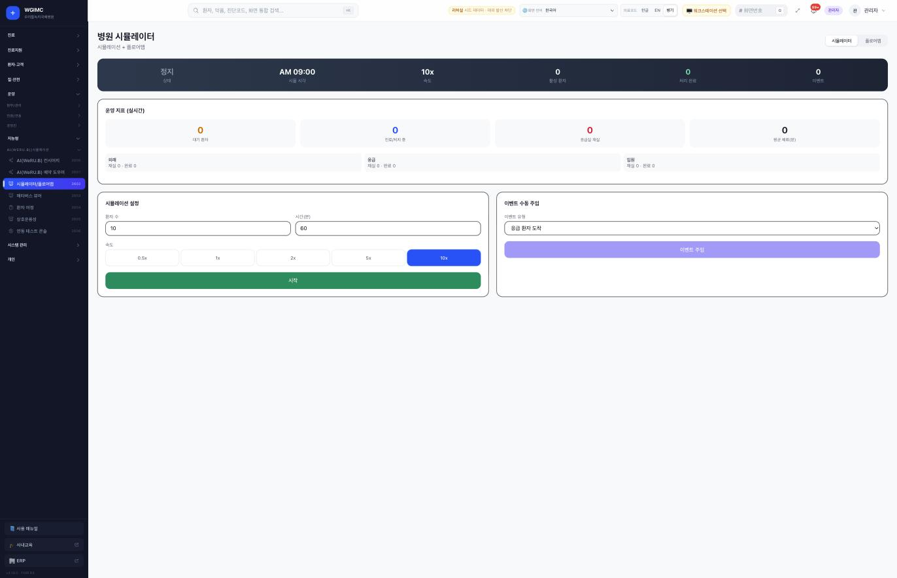

`시뮬레이터/플로어맵` 은 가상 환자 수와 시간 · 속도를 정해 외래 · 응급 · 입원 흐름을 돌려 보는 자리이고, 응급 환자 도착 같은 **이벤트를 사람이 넣습니다.** `메타버스 뷰어` 는 층별 평면도에 구역별 환자 수를 올립니다([캡처](../assets/screens/his-intel-metaverse.png)). 둘 다 **실제 운영 판단을 대신하는 화면이 아닙니다** — 흐름을 미리 보는 도구입니다.

---

## 시스템 관리 — `system`

직원·권한·설정·외부연동·홈페이지 관리. **화면 87개로 가장 큰 축**이고, 구축 단계에서 가장 많이 쓰는 자리입니다.

| 묶음 | 화면 | 하는 일 |
|---|---:|---|
| **개원 전 시스템 관리** | 36 | 문 열기 전에 정해 두는 기준 — **`개원·운영 단계`** · **`운영 전환(Go-Live) 관제`** · `연동 개통 게이트` · `EMR 인증` · **`코드 마스터`** · 비급여 · 약품 보험코드 매핑 · 수가 계산기 · 진료과 카탈로그 · `약속처방(CP)` · `CDSS 규칙` · 차트 에디터 · 폼 빌더 · `트리아지 관리` · 시설 · 권한 · 전자인증서 · 메뉴 관리 · **`시스템 설정`** |
| **운영 시스템 관리** | 33 | 문을 연 뒤 계속 쓰는 자리 — 직원 관리 · 진료표 · 당직표 · 전자결재 · `HIRA 청구` · 통계/분석 · `환자여정 관제` · `데이터 품질` · `마약류 관리` · `미비기록(HIM)` · `감사 로그` · `응급 접근 검토` · `보유·파기(Retention)` · `UI 다국어 검수` · **`상시 감시`** · **`AI 약물설명 승인`** · `검진해석 콘텐츠(감수)` · **`AI(WeRU.B) 감독 관제`** |
| **검진권** | 5 | 검진권 발행·조회 · 목록 · 대시보드 · 딜러 · 정책 |
| **외부 연동** | 6 | 연동 신청 관리 · `연동 모니터링` · 연동 기관 · `SMART 클라이언트` · 전원 통계 · `진료정보교류(HIE)` |
| **홈페이지 관리** | 7 | 홈페이지 대시보드 · `콘텐츠 관리(CMS)` · 공지/팝업 · 배너 · 미디어 · SEO · `홈페이지 배포` |

- **구축은 이 자리에서 진행됩니다.** `개원·운영 단계`(60 항목) · `운영 전환(Go-Live) 관제`(60 항목) · `중요 결정`(56 항목)이 [구축 체크리스트](../checklist/)의 원본입니다.
- **`시스템 설정`** 은 값의 출처를 **DB / 기본값 / 미설정**으로 구분해 보여 줍니다. "기본값"은 아직 아무도 정하지 않은 값입니다.
- **`AI(WeRU.B) 감독 관제`** 와 `AI 약물설명 승인` 이 AI 제안의 생성 → 승인 · 수정 · 거부를 남기는 자리입니다.

### 상시 감시 — 고치지 않고, 사람에게 넘긴다

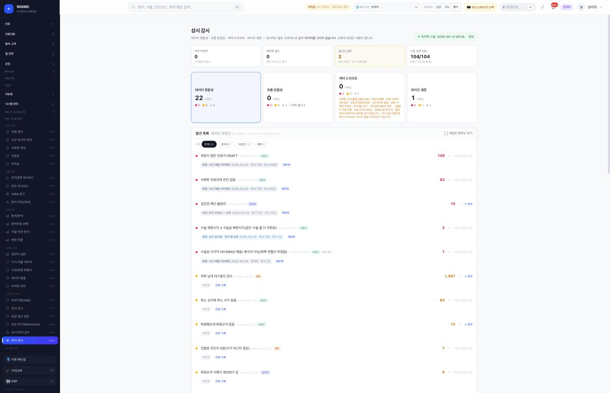

별도 프로세스가 주기적으로 돌며 네 축을 봅니다 — **데이터 정합성 · 흐름 완결성 · 계약 드리프트 · 파이프 생존**. 화면 부제가 역할을 못 박습니다.

> 감시자는 별도 프로세스로 돌며 **데이터를 고치지 않습니다. 고침과 판정은 사람이 합니다.**

발견은 규칙 번호(`integrity.13` 같은)와 담당(관리자 · 의료진 · 행정), 건수, 심각도로 나열됩니다 — "처방이 달린 진료가 DRAFT", "서명된 진료인데 진단 없음", "퇴원됐는데 퇴원요약 없음", "취소 오더에 취소 사유 없음" 처럼 업무 말로 적힙니다. 확신이 낮은 규칙에는 `낮은 확신` 이 붙습니다.

여기서도 **모르는 것은 모른다고 적습니다.**

> 흐름 완결성 0 미해결 · **↑ 관측 불가 3**
> 계약 드리프트 — "관측하는 통로는 12곳입니다. **여기 없는 통로로 생기는 드리프트는 보이지 않습니다(관측이 아닙니다).**"

→ [취지 3](../overview/02-principles.md#3-모르는-것을-아는-척하지-않는다)

### 트리아지 관리 — AI 가 쓰는 표는 기관이 고친다

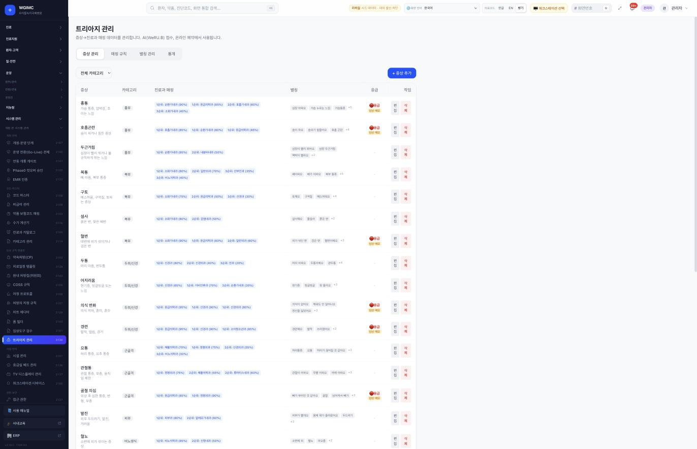

증상마다 **진료과를 1~3순위와 가중치(%)로** 매핑하고, 환자가 쓸 법한 **별칭**("가슴이 아파요" · "가슴 누르는 느낌")과 **응급 여부**를 붙입니다. 화면이 용도를 밝힙니다 — **"AI(WeRU.B) 접수, 온라인 예약에서 사용됩니다."**

즉 [AI 예약 도우미](#지능형--intel)가 증상에서 진료과를 제안할 때 쓰는 근거가 **이 표**이고, 이 표는 **기관이 화면에서 고칩니다.** AI 가 알 수 없는 방식으로 진료과를 고르는 것이 아닙니다 → [취지 5 「사람이 정할 것은 화면에서」](../overview/02-principles.md#5-사람이-정할-것은-화면에서)

**캡처 자리**

| # | 담을 화면 | 화면 경로 | 파일 |
|---|---|---|---|
| ✅ sys-1 | 개원·운영 단계 — 국가 축 · 항목별 기록 | `/admin/opening` | [`his-system-admin-opening.png`](../assets/screens/his-system-admin-opening.png) |
| ✅ sys-2 | 운영 전환(Go-Live) 관제 — 준비도 · 크리티컬 패스 | `/admin/go-live` | [`his-system-admin-go-live.png`](../assets/screens/his-system-admin-go-live.png) |
| ✅ sys-3 | 중요 결정(결정 등록부) — 세 층 · 결정권자 | `/admin/decisions` | [`his-quality-admin-decisions.png`](../assets/screens/his-quality-admin-decisions.png) |
| ✅ sys-4a | 시스템 설정 — 전역 구성 파라미터 키·값 | `/admin/config` | [`his-system-admin-config.png`](../assets/screens/his-system-admin-config.png) |
| ✅ sys-4b | 시스템 설정 — AI 서버 연결 · 브리핑 · 스킬 실측 | `/admin/ai-settings` | [`his-system-admin-ai-settings.png`](../assets/screens/his-system-admin-ai-settings.png) |
| ✅ sys-5 | AI 감독 관제 — 제안과 승인 이력 | `/admin/ai-oversight` | [`his-system-admin-ai-oversight.png`](../assets/screens/his-system-admin-ai-oversight.png) |
| 📷 sys-6 | 상시 감시 — 판정하지 못한 것을 "관측 불가"로 | 상시 감시 | `his-system-monitor.png` |
| ✅ sys-7 | 코드 마스터 — 기관이 반입한 진단 · 수가 · 약품 코드 | `/admin/codes` | [`his-system-admin-codes.png`](../assets/screens/his-system-admin-codes.png) |

### 구축을 진행하는 세 화면

**개원·운영 단계** — 문 열기까지와 연 뒤에 해야 하는 일을 업무 이름과 순서로 봅니다.

- 오른쪽 위에 **국가 축 탭(대한민국 · UAE)** 이 있습니다. 나라가 바뀌면 목록이 바뀝니다.
- 머리글이 **값의 출처를 밝힙니다** — "기관 국가가 설정되지 않아 **기본값으로 보고 있습니다**(시스템 설정 `hospital.country`)" → [취지 2 「출처를 말한다」](../overview/02-principles.md#2-출처를-말한다)
- 안내 상자가 한계를 먼저 말합니다 — "이 목록은 기본 목록이며 **전수가 아니다.** 기관 종별·지역·특례에 따라 달라지므로 기관이 확정해야 하고, **법령 근거는 비어 있다**(사람이 확인해 채운다)."
- 항목마다 상태는 **`기록 없음`** 이고 옆에 `기록` 버튼이 있습니다. **"미완료"가 아니라 "기록 없음"** 입니다 → [취지 3](../overview/02-principles.md#3-모르는-것을-아는-척하지-않는다)
- 정본 밖 데이터를 발견하면 그것도 적습니다 — 이 설치본에는 "정본에 없는 위원회 6건 · 위원 30명"이 있고, 화면은 **"정리는 삭제가 아니라 이관이다. 어느 위원회로 합칠지는 사람이 정한다"** 고 적습니다 → [취지 4 「정본은 하나」](../overview/02-principles.md#4-정본은-하나)

**운영 전환(Go-Live) 관제** — 실운영 전환에 필요한 게이트·승인·외부·데이터·인프라 항목을 한 곳에서 관제합니다.

- 왼쪽에 **전환 준비도**(이 설치본은 32% · 필수 10/31)와 추이. **시스템 실검증 10 · 담당자 자가신고 0** 으로 나뉘어 보입니다.
- **"전환을 막는 항목 21건"** 을 크게 띄웁니다.
- 🔴 머리글이 못을 박습니다 — **"기술 항목이 모두 준비돼도 개시 전 필수 사람 결정 없이는 개시할 수 없습니다."**
- 크리티컬 패스 목록에 이 자료가 밝힌 한계가 그대로 나옵니다 — 자격조회가 `SIMULATION` 인 것, 심평원 EDI · 감염병 신고 · 암등록 · 의료관련감염 · 마약류 · 부작용 보고가 **미구현이라 수기 신고로 대체 중**인 것, SMS 제공자 미등록, 그리고 **"빌드 상한이 `REHEARSAL` 이라 리얼 빌드로 재배포해야 한다"** 는 것 → [README 「지금 알고 시작해야 할 것」](../README.md#지금-알고-시작해야-할-것) · [S8](../build-guide/S8-go-real.md)
- 🔑 **개발 편의 기능도 개시 차단 항목입니다.** `security.hisMode` 「운영 모드 REAL 전환(**시드 로그인 노출 종료**)」과 `flag.demoSeedPurge` 「데모 · 시드 · `TEST-` 픽스처 정리」가 **개시를 막는 항목**으로 등록돼 있습니다. 앞의 것은 **시스템이 빌드의 운영 모드 상한을 직접 읽어 판정**하므로 화면에서 표시만 해서는 닫히지 않습니다. 리허설 설치본의 테스트 계정 · 시드 데이터를 "나중에 지우자"로 두지 않는 자리입니다.

**중요 결정(결정 등록부)** — 시스템이 사람의 결정을 기다리는 항목입니다.

- 세 층이 각각 칸을 가집니다 — **허가권자(법적 요건) · 원내 위원회(정책) · 직원(건별 판단)**. 층마다 `지금 가능` 과 `선행 대기` 를 나눠 셉니다. 선행 결정이 안 되면 그 아래 결정은 열리지 않습니다.
- 각 항목에 **법적 검토 근거와 허가권 근거를 함께 기록**하고, `설명자료`(검토 요청서·안건 자료)를 인쇄할 수 있습니다.
- 🔴 화면이 자기 한계를 적습니다 — **"이 시스템은 결정자의 정책·허가권을 검증하지 못한다. 본인이 밝힌 권한 근거를 기록할 뿐이다."** 그리고 **"세 층은 별개이며 하위가 상위를 대체하지 못한다."** → [취지 5 「사람이 정할 것은 화면에서」](../overview/02-principles.md#5-사람이-정할-것은-화면에서)

### 외부 연동 — 누가 우리 자료를 읽고 있나

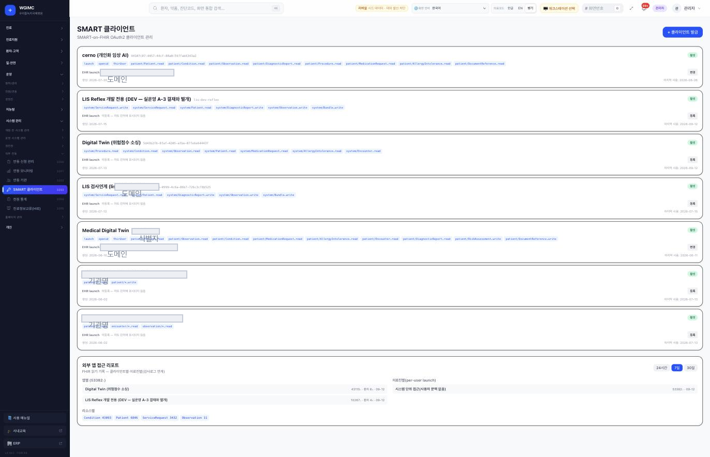

**SMART-on-FHIR** 은 다른 시스템이 HIS 의 자료를 표준 방식으로 읽는 길입니다. 이 화면은 그 길을 **클라이언트 단위로 등록하고 스코프로 좁힙니다.**

- 클라이언트마다 **허용 스코프가 나열**됩니다 — `patient/Patient.read` 처럼 **환자 한 명 문맥**으로 좁힌 것과 `system/Observation.write` 처럼 **시스템 단위**인 것이 눈으로 구분됩니다.
- `EHR launch` 가 있는 클라이언트(차트에서 바로 여는 앱)와 **「자동 — 차트 안에서 표시하지 않음」** 인 클라이언트가 갈립니다.
- 아래 **외부 앱 접근 리포트**가 최근 7일 동안 **어느 앱이 · 어느 의료진이 · 어떤 리소스를 몇 번** 읽었는지 셉니다. 시스템 단위 접근은 **「사용자 문맥 없음」** 으로 따로 적습니다 — 누구의 조회인지 모르는 것을 아는 척하지 않습니다.
- 여기 등록된 클라이언트에 [cerno](cerno.md) · [twin](twin.md) · [LIS](lis.md) 가 그대로 있습니다 → [신원 허브](../diagrams/identity-hub.md) · [연동 계약 지도](../integration/README.md).

> 🔴 **가린 것** — 접속 주소 2곳 · 저장소 식별자 1곳, 그리고 **협력 기관 이름이 붙은 클라이언트 2개는 이름과 식별자를 통째로 가렸습니다**(기관 식별 정보 · D5).

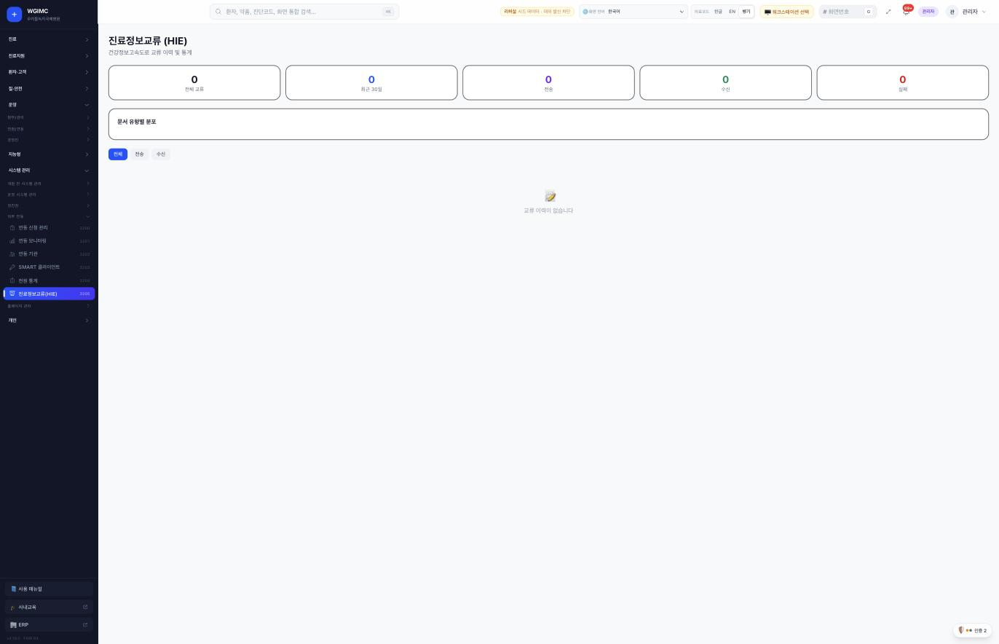

같은 묶음의 **진료정보교류** 화면은 **전부 0** 입니다 — 전체 교류 0 · 최근 30일 0 · 전송 0 · 수신 0 · 실패 0, 그리고 「교류 이력이 없습니다」. [8장](../overview/08-status-and-preparation.md)이 적은 **대외 기관 전송 미구현**이 화면에서 그대로 보이는 자리입니다. 숨기지 않고 **빈 화면으로 둡니다.**

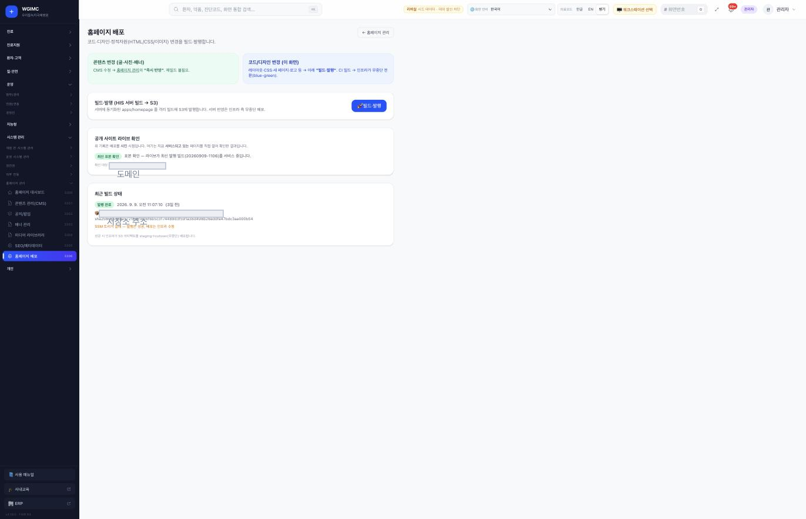

공개 홈페이지 발행 화면은 **두 가지 변경을 갈라 놓습니다** — 글·사진·배너는 콘텐츠 관리에서 고치면 **즉시 반영**, 레이아웃·CSS·페이지 추가는 **빌드·발행**을 거칩니다([S2](../build-guide/S2-patient-access.md)).

그 아래가 중요합니다. **「공개 사이트 라이브 확인」** 은 *배포를 시킨 기록*이 아니라 **지금 서비스되고 있는 페이지를 직접 열어 본 결과**입니다 — 라이브가 최신 발행 빌드를 서비스 중인지 **빌드 번호로 대조**합니다. 그리고 최근 빌드 상태에는 실패가 실패로 남아 있습니다(**「발행은 성공, 배포는 인프라 수동」**).

> **「배포했다」와 「지금 그것이 떠 있다」를 다른 사실로 다룹니다** → [DESIGN-HISTORY](../DESIGN-HISTORY.md).

> 🔴 확인 대상 주소와 아티팩트 저장소 주소는 가렸습니다.

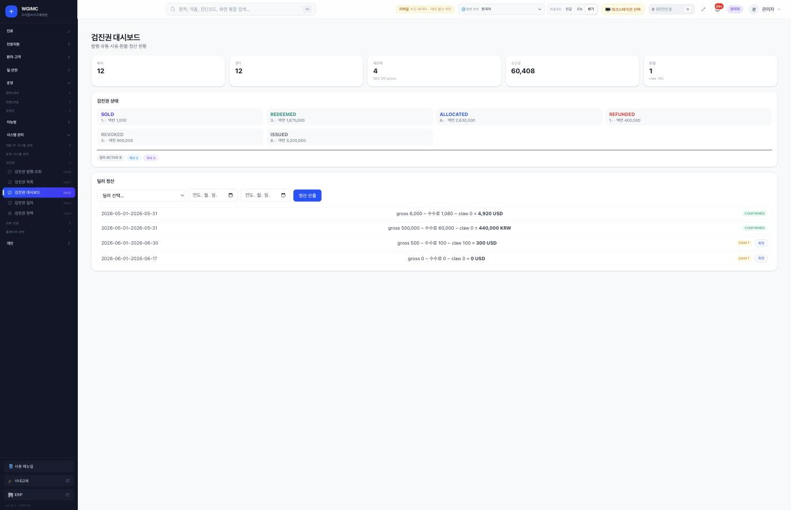

검진권(해외 수검자용 검진 상품)은 **상태를 6가지로 나눕니다** — `ISSUED` 발행 · `ALLOCATED` 딜러 배정 · `SOLD` 판매 · `REDEEMED` 사용 · `REFUNDED` 환불 · `REVOKED` 회수. 정산은 **USD 와 KRW 가 섞여** 있고 `gross − 수수료 − claw` 계산식을 줄마다 펼쳐 적으며, `DRAFT` 와 `CONFIRMED` 를 나눠 **확정 전에는 확정된 척하지 않습니다.**

### 대외 기관으로 나가지 못하는 것을, 화면이 대신 말한다

대외 전송 모듈이 없다는 사실([8장](../overview/08-status-and-preparation.md))은 화면에서 **빨간 띠 한 줄과 수기 대체 절차**로 나타납니다. 두 화면이 같은 모양을 하고 있습니다.

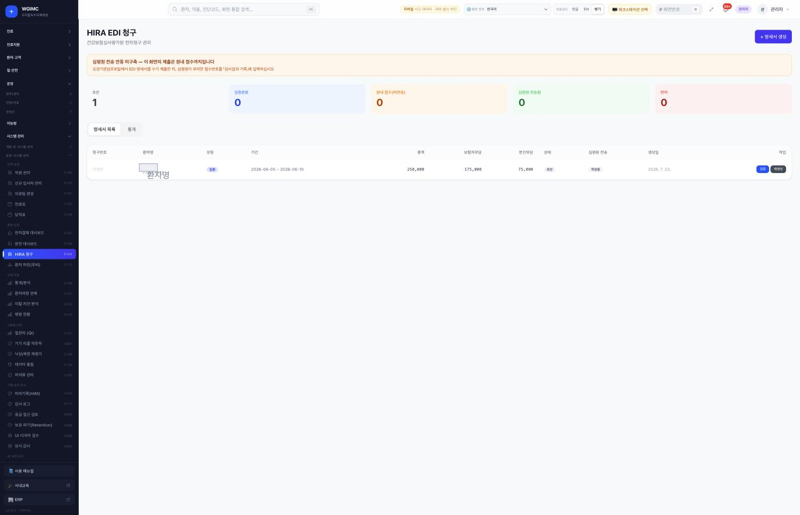

> **심평원 전송 연동 미구축 — 이 화면의 제출은 원내 접수까지입니다.**
> 요양기관업무포털에서 EDI 명세서를 수기 제출한 뒤, 심평원이 부여한 접수번호를 「심사결과 기록」에 입력하십시오.

상태 칸 이름이 아예 **`원내 접수(미전송)`** 입니다. "접수됨"으로 뭉뚱그리지 않고 **어디까지 갔는지를 이름에 넣었습니다.**

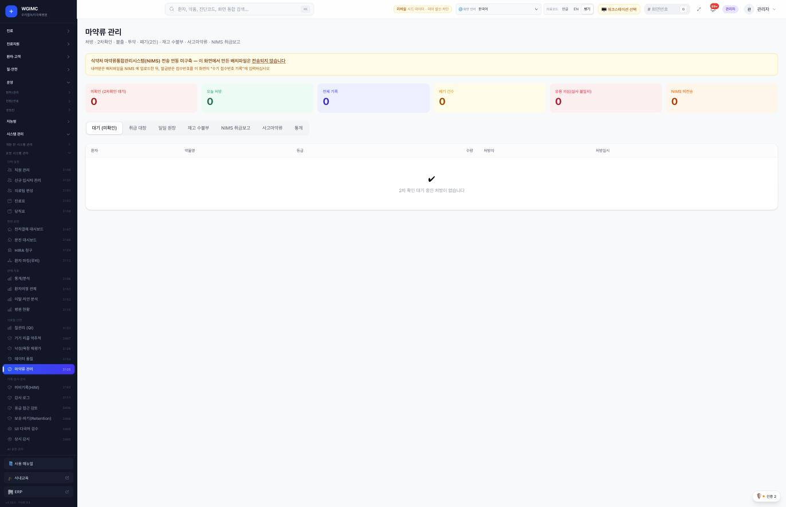

> **NIMS 전송 연동 미구축 — 이 화면에서 만든 배치파일은 전송되지 않습니다.**
> 내려받은 배치파일을 NIMS 에 업로드한 뒤, 발급받은 접수번호를 이 화면의 「수기 접수번호 기록」에 입력하십시오.

**안 되는 것을 숨기지 않고, 그 자리에 사람이 할 일을 적어 둡니다** → [취지 1](../overview/02-principles.md) · [기관 연동 화면](#기관-연동--안-되는-것을-일정으로-관리한다).

### 지우는 일에는 버튼을 만들지 않았다

보유·파기 화면은 정책 5종의 **보존일과 법정 최소일을 나란히** 놓고, **둘 중 긴 쪽으로 항상 안전측 산정**합니다. 처리 방식도 `리포트만(파기 안 함)` · `익명화` · `소프트 삭제` 로 갈립니다. 그리고 머리에 이렇게 적혀 있습니다.

> **현재 실제 파기가 되는 경로는 없습니다.** 전역 게이트(`retention.purgeEnabled`)가 꺼져 있고, 정책이 리포트 전용·법무 미확정이면 파기 요청도 서버가 거부합니다. 감사 로그·외부 앱 접근 기록은 법정 보존 대상이라 **파기 핸들러 자체가 없습니다.** — **이 화면은 실행 버튼을 만들지 않습니다.**

되돌릴 수 없는 일은 **끄는 것이 아니라 만들지 않는 쪽**을 골랐습니다. 돌려 보는 것은 `DRY-RUN` 으로만 하고, 실제 파기는 **2인 승인(4-eyes)** 대기열을 지납니다 → [취지 8](../overview/02-principles.md) · [S8](../build-guide/S8-go-real.md).

### 데이터 품질 — 분모가 거의 모든 칸에 있다

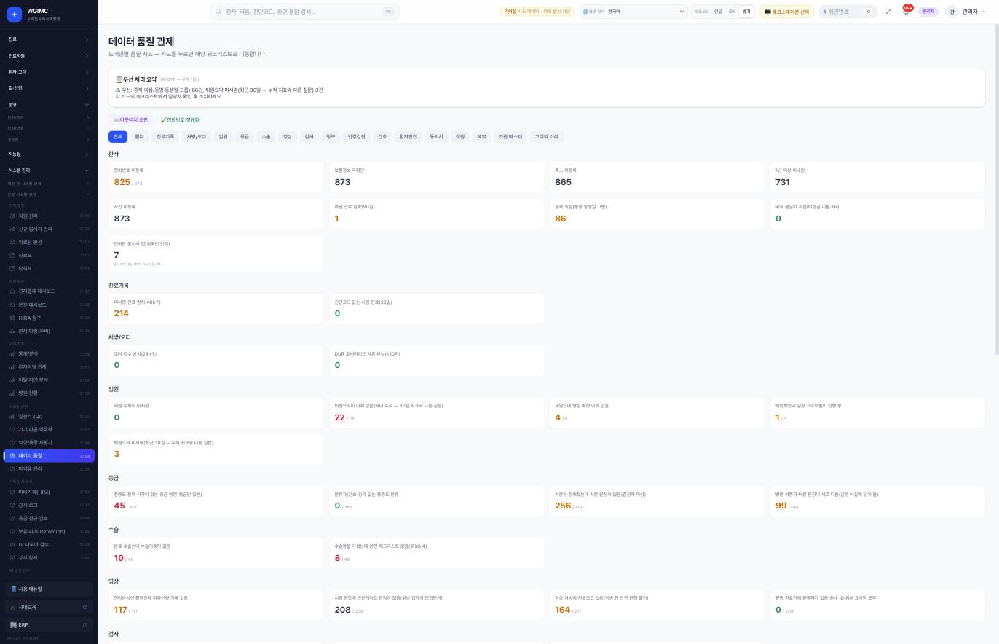

도메인 16축의 품질 지표를 한 판에 놓은 화면인데, **카드마다 값이 분모와 함께** 섭니다 — `825 / 873`(전화번호 미등록) · `22 / 26`(퇴원요약 미비) · `45 / 407`(중증도 분류 시각 없는 응급 방문) · `256 / 400` · `99 / 144` · `208 / 208` · `0 / 203`. 분자만 크게 적고 분모를 감추는 칸이 없습니다 → [취지 5](../overview/02-principles.md).

머리에 **「AI OFF — 규칙 7건」** 이라고 적혀 있습니다. **AI 를 끈 상태에서도 규칙으로 우선순위를 냅니다**([S6](../build-guide/S6-ai.md)).

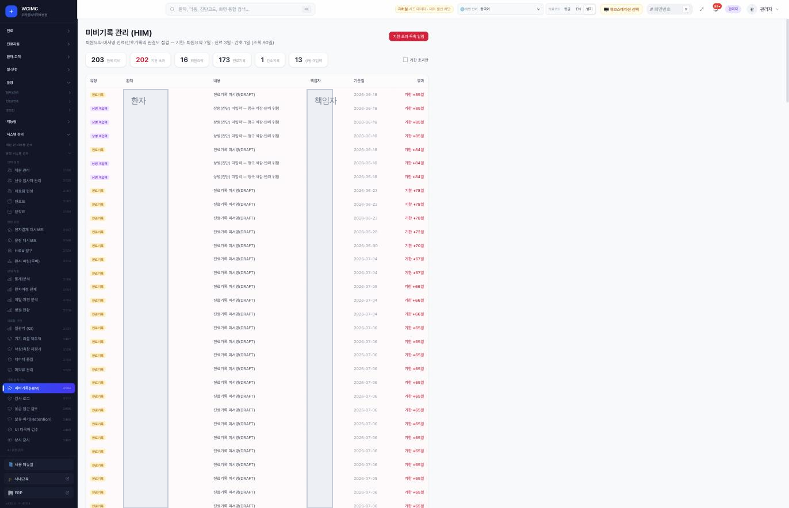

미비기록 화면은 병원이 **자기 미비를 크게 셉니다** — 전체 203 중 **기한 초과 202**. 기한 규칙(퇴원요약 7일 · 진료 3일 · 간호 1일)을 머리에 함께 적어, 202 라는 수가 **무슨 기준에서 나온 것인지** 알 수 있게 합니다.

### AI 가 만든 글은 사람이 승인해야 나간다

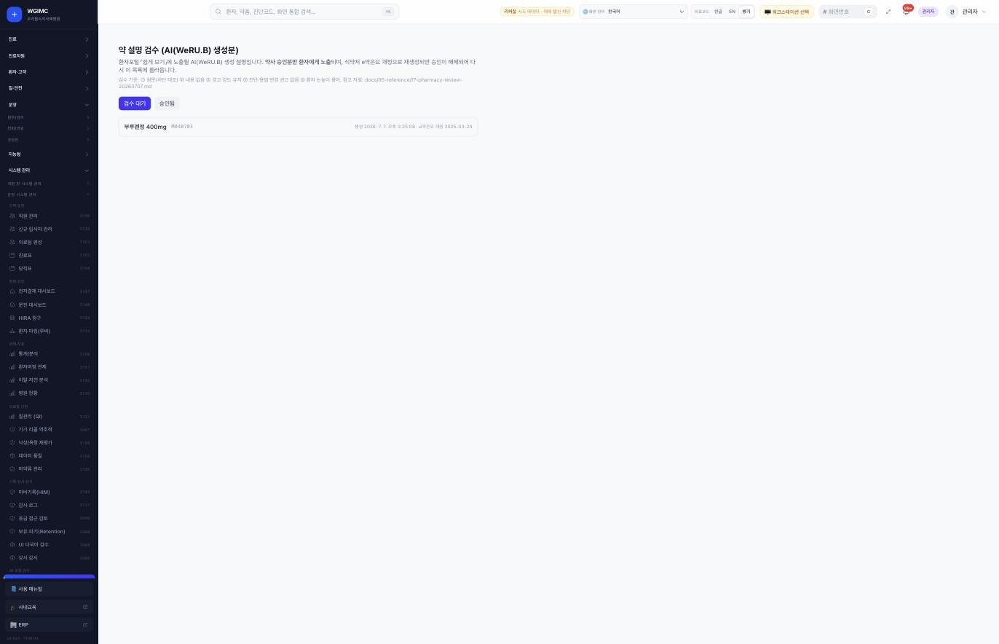

환자에게 나가는 약 설명은 AI 가 초안을 만들고 **약사가 승인한 것만 환자 화면에 뜹니다.** 검수 기준이 화면에 적혀 있습니다 — 원문(허가사항) 밖 내용 없음 · 경고 강도 유지 · 진단·용법 변경 권고 없음 · 환자 눈높이 용어.

> 🔴 **공개 정보가 개정되어 초안이 다시 만들어지면 승인이 자동으로 풀리고, 다시 이 목록에 올라옵니다.** 한 번 승인한 것이 영원히 승인된 것으로 남지 않습니다.

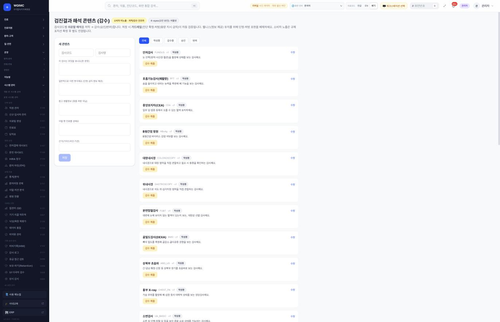

검진 해석문도 같은 구조입니다(작성중 → 감수중 → 승인 → 반려). 다만 여기는 **저장할 때 가드레일이 자동으로 검증**합니다 — **진단 확정 · 처방/용량 지시 표현을 막습니다.** 화면 위 배지가 두 가지 사실을 동시에 말합니다 — `소비자 노출` 대상이라는 것과, **`4-eyes(2인 승인): 비활성`** 이라는 것. 켜지지 않은 통제를 **켜진 척하지 않습니다** → [시나리오 03](../scenarios/03-health-checkup.md).

### 「0」이 아니라고 먼저 말하는 설정 화면들

개원 전에 기관이 채우는 기준 화면들은, 비어 있는 값을 **0 으로 읽지 말라**고 화면이 먼저 적습니다. 네 화면이 같은 말을 다른 자리에서 합니다.

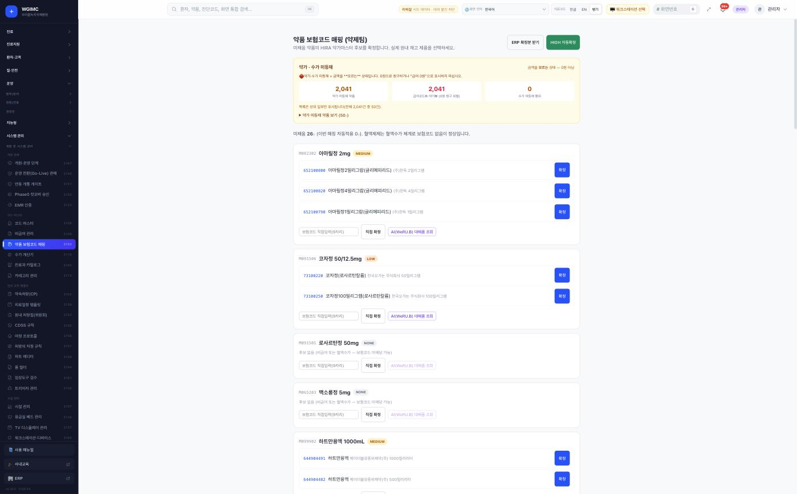

> **약가·수가 미등재 2,041건** — "0원으로 표시되나 **금액 0원이 아닙니다**."

후보가 없는 약품은 `NONE` 으로 남기고 억지로 코드를 붙이지 않습니다. `AI 대체품 조회` 는 보조 버튼입니다.

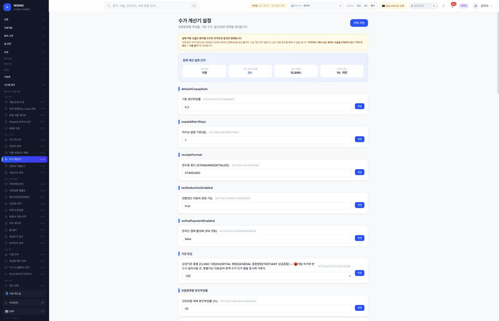

> 실제 적용 요율은 **환자별 자격조회 결과**로 정해집니다. 자격조회 기록이 없는 환자는 **단정하지 않고 「자격 미확인 — 산출 불가」** 로 표시합니다.

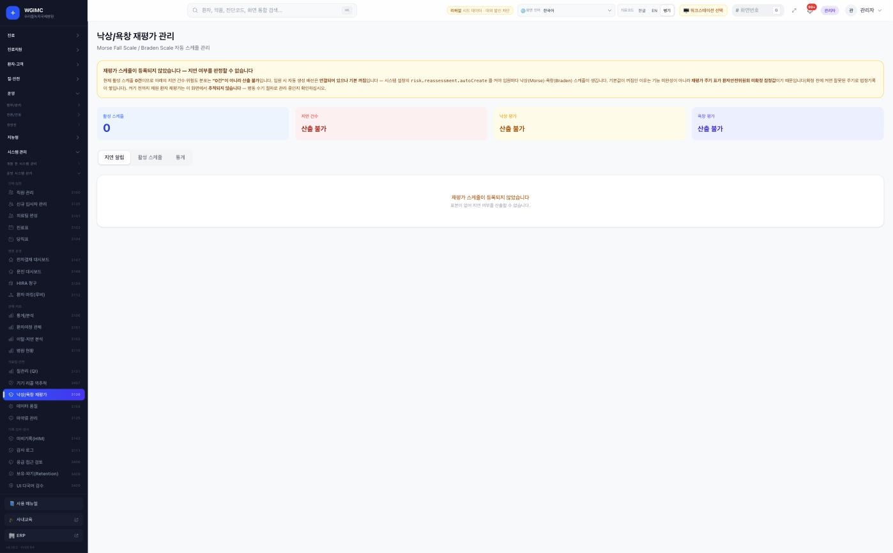

> 재평가 스케줄이 등록되지 않았습니다 — **지연 여부를 판정할 수 없습니다.** 지연 건수는 **"0건"이 아니라 산출 불가**입니다.

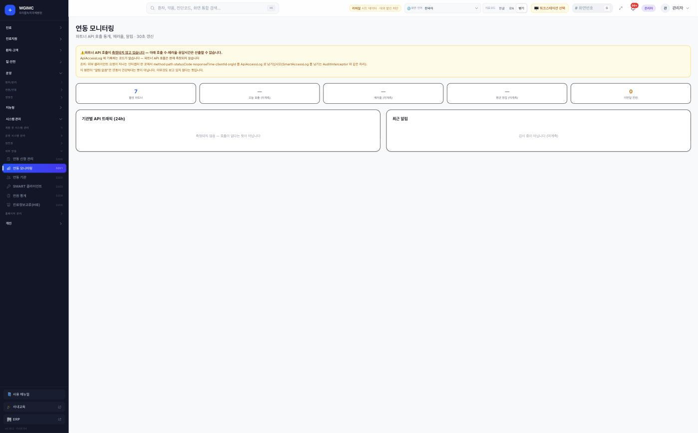

> 파트너 API 호출이 **측정되지 않고 있습니다** … 이 화면의 **"알림 없음"은 연동이 건강하다는 뜻이 아닙니다.**

→ [취지 3 「화면이 모른다고 말하는 아홉 가지 방식」](../overview/02-principles.md#화면이-모른다고-말하는-아홉-가지-방식)

### 배선되지 않은 기능은, 배선되지 않았다고 말한다

화면은 있는데 뒤가 아직 연결되지 않은 기능이 있습니다. 이 설치본은 그런 자리마다 **"동작하는 것처럼 보이지만 동작하지 않는다"** 를 먼저 적습니다.

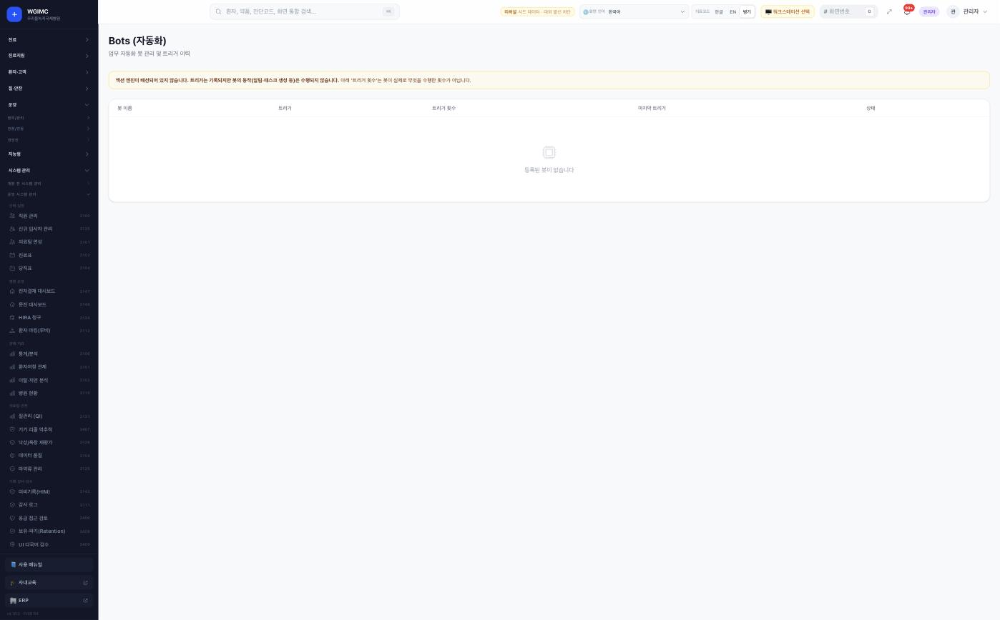

> **액션 엔진이 배선되어 있지 않습니다.** 트리거는 기록되지만 봇의 동작은 수행되지 않습니다. **"트리거 횟수"는 봇이 실제로 무엇을 수행한 횟수가 아닙니다.**

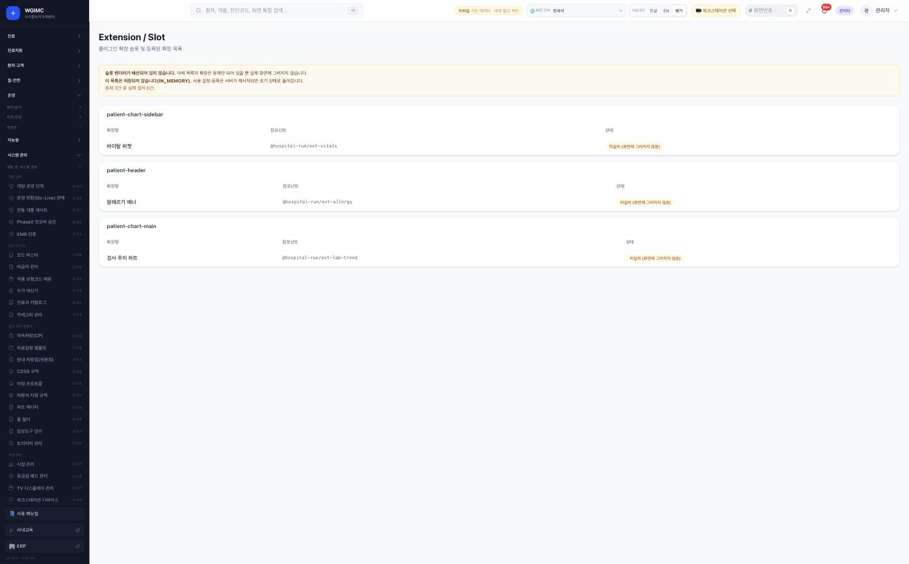

> **슬롯 렌더러가 배선되어 있지 않습니다** … 등재 3건 중 **실제 설치 0건**. 이 목록은 저장되지 않습니다(메모리 상태).

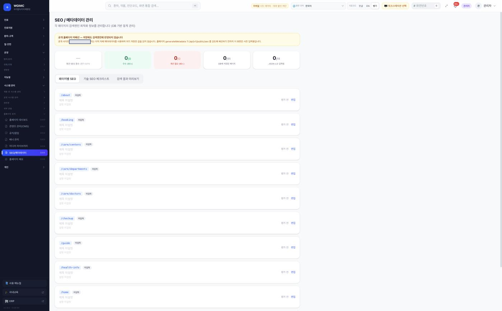

홈페이지 관리의 SEO · 배너 화면은 **「공개 홈페이지 미배선 — 저장해도 공개 사이트에 반영되지 않습니다」** 띠를 겁니다([배너 화면](../assets/screens/his-system-admin-homepage-banners.png)). 메뉴 관리는 "등록된 메뉴가 없습니다. **현재 코드에 하드코딩된 메뉴가 사용됩니다**"라고 적고([메뉴 관리](../assets/screens/his-system-admin-menus.png)), UI 다국어 검수는 "**이 화면은 현황 관측용입니다 — 화면에서 코드 정본을 쓰지 않습니다**"라고 적습니다([다국어 검수](../assets/screens/his-system-admin-ui-locale.png) · 검수 완료 **0 / 14,234**).

> **저장 버튼이 눌린다는 것과 그 값이 어디에 쓰인다는 것은 다른 사실입니다** → [DESIGN-HISTORY 「만들었다 ≠ 동작한다」](../DESIGN-HISTORY.md)

### 인증 · 규정 화면은 자기 수치의 쓰임새를 제한한다

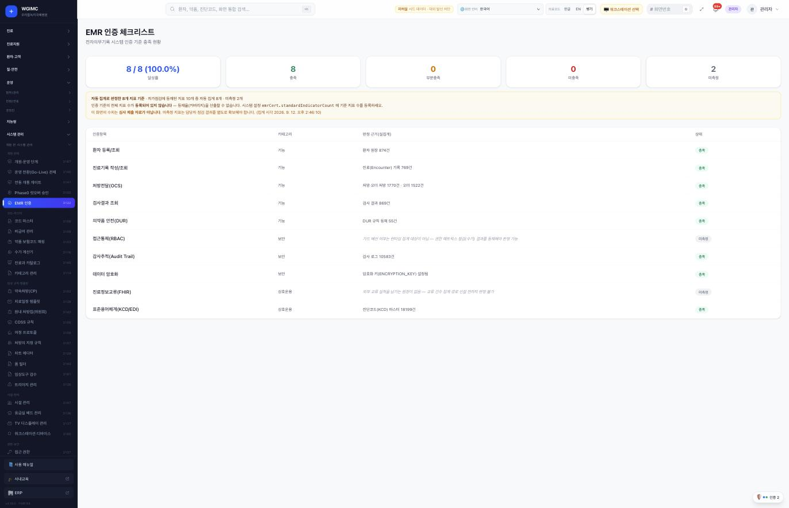

EMR 인증 체크리스트는 **8 / 8 (100.0%)** 이지만, 바로 아래에 두 줄을 답니다 — "**자동 집계로 판정한 8개 지표 기준** · 등재된 지표 10개 중 자동 집계 8개 · 미측정 2개", 그리고 **"이 화면의 수치는 심사 제출 자료가 아닙니다."** 판정 근거 칸에는 실집계(환자 원장 874건 · 진료 기록 769건 · 감사 로그 10,583건)가 붙고, 집계로 판정할 수 없는 두 항목(접근통제 · 진료정보교류)은 **`미측정`** 입니다. 100% 를 **분모와 쓰임새까지** 붙여서 말합니다.

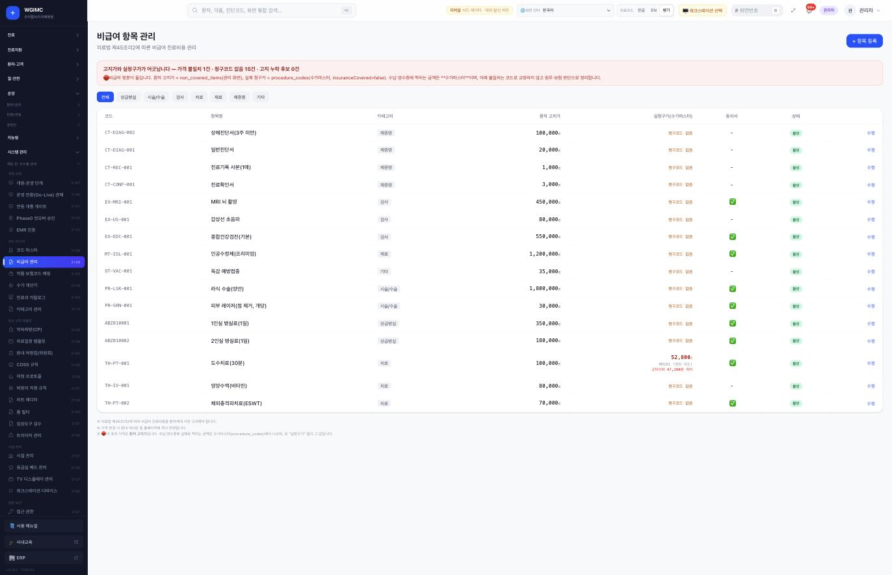

비급여 관리는 맨 위에 **"고지가와 실청구가가 어긋납니다 — 가격 불일치 1건 · 청구코드 없음 15건"** 을 겁니다. 환자에게 알린 가격과 실제 청구 코드가 다른 자리를 **숨기지 않고 먼저 셉니다.**

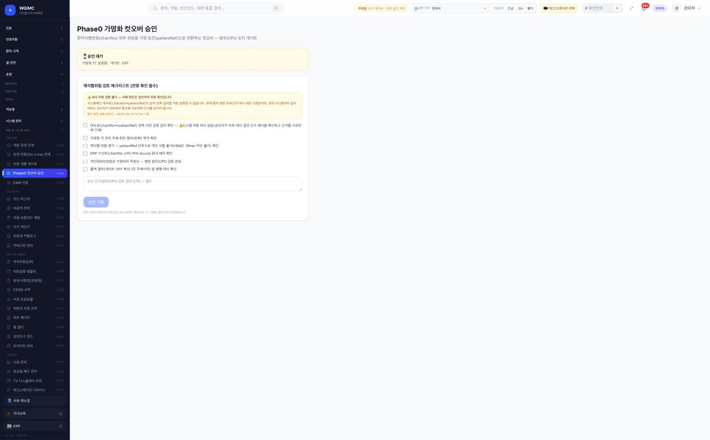

환자식별번호를 가명 토큰으로 바꾸는 컷오버는 **"대사 자동 검증 불가 — 아래 확인은 승인자의 외부 확인입니다"** 라고 적고, 체크리스트 6개와 법무/CPO 승인 근거를 필수로 받습니다. **시스템이 확인하지 못하는 것을 사람의 확인으로 대체한다는 사실을 화면에 적습니다.**

### 개원 전 기준 — 처방 규칙 · 프로토콜 · 시설

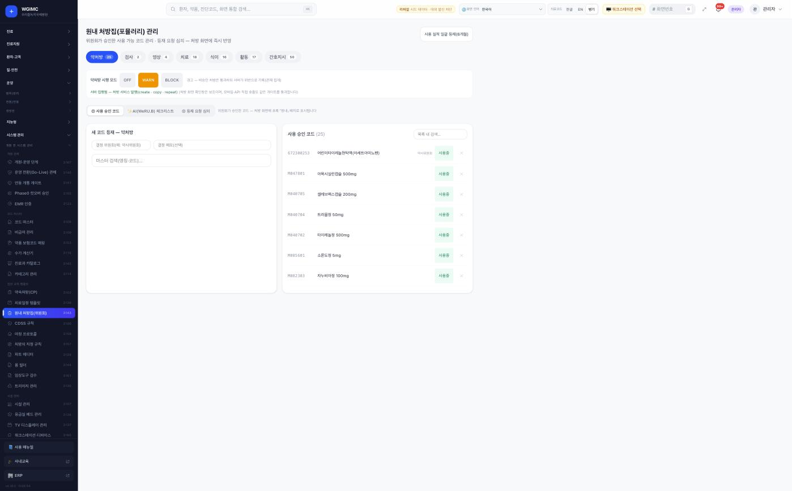

원내 처방집은 위원회가 승인한 코드만 처방 화면에 올리고, 시행 모드를 **`OFF` · `WARN` · `BLOCK`** 세 단계로 둡니다(이 설치본은 `WARN`). [안전 게이트](#안전-게이트--끔--경고--차단-그리고-위반-0을-읽는-법)와 같은 세 단계입니다. [CDSS 규칙](../assets/screens/his-system-admin-cdss-rules.png)은 17개가 모두 활성인데 **규칙마다 이번달 적용 횟수 0** 을 그대로 보여 주고, [약속처방](../assets/screens/his-system-admin-order-sets.png)은 26개를 초안 → 승인대기 → 승인 → 활성 → 폐기로 나눕니다.

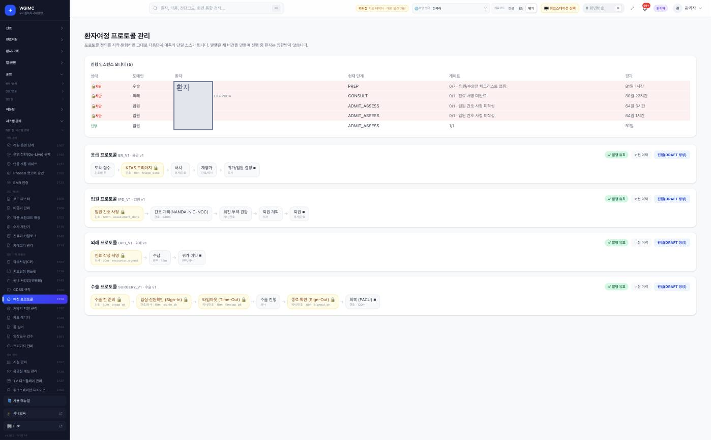

환자여정 프로토콜은 응급 · 입원 · 외래 · 수술 단계마다 **게이트**(🔒 표시 — 수술 전 체크리스트 · 진료 서명 · 입원 간호 사정)를 둡니다. 위쪽 진행 모니터에 **5건 중 4건이 `차단`** 으로 떠 있고, 무엇에 막혔는지(0/7 입원/수술전 체크리스트 없음)와 경과 시간이 붙습니다. 발행은 새 버전을 만들며, **진행 중 환자는 영향받지 않습니다.**

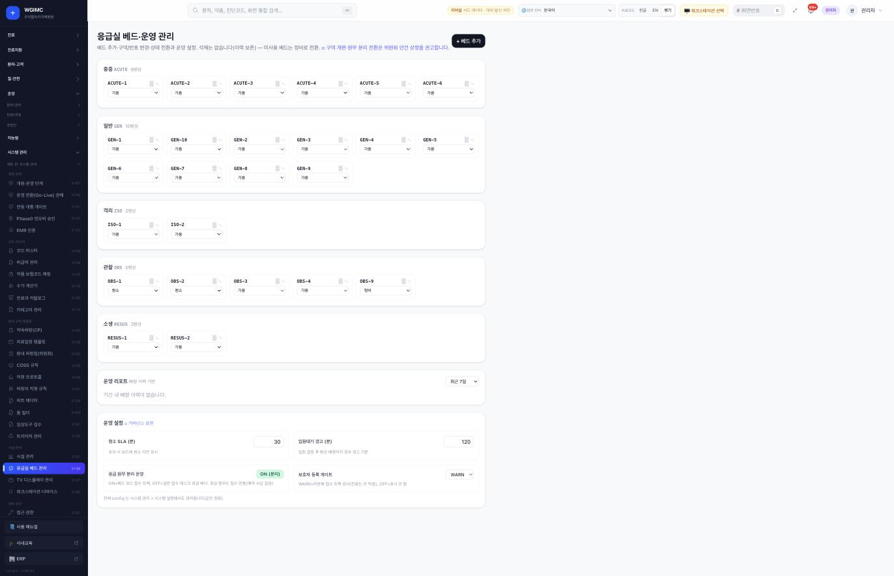

응급실 베드 관리의 부제는 한 줄로 원칙을 적습니다 — **"삭제는 없습니다(이력 보존) — 미사용 베드는 정비로 전환."** [시설 관리](../assets/screens/his-system-admin-facility.png)는 57병상과 수술실 5를 그리면서도 "시설 마스터가 등록되어 있지 않습니다 — **등록 기능이 만들어지지 않아 빈자리가 보이는 것이 정상입니다**"라고 적습니다.

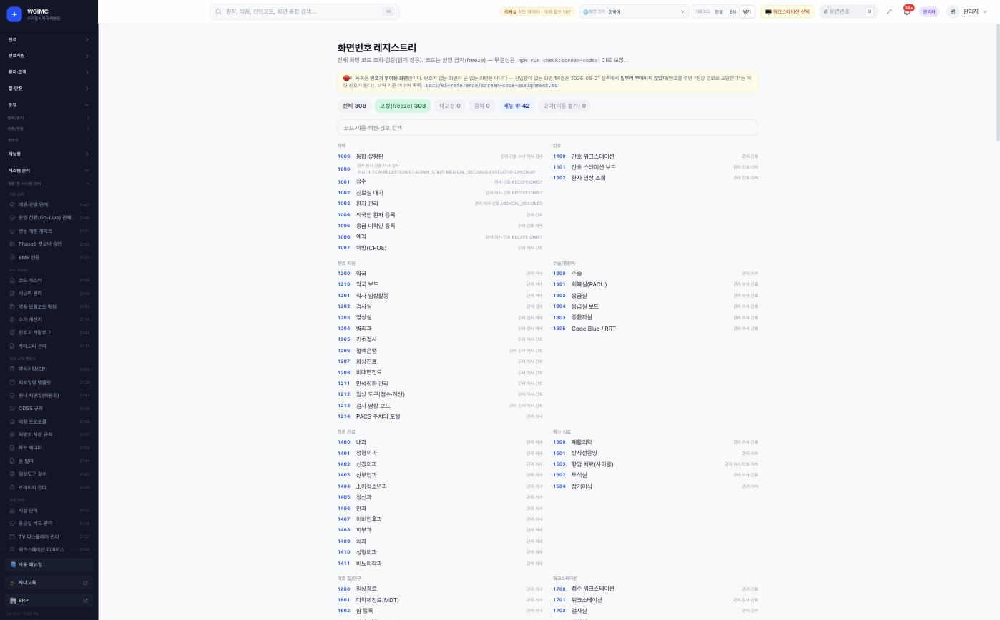

화면번호는 **308개 전부 고정(freeze)** · 미고정 0 · 중복 0 · 메뉴 밖 42 이고, 무결성은 CI 가 봅니다. [수치 표시·반올림 정책](../assets/screens/his-system-admin-numeric-policy.png)은 활력징후 단위를 **UCUM 과 LOINC 코드**로 묶고, 🔒 법정 · 안전 정책(검사 · 용량)은 **화면에서 바꿀 수 없게** 잠가 둡니다.

### 관제 · 지표 — 조치가 필요한 것부터 센다

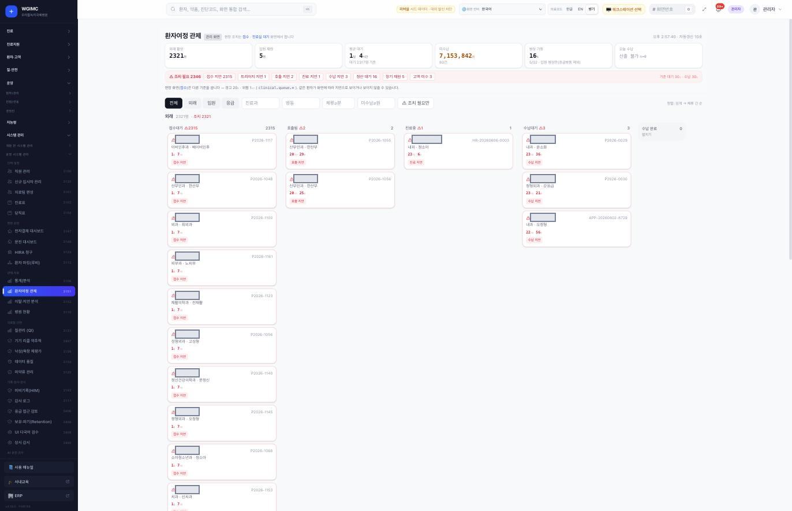

환자여정 관제는 외래 활성 2,321명 위에 **조치 필요 2,346** 을 사유별로 쪼갭니다 — 접수 지연 2,315 · 트리아지 지연 · 호출 지연 · 진료 지연 · 수납 지연 · 정산 지연 · 장기 재원 · 고객 미수. 그리고 "**현장 화면(접수)은 다른 기준을 씁니다**"라고 기준이 다르다는 것을 머리에 밝힙니다.

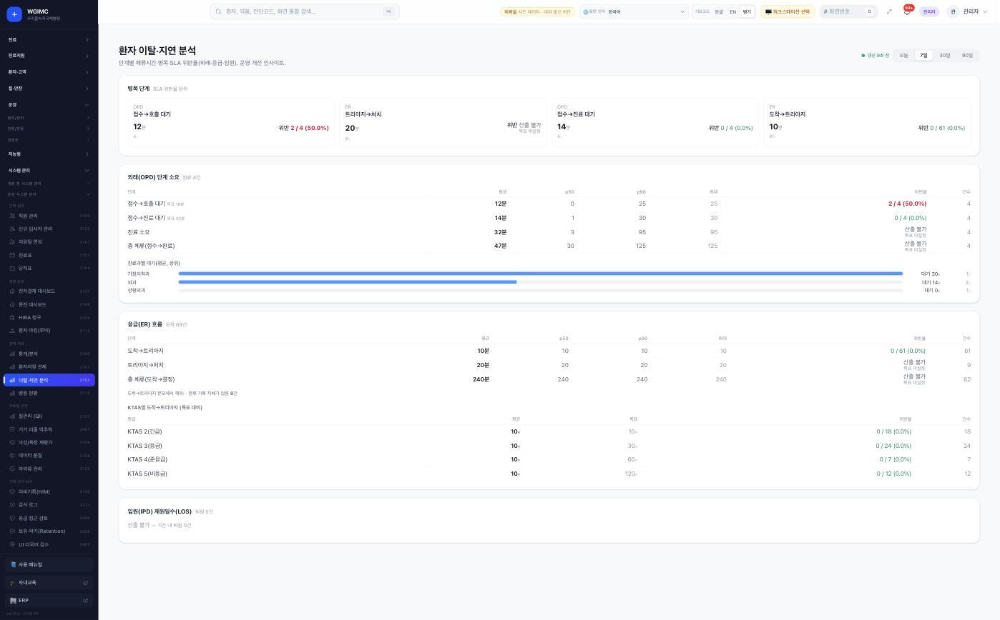

이탈·지연 분석은 단계별 체류시간을 **p50 · p90 · 최대**로 내고 SLA 위반율을 `2 / 4 (50.0%)` 처럼 분모와 함께 적습니다. **목표가 정해지지 않은 구간은 위반율을 `산출 불가(목표 미설정)`** 로 둡니다.

그 밖에 [질관리 QI](../assets/screens/his-system-admin-qi.png)(7탭 · 지표마다 분모) · [감사 로그](../assets/screens/his-system-admin-audit.png)(전체 143,036 = **내부 10,610 + 외부 앱 132,426** 으로 나눠 셈) · [병원 현황](../assets/screens/his-system-admin-status.png) · [통계/분석](../assets/screens/his-system-admin-analytics.png) · [전자결재](../assets/screens/his-system-admin-approvals-dashboard.png) · [문진 대시보드](../assets/screens/his-system-admin-questionnaire-dashboard.png)(작성률 **0 / 2** · 만료 2)가 들어왔습니다.

> 🔴 가림: 감사 로그의 **접속 IP 열** · 환자여정 관제의 환자명 16건 · 환자 마킹의 환자명 · 진료표의 의사 열 · 전원 통계의 **협력 기관명 2건**. 워크스테이션·디바이스 설정 화면은 **원내 프린터 · 장비의 주소와 포트가 화면 전체에 있어** 공개 자료에 싣지 않았습니다.

### AI 화면이 스스로 긋는 선

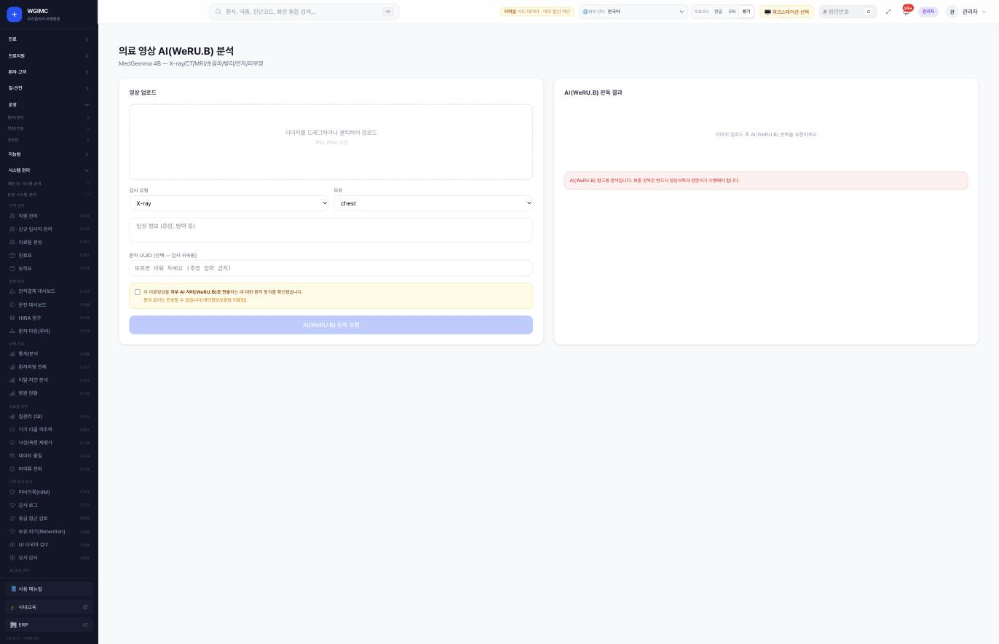

영상 AI 화면에는 세 가지 선이 있습니다 — ① 외부 AI 서버로 보내기 전 **환자 동의 확인 체크박스**가 없으면 요청 버튼이 켜지지 않고 ② 환자 UUID 칸은 **"모르면 비워 두세요 (추정 입력 금지)"** 이며 ③ 결과 칸에 **"최종 판독은 반드시 영상의학과 전문의가 수행해야 합니다."**

[AI 상담](../assets/screens/his-system-admin-ai-counseling.png)은 "보조 도구입니다 — 전문 상담이 필요하면 정신건강의학과 전문의 또는 **자살예방상담전화(1393)**", [의료법 AI](../assets/screens/his-system-admin-medical-law.png)는 "법률 분석은 **참고용** — 실제 법적 판단은 전문 법률가에게", [회의 분석](../assets/screens/his-system-admin-ai-meeting.png)은 "**이 병원이 제출한 작업만** 표시 — 공용 AI 의 다른 출처 작업 47건은 이 화면에서 제외"라고 적습니다. [AI 번역](../assets/screens/his-system-admin-ai-translate.png)은 7개 언어입니다. → [취지 1 「AI 는 보조, 판단은 사람」](../overview/02-principles.md#1-ai-는-보조-판단은-사람)

### 검진권과 홈페이지 — 운영 화면의 나머지

[검진권 정책](../assets/screens/his-system-admin-voucher-settings.png)은 "**법정 하한/상한 내에서만 조정 — 위반 시 저장 거부, 변경은 4-eyes**", [검진권 딜러](../assets/screens/his-system-admin-voucher-distributors.png)는 "모두 **외국인환자 한정**"과 "비밀번호는 딜러가 **인증코드로 직접 설정**(관리자가 정하지 않음)"을 적습니다. [목록](../assets/screens/his-system-admin-voucher-list.png) · [발행·조회](../assets/screens/his-system-admin-voucher-issue.png)(시리얼 · 해시체인 · 앵커)도 들어왔습니다.

[홈페이지 대시보드](../assets/screens/his-system-admin-homepage.png)는 콘텐츠 133건 가운데 **"공개 화면이 읽는 값이 비어 있는 9건 — 그 자리는 폴백으로 그려집니다"** 를 따로 셉니다. [CMS](../assets/screens/his-system-admin-hospital-info.png) · [팝업](../assets/screens/his-system-admin-homepage-popups.png) · [미디어](../assets/screens/his-system-admin-homepage-media.png) · [위원회 GLD](../assets/screens/his-quality-admin-gld.png)(재검토 기한 경과 2) · [진료과 카탈로그](../assets/screens/his-system-admin-dept-catalog.png) · [폼 빌더](../assets/screens/his-system-admin-forms.png) · [TV 디스플레이](../assets/screens/his-system-admin-displays.png)(28일 무접속 단말 경고) · [대시보드 템플릿](../assets/screens/his-system-admin-dashboard-templates.png)(위젯마다 볼 수 있는 역할) · [당직표](../assets/screens/his-system-admin-duty-schedule.png) · [진료표](../assets/screens/his-system-admin-clinic-schedule.png) · [기기 리콜 역추적](../assets/screens/his-system-admin-device-recall.png)(GTIN · 로트 · 일련번호) · [환자 마킹](../assets/screens/his-system-admin-patient-flags.png)(비표준 내부 표시임을 부제에) · [전원 통계](../assets/screens/his-system-admin-transfer-stats.png) · [중환자실 워크스테이션](../assets/screens/his-support-workstation-icu.png)("비어 있는 것은 할 일이 없다는 뜻이 아닙니다")도 함께 있습니다.

### 코드 마스터 — 기관이 받아 와서 채우는 자리

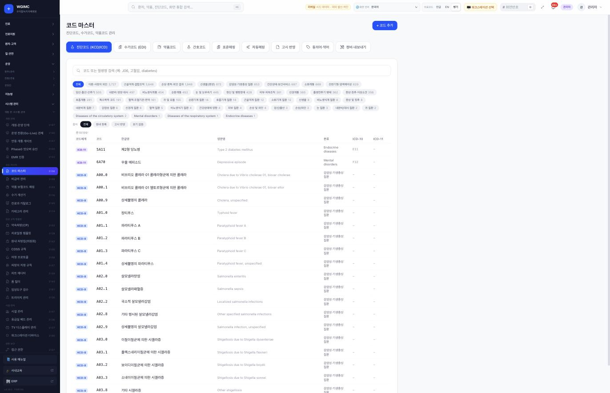

진단코드(KCD/ICD) · 수가코드(EDI) · 약품코드 · 간호코드와 그 사이의 표준 매핑을 관리합니다. 이 설치본에는 진단코드가 **18,199건** 들어 있고, 분류(감염성·기생충성 질환 · 신생물 · 순환계통 …)마다 건수가 붙습니다.

행마다 **코드체계 배지**가 있습니다. 대부분 **`KCD-8`** 이고, 일부 **`ICD-11`**(예: `5A11` 제2형 당뇨병)이 ICD-10 매핑(`E11`)과 함께 있습니다. [9장 「코드 마스터」](../overview/09-terms.md)가 적은 **"KCD 제9차 개정이 2026-01-01 부터 시행 중인데 기준 버전 코드의 표기는 제8차"** 가 화면에서 그대로 확인됩니다.

> 🔴 **코드 마스터는 이 저장소에도 생태계 소스에도 없습니다.** 나라마다 다르고 각 나라 공공기관이 배포 조건을 정하므로, **구축 기관이 직접 받아 반입합니다**([THIRD_PARTY §4](../THIRD_PARTY.md#4-코드-마스터기준-데이터)). 이 화면은 그 반입물을 넣고 관리하는 자리입니다.

> ### ⚠️ 이 설치본의 결정 수가 체크리스트와 다릅니다
> [사람 결정 체크리스트](../checklist/decisions.md)는 기준 커밋(HIS `v4.18.0` · `e9d3039...` · 2026-09-11 추출)에서 **합계 56**(허가권자 17 · 원내 위원회 38 · 직원 1) · 개시 전 필수 11 을 읽었습니다.
> 캡처한 설치본 화면(2026-09-12)은 같은 `v4.18.0` 표기인데 **합계 61**(허가권자 19 · 원내 위원회 41 · 직원 1) · 개시 전 필수 15 입니다.
> **어느 쪽이 맞다고 정하지 않습니다.** 버전 문자열이 같아도 설치본의 커밋이 기준 커밋보다 나중일 수 있고, 기관이 항목을 더했을 수도 있습니다. 원인을 확인한 뒤 고칩니다.
> — 같은 화면의 Go-Live 필수 항목 수(31)는 [Go-Live 체크리스트](../checklist/go-live.md)의 `개시 차단 31` 과 **일치합니다.**

> ### ⚠️ 「시스템 설정」이라는 이름의 화면이 둘입니다
> `/admin/config` 는 **전체 구성 파라미터 키·값 목록**(`ui.*` 표시 형식과 폴링 주기, `hospital.*` 국가·로케일·기관 정보 등)이고, 구축 가이드와 Go-Live 레지스트리가 가리키는 화면입니다.
> `/admin/ai-settings` 는 **병원 기본 정보 · AI 서버 연결 상태 · AI 브리핑 스위치 · 스킬 품질**을 다루며, **왼쪽 메뉴의 `시스템 설정` 은 이쪽으로 갑니다.**
> 둘 다 제목이 「시스템 설정」입니다. 가이드를 따라 "시스템 설정 화면에서 AI 스위치를 끄세요"를 하려는 사람은 **메뉴를 눌러서는 다른 화면에 도착합니다.** AI 스위치의 정본이 어느 쪽인지는 `확인 필요(따라가기)` 입니다. (2026-09-12 두 화면 모두 확인)

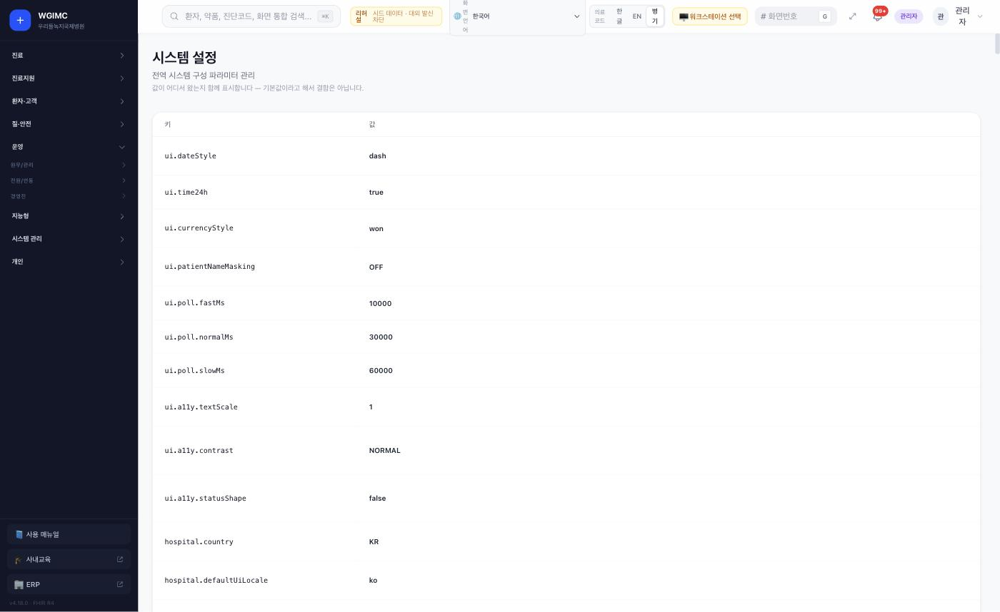

`/admin/config` 는 키와 값을 그대로 늘어놓고, 머리글이 **"값이 어디서 왔는지 함께 표시합니다 — 기본값이라고 해서 결함은 아닙니다"** 라고 적습니다. 표시 형식(`ui.dateStyle` · `ui.time24h` · `ui.currencyStyle`) · 폴링 주기 · 접근성(`ui.a11y.*`) · 환자명 마스킹 · 기관 국가와 기본 로케일(`hospital.country` · `hospital.defaultUiLocale`) 같은 것이 한 목록에 있습니다.

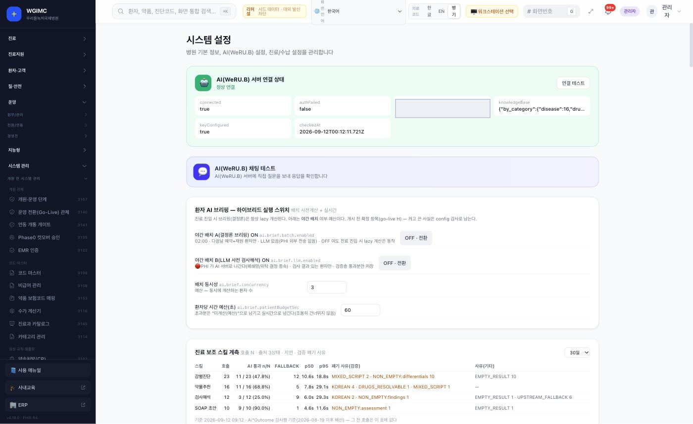

`/admin/ai-settings` 는 AI 쪽입니다. 서버 연결 상태(연결 여부 · 인증 실패 · 키 설정 · 마지막 확인 시각 · 지식베이스 구성 — **주소는 공개 자료에서 가렸습니다**)와 연결 테스트, 그리고 **환자 AI 브리핑의 야간 배치 스위치** 둘이 있습니다. 스위치 설명이 무엇이 나가는지를 분명히 적습니다 — 배치 A(결정론)는 **"LLM 없음(PHI 외부 전송 없음)"**, 배치 B(LLM 사전 검사해석)는 🔴 **"PHI 가 AI 서버로 나간다(원내/위탁 결정 종속)"**.

> ### 📏 이 화면에 진료 보조 스킬의 실측이 있습니다 (30일 · 표본이 작습니다)
> | 스킬 | 호출 | **AI 통과** | 폴백 | p50 | p95 |
> |---|---:|---:|---:|---:|---:|
> | 감별진단 | 23 | 11 / 23 (47.8%) | 12 | 10.6s | 18.8s |
> | 약물추천 | 16 | 11 / 16 (68.8%) | 5 | 7.8s | 29.1s |
> | 검사해석 | 12 | **3 / 12 (25.0%)** | 9 | 6.0s | 29.3s |
> | SOAP 초안 | 10 | 9 / 10 (90.0%) | 1 | 4.6s | 11.6s |
>
> "AI 통과"는 **검증층을 통과해 실제로 쓰인 비율**이고, 나머지는 폴백으로 내려간 것입니다. 폐기 사유도 함께 적습니다(`MIXED_SCRIPT` 한글·영문 혼용 · `NON_EMPTY:differentials` 필수 항목 비어 있음 · `EMPTY_RESULT` · `UPSTREAM_FALLBACK`). **AI 가 낸 것을 그대로 쓰지 않고 걸러 낸다는 것이 수치로 보입니다.**
> ⚠️ **표본이 10~23건입니다.** 이 자료가 「모델별 응답 시간 · 처리량 계측이 없다」고 적어 온 것은 그대로 유효합니다. 기관 규모의 계측은 리허설(S7)에서 합니다.

---

### 검수하지 않은 도구를 막지 않는 까닭을 화면이 적는다

GCS · NEWS2 · Morse · Braden · CHA₂DS₂-VASc 같은 임상도구의 수치 · 임계값을 **공식 가이드라인 원문과 대조해 승인**하는 자리입니다(4-eyes 2인 승인). 이 설치본은 **89개 전부 미검증**이고, 화면이 맨 위에 그 사실과 그 뒤의 판단을 함께 적습니다.

> **미검증 임상도구 89개 / 전체 89개 — 사용은 차단되지 않습니다**
> · 미검증 도구도 임상 화면에서 그대로 실행 · 산출됩니다. 「미검증 참조용」 배지만 표시됩니다.
> · 어떤 도구의 사용을 차단할지는 **의료질향상 · 환자안전위원회 판단 영역**이며 이 화면에서 정하지 않습니다.

승인 뒤 정의가 바뀌면 자동으로 `재검수 필요` 로 돌아갑니다. **막을지 말지를 코드가 정하지 않고 위원회로 넘깁니다** → [취지 5](../overview/02-principles.md#5-사람이-정할-것은-화면에서)

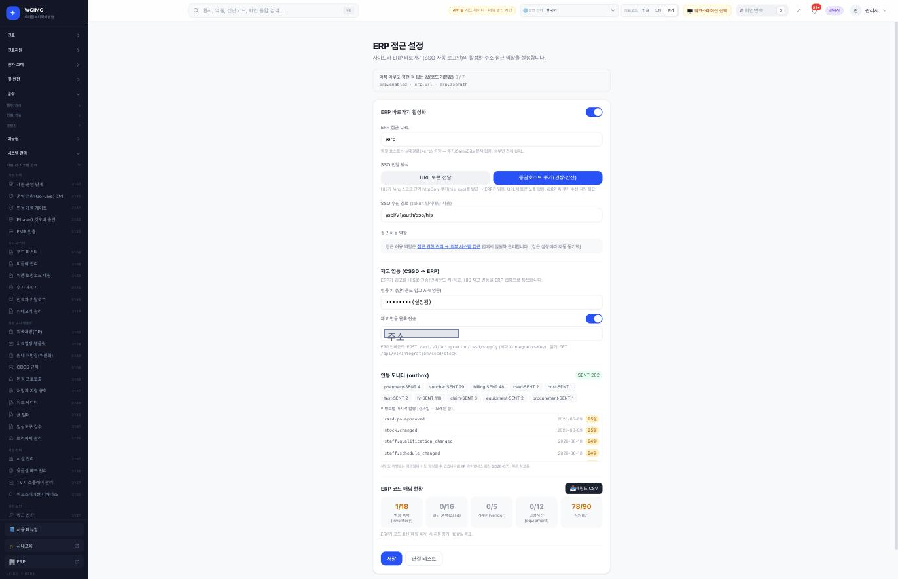

ERP 접근 설정은 맨 위에 **"아직 아무도 정한 적 없는 값(코드 기본값) 3 / 7"** 을 적고, 아래 **ERP 코드 매핑 현황**을 분자/분모로 셉니다 — 품목(inventory) **1/18** · 멸균 품목(cssd) **0/16** · 거래처 0/5 · 고정자산 0/12 · 직원(hr) 78/90. 연동 이벤트는 보냈다(`SENT`)는 기록과 **마지막 발송 뒤 경과일**(94~95일)을 함께 보여 줍니다 → [ERP](erp.md)

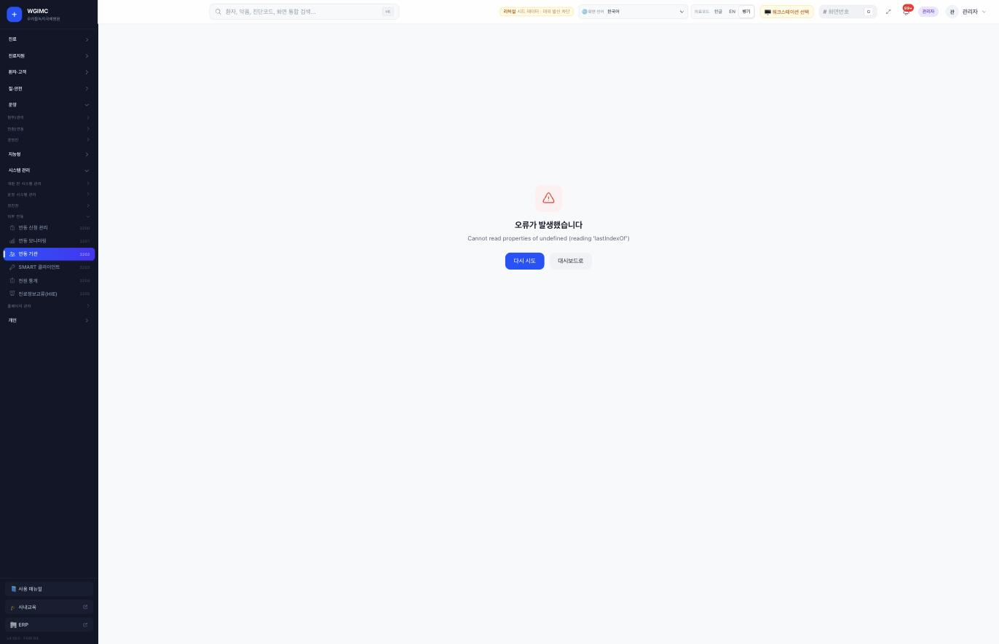

> ⚠️ **관찰** — `연동 기관` 화면은 이 설치본에서 **열리지 않고 오류 화면**을 냅니다(`Cannot read properties of undefined (reading 'lastIndexOf')`, 2026-09-13). 고쳐진 것을 확인하기 전까지 **그대로 적습니다** → [취지 1](../overview/02-principles.md)

---

## 개인 — `personal`

내 설정·복리후생·교육.

| 화면 | 하는 일 |
|---|---|
| `내 행정(ESS)` | 직원 본인의 근무 · 행정 |
| `내 전자인증서` · `내 서명 등록` | 본인 서명 수단 등록 — [sign](sign.md) 이 발급한 인증서를 씁니다 |
| `나의 약속처방` | 자주 쓰는 처방 묶음 |
| `단축키·화면번호` | 화면번호로 바로 가기 |
| `음성 설정 (VoiceEMR)` | 음성 기록 보조 설정 |
| `직원 식단표` | 생활/편의 |

**캡처 자리**

| # | 담을 화면 | 화면 경로 | 파일 |
|---|---|---|---|
| ✅ per-1 | 내 전자서명 인증서 — **여기서는 확인할 수 없다고 말하는 화면** | `/settings/my-certificate` | [`his-personal-settings-my-certificate.png`](../assets/screens/his-personal-settings-my-certificate.png) |
| ✅ per-2 | 음성 설정(VoiceEMR) — 성문 등록과 그 한계 | `/settings/voice` | [`his-personal-settings-voice.png`](../assets/screens/his-personal-settings-voice.png) |
| ✅ per-3 | 내 서명 등록 — **자동 생성한 임시 이미지라고 밝히는 화면** | `/settings/my-signature` | [`his-personal-settings-my-signature.png`](../assets/screens/his-personal-settings-my-signature.png) |
| ✅ per-4 | 내 행정(ESS) — 두 시스템의 연차 기록이 다를 때 | `/ess` | [`his-personal-ess.png`](../assets/screens/his-personal-ess.png) |
| ✅ per-5 | 나의 약속처방 · 단축키·화면번호 · 직원 식단표 | `/settings/my-codes` · `/settings/shortcuts` · `/staff-meal` | [`…-my-codes`](../assets/screens/his-personal-settings-my-codes.png) · [`…-shortcuts`](../assets/screens/his-personal-settings-shortcuts.png) · [`…-staff-meal`](../assets/screens/his-personal-staff-meal.png) |

### 개인 화면 둘이 「모른다」고 말하는 방식

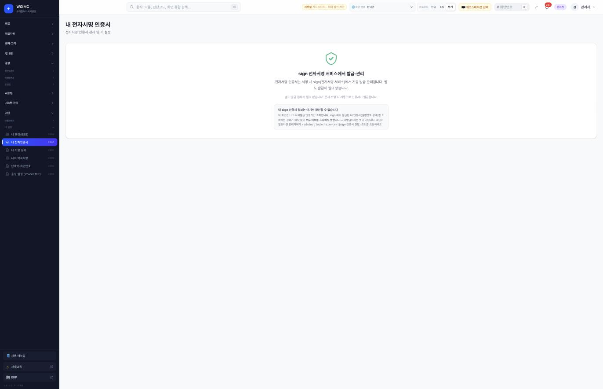

내 인증서를 보러 들어간 화면이 **볼 수 없다고 말합니다.** 그런데 거기서 멈추지 않습니다.

> "이 화면은 HIS 자체발급 인증서만 조회합니다. sign 에서 발급한 내 인증서(일련번호 · 상태)를 조회하는 경로가 아직 없어 **보유 여부를 표시하지 못합니다 — 미발급이라는 뜻이 아닙니다.** 확인이 필요하면 관리자에게 `/admin/blockchain-cert`(sign 인증서 현황) 조회를 요청하세요."

**「없다」와 「모른다」를 나누고, 대신 갈 곳을 알려 줍니다** → [취지 1](../overview/02-principles.md) · [화면이 「모른다」고 말하는 아홉 가지 방식](../overview/02-principles.md#화면이-모른다고-말하는-아홉-가지-방식)

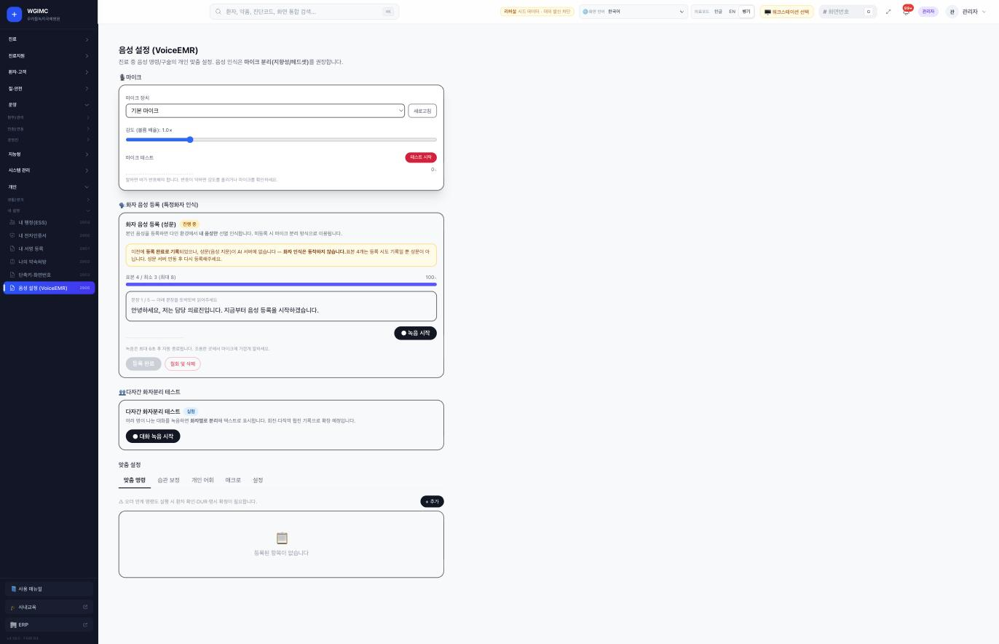

음성 기록 보조(VoiceEMR)의 화자 등록 화면은 **기록과 실물을 구분합니다.**

> "이전에 **등록 완료로 기록**되었으나, 성문(음성 지문)이 AI 서버에 있지 않습니다 — **화자 인식은 동작하지 않습니다.** 표본 4개는 등록 **시도** 기록일 뿐 성문이 아닙니다."

"등록했다"는 기록이 남아 있어도 **그것이 동작한다는 뜻은 아니라는 것**을 화면이 스스로 말합니다 → [DESIGN-HISTORY 「만들었다 ≠ 동작한다」](../DESIGN-HISTORY.md). 다자간 화자분리는 `실험` 배지를 달고 있습니다.

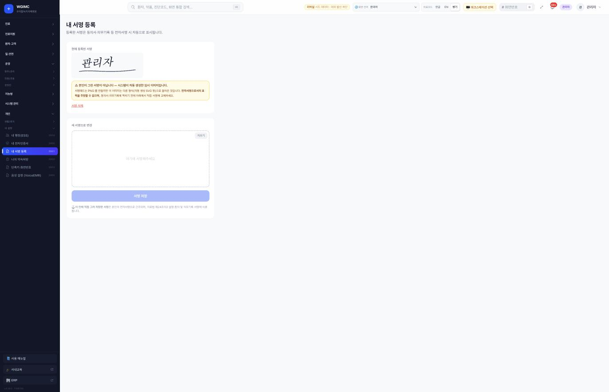

서명 등록 화면은 지금 등록된 서명 아래에 경고를 붙입니다.

> ⚠️ **본인이 그린 서명이 아닙니다 — 시스템이 자동 생성한 임시 이미지입니다.** 전자서명으로서의 효력을 주장할 수 없으며, 동의서 · 의무기록에 찍히기 전에 아래에서 직접 서명해 교체하세요.

"서명이 있다"는 상태와 **"본인이 서명했다"는 사실을 섞지 않습니다.**

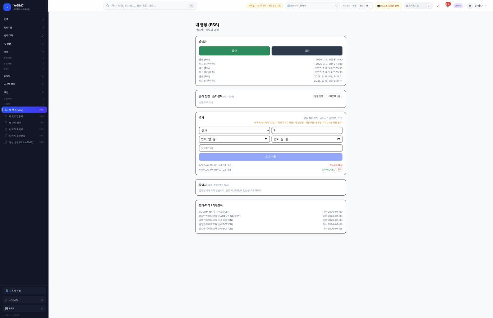

ESS 의 휴가 칸은 **연차 잔여 17일(급여시스템 ERP 기준)** 옆에 이렇게 적습니다 — **"HIS 연차잔여 12일 — 기록이 서로 다릅니다. 신청은 12일까지만 승인됩니다(인사팀 확인 필요)."** 두 시스템의 값이 다를 때 한쪽을 조용히 고르지 않고, **적은 쪽으로 막고 사람에게 확인을 넘깁니다** → [취지 2](../overview/02-principles.md#2-출처를-말한다)

---

## 이 장이 말하지 않는 것

- **화면이 있다는 것이 동작한다는 뜻은 아닙니다.** 메뉴 구성표는 코드의 메뉴 정의를 읽은 것이고, 실운영 검증이 아닙니다.
- **연결은 따로 봅니다.** 이 화면들이 다른 시스템과 실제로 맞물리는지는 [연결 상태](../RELEASES/draft/compatibility.md)에 있고, 지금 **`검증됨` 은 0** 입니다.
- **기관마다 보이는 메뉴가 다릅니다.** 관리자가 메뉴 관리 화면에서 숨기거나 바꾸거나 더할 수 있습니다.
- 화면 안의 항목 하나하나(버튼 · 서식 · 규칙)는 이 장에서 다루지 않습니다. 캡처가 들어오면 화면마다 짧은 설명을 붙입니다.
