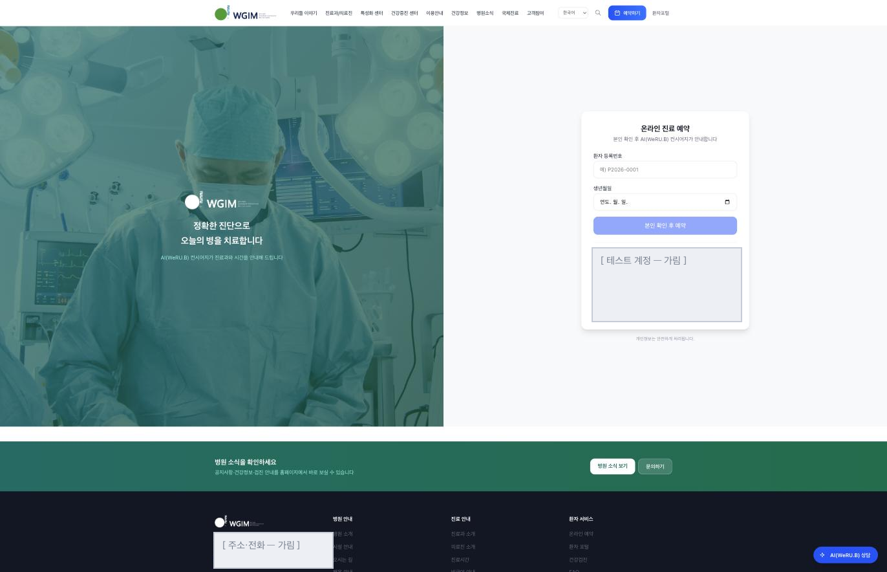

# 공개 홈페이지 화면

> 🟡 **초안 — 캡처 넣는 중** · [화면 소개 목차](README.md) · [공개 홈페이지 시스템 구성서](../systems/homepage.md)
> 계층 환자 접점 · 버전 `v4.18.0` · 구현 상태 `운영` · 화면 50 · 기준: [통합 릴리즈 초안](../RELEASES/2026.09/manifest.md)(계측일 2026-09-11)

> **EN** — The hospital's public website: hospital, clinic and health-checkup information, with an **AI booking helper** that proposes candidate departments from symptoms — it proposes, people decide. The patient portal is entered from here, and the content (notices, banners, media, SEO) is managed from inside the HIS. One screen is captured, online appointment booking, with four further slots **not filled yet**. Captures are taken on **synthetic hospital data**, with institution-identifying information, secrets and infrastructure details masked before publication ([capture rules](../assets/screens/README.md)).

---

## 무엇을 하는 화면인가

병원의 공개 웹사이트입니다. 병원 · 진료 · 검진 안내를 보여 주고, **AI 예약 도우미**가 증상에서 진료과 후보를 제안합니다. 환자 포털 로그인도 여기서 들어갑니다. 내용(공지 · 배너 · 미디어 · SEO)은 HIS 의 `홈페이지 관리` 에서 관리합니다.

## 온라인 진료 예약

공개 홈페이지 위쪽에 병원 안내 메뉴(우리들 이야기 · 진료과/의료진 · 특성화 센터 · 건강증진 센터 · 이용안내 · 건강정보 · 병원소식 · 국제진료 · 고객참여)와 **언어 선택** · `예약하기` · `환자포털` 이 섭니다.

예약은 **환자 등록번호와 생년월일로 본인을 확인한 뒤** 진행하고, 화면이 그다음을 미리 알립니다 — **"본인 확인 후 AI(WeRU.B) 컨시어지가 안내합니다."** 오른쪽 아래에 상담 버튼이 떠 있습니다.

> 회색으로 덮인 자리 두 곳은 **기관 주소 · 대표전화**(공개 자료에 싣지 않습니다)와 **테스트 계정 목록**입니다.

## 캡처 자리

| # | 담을 화면 | 파일 | 상태 |
|---|---|---|---|
| ✅ homepage-1 | 온라인 진료 예약 | [`homepage-booking.png`](../assets/screens/homepage-booking.png) | ✅ |
| 📷 homepage-1b | 예약 — AI 예약 도우미 대화와 진료과 후보 | `homepage-booking-ai.png` | ⬜ |
| 📷 homepage-2 | 건강검진 — 검진 프로그램 목록과 수용 현황 | `homepage-checkup-programs.png` | ⬜ |
| 📷 homepage-3 | 진료과 · 의료진 안내 | `homepage-departments.png` | ⬜ |
| 📷 homepage-4 | 환자 포털 로그인과 본인 정보 조회 | `homepage-portal-login.png` | ⬜ |

## 알아 둘 것

공개 사이트이므로 **기관 식별 정보가 화면 전체에 나옵니다.** 캡처는 데모 병원 이름(**위루비병원**)으로 설정하고 가상 내용으로 찍습니다.

- 이 시스템이 다른 시스템과 실제로 맞물리는지는 [연결 상태](../RELEASES/2026.09/compatibility.md)에서 봅니다 — 어떤 연결이 `검증됨` 이고 언제 확인했는지는 그 표의 **상태 칸 · 확인일 칸**에 있습니다(합계도 그 표 한 곳에만 둡니다). 나머지 `구현·미검증` 은 "양쪽 코드가 맞물려 있다"는 뜻이지 동작한다는 뜻이 아닙니다.
- 설치 요구사항 · 주요 설정 · 한계는 [공개 홈페이지 시스템 구성서](../systems/homepage.md)에 있습니다.
- 캡처를 넣는 규칙은 [캡처 안내](../assets/screens/README.md), 사람 확인은 [캡처 대장](../assets/CAPTURE-LEDGER.md)에 있습니다.
