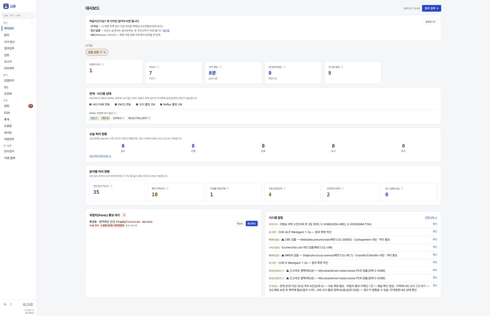
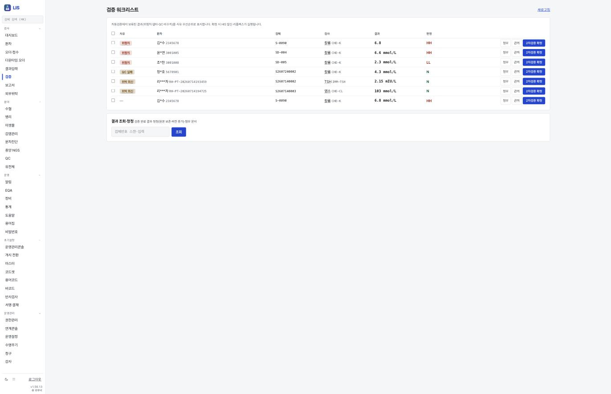
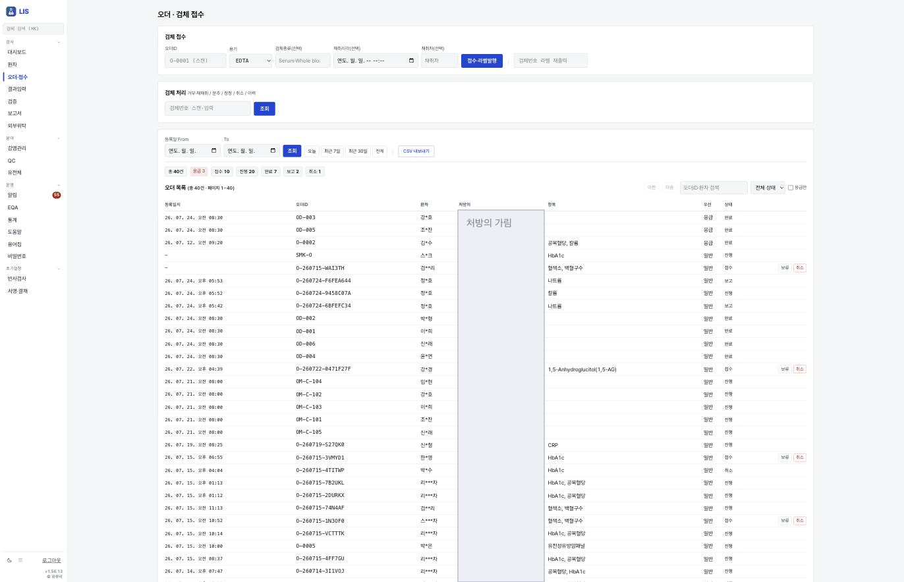
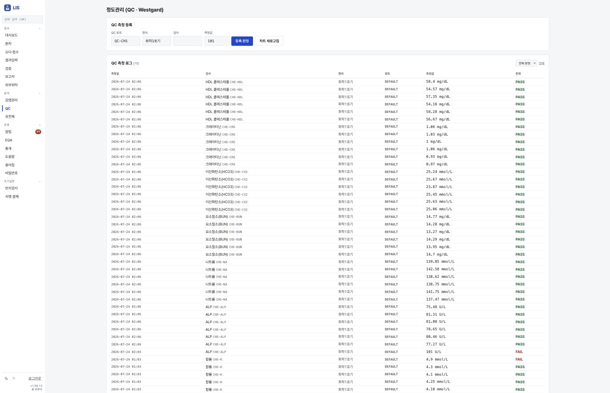
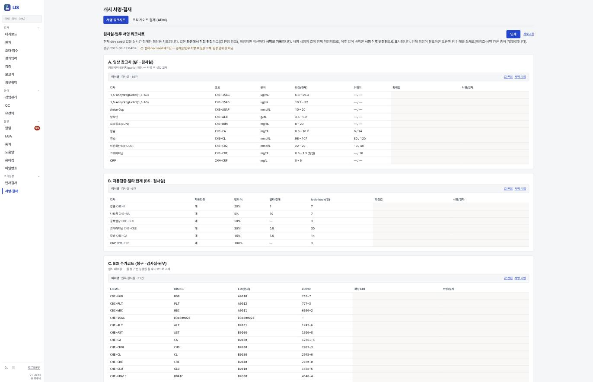

# LIS 화면

> 🟡 **초안 — 캡처 넣는 중** · [화면 소개 목차](README.md) · [LIS 시스템 구성서](../systems/lis.md)
> 계층 임상 부서 · 버전 `1.56.18` · 구현 상태 `파일럿` · 화면 41 · 기준: [통합 릴리즈 초안](../RELEASES/draft/manifest.md)(계측일 2026-09-11)

**EN** — Laboratory information system. Screens are captured on **synthetic hospital data**; institution-identifying information, secrets and infrastructure details are masked before publication ([capture rules](../assets/screens/README.md)).

---

## 무엇을 하는 화면인가

진단검사 · 미생물 · 병리 · 수혈 · 유전체 검사정보시스템입니다. HIS 의 검사 오더를 FHIR R4 로 가져가고, 결과를 확정해 되돌려 보냅니다.

## 화면

LIS 는 **연계 상태를 대시보드 맨 위에** 둡니다 — `HIS FHIR 연동` · `PACS 연동` · `오더 폴링 ON` · `Reflex 폴링 ON`. 화면이 그 아래 한 줄을 답니다: **"연동이 꺼져 있으면 자격증명 설정(운영자) 확인이 필요합니다."**

그 옆에 Reflex 양방향 오더 상태(승인 · 거절 · 반려취소 · `REJECTED_KEPT`)가 서고, 아래에 **위험치(Panic) 통보 대기**와 시스템 알림이 있습니다. 이 설치본의 알림에는 **MDRO 검출**(CRE · MRSA — 격리 필요) · **법정감염병 신고 대상**(결핵 PCR 검출) · QC 위반(Westgard 규칙 — **결과 확정 차단**) · 위탁 지연이 떠 있고, **연계 운영 이상**(DLQ 격리 · 오더 폴링 정체 · 위험치 통보 미확인)도 한 줄로 요약됩니다.

자동검증에서 **보류된 결과만** 사유 우선순위로 올라옵니다(위험치 · 델타 · QC 비수치 · 위탁 회신). 행마다 검체 · 검사 · 결과 · **판정 배지**(`HH` · `LL` · `N`)가 붙고, `2차검증 확정` 으로 닫습니다. 화면이 그 결과를 미리 알립니다 — **"확정 시 HIS 알림 · 리플렉스가 실행됩니다."**

> 👤 **LIS 는 목록에서 환자 이름을 스스로 가립니다**(김\*수 · 리\*\*\*자). 검사실 화면에 이름 전체가 필요하지 않다는 판단입니다.

위쪽은 **검체 접수**(오더ID 스캔 · 용기 · 검체종류 · 채취시각 · 채취자 → `접수·라벨발행`)이고, 그 아래가 **검체 처리**(거부·재채취 / 분주 / 정정 / 취소 / 이력), 맨 아래가 오더 목록입니다. 이 설치본은 총 40건 — **응급 3 · 접수 10 · 진행 20 · 완료 7 · 보고 2 · 취소 1** 로 상태마다 분모가 함께 섭니다.

> 👤 **처방의 이름은 공개 자료에서 가렸습니다.** 환자명은 LIS 가 스스로 가리지만(김\*수), **처방의 칸은 가리지 않습니다** — 검사실이 누구에게 되물어야 하는지 알아야 하기 때문입니다.

QC 측정을 등록하면 **그 자리에서 `PASS`/`FAIL` 판정**이 붙습니다. 측정 로그 75건이 검사 · 장비 · 로트 · 측정값과 함께 남고, `FAIL` 이 난 항목은 [검증 워크리스트](#화면)에 **`QC 실패` 사유로 올라와 결과 확정을 막습니다.** 품질 판정이 화면 하나에서 끝나지 않고 **다음 화면의 게이트로 이어집니다.**

🔴 **이 화면이 이 자료의 취지를 가장 짧게 보여 줍니다.** 임상 참고치(정상범위·위험치) · 자동검증 델타 한계 · EDI 수가코드 매핑을 **한 장에 모아 놓고, 섹션마다 사람이 서명**하게 합니다. 화면이 자기 상태를 이렇게 말합니다.

> **"현재 dev seed 대표값 — 검사실/법무 서명 후 실값 교체. 임상 권위 값 아님."**
> "값은 화면에서 직접 편집하고, 확정하면 섹션마다 서명을 기록합니다. **서명 시점의 값이 함께 저장되므로, 이후 값이 바뀌면 「서명 이후 변경됨」으로 표시됩니다.**"

- 임상 권위가 없는 값을 **권위 있는 척하지 않습니다** → [취지 1](../overview/02-principles.md)
- 값의 출처가 `dev seed` 임을 화면이 밝힙니다 → [취지 2](../overview/02-principles.md#2-출처를-말한다)
- 결정(서명)이 문서가 아니라 **화면에 남고**, 서명 뒤 값이 바뀌면 그 사실이 드러납니다 → [취지 4](../overview/02-principles.md)
- 위험치 참고치 칸이 **`— / —`(미설정)** 인 검사가 그대로 보입니다. 빈칸을 0 이나 기본값으로 채우지 않습니다

## 캡처 자리

| # | 담을 화면 | 파일 | 상태 |
|---|---|---|---|
| ✅ lis-1 | 결과 검증 — 자동 검증 · 델타 · 2차 검증 | [`lis-verify-worklist.png`](../assets/screens/lis-verify-worklist.png) | 확인(2026-09-12) |
| 🟡 lis-2 | 위험치 통보와 복창 기록 | `lis-critical-value.png` | 참고치·위험치 **기준값**은 [서명 워크시트](#화면)에 있음 · 통보·복창 기록 화면은 남음 |
| ✅ lis-3 | 검체 접수와 진행 상태 — 상태별 분모 6가지 | [`lis-order-receipt.png`](../assets/screens/lis-order-receipt.png) | 확인(2026-09-12) |
| ⬜ lis-4 | 병리 — 슬라이드와 스캔 워크리스트 | `lis-pathology.png` | 🟡 **이번에 쓴 계정의 왼쪽 메뉴에서는 보이지 않았습니다**(2026-09-12 · 분야 메뉴는 감염관리 · QC · 유전체). 역할에 따라 다를 수 있어 `확인 필요(따라가기)` |
| ⬜ lis-5 | 수혈 — 출고 전 동의 확인 | `lis-transfusion.png` | 🟡 같은 이유로 확인하지 못했습니다(2026-09-12) · `확인 필요(따라가기)` |
| ✅ lis-6 | 정도관리(QC · Westgard) — 즉시 판정 · 결과 확정 차단으로 이어짐 | [`lis-qc-westgard.png`](../assets/screens/lis-qc-westgard.png) | 확인(2026-09-12) |
| ✅ lis-7 | **개시 서명·결재** — 참고치·델타 한계·EDI 매핑을 사람이 서명 | [`lis-signoff-worksheet.png`](../assets/screens/lis-signoff-worksheet.png) | 확인(2026-09-12) |

## 알아 둘 것

🔴 **검사 분석기 → LIS 결과 자동 수집(ASTM E1394)이 `미구현`입니다.** 결과 파일 입력 · 수기 입력 또는 인터페이스 중계 장치를 씁니다.

- 이 시스템이 다른 시스템과 실제로 맞물리는지는 [연결 상태](../RELEASES/draft/compatibility.md)에서 봅니다 — **`검증됨` 18**(HIS → sign 직원 신원 · 서명 · sign → HIS 서명 완료 통지 · HIS → sign 오더 서명 로그 봉인 · HIS → LIS 검사 오더 전달 · LIS → HIS 환자 조회 · LIS → HIS 검사 결과 전달 · HIS → LIS 오더 취소 전파 · HIS → ERP 직원 SSO · HIS ⇄ edu 직원 SSO · 공개키 조회 · 직원 명부 · 이수 기록 · edu ⇄ sign 이수증 서명 · 완료 통지 · ERP ⇄ sign 외주 계약 서명 · 완료 통지 · PACS → sign 판독 서명 · LIS → PACS 병리 워크리스트 — 새 설치본끼리 실제 호출로 확인 2026-09-14 · 나머지는 코드 대조 2026-09-11).
- 설치 요구사항 · 주요 설정 · 한계는 [LIS 시스템 구성서](../systems/lis.md)에 있습니다.
- 캡처를 넣는 규칙은 [캡처 안내](../assets/screens/README.md), 사람 확인은 [캡처 대장](../assets/CAPTURE-LEDGER.md)에 있습니다.
