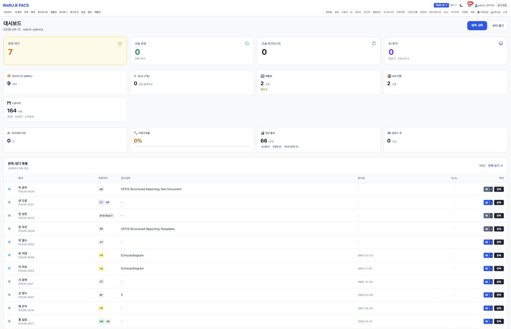

# PACS 화면

> 🟡 **초안 — 캡처 넣는 중** · [화면 소개 목차](README.md) · [PACS 시스템 구성서](../systems/pacs.md)
> 계층 임상 부서 · 버전 `v13.48` · 구현 상태 `통합` · 화면 47(관리 화면 · 웹 뷰어 제외) · 기준: [통합 릴리즈 초안](../RELEASES/draft/manifest.md)(계측일 2026-09-11)

**EN** — Web PACS. Screens are captured on **synthetic hospital data**; institution-identifying information, secrets and infrastructure details are masked before publication ([capture rules](../assets/screens/README.md)).

---

## 무엇을 하는 화면인가

웹 PACS 입니다 — 영상 서버 · 뷰어 · 판독 워크플로 · AI 연동. HIS 의 영상 오더가 워크리스트로 들어오고, 판독 결과가 HIS 로 돌아갑니다. 판독의 본인 서명은 [sign](sign.md) 이 합니다.

## 화면

판독 대기 · 오늘 완료 · 워크리스트(MWL) · SLA · 재촬영 요청 · **HIS 연동 요청** · 스토리지 · DICOM 이슈가 한 판에 섭니다. 아래는 판독 대기 목록으로, 환자 · **모달리티 배지**(CR · CT · MR · US · RF · OT · SR · RTSTRUCT) · 검사 설명 · 검사일 · SLA 와 `판독` 버튼이 붙습니다.

> 📌 **영상 출처를 추적합니다** — 이 설치본은 영상 66건의 출처를 **AI 생성 · 익명화 · 테스트 데이터**로 나눠 셉니다. 영상이 어디서 왔는지를 숫자로 구분해 두는 자리입니다 → [취지 2 「출처를 말한다」](../overview/02-principles.md#2-출처를-말한다)

기관이 받아 둔 AI 모델을 **의료 모델**과 **범용 모델**로 나눠 관리합니다. 모델마다 설명 · **적용 모달리티**(CR · DX · CT · MR · US) · 타입(Ollama/API · ONNX) · **용도** · 사용 토글 · 추론 건수가 붙습니다.

- **용도 칸이 전부 `보조`** 입니다 → [취지 1 「AI 는 보조, 판단은 사람」](../overview/02-principles.md#1-ai-는-보조-판단은-사람)
- [9장 「모델은 기관이 골라서 직접 받습니다」](../overview/09-terms.md)가 적은 모델들이 그대로 있습니다 — MedGemma(4B · 27B) · Med42 · Meditron · BioMistral · LLaVA-Med · OpenBioLLM.
- **자체 파인튜닝 의료 모델이 2종**입니다(목록에서 이름으로 구분됩니다). 이 자료가 "자체 파인튜닝 의료 모델 2종은 공개 배포하지 않는다"고 적은 것과 맞습니다.
- 아직 받는 중인 모델은 **비활성으로 흐리게** 표시됩니다.
- 맨 위에 GPU AI 서버 연결 상태와 `연동 테스트` 가 있습니다(**주소는 공개 자료에서 가렸습니다**).

## 캡처 자리

| # | 담을 화면 | 파일 | 상태 |
|---|---|---|---|
| 📷 pacs-1 | 판독 모드의 AI 패널과 판독문 초안 | `pacs-reading-ai.png` | ⬜ |
| 📷 pacs-2 | 판독 서명 | `pacs-reading-sign.png` | ⬜ |
| 📷 pacs-3 | 영상 자동 선별 알림과 응급 보드 | `pacs-screening-board.png` | ⬜ |
| 📷 pacs-4 | 병리 슬라이드 현미경 모드 | `pacs-pathology-viewer.png` | ⬜ |
| 📷 pacs-5 | 워크리스트 — 촬영 대기와 상태 | `pacs-worklist.png` | ⬜ |

## 알아 둘 것

웹 뷰어는 OHIF Viewer · Cornerstone3D(둘 다 MIT)를 받아 함께 빌드합니다([THIRD_PARTY §2](../THIRD_PARTY.md#2-소스를-가져와-고친-제3자-코드)). **영상 자동 선별은 코드 기본값이 켜짐**이라 설치 직후 확인합니다.

- 이 시스템이 다른 시스템과 실제로 맞물리는지는 [연결 상태](../RELEASES/draft/compatibility.md)에서 봅니다 — **`검증됨` 0**(판정 2026-09-11 · 코드 대조 · 실제 호출 확인 없음).
- 설치 요구사항 · 주요 설정 · 한계는 [PACS 시스템 구성서](../systems/pacs.md)에 있습니다.
- 캡처를 넣는 규칙은 [캡처 안내](../assets/screens/README.md), 사람 확인은 [캡처 대장](../assets/CAPTURE-LEDGER.md)에 있습니다.
