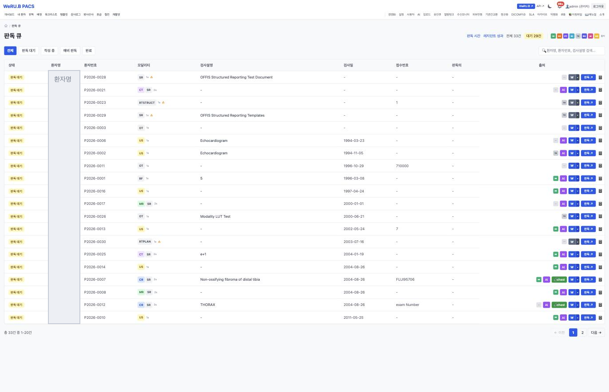
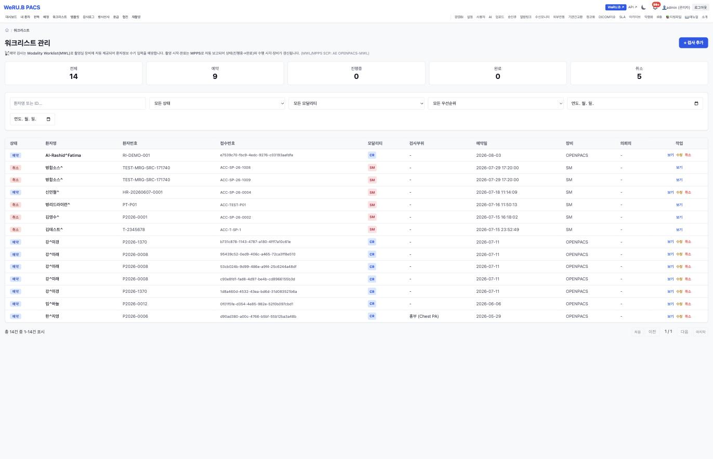
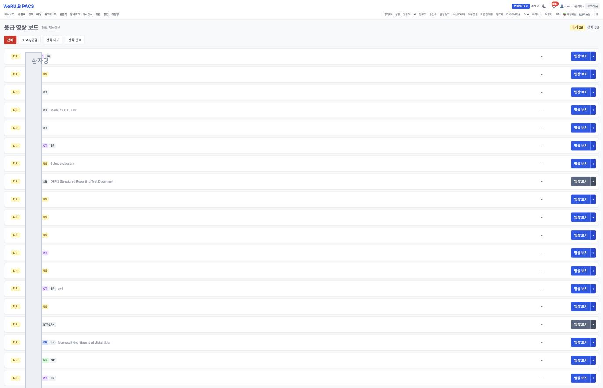

# PACS 화면

> 🟡 **초안 — 캡처 넣는 중** · [화면 소개 목차](README.md) · [PACS 시스템 구성서](../systems/pacs.md)
> 계층 임상 부서 · 버전 `v13.48` · 구현 상태 `통합` · 화면 47(관리 화면 · 웹 뷰어 제외) · 기준: [통합 릴리즈 초안](../RELEASES/draft/manifest.md)(계측일 2026-09-11)

**EN** — Web PACS. Screens are captured on **synthetic hospital data**; institution-identifying information, secrets and infrastructure details are masked before publication ([capture rules](../assets/screens/README.md)).

---

## 무엇을 하는 화면인가

웹 PACS 입니다 — 영상 서버 · 뷰어 · 판독 워크플로 · AI 연동. HIS 의 영상 오더가 워크리스트로 들어오고, 판독 결과가 HIS 로 돌아갑니다. 판독의 본인 서명은 [sign](sign.md) 이 합니다.

## 화면

판독 대기 · 오늘 완료 · 워크리스트(MWL) · SLA · 재촬영 요청 · **HIS 연동 요청** · 스토리지 · DICOM 이슈가 한 판에 섭니다. 아래는 판독 대기 목록으로, 환자 · **모달리티 배지**(CR · CT · MR · US · RF · OT · SR · RTSTRUCT) · 검사 설명 · 검사일 · SLA 와 `판독` 버튼이 붙습니다.

> 📌 **영상 출처를 추적합니다** — 이 설치본은 영상 66건의 출처를 **AI 생성 · 익명화 · 테스트 데이터**로 나눠 셉니다. 영상이 어디서 왔는지를 숫자로 구분해 두는 자리입니다 → [취지 2 「출처를 말한다」](../overview/02-principles.md#2-출처를-말한다)

기관이 받아 둔 AI 모델을 **의료 모델**과 **범용 모델**로 나눠 관리합니다. 모델마다 설명 · **적용 모달리티**(CR · DX · CT · MR · US) · 타입(Ollama/API · ONNX) · **용도** · 사용 토글 · 추론 건수가 붙습니다.

- **용도 칸이 전부 `보조`** 입니다 → [취지 1 「AI 는 보조, 판단은 사람」](../overview/02-principles.md#1-ai-는-보조-판단은-사람)
- [9장 「모델은 기관이 골라서 직접 받습니다」](../overview/09-terms.md)가 적은 모델들이 그대로 있습니다 — MedGemma(4B · 27B) · Med42 · Meditron · BioMistral · LLaVA-Med · OpenBioLLM.
- **자체 파인튜닝 의료 모델이 2종**입니다(목록에서 이름으로 구분됩니다). 이 자료가 "자체 파인튜닝 의료 모델 2종은 공개 배포하지 않는다"고 적은 것과 맞습니다.
- 아직 받는 중인 모델은 **비활성으로 흐리게** 표시됩니다.
- 맨 위에 GPU AI 서버 연결 상태와 `연동 테스트` 가 있습니다(**주소는 공개 자료에서 가렸습니다**).

판독 큐는 **전체 · 판독 대기 · 작성 중 · 예비 판독 · 완료**로 나뉩니다. 행마다 상태 · 환자번호 · **모달리티 배지와 영상 장수** · 검사 설명 · 검사일 · 접수번호 · 판독의가 붙고, 오른쪽 **`출처` 칸**에 이 영상이 어디서 왔는지가 배지로 섭니다(AI 생성 · 테스트 데이터 · 흉부 선별 등). 이 설치본은 전체 33건 · 대기 29건입니다.

> 👤 **환자명은 공개 자료에서 가렸습니다.** 이 화면은 이름을 그대로 보여 줍니다 — [LIS 검증 워크리스트](lis.md)가 목록에서 이름을 스스로 가리는 것과 다릅니다. **가림은 시스템마다 다른 판단**이고, 구축 기관은 화면마다 무엇을 보여 줄지 자기 규정으로 정합니다.

**촬영 장비가 보는 목록**입니다. 화면 머리가 규칙을 그대로 적습니다 — "예약 검사는 **Modality Worklist(MWL)**로 촬영 장비에 자동 제공되어 환자정보 수기 입력을 예방합니다. 촬영 시작·완료는 **MPPS**로 자동 보고되어 상태(진행중→완료)와 수행 시작·장비가 갱신됩니다." 이 설치본의 워크리스트 SCP 는 **AE 타이틀 `OPENPACS-MWL`** 로 떠 있습니다(→ [S3 장비 등록](../build-guide/S3-clinical-departments.md)).

상태는 예약 9 · 진행중 0 · 완료 0 · 취소 5 로 갈리고, 취소된 행에는 **`수정`·`취소` 버튼이 없습니다** — 끝난 것은 되돌리는 대신 기록으로 남습니다.

**15초마다 저절로 갱신되는** 응급 보드입니다(`전체` · `STAT/긴급` · `판독 대기` · `판독 완료`). 대기 29 · 전체 33 이 오른쪽 위에 분모와 함께 섭니다 → [취지 5 「분모를 함께」](../overview/02-principles.md).

## 캡처 자리

| # | 담을 화면 | 파일 | 상태 |
|---|---|---|---|
| 📷 pacs-1 | 판독 모드의 AI 패널과 판독문 초안 | `pacs-reading-ai.png` | ⬜ |
| 📷 pacs-2 | 판독 서명 | `pacs-reading-sign.png` | ⬜ |
| ✅ pacs-3 | 응급 영상 보드 — 15초 자동 갱신 · 대기/전체 분모 | [`pacs-emergency-board.png`](../assets/screens/pacs-emergency-board.png) | 확인(2026-09-12) · 영상 자동 선별 알림은 남음 |
| 📷 pacs-4 | 병리 슬라이드 현미경 모드 | `pacs-pathology-viewer.png` | ⬜ |
| ✅ pacs-5 | 워크리스트 — MWL 제공 · MPPS 자동 보고 · AE `OPENPACS-MWL` | [`pacs-worklist.png`](../assets/screens/pacs-worklist.png) | 확인(2026-09-12) |
| ✅ pacs-6 | 판독 큐 — 상태 5단계 · 모달리티 배지 · **출처 배지** | [`pacs-reading-queue.png`](../assets/screens/pacs-reading-queue.png) | 확인(2026-09-12) |

## 알아 둘 것

웹 뷰어는 OHIF Viewer · Cornerstone3D(둘 다 MIT)를 받아 함께 빌드합니다([THIRD_PARTY §2](../THIRD_PARTY.md#2-소스를-가져와-고친-제3자-코드)). **영상 자동 선별은 코드 기본값이 켜짐**이라 설치 직후 확인합니다.

- 이 시스템이 다른 시스템과 실제로 맞물리는지는 [연결 상태](../RELEASES/draft/compatibility.md)에서 봅니다 — **`검증됨` 27**(HIS → sign 직원 신원 · 서명 · sign → HIS 서명 완료 통지 · HIS → sign 오더 서명 로그 봉인 · HIS → LIS 검사 오더 전달 · LIS → HIS 환자 조회 · LIS → HIS 검사 결과 전달 · HIS → LIS 오더 취소 전파 · HIS → ERP 직원 SSO · HIS ⇄ edu 직원 SSO · 공개키 조회 · 직원 명부 · 이수 기록 · edu ⇄ sign 이수증 서명 · 완료 통지 · ERP ⇄ sign 외주 계약 서명 · 완료 통지 · PACS → sign 판독 서명 · LIS → PACS 병리 워크리스트 · LIS → ERP 검사 청구 · LIS → PACS 병리 뷰어 링크 · LIS → HIS 검사코드 카탈로그 반입 · HIS → ERP 약품 보험코드 매핑 반입 · ERP → HIS 청구 라인 · 재원 조회 · HIS → ERP 진료비 계산서 조회 · ERP → HIS 검진권 정산 지급 회신 · ERP → HIS 의료진 계약 서명 발의 · PACS → sign 조영제 동의서 환자 서명 — 새 설치본끼리 실제 호출로 확인 2026-09-14 · 나머지는 코드 대조 2026-09-11).
- 설치 요구사항 · 주요 설정 · 한계는 [PACS 시스템 구성서](../systems/pacs.md)에 있습니다.
- 캡처를 넣는 규칙은 [캡처 안내](../assets/screens/README.md), 사람 확인은 [캡처 대장](../assets/CAPTURE-LEDGER.md)에 있습니다.
