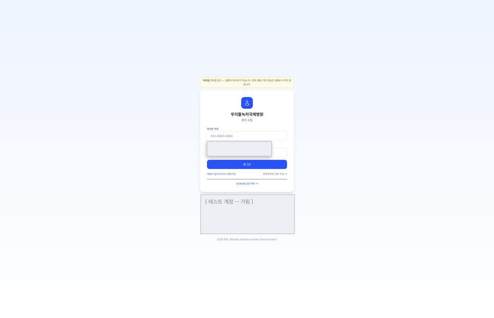

# 환자 앱 화면

> 🟡 **초안 — 캡처 넣는 중** · [화면 소개 목차](README.md) · [환자 앱 시스템 구성서](../systems/patient-app.md)
> 계층 환자 접점 · 버전 `v4.18.0` · 구현 상태 `개발` — 스토어 미배포 · 화면 32 · 기준: [통합 릴리즈 `2026.09`](../RELEASES/2026.09/manifest.md)(계측일 2026-09-11)

> **EN** — The patient app — booking, viewing results, consent, questionnaires and delegating access to a family member. Its implementation status is `개발` (in development) and it is **not published to any app store**, so this chapter also covers the **web patient portal**, which is where patients enter today. One screen is captured, the portal login showing the rehearsal banner and phone-number sign-in, with four further slots **not filled yet**. Captures are taken on **synthetic hospital data**, with identifying information masked before publication ([capture rules](../assets/screens/README.md)).

---

## 무엇을 하는 화면인가

환자가 예약 · 결과 열람 · 동의 · 문진 · 보호자 위임을 하는 앱입니다.

## 환자 포털 — 앱이 아직 없을 때 환자가 들어오는 곳

환자 앱은 스토어에 배포되지 않았습니다. 그동안 환자는 **HIS 의 웹 환자 포털**로 들어옵니다. 휴대폰 번호로 로그인하고, 계정이 없으면 가입하거나 **등록번호로 간편 조회**할 수 있습니다. `AI(WeRU.B) 예약` 으로 바로 갈 수도 있습니다.

머리에 있는 노란 띠가 이 설치본의 상태를 **환자에게도** 알립니다.

> ⚠️ **리허설 모드 — 실환자 데이터가 아닙니다. 문자 · 메일 · 기관 전송은 실제로 나가지 않습니다.**

직원 화면뿐 아니라 **환자가 보는 화면에도 모드를 표시**합니다 → [취지 8 「개시 전과 후를 모드로 가른다」](../overview/02-principles.md#8-개시-전과-후를-모드로-가른다)

> 회색으로 덮인 자리는 **테스트 계정 목록**입니다(공개 자료에서 가렸습니다).

## 캡처 자리

| # | 담을 화면 | 파일 | 상태 |
|---|---|---|---|
| 📷 patient-app-1 | 결과 · 영상 · 판독 열람 | `patient-app-results.png` | ⬜ |
| 📷 patient-app-2 | 결과 상세와 회차별 비교 | `patient-app-result-compare.png` | ⬜ |
| 📷 patient-app-3 | 문진표 작성 | `patient-app-questionnaire.png` | ⬜ |
| 📷 patient-app-4 | 입원 여정 타임라인 | `patient-app-journey.png` | ⬜ |

## 알아 둘 것

🔴 **스토어에 배포되지 않았고, 앱에서 신규 가입이 되지 않습니다.** 배포 결정 전에는 HIS 의 웹 환자 포털을 씁니다. 알림 푸시도 동작하지 않습니다([환자 앱 구성서 §10](../systems/patient-app.md#10-한계와-대체-수단)).

- 이 시스템이 다른 시스템과 실제로 맞물리는지는 [연결 상태](../RELEASES/2026.09/compatibility.md)에서 봅니다 — 어떤 연결이 `검증됨` 이고 언제 확인했는지는 그 표의 **상태 칸 · 확인일 칸**에 있습니다(합계도 그 표 한 곳에만 둡니다). 나머지 `구현·미검증` 은 "양쪽 코드가 맞물려 있다"는 뜻이지 동작한다는 뜻이 아닙니다.
- 설치 요구사항 · 주요 설정 · 한계는 [환자 앱 시스템 구성서](../systems/patient-app.md)에 있습니다.
- 캡처를 넣는 규칙은 [캡처 안내](../assets/screens/README.md), 사람 확인은 [캡처 대장](../assets/CAPTURE-LEDGER.md)에 있습니다.
