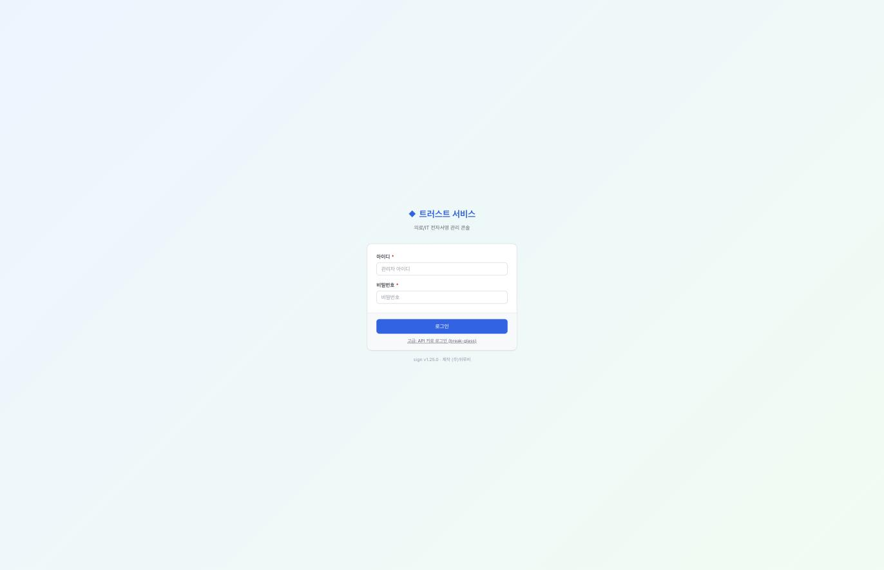

# sign 화면

> 🟡 **초안 — 캡처 넣는 중** · [화면 소개 목차](README.md) · [sign 시스템 구성서](../systems/sign.md)
> 계층 신뢰 · 버전 `1.30.1` · 구현 상태 `통합` · 화면 38 · 기준: [통합 릴리즈 초안](../RELEASES/draft/manifest.md)(계측일 2026-09-11)

**EN** — PKI, timestamping and e-signature. Screens are captured on **synthetic hospital data**; institution-identifying information, secrets and infrastructure details are masked before publication ([capture rules](../assets/screens/README.md)).

---

## 무엇을 하는 화면인가

자체 PKI · RFC 3161 타임스탬프 · PAdES-LTA 전자서명. **"누가 · 언제 · 무엇에 서명했고 그 뒤로 바뀌지 않았다"** 를 제3자가 검증할 수 있게 하는 자리입니다. 동의서(HIS) · 판독(PACS) · 이수증(edu) · 계약(ERP)이 모두 여기를 부릅니다.

## 화면

관리 콘솔 로그인입니다. 화면이 스스로를 **「의료/IT 전자서명 관리 콘솔」** 이라고 적습니다. 아래에 **`고급: API 키로 로그인 (break-glass)`** 가 따로 있습니다 — 평소 경로가 막혔을 때 쓰는 비상 통로이고, 그런 통로를 **숨기지 않고 이름을 붙여 둔** 자리입니다.

> 이 설치본은 테스트 계정을 두지 않아 콘솔 안쪽은 아직 찍지 못했습니다. 인증서 발급 · 폐기 · OCSP·CRL · CA 회전 감사가 그 안에 있습니다([HIS 의 인증서 화면](his.md)은 여기서 발급한 것을 **읽기 전용으로 비춰 보는 미러**입니다).

## 캡처 자리

| # | 담을 화면 | 파일 | 상태 |
|---|---|---|---|
| 📷 sign-1 | 서명 요청과 서명 완료 상태 | `sign-request.png` | ⬜ |
| 📷 sign-2 | 인증서 발급 · 목록 | `sign-certificates.png` | ⬜ |
| 📷 sign-3 | 타임스탬프 · 감사 해시체인 봉인 | `sign-timestamp-anchor.png` | ⬜ |
| 📷 sign-4 | 서명 검증 결과(PAdES-LTA) | `sign-verify.png` | ⬜ |

## 알아 둘 것

🔴 기준 버전은 **인증 기관 키를 소프트웨어로 보관**합니다(하드웨어 보안 모듈 미적용). 화면에 키 · 인증서 세부가 보이면 가리고 찍습니다. **전자서명의 법적 효력 판단은 구축 기관과 법무가 합니다.**

- 이 시스템이 다른 시스템과 실제로 맞물리는지는 [연결 상태](../RELEASES/draft/compatibility.md)에서 봅니다 — **`검증됨` 14**(HIS → sign 직원 신원 · 서명 · sign → HIS 서명 완료 통지 · HIS → sign 오더 서명 로그 봉인 · HIS → LIS 검사 오더 전달 · LIS → HIS 환자 조회 · LIS → HIS 검사 결과 전달 · HIS → LIS 오더 취소 전파 · HIS → ERP 직원 SSO · HIS ⇄ edu 직원 SSO · 공개키 조회 · 직원 명부 · 이수 기록 · edu ⇄ sign 이수증 서명 · 완료 통지 — 새 설치본끼리 실제 호출로 확인 2026-09-14 · 나머지는 코드 대조 2026-09-11).
- 설치 요구사항 · 주요 설정 · 한계는 [sign 시스템 구성서](../systems/sign.md)에 있습니다.
- 캡처를 넣는 규칙은 [캡처 안내](../assets/screens/README.md), 사람 확인은 [캡처 대장](../assets/CAPTURE-LEDGER.md)에 있습니다.
