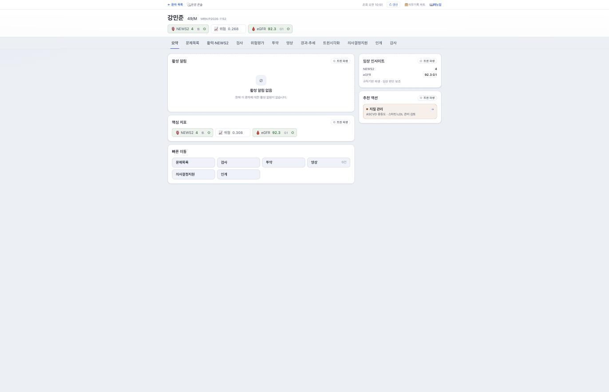
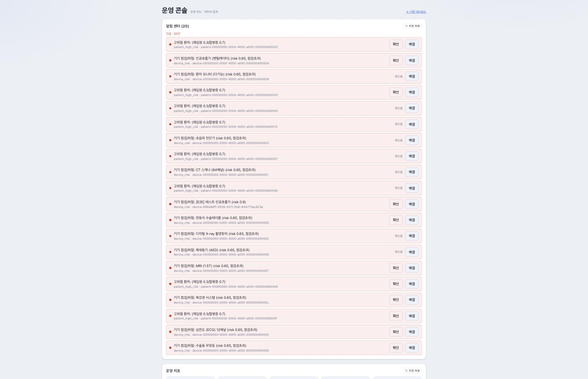

# twin 화면

> 🟡 **초안 — 캡처 넣는 중** · [화면 소개 목차](README.md) · [twin 시스템 구성서](../systems/twin.md)
> 계층 AI · 버전 `1.20.88` · 구현 상태 `통합` · 화면 15 · 기준: [통합 릴리즈 초안](../RELEASES/draft/manifest.md)(계측일 2026-09-11)

**EN** — Digital twin. Screens are captured on **synthetic hospital data**; institution-identifying information, secrets and infrastructure details are masked before publication ([capture rules](../assets/screens/README.md)).

---

## 무엇을 하는 화면인가

디지털 트윈 — 위험 점수 카드 · SBAR 초안 · 시뮬레이션. 차트에서 SMART on FHIR 로 열리고, CDS Hooks 로 위험 카드를 띄웁니다.

## 화면

차트에서 열리는 환자 화면입니다. 위에 **NEWS2 · 위험 점수 · eGFR** 이 배지로 서고, 탭으로 문제목록 · 활력 · 검사 · 위험평가 · 투약 · 영상 · 경과·추세 · **트윈시각화** · 의사결정지원 · 인계 · 감사로 나뉩니다.

**어느 카드가 twin 이 만든 것인지 배지로 구분합니다** — 임상 인사이트와 추천 액션에 **`◇ 트윈 파생`** 이 붙고, 그 아래 한 줄이 성격을 못 박습니다.

> **규칙기반 파생 · 임상 판단 보조**

추천 액션도 지시가 아니라 검토 제안으로 적힙니다(예: 지질 관리 — ASCVD 중등도 · 스타틴-LDL 관리 **검토**). 오른쪽 위 `의무기록 차트` 로 HIS 로 돌아갑니다.

같은 시스템의 **운영 콘솔**은 성격이 다릅니다. 머리에 **`운영 모드 · 비PHI 집계`** 라고 적혀 있고, **환자가 이름 없이 식별자로만** 나옵니다. 고위험 환자 알림과 **기기 점검·위험 알림**(인공호흡기 · CT · MRI · 제세동기 · 수술테이블 …)이 함께 서고, 건마다 `확인` · `해결` 로 닫습니다.

> 환자 차트(개인건강정보)와 운영 콘솔(집계)을 **화면 단위로 나눠 둔 것**이 이 시스템의 설계입니다.

## 캡처 자리

| # | 담을 화면 | 파일 | 상태 |
|---|---|---|---|
| 📷 twin-1 | 환자 위험 점수 카드 | `twin-risk-card.png` | ⬜ |
| 📷 twin-2 | SBAR 초안과 "차트 저장" | `twin-sbar.png` | ⬜ |
| 📷 twin-3 | 차트에서 연 twin(SMART on FHIR) | `twin-smart-launch.png` | ⬜ |

## 알아 둘 것

**의료진이 "차트 저장"을 눌러야 HIS 에 저장됩니다.** AI 설명 초안에는 `machine-generated` 표시가 붙습니다. twin 은 안전 등급 분류 예비 단계입니다.

- 이 시스템이 다른 시스템과 실제로 맞물리는지는 [연결 상태](../RELEASES/draft/compatibility.md)에서 봅니다 — **`검증됨` 26**(HIS → sign 직원 신원 · 서명 · sign → HIS 서명 완료 통지 · HIS → sign 오더 서명 로그 봉인 · HIS → LIS 검사 오더 전달 · LIS → HIS 환자 조회 · LIS → HIS 검사 결과 전달 · HIS → LIS 오더 취소 전파 · HIS → ERP 직원 SSO · HIS ⇄ edu 직원 SSO · 공개키 조회 · 직원 명부 · 이수 기록 · edu ⇄ sign 이수증 서명 · 완료 통지 · ERP ⇄ sign 외주 계약 서명 · 완료 통지 · PACS → sign 판독 서명 · LIS → PACS 병리 워크리스트 · LIS → ERP 검사 청구 · LIS → PACS 병리 뷰어 링크 · LIS → HIS 검사코드 카탈로그 반입 · HIS → ERP 약품 보험코드 매핑 반입 · ERP → HIS 청구 라인 · 재원 조회 · HIS → ERP 진료비 계산서 조회 · ERP → HIS 검진권 정산 지급 회신 · ERP → HIS 의료진 계약 서명 발의 — 새 설치본끼리 실제 호출로 확인 2026-09-14 · 나머지는 코드 대조 2026-09-11).
- 설치 요구사항 · 주요 설정 · 한계는 [twin 시스템 구성서](../systems/twin.md)에 있습니다.
- 캡처를 넣는 규칙은 [캡처 안내](../assets/screens/README.md), 사람 확인은 [캡처 대장](../assets/CAPTURE-LEDGER.md)에 있습니다.
