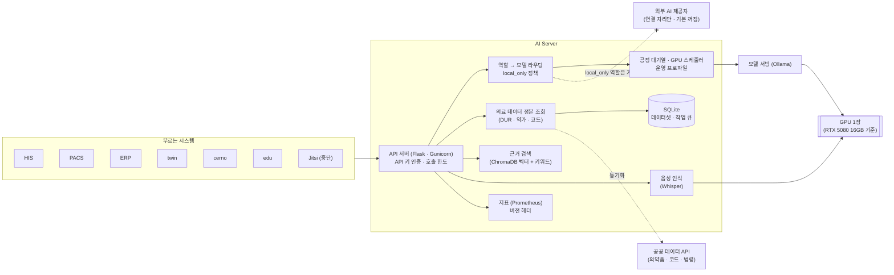

# AI Server — 시스템 구성서

> 기준 버전 **2.125.41** · 기준 커밋 `55acaee90068` · 구현 상태 `통합` — [매니페스트](../RELEASES/draft/manifest.md) 기준
> 사실 확인: 미확인 — 생태계 자료 측 조사 기준(시스템 담당 확인 전) · 새 설치본으로 한 번 따라가 봄(2026-09-13~16 · 개발 PC · GPU 없음 · 격리 네트워크 — [결과](../build-guide/follow-along-2026-09.md))

> **EN** — One on-premise GPU server that carries the ecosystem's AI computation: it **assists** by drafting clinical documents, supporting symptom triage and drug-interaction (DUR) checks, answering questions over source documents (RAG), transcribing speech and drafting imaging findings — all exposed to other systems as APIs. twin and cerno keep no GPU of their own and call this server instead, so model loading and GPU sharing happen in one place. This chapter covers **only the medical functions** used in the hospital ecosystem. Status at the base commit is `통합` (integrated); in the 2026-09 follow-along the call paths were exercised with a small substitute model, so quality was not judged.

이 장은 병원 생태계에 쓰이는 **의료 기능만** 다룹니다. 이 버전에서 무엇이 바뀌었는지는 [릴리즈 요약](../RELEASES/draft/systems/ai-server.md)에 있습니다.

## 1. 정체성과 계층

- **정의**: 생태계의 AI 연산을 한 곳에서 맡는 온프레미스 GPU 서버입니다. 진료 문서 초안 · 증상 분류 보조 · 약물 상호작용(DUR) 점검 보조 · 근거 문서 질의(RAG) · 음성 인식 · 영상 소견 초안을 다른 시스템에 API 로 제공합니다.
- **계층**: AI 계층(연산 중심). 구축 단계로는 [S6 AI 계층](../README.md#구축은-이렇게-진행됩니다)에서 붙입니다.
- **다른 AI 시스템과의 관계**: twin · cerno 는 자기 서버에 GPU 를 두지 않고 AI Server 를 불러 씁니다. 모델을 올리고 GPU 를 나눠 쓰는 일은 AI Server 한 곳에서만 합니다.
- **없어도 되는가**: AI Server 없이도 HIS 는 동작하도록 설계했습니다. AI 가 없거나 멈추면 화면이 그 칸을 "폴백" 또는 "산출 불가"로 표시합니다([README](../README.md#최소한의-사양과-구현으로-쓸-수-있게)).
- **버전 표기**: 코드 선언은 2.125.41 이고, 저장소의 마지막 태그는 v2.8.0 입니다(매니페스트 등급 `주요`). 설치본은 기준 커밋 해시로 구분합니다.

## 2. 구성도

- 호출하는 쪽은 모델 이름이 아니라 **역할 이름(task)** 을 부릅니다. 역할과 모델의 대응은 라우팅 표 한 곳에 있습니다.
- 약물 상호작용 · 의약품 정보 · 의료 법령처럼 안전과 직결되는 질의는 모델보다 **공공 데이터를 먼저 조회**하고, 모델은 결과를 문장으로 다듬는 데 씁니다.

## 3. 규모

| 항목(스냅샷 키) | 값 | 센 방법(요약) | 계측일 |
|---|---:|---|---|
| `systems.ai-server.counts.apiEndpoints` | 654 | Flask 앱과 앱이 등록하는 Blueprint 의 라우트 데코레이터 수(= 핸들러 수). 설정에 따라 꺼질 수 있는 것 포함 · 등록되지 않은 Blueprint · 별도 프로세스 앱 · 테스트 제외 | 2026-09-11 |
| `systems.ai-server.counts.testCases` | 1,930 | `tests/**/test_*.py` 의 테스트 함수 선언 수(선언 1개 = 1 · 매개변수로 늘어나는 실행 건수 제외) | 2026-09-11 |

- 두 값 모두 **저장소 전체 기준**입니다. 이 생태계 범위 밖의 기능도 함께 세어져 있어, 의료 기능만의 수가 아닙니다.
- 원본과 규칙 전문: [`data/scale-snapshot.json`](../data/scale-snapshot.json) · 기준 커밋 `55acaee90068`.

## 4. 핵심 기능

| 영역 | 무엇을 하나 |
|---|---|
| 의료 데이터 정본 조회 | 공공기관 DUR 기준(병용 · 임부 · 연령 금기, 노인 · 용량 주의, 투여기간, 효능군 중복, 서방정 분할) 점검 **보조** · 약가 · 제품 코드 대조 · 저가약 대체조제 조회 · 환자용 의약품 정보 · 질병분류 · 수가 코드(KCD · EDI) 조회 · 청구 규칙 참조 |
| 의료 데이터 카탈로그 | 보유 데이터셋마다 건수 · 최신성 · 마지막 동기화 상태 · 그 데이터를 내는 API 를 알려 줍니다. 연동의 출발점이며 환자 정보는 싣지 않습니다 |
| 진료 보조(초안) | 진료 기록 요약(SOAP) · 의무기록 초안 · 환자 설명문 초안 · 증상 분류(triage) 보조 · 의료진용 임상 질의 · 영→한 의학 번역 · 영상 소견 초안과 이전 영상 비교 초안 |
| 근거 문서 질의(RAG) | 벡터 검색과 키워드 검색을 합칩니다. 법령 > 고시 > 상대가치 > 발간물 순의 권위 위계를 두고, 근거가 없으면 `has_evidence: false` 로 알립니다. 기관(테넌트)마다 지식 저장소를 나눕니다 |
| 음성 인식(STT) | 진료실 음성 기록용 실시간 인식과 녹음 파일 일괄 인식. 모든 인식은 서버 안에서 합니다 |
| twin 연산 지원 | 비식별 연산(생리 반응 시뮬레이션 · 영상 → 장기 3D 메시 · 심장 전기생리 시각화) |
| 모델 운용 | 역할 → 모델 라우팅 · 16GB GPU 나눠 쓰기(상주 / 요청할 때 적재 · 동시 적재 한도 · 우선순위 · 시간대별 프로파일) · 적응형 타임아웃 · 서킷 브레이커 · 같은 요청 병합 · 공정 대기열 |
| 거버넌스 | API 키(만료일 · 신 · 구 키 병행 교체) · 약물 데이터 정제의 **스테이징 → 사람 승인** · 레코드별 출처 이력 · 자기 품질 계측(충실도 · 검색 품질 · 채점기 일관성) · 응답 버전 헤더(`X-API-Version` · `X-API-Contract` · `X-API-Commit`) |

## 5. 설치 요구사항

| 항목 | 요구 |
|---|---|
| GPU | **NVIDIA RTX 5080(VRAM 16GB) 한 장**을 기준으로 개발하고 돌려 왔습니다. 가속기는 자동으로 고릅니다(NVIDIA CUDA · Apple Silicon(Metal) · CPU). GPU 없는 환경에서도 코드는 돌지만 그 속도는 아직 계측하지 않았습니다. CPU 서버용으로 실시간 기능 일부를 끄고 배치 작업만 돌리는 모드(`BATCH_MODE`)가 있습니다 |
| 16GB 운용 | 기본 모델은 범용 14B 급 하나(실제 적재 약 10.5GB) · 동시에 올려 두는 모델 수는 모델 서빙 설정(`OLLAMA_MAX_LOADED_MODELS`)으로 정합니다. 저장소 문서에는 1개(16GB 에서 한 모델만 상주 · 모델을 바꿀 때마다 다시 적재)와 2개 두 기록이 함께 있어, 권장값은 계측해 싣습니다 · 자리가 모자라면 우선순위가 낮은 모델부터 내리고 1.5GB 여유를 남깁니다 · 음성 인식과 RAG 임베딩(약 1GB)도 같은 16GB 를 나눠 씁니다. 모델별 VRAM 수치는 코드에 적힌 추정값입니다([README](../README.md#ai-는-소비자용-gpu-한-장으로--rtx-508016gb) · 2026-09-11 코드 확인) |
| 모델 서빙 | Ollama — 호스트에 직접 설치합니다(판본 고정 안 됨 · [THIRD_PARTY §1](../THIRD_PARTY.md#1-별도-서비스로-쓰는-제3자-서버)) |
| 모델 가중치 | **저장소에 들어 있지 않습니다.** 구축 기관이 모델마다 약관을 읽고 직접 받습니다. 기본으로 가리키는 모델과 약관은 [THIRD_PARTY §3](../THIRD_PARTY.md#3-ai-모델-가중치)에 있습니다. 받은 모델에 맞춰 라우팅 표를 고칩니다 |
| 런타임 | Python 3 · Flask · Gunicorn. 의존성은 `requirements.txt`(Apple Silicon 은 `requirements-mac.txt`). 따라가기(2026-09-15)에서는 저장소 의존성 목록 그대로 CPU 환경에 설치했고, 권장 판본은 기준 장비에서 다시 확인해 싣습니다 |
| 저장소 | 별도 DB 서버가 필요 없습니다. 벡터 저장소(ChromaDB)는 프로세스 안에 내장되고, 데이터셋 · 작업 큐는 SQLite 파일입니다. 모델 · 색인 · 음성 모델이 차지하는 디스크 용량은 기준 장비에서 계측해 싣습니다(따라가기 실측은 아래 참고) |
| 네트워크 | 생태계 시스템이 HTTPS 로 부릅니다. 앞단 구성(프록시 · 터널)에 맞춰 `ingress_mode` 를 정합니다. 의료 데이터 정본은 공공 데이터 API 에서 받아 오므로 그쪽으로 나가는 연결이 필요합니다 — 인터넷이 제한된 환경의 반입 방법은 확인해 [구축 가이드](../build-guide/)에 싣습니다. 외부 AI 제공자로 나가는 연결은 기본 구성에 필요 없습니다 |
| 함께 준비할 것 | 부르는 시스템마다 API 키 발급 · 등록. 공공 데이터 API 이용 키(기관이 직접 신청) |

- **따라가기에서 확인한 것**(2026-09-13~16 · CPU 만 · 기준 장비 아님 — [결과](../build-guide/follow-along-2026-09.md)) — 🔴 **새 서버에 올리는 설치 정의(compose 같은 것)가 저장소에 없습니다.** 의존성을 직접 설치해 띄웠고, 학습용 GPU 전용 패키지 3개를 빼야 설치가 끝났습니다. 순서는 [S6](../build-guide/S6-ai.md).
- **생성 모델만 받으면 자료 색인 경로가 실패합니다** — 임베딩 모델을 함께 받습니다(따라가기에서 교육 자료 · 보험 공시 색인이 이 이유로 끝나지 못했습니다).
- 모델 서빙이 **자기 자신에게만 붙는 주소로 고정**돼 있고 앱도 마찬가지라, 다른 컨테이너에서 부르려면 앞단 구성이 필요합니다. 앞단을 둘 때는 **원래 요청자 주소를 전달하는 헤더를 반드시 붙입니다.**
- 이미지 · 의존성이 차지한 디스크는 AI 의존성 약 4.6GB · 모델 서빙 이미지 약 7GB 였습니다(모델 가중치는 별도). 디스크는 넉넉히 잡습니다 — [S0](../build-guide/S0-prepare.md).

## 6. 주요 설정

키 이름만 적습니다. 값은 `example.org` · `<your-hospital>` 같은 자리표시로 생각하십시오.

| 위치 | 키 | 뜻 | 설치 전 |
|---|---|---|---|
| 서버 설정 파일(`config.json` · 설치본마다 만듦) | `default_model` | 기본 대화 모델 | 받은 모델에 맞춤 |
| 〃 | `llm_resident` · `llm_resident_model` | 기본 모델을 **상주**시킬지, **요청할 때 적재**할지 · 상주시킬 모델 | 정할 것 |
| 〃 | `ingress_mode` | 유입 경로 점검 방식(`ssh_tunnel` · `proxy` · `none`). 기본값은 `ssh_tunnel` 이며, 앞단 구성이 다르면 바꿔야 상태 점검이 거짓 경보를 내지 않습니다 | 앞단 구성에 맞춤 |
| 〃 | `bind_port` | 서비스 포트 | 정할 것 |
| 〃 | `medical_pin_public_models` · `medical_public_substitute` | 의료 경로에서 자체 파인튜닝 모델 대신 공개 모델만 쓰도록 고정하는 스위치와 대체 모델([THIRD_PARTY §3](../THIRD_PARTY.md#3-ai-모델-가중치)의 "자체 파인튜닝 의료 모델") | 정할 것 |
| `config/model_routing.json` | 역할(task) → 모델 · 역할별 `policy` | 역할마다 쓸 모델과 데이터 정책. 의료 · 개인건강정보 · 규제 역할은 `local_only` | 받은 모델에 맞춤 |
| `providers.json` | 제공자별 `enabled` · `api_key_env` | 외부 AI 제공자 연결 자리. 기관 안의 모델 서버만 켜져 있고 외부 제공자는 모두 꺼져 있습니다(2026-09-11 확인). 켜더라도 `local_only` 역할은 코드가 거부합니다 | 켜지 않는 것이 기본 |
| 환경변수 | `OLLAMA_HOST` | 모델 서버 주소 | **반드시 바꿀 것** |
| 〃 | `DUR_API_KEY` | 공공 데이터 API 이용 키(비밀값) | **반드시 바꿀 것** |
| 〃 | `WHISPER_MODEL` · `WHISPER_DEVICE` · `WHISPER_COMPUTE` · `STT_REALTIME_MODEL` | 음성 인식 모델 · 장치 · 연산 정밀도 · 실시간 인식 모델 | 하드웨어에 맞춤 |
| 〃 | `BATCH_MODE` | CPU 배치 전용 모드 | GPU 없는 서버에서만 |
| 모델 서버(Ollama) 환경 | `OLLAMA_KEEP_ALIVE` · `OLLAMA_MAX_LOADED_MODELS` · `OLLAMA_NUM_PARALLEL` · `OLLAMA_CONTEXT_LENGTH` | 쉬는 모델을 내리는 시간 · 동시에 올려 두는 모델 수(저장소 문서에 1개 · 2개 두 기록 · 권장값은 계측 후) · 병렬 처리 수 · 기본 문맥 길이 | 16GB 운용 방식에 맞춤 |
| 관리 기능 | API 키 · 운영 프로파일 | 호출 키 발급(서버 로컬에서만) · 만료일 · 교체 / 시간대별 운영 프로파일 적용 | 키는 **반드시 새로 발급** |

**HIS 쪽 AI 스위치** — HIS 에는 AI 기능 전체 스위치(`ai.server.enabled` · 개시 점검 항목 `ai.werub` 가 추적)가 있고, 코드 기본값은 **켜짐**입니다([README](../README.md#최소한의-사양과-구현으로-쓸-수-있게) · 2026-09-11 코드 확인). 구축 가이드는 **설치 직후 AI 기능을 끄고, 기관 결정에 따라 하나씩 켜는 순서**로 안내합니다.

## 7. 연동

연결 상태는 [연결 상태](../RELEASES/draft/compatibility.md)에서 가져왔습니다(코드 대조 2026-09-11). AI Server 는 **불리는 쪽**이며, 나가는 연결로 따로 판정된 것은 없습니다.

따라가기(2026-09-15~16)에서 HIS · edu · ERP · PACS 가 AI Server 를 부르는 경로를 실제로 불러 봤지만, 한 연결이 기능 수십 개의 묶음이거나 자료 색인이 임베딩 모델을 요구해 **연결 전체를 확인하지는 못했습니다.** 그래서 상태는 모두 `구현·미검증` 으로 둡니다 — 어디까지 확인했는지는 [따라가 본 결과](../build-guide/follow-along-2026-09.md)에 있습니다.

**들어오는 연결 14** — `구현·미검증` 10 · `미구현` 2 · `중단` 2

| 방향 | 목적(요약) | 상태 |
|---|---|---|
| HIS → AI Server | 임상 보조 기능 전반(요약 · 분석 · 초안 · 증상 분류 · 약물 상호작용 · DUR · 약가 · 수가 코드 · 지식 RAG · 영상 판독 보조 등) | `구현·미검증` |
| HIS → AI Server | 음성 진료 기록 실시간 음성 인식 | `구현·미검증` |
| HIS → AI Server | 앰비언트 진료 기록 — 오디오 업로드 → 전사 · 화자 분리 작업 → 결과 조회 | `구현·미검증` |
| HIS → AI Server | 생성형 소형 기능(환자 안내 · 데이터 품질 AI · 약품집 · 거버넌스 문서 · VOC 초안 · 환자 약 설명 · 화면 번역) | `구현·미검증` |
| HIS → AI Server | 관리 화면 모델 레지스트리 — 설치 모델 목록 대조 | `미구현` |
| PACS → AI Server | 영상 AI 보조(판독 보조 · 사전 점검 · 비교 판독 · 구조화 판독문) · 텍스트 보조 · 예측 · 코드 매핑 | `구현·미검증` |
| PACS → AI Server | AI 서버 가용성 감시 | `미구현` |
| ERP → AI Server | 보험 · 수가 공시 색인 발신(등록 · 철회 · 색인 상태 · 동기화 검증) | `구현·미검증` |
| ERP → AI Server | 청구 사전심사 — 공시 RAG 검색 · 청구 코드 점검 | `구현·미검증` |
| twin → AI Server | 위험 예측 보조 · 약물 상호작용 · DUR · 서술형 요약 · 의료법 질의 · 영상 연산 등 | `구현·미검증` |
| cerno → AI Server | 의료진별 근거 RAG · 근거 기반 답변 생성 · 모델 예열 · DUR 점검 · 충실도 평가 표본 | `구현·미검증` |
| edu → AI Server | 학습 도우미(과정 자료 RAG) · 문항 생성 · 요약 · 번역 · 집체교육 녹취 분석 | `구현·미검증` |
| Jitsi → AI Server | 원격 상담 녹화 회의록 분석 | `중단` |
| Jitsi → AI Server | 원격 상담 실시간 자막 · 자막 번역 | `중단` |

시스템 담당 확인을 기다리는 연결은 이 장에 싣지 않았습니다([연결 상태](../RELEASES/draft/compatibility.md)).

**부르는 쪽이 알아 둘 것** — 응답 버전 헤더 중 `X-API-Contract` 는 하위 호환이 깨질 때만 오릅니다. 비용이 큰 경로에는 호출 한도가 있어 초과하면 429 를 돌려주므로, 부르는 쪽은 기다렸다 다시 시도하게 만듭니다. 의료 데이터 카탈로그(`GET /api/medical/catalog`)에서 쓸 수 있는 데이터셋과 API 를 먼저 확인합니다.

## 8. 표준과 규제

- **연동 형식**: HTTPS REST(JSON · 일부 스트리밍 · multipart) · OpenAI 호환 대화 형식 · Ollama 형식 · API 명세(Swagger).
- **코드 체계**: KCD · EDI 수가 코드 · 의약품 표준코드 · DUR 기준. 모두 한국 공공기관 자료이며 이용 조건은 [THIRD_PARTY §4](../THIRD_PARTY.md#4-코드-마스터기준-데이터)에서 확인 중입니다.
- **규제 표기**: 저장소는 LLM 기반 디지털의료기기 가이드라인에 대응하는 체계(근거 없는 생성 방지 · 모델 판본 고정 · 파라미터 재현성)를 갖췄다고 적습니다. 이 자료에서는 **`대응 설계`** 로 적습니다. 자체 점검 완료 · 외부 인증 · 승인 기록은 없습니다.
- 의료 응답은 자문 보조이며 실시간 처방 차단 시스템이 아닙니다. 의료기기 해당성 판단과 인허가는 구축 기관이 합니다([의료 면책 고지](../DISCLAIMER.md)).

## 9. AI 사용

- **무엇을 돕나** — 증상 분류 보조 · 진료 기록 초안 · 음성 기록 · 약물 설명 · DUR 점검 보조 · 근거 문서 질의 · 영상 소견 초안 · 위험 예측 보조(twin 경유). 모두 **초안 · 제안**이며, 사람이 승인해야 정본(진료기록)이 됩니다. 의료 응답에는 면책 고지가 응답 필드로 붙습니다.
- **`local_only` 정책** — 의료 · 개인건강정보 · 규제 관련 역할은 라우팅 표에서 `local_only` 로 묶여 있습니다. 외부 AI 제공자로 보내려 하면 **코드가 거부합니다**(실패하면 막는 쪽). 모델을 바꿔 지정해도 정책은 역할 기준으로 적용됩니다.
- **근거가 없으면 알린다** — 법령 · 고시 근거 질의의 인용은 실제 검색 결과에서만 나오고, 근거가 없으면 `has_evidence: false` 로 신뢰도가 낮다는 것을 알립니다.
- **사람 승인** — 약물 데이터 정제는 자동 수집 → 모델 정제 → 검증 → 스테이징을 거친 뒤 사람이 승인해야 반영됩니다.
- **새 모델 도입** — 라이선스 · 하드웨어 적합성 · 근거 기반 비교(A/B)로 현재 구성보다 낫다는 것을 보인 뒤 들인다는 절차가 저장소에 있습니다.
- **모델 약관** — 모델마다 다르고, 일부는 임상 사용 전 승인 · 검증을 요구합니다. [THIRD_PARTY §3](../THIRD_PARTY.md#3-ai-모델-가중치)을 읽고 켤 모델을 정합니다.

## 10. 한계와 대체 수단

| 한계 | 대체 수단 · 준비 |
|---|---|
| 16GB GPU 에 동시에 올려 둘 수 있는 모델 수가 적습니다. 저장소 문서에는 1개와 2개 두 기록이 함께 있고(모델 서빙 설정 `OLLAMA_MAX_LOADED_MODELS` 로 정함), 권장값은 계측해 싣습니다. 음성 인식 여러 건 동시 처리 · 영상과 대화 모델 동시 적재는 더 큰 GPU 가 있어야 풀린다고 저장소 문서가 적습니다 | 시간대별 운영 프로파일 · 요청할 때 적재 방식으로 나눠 씁니다. 부하가 큰 기관은 GPU 증설을 계획합니다 |
| 동시 사용자 수에 따른 처리량 · 모델별 응답 시간 · GPU 없는 환경의 속도는 공개할 계측이 없습니다 | 측정 방법 · 측정일과 함께 [구축 가이드](../build-guide/)에 싣습니다 |
| 단일 워커 구성은 개발 단계의 의도적 선택이며, 동시 요청이 많으면 모델 서빙 런타임이 병목이 될 수 있다고 적혀 있습니다 | 부르는 쪽이 429 · 대기를 견디게 만듭니다 |
| 의료 데이터 정본과 법령 · 고시 근거 자료는 한국 공공기관 자료입니다 | 다른 나라에서는 그 나라의 기준 데이터 · 근거 문서를 새로 붙입니다 |
| 의료 데이터 카탈로그는 집계만 내고 컬럼 정의는 싣지 않습니다. API 명세는 코드에서 확정되는 응답 구조만 적었습니다 | 연동 개발은 실제 응답을 확인하며 진행합니다 |
| 공공 데이터 동기화는 인터넷 연결이 필요합니다 | 제한 환경의 반입 방법은 확인 중입니다 |
| 연결별 동작은 코드 대조까지만 판정했습니다 | 새 설치본으로 실제 호출해 `검증됨` 을 붙입니다 |

## 11. 소스 · 라이선스 표기 · 확인일

- **소스 링크**: 정리 중
- **저장소 라이선스 표기**: 독점 · 독점 — [매니페스트](../RELEASES/draft/manifest.md) 기준(생태계 소프트웨어는 MIT 로 제공하는 것이 목표이며 표기는 정리 중입니다)
- **제3자 구성요소 · 모델 약관**: [THIRD_PARTY.md](../THIRD_PARTY.md) — Ollama(MIT) · ChromaDB(Apache-2.0) · 모델 가중치(모델마다 별도 약관)
- **확인일**: 2026-09-11 — 기준 커밋 `55acaee90068` 의 코드 · 설정 예시 · 저장소 문서를 읽어 작성했습니다
