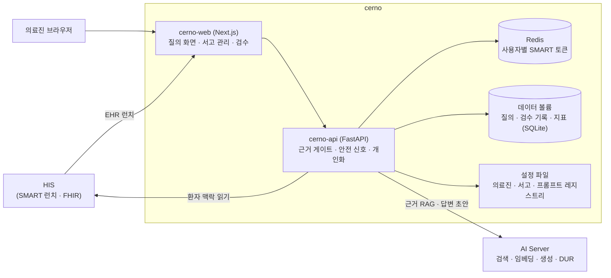

# cerno — 시스템 구성서

> 기준 버전 **0.1.0** · 기준 커밋 `4f5c22b331fc` · 구현 상태 `파일럿` — [매니페스트](../RELEASES/2026.09/manifest.md) 기준
> 사실 확인: 미확인 — 생태계 자료 측 조사 기준(시스템 담당 확인 전) · **이 시스템은 2026-09 따라가기에서 설치하지 않았습니다**(다른 7개 시스템은 설치해 연결을 확인했습니다)

> **EN** — A per-clinician personalised clinical knowledge service. It uses the hospital's own AI Server to retrieve source documents and **draft** an answer, and **produces nothing when it finds no supporting evidence**. Status at the base commit is `파일럿` (pilot), in shadow and non-clinical scope; the repository's release record and last commit stop at 2026-08-04 when the pilot began, so pilot outcomes are not in this chapter. **This system was not installed in the 2026-09 follow-along**, so its connections remain `구현·미검증` — wired in code, not verified by real calls.

이 버전에서 무엇이 바뀌었는지는 [릴리즈 요약](../RELEASES/2026.09/systems/cerno.md)에 있습니다.

## 1. 정체성과 계층

- **정의**: 의료진별로 개인화된 임상 지식 질의 서비스입니다. 병원 안의 AI Server 를 써서 근거 문서를 찾아 답변 초안을 만들고, **근거가 없으면 생성하지 않습니다.**
- **계층**: AI 계층(의료진 개인화 RAG). 구축 단계로는 [S6 AI 계층](../README.md#구축은-이렇게-진행됩니다)에서 붙입니다.
- **구현 상태**: `파일럿` — 섀도우 · 비임상 범위입니다. 저장소의 릴리즈 기록과 마지막 커밋은 파일럿을 시작한 2026-08-04 에서 멈춰 있어, 파일럿 결과는 이 장에 들어 있지 않습니다.
- **역할 분담**: 검색 · 임베딩 · 생성 · 약물 상호작용(DUR) 점검 같은 AI 연산은 [AI Server](ai-server.md)가 맡고, cerno 는 신원 결속 · 서고(지식 문서 관리) · HIS FHIR 조회 · 질의 화면을 맡습니다.
- **버전 표기**: 코드 선언은 0.1.0 이고, 릴리즈 기록과 태그는 v0.1.8 까지 있습니다(매니페스트 등급 `주요`). 공개 자료에 어느 표기를 쓸지는 시스템 담당 확인 뒤 정하며, 그 전까지 **0.1.0(코드 선언) · v0.1.8(릴리즈 기록 · 태그)** 을 함께 적습니다. 설치본은 기준 커밋 해시로 구분합니다.

## 2. 구성도

외부에 여는 것은 웹 하나이고, API 와 Redis 는 내부망에만 둡니다.

## 3. 규모

| 항목(스냅샷 키) | 값 | 센 방법(요약) | 계측일 |
|---|---:|---|---|
| `systems.cerno.counts.apiEndpoints` | 11 | `services/cerno-api/**` 에서 FastAPI 라우터 변수의 HTTP 데코레이터 수(= 핸들러 수) · 웹소켓 제외 | 2026-09-11 |
| `systems.cerno.counts.pages` | 3 | `services/cerno-web/app/**/page.*` 파일 수(레이아웃 · 오류 화면 · API 라우트 제외) | 2026-09-11 |
| `systems.cerno.counts.testCases` | 255 | `tests/**/test_*.py` 의 테스트 함수 선언 수(매개변수로 늘어나는 실행 건수 제외) | 2026-09-11 |

원본과 규칙 전문: [`data/scale-snapshot.json`](../data/scale-snapshot.json) · 기준 커밋 `4f5c22b331fc`.

## 4. 핵심 기능

| 영역 | 무엇을 하나 |
|---|---|
| 진료 중 질의 | HIS 차트에서 SMART on FHIR 로 실행하면 그 환자의 맥락이 질의에 붙습니다. 화면에서 다른 환자로 바꾸는 기능은 두지 않았습니다. 이어서 질문할 수 있고(직전 문답 일부를 문맥으로 쓰되 저장하지 않음), 환자 맥락으로 추천 질문을 만듭니다 |
| 근거 게이트 | 서고 세 층(개인 · 그룹 · 공용)을 함께 검색하고, 근거 게이트를 통과할 때만 답변 초안을 만듭니다. 답변의 `[n]` 인용에서 출처 문서로 바로 갑니다. 근거가 부족하면 "근거로 확인되지 않습니다"라는 상태로 알리고 문서를 올리는 곳으로 안내합니다 |
| 안전 신호 | 고위험 표지(용량 · 응급 · 금기 · 소아 · 임신 · 항암)와 DUR 결과를 **근거 유무와 따로** 표시합니다. 답변을 만들지 않더라도 안전 신호는 보입니다 |
| 서고와 개인화 | 서고 관리 화면에서 문서를 올리고 나눠 담습니다. 적재 전에 거버넌스 검사를 거치며 직접 식별자가 든 문서는 거부합니다. 개인화는 모델을 새로 학습하지 않고, 버전이 매겨진 프롬프트 레지스트리 · 개인 서고 가중 · 예시 선별로 합니다 |
| 격리 | 다른 의료진의 개인 서고와 질의 기록은 보이지 않습니다(질의 기록은 "환자 × 본인" 단위) |
| 검수와 관측 | 답변 카드의 세 문항 검수 · 오도율 · 근거 통과율 · 검수 비율 · 대기 시간 · AI 키 만료 경보 · 임베딩 상태 점검 · 일일 지표 스냅샷 · 평가 하니스와 주간 회귀 스크립트(실패하면 종료 코드 1) |

## 5. 설치 요구사항

| 항목 | 요구 |
|---|---|
| 구성 | Docker Compose — 웹(Next.js) · API(FastAPI) · Redis. 필수 환경값이 비어 있으면 컨테이너가 뜨지 않습니다 |
| 런타임 | API Python 3.13(컨테이너) · 웹 Next.js 16(컨테이너) |
| DB · 캐시 | Redis 7(비밀번호 필수 — 사용자별 SMART 토큰을 저장) · 질의 기록 · 검수 기록 · 지표는 데이터 볼륨의 SQLite 파일 |
| GPU | cerno 서버에는 필요 없습니다. 모든 AI 연산은 AI Server 가 합니다 |
| 네트워크 | 외부에는 웹 하나만 엽니다. API 와 Redis 는 포트를 열지 않고 내부망에만 둡니다(저장소 문서의 배치 지침). HIS 와 AI Server 로 나가는 연결이 필요합니다 |
| 백업 | 데이터 볼륨의 일일 백업 스크립트(7일 보관)가 있습니다. 질의 기록 보존 기간은 기관이 정합니다 |
| 함께 준비할 것 | **HIS 쪽** — SMART 앱 등록(EHR 런치 · JWKS 공개). **AI Server 쪽** — 호출 키(의료진별로 나눌 수 있음). 참여 의료진의 식별자를 설정 파일에 등록 |

## 6. 주요 설정

설정 파일 `.env`(예시 `.env.example`)와 `config/` 의 설정 파일입니다. 값은 자리표시로 생각하십시오.

| 묶음 | 키 | 뜻 | 설치 전 |
|---|---|---|---|
| 공개 주소 | `CERNO_PUBLIC_BASE` | cerno 웹의 공개 주소(SMART 되돌아올 주소의 기준) | **반드시 바꿀 것** |
| SMART | `CERNO_SMART_CLIENT_ID` · `CERNO_SMART_CLIENT_SECRET` | HIS 에서 발급한 SMART 클라이언트(비밀값 포함) | **반드시 바꿀 것** |
| 〃 | `CERNO_SMART_ISS_ALLOW` · `CERNO_SMART_DEFAULT_ISS` | 신뢰할 HIS 발급자 목록 · 기본 발급자 | **반드시 바꿀 것**(목록을 비워 두지 않음) |
| 〃 | `CERNO_FHIR_BASE` · `CERNO_SMART_SCOPE` · `CERNO_FHIR_TIMEOUT` | HIS FHIR 주소 · 읽기 전용 범위 · 조회 제한 시간 | 주소는 **반드시 바꿀 것** |
| 세션 | `CERNO_SESSION_SECRET` · `CERNO_SESSION_TTL` | 세션 · 신원 서명 키(비밀값) · 세션 유지 시간 | **반드시 바꿀 것** |
| 내부 통신 | `CERNO_API_INTERNAL` · `CERNO_API_KEY` | 웹이 API 를 부르는 내부 주소 · 키 | **반드시 바꿀 것** |
| AI Server | `CERNO_AI_BASE` · `CERNO_AI_KEY` · `CERNO_AI_KEYS` | AI Server 주소 · 기본 호출 키 · 의료진별 키 매핑(JSON 형식이어야 하며 틀리면 기동하지 않음) | **반드시 바꿀 것** |
| 모델 | `CERNO_AI_MODEL` · `CERNO_AI_EMBED_MODEL` · `CERNO_AI_EMBED_NUM_CTX` · `CERNO_AI_KEEP_ALIVE` · `CERNO_AI_TEMPERATURE` · `CERNO_AI_SEED` · `CERNO_AI_NUM_PREDICT` | 답변 · 임베딩 모델 · 임베딩 문맥 길이(명시해야 VRAM 예산이 맞음) · 적재 유지 시간 · 추론 파라미터 | 받은 모델에 맞춤 |
| Redis | `CERNO_REDIS_PASSWORD` · `CERNO_REDIS_URL` | 사용자별 토큰 저장소 인증 | **반드시 바꿀 것** |
| 근거 게이트 | `CERNO_CONFIDENCE_MIN` · `CERNO_MIN_EVIDENCE` | 근거로 인정할 최소 신뢰도 · 최소 근거 수 | 기관 서고로 다시 재서 정할 것 |
| 데이터 | `CERNO_DB_PATH` · `CERNO_CONFIG_DIR` | 기록 파일 위치 · 설정 파일 폴더 | 정할 것 |
| 설정 파일 | `config/clinicians.yaml` | 참여 의료진과 의료진별 설정 | **반드시 바꿀 것** |
| 〃 | `config/collections.yaml` | 서고(개인 · 그룹 · 공용) 구성 | 정할 것 |
| 〃 | `config/prompts/registry.yaml` | 버전이 매겨진 프롬프트 레지스트리 | 바꾸면 버전을 올림 |

- **공용 서고 기본 문서**는 AI 가 작성한 요약본(원 지침 출처 표기)입니다. 기관의 원문 지침으로 바꾼 뒤 쓰기를 권장합니다.
- AI 기능 스위치의 기본값은 릴리즈 요약 · README 에 적힌 것이 없어 싣지 않았습니다. cerno 는 HIS 차트에서 실행할 때만 쓰이는 서비스이며, 켜는 결정은 HIS 개시 점검 항목 `integ.cernoPilot`(파일럿 착수)으로 추적합니다([Go-Live 체크리스트](../checklist/go-live.md)).

## 7. 연동

연결 상태는 [연결 상태](../RELEASES/2026.09/compatibility.md)에서 가져왔습니다(코드 대조 · 2026-09-11 · 실제 호출 확인 전).

**들어오는 연결 1 · 나가는 연결 2** — 모두 `구현·미검증`

| 방향 | 목적(요약) | 상태 |
|---|---|---|
| HIS → cerno | SMART EHR 런치 — 차트에서 cerno 를 열 때 의료진 + 환자 바인딩 1회용 런치 토큰 · id_token 을 HIS 공개키로 검증 | `구현·미검증` |
| cerno → HIS | 근거 질의용 환자 맥락 FHIR 읽기(진단명 · 검사 결과 · 판독 보고 · 시술은 필수, 처방 · 알레르기 등은 선택) — 사용자별 토큰 · 읽기 전용 | `구현·미검증` |
| cerno → AI Server | 의료진별 근거 RAG · 근거 기반 답변 생성 · 모델 예열 · DUR 점검 · 충실도 평가 표본 | `구현·미검증` |

- 표에 없는 연결: cerno ⇄ twin — 확인 중.
- 시스템 담당 확인을 기다리는 연결은 이 장에 싣지 않았습니다([연결 상태](../RELEASES/2026.09/compatibility.md)).

## 8. 표준과 규제

- **표준**: SMART App Launch(EHR 런치 · PKCE) · FHIR R4 읽기 · id_token 공개키(JWKS) 검증. cerno 는 HIS 에 write-back 하지 않습니다.
- **규제 표기**: 저장소는 "의료기기가 아니며 진단 · 처방을 자동 확정하지 않는다"고 적고, 임상 사용 범위가 결정되기 전에는 **비임상 한정**을 기본값으로 둡니다. 규제 대응 단계(`대응 설계` 등)를 붙일 근거 기록은 이 자료 측 조사에서 찾지 못했습니다.
- 규제 판단은 구축 기관이 합니다([의료 면책 고지](../DISCLAIMER.md)).

## 9. AI 사용

- **무엇을 돕나** — 의료진이 올린 근거 문서와 공용 지침을 찾아 **답변 초안**을 만들고, 환자 맥락으로 추천 질문을 제안합니다.
- **근거가 없으면 만들지 않는다** — 근거 게이트를 통과하지 못하면 답변 대신 "근거로 확인되지 않습니다"라고 알립니다. 안전 신호는 근거 유무와 따로 항상 판정합니다.
- **사람 검수** — 답변 카드마다 세 문항으로 검수 결과를 남기고 오도율을 셉니다. 이 수치는 파일럿을 계속할지 판단하는 입력입니다.
- **모델** — 모델을 새로 학습하지 않습니다. AI Server 의 모델을 쓰며, 기본으로 가리키는 모델(범용 14B · RAG 임베딩)과 약관은 [THIRD_PARTY §3](../THIRD_PARTY.md#3-ai-모델-가중치)에 있습니다. 모든 연산은 AI Server 를 거치므로 AI Server 의 `local_only` 정책이 그대로 적용됩니다.

## 10. 한계와 대체 수단

| 한계 | 대체 수단 · 준비 |
|---|---|
| 비임상 범위의 섀도우 파일럿입니다. 파일럿 결과가 기록에 없습니다 | 임상 사용 범위는 구축 기관이 결정합니다. 그 전까지 비임상으로 씁니다 |
| 자연어 프롬프트 인젝션은 LLM 특성상 완전히 막을 수 없다고 저장소 문서가 밝힙니다. 다른 의료진의 서고 · 다른 환자의 자료는 검색 단계의 소유자 필터로 막고, 나머지는 여러 겹의 방어로 관리합니다 | 서고에 올리는 문서를 관리하고, 답변은 초안으로만 씁니다 |
| 환자별 질의 기록은 "환자 정보를 저장하지 않는다"는 원칙의 명시적 예외입니다 | 임상 범위로 넓히려면 보존 기간 · 암호화 · 감사 로그를 다시 정합니다 |
| 개인 노트 가중치 때문에 개인 노트가 공용 지침보다 위에 오는 경향이 있어 재조정 예정으로 적혀 있습니다 | 공용 지침은 원문으로 서고에 넣습니다 |
| AI Server 호출은 키 단위로 순서대로 처리되어, 동시에 쓸 수 있는 규모가 키 구성에 따라 달라집니다 | 의료진별 키 매핑(`CERNO_AI_KEYS`)을 씁니다 |
| 어댑터 학습 · 증류 · 멀티모달 · 전자의무기록 화면 안 임베드는 현 사양 밖입니다 | — |
| 연결별 동작은 코드 대조까지만 판정했습니다 | 새 설치본으로 실제 호출해 `검증됨` 을 붙입니다 |

## 11. 소스 · 라이선스 표기 · 확인일

- **소스 링크**: [seanshin/cerno](https://github.com/seanshin/cerno) — 공개 예정(정리가 끝나는 대로 열립니다 · 주소는 바뀌지 않습니다)
- **저장소 라이선스 표기**: 표기 없음 — [매니페스트](../RELEASES/2026.09/manifest.md) 기준(생태계 소프트웨어는 MIT 로 제공하는 것이 목표이며 표기는 정리 중입니다)
- **제3자 구성요소 · 모델 약관**: [THIRD_PARTY.md](../THIRD_PARTY.md) — Redis(판본에 따라 약관이 다름) · AI 모델 가중치(AI Server 를 거쳐 씀)
- **확인일**: 2026-09-11 — 기준 커밋 `4f5c22b331fc` 의 코드 · 설정 예시 · 저장소 문서를 읽어 작성했습니다
