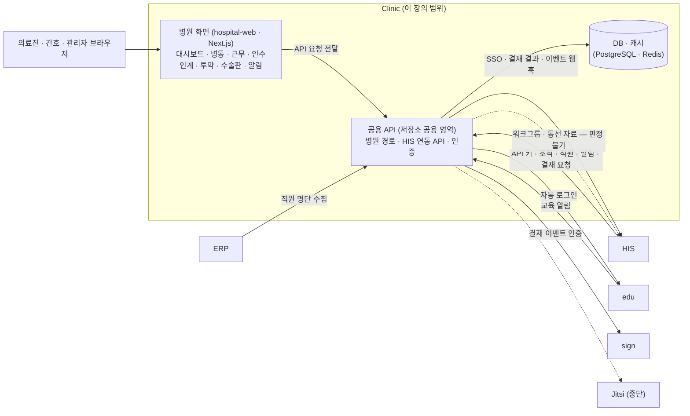

# Clinic — 시스템 구성서

> 기준 버전 **1.4.0** · 기준 커밋 `2b20a89b7c3a` · 구현 상태 `통합` — [매니페스트](../RELEASES/draft/manifest.md) 기준
> 사실 확인: 미확인 — 생태계 자료 측 조사 기준(시스템 담당 확인 전) · **이 시스템은 2026-09 따라가기에서 설치하지 않았습니다**(설치형은 공용 API · 인증 서버까지 필요합니다. 대신 운영 중인 공개 소개 페이지로 공급 형태와 화면 구성만 확인했습니다 · 2026-09-15)

Clinic 은 여러 서비스가 함께 든 저장소 안에 있습니다. 이 장은 그중 **병원 서비스**(병원 화면 패키지)와, 그 서비스가 HIS 와 주고받는 데 필요한 **HIS 연동 API** 만 다룹니다. 이 버전에서 무엇이 바뀌었는지는 [릴리즈 요약](../RELEASES/draft/systems/clinic.md)에 있습니다.

## 1. 정체성과 계층

- **정의**: 병원 그룹웨어입니다. 인수인계 · 근무표 · 병동 현황 · 투약 · 수술판 · 알림을 한 화면 묶음으로 제공하고, HIS 의 자료를 받아 보여줍니다. HIS 가 보내는 결재 요청도 받습니다.
- **계층**: 협업 · 교육 계층. 구축 단계로는 [S5 경영 계층](../README.md#구축은-이렇게-진행됩니다)(ERP · 그룹웨어 · 교육 연결)에서 붙입니다.
- **HIS 와의 인증**: HIS 는 Clinic 이 발급한 **범위를 지정한 API 키**로 붙습니다. HIS 토큰을 공개키로 검증하는 다른 시스템들과 달리, 키 발급 · 보관 · 교체를 따로 관리해야 합니다.
- **공급 형태**: 두 가지입니다 — ① 가입형 호스팅(운영사 서버에 병원을 등록해 바로 사용 · HIS 가 없으면 예시 데이터로 화면을 먼저 볼 수 있음) ② 설치형(전용 서버 · 온프레미스는 별도 협의). 설치형은 아래 §5 처럼 병원 화면만이 아니라 공용 API · 인증 구성요소까지 세웁니다(운영 공개 소개 페이지 · 2026-09-15 확인).
- **로그인**: 병원 코드(`WRB-XXXX-XXXX` 형식)를 먼저 확인한 뒤, 같은 계열 서비스와 함께 쓰는 통합 계정(이메일 · 아이디 또는 소셜 로그인)으로 들어갑니다. 병원 등록은 3단계 마법사(병원 정보 → 담당자 · 상세 → 기능 선택)이고 운영사 검토 뒤 승인됩니다(공개 소개 페이지 · 2026-09-15).
- **버전 표기**: 정본은 병원 서비스 패키지의 선언(1.4.0)입니다. 저장소 루트의 선언과 저장소 태그는 저장소 전체의 표기라 이 서비스의 버전으로 쓰지 않습니다(매니페스트 등급 `참고`). **이 서비스 전용 태그는 없으므로** 설치본은 커밋 해시로 고정합니다.

## 2. 구성도

병원 화면 패키지는 자체 API · DB 가 없습니다. 화면의 `/api/*` · `/uploads/*` 요청을 공용 API 로 넘깁니다.

## 3. 규모

| 항목(스냅샷 키) | 값 | 센 방법(요약) | 계측일 |
|---|---:|---|---|
| `systems.clinic.counts.pages` | 16 | `packages/hospital-web/src/app/**/page.*` 파일 수(레이아웃 · 오류 화면 · API 라우트 제외) | 2026-09-11 |
| `systems.clinic.counts.hisApiRoutes` | 44 | HIS 연동 API 경로 파일(`src/app/api/clinic/his/**/route.ts`) 수 — 파일 1개 = 경로 1개. 이 경로들이 내보내는 HTTP 메서드 핸들러는 60개입니다. HIS 연동이 아닌 병원 서비스용 경로 파일 14개는 이 수에 넣지 않았습니다 | 2026-09-11 |

원본과 규칙 전문: [`data/scale-snapshot.json`](../data/scale-snapshot.json) · 기준 커밋 `2b20a89b7c3a`(저장소 전체의 최신 커밋 — 병원 서비스 패키지의 마지막 변경은 2026-08-19).

## 4. 핵심 기능

| 영역 | 무엇을 하나 |
|---|---|
| 대시보드 | 의사 · 간호 · 관리자 역할별 대시보드 |
| 병동 · 동선 | 층별 병동 현황(혼잡도 · 대기 · 정원 · 의료진 부재)을 주기적으로 갱신하고 대기 초과 · 정원 초과 · 의료진 부재 알림을 띄웁니다. 혼잡도 등급은 HIS 가 판정한 값을 그대로 씁니다. 층 배치 편집기(서버 저장) |
| 근무 | 근무 캘린더(월 · 주 · 일 · 시간 지정 일정 · 부서별 참석자) · 당직표 · 교대 요청 |
| 인수인계 | 병동을 골라 특이사항 기록 · 이력 · 인수자 지정 · 인수자의 "수신 확인" |
| 투약 · 수술 | 투약 일정과 완료 표시 · 수술판 상태. 사용자가 바꾼 상태는 Clinic 쪽에도 저장해 다시 들어와도 유지됩니다 |
| 알림 | 긴급 알림 · 알림함 · 브라우저 알림(종류별 끄기 · 같은 알림 반복 억제) |
| 병원 가입 · 계정 | 병원 등록 마법사(사용할 기능 선택) · 병원 코드로 가입(선택적 승인제) · 로그인한 병원 기억 · 로그인이 필요한 화면의 진입 게이트 |
| HIS 연동 API | HIS 가 부르는 API — 조직 · 직원 동기화 · 알림 · 긴급 알림 · 웹훅 등록 · SSO 티켓 로그인 · 근무 · 당직 · 근태 · 휴가 · 수술 일정 · 체크리스트 · 결재 요청 · 역할 매핑 |
| 출처 표시 | HIS 에서 자료를 받지 못한 화면은 예시 데이터로 채우고 **데이터 출처(데모) 배지**를 붙입니다 |

## 5. 설치 요구사항

| 항목 | 요구 |
|---|---|
| 병원 화면 | Node.js · Next.js 16 · React 19. 자체 API · DB 가 없고 공용 API 로 요청을 넘깁니다 |
| 함께 설치해야 하는 것 | **병원 화면 패키지만으로는 동작하지 않습니다.** 저장소 공용 API(병원 경로 · HIS 연동 경로)와 인증 구성요소가 함께 있어야 합니다. 정확한 범위는 소스 링크를 정리할 때 확정해 싣습니다 |
| DB · 캐시 | 공용 API 가 씁니다. [THIRD_PARTY](../THIRD_PARTY.md#1-별도-서비스로-쓰는-제3자-서버) 기준 PostgreSQL 15 · Redis. 병원 서비스의 로컬 상태 저장 테이블(투약 완료 · 수술판 · 알림 확인 · 교대 요청 · 인수인계)은 저장소의 SQL 스크립트로 추가하며, 업그레이드할 때 적용 순서를 확인합니다 |
| GPU | 필요 없습니다 |
| 네트워크 | 브라우저 → 병원 화면 → 공용 API. HIS 와는 양방향(HIS → Clinic API 키 호출 · Clinic → HIS SSO · 웹훅) |
| 빌드 시 필요 | 봇 방지(Turnstile) 사이트 키 |
| HIS 쪽 준비 | Clinic 에서 범위를 지정한 API 키를 발급해 HIS 에 등록하고, 웹훅 서명용 비밀값을 설정한 뒤 조직 · 직원 동기화를 실행합니다 |

## 6. 주요 설정

키 이름만 적습니다. 값은 자리표시로 생각하십시오. 이 저장소의 코드와 설정 예시에는 특정 설치본의 주소가 기본값으로 들어 있는 곳이 있으므로, 주소 키는 모두 설치 전에 바꿉니다([README](../README.md#지금-알고-시작해야-할-것)).

| 위치 | 키 | 뜻 | 설치 전 |
|---|---|---|---|
| 병원 화면 `.env`(예시 `.env.example`) | `MAIN_APP_URL` | `/api/*` · `/uploads/*` 를 넘길 공용 API 주소(필수) | **반드시 바꿀 것** |
| 〃 | `NEXT_PUBLIC_MAIN_URL` · `NEXT_PUBLIC_MAIN_APP_URL` | 공용 API 의 공개 주소(링크 · 이미지 도메인 · 로그인 시작 링크) | **반드시 바꿀 것** |
| 〃 | `NEXT_PUBLIC_TURNSTILE_SITE_KEY` | 봇 방지 사이트 키(빌드 시 필요) | **반드시 바꿀 것** |
| 〃 | `PORT` | 서비스 포트 | 정할 것 |
| HIS 연동 API(공용 API 쪽) | `HIS_URL` · `HIS_API_KEY` | 워크그룹 · 동선 자료를 HIS 에서 받아 오는 경로의 HIS 주소 · 키 | **반드시 바꿀 것** |
| 〃 | `NEXT_PUBLIC_APP_URL` | 공용 API 의 공개 주소(SSO 되돌아올 주소 등) | **반드시 바꿀 것** |
| 관리 기능 | HIS 연동 API 키 · 웹훅 서명 비밀값 | 병원 관리자가 발급하는 범위 지정 키 · HIS 로 보내는 웹훅의 서명 값 | **반드시 새로 발급** |
| 병원 등록 | 사용할 기능 · 병원 코드 가입 승인제 | 병원 등록 마법사에서 정합니다. 승인제는 선택이며 기본 꺼짐입니다 | 정할 것 |
| 설정 탭 | 갱신 주기 · 알림 종류별 사용 | 갱신 주기는 3초 미만이면 기본값으로 바뀝니다 | 정할 것 |

## 7. 연동

연결 상태는 [연결 상태](../RELEASES/draft/compatibility.md)에서 가져왔습니다(코드 대조 · 2026-09-11 · 실제 호출 확인 전).

**들어오는 연결 11 · 나가는 연결 8** — `구현·미검증` 14 · `미구현` 2 · `설계만` 1 · `중단` 1 · `판정 불가` 1

| 방향 | 목적(요약) | 상태 |
|---|---|---|
| HIS → Clinic | 직원 일괄 등록(HIS 재직자 → Clinic 계정 생성) | `구현·미검증` |
| HIS → Clinic | 조직도 · 보고라인 동기화(결재선 추천 근거) | `구현·미검증` |
| HIS → Clinic | Clinic 직원 목록 조회 → HIS 직원과 매핑 | `구현·미검증` |
| HIS → Clinic | 업무 연동 API 군 — 알림(일반 · 긴급) · 채널 메시지 · 인수인계 · 캘린더 동기화 · 수술 일정 · 근태 · 연차 · 위키 · 웹훅 구독 | `구현·미검증` |
| HIS → Clinic | 전자결재 요청 · 상태 조회 · 결재선 추천(ERP 결재 릴레이의 HIS → Clinic 구간) | `구현·미검증` |
| HIS → Clinic | HIS 이벤트 → Clinic 채널 카드 | `구현·미검증` |
| HIS → Clinic | 재로그인 없이 Clinic 결재 문서를 여는 열람 SSO 티켓 | `미구현` |
| HIS → Clinic · Jitsi | HIS 내부 신원 제공자의 단기 토큰 | `설계만` |
| ERP → Clinic | 그룹웨어 직원 명단 수집(인사 대사 · 매핑) | `구현·미검증` |
| ERP → Clinic | 그룹웨어 근태 수집 → 월 근태 집계 | `미구현` |
| edu → Clinic | 교육 알림 단건 · 대량 발송(Clinic 이 그룹웨어 허브로 중계) | `구현·미검증` |
| Clinic → HIS | 직원 SSO 로그인 — Clinic 이 1회용 토큰을 발급하고 HIS 가 서버 간 확인 | `구현·미검증` |
| Clinic → HIS | 전자결재 결과 콜백(승인 · 반려 · 회수) → HIS 가 ERP 로 전달 | `구현·미검증` |
| Clinic → HIS | 일반 이벤트 웹훅(연차 승인 · 반려 등) | `구현·미검증` |
| Clinic → HIS | 병원 등록 — 병원 승인 때 발급한 API 키 · 병원 코드를 HIS 에 통지 | `구현·미검증` |
| Clinic → HIS | 병원 화면의 워크그룹(의사 일정 · 수술 · 병동 · 투약 · 근무) · 동선(층 · 구역 · 흐름) 자료 | `판정 불가` |
| Clinic → edu | Clinic 로그인 사용자의 edu 자동 로그인 딥링크 | `구현·미검증` |
| Clinic → sign | 전자결재 문서 인증 — 결재 이벤트를 sign 감사 스트림에 기록 · 검증 | `구현·미검증` |
| Clinic → Jitsi | 회의 녹화 제어 · 녹화 스트림 · 회의 분석 | `중단` |

- `판정 불가` 는 배포 구성(주소 · 앞단 프록시 등)에 따라 달라져 코드만으로 정할 수 없다는 뜻입니다.
- 시스템 담당 확인을 기다리는 연결은 이 장에 싣지 않았습니다([연결 상태](../RELEASES/draft/compatibility.md)).

## 8. 표준과 규제

- **연동 형식**: REST(JSON) · 서명된 웹훅 · SSO 티켓. 의료 표준(FHIR · HL7 등)은 쓰지 않습니다.
- **규제 표기**: 의료기기 기능이 아니므로 규제 대응 단계를 적지 않습니다. 결재 문서의 전자서명 · 감사 기록은 [sign](sign.md) 장을 따릅니다.

## 9. AI 사용

- **이 버전의 병원 서비스는 AI 를 쓰지 않습니다.** 첫 화면의 AI 지식 기능은 구현되지 않아 "준비 중"으로 표기돼 있습니다(v1.3.0).
- 따라서 AI Server 와의 연결도 없고, 켜고 끌 AI 스위치도 없습니다.

## 10. 한계와 대체 수단

| 한계 | 대체 수단 · 준비 |
|---|---|
| HIS 와의 인증이 API 키 방식입니다 | 키 발급 · 보관 · 교체 절차와 담당자를 정해 둡니다 |
| HIS 에서 자료를 받지 못하면 예시 데이터로 채웁니다 | 운영에서는 화면의 데이터 출처(데모) 배지를 확인합니다. 배지가 보이면 HIS 연결부터 점검합니다 |
| 혼잡도 임계값은 설정 화면에 저장되지만 아직 판정에 쓰이지 않습니다(HIS 로 전달하는 연동이 생긴 뒤 반영) | 혼잡도 등급은 HIS 판정값을 따르므로, 판정 기준은 HIS 쪽에서 확인합니다 |
| 병원 코드 가입은 기본적으로 승인 없이 합류합니다. 승인제는 병원을 등록할 때만 켤 수 있고, 이미 등록된 병원은 설정 값을 직접 넣어야 합니다 | 병원 등록 때 승인제 사용 여부를 정합니다 |
| 병원 서비스는 다른 서비스와 한 저장소에 있어, HIS 연동 API · 인증 · 알림 같은 공용 부분은 이 서비스 버전과 따로 바뀝니다. 공용 부분의 변경 이력은 이 자료 범위 밖입니다 | 설치본을 커밋 해시로 고정하고, 업그레이드 때 공용 부분의 변경을 따로 확인합니다 |
| 연결별 동작은 코드 대조까지만 판정했습니다. 생태계 자료의 새 설치본 따라가기(2026-09-14~15)에서 Clinic 은 **설치하지 않았습니다**(설치형이 공용 API 전체를 요구) — 화면 구성은 리허설 캡처와 운영 공개 소개 페이지로 파악했습니다 | 기관이 리허설(S7)에서 쓰는 연결마다 실제 호출해 `검증됨` 을 붙입니다 |
| 소개 페이지 · 저장소 문서에 적힌 규모 수치 · 인증 표기는 이 자료의 계측 · 표기 규칙과 다를 수 있습니다 | 규모는 [매니페스트](../RELEASES/draft/manifest.md) · 계측 스냅샷을, 규제 표기는 이 자료의 3단계를 기준으로 봅니다 |

## 11. 소스 · 라이선스 표기 · 확인일

- **소스 링크**: 정리 중
- **저장소 라이선스 표기**: 독점 — [매니페스트](../RELEASES/draft/manifest.md) 기준(생태계 소프트웨어는 MIT 로 제공하는 것이 목표이며 표기는 정리 중입니다)
- **제3자 구성요소**: [THIRD_PARTY.md](../THIRD_PARTY.md) — PostgreSQL 15 · pgvector 확장 이미지 · Redis(판본에 따라 약관이 다름)
- **확인일**: 2026-09-11 — 기준 커밋 `2b20a89b7c3a` 의 병원 서비스 패키지 · HIS 연동 API 코드 · 설정 예시 · 릴리즈 기록을 읽어 작성했습니다
