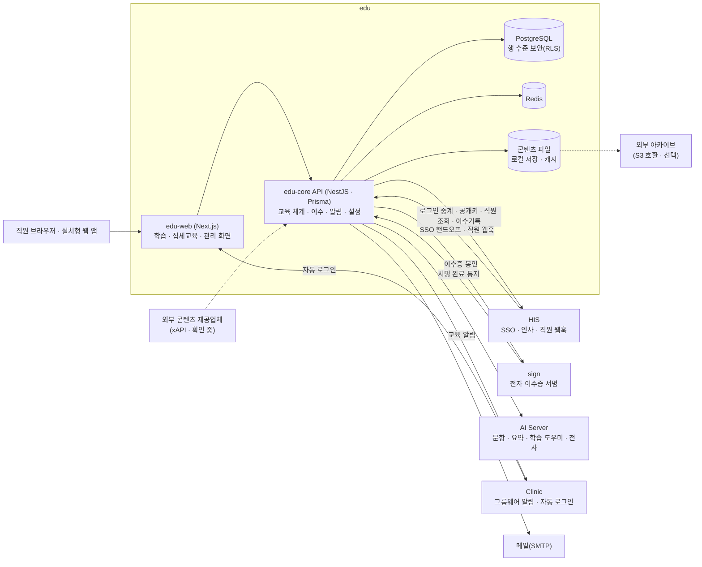

# edu — 시스템 구성서

> 기준 버전 **2.7.0** · 기준 커밋 `f8127e6ee278` · 구현 상태 `확인 필요` — [매니페스트](../RELEASES/2026.09/manifest.md) 기준
> 사실 확인: 미확인 — 생태계 자료 측 조사 기준(시스템 담당 확인 전) · 새 설치본으로 한 번 따라가 봄(2026-09-13~16 · 개발 PC · GPU 없음 · 격리 네트워크 — [결과](../build-guide/follow-along-2026-09.md))

> **EN** — Staff e-learning, statutory training management and electronic completion certificates. edu handles course delivery and the completion → record → certificate flow, while sign-in and staff roster come from HIS, certificate signing from sign, and AI features from the AI Server. Status at the base commit is `확인 필요` (needs confirmation) — whether it is in production has not been re-checked, and the repository's last release record and last commit are both from 2026-07-30. Its SSO, public-key lookup, roster and completion-record connections with HIS were verified by real calls in the 2026-09 follow-along.

이 버전에서 무엇이 바뀌었는지는 [릴리즈 요약](../RELEASES/2026.09/systems/edu.md)에 있습니다.

## 1. 정체성과 계층

- **정의**: 의료기관 직원의 이러닝 · 법정의무교육 관리 · 전자 이수증 발급 시스템입니다. edu 는 학습 전달과 "이수 → 기록 → 발급" 흐름을 맡고, 로그인 · 인사 · 이수 기록은 HIS 와, 이수증 서명은 sign 과, AI 기능은 AI Server 와 연동합니다.
- **계층**: 협업 · 교육 계층. 구축 단계로는 [S5 경영 계층](../README.md#구축은-이렇게-진행됩니다)(ERP · 그룹웨어 · 교육 연결)에서 붙입니다.
- **구현 상태**: `확인 필요` — 운영 여부를 다시 확인하기 전이라 단계를 적지 않습니다. 저장소의 마지막 릴리즈 기록과 마지막 커밋은 2026-07-30 입니다.
- **HIS 가 먼저 있어야 합니다.** 로그인은 HIS SSO 뿐이라 edu 만 따로 쓸 수 없습니다.
- **버전 표기**: 정본(루트 `package.json`) · 태그 · 릴리즈 기록이 모두 2.7.0 으로 맞습니다. 하위 패키지 선언(0.1.0)은 버전 관리에 쓰지 않습니다(매니페스트 등급 `참고`).

## 2. 구성도

## 3. 규모

| 항목(스냅샷 키) | 값 | 센 방법(요약) | 계측일 |
|---|---:|---|---|
| `systems.edu.counts.dataModels` | 40 | `apps/api/prisma/schema.prisma` 의 `model` 선언 수(enum · view 제외) | 2026-09-11 |
| `systems.edu.counts.apiEndpoints` | 167 | `apps/api/src/**/*.ts` 의 HTTP 메서드 데코레이터 수(= 핸들러 수) · 테스트 파일 · SSE 제외 | 2026-09-11 |
| `systems.edu.counts.pages` | 41 | `apps/web/app/**/page.*` 파일 수(레이아웃 · 오류 화면 · API 라우트 제외) | 2026-09-11 |

원본과 규칙 전문: [`data/scale-snapshot.json`](../data/scale-snapshot.json) · 기준 커밋 `f8127e6ee278`.

## 4. 핵심 기능

| 영역 | 무엇을 하나 |
|---|---|
| 교육 체계 | 법정의무교육 마스터(근거 법령 · 주기 · 시수 · 제재) · 직종 · 역할 · 속성별 커리큘럼 · 필수교육 매트릭스의 매일 자동 배정 · 개인 예외(추가 · 면제 · 유예) · 유효기간 만료 시 재이수 배정 · 인증평가 대비 이수 추적과 부족분 분석 · 온보딩 커리큘럼 |
| 과정 · 콘텐츠 | 차시 · 동영상(진도 추적) · 파일 · SCORM 1.2 · 시험 자동 채점 · 재응시 제한 · 만족도 설문. 콘텐츠는 검수 게이트(초안 → 승인)를 거쳐야 학습자에게 보입니다 |
| 외부 콘텐츠 | 외부 제공업체와 링크 · 수료증 · SCORM · SSO 이수 회신으로 연계하고 정산 리포트를 냅니다. xAPI 1.0.3 수신(LRS)을 지원합니다 |
| 학습 · 이수 | HIS 계정 자동 로그인 · 과정 신청 · 집체교육(일정 · QR 출석 · 진행 화면) · 본인 소유 검증 · 실제 학습 시간만 누적하는 최소 학습시간 검증 · 설치형 웹 앱(PWA · 오프라인 · QR 스캐너) |
| 전자 이수증 | sign 이 전자서명 · 타임스탬프로 발급 · QR 검증 · 폐기 · 재발급 |
| 알림 · 자동화 | 마감 리마인드 · 기한 초과 에스컬레이션 · 미이수자의 상급자에게 하루 한 번 요약 알림 · 이메일 · 문자 · 그룹웨어 채널(채널을 설정했을 때만 실제 발송, 아니면 모의 발송) |
| 관리 · 거버넌스 | 대시보드(준수율 · 인증 커버리지 · 부족분) · 이수 명부 · 연간 이수 체크리스트(CSV) · 역할 세분화 · 해시체인 감사 로그와 검증 · 퇴직자 연락처 익명화 배치 |
| 배포 형태 | 기관 하나만 쓰는 **단독 배포**와, 한 배포에서 여러 기관을 격리해 쓰는 **멀티테넌트**. 격리는 쿼리 단계와 PostgreSQL 행 수준 보안(RLS) 두 겹입니다 |

## 5. 설치 요구사항

| 항목 | 요구 |
|---|---|
| 구성 | Docker Compose — API(`edu-core`) · 웹(`edu-web`) · PostgreSQL · Redis |
| 런타임 | Node.js 20(컨테이너) · NestJS 10 · Prisma 5 · Next.js 15 |
| DB · 캐시 | PostgreSQL 16 · Redis 7. 멀티테넌트 격리를 위해 DB 에 런타임 전용 역할을 만들고 RLS 를 적용합니다. 새 테이블을 만들 때마다 RLS 적용 절차를 따라야 합니다(스키마 반영 명령은 RLS 를 붙이지 않습니다) |
| 저장소 | 콘텐츠 업로드 볼륨. 기본은 로컬에만 저장하고 외부 사본을 두지 않습니다 — 수료증 · 이수 자료가 들어가므로 백업을 따로 준비하거나 외부 아카이브(S3 호환 객체 저장소)를 설정합니다 |
| GPU | 필요 없습니다. AI 기능은 AI Server 를 부릅니다 |
| 네트워크 | HIS · sign · AI Server · 메일 · 그룹웨어로 나가는 연결 |
| 함께 설치해야 하는 것 | **HIS**(필수 — SSO 공개키 · 인사 · 이수 기록 · 직원 웹훅 서명) · **sign**(전자 이수증) · AI Server(선택 — AI 기능) · 알림 채널(선택) |
| 먼저 정할 것 | **배포 형태** — 단독 배포는 환경변수의 HIS 가 곧 인증원입니다. 멀티테넌트는 기관마다 자기 HIS 주소를 넣어야 로그인이 열리고, 새 기관 설정은 플랫폼 콘솔에서 넣습니다 |

- **따라가기에서 확인한 것**(2026-09-13~16 — [결과](../build-guide/follow-along-2026-09.md)) — ✅ 저장소 파일 그대로 빌드됐습니다. 다만 운영 compose 가 **호스트 네트워크를 전제**하고 각 서비스가 자기 자신에게만 붙어 있어, 격리한 망에 올리려면 구성을 바꿔야 했습니다. 순서는 [S5](../build-guide/S5-management.md).
- 설치 안내에 **기관(테넌트) 행 만들기와 앱 전용 DB 역할 · RLS 적용 단계가 빠져** 있어 따로 넣었습니다. 기본 콘텐츠 시드는 16개 중 13개가 들어갔습니다.
- **AI 주소 · 키가 설치 직후 비어 있습니다.** 넣는 곳은 환경변수 또는 기관 설정이고, 기관 설정은 **반영까지 최대 1분** 걸립니다(키를 폐기할 때 이 시차를 감안합니다).

## 6. 주요 설정

기관 정보와 연동 설정은 기동한 뒤 **관리 화면(설정)** 에서 바꾸고 바로 반영할 수 있습니다. 환경변수(`.env` · 운영용 예시 `.env.prod.example`)에 넣은 값은 초기값으로 쓰이고 화면에 'ENV' 로 표시됩니다. 비밀값은 조회할 때 보이지 않고, 연결 점검 버튼이 있습니다. 값은 자리표시로 생각하십시오.

| 묶음 | 환경변수 | 관리 화면 키 | 뜻 | 설치 전 |
|---|---|---|---|---|
| DB | `DATABASE_URL` · `EDU_DB_PASSWORD` · `EDU_APP_PASSWORD` · `REDIS_URL` | — | DB · Redis 접속 · RLS 런타임 역할 비밀번호 | **반드시 바꿀 것** |
| 기관 정보 | `EDU_ORG_NAME` · `EDU_PUBLIC_URL` · `EDU_EMAIL_HINT` | 〃 | 기관명 · 공개 주소 · 로그인 안내 | **반드시 바꿀 것** |
| HIS | `HIS_BASE_URL` · `HIS_JWT_SECRET` · `HIS_SERVICE_SUB` · `HIS_SERVICE_JWT` · `HIS_INTEGRATION_KEY` | `his.baseUrl` · `his.jwksUrl` · `his.tokenIssuer` · `his.tokenAudience` · `his.staffTokenUrl` · `his.serviceSub` · `his.serviceJwt` · `his.jwtSecret` · `his.eduKey` | HIS 주소 · SSO 공개키 주소 · 토큰 발급자 · 대상 · HIS 서버 간 호출 인증 값(비밀값 포함) | **반드시 바꿀 것** — 로그인 자체가 HIS 를 거치므로 관리 화면에 들어가기 전에 환경변수로 넣습니다 |
| sign | `SIGN_INTERNAL_URL` · `SIGN_PUBLIC_URL` · `SIGN_API_KEY` · `SIGN_REGISTRAR_SERIAL` | `sign.internalUrl` · `sign.publicUrl` · `sign.apiKey` · `sign.registrarSerial` | sign 주소 · API 키 · 이수증 발급 등록자 인증서 | **반드시 바꿀 것** |
| AI Server | `AI_BASE_URL` · `AI_BEARER` · `AI_TENANT_KEY_MEDICAL` | `ai.baseUrl` · `ai.bearer` · `ai.model` | AI Server 주소 · 호출 키 · 모델 | 쓰면 **반드시 바꿀 것** |
| 메일 | `SMTP_HOST` · `SMTP_PORT` · `SMTP_USER` · `SMTP_PASS` · `SMTP_FROM` | `smtp.*` | 메일 발송. 설정하지 않으면 모의 발송 | 쓰면 **반드시 바꿀 것** |
| 그룹웨어 | `GROUPWARE_BASE_URL` · `GROUPWARE_API_KEY` · `GROUPWARE_SENDER_ID` | `groupware.*` | Clinic 으로 보내는 교육 알림 | 쓰면 **반드시 바꿀 것** |
| 웹훅 | `EDU_WEBHOOK_SECRET` | — | HIS 직원 웹훅 서명 검증 비밀값 | **반드시 바꿀 것** |
| 플랫폼 | `PLATFORM_ADMIN_SUBS` | — | 멀티테넌트 플랫폼 운영자 식별자 목록 | **반드시 바꿀 것** |
| 콘텐츠 저장 | — | `storage.archive` · `storage.cacheMaxBytes` | 외부 아카이브 사용(기본 `none` — 로컬만) · 로컬 캐시 삭제 한도(기본 0 — 삭제 꺼짐) · 저장소 관리 화면은 기본이 모의 실행 | 정할 것 |

- HIS 개시 점검표에 edu 연동 비밀값 정리 항목(`legal.eduHardening`)이 있습니다([Go-Live 체크리스트](../checklist/go-live.md)).
- **지켜야 할 규칙**(저장소 문서) — 개별 이수증 폐기는 `withdraw` 로만 합니다. 공유 등록자 인증서를 폐기하면 발급 전체가 무효가 됩니다. 웹훅 수신은 항상 2xx 로 답하고 반영하지 못한 사유는 본문에 적습니다.
- AI 기능 스위치의 기본값은 릴리즈 요약 · README 에 적힌 것이 없어 싣지 않았습니다.

## 7. 연동

연결 상태는 [연결 상태](../RELEASES/2026.09/compatibility.md)에서 가져왔습니다(코드 대조 2026-09-11 + 새 설치본끼리 실제 호출 2026-09-14~15).

**들어오는 연결 4 · 나가는 연결 8** — `검증됨` 6 · `구현·미검증` 5 · `미구현` 1. `검증됨` 6 은 HIS 와의 SSO · 공개키 조회 · 직원 명부 · 이수 기록, sign 과의 이수증 봉인 · 완료 통지입니다(확인일은 연결 상태 표).

| 방향 | 목적(요약) | 상태 |
|---|---|---|
| HIS → edu | 직원 SSO 핸드오프 — HIS 웹의 사내교육 런처가 edu 용 직원 토큰(RS256)을 발급해 edu 로 넘김 | `검증됨` |
| HIS → edu | 직원 이벤트 웹훅(입사 · 변경 · 근무 변경 · 퇴직 반영, 자격 변경은 수신만) | `구현·미검증` |
| sign → edu | 이수증 서명 완료 통지(정합 확인 · 해시 교차검증) | `검증됨` |
| Clinic → edu | Clinic 로그인 사용자의 edu 자동 로그인 딥링크 | `구현·미검증` |
| edu → HIS | edu 로그인 화면의 계정 입력을 HIS 로그인으로 중계 → edu 용 직원 토큰으로 교환 | `구현·미검증` |
| edu → HIS | 직원 토큰 검증용 HIS 공개키(JWKS) 조회 | `검증됨` |
| edu → HIS | 직원 디렉터리 조회(교육 대상자 자동 지정 · 야간 폴링) | `검증됨` |
| edu → HIS | 교육 이수기록 기록(법정 · 보수교육 → HIS 자격 · 교육 원장) · 카탈로그 이수 | `검증됨` |
| edu → HIS | edu → HIS 직원 인앱 알림 | `미구현` |
| edu → sign | 법정교육 이수증 봉인(시스템 발급 서명) · 폐기 · 철회 | `검증됨` |
| edu → Clinic | 교육 알림(미이수 독촉 등) 단건 · 대량 발송 — Clinic 이 그룹웨어 허브로 중계 | `구현·미검증` |
| edu → AI Server | 학습 도우미(과정 자료 RAG) · 문항 생성 · 요약 · 번역 · 집체교육 녹취 분석 | `구현·미검증` |

- 표에 없는 연결: 외부 콘텐츠 제공업체 → edu(xAPI) — 확인 중.
- 시스템 담당 확인을 기다리는 연결은 이 장에 싣지 않았습니다([연결 상태](../RELEASES/2026.09/compatibility.md)).

## 8. 표준과 규제

- **표준**: SCORM 1.2(가져오기 · 재생) · xAPI 1.0.3(LRS 수신) · WebVTT 자막 · 설치형 웹 앱(PWA) · 직원 토큰 공개키(JWKS) 검증.
- **법정교육**: 법정의무교육 마스터에 근거 법령 · 주기 · 시수 · 제재를 담습니다. 법령 · 인증평가 기준은 나라와 시점에 따라 다르므로, 기관이 자기 기준으로 검토해 씁니다.
- **콘텐츠 이용 조건**: 공공기관 공개 자료로 만든 법정교육 콘텐츠는 공공누리 제1유형(출처표시)을 따른다고 저장소가 적습니다.
- **규제 표기**: 의료기기 기능이 아니므로 규제 대응 단계를 적지 않습니다. 전자 이수증의 서명 · 타임스탬프 표기는 [sign](sign.md) 장을 따릅니다.

## 9. AI 사용

- **무엇을 돕나** — 시험 문항 **초안** · 콘텐츠 요약 **초안** · 승인된 콘텐츠로 답하는 학습 도우미(RAG) · 집체교육 녹화의 전사 · 요약 **초안**(검수를 거쳐 WebVTT 자막이 붙은 온라인 콘텐츠로 등록).
- **사람 승인** — AI 가 만든 것은 모두 사람의 검수 게이트를 통과해야 학습자에게 쓰입니다. 학습 도우미는 승인된 콘텐츠만 근거로 씁니다.
- **연산 위치** — 모든 AI 연산은 기관 안의 AI Server 에서 합니다. 녹화 전사는 진료 기능과 같은 GPU 를 나눠 쓰므로, 진료가 몰리는 시간에는 늦어질 수 있습니다(전사 업로드 권장 시간대 안내가 있음).
- **모델 약관** — AI Server 가 쓰는 모델의 약관은 [THIRD_PARTY §3](../THIRD_PARTY.md#3-ai-모델-가중치)에 있습니다.

## 10. 한계와 대체 수단

| 한계 | 대체 수단 · 준비 |
|---|---|
| 로그인은 HIS SSO 뿐입니다. 자체 계정 · 외부 IdP 방식은 설계만 있고 구현되지 않았습니다 | HIS 를 먼저 세웁니다 |
| 직원 이벤트만으로 신규 입사자가 반영되지 않는 경우가 있습니다 | 야간 동기화(폴링)를 끄지 않습니다 |
| HIS 자격 이벤트(면허 등)는 edu 에 대응 모델이 없어 반영하지 않습니다 | 자격에 따라 달라지는 교육 배정은 개인 예외(추가)로 관리합니다 |
| 외부 콘텐츠 제공업체별 카탈로그 · 이수 조회 API 는 의도적으로 구현하지 않았습니다 | xAPI 표준 수신을 씁니다 |
| NAS 아카이브 드라이버는 보류돼 있습니다 | S3 호환 아카이브 또는 별도 백업을 씁니다 |
| 감사 해시체인은 한 프로세스 안의 직렬화에 기대고 있어, API 서버를 여러 개로 늘리면 이 가정이 깨진다고 저장소 문서가 적습니다 | API 서버는 하나로 운영합니다 |
| 녹화 전사의 화자 분리는 합성 음성으로 확인했고, 실제 강의 대조는 따로 필요합니다 | 전사 결과는 검수 게이트에서 사람이 확인합니다 |
| 기본 콘텐츠는 초안 · 검수 상태로 들어 있습니다 | 병원의 임상 검수와 병원 고유 정보 입력을 거친 뒤 노출합니다 |
| 운영 여부를 다시 확인하기 전입니다(`확인 필요`) | 새 설치본으로는 설치해 HIS · sign 과의 연결을 확인했습니다(2026-09-14~15). 실제 기관에서 쓰이고 있는지는 시스템 담당 확인이 남아 있습니다 |

## 11. 소스 · 라이선스 표기 · 확인일

- **소스 링크**: 정리 중
- **저장소 라이선스 표기**: 독점 · 독점 — [매니페스트](../RELEASES/2026.09/manifest.md) 기준(생태계 소프트웨어는 MIT 로 제공하는 것이 목표이며 표기는 정리 중입니다)
- **제3자 구성요소**: [THIRD_PARTY.md](../THIRD_PARTY.md) — PostgreSQL 16 · Redis(판본에 따라 약관이 다름)
- **확인일**: 2026-09-11 — 기준 커밋 `f8127e6ee278` 의 코드 · 설정 예시 · 저장소 문서를 읽어 작성했습니다
