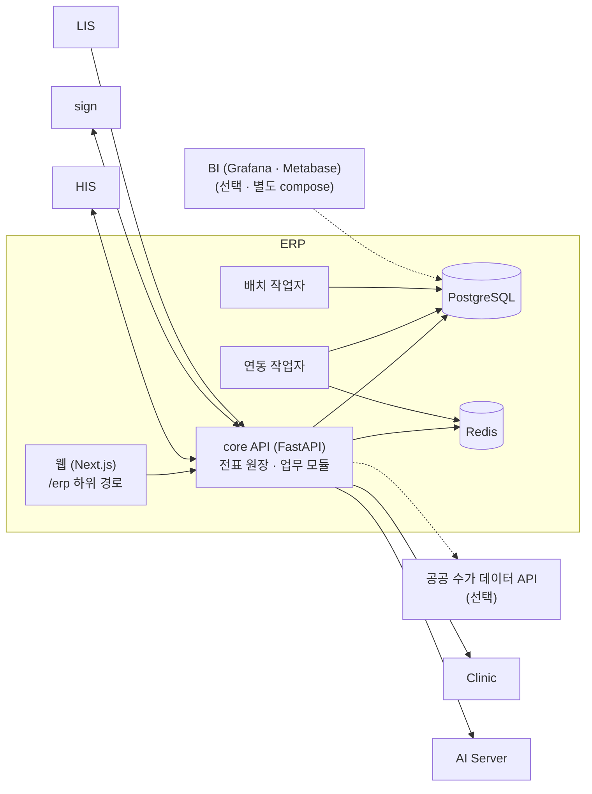

# ERP — 시스템 구성서

> 기준 버전 **1.287.3** · 기준 커밋 `0e1f54c5b902` · 구현 상태 `파일럿` — [매니페스트](../RELEASES/draft/manifest.md) 기준
> 사실 확인: 미확인 — 생태계 자료 측 조사 기준(시스템 담당 확인 전) · 새 설치본으로 따라가 보기 전

이 버전에서 무엇이 바뀌었는지는 [릴리즈 요약](../RELEASES/draft/systems/erp.md)에 있습니다.

## 1. 정체성과 계층

- **정의**: 병원 백오피스 ERP 입니다. 재무회계 · 원가 · 인사급여 · 구매자재 · 원무 수납 · 보험청구 · 세무를 하나의 전표 원장 위에서 이어 줍니다. 환자 · 진료의 정본은 HIS 에 있고, ERP 는 HIS 가 보내는 수납 · 청구 · 자재 · 인사 이벤트를 받아 회계로 옮깁니다.
- **계층**: ⑤ 경영. 구축 단계로는 [S5 경영 계층](../README.md#구축은-이렇게-진행됩니다)에서 붙입니다.
- **구조**: FastAPI 모듈러 모놀리스(업무 모듈별 경계) + Next.js 웹 + 비동기 작업자 2종(배치 · 연동). 분산 구조 대신 정합성에 투자하는 설계라고 저장소가 스스로 밝힙니다.
- **구현 상태**: `파일럿` — 저장소 문서마다 운영 · 개발 표기가 엇갈려 재확인 대상입니다(매니페스트 주석).
- **로그인**: HIS 에서 넘어오는 SSO 가 기본입니다(첫 로그인 때 계정 생성 · ERP 는 자체 비밀번호를 저장하지 않음). HIS 토큰은 **공유 비밀키 방식**이라 HIS 와 ERP 가 같은 키를 나눠 가져야 하고, 키 관리가 따로 필요합니다. 이와 별개로 PIN + 패스키 2단계 로그인 수단이 있습니다.
- **버전 표기**: 정본은 `services/core/pyproject.toml` 의 1.287.3 이고 같은 이름의 태그가 있습니다. 웹 패키지(0.1.0)는 따로 매겨집니다(매니페스트 등급 `참고`).

## 2. 구성도

연결마다 방향 · 목적 · 상태는 [7. 연동](#7-연동)에 있습니다.

## 3. 규모

| 항목(스냅샷 키) | 값 | 센 방법(요약) | 계측일 |
|---|---:|---|---|
| `systems.erp.counts.dataModels` | 219 | `services/core/src/**/*.py` 의 `__tablename__` 선언 수(SQLAlchemy 모델 1개 = 1) | 2026-09-11 |
| `systems.erp.counts.apiEndpoints` | 717 | `services/core/src/**` 에서 FastAPI 라우터 변수의 HTTP 데코레이터 수 = 핸들러 수 | 2026-09-11 |
| `systems.erp.counts.pages` | 113 | `apps/web/src/app/**/page.*` 수(`(app)` 그룹 110 · 그 밖 3) | 2026-09-11 |
| `systems.erp.counts.testCases` | 1,736 | `services/core/tests/**/test_*.py` 의 테스트 함수 선언 수(파일 222) — 선언 수이지 통과 수가 아님 | 2026-09-11 |

원본과 규칙 전문: [`data/scale-snapshot.json`](../data/scale-snapshot.json) · 기준 커밋 `0e1f54c5b902`.

## 4. 핵심 기능

| 영역 | 무엇을 하나 |
|---|---|
| 재무회계 | 모든 모듈의 거래가 전표 한 창구로 들어오고, 같은 출처의 전표를 두 번 만들지 않습니다(멱등). 시산표 · 손익계산서 · 재무상태표(독립 계산과 대조해 스스로 점검), 고정자산 · 리스 · 채권채무와 연령 분석 · 자금일보 · 현금흐름 전망 · 외화 환산, 예산 통제 · 월 결산 잠금 · 연말 결산 분개 · 경비청구와 법인카드 정산 · 부대사업 수익 |
| 원가 · 경영분석 | 활동기준(ABC) 원가 배부와 진료과별 손익(수익 − 원가 − 삭감), 배부 결과의 마감 고정, 재무 · 인사 · 진료 · 보험 지표를 모은 경영 대시보드. 선택 구성으로 공개 BI 도구를 붙입니다 |
| 인사 · 급여 | 직원 · 직군 · 고용형태 · 면허(만료 · 보수교육 경보) · 연차 · 근무표 · 근태, 직종별 급여 규칙 · 4대보험 · 원천징수 · 퇴직금과 충당부채 · 연말정산 · 의료진 개별 계약과 성과급. 민감한 인사 정보는 암호화해 저장합니다. 직원 셀프서비스(급여명세 · 연차 · 원천징수영수증)는 HIS 화면을 거쳐 제공합니다 |
| 구매 · 자재 | 품목 · 로트 · 선입선출 재고 · 구매요청 → 발주 → 입고 검수 → 미지급금 자동 생성 · 반품 · 위탁재고 · 재고 평가와 실사. 마약류 수불부는 추가만 되는 기록과 해시 체인으로 남기고 정정은 정정 기록으로만 합니다. IT 자산 관리 |
| 원무 수납 · 보험청구 · 세무 | 진료비 책정 · 본인부담 분리 · 수납과 일마감 → 전표 · 환자 미수금 회수, 청구 산정 엔진 · 청구 전 사전심사 규칙 · 심사 결과 · 삭감 · 이의신청과 법정 기한 관리, 유효 기간을 가진 수가 · 약제 마스터(과거 시점 재계산), HIS 약품 코드와 보험 코드 매칭, 원천징수 이행상황 · 사업장현황신고 집계 · 전자세금계산서 수취와 대사 · 부가세 집계 |
| 결재 · 운영 관리 | 일반 전자결재(결재선 · 다단계 승인 · 회수 · 공람 · 해시 체인 원장), **정기업무 레지스트리**(업무마다 수동 / 자동 / AI 보조 모드 — 9절), 감사 로그(변경 전 · 후 · 민감값 가림) · 법정 접속기록 · 도메인 사이 정합성 상시 점검 · 기관 단위 메뉴 끄기 |

## 5. 설치 요구사항

| 항목 | 내용 | 근거 |
|---|---|---|
| 런타임 | core API · 작업자 Python 3.12, 웹 Node.js 22 · Next.js | 각 Dockerfile |
| 데이터베이스 | PostgreSQL. 저장소 개발 compose 는 15 를 쓰고, HIS 와 같은 서버에 함께 올리는 배치는 HIS 의 DB 서버를 함께 씁니다. 마이그레이션(Alembic)은 기동할 때 적용되며, 확장 `btree_gist`(수가 기간 겹침 방지) · `pg_trgm`(약품명 검색)을 만듭니다 — DB 계정에 확장 생성 권한을 주거나 미리 만들어 둡니다 | compose · [릴리즈 요약](../RELEASES/draft/systems/erp.md) |
| 캐시 | Redis 7 | compose 이미지 태그 |
| GPU | 필요 없습니다. AI 보조는 AI Server 가 합니다 | — |
| 문서 출력 | PDF 출력(WeasyPrint)은 운영체제 글꼴 · 렌더링 라이브러리가 필요합니다(컨테이너 이미지에는 들어 있음) | 릴리즈 요약 |
| 구성 | core · 웹 · 연동 작업자 · 배치 작업자. compose 파일은 개발용 · 운영용 · **HIS 와 같은 서버에 함께 올리는 배치용** 세 가지이고, BI(Grafana · Metabase)는 별도 compose 로 선택해 붙입니다 — 둘 다 AGPL 계열입니다([THIRD_PARTY](../THIRD_PARTY.md#1-별도-서비스로-쓰는-제3자-서버)) | `infra/` 의 compose 파일 |
| 네트워크 | 웹은 `/erp` 하위 경로로 서비스합니다. 앞단 프록시는 HIS 에서 넘어오는 첫 화면 응답을 캐시하지 않게 둡니다 | 1.287.2 기록 |
| 저장소(디스크) | DB · 첨부 파일 · 내보내기 · 고시 원문 투입 폴더 · 백업(암호화 · 오프사이트 선택) | compose 볼륨 · 설정 키 |
| 함께 설치해야 하는 것 | 로그인에 HIS(SSO). 수납 · 청구 · 인사 이벤트도 HIS 에서 옵니다. sign · Clinic · AI Server 는 필요할 때 붙입니다 | — |

- **시드 데이터**는 합성 데이터(`TEST-` 접두)이고 개발용 로그인 계정이 들어 있습니다. 실운영 전에 지웁니다.
- **정기업무 담당 역할** — 알림은 담당 역할을 가진 사용자에게 가고, 보유자가 없으면 관리자에게 갑니다. 설치 뒤 재무 · 물류 등 담당 역할을 배정합니다.

## 6. 주요 설정

값은 적지 않습니다. ✔ 는 **설치 전에 반드시 바꿀 것**입니다. 키 목록은 운영용 환경 변수 예시와 core 설정 모듈(`services/core/src/erp/config.py` — 필드 98개)에서 읽었습니다. 비밀값 대부분은 `*_FILE` 키로 파일에서 읽게 할 수 있습니다.

| 키 | 뜻 | 기본값의 성격 | 설치 전 |
|---|---|---|:---:|
| `DATABASE_URL` · `REDIS_URL` · `REDIS_PASSWORD` | DB · 캐시 연결 | 자리표시 · 비밀값 | ✔ |
| `JWT_SECRET` (`JWT_SECRET_FILE`) · `ACCESS_TOKEN_MINUTES` · `REFRESH_TOKEN_DAYS` · `LOGIN_MAX_FAILURES` · `LOGIN_LOCKOUT_MINUTES` | ERP 세션 토큰 · 로그인 잠금 | 비밀값 · 숫자 기본값 | ✔ |
| `DATA_ENC_KEY` · `DATA_ENC_KEY_V2` · `DATA_ENC_KEY_VERSION` · `PHONE_BIDX_KEY` · `APPROVAL_LEDGER_KEY` · `PSEUDONYM_KEY` · `BACKUP_ENC_KEY` | 민감정보 암호화 · 검색 색인 · 결재 원장 · 가명 · 백업 암호화 | 비밀값 | ✔ |
| `WEB_ORIGIN` · `NEXT_PUBLIC_API_URL` · `TRUSTED_HOSTS` | 공개 주소 · 웹이 부르는 API · 허용 호스트 | 예시 파일이 특정 설치본 주소 | ✔ |
| `HOSPITAL_CODE` · `ORG_NAME` · `ORG_LEGAL_NAME` | 기관 코드 · 이름 · 법인명(문서 표기) | 저장소 기본값 | ✔ |
| `HIS_API_BASE` · `HIS_API_KEY` | HIS API 연결 | 코드 기본값이 특정 설치본 주소 · 비밀값 | ✔ |
| `HIS_JWT_SECRET` · `HIS_JWT_AUDIENCE` · `SSO_ALLOWED_EMAIL_DOMAINS` | HIS SSO — **공유 비밀키 방식**(HIS 와 같은 값) | 비밀값 | ✔ |
| `HIS_INTEGRATION_KEY` · `HIS_PII_READ_KEY` · `HIS_WEBHOOK_KEY` · `INBOUND_WEBHOOK_SECRET` · `HIS_FINANCE_WEBHOOK_SECRET` · `HIS_TARGET_TOKEN_SECRET` · `ESS_TARGET_TOKEN_SECRET` | HIS 연동 · 웹훅 수신 · 셀프서비스 요청 검증 | 비밀값 | ✔ |
| `HIS_EAPPROVAL_BASE` · `EAPPROVAL_CALLBACK_SECRET` · `EAPPROVAL_CALLBACK_URL` · `EAPPROVAL_SUBMIT_ENABLED` | 전자결재 상신 릴레이(HIS 경유 Clinic) | 주소 기본값이 특정 설치본 · 상신 꺼짐 | ✔ |
| `CLINIC_API_BASE` · `CLINIC_API_KEY` | Clinic 직원 명단 · 근태 수집 | 코드 기본값이 특정 설치본 주소 · 비밀값 | ✔ |
| `SIGN_INTERNAL_BASE` · `SIGN_PORTAL_BASE` · `SIGN_API_KEY` · `SIGN_WEBHOOK_SECRET` · `SIGN_CALLBACK_URL` · `HIS_SIGN_ORIGINATION_KEY` | sign 계약 서명 · 감사 체인 | 주소 기본값이 특정 설치본 · 비밀값 | ✔ |
| `WEVE_AI_API_BASE` · `WEVE_AI_API_KEY` | AI Server(고시 색인 · 근거 검색) | 비어 있으면 ERP 안의 검색으로 대신합니다 | 결정 |
| `NOTICE_DROP_DIR` | 고시 원문 투입 폴더 | 경로 | 확인 |
| `FEE_API_BASE` · `FEE_API_SERVICE_KEY` | 공공 수가 데이터 연계 | 공공 API 주소 · 기관이 받은 서비스 키 | 결정 |
| `LIS_BILLING_SECRET` | LIS 청구 캡처 수신 검증(HMAC) | 비밀값 | ✔ |
| `WEBAUTHN_RP_ID` · `WEBAUTHN_ORIGIN` · `WEBAUTHN_RP_NAME` · `PIN_2FA_ENABLED` | 패스키 로그인의 신뢰 도메인 · PIN 2단계 | 신뢰 도메인 · 오리진 기본값이 특정 설치본 | ✔ |
| `SMTP_HOST` · `SMTP_PORT` · `SMTP_USER` · `SMTP_PASSWORD` · `SMTP_FROM` | 메일 발송 | 발신자 기본값이 특정 주소 · 비밀값 | ✔ |
| `BACKUP_DIR` · `BACKUP_KEEP_DAILY` · `BACKUP_OFFSITE_DEST` · `BACKUP_OFFSITE_SSH_PORT` · `BACKUP_OFFSITE_SSH_KEY` | 백업 · 오프사이트 | 비어 있으면 오프사이트를 쓰지 않음 | 결정 |
| `ATTACHMENT_DIR` · `ATTACHMENT_MAX_BYTES` | 첨부 파일 | 경로 · 숫자 기본값 | 확인 |
| `METABASE_INTERNAL_BASE` · `METABASE_SSO_USER` · `METABASE_SSO_PASSWORD` · `ERP_BI_PASSWORD` · `GF_ADMIN_PASSWORD` | BI 연결(선택) | 비밀값 | ✔ |
| `PG_NEIGHBOR_WARN_PCT` | DB 서버를 함께 쓰는 배치에서 연결 수 경보 | 숫자 기본값 | 확인 |
| `MEDRLT_LIVE_ENABLED` · `PATIENT_ACCRUAL_ENABLED` · `HIS_INTERIM_GL_ENABLED` · `HIS_PSEUDONYM_ENABLED` · `DEALER_SETTLEMENT_CALLBACK_ENABLED` · `PREREVIEW_AUTO_*` | 연계 · 회계 처리 기능 스위치 | 기능마다 다름 | 결정 |

## 7. 연동

[연결 상태](../RELEASES/draft/compatibility.md)에서 ERP 가 한쪽 끝인 행을 그대로 옮겼습니다. 실제 호출로 `검증됨`을 붙인 연결은 아직 없습니다.

<!-- 연결 상태 표에서 옮긴 부분: 시작 -->

합계: 나가는 연결 16(`구현·미검증` 13 · `미구현` 3) · 들어오는 연결 8(`구현·미검증` 8)

### 나가는 연결

| 방향 | 목적 | 프로토콜 | 상태 |
|---|---|---|---|
| ERP → HIS | 청구 라인·미청구 진행분·비급여·재료·재원(census) 조회 — 전환 시 일괄 적재(backfill)와 간호 모니터 | HTTP GET /api/v1/integration/billing/{lines\|unbilled-progre… | `구현·미검증` |
| ERP → HIS | 마스터 — HIS 직원 디렉터리 조회 후 ERP 사원코드를 HIS 직원에 매핑(전자서명 서명자 식별용) | HTTP GET /api/v1/integration/hr/staff · POST /api/v1/integra… | `구현·미검증` |
| ERP → HIS | 마스터 — 행위 수가·비급여·재료대 마스터를 ERP 에서 HIS 로 적재 | HTTP POST /api/v1/integration/fee/{procedure-codes\|non-cove… | `구현·미검증` |
| ERP → HIS | 전자결재 상신 릴레이 — ERP 결재 문서를 HIS 경유로 Clinic 그룹웨어 결재(W.Sign)에 올림 · 결재선 조회 · 상태 조회 | HTTP POST /api/v1/erp/eapproval/submit(Idempotency-Key) · GE… | `구현·미검증` |
| ERP → HIS | 휴가 결재 결과를 HIS ESS 로 릴레이 | HTTP POST /api/v1/ess/leave/eapproval-callback | `구현·미검증` |
| ERP → HIS | 검진권 딜러 정산 지급 회신(settlement.paid) | HTTP POST /api/v1/voucher/settlements/erp-callback (2분 주기 워커… | `구현·미검증` |
| ERP → HIS | 재고 입고(inventory·CSSD supply)·자산 코드 매핑·청구 심사결과 콜백·환자 조회 — HIS 가 받을 준비만 된 경로들 | HTTP POST /api/v1/integration/inventory/supply · /api/v1/int… | `미구현` |
| ERP → HIS | 의료진 계약 전자서명 발의 — ERP 가 계약을 만들면 HIS 가 문서 발급·sign 제출·요청 ID 바인딩 | HTTP POST /api/v1/sign-integration/erp/request-sign {sourceI… | `구현·미검증` |
| ERP → HIS | 서명 완료본(PDF) 회수 — sign.completed 이벤트에 실린 HIS 문서 다운로드 주소로 가져와 첨부 | HTTP GET (이벤트 payload.document 의 단기 토큰 URL) · ERP 아웃박스(2분 주기… | `구현·미검증` |
| ERP → sign | 외부 거래처(외주) 계약 전자서명(트랙 A) — 증인 인증서 발급·포털 서명요청·포털 토큰 발급 | HTTP POST /v1/certificates/enroll · /v1/requests(signMode PO… | `구현·미검증` |
| ERP → sign | 신뢰의 사슬 — 자금 결재 등 ERP 감사 이벤트를 sign 감사 스트림에 기록·체인 검증 | HTTP POST /v1/audit-events · GET /v1/audit-events · GET /v1/… | `구현·미검증` |
| ERP → sign | 일반 전자계약(sign contracts API — 템플릿·주소록·발송) | HTTP /v1/contracts* (sign 에 구현) | `미구현` |
| ERP → Clinic | 그룹웨어 직원 명단 수집(ERP 인사 대사·clinicUserId 매핑) | HTTP GET /api/clinic/his/staff (일 1회 03:30) | `구현·미검증` |
| ERP → Clinic | 그룹웨어 근태(출퇴근) 수집 → 월 근태 집계 | HTTP GET /api/clinic/his/attendance?since= (일 1회 04:00) | `미구현` |
| ERP → AI Server | 보험·수가 공시(notice) 수명주기 색인 발신 — 등록·철회·색인 상태 조회·동기화 검증(아웃박스 큐) | HTTPS REST(JSON) — 비동기 큐 워커 | `구현·미검증` |
| ERP → AI Server | 청구 사전심사 — 공시 RAG 검색(유형·시행일 필터) · 코드 진단 | HTTPS REST(JSON) | `구현·미검증` |

### 들어오는 연결

| 방향 | 목적 | 프로토콜 | 상태 |
|---|---|---|---|
| HIS → ERP | 수납·청구·재고·자산·인사·검진권·서명완료 운영 이벤트 전달(회계 전표·미러 적재) | HTTP POST 웹훅 · HIS outbox(20초 디스패처·지수 백오프·(domain,ref) 멱등) →… | `구현·미검증` |
| HIS → ERP | 직원 SSO — HIS 로그인 사용자를 ERP 로 자동 로그인(JIT 계정 생성) | 브라우저 SSO 핸드오프(공유 비밀키 서명 토큰) | `구현·미검증` |
| HIS → ERP | 직원 셀프서비스(ESS) — 급여명세·연차 잔여·원천징수·공제코드·당직·성과·퇴직금·증명서 조회, 급여 신원 등록 | HTTP GET/POST /api/v1/integration/hr/{payslip\|leave-balance… | `구현·미검증` |
| HIS → ERP | 수납 화면·환자 포털의 중간/최종 진료비 계산서 조회(ERP 산정값) | HTTP GET /api/v1/integration/billing/invoice?chartNo=&encoun… | `구현·미검증` |
| HIS → ERP | 마스터 — ERP 가 확정한 약품 코드 매핑을 HIS 가 가져와 보험코드 백필 | HTTP GET /api/v1/integration/regulatory/drug-map/confirmed | `구현·미검증` |
| HIS → ERP | 전자결재 결과 콜백 — Clinic W.Sign 결재 결과를 HIS 가 ERP 로 전달 | HTTP POST (상신 때 받은 callback_url, ERP 기본 /api/v1/integrations… | `구현·미검증` |
| sign → ERP | 서명 완료 통지(트랙 A 계약 미러·발효) | HTTP POST 웹훅 → ERP /api/v1/integrations/sign/webhook (202) ·… | `구현·미검증` |
| LIS → ERP | 검사 청구 캡처(LIS 수량 → ERP 산정) · 상태 폴링 | HTTP POST ERP /api/v1/integration/lis/billing(202, 인박스 적재 li… | `구현·미검증` |

<!-- 연결 상태 표에서 옮긴 부분: 끝 -->

시스템 담당 확인을 기다리는 연결은 이 장에 싣지 않았습니다([연결 상태](../RELEASES/draft/compatibility.md)).

## 8. 표준과 규제

- **표준 프로토콜** — 시스템 사이 연결은 HTTP(JSON) API · 웹훅(HMAC 서명 · 멱등 키 · 아웃박스 재시도)입니다(7절). 의료 표준 메시지(FHIR · HL7)는 쓰지 않습니다.
- **회계 · 세무** — 회계기준(K-IFRS) 대응 · 원천징수 · 부가세 · 전자세금계산서 · 연말정산은 국내 제도 기준입니다 — `대응 설계`.
- **법정 기록** — 마약류 수불부(추가만 되는 기록 · 해시 체인) · 법정 접속기록 — `대응 설계`. 외부 인증이나 자체 점검 이행 기록은 이 자료에서 확인하지 않았습니다.
- **보험청구** — 청구 산정 · 사전심사 · 심사 결과 · 이의신청은 국내 심사 제도 기준입니다. 청구서의 대외 전송은 HIS 쪽에서도 구현돼 있지 않습니다([his.md §10](his.md#10-한계와-대체-수단)).

## 9. AI 사용

- **청구 사전심사 보조** — 고시 근거를 찾아 주고 삭감 위험 평가를 **보조**합니다. 고시는 [AI Server](ai-server.md) 의 근거 검색에 색인해 두고 검색하며, 연결이 설정되지 않으면 ERP 안의 검색으로 대신합니다.
- **정기업무의 AI 보조 모드**(저장소 명칭 `AI_ASSISTED`) — 시스템이 **초안을 만들어** 결정 대기함에 올리고, 사람이 승인해야 완료됩니다. 현재 초안 업무는 주간 미수금 점검과 분기 부가세 신고 초안이며, 초안은 기존 집계 기능으로 만듭니다. 승인은 "초안 검토 완료"를 뜻할 뿐 신고 · 납부를 실행하지 않습니다.
- **사람이 하는 것** — 신고 · 납부 · 전기 같은 실행과 신고 금액의 확정은 AI 에 넘기지 않는 것이 설계 원칙입니다.

## 10. 한계와 대체 수단

| 한계 | 대체 수단 · 구축 기관이 할 일 |
|---|---|
| **HIS SSO 가 공유 비밀키 방식**입니다(공개키 검증 방식이 아님) | HIS 와 ERP 에 같은 키를 두고, 키 보관 · 교체 절차를 따로 관리합니다 |
| **국내 제도 전제** — 심사 · 고시 · 수가 · 세법 · 노동 규정을 국내 의료기관 기준으로 설계했습니다 | 다른 나라에 세우려면 청구 · 세무 · 급여 규칙을 새로 붙입니다 |
| **실제 자료가 있어야 진행되는 항목** — 심사 결과 통보서 파서 · 삭감 위험 평가의 기준 보정 · 고시 원문 추가 적재 · 공공 수가 데이터 연계(저장소 백로그) | 기관이 실제 통보서 샘플 · 고시 원문 · 서비스 키를 확보해 진행합니다 |
| **남은 연동 수신부** — 상대 시스템의 규격을 받은 뒤 구현하기로 남겨 둔 수신부가 있습니다(7절 `미구현` 행) | 해당 연결이 필요하면 규격을 맞춰 구현하거나 수작업으로 대신합니다 |
| **DB 공유 배치** — HIS 와 같은 PostgreSQL · Redis 를 함께 쓰는 배치를 전제로 설계됐고, 연결 수 한도도 나눠 씁니다 | 연결 수 경보(`PG_NEIGHBOR_WARN_PCT`)를 보고, 규모가 커지면 DB 를 분리합니다(저장소 문서의 예정 방향) |
| **구현 상태 표기가 문서마다 엇갈립니다** | 매니페스트의 `파일럿`을 기준으로 보고, 시스템 담당 확인을 기다립니다 |

## 11. 소스 · 라이선스 표기 · 확인일

| 항목 | 값 |
|---|---|
| 소스 링크 | 정리 중 |
| 저장소 라이선스 표기 | 표기 없음 — 목표는 MIT, 정리 전([매니페스트](../RELEASES/draft/manifest.md)) |
| 제3자 구성요소 | [THIRD_PARTY.md](../THIRD_PARTY.md) — PostgreSQL · Redis · Grafana · Metabase |
| 기준 커밋 | `0e1f54c5b902` (2026-09-10 · [`data/base-commits.json`](../data/base-commits.json)) |
| 확인일 | 2026-09-11 — 기준 커밋의 compose · 환경 변수 예시 · core 설정 모듈에서 **키 이름과 기본값의 성격만** 읽었습니다 |
| 사실 확인 | 시스템 담당 확인 전 · 새 설치본으로 따라가 보기 전 |
