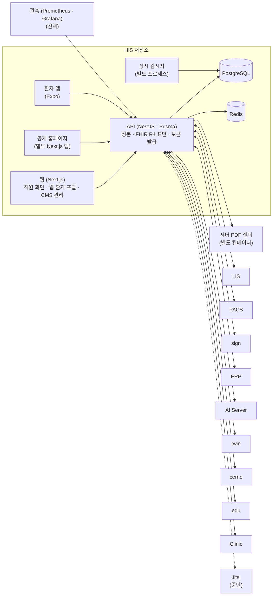

# HIS (Hospital RUN) — 시스템 구성서

> 기준 버전 **v4.18.0** · 기준 커밋 `e9d303984f80` · 구현 상태 `통합` — [매니페스트](../RELEASES/2026.09/manifest.md) 기준
> 사실 확인: 미확인 — 생태계 자료 측 조사 기준(시스템 담당 확인 전) · 새 설치본으로 한 번 따라가 봄(2026-09-13~16 · 개발 PC · GPU 없음 · 격리 네트워크 — [결과](../build-guide/follow-along-2026-09.md))

> **EN** — The core system: outpatient, inpatient, surgery, emergency, clinical support (pharmacy, lab, imaging, pathology, blood), health checkups, front desk, billing and management support in one codebase. It holds the authoritative record for patients, encounters, orders, nursing, front desk and billing, and acts as the ecosystem's **identity hub** — it issues the staff token that sibling systems verify, though the method differs per system (public-key verification for sign, PACS, edu, twin and cerno; a shared secret for ERP and Jitsi; an API key for Clinic). Status at the base commit is `통합` (integrated), and one fresh install was followed through in 2026-09 on a developer PC. §10 states the limits plainly: transmission to external agencies is not implemented, no SMS provider is registered, and the hospital name is still a literal string in part of the code.

이 버전에서 무엇이 바뀌었는지는 [릴리즈 요약](../RELEASES/2026.09/systems/his.md)에 있습니다.

## 1. 정체성과 계층

- **정의**: 외래 · 입원 · 수술 · 응급 · 진료지원(약제 · 검사 · 영상 · 병리 · 혈액) · 검진 · 원무 · 청구 · 경영지원을 한 코드베이스에서 다루는 통합 병원정보시스템입니다. 환자 · 진료 · 오더 · 간호 · 원무 · 청구 정보의 정본을 가집니다.
- **계층**: ① 코어. 구축 단계로는 [S1 코어 HIS](../README.md#구축은-이렇게-진행됩니다)에서 세웁니다. 다른 시스템은 모두 HIS 다음에 붙습니다.
- **신원 허브**: 직원 로그인 토큰을 HIS 가 발급하고 형제 시스템이 검증합니다. 방식은 시스템마다 다릅니다 — sign · PACS · edu · twin · cerno 는 HIS 토큰을 **공개키로 검증**하고, ERP · Jitsi 는 **공유 비밀키 방식**이라 키 관리가 따로 필요하며, Clinic 은 API 키로 붙습니다([README](../README.md#지금-알고-시작해야-할-것)).
- **한 저장소 안의 앱**: 웹(Next.js) · API(NestJS · Prisma) · 공용 패키지(상태 라벨 · 수치 정책 · 역할 목록의 정본) 외에 [공개 홈페이지](homepage.md)와 [환자 앱](patient-app.md)이 같은 저장소에 있고 HIS 와 함께 릴리즈됩니다. 두 앱은 따로 장을 둡니다.
- **운영 모드**: 개발 / 리허설 / 리얼 세 단계입니다. 이 기준 커밋의 구현 상태는 리허설 모드(가상 병원 데이터)입니다.
- **사용자 역할**: 14종(임상 4 · 지원 9 · 관리자 1 — 스키마의 `UserRole` 열거값 수 · 2026-09-11 확인). 역할 이름표는 [메뉴 구성표](his-domains.md#역할-이름)에 있습니다.
- **버전 표기**: 정본은 공용 패키지 상수 `HIS_VERSION`(v4.18.0)입니다. git 태그 v4.18.0 이 기준 커밋 3커밋 앞에 있습니다(2026-09-13 재계측 · 매니페스트 등급 `참고` · 그전엔 v3.46.0 에서 멈춰 `주요`).

## 2. 구성도

화살표는 연결이 있다는 것만 보여 줍니다. 연결마다 방향 · 목적 · 상태는 [7. 연동](#7-연동)에 있습니다.

## 3. 규모

| 항목(스냅샷 키) | 값 | 센 방법(요약) | 계측일 |
|---|---:|---|---|
| `systems.his.counts.dataModels` | 562 | Prisma 스키마의 `model` 선언 수(enum · view 제외) — HIS 저장소 정본 계측기 값을 옮김 | 2026-09-11 |
| `systems.his.counts.apiEndpoints` | 3,251 | API 컨트롤러의 행 시작 HTTP 메서드 데코레이터 수 = 핸들러 수(고유 경로 수가 아님) | 2026-09-11 |
| `systems.his.counts.apiEndpointsSse` | 15 | 같은 파일의 실시간 스트림(`@Sse`) 데코레이터 수 — 위 수에 더하지 않음 | 2026-09-11 |
| `systems.his.counts.pages` | 450 | 웹 앱의 `page.tsx` 수(레이아웃 · 오류 화면 · API 라우트 제외 · 공개 홈페이지 앱 제외) | 2026-09-11 |

원본과 규칙 전문: [`data/scale-snapshot.json`](../data/scale-snapshot.json) · 기준 커밋 `e9d303984f80`.

이 장에서 따로 센 수입니다(스냅샷 밖).

| 항목 | 값 | 센 방법 | 계측일 |
|---|---:|---|---|
| 메뉴 도메인 · 메뉴 묶음 · 메뉴 항목 | 8 · 26 · 266 | 웹 메뉴 정의(`NAV_SECTIONS`)를 추출기로 읽음 — [메뉴 구성표](his-domains.md) | 2026-09-11 |
| 설정 화면의 런타임 설정 키 | 395 | API 설정 모듈(`config-runtime.service.ts`)의 `key:` 선언 중 서로 다른 이름 수 | 2026-09-11 |

## 4. 핵심 기능

HIS 웹 메뉴는 코드에서 **도메인 8개 · 메뉴 묶음 26개 · 메뉴 항목 266개**로 짜여 있습니다. 전체 표(메뉴 · 화면 경로 · 기본 사용 역할)는 코드에서 기계적으로 뽑은 [**HIS 메뉴 구성 — 도메인별**](his-domains.md)에 있습니다. 메뉴에 있다는 것은 화면이 있다는 뜻이고, 실운영 검증을 뜻하지는 않습니다.

| 도메인(메뉴 항목 수) | 무엇을 하나 |
|---|---|
| **진료**(45) | 외래 접수 · 진료실 대기 · 예약 · 처방 입력(CPOE), 간호 워크스테이션, 수술 · 회복실 · 응급실 · 중환자실 · Code Blue, 진료과별 전문 진료 화면, 투석 · 항암 · 방사선종양 · 재활 등 특수 치료, 입원 · 병상 · 회진 · 퇴원, 협진 의뢰 · 회신 |
| **진료지원**(62) | 약국 · 약사 임상활동 · 검사실 · 영상실 · 병리 · 혈액은행 · 화상진료 예약, 부서별 워크스테이션, 건강검진센터(접수 · 동선 · 스테이션 · 문진 · 소견 · 결과서 · 추적), 의무기록 검색 · 사본 · 제증명 |
| **환자·고객**(17) | 고객관계관리(검진 · 해외환자 · 캠페인), 병원 안내 · 동선 |
| **질·안전**(22) | 환자안전 사고 보고 · 감염관리 · 직원 노출 사고 · 질 지표 · 임상 연구(IRB) |
| **운영**(19) | 수납 · 청구서 작성 · 인사 · 재고, 경영 대시보드, 전원 의뢰 · 수신 · 이력 |
| **지능형**(7) | AI 컨시어지 · AI 예약 도우미 · 시뮬레이터 · 환자 여정 · 상호운용성 콘솔 |
| **시스템 관리**(87) | 개원 전 기준(개원 관제 · 코드 마스터 · 임상 규칙 · 시설 · 권한 · 화면 표시 · 시스템 설정), 운영 중 관리(인력 · 병원 운영 · 관제 · 의료질 · 기록 · 감사 · AI 운영과 감수), 검진권, 외부 연동, 홈페이지 관리 |
| **개인**(7) | 내 설정 · 인증서 · 기기 · 복리후생 |

메뉴 밖에서 서버가 하는 일도 있습니다.

- **구축 관리** — 개원 · 운영 단계 관리, 운영 전환(Go-Live) 관제, 사람이 정할 것을 모은 결정 등록부. 항목은 [구축 체크리스트](../checklist/)에 코드에서 뽑아 두었습니다.
- **안전 장치** — 운영 모드(개발 / 리허설 / 리얼) · 안전 게이트(끔 / 경고 / 차단) · 대외 발신 관제(구현 + 설정(기본 꺼짐) + 승인의 세 조건) · 값의 출처(DB / 기본값 / 미설정)를 보여 주는 설정 화면.
- **상시 감시자** — API 와 별도 프로세스로 데이터 정합성 · 파이프 생존(백업 · 예약 작업 · 배포 최신성) · 연동 계약 어긋남 · 흐름 완결성을 봅니다. 판정하지 못한 것은 0 이 아니라 "관측 불가"로 둡니다.
- **감사** — 감사 로그 · 긴급 접근(Break-the-Glass) 검토 · 오더 서명 로그 · 열람 감사.
- **상호운용 표면** — FHIR R4 외부 표면 · SMART on FHIR 클라이언트 등록 · 진료정보교류(HIE) 문서.
- **국가 축과 언어** — 기관 프로파일의 국가(현재 한국 · UAE), 화면 문구 언어 팩과 번역 사람 검수 흐름.

## 5. 설치 요구사항

| 항목 | 내용 | 근거 |
|---|---|---|
| 런타임 | Node.js 20 이상 · npm 10(모노레포 워크스페이스 · Turborepo). 컨테이너 이미지는 API · 웹 Node 20, 공개 홈페이지 Node 22 | 루트 `package.json` 의 `engines` · `packageManager`, 각 앱 Dockerfile |
| 데이터베이스 | PostgreSQL 16 | 저장소 compose 의 이미지 태그 |
| 캐시 | Redis 7 — 받는 날에 따라 판본이 7.4 이상이 되고 약관이 달라집니다([THIRD_PARTY](../THIRD_PARTY.md#1-별도-서비스로-쓰는-제3자-서버)) | 저장소 compose 의 이미지 태그 |
| GPU | 필요 없습니다. AI 연산은 AI Server 가 맡습니다 | — |
| 프로세스 | API · 웹 · **상시 감시자**(별도 프로세스). 저장소 배포 스크립트는 셋을 프로세스 관리자(pm2)로 띄웁니다. 운영 compose 파일에는 PostgreSQL · Redis · 마이그레이션 · API · 웹 · nginx 가 있고, 감시자는 들어 있지 않습니다 | 기준 커밋의 compose · 배포 스크립트 |
| 문서 출력 | 서버 PDF 렌더는 별도 컨테이너(browserless)를 부릅니다. 이미지 약관은 [THIRD_PARTY](../THIRD_PARTY.md#1-별도-서비스로-쓰는-제3자-서버)를 봅니다 | 저장소의 PDF compose |
| 저장소(디스크) | DB · 암호화 백업 · 업로드 미디어. 백업 · 미디어 경로는 설정 키로 정합니다(6절) | 설정 키 |
| 네트워크 | 운영 compose 는 nginx 가 HTTP · HTTPS 의 공개 진입점입니다. 공개 홈페이지가 HIS API 를 상대 경로로 부르므로 같은 출처 뒤에 둡니다 | 운영 compose · [homepage.md](homepage.md) |
| 선택 | 관측(Prometheus · Grafana — 별도 compose) | 저장소의 관측 compose |
| 함께 설치해야 하는 것 | 없습니다. HIS 는 형제 시스템 없이 동작하도록 설계했고, 필요한 시스템부터 붙입니다 | [README](../README.md#최소한의-사양과-구현으로-쓸-수-있게) |

- **설치 순서**(저장소 안내): 의존성 설치 → DB · 캐시 컨테이너 기동 → 마이그레이션 → 시드 → 실행. 운영 compose 의 마이그레이션 단계도 마이그레이션 뒤에 시드를 함께 돌립니다. **기본 시드는 가상 병원 데이터이고 특정 기관명이 들어 있습니다.**
- **스키마 반영**은 데이터 손실을 허용하는 옵션으로 밀어 넣지 않습니다(저장소 금지 사항).
- **실제로 돌아간 기록** — 8개 시스템을 8코어 · 16GB 가상 서버 한 대에 함께 올린 운영 기록이 있습니다(2026-08-25 · 여유가 넉넉하지 않음). 권장 사양이 아니라 하한에 가까운 기록입니다([README](../README.md#최소한의-사양과-구현으로-쓸-수-있게)).
- **따라가기에서 확인한 것**(2026-09-13~16 · 개발 PC · arm64 · GPU 없음 — [결과](../build-guide/follow-along-2026-09.md)) — 🔴 **저장소의 운영용 compose · Dockerfile 로는 그대로 설치되지 않았습니다.** 빌드가 메모리로 멈추고, 선언되지 않은 의존성이 있고, 스키마 반영 명령이 문서와 다르고, API 가 컨테이너 안에서 자기 자신에게만 붙습니다. 우회한 순서는 [S1](../build-guide/S1-core-his.md)에 그대로 적었습니다.
- **첫 관리자 계정을 만드는 길이 기본 시드뿐**이었습니다. 시드는 가상 병원 데이터와 공용 비밀번호를 함께 넣고, **AI 스위치와 환자 알림 일부를 켠 상태로** 만듭니다 — 시드 직후 확인하고 끕니다([S1](../build-guide/S1-core-his.md) · [S6](../build-guide/S6-ai.md)).
- 위 표의 **상시 감시자**와 **PDF 렌더**는 운영 compose 에 들어 있지 않아 따로 띄워야 했습니다. PDF 렌더가 없으면 문서 발급 · 서명 경로가 사유 없이 실패합니다.
- 메모리는 HIS(+감시자) · ERP · PACS 코어 · AI 를 함께 올렸을 때 가상 머신에서 약 2.9GB 를 썼습니다(가상 데이터 · 사용자 없음). **기준 장비가 아니므로 권장 사양으로 읽지 않습니다.**

## 6. 주요 설정

HIS 설정은 두 층입니다. **환경 변수**는 설치할 때 서버에 넣고, **런타임 설정**은 설치 뒤 관리 화면(시스템 설정)에서 바꿔 DB 에 저장합니다. 값은 적지 않습니다. ✔ 는 **설치 전에 반드시 바꿀 것**입니다 — 비밀값이거나, 기본값이 특정 설치본 · 특정 기관을 가리키는 키입니다.

### 환경 변수 (API)

| 키 | 뜻 | 기본값의 성격 | 설치 전 |
|---|---|---|:---:|
| `DATABASE_URL` · `REDIS_URL` | DB · 캐시 연결 | 예시 파일은 로컬 개발용 · 비밀 포함 | ✔ |
| `AUTH_SECRET` · `AUTH_REFRESH_SECRET` | 직원 로그인 토큰 서명 | 비밀값 | ✔ |
| `AUTH_SSO_SIGNING_KEY` · `AUTH_STEPUP_SIGNING_KEY` | 형제 시스템용 SSO 토큰 · 재인증 토큰 서명 | 비밀값 | ✔ |
| `ENCRYPTION_KEY` · `ENCRYPTION_KDF_SALT` | 개인식별정보 암호화 | 비밀값 — 설치 때 새로 만듭니다. Go-Live 관제가 비었거나 개발용인 키를 "준비 안 됨"으로 표시합니다 | ✔ |
| `HIS_MODE` | 빌드의 운영 모드 상한(개발 · 리허설 · 리얼) | — | 결정 |
| `PUBLIC_BASE_URL` (별칭 `APP_BASE_URL` · `FRONTEND_URL` · `PUBLIC_URL`) · `FHIR_ISS` | 기관의 공개 주소 · FHIR 발급자 | 일부 코드 기본값이 특정 설치본 주소 | ✔ |
| `CORS_ORIGIN` | 허용 출처 | 로컬 주소 | ✔ |
| `WEBAUTHN_RP_ID` · `WEBAUTHN_ORIGIN` · `WEBAUTHN_RP_NAME` | 패스키 로그인의 신뢰 도메인 | 로컬 값 | ✔ |
| `AI_SERVER_URL` · `MEDICAL_AI_URL` | AI Server 주소 | 비어 있으면 해당 AI 기능이 꺼집니다 | 결정 |
| `AI_EGRESS_ALLOWED_HOSTS` | AI 요청을 보내도 되는 목적지 목록 | 비어 있으면 외부 호스트로 보내지 않습니다 | 결정 |
| `PACS_API_URL` | PACS 주소 | 코드 기본값이 특정 설치본 주소 | ✔ |
| `TWIN_BASE_URL` · `TWIN_LAUNCH_SECRET` | twin 주소 · 런치 서명 | 주소가 비어 있으면 twin 연결이 꺼집니다 · 비밀값 | ✔ |
| `CLINIC_API_URL` · `CLINIC_API_KEY` · `CLINIC_HOSPITAL_CODE` | Clinic 연결 | 비밀값 포함 | ✔ |
| `JITSI_JWT_SECRET` · `JITSI_JWT_APP_ID` · `JITSI_JWT_DOMAIN` | 원격 화상 입장 토큰(공유 비밀키 방식) | 비밀값 | ✔ |
| `ERP_INTEGRATION_KEY` | ERP 연동 키 | 비밀값 | ✔ |
| `PDF_SERVICE_URL` · `PDF_SERVICE_TOKEN` · `PDF_RENDER_SECRET` | 서버 PDF 렌더 연결 | 로컬 주소 · 비밀값 | ✔ |
| `HOMEPAGE_PUBLIC_URL` · `HOMEPAGE_REVALIDATE_SECRET` | 공개 홈페이지 콘텐츠 캐시 재검증 | 비밀값 포함 | ✔ |
| `FCM_SERVICE_ACCOUNT_JSON` (또는 `GOOGLE_APPLICATION_CREDENTIALS`) | 환자 앱 푸시 발송 자격 | 없으면 푸시가 꺼집니다 | 필요 시 |
| `PATIENT_SIGNUP_IDENTITY` | 환자 가입 때 본인확인 요구 여부 | 기본은 요구 | 결정 |
| `DB_BACKUP_DIR` · `MEDIA_DIR` | 백업 · 업로드 미디어 경로 | 경로 문자열 | 확인 |
| 그 밖의 `*_SECRET` · `*_KEY` (웹훅 · 결재 콜백 · 문서 다운로드 · 단말 PIN · AI 출처 서명 등) | 연동 · 서명용 비밀값 | 비밀값 | ✔ |

### 환경 변수 (웹)

| 키 | 뜻 | 기본값의 성격 | 설치 전 |
|---|---|---|:---:|
| `NEXT_PUBLIC_API_URL` · `INTERNAL_API_URL` | API 주소(브라우저 · 서버 렌더) | 로컬 주소 | ✔ |
| `NEXT_PUBLIC_HIS_MODE` | 화면이 보는 운영 모드 | — | 결정 |
| `NEXT_PUBLIC_SITE_URL` · `NEXT_PUBLIC_CLINIC_URL` · `NEXT_PUBLIC_JITSI_URL` | 공개 사이트 · Clinic · 원격 화상 주소 | 일부 코드 기본값이 특정 설치본 주소 | ✔ |
| `REVALIDATE_SECRET` | 캐시 재검증 | 비밀값 | ✔ |

### 런타임 설정 (관리 화면 · DB)

설정 키는 395개입니다(3절). 설치 직후 먼저 볼 것만 적습니다. 화면에서 "기본값"으로 표시되는 값은 아직 아무도 정하지 않은 값입니다.

| 키 | 뜻 | 기본값의 성격 | 설치 전 |
|---|---|---|:---:|
| `hospital.name` · `hospital.nameEn` · `hospital.address` · `hospital.phone` · `hospital.code` | 기관 기본정보 | 특정 기관 정보 또는 개발용 자리값 | ✔ |
| `hospital.country` | 국가 축(한국 · UAE) — 개원 단계 항목을 이 값으로 거릅니다 | — | 결정 |
| `mode.current` | 운영 모드 런타임 값 — 비우면 빌드 모드를 따릅니다 | — | 결정 |
| `ai.server.enabled` | AI 기능 전체 스위치 | **켜짐** | 끔 → 결정 |
| `ai.server.url` · `ai.server.apiKey` · `ai.server.timeout` | AI Server 연결 | 주소 기본값이 특정 설치본 주소 · 비밀값 | ✔ |
| `ai.brief.batch.enabled` 등 기능별 `ai.*` | 기능별 AI 스위치 | 기능마다 다름(야간 브리핑 배치 등은 꺼짐) | 결정 |
| `sign.mode` · `sign.url` · `sign.apiKey` · `sign.webhookSecret` · `sign.jwksUrl` · `sign.jwksIssuer` | sign 연결 | 모드 기본값은 모의(`SIMULATION`) · 비밀값 | ✔ |
| `erp.enabled` · `erp.url` · `erp.ssoPath` · `erp.integrationKey` | ERP 연결 | 비밀값 포함 | ✔ |
| `lis.integrationKey` · `edu.integrationKey` | LIS · edu 연동 키 | 비어 있으면 연동이 꺼집니다 | ✔ |
| `pacs.exportEnabled` · `pacs.exportBaseUrl` · `pacs.exportSecret` | 환자 포털 영상 내보내기 | 꺼짐 | 필요 시 |
| `eligibility.enabled` · `eligibility.mode` | 수진자 자격조회 | 모의 모드 — 대외 전송은 구현돼 있지 않습니다 | 확인 |
| `sms.provider` · `sms.senderNumber` | 문자 발송 | 비어 있음 — 제공자 코드가 없어 저장해도 발송되지 않습니다 | 확인 |
| `notification.patientPush.enabled` | 환자 앱 푸시 전체 스위치 | 꺼짐 | 결정 |
| `portal.signup.enabled` · `portal.telehealth.enabled` | 환자 포털 가입 · 원격진료 | 켜짐 — 가입은 본인인증 연동, 원격진료는 화상 시스템이 있어야 실제로 쓸 수 있습니다 | 확인 |
| `billing.*` (수가 · 본인부담 · 할인 · 반올림 등) | 청구 계산의 기관 · 국가 값 | 국내 제도 기준 값 | 확인 |
| `email.provider` · `email.from` | 검진권 이메일 | 모의 발송 · 발신자 기본값이 특정 주소 | ✔ |

설치 전에 바꿔야 할 설정 전체 목록은 [구축 가이드](../build-guide/)에 싣습니다.

## 7. 연동

아래 표는 [연결 상태](../RELEASES/2026.09/compatibility.md)에서 HIS 가 한쪽 끝인 행을 그대로 옮긴 것입니다. 웹 환자 포털(`HIS(환자 포털)` · `HIS 환자 포털(웹)`)과 웹(`HIS 웹`)은 HIS 로 셉니다. 이 가운데 **18개**는 새 설치본끼리 실제로 호출해 `검증됨` 을 붙였습니다(2026-09-14~15). 무엇을 어떻게 확인했고 어떤 결함을 일부러 넣어 봤는지는 [따라가 본 결과](../build-guide/follow-along-2026-09.md)에, 확인일은 [연결 상태](../RELEASES/2026.09/compatibility.md) 표의 확인일 칸에 있습니다. 나머지 `구현·미검증` 은 "양쪽 코드가 맞물려 있다"는 뜻이지 동작한다는 뜻이 아닙니다.

<!-- 연결 상태 표에서 옮긴 부분: 시작 -->

합계: 나가는 연결 43(`구현·미검증` 32 · `설계만` 1 · `미구현` 6 · `중단` 3 · `판정 불가` 1) · 들어오는 연결 39(`구현·미검증` 33 · `미구현` 5 · `판정 불가` 1)

### 나가는 연결

| 방향 | 목적 | 프로토콜 | 상태 |
|---|---|---|---|
| HIS → ERP | 수납·청구·재고·자산·인사·검진권·서명완료 운영 이벤트 전달(회계 전표·미러 적재) | HTTP POST 웹훅 · HIS outbox(20초 디스패처·지수 백오프·(domain,ref) 멱등) →… | `구현·미검증` |
| HIS → ERP | 직원 SSO — HIS 로그인 사용자를 ERP 로 자동 로그인(JIT 계정 생성) | 브라우저 SSO 핸드오프(공유 비밀키 서명 토큰) | `검증됨` |
| HIS → ERP | 직원 셀프서비스(ESS) — 급여명세·연차 잔여·원천징수·공제코드·당직·성과·퇴직금·증명서 조회, 급여 신원 등록 | HTTP GET/POST /api/v1/integration/hr/{payslip\|leave-balance… | `구현·미검증` |
| HIS → ERP | 수납 화면·환자 포털의 중간/최종 진료비 계산서 조회(ERP 산정값) | HTTP GET /api/v1/integration/billing/invoice?chartNo=&encoun… | `검증됨` |
| HIS → ERP | 마스터 — ERP 가 확정한 약품 코드 매핑을 HIS 가 가져와 보험코드 백필 | HTTP GET /api/v1/integration/regulatory/drug-map/confirmed | `검증됨` |
| HIS → ERP | 전자결재 결과 콜백 — Clinic W.Sign 결재 결과를 HIS 가 ERP 로 전달 | HTTP POST (상신 때 받은 callback_url, ERP 기본 /api/v1/integrations… | `구현·미검증` |
| HIS → LIS | 검사 오더 전달 — LIS가 HIS FHIR ServiceRequest(active)를 5분 주기 증분 폴링 | FHIR R4 REST 검색(searchset) · 폴링 | `검증됨` |
| HIS → LIS | 검사 오더 취소 전파 — LIS가 status=revoked 를 같은 워터마크로 폴링해 LIS 오더·병리 케이스 취소 | FHIR R4 REST 검색 · 폴링 | `검증됨` |
| HIS → LIS | 검사 처방 HL7 OML^O21 수신(LIS inbound) — 대체 경로 | HL7 v2 메시지를 HTTP 본문으로(POST) | `미구현` |
| HIS → LIS | Reflex 승인·반려 웹훅(HIS→LIS push · 폴링 대안) | HTTPS POST JSON | `미구현` |
| HIS → Clinic | 직원 일괄 등록(HIS 재직자 → Clinic 멤버·계정 생성) · 회신 clinicUserId 를 Staff 에 영속 | REST(JSON) POST `/api/clinic/his/staff/sync` | `구현·미검증` |
| HIS → Clinic | 조직도·보고라인 동기화 v2(사번 기준 멱등 upsert · mappings[] 회신 영속) — 결재선 추천 근거 | REST(JSON) POST `/api/clinic/his/organization/sync` | `구현·미검증` |
| HIS → Clinic | Clinic 직원 목록 조회 → 이메일·clinicUserId 로 HIS Staff 매핑(sync-staff) | REST(JSON) GET `/api/clinic/his/staff` | `구현·미검증` |
| HIS → Clinic | 업무 연동 API 군 — 알림(일반·긴급)·채널 메시지·인수인계·채널 목록·캘린더 동기화·수술 일정·근태·연차 조회/신청·위키 검색/조회/생성·Clinic 웹훅 구독/해제 | REST(JSON) `/api/clinic/his/{notify,notify/urgent,channel/me… | `구현·미검증` |
| HIS → Clinic | 전자결재(W.Sign) 요청·상태 조회·결재선 추천 — ERP 결재 릴레이의 HIS→Clinic 구간 | REST(JSON) `/api/clinic/his/wsign/request` · `/wsign/status/… | `구현·미검증` |
| HIS → Clinic | HIS → Clinic 열람 SSO 티켓(재로그인 없이 Clinic 결재 문서 열람) | REST POST `/api/clinic/his/sso-ticket` → 브라우저 `/api/clinic/h… | `미구현` |
| HIS → Clinic | HIS 이벤트 → Clinic W.Channel 채널 카드(his_webhooks format=SLACK · 직원·청구·재고 등 카탈로그 이벤트) | HTTPS POST 웹훅(Slack 호환 카드) → Clinic `/api/hooks/[webhookId]` | `구현·미검증` |
| HIS → PACS | 영상 오더 생성 시 PACS 워크리스트 자동 등록 + 실패분 재등록 | HTTPS REST JSON(POST /api/v1/worklist) | `구현·미검증` |
| HIS → PACS | 영상 조회 프록시 — 스터디·시리즈·판독 목록·워크리스트·대시보드·템플릿·AI 모델 목록 | HTTPS REST JSON(HIS api/v1/pacs/* → PACS /api/v1/*) | `구현·미검증` |
| HIS → PACS | 판독 작성·수정·서명 프록시(POST /reports · PATCH /reports/{id} · POST /reports/{id}/sign) | HTTPS REST JSON | `구현·미검증` |
| HIS → PACS | WADO 영상 바이트 중계(판독 워크스테이션 · 화면이 PACS 를 직접 부르지 않게) | HTTPS GET WADO-URI | `판정 불가` |
| HIS(환자 포털) → PACS | 환자 영상·판독 결과 내보내기(암호화 패키지 요청 → 상태 폴링 → 1회 수령) | HTTPS REST JSON + 1회용 게이트웨이 다운로드 | `구현·미검증` |
| HIS(환자 포털) → PACS | 환자 본인 영상·판독 목록·판독완료 알림·썸네일·판독 PDF 조회 | HTTPS REST JSON / 바이너리 | `구현·미검증` |
| HIS(환자 포털) → PACS | 환자 외부 영상(DICOM) 업로드 멀티파트 중계 | HTTPS POST multipart | `미구현` |
| HIS → PACS | 환자 인구정보·병합 HL7 ADT(IHE PIX Feed ITI-8 · Query ITI-9) | HL7 v2 ADT/QBP over MLLP | `미구현` |
| HIS → edu | 직원 SSO 핸드오프 — HIS 웹 '사내교육' 런처가 staff-token(aud=edu, RS256) 발급 → edu `/sso?token=` → edu API `POST /api/v1/auth… | 브라우저 새 창 리다이렉트 + edu 내부 REST | `검증됨` |
| HIS → edu | 직원 이벤트 웹훅(staff.created·changed·schedule_changed·resigned 반영, qualification_changed 는 수신만) — 입사·변경·퇴직의 실시간 반영 | HTTPS POST 웹훅 {event_type,event_id,source_ref,payload} → edu… | `구현·미검증` |
| HIS → twin | 트윈 보기 — HMAC 서명 런치 URL(5분) 발급(구방식) | 브라우저 이동 URL(서명 토큰 쿼리) · twin-web 미들웨어가 검증 | `구현·미검증` |
| HIS → twin | SMART on FHIR EHR launch — 의료진+환자 바인딩 launch 토큰 → twin-web authorize(PKCE) → token → id_token(RS256·JWKS) 검증으로… | SMART App Launch(EHR launch · authorization_code + PKCE) · O… | `구현·미검증` |
| HIS → twin | CDS Hooks patient-view — 차트 열람 시 트윈 위험 카드(ASCVD/UKPDS/eGFR·알림·Patient-360 링크) | CDS Hooks 형식 POST /cds-services/twin-patient-view (twin-web … | `구현·미검증` |
| HIS → AI Server | 임상 보조 스킬 전반(요약·분석·초안·트리아지·약물상호작용·DUR·약가/대체약·수가코드·지식 RAG·예측·추론체인·자동기록·영상 판독 보조·FHIR 래퍼·의료법 점검·회의분석·상담·오케스트레이터·글… | HTTPS REST(JSON · 일부 NDJSON 스트리밍 · multipart) — 전송은 공통 egres… | `구현·미검증` |
| HIS → AI Server | VoiceEMR 실시간 STT(원음 PCM 청크 전사 · 모델 워밍 · 어휘 바이어싱 · 상태) | HTTPS REST — application/octet-stream(raw PCM 16-bit LE mono… | `구현·미검증` |
| HIS → AI Server | 앰비언트 진료 스크라이브 — 오디오 업로드 → 전사·화자분리 잡 제출 → 잡 폴링 | HTTPS REST(JSON) — 업로드 후 서명 URL 을 회의분석 잡에 전달, 비동기 잡 폴링 | `구현·미검증` |
| HIS → AI Server | 생성형 소형 클라이언트 — 환자 컨시어지 · 데이터 품질 AI · 약품집 · 거버넌스 문서 · VOC 초안 · 환자 약 설명 · 화면 번역 | HTTPS REST — Ollama 형식 /api/generate(JSON·stream:false) · /a… | `구현·미검증` |
| HIS → AI Server | 관리 화면 모델 레지스트리 — 상류 설치 모델 목록 대조(요구 태그 누락 판정) | HTTPS GET /api/tags(Ollama 표준 목록 형식 기대) | `미구현` |
| HIS → sign | 동의서·발급 문서·ERP 계약의 서명요청 제출(facade) 및 직원·환자 인증서 발급 | HTTP POST /v1/sign-requests(channel DIRECT\|PORTAL\|STAFF, d… | `구현·미검증` |
| HIS → sign | 직원 신원 — HIS 가 의료진 서명 전용 JWT(aud=sign) 발급, sign 이 HIS 공개 JWKS 로 검증(의료진 직접 서명 /v1/sign/staff · 결재) | HIS GET /api/v1/sign-integration/staff-token(발급) · 공개 GET /a… | `검증됨` |
| HIS → sign | 신뢰의 사슬 — 오더 서명 로그·거버넌스 결정의 감사 이벤트를 sign 스트림에 봉인(TSA 앵커)·체인 검증 | HTTP POST /v1/audit-events(stream his-orders 등, anchor) · GE… | `검증됨` |
| HIS → Jitsi | 원격진료 화상 입장(의료진) — HIS 가 Jitsi JWT 를 직접 서명(의사=모더레이터) → 웹이 `NEXT_PUBLIC_JITSI_URL/<room>?jwt=` 를 연다 → Prosody 가 … | HTTPS(브라우저) · Jitsi Meet/XMPP(Prosody JWT 인증) | `중단` |
| HIS 환자 포털(웹) → Jitsi | 환자 화상 입장 — 원격진료(portal patient-token)·원격협진(remote-consult video/token)·상담(consult video) | HTTPS(브라우저 iframe/새 창) · Prosody JWT | `중단` |
| HIS 웹 → Jitsi | 원격진료 녹화 목록·메모·삭제·다운로드(Jitsi API `/meet-api/recordings*`) | REST(JSON) · 브라우저에서 직접 호출(동일 출처 프록시 경로) | `중단` |
| HIS → cerno | SMART EHR launch 런처 — 차트에서 cerno 를 열 때 의료진+환자 바인딩 1회용 launch 토큰 발급 → cerno-web authorize(PKCE) → token → id_to… | SMART App Launch(EHR launch · authorization_code + PKCE S256… | `구현·미검증` |
| HIS → Clinic · Jitsi | HIS 내부 IdP 단기 토큰(audience 'clinic'·'jitsi' · 경로 B redemption code 백채널 교환 · introspect) | REST `/api/v1/sso/internal/{grant,redeem,introspect}` | `설계만` |

### 들어오는 연결

| 방향 | 목적 | 프로토콜 | 상태 |
|---|---|---|---|
| ERP → HIS | 청구 라인·미청구 진행분·비급여·재료·재원(census) 조회 — 전환 시 일괄 적재(backfill)와 간호 모니터 | HTTP GET /api/v1/integration/billing/{lines\|unbilled-progre… | `검증됨` |
| ERP → HIS | 마스터 — HIS 직원 디렉터리 조회 후 ERP 사원코드를 HIS 직원에 매핑(전자서명 서명자 식별용) | HTTP GET /api/v1/integration/hr/staff · POST /api/v1/integra… | `구현·미검증` |
| ERP → HIS | 마스터 — 행위 수가·비급여·재료대 마스터를 ERP 에서 HIS 로 적재 | HTTP POST /api/v1/integration/fee/{procedure-codes\|non-cove… | `구현·미검증` |
| ERP → HIS | 전자결재 상신 릴레이 — ERP 결재 문서를 HIS 경유로 Clinic 그룹웨어 결재(W.Sign)에 올림 · 결재선 조회 · 상태 조회 | HTTP POST /api/v1/erp/eapproval/submit(Idempotency-Key) · GE… | `구현·미검증` |
| ERP → HIS | 휴가 결재 결과를 HIS ESS 로 릴레이 | HTTP POST /api/v1/ess/leave/eapproval-callback | `구현·미검증` |
| ERP → HIS | 검진권 딜러 정산 지급 회신(settlement.paid) | HTTP POST /api/v1/voucher/settlements/erp-callback (2분 주기 워커… | `검증됨` |
| ERP → HIS | 재고 입고(inventory·CSSD supply)·자산 코드 매핑·청구 심사결과 콜백·환자 조회 — HIS 가 받을 준비만 된 경로들 | HTTP POST /api/v1/integration/inventory/supply · /api/v1/int… | `미구현` |
| ERP → HIS | 의료진 계약 전자서명 발의 — ERP 가 계약을 만들면 HIS 가 문서 발급·sign 제출·요청 ID 바인딩 | HTTP POST /api/v1/sign-integration/erp/request-sign {sourceI… | `검증됨` |
| ERP → HIS | 서명 완료본(PDF) 회수 — sign.completed 이벤트에 실린 HIS 문서 다운로드 주소로 가져와 첨부 | HTTP GET (이벤트 payload.document 의 단기 토큰 URL) · ERP 아웃박스(2분 주기… | `구현·미검증` |
| LIS → HIS | 환자 성명 조회(오더 폴링 중 subject Patient 읽기) | FHIR R4 REST read | `검증됨` |
| LIS → HIS | 검사 결과 전달 — 결과 확정 시 DiagnosticReport(contained Observation) POST → HIS 스테이징 큐 | FHIR R4 REST create | `검증됨` |
| LIS → HIS | 검사 결과 HL7 ORU^R01 전송(MLLP) — 대체 경로 | HL7 v2.5.1 over MLLP(TCP) | `미구현` |
| LIS → HIS | Reflex 추가검사 오더 — LIS 가 ServiceRequest(draft)를 transaction Bundle 로 보내 HIS PreOrder(의사 승인 대기)로 수용 | FHIR R4 transaction Bundle(POST fhir/R4) | `구현·미검증` |
| LIS → HIS | Reflex 추가검사 오더 HL7 ORM^O01(MLLP) — HIS_ORDER_TRANSPORT=ORM 선택 시 | HL7 v2 over MLLP | `미구현` |
| LIS → HIS | Reflex PreOrder 승인·반려 상태 폴링(GET ServiceRequest/:id) | FHIR R4 REST read · 10분 폴링 | `구현·미검증` |
| LIS → HIS | 검사코드 카탈로그 반입(H1 · edi_code 정본 · 1:N 패널 · since 증분) | HTTPS GET JSON(커스텀) | `검증됨` |
| LIS → HIS | 조직 게이트 결재 상태 참조(HIS 전자결재 중계 EApprovalRelay) | HTTPS GET JSON(커스텀) | `구현·미검증` |
| LIS → HIS | 수혈 동의 상태 참조(FHIR Consent 파생 상태 · 출고 전 확인) | HTTPS GET JSON(Consent 모양 · 커스텀 EP) | `구현·미검증` |
| Clinic → HIS | 직원 SSO 로그인 — Clinic 이 1회용 토큰 발급 → HIS `/sso`(또는 `POST /api/v1/sso/verify`) 가 Clinic `/api/clinic/sso/verify` 로… | HTTPS 리다이렉트(브라우저) + 서버간 REST(JSON) | `구현·미검증` |
| Clinic → HIS | W.Sign 결재 결과 콜백(wsign.approved/rejected/withdrawn) → HIS 가 ERP 릴레이 결과로 전달 | HTTPS POST 웹훅 → HIS `/api/v1/webhooks/clinic` | `구현·미검증` |
| Clinic → HIS | Clinic 일반 이벤트 웹훅(연차 승인·반려 등) — HIS 가 webhooks 구독으로 등록한 URL 로 발송 | HTTPS POST 웹훅 {event,cafeId,data,timestamp} | `구현·미검증` |
| Clinic → HIS | 병원 등록(hospital-register) — Clinic 관리자가 병원을 승인할 때 발급한 API 키·병원 코드를 HIS 에 통지 | HTTPS POST(fire-and-forget) | `구현·미검증` |
| Clinic → HIS | 병원 서비스(hospital-web)의 워크그룹(의사 일정·수술·병동·투약·근무)·동선(층·구역·흐름) 데이터 — 메인앱 `/api/clinic/his/{workgroup,floor}/*` 가 HI… | REST(JSON) + SSE 패스스루 | `판정 불가` |
| PACS → HIS | 판독 결과 반영 — PACS 가 HIS DB 에 imaging_results UPSERT + orders.status=COMPLETED 직접 쓰기 | PostgreSQL 직접 접속(SQL) | `구현·미검증` |
| PACS → HIS | 영상 오더 → PACS 워크리스트 동기화(HIS DB 읽기 전용 · 관리자 온디맨드) · 환자 병합 재조정 | PostgreSQL 직접 접속(읽기) | `구현·미검증` |
| PACS → HIS | 판독 결과 HL7 ORU^R01 송신 | HL7 v2 over MLLP | `미구현` |
| edu → HIS | edu 자체 로그인 화면의 ID/PW 를 HIS `/api/v1/auth/login` 으로 중계 → HIS access 토큰으로 staff-token?aud=edu 교환 → JWKS 검증 → edu… | 서버간 REST(JSON) | `구현·미검증` |
| edu → HIS | staff-token 검증용 공개 JWKS 조회(테넌트별 캐시 1시간 · kid 미스 시 재조회) | HTTPS GET JWKS | `검증됨` |
| edu → HIS | 직원 디렉터리 조회(교육 대상자 자동 지정 · 야간 폴링 안전망) | REST GET `/api/v1/hr/staff?status=ACTIVE` | `검증됨` |
| edu → HIS | 교육 이수기록 기록(법정·보수교육 → HIS 자격·교육 원장) · 카탈로그 이수 | REST POST `/api/v1/staff-qualification/education`(Idempotenc… | `검증됨` |
| edu → HIS | edu → HIS 직원 인앱 알림 인입 | REST POST `/api/v1/integration/edu/notifications` | `미구현` |
| twin → HIS | 환자 트윈 FHIR 읽기(Patient·Condition·Observation·MedicationRequest·AllergyIntolerance·Encounter·Procedure) — 위험 점수 … | FHIR R4 REST 검색·단건 — 레거시(서비스 계정 직원 JWT → /fhir/R4/*) + SMART… | `구현·미검증` |
| twin → HIS | 운영 트윈 REST(병상·병동·재원·운영통계·의료기기·ICU/ER/OR) + 트윈 전용 EP(AI 활용 동의·일반병동 활력·영상 study 목록) | HTTPS REST(JSON · {data,meta}) | `구현·미검증` |
| twin → HIS | FHIR write-back — AI 생성 RiskAssessment · SBAR/SOAP DocumentReference 를 의료진 '차트 저장' 액션으로 HIS 에 저장 | FHIR R4 POST /fhir/R4/RiskAssessment · /fhir/R4/DocumentRefe… | `구현·미검증` |
| sign → HIS | 서명 이벤트 통지 — 동의서 상태 반영·개정(superseded)·서명자 인증서 일련번호 미러·ERP 로 sign.completed 재발행 | HTTP POST 웹훅 → HIS /api/v1/sign-integration/webhook (sign 기본… | `검증됨` |
| cerno → HIS | 근거 질의용 환자 맥락 FHIR 읽기(Condition·Observation·DiagnosticReport·Procedure 필수 / MedicationRequest·AllergyIntoleranc… | FHIR R4 REST 검색·단건(리소스별 독립 수집 · 부분 실패 허용) | `구현·미검증` |
| 공개 홈페이지 → HIS | 공개 정보 조회(병원 정보·진료과·의료진·센터·소식·건강정보·채용·팝업·검진 프로그램/수용량·비급여) 및 공개 접수(협력 신청·전원 요청) | REST(JSON) — SSR 은 INTERNAL_API_URL 로 서버에서 직접, 브라우저는 상대경로 `/… | `구현·미검증` |
| 공개 홈페이지 → HIS | 예약 — AI 예약 상담 세션·증상 목록·향상 예약 · 환자 포털 로그인과 본인 정보(프로필·예약·결과·처방·수납) 조회 | REST(JSON) `/api/v1/booking/*` · `/api/v1/portal/{auth,profi… | `구현·미검증` |
| 환자 앱 → HIS | 환자 인증(가입·로그인·PIN·토큰 갱신·기기 푸시 토큰·보호자·알림) 및 포털 기능(결과·영상·처방·수납·문진·동의서 서명·서류 발급·원격진료 예약·AI 질의 등) | REST(JSON) | `구현·미검증` |

<!-- 연결 상태 표에서 옮긴 부분: 끝 -->

시스템 담당 확인을 기다리는 연결은 이 장에 싣지 않았습니다([연결 상태](../RELEASES/2026.09/compatibility.md)).

## 8. 표준과 규제

**표준**

| 표준 | 쓰는 곳 |
|---|---|
| HL7 FHIR R4 | 외부 표면(환자 생성 요청에 정본 입력 검증 적용) · LIS 검사 오더 · twin · cerno 의 읽기 · write-back |
| SMART App Launch · OAuth 2.0(PKCE) · OpenID Connect | twin · cerno 를 차트에서 여는 EHR launch · SMART 클라이언트 등록 |
| CDS Hooks 형식 | twin 위험 카드(patient-view) |
| HL7 v2 · IHE PIX | LIS · PACS 와의 HL7 v2 경로 — 연결 상태 `미구현` 행(7절) |
| DICOM WADO-URI | PACS 영상 중계 |
| LOINC | 진료정보교류(HIE) 문서 종류 코드 |
| OMOP CDM | 임상 연구 화면 |
| 국내 청구 EDI 서식 | 청구서 작성까지 — 대외 전송은 구현돼 있지 않습니다 |

**규제**

- **의료기기 인허가를 받은 소프트웨어가 아닙니다.** AI 산출물은 보조 정보이며, 임상 판단과 책임은 의료진과 구축 기관에 있습니다([의료 면책 고지](../DISCLAIMER.md)).
- 전자의무기록(EMR) 인증 준비를 관리하는 화면이 있습니다 — `대응 설계`. 이 자료는 인증 상태를 확인하지 않았고, 외부 인증 · 승인 증빙은 없습니다.
- 개인식별정보 암호화 · 열람 감사 · 긴급 접근 사후 검토 · 보유 · 파기 관제는 개인정보 규정을 염두에 둔 설계입니다 — `대응 설계`.
- 병원 규정 값은 코드가 아니라 설정 화면에서 바꾸고, 국가별 규칙은 국가 축(현재 한국 · UAE)에 담습니다. 나라별 규제 판단은 구축 기관이 합니다.

## 9. AI 사용

- **하는 일** — 모두 보조입니다. 증상 분류(triage)를 보조하고, 진료 대화 · 음성으로 진료 기록 초안을 만들고, 환자용 약물 설명 · 검진 결과 설명의 초안을 만들고, 환자 문의 · 예약을 돕는 대화(컨시어지 · 예약 도우미)를 제공합니다. 화면 번역 초안도 AI 가 만듭니다.
- **어디서 도나** — AI 연산은 모두 [AI Server](ai-server.md) 가 합니다. HIS 에는 모델이 없습니다.
- **사람의 승인** — AI 산출물은 초안이며, 사람이 승인해야 기록이 됩니다. AI 제안 원장(생성 → 승인 · 수정 · 거부) · 모델 릴리즈 기록 · AI 호출 기록 · 환자를 지목한 AI 조회의 감사 기록이 남습니다.
- **표기** — 화면의 AI 표기는 공용 상수 하나(`AI(WeRU.B)`)로 통일돼 있고 면책 문구를 함께 보여 줍니다.
- **데이터가 밖으로 나가지 않게** — 의료 · 개인건강정보 작업은 외부 AI 제공자로 보내지 않도록 코드가 막습니다. AI 요청 목적지 허용 목록(`AI_EGRESS_ALLOWED_HOSTS`)이 비어 있으면 외부 호스트로 보내지 않습니다.
- **기본값** — AI 기능 전체 스위치(`ai.server.enabled`)는 **코드 기본값이 켜짐**입니다. 환자 브리핑 야간 배치 같은 기능별 스위치는 꺼짐입니다. 생태계 원칙에 맞춰 **설치 직후 끄고, 기관 결정으로 하나씩 켭니다**([구축 단계 S6](../README.md#구축은-이렇게-진행됩니다)).
- AI 서버가 없거나 멈추면 화면이 그 칸을 "폴백" 또는 "산출 불가"로 표시합니다.

## 10. 한계와 대체 수단

| 한계 | 대체 수단 · 구축 기관이 할 일 |
|---|---|
| **대외 기관 전송**(청구 · 자격조회 · 법정 보고 등)이 구현돼 있지 않습니다. 청구서는 작성까지입니다 | 전송 모듈을 붙이거나 기존 청구 소프트웨어와 함께 씁니다 |
| **문자 발송 제공자**가 등록돼 있지 않아 환자 본인확인 문자는 모의 발송입니다 | 제공자 연동을 개발 · 계약해 붙입니다 |
| **기관명 고정 문자열** — 병원명이 코드에 남은 파일이 저장소에 118개 있습니다(웹 68 · 공개 홈페이지 36 · API 11 · 공용 3 · 2026-09-10 계측, 09-11 기준 커밋에서 같은 값) | 설정값으로 옮기는 작업이 끝나기 전에는 코드를 고쳐 자기 기관명을 넣습니다 |
| **특정 설치본 주소가 기본값**인 설정이 있습니다(6절 ✔) | 설치 전에 바꾸고, 첫 기동은 외부로 나가는 연결을 막은 상태에서 합니다 |
| **로그인 방식이 시스템마다 다릅니다** — 공유 비밀키 방식 2곳(ERP · Jitsi) | 공유 비밀키를 양쪽에 같은 값으로 두고 교체 절차를 따로 관리합니다 |
| **원격 화상**은 별도 시스템(Jitsi)에 기대고, 현재 설치본은 동작하지 않습니다(연결 상태 `중단`) | 화상 시스템을 새로 구성합니다([jitsi.md](jitsi.md)) |
| **화면 번역** — 카탈로그는 전부 AI 초안이고 사람 검수를 마친 키는 아직 없습니다. 서버가 조립해 보내는 한국어 문장 일부는 번역되지 않고, 아랍어 오른쪽→왼쪽 화면은 준비 단계입니다 | 검수자를 지정해 검수 흐름으로 확정합니다. 안전 관련 문구의 번역 여부는 결정 등록부의 미결 항목입니다 |
| **영상 AI 사전판독**은 사용 매뉴얼상 "사용 불가"입니다 | 판독은 PACS 의 판독 흐름으로 합니다 |
| **오더세트 금기 조건**은 자동으로 평가되지 않고 "금기 수동 확인"으로 표시됩니다 | 처방 때 사람이 확인합니다 |
| **처방전 유효기간**이 설정값이 아니라 코드 값입니다 | 결정 등록부 항목으로 근거를 확인하고 설정 연결을 기다립니다 |
| **감시자의 흐름 완결성 축**은 과거 표본이 쌓이기 전에는 "관측 불가"입니다 | 리허설 기간에 표본을 쌓습니다 |
| **배포 스크립트**가 실행한 작업 디렉터리를 그대로 서버에 동기화합니다. 두 곳에서 동시에 배포하면 서로를 덮어씁니다 | 배포는 한 곳에서, 커밋된 상태로만 합니다 |
| **오프라인 동기화**는 범위 밖입니다(저장소 README 의 제외 항목) | 망 장애 대비는 기관의 다운타임 절차로 준비합니다 |

## 11. 소스 · 라이선스 표기 · 확인일

| 항목 | 값 |
|---|---|
| 소스 링크 | [seanshin/werubyHIS](https://github.com/seanshin/werubyHIS) — 공개 예정(정리가 끝나는 대로 열립니다 · 주소는 바뀌지 않습니다) |
| 저장소 라이선스 표기 | 독점(`README.md`) — 목표는 MIT, 정리 전([매니페스트](../RELEASES/2026.09/manifest.md)) |
| 제3자 구성요소 | [THIRD_PARTY.md](../THIRD_PARTY.md) — PostgreSQL · Redis · nginx · browserless · Prometheus · Grafana |
| 기준 커밋 | `e9d303984f80` (2026-09-11 · [`data/base-commits.json`](../data/base-commits.json)) |
| 확인일 | 2026-09-11 — 기준 커밋의 compose · 환경 변수 예시 · 설정 모듈에서 **키 이름만** 읽었습니다. 메뉴 구성은 [추출기](../tools/extract-his-nav.mjs)로 뽑았습니다 |
| 사실 확인 | 시스템 담당 확인 전 · 새 설치본으로 한 번 따라가 봄(2026-09-13~16 · 개발 PC · GPU 없음 · 격리 네트워크 — [결과](../build-guide/follow-along-2026-09.md)) |
