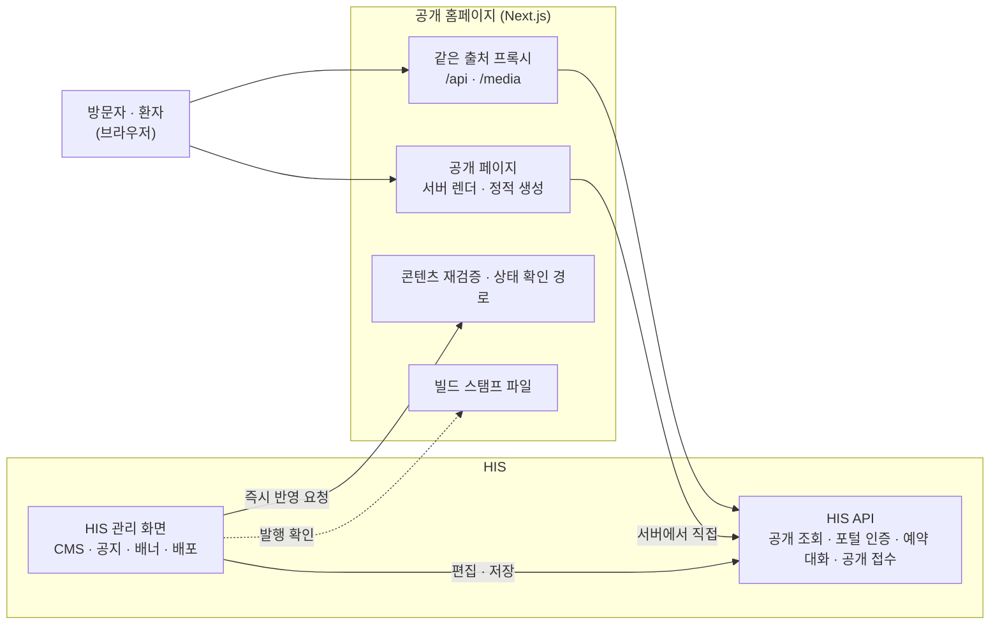

# 공개 홈페이지 — 시스템 구성서

> 기준 버전 **v4.18.0** · 기준 커밋 `e9d303984f80` · 구현 상태 `운영` — [매니페스트](../RELEASES/draft/manifest.md) 기준
> 사실 확인: 미확인 — 생태계 자료 측 조사 기준(시스템 담당 확인 전) · 새 설치본으로 따라가 보기 전

이 버전에서 무엇이 바뀌었는지는 [릴리즈 요약](../RELEASES/draft/systems/homepage.md)에 있습니다.

## 1. 정체성과 계층

- **정의**: 병원의 공개 웹사이트입니다. 병원 · 진료 · 검진 · 이용 안내를 보여 주고, AI 예약 도우미로 진료 예약을 돕습니다. 내용은 HIS 의 공개 API 와, HIS 관리 화면에서 편집한 CMS 콘텐츠를 읽어 그립니다.
- **계층**: ② 환자 접점. 구축 단계로는 [S2 환자 접점](../README.md#구축은-이렇게-진행됩니다)에서 세웁니다. HIS 가 먼저 있어야 합니다.
- **자리**: HIS 저장소 안의 별도 Next.js 앱(`apps/homepage`)이며 HIS 와 함께 릴리즈됩니다. 자기 데이터베이스가 없고, 모든 데이터를 HIS API 에서 받습니다.
- **격리 빌드**: 저장소의 공용 패키지를 직접 쓰지 않습니다. 필요한 정본(입력 정화 · 공개 조회 · 표현 프리셋 · AI 표기)은 앱 안에 복제본을 두고, 저장소 검사가 웹 정본과 어긋나면 실패합니다.
- **버전 표기**: HIS 와 같은 `HIS_VERSION`(v4.18.0)을 씁니다. 앱 패키지 선언(1.0.0)은 릴리즈마다 올리는 값이 아닙니다.

## 2. 구성도

형제 시스템과의 직접 연결은 없습니다. HIS 와의 연결 상태는 [7. 연동](#7-연동)에 있습니다.

## 3. 규모

| 항목(스냅샷 키) | 값 | 센 방법(요약) | 계측일 |
|---|---:|---|---|
| `systems.homepage.counts.pages` | 50 | `apps/homepage/**/page.tsx` 수 — HIS 저장소 정본 계측기 값을 옮김. HIS 웹 화면 수(450)에는 들어가지 않음 | 2026-09-11 |

원본과 규칙 전문: [`data/scale-snapshot.json`](../data/scale-snapshot.json) · 기준 커밋 `e9d303984f80`.

## 4. 핵심 기능

| 영역 | 무엇을 하나 |
|---|---|
| 병원 소개 | 병원 소개 · 시설 · 오시는 길 · 갤러리 · 사회공헌 · 병원 소식 · 채용 공고 · 사이트 검색 |
| 진료 안내 | 진료과 · 진료센터 · 의료진 소개(상세 포함) · 진료 일정표 · 비급여 항목 안내. 진료시간은 CMS 에 등록한 값을 읽고, 없을 때만 코드 기본값을 씁니다 |
| 건강검진 | 검진 프로그램 목록 · 상세 · 절차 · 자주 묻는 질문, 검진 수용 현황(로그인 없이 공개 전용 경로로 조회) |
| 예약(AI 보조) | AI 예약 도우미가 증상을 대화로 받아 진료과 **후보를 제안**하고 날짜 · 시간을 골라 예약까지 진행합니다. 본인 확인을 마친 환자에게는 자기 진료 · 검사 · 복약 · 수납 · 예약 요약 카드를 보여 줍니다(환자 포털 인증 사용) |
| 이용 안내 · 고객 지원 | 입원 · 제증명 · 식사 · 응급 · 장례 · 주차 · 환자 권리 · 면회 안내, 건강정보, 자주 묻는 질문 · 고객의 소리, 개인정보처리방침 · 이용약관 |
| 국제 진료 · 협력 | 해외 환자 보험 · 협력 기관 · 상호운용성(FHIR R4) 안내, 협력 기관 신청서(HIS 공개 접수 API 로 보내고 접수번호 안내), 영어 · 일본어 · 중국어 소개 페이지 |
| 운영 · 발행 | 콘텐츠 편집은 HIS 의 홈페이지 관리 화면(CMS · 공지 · 팝업 · 배너 · 미디어 라이브러리 · 검색 노출 설정)에서 합니다. 편집 화면이 "공개 화면 어디에 표시되는지"와 "공개 화면이 읽는데 비어 있는 항목"을 알려 줍니다. 발행은 HIS 관리 화면의 홈페이지 배포에서 사람이 하고, 반영 여부는 사이트에 실린 빌드 스탬프로 판정합니다. 사이트맵 · 검색엔진 안내 파일은 자동으로 만듭니다 |

## 5. 설치 요구사항

| 항목 | 내용 | 근거 |
|---|---|---|
| 런타임 | Node.js 22(컨테이너 이미지) · Next.js 15 | 앱 Dockerfile · `package.json` |
| 데이터베이스 · 캐시 | 없습니다. HIS API 가 있어야 합니다 | — |
| GPU | 필요 없습니다(예약 도우미의 AI 는 HIS 를 거쳐 AI Server 가 합니다) | — |
| 띄우는 방식 | 저장소에 컨테이너 이미지(Dockerfile) · 프로세스 관리자(pm2) 설정 · 관리형 호스팅용 빌드 설정이 함께 있습니다. 어느 쪽이든 Node 서버로 돕니다 | 앱 폴더의 설정 파일 |
| 네트워크 | 브라우저는 `/api` · `/media` 를 **상대 경로**로 부르고, 앱이 이를 HIS API 로 넘깁니다(같은 출처 · CORS 불필요). 서버 렌더는 HIS API 를 서버에서 직접 부릅니다. 넘길 대상 주소는 **빌드할 때 고정**되므로 기관마다 이미지를 따로 만듭니다 | `next.config.ts` · 환경 변수 예시 |
| 함께 설치해야 하는 것 | HIS(공개 API · 환자 포털 인증 · CMS) | [his.md](his.md) |

## 6. 주요 설정

값은 적지 않습니다. ✔ 는 **설치 전에 반드시 바꿀 것**입니다.

| 키 · 위치 | 뜻 | 기본값의 성격 | 설치 전 |
|---|---|---|:---:|
| `HOMEPAGE_API_ORIGIN` | `/api` · `/media` 를 넘길 HIS 주소 — **빌드 시점 값** | 예시 파일 · Dockerfile 기본값이 특정 설치본 주소 | ✔ |
| `INTERNAL_API_URL` | 서버 렌더가 HIS API 를 부르는 주소(서버 간) | 예시 파일이 특정 설치본 주소 | ✔ |
| `NEXT_PUBLIC_API_URL` | 브라우저에 노출되는 API 주소 | 빈 값으로 두어 상대 경로를 쓰게 합니다 | 확인 |
| `NEXT_PUBLIC_SITE_URL` · `NEXT_PUBLIC_PORTAL_URL` | 사이트 · 환자 포털의 공개 주소(사이트맵 · 링크) | 코드 기본값이 특정 설치본 주소 | ✔ |
| `HOMEPAGE_REVALIDATE_SECRET` | HIS 관리 화면이 부르는 콘텐츠 즉시 반영 요청의 비밀값(HIS 쪽 같은 이름의 키와 짝) | 비밀값 | ✔ |
| `PORT` · `HOSTNAME` · `NODE_ENV` · `NEXT_TELEMETRY_DISABLED` | Node 서버 실행 값 | 일반 값 | 확인 |
| 사이트 정보 상수(`apps/homepage/src/lib/site-info.ts`) | 병원 이름 · 연락처 · 주소 | **특정 기관 정보** — 코드 파일입니다 | ✔ |
| 페이지 소스의 기관 고유 문구 · 수치 | 소개 문구 등 | 특정 기관 내용 | ✔ |
| 진료시간 기본값(`apps/homepage/src/lib/clinic-hours.ts`) | CMS 에 진료시간이 없을 때 쓰는 값 | 코드 기본값 | 확인 |
| HIS CMS 콘텐츠(HIS 관리 화면) | 공개 화면이 읽는 콘텐츠 | 편집 화면의 "비어 있는 항목"을 채우지 않으면 자리가 비거나 기본 모양으로 나옵니다 | 채움 |

공용 표현 프리셋을 바꾸면 저장소 스크립트(`sync:cms-style`)로 복제본을 맞춥니다. 맞추지 않으면 대조 검사가 실패합니다.

## 7. 연동

[연결 상태](../RELEASES/draft/compatibility.md)에서 공개 홈페이지가 한쪽 끝인 행을 그대로 옮겼습니다. 실제 호출로 `검증됨` 을 붙인 연결은 **10개**입니다 — HIS → sign 직원 신원 · 서명 · sign → HIS 서명 완료 통지 · HIS → sign 오더 서명 로그 봉인 · HIS → LIS 검사 오더 전달 · LIS → HIS 환자 조회 · HIS → ERP 직원 SSO · HIS ⇄ edu 직원 SSO · 공개키 조회 · 직원 명부 · 이수 기록(새 설치본끼리 확인 2026-09-14).

<!-- 연결 상태 표에서 옮긴 부분: 시작 -->

합계: 나가는 연결 2(`구현·미검증` 2) · 들어오는 연결 0(없음)

### 나가는 연결

| 방향 | 목적 | 프로토콜 | 상태 |
|---|---|---|---|
| 공개 홈페이지 → HIS | 공개 정보 조회(병원 정보·진료과·의료진·센터·소식·건강정보·채용·팝업·검진 프로그램/수용량·비급여) 및 공개 접수(협력 신청·전원 요청) | REST(JSON) — SSR 은 INTERNAL_API_URL 로 서버에서 직접, 브라우저는 상대경로 `/… | `구현·미검증` |
| 공개 홈페이지 → HIS | 예약 — AI 예약 상담 세션·증상 목록·향상 예약 · 환자 포털 로그인과 본인 정보(프로필·예약·결과·처방·수납) 조회 | REST(JSON) `/api/v1/booking/*` · `/api/v1/portal/{auth,profi… | `구현·미검증` |

### 들어오는 연결

없습니다.

<!-- 연결 상태 표에서 옮긴 부분: 끝 -->

시스템 담당 확인을 기다리는 연결은 이 장에 싣지 않았습니다([연결 상태](../RELEASES/draft/compatibility.md)).

## 8. 표준과 규제

- 표준 프로토콜을 직접 쓰지 않습니다. HIS 의 REST(JSON) API 만 부릅니다. 상호운용성(FHIR R4) 안내 페이지는 HIS 의 기능을 소개하는 콘텐츠입니다.
- 입력 정화(XSS 방어) 모듈은 HIS 웹 정본의 복제본이며, 어긋나면 저장소 검사가 실패합니다.
- **개인정보처리방침 · 이용약관 · 비급여 고지** 페이지의 내용은 기관이 자기 규정에 맞게 씁니다. 의료광고 · 개인정보 규정의 판단은 구축 기관이 합니다.
- AI 예약 도우미의 진료과 제안은 참고 정보이며, 면책 문구가 함께 나옵니다([의료 면책 고지](../DISCLAIMER.md)).

## 9. AI 사용

- **AI 예약 도우미** — 증상 대화로 진료과 후보를 제안하는 것을 **보조**합니다. 예약 확정은 환자가 날짜 · 시간을 골라 합니다.
- AI 연산은 이 앱이 하지 않습니다. HIS 의 예약 대화 API 를 부르고, HIS 가 [AI Server](ai-server.md) 에 요청합니다. AI 를 켜고 끄는 스위치는 HIS 쪽에 있습니다([his.md §9](his.md#9-ai-사용)).
- 화면의 AI 표기는 `AI(WeRU.B)` 이고, 복제본이 HIS 정본과 같은지 저장소 검사가 확인합니다.

## 10. 한계와 대체 수단

| 한계 | 대체 수단 · 구축 기관이 할 일 |
|---|---|
| **기관 정보가 코드에 있습니다** — 병원 이름 · 연락처 · 주소는 사이트 정보 상수 파일에, 일부 소개 문구 · 수치는 페이지 소스에 있습니다. 병원명 고정 문자열이 든 파일이 이 앱에 36개입니다(2026-09-10 계측) | 코드를 고쳐 자기 기관 정보로 바꿉니다. 사이트 정보를 HIS 병원 정보 API 로 덮어쓰는 방식은 코드 주석상 향후 과제입니다 |
| **격리 빌드** — 대조 검사가 있는 모듈 밖의 페이지는 HIS 웹 쪽 수정이 자동으로 오지 않습니다 | 웹 쪽을 고칠 때 공개 사이트의 해당 페이지도 함께 봅니다 |
| **다국어** — 영어 · 일본어 · 중국어는 소개 페이지 한 장씩이고 나머지는 한국어입니다 | 필요한 언어의 페이지를 추가합니다 |
| **발행이 별도 경로**입니다 — HIS 웹 · API 배포와 따로, 사람이 발행합니다 | 발행 뒤 빌드 스탬프로 새 빌드가 실렸는지 확인합니다 |
| **HIS 주소가 빌드 시점에 고정**됩니다 | 기관 · 환경마다 이미지를 따로 빌드합니다 |

## 11. 소스 · 라이선스 표기 · 확인일

| 항목 | 값 |
|---|---|
| 소스 링크 | 정리 중 |
| 저장소 라이선스 표기 | 독점(`README.md`) — 목표는 MIT, 정리 전([매니페스트](../RELEASES/draft/manifest.md)) |
| 기준 커밋 | `e9d303984f80` (2026-09-11 · HIS 저장소 · [`data/base-commits.json`](../data/base-commits.json)) |
| 확인일 | 2026-09-11 — 기준 커밋의 앱 설정 파일 · 환경 변수 예시에서 **키 이름만** 읽었습니다 |
| 사실 확인 | 시스템 담당 확인 전 · 새 설치본으로 따라가 보기 전 |
