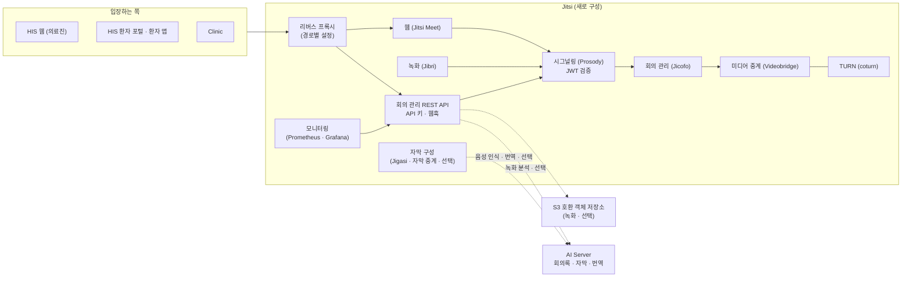

# Jitsi — 시스템 구성서

> 기준 버전 **1.0.0** · 기준 커밋 `0984fbec7177` · 구현 상태 `중단` — [매니페스트](../RELEASES/draft/manifest.md) 기준
> 사실 확인: 미확인 — 생태계 자료 측 조사 기준(시스템 담당 확인 전) · 새 설치본으로 따라가 보기 전

> **현재 설치본은 동작하지 않으며, 구축 기관은 새로 구성해야 합니다.** 이 장은 기준 커밋의 코드와 기록을 바탕으로 **새로 구성할 때 알아야 할 것**을 적습니다. 이 버전의 변경 내용은 [릴리즈 요약](../RELEASES/draft/systems/jitsi.md)에 있습니다.

## 1. 정체성과 계층

- **정의**: 원격진료 화상 서버입니다. 자체 호스팅하는 Jitsi Meet 구성(웹 · XMPP 시그널링 · 회의 관리 · 미디어 중계)에 TURN · 녹화 · 회의 관리 REST API · 모니터링을 더한 묶음입니다.
- **계층**: 협업 · 교육 계층(원격 상담). 구축 가이드에서 붙일 단계는 새로 구성하는 절차를 확인한 뒤 정합니다.
- **구현 상태**: `중단` — 연결 상태 표의 Jitsi 관련 연결도 모두 `중단`(설계 단계 1개 제외)입니다.
- **로그인 방식**: HIS 가 **공유 비밀키(HS256)** 로 서명한 JWT 로 방에 들어갑니다(의사 = 진행자 · 환자 = 게스트). 여러 시스템이 쓰는 공개키 검증 방식이 아니므로 **키 관리가 따로 필요합니다.** 회의 관리 API 는 API 키로 인증합니다.
- **버전 표기**: 코드 선언은 1.0.0 이고, 태그는 v2.10.0 까지 이어졌습니다(매니페스트 등급 `주요`). 공개 자료에 어느 표기를 쓸지는 시스템 담당 확인 뒤 정하며, 그 전까지 **1.0.0(코드 선언) · v2.10.0(태그)** 을 함께 적습니다.

## 2. 구성도

## 3. 규모

| 항목(스냅샷 키) | 값 | 센 방법(요약) | 계측일 |
|---|---:|---|---|
| `systems.jitsi.counts.containers` | 9 | 기본 구성 파일(`docker-compose.yml`)의 최상위 서비스 수(서비스 1개 = 컨테이너 1개 · 복제 설정 없음 전제). 선택 구성 파일에만 있는 서비스 2개(실시간 자막용)는 따로 셉니다 | 2026-09-11 |

원본과 규칙 전문: [`data/scale-snapshot.json`](../data/scale-snapshot.json) · 기준 커밋 `0984fbec7177`.

## 4. 핵심 기능

기준 커밋의 코드와 기록에 적힌 기능입니다. 현재 설치본에서 동작하는 것은 아닙니다.

| 영역 | 무엇을 하나 |
|---|---|
| 화상 진료 입장 | HIS 가 발급한 JWT 로 방에 들어가고, 시그널링 서버가 토큰을 검증한 뒤 입장을 허용합니다. 입장 전 화면에서 카메라 · 마이크 미리보기와 동의 절차를 거칩니다. 화면 문구는 한국어로 바꿔 두었습니다 |
| 회의 관리 API | 회의 예약 · 목록 · 설정 변경 · 종료 · 참가자 목록 · 내보내기 · 음소거 · 참가 토큰 발급 · 참가 URL 생성 · 녹화 시작 · 중지 · 상태. OpenAPI 문서가 함께 나옵니다. API 키마다 권한을 세 단계(`admin` · `operator` · `readonly`)로 나눕니다 |
| 이벤트 | 참가자 입장 · 퇴장과 회의 상태 변화를 감지해 기록하고 웹훅(회의 시작 · 종료 · 참가자 입장 · 퇴장 · 녹화 시작 · 완료)으로 알립니다 |
| 녹화 | 서버 쪽 녹화 · 녹화 관리 화면(검색 · 메모 · 태그) · 보존 기간이 지나면 자동 만료 · 녹화 보안 등급과 감사 로그 · 녹화 중 표시(진행자에게만) · 객체 저장소 업로드(선택) |
| AI 보조(선택 구성) | 녹화 회의록 · 요약 · 할 일 · 주요 장면 **초안** · 실시간 한국어 자막 · 영어 번역 자막 · 채팅 번역 병기 |
| 모니터링 | Prometheus 지표 · Grafana 대시보드(서비스 상태 · 사용량 · 녹화 저장 용량 · API 트래픽) · 알림 규칙 |
| 보호 장치 | TURN 중계의 내부망 접근 차단 · 웹훅 대상 제한(공개 https 호스트만) · JWT 알고리즘 고정 · 요청 속도 · 본문 크기 제한 · 컨테이너 자원 상한 |

## 5. 설치 요구사항

**새로 구성할 때의 요구사항**입니다. 현재 설치본을 되살리는 절차가 아닙니다.

| 항목 | 요구 |
|---|---|
| 구성 | Docker Compose — 기본 구성 파일로 9개 컨테이너(웹 · 시그널링 · 회의 관리 · 미디어 중계 · TURN · 녹화 · 회의 관리 API · Prometheus · Grafana). 실시간 자막은 별도 구성 파일을 겹쳐 켭니다(선택) |
| 이미지 판본 | Jitsi 구성요소 `stable-9823` · coturn 4.6 · Prometheus v2.54.1 · Grafana 11.2.0([THIRD_PARTY §1](../THIRD_PARTY.md#1-별도-서비스로-쓰는-제3자-서버)) |
| 런타임 | 회의 관리 API Node.js 20(컨테이너) · 자막 중계 Python 3.12(컨테이너 · 선택) |
| 네트워크 | 공개 도메인과 공인 주소가 필요합니다. 미디어 중계와 TURN 용 UDP · TCP 포트를 **방화벽의 모든 계층에서** 열어야 하며, 한쪽만 열면 3명 이상 통화에서 영상이 끊긴다고 저장소 문서가 적습니다. 포트 목록은 소스 저장소 README 에 있습니다 |
| 인증서 | TLS 인증서(자동 발급 또는 기관 인증서) |
| 녹화 | 녹화 컨테이너는 호스트의 사운드 장치와 추가 권한이 필요합니다. 녹화 파일 저장 공간(용량은 보존 기간에 따라 기관이 산정) |
| 리버스 프록시 | 저장소의 경로별 프록시 설정 파일을 기준으로 삼습니다(예전 설정 파일은 폐기 표시돼 있음). 관리용 대시보드는 기본으로 서버 안에서만 열립니다 |
| GPU | Jitsi 서버에는 필요 없습니다. 음성 인식 · 번역 · 회의록 연산은 AI Server 가 맡습니다(선택 구성) |
| 함께 준비할 것 | **HIS 쪽** — Jitsi 와 같은 JWT 공유 비밀키 · 화상 서버 주소 설정. **AI Server 쪽**(선택) — 호출 키 |

## 6. 주요 설정

설정 파일 `.env`(예시 `.env.example`)의 키 이름입니다. 구성요소 비밀번호를 만드는 스크립트가 저장소에 있습니다. 값은 자리표시로 생각하십시오.

| 묶음 | 키 | 뜻 | 설치 전 |
|---|---|---|---|
| 기본 | `JITSI_DOMAIN` · `PUBLIC_DOMAIN` · `PUBLIC_IP` · `TZ` | 공개 도메인 · 참가 URL 도메인 · 공인 주소 · 시간대 | **반드시 바꿀 것** |
| JWT 인증 | `ENABLE_AUTH` · `AUTH_TYPE` · `JWT_APP_ID` · `JWT_APP_SECRET` | 입장 인증 방식과 JWT 공유 비밀키. 비밀키는 HIS 쪽 값(`JITSI_JWT_SECRET`)과 같아야 합니다. 운영에서는 인증을 켭니다 | **반드시 바꿀 것** |
| 내부 비밀값 | `INTERNAL_SECRET` · `JICOFO_AUTH_PASSWORD` · `JVB_AUTH_PASSWORD` · `JIBRI_RECORDER_PASSWORD` · `JIBRI_XMPP_PASSWORD` · `JIGASI_XMPP_PASSWORD` · `XMPP_BOT_JID` · `XMPP_BOT_PASSWORD` | 내부 콜백 비밀값 · 구성요소 간 계정(스크립트로 생성) · 참가자 제어용 봇 계정 | **반드시 바꿀 것** |
| TURN | `TURN_HOST` · `TURN_PORT` · `TURNS_PORT` · `TURN_SECRET` | TURN 서버 주소 · 비밀값 | **반드시 바꿀 것** |
| TLS | `SSL_TYPE` · `LETSENCRYPT_EMAIL` · `SSL_CERT_PATH` · `SSL_KEY_PATH` | 인증서 발급 방식 · 연락처 · 기관 인증서 위치 | **반드시 바꿀 것** |
| 회의 관리 API | `API_KEY` · `CORS_ORIGINS` · `ENABLE_SWAGGER` · `RATE_LIMIT_ENABLED` · `RATE_LIMIT_WINDOW_MS` · `RATE_LIMIT_MAX` · `MAX_BODY_BYTES` | API 키 · 허용 출처(운영에서는 실제 도메인으로 제한) · 명세 화면 노출(운영은 끄기 권장) · 요청 한도 | **반드시 바꿀 것** |
| 성능 | `JVB_MAX_PARTICIPANTS` · `JVB_PORT` · `VIDEO_QUALITY` | 방당 최대 참가자 · 미디어 포트 · 화질 | 정할 것 |
| 녹화 | `ENABLE_RECORDING` · `RECORDING_DIR` · `DEFAULT_SECURITY_LEVEL` · `ACCESS_LOG_RETENTION_DAYS` | 녹화 사용 · 저장 위치 · 녹화 보안 등급 · 접근 기록 보존일 | 정할 것 |
| 녹화 외부 저장 | `S3_ENABLED` · `S3_ENDPOINT` · `S3_REGION` · `S3_BUCKET` · `S3_ACCESS_KEY` · `S3_SECRET_KEY` · `S3_PREFIX` | 객체 저장소 업로드(선택) | 쓰면 **반드시 바꿀 것** |
| 모니터링 | `GRAFANA_ADMIN_USER` · `GRAFANA_ADMIN_PASSWORD` · `ALERT_WEBHOOK_URL` · `PUBLIC_ALERT_SECRET` | 대시보드 관리자 계정 · 알림 전달 주소 · 알림 상세 링크 서명 값 | **반드시 바꿀 것** |
| AI(선택) | `AI_SERVER_URL` · `AI_API_KEY` · `AI_AUTO_ANALYZE` · `AI_CALLBACK_URL` | AI Server 주소 · 호출 키 · 녹화 자동 분석 여부 · 결과 콜백 주소 | 쓰면 **반드시 바꿀 것** |
| 자막(선택 구성) | `STT_TRANSLATE_ENABLED` · `STT_TRANSLATE_TARGETS` · `STT_MAX_SESSIONS` · `REALTIME_TRANSCRIPT_STORE` | 번역 자막 · 번역 언어 · 동시 전사 세션 상한 · 실시간 자막 저장 여부 | 정할 것 |

**운영 전에 정할 것** — 내부 콜백 비밀값 설정 · API 키 발급과 권한 · 녹화 보존 기간 · 녹화 외부 저장 여부. 인터페이스 설정 파일을 바꾸면 웹 컨테이너를 다시 만들어야 반영되고, 자막 구성을 쓰는 경우 두 구성 파일을 함께 지정해 다시 만듭니다.

## 7. 연동

연결 상태는 [연결 상태](../RELEASES/draft/compatibility.md)에서 가져왔습니다(코드 대조 · 2026-09-11 · 실제 호출 확인 전).

**들어오는 연결 6 · 나가는 연결 2** — `중단` 7 · `설계만` 1

| 방향 | 목적(요약) | 상태 |
|---|---|---|
| HIS → Jitsi | 원격진료 화상 입장(의료진) — HIS 가 JWT 를 서명해 방 주소와 함께 엶 | `중단` |
| HIS 환자 포털(웹) → Jitsi | 환자 화상 입장 — 원격진료 · 원격협진 · 상담 | `중단` |
| HIS 웹 → Jitsi | 원격진료 녹화 목록 · 메모 · 삭제 · 다운로드 | `중단` |
| 환자 앱 → Jitsi | 환자 앱 원격진료 입장(대기실 입장 기록 후 화상 주소 열기) | `중단` |
| Clinic → Jitsi | 회의 녹화 제어 · 녹화 스트림 · 회의 분석 | `중단` |
| HIS → Clinic · Jitsi | HIS 내부 신원 제공자의 단기 토큰 | `설계만` |
| Jitsi → AI Server | 원격 상담 녹화 회의록 분석 | `중단` |
| Jitsi → AI Server | 원격 상담 실시간 자막 · 자막 번역 | `중단` |

시스템 담당 확인을 기다리는 연결은 이 장에 싣지 않았습니다([연결 상태](../RELEASES/draft/compatibility.md)).

새로 구성한 뒤에는 위 연결을 하나씩 실제로 호출해 상태를 다시 판정합니다.

## 8. 표준과 규제

- **표준**: WebRTC · XMPP · JWT(HS256 고정) · TURN/STUN · OpenAPI(회의 관리 API) · Prometheus 지표.
- **규제 표기**: 저장소 기록에서 원격진료 관련 규제 대응 표기를 찾지 못했습니다. 원격진료 허용 범위 · 녹화 보존 · 동의는 나라마다 규정이 다르므로 구축 기관이 판단합니다([의료 면책 고지](../DISCLAIMER.md)).

## 9. AI 사용

- **선택 구성**입니다. 켜지 않으면 Jitsi 는 AI 없이 화상 서버로만 동작하도록 구성돼 있습니다.
- **무엇을 돕나** — 녹화를 AI Server 로 보내 녹취록 · 요약 · 할 일 · 주요 장면의 **초안**을 받습니다. 실시간 자막(한국어 음성 인식) · 영어 번역 자막 · 채팅 번역 병기를 켤 수 있습니다.
- **연산 위치** — 음성 인식 · 번역 · 회의록 연산은 기관 안의 AI Server 가 맡습니다. 동시에 전사할 수 있는 세션 수에 상한이 있습니다.
- **초안 · 사람 확인** — AI 산출물은 초안이며, 진료기록으로 옮길지는 의료진이 정합니다.
- **모델 약관** — AI Server 가 쓰는 음성 인식 · 요약 모델의 약관은 [THIRD_PARTY §3](../THIRD_PARTY.md#3-ai-모델-가중치)에 있습니다.

## 10. 한계와 대체 수단

| 한계 | 대체 수단 · 준비 |
|---|---|
| **현재 설치본은 동작하지 않습니다** | 원격진료가 필요한 기관은 이 장의 요구사항으로 새로 구성합니다. 새로 구성하는 절차는 확인해 [구축 가이드](../build-guide/)에 싣습니다 |
| 로그인이 공유 비밀키(HS256) 방식이라 HIS · Jitsi · 회의 관리 API 세 곳이 같은 비밀키를 가져야 합니다 | 비밀키 보관 · 교체 절차와 담당자를 정해 둡니다 |
| 모바일 웹 지원이 보류돼 있고 차단된 상태입니다 | 모바일 환자 입장 방법은 새로 구성할 때 정합니다(환자 앱 → Jitsi 연결도 `중단`) |
| 실시간 자막 · 번역은 시험 구현에서 시작한 선택 구성입니다. 무음 구간 오인식 완화가 남은 과제로 적혀 있습니다 | 자막은 보조로만 씁니다 |
| README 의 릴리즈 표가 v2.3.0 에서 멈춰 있습니다 | 버전은 태그와 [릴리즈 요약](../RELEASES/draft/systems/jitsi.md)을 기준으로 봅니다 |

## 11. 소스 · 라이선스 표기 · 확인일

- **소스 링크**: 정리 중
- **저장소 라이선스 표기**: 표기 없음 — [매니페스트](../RELEASES/draft/manifest.md) 기준(생태계 소프트웨어는 MIT 로 제공하는 것이 목표이며 표기는 정리 중입니다)
- **제3자 구성요소**: [THIRD_PARTY.md](../THIRD_PARTY.md) — Jitsi Meet · Jicofo · Videobridge · Jibri · Jigasi(Apache-2.0) · Prosody(MIT) · coturn(BSD-3-Clause) · Prometheus(Apache-2.0) · Grafana(AGPL-3.0-only)
- **확인일**: 2026-09-11 — 기준 커밋 `0984fbec7177` 의 설정 예시 · 구성 파일 · 저장소 문서를 읽어 작성했습니다
